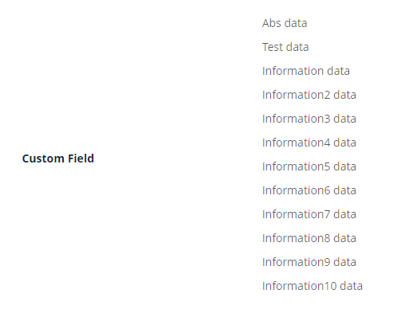
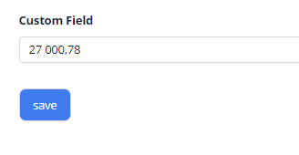

# Multivalue

`Multivalue` is a component that allows to select multiple values from Popup List of entities

## Basics
[:material-play-circle: Live Sample]({{ external_links.code_samples }}/ui/#/screen/NumberBasic){:target="_blank"} ·
[:fontawesome-brands-github: GitHub]({{ external_links.github_ui }}/{{ external_links.github_branch }}/src/main/java/org/demo/documentation/money/basic){:target="_blank"}
### How does it look?

=== "List widget"
    
=== "Info widget"
    
=== "Form widget"
    


### How to add?

??? Example

    **Step1** Add field **List** to corresponding **BaseEntity**.

    ```java
    public class MyEntity extends BaseEntity {
   
        @Column
            @JoinTable(name = "MyEntity_MyEntityMultivalue",
            joinColumns = @JoinColumn(name = "MyEntity_id"),
            inverseJoinColumns = @JoinColumn(name = "MyEntityMultivalue_id")
        )
        @ManyToMany(cascade = {CascadeType.PERSIST, CascadeType.MERGE})
        private List<MyEntityMultivalue> customFieldList = new ArrayList<>();
        }
    ```

    **Step 3** Add field **MultivalueField** to corresponding **DataResponseDTO**.

    ```java
    public class MyExampleDTO extends DataResponseDTO {
       @SearchParameter(name = "customFieldList.id", provider = LongValueProvider.class)
        private MultivalueField customField;
        private String customFieldCalc;

        public MyExampleDTO(MyEntity entity) {
            this.customField = entity.getCustomFieldList().stream().collect(MultivalueField.toMultivalueField(
                    e -> String.valueOf(e.getId()),
                    MyEntityMultivalue::getCustomField
            ));
            this.customFieldCalc =  StringUtils.abbreviate(entity.getCustomFieldList().stream().map(MyEntity::getCustomField
                  ).collect(Collectors.joining(",")), 12);
    }
    ```

    **Step4** Add bc **MyEntityMultivalueAssocListPopup** to corresponding **EnumBcIdentifier**.

    ```java
    public enum PlatformMyExampleController implements EnumBcIdentifier {
        myExampleBc(MyExampleService.class), myEntityMultivalueAssocListPopup(myExampleBc, MyEntityMultivalueService.class);
    ```
    === "List widget"
        **Step 5** Add popupBcName and assocValueKey to **_.widget.json_**.

        `popupBcName` - name bc Step 1.6.AssocListPopup

        `assocValueKey` - field for opening AssocListPopup

        `displayedKey` - calculated field for displaing data on List widget

        ```json
        {
          "name": "MyExampleList",
          "title": "List title",
          "type": "List",
          "bc": "myExampleBc",
          "fields": [
            {
              "title": "Custom Field",
              "key": "customField",
              "type": "multivalue",
              "popupBcName": "myEntityMultivalueAssocListPopup",
              "assocValueKey": "customField",
              "displayedKey": "customFieldCalc"
            }
          ]
        }      
        ```

    === "Info widget"
        **Step 5** Add to **_.widget.json_**.
        ```json
        {
          "name": "MyExampleInfo",
          "title": "Info title",
          "type": "Info",
          "bc": "myExampleBc",
          "fields": [
            {
              "label": "Custom Field",
              "key": "customField",
              "type": "multivalue",
              "popupBcName": "myEntityAssocListPopup",
              "assocValueKey": "customField"
            }
          ],
          "options": {
            "layout": {
              "rows": [
                {
                  "cols": [
                    {
                      "fieldKey": "customField",
                      "span": 12
                    }
                  ]
                }
              ]
            }
          }
        }
        ```
    === "Form widget"
        **Step 5** Add popupBcName and assocValueKey to **_.widget.json_**.

        `popupBcName` - name bc Step 1.6.AssocListPopup

        `assocValueKey' - field for open AssocListPopup

        ```json
        {
          "name": "MyExampleForm",
          "title": "Form title",
          "type": "Form",
          "bc": "myExampleBc",
          "fields": [
            {
              "label": "Custom Field",
              "key": "customField",
              "type": "multivalue",
              "popupBcName": "myEntityMultivalueAssocListPopup",
              "assocValueKey": "customField"
            }
          ],
          "options": {
            "layout": {
              "rows": [
                {
                  "cols": [
                    {
                      "fieldKey": "customField",
                      "span": 12
                    }
                  ]
                }
              ]
            }
          }
        }
        ```


## Placeholder
[:material-play-circle: Live Sample]({{ external_links.code_samples }}/ui/#/screen/NumberPlaceholder){:target="_blank"} ·
[:fontawesome-brands-github: GitHub]({{ external_links.github_ui }}/{{ external_links.github_branch }}/src/main/java/org/demo/documentation/money/placeholder){:target="_blank"}
`Placeholder` allows you to provide a concise hint, guiding users on the expected value. This hint is displayed before any user input. It can be calculated based on business logic of application

### How does it look?
=== "List widget"
    _not applicable_
=== "Info widget"
    _not applicable_
=== "Form widget"
    

### How to add?
??? Example
    Add **fields.setPlaceholder** to corresponding **FieldMetaBuilder**.

    ```java

    public class MyExampleMeta extends FieldMetaBuilder<MyExampleDTO> {
    
      @Override
      public void buildRowDependentMeta(RowDependentFieldsMeta<MyExampleDTO> fields, InnerBcDescription bcDescription,
        Long id, Long parentId) {
        fields.setPlaceholder(MyExampleDTO_.customField, "Placeholder text"));
      }
    ```
    === "List widget"
        **_not applicable_**
    === "Info widget"
        **_not applicable_**
    === "Form widget"
        **Works for Form.**


## Color
`Color` allows you to specify a field color. It can be calculated based on business logic of application

`Calculated color`:
[:material-play-circle: Live Sample]({{ external_links.code_samples }}/ui/#/screen/NumberColor){:target="_blank"} ·
[:fontawesome-brands-github: GitHub]({{ external_links.github_ui }}/{{ external_links.github_branch }}/src/main/java/org/demo/documentation/money/color){:target="_blank"}

`Constant color`:
[:material-play-circle: Live Sample]({{ external_links.code_samples }}/ui/#/screen/myexample60){:target="_blank"} ·
[:fontawesome-brands-github: GitHub]({{ external_links.github_ui }}/{{ external_links.github_branch }}/src/main/java/org/demo/documentation/money/colorconst){:target="_blank"}

### How does it look?
=== "List widget"
    
=== "Info widget"
    _not applicable_
=== "Form widget"
    _not applicable_


### How to add?
??? Example
    === "Calculated color"
        [:material-play-circle: Live Sample]({{ external_links.code_samples }}/ui/#/screen/NumberColor){:target="_blank"} ·
        [:fontawesome-brands-github: GitHub]({{ external_links.github_ui }}/{{ external_links.github_branch }}/src/main/java/org/demo/documentation/money/color){:target="_blank"}


        **Step 1**   Add `custom field for color` to corresponding **DataResponseDTO**. The field can contain a HEX color or be null. 
    
        ```java
        public class MyExampleDTO extends DataResponseDTO {

           @SearchParameter(name = "customFieldList.id", provider = LongValueProvider.class)
            private MultivalueField customField;
            private String customFieldColor;
            private String customFieldCalc;
            public MyExampleDTO(MyEntity entity) {
                this.customField = entity.getCustomFieldList().stream().collect(MultivalueField.toMultivalueField(
                        e -> String.valueOf(e.getId()),
                        MyEntityMultivalue::getCustomField
                ));
                this.customFieldColor = "#eda6a6";
                this.customFieldCalc =  StringUtils.abbreviate(entity.getCustomFieldList().stream().map(MyEntity::getCustomField
                      ).collect(Collectors.joining(",")), 12);
        }

        ```
        === "List widget"   
            **Step 2** Add **"bgColorKey"** :  `custom field for color`  to .widget.json.
            ```json
            {
              "name": "MyExampleList",
              "title": "List title",
              "type": "List",
              "bc": "myExampleBc",
              "fields": [
                {
                  "title": "Custom Field",
                  "key": "customField",
                  "type": "multivalue",
                  "popupBcName": "myEntityAssocListPopup",
                  "assocValueKey": "customField",
                  "displayedKey": "customFieldCalc",
                  "bgColorKey": "customFieldColor"
                }
              ]
            }
            ```
        === "Info widget"
            _not applicable_
        === "Form widget"
            _not applicable_

    === "Constant color"
        [:material-play-circle: Live Sample]({{ external_links.code_samples }}/ui/#/screen/myexample60){:target="_blank"} ·
        [:fontawesome-brands-github: GitHub]({{ external_links.github_ui }}/{{ external_links.github_branch }}/src/main/java/org/demo/documentation/money/colorconst){:target="_blank"}

        === "List widget" 
            Add **"bgColor"** :  `HEX color`  to .widget.json.
            ```json
            {
              "name": "MyExampleList",
              "title": "List title",
              "type": "List",
              "bc": "myExampleBc",
              "fields": [
                {
                  "title": "Custom Field",
                  "key": "customField",
                  "type": "multivalue",
                  "popupBcName": "myEntityAssocListPopup",
                  "assocValueKey": "customField",
                  "bgColor": "#eda6a6",
                  "displayedKey": "customFieldCalc"
                }
              ]
            }
            ```

        === "Info widget"
            _not applicable_
        === "Form widget"
            _not applicable_
## Readonly/Editable
`Readonly/Editable` indicates whether the field can be edited or not. It can be calculated based on business logic of application

`Editable`
[:material-play-circle: Live Sample]({{ external_links.code_samples }}/ui/#/screen/InputBasic){:target="_blank"} ·
[:fontawesome-brands-github: GitHub]({{ external_links.github_ui }}/{{ external_links.github_branch }}/src/main/java/org/demo/documentation/input/basic){:target="_blank"}

`Readonly`
[:material-play-circle: Live Sample]({{ external_links.code_samples }}/ui/#/screen/InputCreateEdit){:target="_blank"} ·
[:fontawesome-brands-github: GitHub]({{ external_links.github_ui }}/{{ external_links.github_branch }}/src/main/java/org/demo/documentation/input/ro){:target="_blank"}


### How does it look?
=== "Editable List widget"
    _not applicable_
=== "Editable Info widget"
    _not applicable_
=== "Editable Form widget"
    


### How to add?
??? Example
    === "Editable"
    [:material-play-circle: Live Sample]({{ external_links.code_samples }}/ui/#/screen/NumberBasic){:target="_blank"} ·
    [:fontawesome-brands-github: GitHub]({{ external_links.github_ui }}/{{ external_links.github_branch }}/src/main/java/org/demo/documentation/money/basic){:target="_blank"} 
        **Step1** Add mapping DTO->entity to corresponding **VersionAwareResponseService**.
            ```java
            protected ActionResultDTO<MyExampleDTO> doUpdateEntity(MyEntity entity, MyExampleDTO data, BusinessComponent bc) {
                if (data.isFieldChanged(MyExampleDTO_.customField)) {
                    entity.getCustomFieldList().clear();
                    entity.getCustomFieldList().addAll(data.getCustomField().getValues().stream()
                    .map(MultivalueFieldSingleValue::getId)
                    .filter(Objects::nonNull)
                    .map(Long::parseLong)
                    .map(e -> entityManager.getReference(MyEntityMultivalue.class, e))
                    .collect(Collectors.toList()));
                }
            return new ActionResultDTO<>(entityToDto(bc, entity));
            ```

        **Step2** Add **fields.setEnabled** to corresponding **FieldMetaBuilder**.
    
        ```java
        public class MyExampleMeta extends FieldMetaBuilder<MyExampleDTO> {
    
        @Override
        public void buildRowDependentMeta(RowDependentFieldsMeta<MyExampleDTO> fields, InnerBcDescription bcDescription,
                                          Long id, Long parentId) {
          fields.setEnabled(MyExampleDTO_.customField);
        }
        ```
        === "List widget"
            **_not applicable_**
        === "Info widget"
            **_not applicable_**
        === "Form widget"
            **Works for Form.**
   
    === "Readonly"
    
        **Option 1** Enabled by default.
    
        ```java
        public class MyExampleMeta extends FieldMetaBuilder<MyExampleDTO> {
            public void buildRowDependentMeta(RowDependentFieldsMeta<MyExampleDTO> fields, InnerBcDescription bcDescription, Long id, Long parentId) {
            }
        }
        ```
    
        **Option 2** `Not recommended.` Property fields.setDisabled() overrides the enabled field if you use after property fields.setEnabled.
        === "List widget"
            **_not applicable_**
        === "Info widget"
            **_not applicable_**
        === "Form widget"
            **Works for Form.**

## Filtering
**_not applicable_**

## Drilldown
**_not applicable_**

## Validation
`Validation` allows you to check any business rules for user-entered value. There are types of validation:

1) Exception:Displays a message to notify users about technical or business errors.

   `Business Exception`:
   [:material-play-circle: Live Sample]({{ external_links.code_samples }}/ui/#/screen/myexample67/view/myexample67list){:target="_blank"} ·
   [:fontawesome-brands-github: GitHub]({{ external_links.github_ui }}/{{ external_links.github_branch }}/src/main/java/org/demo/documentation/money/validationbusinessex){:target="_blank"}

   `Runtime Exception`:
   [:material-play-circle: Live Sample]({{ external_links.code_samples }}/ui/#/screen/myexample69){:target="_blank"} ·
   [:fontawesome-brands-github: GitHub]({{ external_links.github_ui }}/{{ external_links.github_branch }}/src/main/java/org/demo/documentation/money/validationruntimeex){:target="_blank"}
   
2) Confirm: Presents a dialog with an optional message, requiring user confirmation or cancellation before proceeding.

   [:material-play-circle: Live Sample]({{ external_links.code_samples }}/ui/#/screen/myexample68){:target="_blank"} ·
   [:fontawesome-brands-github: GitHub]({{ external_links.github_ui }}/{{ external_links.github_branch }}/src/main/java/org/demo/documentation/money/validationconfirm){:target="_blank"}

3) Field level validation: shows error next to all fields, that validation failed for

   `Option 1`:
   [:material-play-circle: Live Sample]({{ external_links.code_samples }}/ui/#/screen/myexample68){:target="_blank"} ·
   [:fontawesome-brands-github: GitHub]({{ external_links.github_ui }}/{{ external_links.github_branch }}/src/main/java/org/demo/documentation/money/validationannotation){:target="_blank"}

   `Option 2`:
   [:material-play-circle: Live Sample]({{ external_links.code_samples }}/ui/#/screen/myexample68){:target="_blank"} ·
   [:fontawesome-brands-github: GitHub]({{ external_links.github_ui }}/{{ external_links.github_branch }}/src/main/java/org/demo/documentation/money/validationconfirm){:target="_blank"}


### How does it look?
=== "List widget"
    === "BusinessException"
        
    === "RuntimeException"
        
    === "Confirm"
        
    === "Field level validation"
        
=== "Info widget"
    _not applicable_
=== "Form widget"
    === "BusinessException"
        
    === "RuntimeException"
        
    === "Confirm"
        
    === "Field level validation"
        


### How to add?
??? Example
    === "BusinessException"
        `BusinessException` describes an error  within a business process.

        Add **BusinessException** to corresponding **VersionAwareResponseService**.

        ```java
        public class MyExampleService extends VersionAwareResponseService<MyExampleDTO, MyEntity> {
 
            @Override
            protected ActionResultDTO<MyExampleDTO> doUpdateEntity(MyEntity entity, MyExampleDTO data, BusinessComponent bc) {
                if (data.isFieldChanged(MyExampleDTO_.customFieldId)) {
                    entity.setCustomFieldEntity(data.getCustomFieldId() != null
                            ? entityManager.getReference(MyEntityMultivalue.class, data.getCustomFieldId())
                            : null);
                    if (StringUtils.isNotEmpty(data.getCustomField())
                            && !String.valueOf(data.getCustomField()).matches("[A-Za-z]+")
                    ) {
                        throw new BusinessException().addPopup("The field 'customField' can contain only letters.");
                    }
                }
                return new ActionResultDTO<>(entityToDto(bc, entity));
            }              
        ```
        === "List widget"
            **Works for List.**
        === "Info widget"
            **_not applicable_**
        === "Form widget"
            **Works for Form.**
    === "RuntimeException"

        `RuntimeException` describes technical error  within a business process.
        
        Add **RuntimeException** to corresponding **VersionAwareResponseService**.
        
        ```java
            @Override
            protected ActionResultDTO<MyExampleDTO> doUpdateEntity(MyEntity entity, MyExampleDTO data, BusinessComponent bc) {
                   try {
                       //call custom function
                   }
                   catch(Exception e){
                        throw new RuntimeException("An unexpected error has occurred.");
                    }
                }
                return new ActionResultDTO<>(entityToDto(bc, entity));
            }
        ```    
        === "List widget"
            **Works for List.**
        === "Info widget"
            **_not applicable_**
        === "Form widget"
            **Works for Form.**
    === "Confirm"
        Add [PreAction.confirm](/advancedCustomization_validation) to corresponding **VersionAwareResponseService**.
        ```java
     
            public class MyExampleService extends VersionAwareResponseService<MyExampleDTO, MyEntity> {

                @Override
                public Actions<MyExampleDTO> getActions() {
                    return Actions.<MyExampleDTO>builder()
                    .newAction()
                    .action("save", "save")
                    .withPreAction(PreAction.confirm("You want to save the value 'customField'?"))
                    .add()
                    .build();
                }
            }
        ```
        === "List widget"
            **Works for List.**
        === "Info widget"
            **_not applicable_**
        === "Form widget"
            **Works for Form.**

## Sorting
**_not applicable_**

## Required
[:material-play-circle: Live Sample]({{ external_links.code_samples }}/ui/#/screen/myexample68){:target="_blank"} ·
[:fontawesome-brands-github: GitHub]({{ external_links.github_ui }}/{{ external_links.github_branch }}/src/main/java/org/demo/documentation/money/required){:target="_blank"}

`Required` allows you to denote, that this field must have a value provided. 

### How does it look?
=== "List widget"
    _not applicable_
=== "Info widget"
    _not applicable_
=== "Form widget"
    
### How to add?
??? Example
    Add **fields.setRequired** to corresponding **FieldMetaBuilder**.

    ```java

    public class MyExampleMeta extends FieldMetaBuilder<MyExampleDTO> {
    
      @Override
      public void buildRowDependentMeta(RowDependentFieldsMeta<MyExampleDTO> fields, InnerBcDescription bcDescription,
        Long id, Long parentId) {
        fields.setEnabled(MyExampleDTO_.customField);
        fields.setRequired(MyExampleDTO_.customField);
      }
    ```
    === "List widget"
        **_not applicable_**
    === "Info widget"
        **_not applicable_**
    === "Form widget"
        **Works for Form.**


