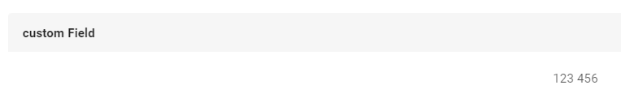
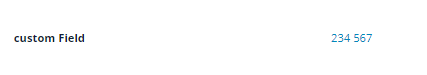

# Number

`Number` is a component for numbers editing. It is used to input and present numbers and automatically restricts user input to numeric values only.

## Basics
[:material-play-circle: Live Sample]({{ external_links.code_samples }}/ui/#/screen/NumberBasic){:target="_blank"} ·
[:fontawesome-brands-github: GitHub]({{ external_links.github_ui }}/{{ external_links.github_branch }}/src/main/java/org/demo/documentation/fields/number/basic){:target="_blank"}

### How does it look?

=== "List widget"
    
=== "Info widget"
    
=== "Form widget"
    


### How to add?
??? Example
    One will usually use  **Long**,  **Double** or  **BigDecimal** java types in DTO and Entity for storing this field type. 

    Next example shows  **Long ** usage:

    **Step1**  Add **Long** field to corresponding **BaseEntity**.

    ```java
    --8<--
    {{ external_links.github_raw_doc }}/fields/number/basic/NumberBasicEntity.java
    --8<--
    ```

    **Step2** Add **Long** field to corresponding **DataResponseDTO**.

    ```java
    --8<--
    {{ external_links.github_raw_doc }}/fields/number/basic/NumberBasicDTO.java
    --8<--
    ```

    === "List widget"
        **Step3** Add to **_.widget.json_**.

        ```json
        --8<--
        {{ external_links.github_raw_doc }}/fields/number/basic/NumberBasicList.widget.json
        --8<--
        ```
    === "Info widget"
        **Step3** Add to **_.widget.json_**.
        
        ```json
        --8<--
        {{ external_links.github_raw_doc }}/fields/number/basic/NumberBasicInfo.widget.json
        --8<--
        ```

    === "Form widget"

        **Step3** Add to **_.widget.json_**.

        ```json
        --8<--
        {{ external_links.github_raw_doc }}/fields/number/basic/NumberBasicForm.widget.json
        --8<--
        ```    

    [:material-play-circle: Live Sample]({{ external_links.code_samples }}/ui/#/screen/NumberBasic){:target="_blank"} ·
    [:fontawesome-brands-github: GitHub]({{ external_links.github_ui }}/{{ external_links.github_branch }}/src/main/java/org/demo/documentation/fields/number/basic){:target="_blank"}

## Placeholder
[:material-play-circle: Live Sample]({{ external_links.code_samples }}/ui/#/screen/NumberPlaceholder){:target="_blank"} ·
[:fontawesome-brands-github: GitHub]({{ external_links.github_ui }}/{{ external_links.github_branch }}/src/main/java/org/demo/documentation/fields/number/placeholder){:target="_blank"}

`Placeholder` allows you to provide a concise hint, guiding users on the expected value. This hint is displayed before any user input. It can be calculated based on business logic of application
### How does it look?
=== "List widget"
     
=== "Info widget"
    _not applicable_
=== "Form widget"
    
### How to add?
??? Example
    Add **fields.setPlaceholder** to corresponding **FieldMetaBuilder**.

    ```java
    --8<--
    {{ external_links.github_raw_doc }}/fields/number/placeholder/NumberPlaceholderMeta.java:buildRowDependentMeta
    --8<--
    ``` 
    === "List widget"
        **Works for List.**
    === "Info widget"
        **_not applicable_**
    === "Form widget"
        **Works for Form.**

    [:material-play-circle: Live Sample]({{ external_links.code_samples }}/ui/#/screen/NumberPlaceholder){:target="_blank"} ·
    [:fontawesome-brands-github: GitHub]({{ external_links.github_ui }}/{{ external_links.github_branch }}/src/main/java/org/demo/documentation/fields/number/placeholder){:target="_blank"}

## Color
`Color` allows you to specify a field color. It can be calculated based on business logic of application

**Calculated color**

[:material-play-circle: Live Sample]({{ external_links.code_samples }}/ui/#/screen/NumberColor){:target="_blank"} ·
[:fontawesome-brands-github: GitHub]({{ external_links.github_ui }}/{{ external_links.github_branch }}/src/main/java/org/demo/documentation/fields/number/color){:target="_blank"}

**Constant color**

[:material-play-circle: Live Sample]({{ external_links.code_samples }}/ui/#/screen/NumberColorConst){:target="_blank"} ·
[:fontawesome-brands-github: GitHub]({{ external_links.github_ui }}/{{ external_links.github_branch }}/src/main/java/org/demo/documentation/fields/number/colorconst){:target="_blank"}

### How does it look?
=== "List widget"
    
=== "Info widget"
    
=== "Form widget"
    


### How to add?
??? Example
    === "Calculated color"

        **Step 1**   Add `custom field for color` to corresponding **DataResponseDTO**. The field can contain a HEX color or be null. The field can contain a HEX color or be null. 
        ```java
        --8<--
        {{ external_links.github_raw_doc }}/fields/number/color/NumberColorDTO.java
        --8<--
        ```    
 
        === "List widget"   
            **Step 2** Add **"bgColorKey"** :  `custom field for color`  to .widget.json.
            ```json
            --8<--
            {{ external_links.github_raw_doc }}/fields/number/color/NumberColorList.widget.json
            --8<--
            ```
 
        === "Info widget"
            **Step 2** Add **"bgColorKey"** :  `custom field for color`  to .widget.json.
            ```json
            --8<--
            {{ external_links.github_raw_doc }}/fields/number/color/NumberColorInfo.widget.json
            --8<--
            ```
 
        === "Form widget"
            **Step 2** Add **"bgColorKey"** :  `custom field for color`  to .widget.json.
            ```json
            --8<--
            {{ external_links.github_raw_doc }}/fields/number/color/NumberColorForm.widget.json
            --8<--
            ```

        [:material-play-circle: Live Sample]({{ external_links.code_samples }}/ui/#/screen/NumberColor){:target="_blank"} ·
        [:fontawesome-brands-github: GitHub]({{ external_links.github_ui }}/{{ external_links.github_branch }}/src/main/java/org/demo/documentation/fields/number/color){:target="_blank"}

    === "Constant color"
        === "List widget" 
            Add **"bgColor"** :  `HEX color`  to .widget.json.
            ```json
            --8<--
            {{ external_links.github_raw_doc }}/fields/number/colorconst/NumberColorConstList.widget.json
            --8<--
            ```
 
        === "Info widget"
            Add **"bgColor"** :  `HEX color`  to .widget.json.
            ```json
            --8<--
            {{ external_links.github_raw_doc }}/fields/number/colorconst/NumberColorConstInfo.widget.json
            --8<--
            ```

        === "Form widget"
            Add **"bgColor"** :  `HEX color`  to .widget.json.  
            ```json
            --8<--
            {{ external_links.github_raw_doc }}/fields/number/colorconst/NumberColorConstForm.widget.json
            --8<--
            ```

        [:material-play-circle: Live Sample]({{ external_links.code_samples }}/ui/#/screen/NumberColorConst){:target="_blank"} ·
        [:fontawesome-brands-github: GitHub]({{ external_links.github_ui }}/{{ external_links.github_branch }}/src/main/java/org/demo/documentation/fields/number/colorconst){:target="_blank"}

## Readonly/Editable
`Readonly/Editable` indicates whether the field can be edited or not. It can be calculated based on business logic of application

`Editable`
[:material-play-circle: Live Sample]({{ external_links.code_samples }}/ui/#/screen/NumberBasic){:target="_blank"} ·
[:fontawesome-brands-github: GitHub]({{ external_links.github_ui }}/{{ external_links.github_branch }}/src/main/java/org/demo/documentation/fields/number/basic){:target="_blank"}

`Readonly`
[:material-play-circle: Live Sample]({{ external_links.code_samples }}/ui/#/screen/NumberCreateEdit){:target="_blank"} ·
[:fontawesome-brands-github: GitHub]({{ external_links.github_ui }}/{{ external_links.github_branch }}/src/main/java/org/demo/documentation/fields/number/ro){:target="_blank"}

### How does it look?
=== "Editable"
    === "List widget"
        
    === "Info widget"
        _not applicable_
    === "Form widget"
        
=== "Readonly"
    === "List widget"
        
    === "Info widget"
        
    === "Form widget"
        

### How to add?
??? Example
    === "Editable"
        **Step1** Add mapping DTO->entity to corresponding **VersionAwareResponseService**.
        ```java
        --8<--
        {{ external_links.github_raw_doc }}/fields/number/basic/NumberBasicService.java:doUpdateEntity
        --8<--
        ```
 
        **Step2** Add **fields.setEnabled** to corresponding **FieldMetaBuilder**.
        ```java
        --8<--
        {{ external_links.github_raw_doc }}/fields/number/basic/NumberBasicMeta.java:buildRowDependentMeta
        --8<--
        ```    
 
        === "List widget"
            **Works for List.**
        === "Info widget"
            **_not applicable_**
        === "Form widget"
            **Works for Form.**

        [:material-play-circle: Live Sample]({{ external_links.code_samples }}/ui/#/screen/NumberBasic){:target="_blank"} ·
        [:fontawesome-brands-github: GitHub]({{ external_links.github_ui }}/{{ external_links.github_branch }}/src/main/java/org/demo/documentation/fields/number/basic){:target="_blank"}

    === "Readonly"
    
        **Option 1** Enabled by default.
        ```java
        --8<--
        {{ external_links.github_raw_doc }}/fields/number/ro/NumberCreateEditMeta.java:buildRowDependentMeta
        --8<--
        ```    
    
        **Option 2** `Not recommended.` Property fields.setDisabled() overrides the enabled field if you use after property fields.setEnabled.
        === "List widget"
            **Works for List.**
        === "Info widget"
            **Works for Info.**
        === "Form widget"
            **Works for Form.**

        [:material-play-circle: Live Sample]({{ external_links.code_samples }}/ui/#/screen/NumberCreateEdit){:target="_blank"} ·
        [:fontawesome-brands-github: GitHub]({{ external_links.github_ui }}/{{ external_links.github_branch }}/src/main/java/org/demo/documentation/fields/number/ro){:target="_blank"}

## Filtering
[:material-play-circle: Live Sample]({{ external_links.code_samples }}/ui/#/screen/NumberFiltration){:target="_blank"} ·
[:fontawesome-brands-github: GitHub]({{ external_links.github_ui }}/{{ external_links.github_branch }}/src/main/java/org/demo/documentation/fields/number/filtration){:target="_blank"}

`Filtering` allows you to search data based on criteria. Search uses equals (=) operator. 
### How does it look?
=== "List widget"
    
=== "Info widget"
    _not applicable_
=== "Form widget"
    _not applicable_

### How to add?
??? Example
    === "List widget"
        **Step 1** Add **@SearchParameter** to corresponding **DataResponseDTO**. (Advanced customization [SearchParameter](/advancedCustomization/element/searchparameter/searchparameter)))
        ```java
        --8<--
        {{ external_links.github_raw_doc }}/fields/number/filtration/NumberFiltrationDTO.java
        --8<--
        ```
 
        **Step 2**  Add **fields.enableFilter** to corresponding **FieldMetaBuilder**.
        ```java
        --8<--
        {{ external_links.github_raw_doc }}/fields/number/filtration/NumberFiltrationMeta.java:buildIndependentMeta
        --8<--
        ```
 

    === "Info widget"
        _not applicable_
    === "Form widget"
        _not applicable_

    [:material-play-circle: Live Sample]({{ external_links.code_samples }}/ui/#/screen/NumberFiltration){:target="_blank"} ·
    [:fontawesome-brands-github: GitHub]({{ external_links.github_ui }}/{{ external_links.github_branch }}/src/main/java/org/demo/documentation/fields/number/filtration){:target="_blank"}

## Drilldown
[:material-play-circle: Live Sample]({{ external_links.code_samples }}/ui/#/screen/NumberDrillDown){:target="_blank"} ·
[:fontawesome-brands-github: GitHub]({{ external_links.github_ui }}/{{ external_links.github_branch }}/src/main/java/org/demo/documentation/fields/number/drilldown){:target="_blank"}

`DrillDown` allows you to navigate to another view by simply tapping on it. Target view and other drill-down parts can be calculated based on business logic of application

Also, it optionally allows you to filter data on target view before it will be opened `see more` [DrillDown](/features/element/drilldown/drilldown)


### How does it look?
=== "List widget"
    
=== "Info widget"
    
=== "Form widget"
    _not applicable_

### How to add?
??? Example

    **Option 1**

    `Step 1` Add [fields.setDrilldown](/features/element/drilldown/drilldown) to corresponding **FieldMetaBuilder**.
    ```java
    --8<--
    {{ external_links.github_raw_doc }}/fields/number/drilldown/NumberDrillDownMeta.java:buildRowDependentMeta
    --8<--
    ```
 
    === "List widget"
        `Step 2` Add **"drillDown": "true"**  to .widget.json.
        ```json
        --8<--
        {{ external_links.github_raw_doc }}/fields/number/drilldown/NumberDrillDownList.widget.json
        --8<--
        ```
 
        **Option 2**
           Add **"drillDownKey"** :  `custom field`  to .widget.json. See more [Drilldown](/advancedCustomization/element/drilldown/drilldown) 
 
    === "Info widget"

        `Step 2` Add **"drillDown": "true"**  to .widget.json.
        ```json
        --8<--
        {{ external_links.github_raw_doc }}/fields/number/drilldown/NumberDrillDownInfo.widget.json
        --8<--
        ```
        **Option 2**
           Add **"drillDownKey"** :  `custom field`  to .widget.json. See more [Drilldown](/advancedCustomization/element/drilldown/drilldown) 
 
    === "Form widget"
        _not applicable_

    [:material-play-circle: Live Sample]({{ external_links.code_samples }}/ui/#/screen/NumberDrillDown){:target="_blank"} ·
    [:fontawesome-brands-github: GitHub]({{ external_links.github_ui }}/{{ external_links.github_branch }}/src/main/java/org/demo/documentation/fields/number/drilldown){:target="_blank"}

[Advanced customization](/advancedCustomization/element/drilldown/drilldown)

## Validation
`Validation` allows you to check any business rules for user-entered value. There are types of validation:

1) Exception:Displays a message to notify users about technical or business errors.

   `Business Exception`:
   [:material-play-circle: Live Sample]({{ external_links.code_samples }}/ui/#/screen/NumberBusinessEx){:target="_blank"} ·
   [:fontawesome-brands-github: GitHub]({{ external_links.github_ui }}/{{ external_links.github_branch }}/src/main/java/org/demo/documentation/fields/number/validationbusinessex){:target="_blank"}

   `Runtime Exception`:
   [:material-play-circle: Live Sample]({{ external_links.code_samples }}/ui/#/screen/NumberRuntimeEx){:target="_blank"} ·
   [:fontawesome-brands-github: GitHub]({{ external_links.github_ui }}/{{ external_links.github_branch }}/src/main/java/org/demo/documentation/fields/number/validationruntimeex){:target="_blank"}
   
2) Confirm: Presents a dialog with an optional message, requiring user confirmation or cancellation before proceeding.

   [:material-play-circle: Live Sample]({{ external_links.code_samples }}/ui/#/screen/NumberConfirm){:target="_blank"} ·
   [:fontawesome-brands-github: GitHub]({{ external_links.github_ui }}/{{ external_links.github_branch }}/src/main/java/org/demo/documentation/fields/number/validationconfirm){:target="_blank"}

3) Field level validation: shows error next to all fields, that validation failed for

   `Option 1`:
   [:material-play-circle: Live Sample]({{ external_links.code_samples }}/ui/#/screen/myexample290){:target="_blank"} ·
   [:fontawesome-brands-github: GitHub]({{ external_links.github_ui }}/{{ external_links.github_branch }}/src/main/java/org/demo/documentation/fields/number/validationannotation){:target="_blank"}

   `Option 2`:
   [:material-play-circle: Live Sample]({{ external_links.code_samples }}/ui/#/screen/myexample2337){:target="_blank"} ·
   [:fontawesome-brands-github: GitHub]({{ external_links.github_ui }}/{{ external_links.github_branch }}/src/main/java/org/demo/documentation/fields/number/validationdynamic){:target="_blank"}

### How does it look?
=== "List widget"
    === "BusinessException"
        
    === "RuntimeException"
        
    === "Confirm"
        
    === "Field level validation"
        
=== "Info widget"
    _not applicable_
=== "Form widget"
    === "BusinessException"
        
    === "RuntimeException"
        
    === "Confirm"
        
    === "Field level validation"
        
### How to add?
??? Example
    === "BusinessException"
        `BusinessException` describes an error  within a business process.

        Add **BusinessException** to corresponding **VersionAwareResponseService**.
        ```java
        --8<--
        {{ external_links.github_raw_doc }}/fields/number/validationbusinessex/NumberBusinessExService.java:doUpdateEntity
        --8<--
        ```
 
        === "List widget"
            **Works for List.**
        === "Info widget"
            **_not applicable_**
        === "Form widget"
            **Works for Form.**

        [:material-play-circle: Live Sample]({{ external_links.code_samples }}/ui/#/screen/NumberBusinessEx){:target="_blank"} ·
        [:fontawesome-brands-github: GitHub]({{ external_links.github_ui }}/{{ external_links.github_branch }}/src/main/java/org/demo/documentation/fields/number/validationbusinessex){:target="_blank"}

    === "RuntimeException"

        `RuntimeException` describes technical error  within a business process.
        
        Add **RuntimeException** to corresponding **VersionAwareResponseService**.
        ```java
        --8<--
        {{ external_links.github_raw_doc }}/fields/number/validationruntimeex/NumberRuntimeExService.java:doUpdateEntity
        --8<--
        ```
        === "List widget"
            **Works for List.**
        === "Info widget"
            **_not applicable_**
        === "Form widget"
            **Works for Form.**

        [:material-play-circle: Live Sample]({{ external_links.code_samples }}/ui/#/screen/NumberRuntimeEx){:target="_blank"} ·
        [:fontawesome-brands-github: GitHub]({{ external_links.github_ui }}/{{ external_links.github_branch }}/src/main/java/org/demo/documentation/fields/number/validationruntimeex){:target="_blank"}

    === "Confirm"
        Add [PreAction.confirm](/advancedCustomization_validation) to corresponding **VersionAwareResponseService**.
        ```java
        --8<--
        {{ external_links.github_raw_doc }}/fields/number/validationconfirm/NumberConfirmService.java:getActions
        --8<--
        ```
 
        === "List widget"
            **Works for List.**
        === "Info widget"
            **_Fields cannot be changed on this widget type, so "Confirm" is not applicable for field validation_**
        === "Form widget"
            **Works for Form.**

        [:material-play-circle: Live Sample]({{ external_links.code_samples }}/ui/#/screen/NumberConfirm){:target="_blank"} ·
        [:fontawesome-brands-github: GitHub]({{ external_links.github_ui }}/{{ external_links.github_branch }}/src/main/java/org/demo/documentation/fields/number/validationconfirm){:target="_blank"}

    === "Field level validation"
        === "Option 1"
            Use if:

            Requires a simple fields check (javax validation)

            Add javax.validation to corresponding **DataResponseDTO**.
            ```java
            --8<--
            {{ external_links.github_raw_doc }}/fields/number/validationannotation/MyExample290DTO.java
            --8<--
            ```

            [:material-play-circle: Live Sample]({{ external_links.code_samples }}/ui/#/screen/myexample290){:target="_blank"} ·
            [:fontawesome-brands-github: GitHub]({{ external_links.github_ui }}/{{ external_links.github_branch }}/src/main/java/org/demo/documentation/fields/number/validationannotation){:target="_blank"}

        === "Option 2"
            Create сustom service for business logic check.

            Use if:

            Business logic check required for fields

            `Step 1`  Create сustom method for check.
            ```java
            --8<--
            {{ external_links.github_raw_doc }}/fields/number/validationdynamic/MyExample2337Service.java:validateFields
            --8<--
            ```
 
            `Step 2` Add сustom method for check to corresponding **VersionAwareResponseService**.
            ```java
            --8<--
            {{ external_links.github_raw_doc }}/fields/number/validationdynamic/MyExample2337Service.java:doUpdateEntity
            --8<--
            ```

            [:material-play-circle: Live Sample]({{ external_links.code_samples }}/ui/#/screen/myexample2337){:target="_blank"} ·
            [:fontawesome-brands-github: GitHub]({{ external_links.github_ui }}/{{ external_links.github_branch }}/src/main/java/org/demo/documentation/fields/number/validationdynamic){:target="_blank"}

## Sorting
[:material-play-circle: Live Sample]({{ external_links.code_samples }}/ui/#/screen/NumberSorting){:target="_blank"} ·
[:fontawesome-brands-github: GitHub]({{ external_links.github_ui }}/{{ external_links.github_branch }}/src/main/java/org/demo/documentation/fields/number/sorting){:target="_blank"}

`Sorting` allows you to sort data in ascending or descending order.

### How does it look?
=== "List widget"
    
=== "Info widget"
    _not applicable_
=== "Form widget"
    _not applicable_
### How to add?
??? Example
    === "List widget"
        see more [Sorting](/widget/type/property/sorting/sorting)

        **Step 1**  Add **fields.enableSort** to corresponding **FieldMetaBuilder**.
        ```java
        --8<--
        {{ external_links.github_raw_doc }}/fields/number/sorting/NumberSortingMeta.java:buildIndependentMeta
        --8<--
        ```

        [:material-play-circle: Live Sample]({{ external_links.code_samples }}/ui/#/screen/NumberSorting){:target="_blank"} ·
        [:fontawesome-brands-github: GitHub]({{ external_links.github_ui }}/{{ external_links.github_branch }}/src/main/java/org/demo/documentation/fields/number/sorting){:target="_blank"}

    === "Info widget"
        _not applicable_
    === "Form widget"
        _not applicable_

## Required
[:material-play-circle: Live Sample]({{ external_links.code_samples }}/ui/#/screen/NumberRequired){:target="_blank"} ·
[:fontawesome-brands-github: GitHub]({{ external_links.github_ui }}/{{ external_links.github_branch }}/src/main/java/org/demo/documentation/fields/number/required){:target="_blank"}

`Required` allows you to denote, that this field must have a value provided. By default, UI sets `Number` value to 0 when user deletes it and `nullable` is not set or equals to false. See more [[Additional properties-nullable]](#nullable)

### How does it look?
=== "List widget"
    
=== "Info widget"
    _not applicable_
=== "Form widget"
    
### How to add?
??? Example
    Add **fields.setRequired** to corresponding **FieldMetaBuilder**.
    ```java
    --8<--
    {{ external_links.github_raw_doc }}/fields/number/required/NumberRequiredMeta.java:buildRowDependentMeta
    --8<--
    ```
    === "List widget"
        **Works for List.**
    === "Info widget"
        **_not applicable_**
    === "Form widget"
        **Works for Form.**

    [:material-play-circle: Live Sample]({{ external_links.code_samples }}/ui/#/screen/NumberRequired){:target="_blank"} ·
    [:fontawesome-brands-github: GitHub]({{ external_links.github_ui }}/{{ external_links.github_branch }}/src/main/java/org/demo/documentation/fields/number/required){:target="_blank"}

## Additional properties
### <a id="digits">digits</a>
[:material-play-circle: Live Sample]({{ external_links.code_samples }}/ui/#/screen/DigitsNumber){:target="_blank"} ·
[:fontawesome-brands-github: GitHub]({{ external_links.github_ui }}/{{ external_links.github_branch }}/src/main/java/org/demo/documentation/fields/number/additionalproperties/digits){:target="_blank"}

Property denotes number of digits after the decimal point. Additionally, UI will not show digits after comma if property is not set
#### How does it look?
=== "List widget"
    
=== "Info widget"
    
=== "Form widget"
    

#### How to add?
??? Example
    === "List widget"
        Add **digits** to **_.widget.json_**.
        ```json
        --8<--
        {{ external_links.github_raw_doc }}/fields/number/additionalproperties/digits/DigitsNumberList.widget.json
        --8<--
        ```
  
    === "Info widget"
        Add **digits** to **_.widget.json_**.
        ```json
        --8<--
        {{ external_links.github_raw_doc }}/fields/number/additionalproperties/digits/DigitsNumberInfo.widget.json
        --8<--
        ```
    === "Form widget"
        Add **digits** to **_.widget.json_**.
        ```json
        --8<--
        {{ external_links.github_raw_doc }}/fields/number/additionalproperties/digits/DigitsNumberForm.widget.json
        --8<--
        ```

    [:material-play-circle: Live Sample]({{ external_links.code_samples }}/ui/#/screen/DigitsNumber){:target="_blank"} ·
    [:fontawesome-brands-github: GitHub]({{ external_links.github_ui }}/{{ external_links.github_branch }}/src/main/java/org/demo/documentation/fields/number/additionalproperties/digits){:target="_blank"}

### <a id="nullable">nullable</a>
[:material-play-circle: Live Sample]({{ external_links.code_samples }}/ui/#/screen/myexample57){:target="_blank"} ·
[:fontawesome-brands-github: GitHub]({{ external_links.github_ui }}/{{ external_links.github_branch }}/src/main/java/org/demo/documentation/fields/number/additionalproperties/nullable){:target="_blank"}

By default, UI sets `Number` value to 0 when user deletes it. If `nullable` equals to true, then UI keeps empty value as usual
#### How does it look?
=== "List widget"
    
=== "Info widget"
    _not applicable_
=== "Form widget"
    

#### How to add?
??? Example
    === "List widget"
        Add **nullable** to **_.widget.json_**.
        ```json
        --8<--
        {{ external_links.github_raw_doc }}/fields/number/additionalproperties/nullable/MyExample57List.widget.json
        --8<--
        ```
 
    === "Info widget"
        _not applicable_  

    === "Form widget"
        Add **nullable** to **_.widget.json_**.        
        ```json
        --8<--
        {{ external_links.github_raw_doc }}/fields/number/additionalproperties/nullable/MyExample57Form.widget.json
        --8<--
        ```

    [:material-play-circle: Live Sample]({{ external_links.code_samples }}/ui/#/screen/myexample57){:target="_blank"} ·
    [:fontawesome-brands-github: GitHub]({{ external_links.github_ui }}/{{ external_links.github_branch }}/src/main/java/org/demo/documentation/fields/number/additionalproperties/nullable){:target="_blank"}
    

