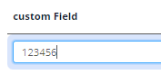
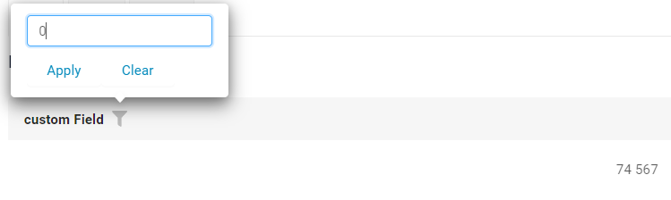

# Number

`Number` is a component for numbers editing. It can be used for editing and displaying numbers
Default value is 0.
## Basics
### How does it look?

=== "List widget"
    
=== "Info widget"
    
=== "Form widget"
    


### How to add?
??? Example
    **Step1** Add field **Long** to corresponding **DataResponseDTO**.

    ```java
    public class NumberDTO extends DataResponseDTO {
    
        @SearchParameter(name = "customField", provider = BigDecimalValueProvider.class)
        private Long customField;
    
        public NumberDTO(NumberEntity entity) {
            this.customField = entity.getCustomField();
        }
    }
    ```

    **Step2** Add field **Long** to corresponding **BaseEntity**.

    ```java
    public class NumberEntity extends BaseEntity {
   
        @Column
        private Long customField;
    }
    ```
    === "List widget"
        **Step3** Add to **_.widget.json_**.

        ```json
        {
          "name": "NumberList",
          "title": "List title",
          "type": "List",
          "bc": "myBcNumber",,
          "fields": [
            {
              "title": "custom Field",
              "key": "customField",
              "type": "number"
            }
          ],
          "options": {
            "actionGroups": {
            }
          }
        }
        ```
    === "Info widget"
        **Step3** Add to **_.widget.json_**.
        
        ```json
        {
          "name": "NumberInfo",
          "title": "Info title",
          "type": "Info",
          "bc": "myBcNumber",,
          "fields": [
            {
              "label": "custom Field",
              "key": "customField",
              "type": "number"
            }
          ],
          "options": {
            "layout": {
              "rows": [
                {
                  "cols": [
                    {
                      "fieldKey": "customField",
                      "span": 12
                    }
                  ]
                },
                {
                  "cols": [
                  ]
                }
              ]
            }
          }
        }
        ```

    === "Form widget"

        **Step3** Add to **_.widget.json_**.

        ```json
        {
          "name": "NumberForm",
          "title": "Form title",
          "type": "Form",
          "bc": "myBcNumber",,
          "fields": [
            {
              "label": "custom Field",
              "key": "customField",
              "type": "number"
            }
          ],
          "options": {
            "layout": {
              "rows": [
                {
                  "cols": [
                    {
                      "fieldKey": "customField",
                      "span": 12
                    }
                  ]
                },
                {
                  "cols": [
                  ]
                }
              ]
            }
          }
        }
        ```

## Placeholder
`Placeholder` allows you to provide a concise hint, guiding users on the expected value. This hint is displayed before any user input. It can be calculated based on business logic of application
=== "List widget"
     
=== "Info widget"
    _not applicable_
=== "Form widget"
    
### How to add?
??? Example
    Add **fields.setPlaceholder** to corresponding **FieldMetaBuilder**.

    ```java

    public class NumberMeta extends FieldMetaBuilder<NumberDTO> {
    
      @Override
      public void buildRowDependentMeta(RowDependentFieldsMeta<NumberDTO> fields, InnerBcDescription bcDescription,
        Long id, Long parentId) {
        fields.setPlaceholder(NumberDTO_.customField, "123456"));
      }
    ```
    === "List widget"
        **Works for List.**
    === "Info widget"
        **_not applicable_**
    === "Form widget"
        **Works for Form.**

## Color
`Color` allows you to specify a field color. It can be calculated based on business logic of application

### How does it look?
=== "List widget"
    
=== "Info widget"
    
=== "Form widget"
    


### How to add?
??? Example
    === "Calculated color"
        
    
        **Step 1**   Add `custom field` for color to corresponding **DataResponseDTO**. 
    
        ```java
        public class NumberDTO extends DataResponseDTO {
        
            @SearchParameter(name = "customField", provider = BigDecimalValueProvider.class)
            private Long customField;
            private String customFieldColor;
        
            public NumberDTO(NumberEntity entity) {
                this.customField = entity.getCustomField();
                this.customFieldColor = "#eda6a6";
            }
        ```
        === "List widget"   
            **Step 2** Add **"bgColorKey"** :  `custom field for color`  to .widget.json.
            ```json
            {
              "name": "NumberList",
              "title": "List title",
              "type": "List",
              "bc": "myBcNumber",,
              "fields": [
                {
                  "title": "custom Field",
                  "key": "customField",
                  "type": "number",
                  "bgColorKey": "customFieldColor"
                }
              ],
              "options": {
                "actionGroups": {
                }
              }
            }
            ```
        === "Info widget"
            **Step 2** Add **"bgColorKey"** :  `custom field for color`  to .widget.json.
            ```json
            {
              "name": "NumberInfo",
              "title": "Info title",
              "type": "Info",
              "bc": "myBcNumber",,
              "fields": [
                {
                  "label": "custom Field",
                  "key": "customField",
                  "type": "number",
                  "bgColorKey": "customFieldColor"
                }
              ],
              "options": {
                "layout": {
                  "rows": [
                    {
                      "cols": [
                        {
                          "fieldKey": "customField",
                          "span": 12
                        }
                      ]
                    },
                    {
                      "cols": [
                      ]
                    }
                  ]
                }
              }
            }       
            ```
        === "Form widget"
            **Step 2** Add **"bgColorKey"** :  `custom field for color`  to .widget.json.
            ```json
            {
              "name": "NumberForm",
              "title": "Form title",
              "type": "Form",
              "bc": "myBcNumber",,
              "fields": [
                {
                  "label": "custom Field",
                  "key": "customField",
                  "type": "number",
                  "bgColorKey": "customFieldColor"
                }
              ],
              "options": {
                "layout": {
                  "rows": [
                    {
                      "cols": [
                        {
                          "fieldKey": "customField",
                          "span": 12
                        }
                      ]
                    },
                    {
                      "cols": [
                      ]
                    }
                  ]
                }
              }
            }
            ```
    === "Constant color"
        === "List widget" 
            Add **"bgColor"** :  `custom color`  to .widget.json.
            ```json
            {
              "name": "NumberList",
              "title": "List title",
              "type": "List",
              "bc": "myBcNumber",,
              "fields": [
                {
                  "title": "custom Field",
                  "key": "customField",
                  "type": "number",
                  "bgColor": "#eda6a6"
                }
              ],
              "options": {
                "actionGroups": {
                }
              }
            }
            ```

        === "Info widget"
            Add **"bgColor"** :  `custom color`  to .widget.json.
            ```json
           {
              "name": "NumberInfo",
              "title": "Info title",
              "type": "Info",
              "bc": "myBcNumber",,
              "fields": [
                {
                  "label": "custom Field",
                  "key": "customField",
                  "type": "number",
                  "bgColor": "#eda6a6"
                }
              ],
              "options": {
                "layout": {
                  "rows": [
                    {
                      "cols": [
                        {
                          "fieldKey": "customField",
                          "span": 12
                        }
                      ]
                    },
                    {
                      "cols": [
                      ]
                    }
                  ]
                }
              }
            }
            ```

        === "Form widget"
            Add **"bgColor"** :  `custom color`  to .widget.json.  
            ```json
            {
              "name": "NumberForm",
              "title": "Form title",
              "type": "Form",
              "bc": "myBcNumber",,
              "fields": [
                {
                  "label": "custom Field",
                  "key": "customField",
                  "type": "number",
                  "bgColor": "#eda6a6"
                }
              ],
              "options": {
                "layout": {
                  "rows": [
                    {
                      "cols": [
                        {
                          "fieldKey": "customField",
                          "span": 12
                        }
                      ]
                    },
                    {
                      "cols": [
                      ]
                    }
                  ]
                }
              }
            }
            ```
## Readonly/Editable
`Readonly/Editable` indicates whether the field can be edited or not. It can be calculated based on business logic of application

### How does it look?
=== "Editable List widget"
    
=== "Editable Info widget"
    _not applicable_
=== "Editable Form widget"
    


### How to add?
??? Example
    === "Editable" 
        **Step1** Add mapping DTO->entity to corresponding **VersionAwareResponseService**.
            ```java
            protected ActionResultDTO<NumberDTO> doUpdateEntity(NumberEntity entity, NumberDTO data, BusinessComponent bc) {
                if (data.isFieldChanged(NumberDTO_.customField)) {
                    entity.setCustomField(data.getCustomField());
                }
            return new ActionResultDTO<>(entityToDto(bc, entity));
            ```

        **Step2** Add **fields.setEnabled** to corresponding **FieldMetaBuilder**.
    
        ```java
        public class DateTimeMeta extends FieldMetaBuilder<DateTimeDTO> {
            public void buildRowDependentMeta(RowDependentFieldsMeta<NumberDTO> fields, InnerBcDescription bcDescription, Long id, Long parentId) {
                fields.setEnabled(NumberDTO_.customField);
            }
        }
        ```
        === "List widget"
            **Works for List.**
        === "Info widget"
            **_not applicable_**
        === "Form widget"
            **Works for Form.**
   
    === "Readonly"
    
        **Option 1** Enabled by default.
    
        ```java
        public class DateTimeMeta extends FieldMetaBuilder<DateTimeDTO> {
            public void buildRowDependentMeta(RowDependentFieldsMeta<NumberDTO> fields, InnerBcDescription bcDescription, Long id, Long parentId) {
            }
        }
        ```
    
        **Option 2** `Not recommended.` Property fields.setDisabled() overrides the enable field if you use after property fields.setEnabled.
        === "List widget"
            **Works for List.**
        === "Info widget"
            **_not applicable_**
        === "Form widget"
            **Works for Form.**
## Filtration
`Filtering` allows you to search data based on criteria.Search by range current day . 
### How does it look?
=== "List widget"
    
=== "Info widget"
    _not applicable_
=== "Form widget"
    _not applicable_

### How to add?
??? Example
    === "List widget"
        **Step 1** Add **@SearchParameter** to corresponding **DataResponseDTO**. (Advanced customization [SearchParameter](/advancedCustomization_filtration)

        ```java
        public class NumberDTO extends DataResponseDTO {
        
            @SearchParameter(name = "customField", provider = BigDecimalValueProvider.class)
            private Long customField;
        
            public NumberDTO(NumberEntity entity) {
                this.customField = entity.getCustomField();
            }
        }
        ```
        **Step 2**  Add **fields.enableFilter** to corresponding **FieldMetaBuilder**.

        ```java 
        public class NumberFiltrationMeta extends FieldMetaBuilder<NumberFiltrationDTO>  {
        
            public void buildIndependentMeta(FieldsMeta<NumberFiltrationDTO> fields, InnerBcDescription bcDescription, Long parentId) {
                fields.enableFilter(NumberFiltrationDTO_.customField);
            }
        
        }
        ```

    === "Info widget"
        _not applicable_
    === "Form widget"
        _not applicable_

## Drilldown
`DrillDown` allows you to navigate to another view by simply tapping on it. Target view and other drill-down parts can be calculated based on business logic of application

Also, it optionally allows you to filter data on target view before it will be opened `see more` [DrillDown](/features/element/drillDown/drillDown)


### How does it look?
=== "List widget"
    
=== "Info widget"
    
=== "Form widget"
    _not applicable_

### How to add?
??? Example

    **Option 1**

    `Step 1` Add [fields.setDrilldown](/features/element/drillDown/drillDown) to corresponding **FieldMetaBuilder**.
    ```java
    public class NumberMeta extends FieldMetaBuilder<NumberDTO> {
    
        @Override
        public void buildRowDependentMeta(RowDependentFieldsMeta<NumberDTO> fields, InnerBcDescription bcDescription,
                                          Long id, Long parentId) {
            fields.setDrilldown(
                    NumberDTO_.customField,
                    DrillDownType.INNER,
                    "/screen/Number/view/Numberinfo/" + TeslerNumberController.myBcNumber + "/" + id
            );
    ```
    === "List widget"
        `Step 2` For visual add **"drillDown": "true"**  to .widget.json.
        ```json
        {
          "name": "NumberList",
          "title": "List title",
          "type": "List",
          "bc": "myBcNumber",
          "fields": [
            {
              "title": "custom Field",
              "key": "customField",
              "type": "number",
              "drillDown": "true"
            }
          ],
          "options": {
            "actionGroups": {
            }
          }
        }
        ```


        **Option 2**
           Add **"drillDownKey"** :  `custom field`  to .widget.json. see more [Drilldown](/advancedCustomization/element/drillDown/drillDown) 
 
    === "Info widget"

        `Step 2` For visual add **"drillDown": "true"**  to .widget.json.

        ```json
        {
          "name": "NumberInfo",
          "title": "Info title",
          "type": "Info",
          "bc": "myBcNumber",
          "fields": [
            {
              "label": "custom Field",
              "key": "customField",
              "type": "number",
              "drillDown": "true"
            }
          ],
          "options": {
            "layout": {
              "rows": [
                {
                  "cols": [
                    {
                      "fieldKey": "customField",
                      "span": 12
                    }
                  ]
                },
                {
                  "cols": [
                  ]
                }
              ]
            }
          }
        }
        ```
        **Option 2**
           Add **"drillDownKey"** :  `custom field`  to .widget.json. see more [Drilldown](/advancedCustomization/element/drillDown/drillDown) 
 
    === "Form widget"
        _not applicable_
[Advanced customization](/advancedCustomization/element/drillDown/drillDown)
