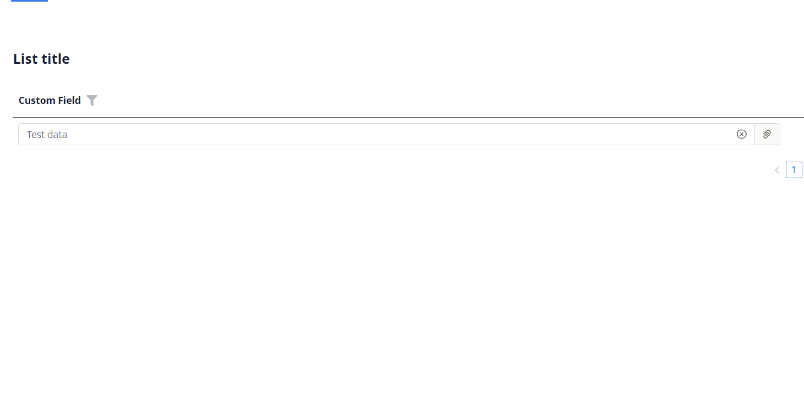
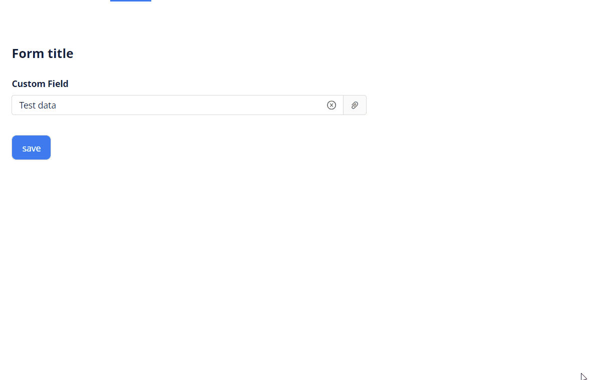

# PickList

`PickList` is a component that allows to select a value from Popup list of entities

## Basics
### How does it look?

=== "List widget"
    
=== "Info widget"
    _not applicable_
=== "Form widget"
    


### How to add?

??? Example
    **Step1.Popup** Add field,for example, **String** to corresponding **DataResponseDTO**.

    ```java
    public class MyEntityPickDTO extends DataResponseDTO {
    
        @SearchParameter(name = "customField")
        private String customField;
    
        public MyEntityPickDTO(MyEntityPickEntity entity) {
        this.customField = entity.getCustomField();
        }
    }
    ```
    **Step2.Popup** Add field **String** to corresponding **BaseEntity**.

    ```java
    public class MyEntityPickEntity extends BaseEntity {
    
        private String customField;
    }
    ```
    **Step3.Popup**  Create Popup List to **_.widget.json_**.
    ```json
    {
      "title": "myEntityPickListPopup title",
      "name": "myEntityPickListPopup",
      "type": "PickListPopup",
      "bc": "myEntityPickListPopup",
      "fields": [
        {
          "title": "id",
          "key": "id",
          "type": "text"
        },
        {
          "title": "Custom Field",
          "key": "customField",
          "type": "text"
        }
      ]
    }
    ```
    **Step 4.Popup** Add **fields.setEnabled** to corresponding **FieldMetaBuilder**.

    ```java

    public class MyExamplePickMeta extends FieldMetaBuilder<MyEntityPickDTO> {

    @Override
    public void buildRowDependentMeta(RowDependentFieldsMeta<MyEntityPickDTO> fields, InnerBcDescription bcDescription,
                                      Long id, Long parentId) {
        fields.setEnabled(MyEntityPickDTO_.id);
        fields.setEnabled(MyEntityPickDTO_.customField);
    }
    ```

    **Step 5** Add **Popup** to **_.view.json_**.

    ```json
    {
      "name": "myexampleform",
      "title": "My Example Form",
      "template": "DashboardView",
      "url": "/screen/myexample/view/myexampleform",
      "widgets": [
        {
          "widgetName": "myEntityPickListPopup",
          "position": 2,
          "gridWidth": 24
        },
        {
          "widgetName": "SecondLevelMenu",
          "position": 0,
          "gridWidth": 1
        },
        {
          "widgetName": "MyExampleForm",
          "position": 2,
          "gridWidth": 24
        }
      ],
      "rolesAllowed": [
      ]
    }
    ```

    === "List widget"
        **Step6** Add popupBcName and pickMap to **_.widget.json_**.
        `pickMap` - maping for field Picklist to MyEntity

        ```json
        {
          "name": "MyExampleList",
          "title": "List title",
          "type": "List",
          "bc": "myExampleBc",
          "fields": [
            {
              "title": "Custom Field",
              "key": "customField",
              "type": "pickList",
              "popupBcName": "myEntityPickListPopup",
              "pickMap": {
                "customFieldId": "id",
                "customField": "customField"
              }
            }
          ],
          "options": {
            "actionGroups": {
            }
          }
        }        
        ```

    === "Info widget"
        _not applicable_
    === "Form widget"

        **Step6** Add popupBcName and pickMap to **_.widget.json_**.
        `pickMap` - maping for field Picklist to MyEntity

        ```json
        {
          "name": "MyExampleList",
          "title": "List title",
          "type": "List",
          "bc": "myExampleBc",
          "fields": [
            {
              "title": "Custom Field",
              "key": "customField",
              "type": "pickList",
              "popupBcName": "myEntityPickListPopup",
              "pickMap": {
                "customFieldId": "id",
                "customField": "customField"
              }
            }
          ],
          "options": {
            "actionGroups": {
            }
          }
        }
        ```

## Placeholder
`Placeholder` allows you to provide a concise hint, guiding users on the expected value. This hint is displayed before any user input. It can be calculated based on business logic of application
### How does it look?
=== "List widget"
     
=== "Info widget"
    _not applicable_
=== "Form widget"
    
### How to add?
??? Example
    Add **fields.setPlaceholder** to corresponding **FieldMetaBuilder**.

    ```java

    public class MyExampleMeta extends FieldMetaBuilder<MyExampleDTO> {
    
      @Override
      public void buildRowDependentMeta(RowDependentFieldsMeta<MyExampleDTO> fields, InnerBcDescription bcDescription,
        Long id, Long parentId) {
        fields.setPlaceholder(MyExampleDTO_.customField, "Placeholder text"));
      }
    ```
    === "List widget"
        **Works for List.**
    === "Info widget"
        **_not applicable_**
    === "Form widget"
        **Works for Form.**

## Color
`Color` allows you to specify a field color. It can be calculated based on business logic of application

### How does it look?
=== "List widget"
    
=== "Info widget"
    _not applicable_
=== "Form widget"
    _not applicable_


### How to add?
??? Example
    === "Calculated color"


        **Step 1**   Add `custom field` for color to corresponding **DataResponseDTO**. 
    
        ```java
        public class MyExampleDTO extends DataResponseDTO {
        
            @SearchParameter(name = "customField", provider = BigDecimalValueProvider.class)
            private Long customField;
            private String customFieldColor;
        
            public MyExampleDTO(MyExampleEntity entity) {
                this.customField = entity.getCustomField();
                this.customFieldColor = "#eda6a6";
            }
        ```
        === "List widget"   
            **Step 2** Add **"bgColorKey"** :  `custom field for color`  to .widget.json.
            ```json
            {
              "name": "MyExampleList",
              "title": "List title",
              "type": "List",
              "bc": "myExampleBc",
              "fields": [
                {
                  "title": "Custom Field",
                  "key": "customField",
                  "type": "pickList",
                  "popupBcName": "myEntity121PickListPopup",
                  "pickMap": {
                    "customFieldId": "id",
                    "customField": "customField"
                  },
                  "bgColorKey": "customFieldColor"
                }
              ],
              "options": {
                "actionGroups": {
                }
              }
            }
            ```
        === "Info widget"
            _not applicable_
        === "Form widget"
            _not applicable_

    === "Constant color"
        === "List widget" 
            Add **"bgColor"** :  `custom color`  to .widget.json.
            ```json
            {
              "name": "MyExampleList",
              "title": "List title",
              "type": "List",
              "bc": "myExampleBc",
              "fields": [
                {
                  "title": "Custom Field",
                  "key": "customField",
                  "type": "pickList",
                  "popupBcName": "myEntityPickListPopup",
                  "pickMap": {
                    "customFieldId": "id",
                    "customField": "customField"
                  },
                  "bgColor": "#eda6a6"
                }
              ],
              "options": {
                "actionGroups": {
                }
              }
            } 
            ```

        === "Info widget"
            _not applicable_
        === "Form widget"
            _not applicable_
## Readonly/Editable
`Readonly/Editable` indicates whether the field can be edited or not. It can be calculated based on business logic of application

### How does it look?
=== "Editable List widget"
    
=== "Editable Info widget"
    _not applicable_
=== "Editable Form widget"
    


### How to add?
??? Example
    === "Editable" 
        **Step1** Add mapping DTO->entity to corresponding **VersionAwareResponseService**.
            ```java
            protected ActionResultDTO<MyExampleDTO> doUpdateEntity(MyExampleEntity entity, MyExampleDTO data, BusinessComponent bc) {
                if (data.isFieldChanged(MyExampleDTO_.customField)) {
                    entity.setCustomFieldEntity(data.getCustomFieldId() != null
                    ? entityManager.getReference(MyEntity122.class, data.getCustomFieldId())
                    : null);
                }
            return new ActionResultDTO<>(entityToDto(bc, entity));
            ```

        **Step2** Add **fields.setEnabled** to corresponding **FieldMetaBuilder**.
    
        ```java
        public class MyExampleMeta extends FieldMetaBuilder<MyExampleDTO> {
            public void buildRowDependentMeta(RowDependentFieldsMeta<MyExampleDTO> fields, InnerBcDescription bcDescription, Long id, Long parentId) {
                fields.setEnabled(MyExampleDTO_.customField);
            }
        }
        ```
        === "List widget"
            **Works for List.**
        === "Info widget"
            **_not applicable_**
        === "Form widget"
            **Works for Form.**
   
    === "Readonly"
    
        **Option 1** Enabled by default.
    
        ```java
        public class MyExampleMeta extends FieldMetaBuilder<MyExampleDTO> {
            public void buildRowDependentMeta(RowDependentFieldsMeta<MyExampleDTO> fields, InnerBcDescription bcDescription, Long id, Long parentId) {
            }
        }
        ```
    
        **Option 2** `Not recommended.` Property fields.setDisabled() overrides the enable field if you use after property fields.setEnabled.
        === "List widget"
            **Works for List.**
        === "Info widget"
            **_not applicable_**
        === "Form widget"
            **Works for Form.**

## Filtration
**_not applicable_**

## Drilldown
**_not applicable_**

## Validation
`Validation` allows you to check any business rules for user-entered value. There are two types of validation:

1) Exception: Displays a message to notify users about technical or business errors.

2) Confirm: Presents a dialog with an optional message, requiring user confirmation or cancellation before proceeding.

### How does it look?
=== "List widget"
    === "BusinessException"
        
    === "RuntimeException"
        
    === "Confirm"
        
=== "Info widget"
    _not applicable_
=== "Form widget"
    === "BusinessException"
        
    === "RuntimeException"
        
    === "Confirm"
        

### How to add?
??? Example
    === "BusinessException"
        `BusinessException` describes an error  within a business process.

        Add **BusinessException** to corresponding **VersionAwareResponseService**.

        ```java
        public class MyExampleService extends VersionAwareResponseService<MyExampleDTO, MyExample> {
 
            @Override
            protected ActionResultDTO<MyExampleDTO> doUpdateEntity(MyExampleEntity entity, MyExampleDTO data, BusinessComponent bc) {
                if (data.isFieldChanged(MyExample114DTO_.customFieldId)) {
                    entity.setCustomFieldEntity(data.getCustomFieldId() != null
                            ? entityManager.getReference(MyEntity129.class, data.getCustomFieldId())
                            : null);
                    if (StringUtils.isNotEmpty(data.getCustomField())
                            && !String.valueOf(data.getCustomField()).matches("[A-Za-z]+")
                    ) {
                        throw new BusinessException().addPopup("The field 'customField' can contain only letters.");
                    }
                }
                return new ActionResultDTO<>(entityToDto(bc, entity));
            }              
        ```
        === "List widget"
            **Works for List.**
        === "Info widget"
            **_not applicable_**
        === "Form widget"
            **Works for Form.**
    === "RuntimeException"

        `RuntimeException` describes an error  within a business process.
        
        Add **RuntimeException** to corresponding **VersionAwareResponseService**.
        
        ```java
            @Override
            protected ActionResultDTO<MyExampleDTO> doUpdateEntity(MyExampleEntity entity, MyExampleDTO data, BusinessComponent bc) {
                if (data.isFieldChanged(MyExampleDTO_.customFieldId)) {
                    entity.setCustomFieldEntity(data.getCustomFieldId() != null
                            ? entityManager.getReference(MyEntity131.class, data.getCustomFieldId())
                            : null);
                   try {
                       //call custom function
                   }
                   catch(Exception e){
                        throw new RuntimeException("An unexpected error has occurred.");
                    }
                }
                return new ActionResultDTO<>(entityToDto(bc, entity));
            }
        ```    
        === "List widget"
            **Works for List.**
        === "Info widget"
            **_not applicable_**
        === "Form widget"
            **Works for Form.**
    === "Confirm"
        Add [PreAction.confirm](/advancedCustomization_validation) to corresponding **VersionAwareResponseService**.
        ```java
     
            public class MyExampleService extends VersionAwareResponseService<MyExampleDTO, MyExample> {

                @Override
                public Actions<MyExampleDTO> getActions() {
                    return Actions.<MyExampleDTO>builder()
                    .newAction()
                    .action("save", "save")
                    .withPreAction(PreAction.confirm("You want to save the value 'customField'?"))
                    .add()
                    .build();
                }
            }
        ```
        === "List widget"
            **Works for List.**
        === "Info widget"
            **_not applicable_**
        === "Form widget"
            **Works for Form.**

## Drilldown
**_not applicable_**

## Sorting
**_not applicable_**

## Required
`Required` allows you to denote, that this field must have a value provided. 

### How does it look?
=== "List widget"
    
=== "Info widget"
    _not applicable_
=== "Form widget"
    
### How to add?
??? Example
    Add **fields.setRequired** to corresponding **FieldMetaBuilder**.

    ```java

    public class MyExampleMeta extends FieldMetaBuilder<MyExample> {
    
      @Override
      public void buildRowDependentMeta(RowDependentFieldsMeta<MyExample> fields, InnerBcDescription bcDescription,
        Long id, Long parentId) {
        fields.setEnabled(MyExample_.customField);
        fields.setRequired(MyExample_.customField);
      }
    ```
    === "List widget"
        **Works for List.**
    === "Info widget"
        **_not applicable_**
    === "Form widget"
        **Works for Form.**


