# PickTree

`PickTree` is a component that allows to select a value from Popup list of entities

!!! tips 
    Use if user needs to open a detailed view of related entities. Feel free to use this field type for large entities of any size (only one page is loaded in memory)

## Basics
[:material-play-circle: Live Sample]({{ external_links.code_samples }}/ui/#/screen/myexample3282){:target="_blank"} ·
[:fontawesome-brands-github: GitHub]({{ external_links.github_ui }}/{{ external_links.github_branch }}/src/main/java/org/demo/documentation/fields/picktree/basic){:target="_blank"}

### How does it look?

=== "List widget"
    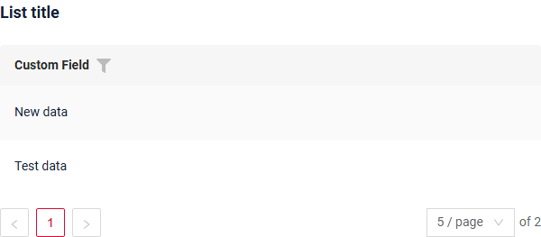
=== "Info widget"
    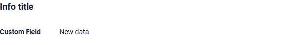
=== "Form widget"
    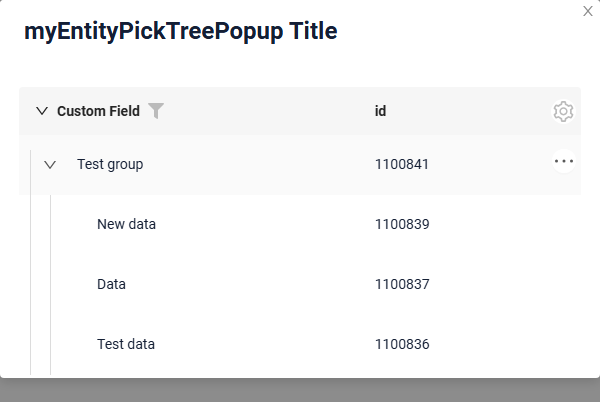


### How to add?
!!! info
    The popup is a tree: the business component of the popup must return `parentId` (filterable, `null` for the roots) and `isLeaf`, both declared as **hidden** fields of the popup widget. The tree settings are described in [options.tree](/widget/type/tree/tree/#optionstree).


??? Example
    - **Step 1. Popup**

        In the following example, **MyEntity** entity has a **OneToOne/ManyToOne** reference to the **MyEntityPick** entity. Link is made by id, e.g. **MyEntity.customFieldId** = **MyEntityPick.id**. Also, is this example we will use one `additional field` **MyEntityPick.customField**, that will be shown on MyEntity widget

        +  **Step 1.1** Add **String** `additional field`  to corresponding **BaseEntity**.
            ```java
            --8<--
            {{ external_links.github_raw_doc }}/fields/picktree/basic/MyEntity3282Pick.java
            --8<--
            ```

        +  **Step 1.2** Add **String** `additional field` to corresponding **DataResponseDTO**.

            ```java
            --8<--
            {{ external_links.github_raw_doc }}/fields/picktree/basic/MyEntity3282PickDTO.java
            --8<--
            ```


        +  **Step 1.3**  Create Popup List **_.widget.json_**.
            ```json
            --8<--
            {{ external_links.github_raw_doc }}/fields/picktree/basic/myEntity3282PickTreePopup.widget.json
            --8<--
            ```

        +  **Step 1.4** Add **fields.setEnabled** to corresponding **FieldMetaBuilder**.
            ```java
            --8<--
            {{ external_links.github_raw_doc }}/fields/picktree/basic/MyEntity3282PickPickTreeMeta.java:buildIndependentMeta
            --8<--
            ```
        
    -   **Step 2** Add **Popup** to **_.view.json_**.

        === "list.view.json"
            ```json
            --8<--
            {{ external_links.github_raw_doc }}/fields/picktree/basic/myexample3282list.view.json
            --8<--
            ```
        === "form.view.json"
            ```json
            --8<--
            {{ external_links.github_raw_doc }}/fields/picktree/basic/myexample3282form.view.json
            --8<--
            ```
    -   **Step3** Add **MyEntityPick** field to corresponding **BaseEntity**.
        ```java
            --8<--
            {{ external_links.github_raw_doc }}/fields/picktree/basic/MyEntity3282.java
            --8<--
        ```

    -   **Step4** Add two fields (for id and for `additional field`) to corresponding **DataResponseDTO**.
        ```java
        --8<--
        {{ external_links.github_raw_doc }}/fields/picktree/basic/MyExample3282DTO.java
        --8<--
        ```
    -   **Step5** Add bc myEntityPickTreePopup to corresponding **EnumBcIdentifier**.
        
        !!! info
            `myEntityPickTreePopup` business component needs to be a child of the business component from which the popup window is invoked.

        ```java
        --8<--
        {{ external_links.github_raw_doc }}/fields/picktree/basic/PlatformMyExample3282Controller.java:bc
        --8<--
        ```

    === "List widget"
        **Step6** Add popupBcName and pickMap to **_.widget.json_**.
        `pickMap` - maping for field Picktree to MyEntity

        pickMap defines the mapping between fields of the main BC (the primary form) and the popup BC from which the user selects a record.
        
        * Left side — the field in the main BC where the value should be written.
        * Right side — the field in the popup BC from which the value is taken when the user selects a row.
        
        ```json
        --8<--
        {{ external_links.github_raw_doc }}/fields/picktree/basic/MyExample3282List.widget.json
        --8<--
        ```    

    === "Info widget"
        **Step6** Add popupBcName and pickMap to **_.widget.json_**.
        `pickMap` - maping for field Picktree to MyEntity

        pickMap defines the mapping between fields of the main BC (the primary form) and the popup BC from which the user selects a record.
        
        * Left side — the field in the main BC where the value should be written.
        * Right side — the field in the popup BC from which the value is taken when the user selects a row.
        
        ```json
        --8<--
        {{ external_links.github_raw_doc }}/fields/picktree/basic/MyExample3282Info.widget.json
        --8<--
        ``` 

    === "Form widget"

        **Step6** Add popupBcName and pickMap to **_.widget.json_**.
        `pickMap` - maping for field Picktree to MyEntity

        pickMap defines the mapping between fields of the main BC (the primary form) and the popup BC from which the user selects a record.
        
        * Left side — the field in the main BC where the value should be written.
        * Right side — the field in the popup BC from which the value is taken when the user selects a row.
        
        When the user selects a record in the popup, take the value from the right-side field and place it into the left-side field.
        ```json
        --8<--
        {{ external_links.github_raw_doc }}/fields/picktree/basic/MyExample3282Form.widget.json
        --8<--
        ``` 

    [:material-play-circle: Live Sample]({{ external_links.code_samples }}/ui/#/screen/myexample3282){:target="_blank"} ·
    [:fontawesome-brands-github: GitHub]({{ external_links.github_ui }}/{{ external_links.github_branch }}/src/main/java/org/demo/documentation/fields/picktree/basic){:target="_blank"}

## Placeholder
[:material-play-circle: Live Sample]({{ external_links.code_samples }}/ui/#/screen/myexample3287){:target="_blank"} ·
[:fontawesome-brands-github: GitHub]({{ external_links.github_ui }}/{{ external_links.github_branch }}/src/main/java/org/demo/documentation/fields/picktree/placeholder){:target="_blank"}

`Placeholder` allows you to provide a concise hint, guiding users on the expected value. This hint is displayed before any user input. It can be calculated based on business logic of application
### How does it look?
=== "List widget"
    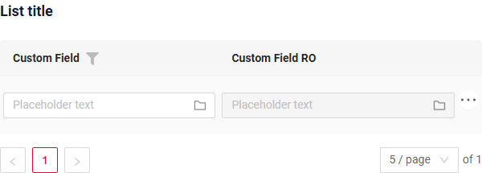 
=== "Info widget"
    _not applicable_
=== "Form widget"
    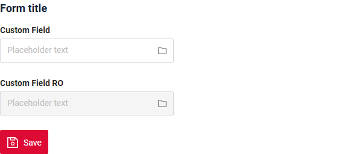
### How to add?
??? Example
    Add **fields.setPlaceholder** to corresponding **FieldMetaBuilder**.
    ```java
    --8<--
    {{ external_links.github_raw_doc }}/fields/picktree/placeholder/MyExample3287Meta.java:buildRowDependentMeta
    --8<--
    ```  
    === "List widget"
        **Works for List.**
    === "Info widget"
        **_not applicable_**
    === "Form widget"
        **Works for Form.**

    [:material-play-circle: Live Sample]({{ external_links.code_samples }}/ui/#/screen/myexample3287){:target="_blank"} ·
    [:fontawesome-brands-github: GitHub]({{ external_links.github_ui }}/{{ external_links.github_branch }}/src/main/java/org/demo/documentation/fields/picktree/placeholder){:target="_blank"}

## Color
`Color` allows you to specify a field color. It can be calculated based on business logic of application

**Calculated color**

[:material-play-circle: Live Sample]({{ external_links.code_samples }}/ui/#/screen/myexample3283){:target="_blank"} ·
[:fontawesome-brands-github: GitHub]({{ external_links.github_ui }}/{{ external_links.github_branch }}/src/main/java/org/demo/documentation/fields/picktree/color){:target="_blank"}

**Constant color**

[:material-play-circle: Live Sample]({{ external_links.code_samples }}/ui/#/screen/myexample3284){:target="_blank"} ·
[:fontawesome-brands-github: GitHub]({{ external_links.github_ui }}/{{ external_links.github_branch }}/src/main/java/org/demo/documentation/fields/picktree/colorconst){:target="_blank"}

### How does it look?
=== "List widget"
    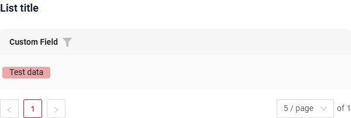
=== "Info widget"
    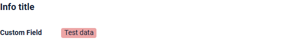
=== "Form widget"
    _not applicable_

### How to add?
??? Example
    === "Calculated color"
        **Step 1**   Add `custom field for color` to corresponding **DataResponseDTO**. The field can contain a HEX color or be null.
        ```java
        --8<--
        {{ external_links.github_raw_doc }}/fields/picktree/color/MyExample3283DTO.java
        --8<--
        ```    
        === "List widget"  

            **Step 2** Add **"bgColorKey"** :  `custom field for color`  to .widget.json.
            ```json
            --8<--
            {{ external_links.github_raw_doc }}/fields/picktree/color/MyExample3283List.widget.json
            --8<--
            ```
        === "Info widget"
            **Step 2** Add **"bgColorKey"** :  `custom field for color`  to .widget.json.
            ```json
            --8<--
            {{ external_links.github_raw_doc }}/fields/picktree/color/MyExample3283Info.widget.json
            --8<--
            ```
        === "Form widget"
            _not applicable_

        [:material-play-circle: Live Sample]({{ external_links.code_samples }}/ui/#/screen/myexample3283){:target="_blank"} ·
        [:fontawesome-brands-github: GitHub]({{ external_links.github_ui }}/{{ external_links.github_branch }}/src/main/java/org/demo/documentation/fields/picktree/color){:target="_blank"}

    === "Constant color"
        === "List widget" 
            Add **"bgColor"** :  `HEX color`  to .widget.json.
            ```json
            --8<--
            {{ external_links.github_raw_doc }}/fields/picktree/colorconst/MyExample3284List.widget.json
            --8<--
            ```
        === "Info widget"
            Add **"bgColor"** :  `HEX color`  to .widget.json.
            ```json
            --8<--
            {{ external_links.github_raw_doc }}/fields/picktree/colorconst/MyExample3284Info.widget.json
            --8<--
            ```
        === "Form widget"
            _not applicable_

        [:material-play-circle: Live Sample]({{ external_links.code_samples }}/ui/#/screen/myexample3284){:target="_blank"} ·
        [:fontawesome-brands-github: GitHub]({{ external_links.github_ui }}/{{ external_links.github_branch }}/src/main/java/org/demo/documentation/fields/picktree/colorconst){:target="_blank"}

## Readonly/Editable
`Readonly/Editable` indicates whether the field can be edited or not. It can be calculated based on business logic of application

`Editable`
[:material-play-circle: Live Sample]({{ external_links.code_samples }}/ui/#/screen/myexample3282){:target="_blank"} ·
[:fontawesome-brands-github: GitHub]({{ external_links.github_ui }}/{{ external_links.github_branch }}/src/main/java/org/demo/documentation/fields/picktree/basic){:target="_blank"}

`Readonly`
[:material-play-circle: Live Sample]({{ external_links.code_samples }}/ui/#/screen/myexample3289){:target="_blank"} ·
[:fontawesome-brands-github: GitHub]({{ external_links.github_ui }}/{{ external_links.github_branch }}/src/main/java/org/demo/documentation/fields/picktree/ro){:target="_blank"}

### How does it look?
=== "Editable"
    === "List widget"
        
    === "Info widget"
        _not applicable_
    === "Form widget"
        
=== "Readonly"
    === "List widget"
        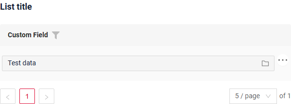
    === "Info widget"
        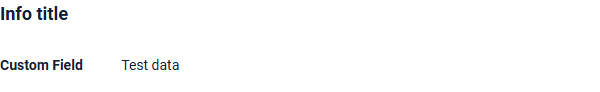
    === "Form widget"
        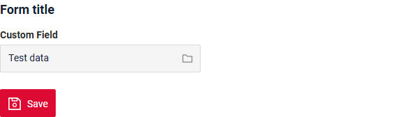

### How to add?
??? Example
    === "Editable"
        **Step1** Add mapping DTO->entity to corresponding **VersionAwareResponseService**.
        ```java
        --8<--
        {{ external_links.github_raw_doc }}/fields/picktree/basic/MyExample3282Service.java:doUpdateEntity
        --8<--
        ```
        **Step2** Add **fields.setEnabled** to corresponding **FieldMetaBuilder**.
        ```java
        --8<--
        {{ external_links.github_raw_doc }}/fields/picktree/basic/MyExample3282Meta.java:buildRowDependentMeta
        --8<--
        ```    
        === "List widget"
            **Works for List.**
        === "Info widget"
            **_not applicable_**
        === "Form widget"
            **Works for Form.**

        [:material-play-circle: Live Sample]({{ external_links.code_samples }}/ui/#/screen/myexample3282){:target="_blank"} ·
        [:fontawesome-brands-github: GitHub]({{ external_links.github_ui }}/{{ external_links.github_branch }}/src/main/java/org/demo/documentation/fields/picktree/basic){:target="_blank"}

    === "Readonly"
    
        **Option 1** Enabled by default.
        ```java
        --8<--
        {{ external_links.github_raw_doc }}/fields/picktree/ro/MyExample3289Meta.java:buildRowDependentMeta
        --8<--
        ```    
        **Option 2** `Not recommended.` Property fields.setDisabled() overrides the enabled field if you use after property fields.setEnabled.
        === "List widget"
            **Works for List.**
        === "Info widget"
            **Works for Info.**
        === "Form widget"
            **Works for Form.**

        [:material-play-circle: Live Sample]({{ external_links.code_samples }}/ui/#/screen/myexample3289){:target="_blank"} ·
        [:fontawesome-brands-github: GitHub]({{ external_links.github_ui }}/{{ external_links.github_branch }}/src/main/java/org/demo/documentation/fields/picktree/ro){:target="_blank"}

## Filtering
[:material-play-circle: Live Sample]({{ external_links.code_samples }}/ui/#/screen/myexample3286){:target="_blank"} ·
[:fontawesome-brands-github: GitHub]({{ external_links.github_ui }}/{{ external_links.github_branch }}/src/main/java/org/demo/documentation/fields/picktree/filtration){:target="_blank"}

`Filtering` allows you to search data based on criteria. Search uses in operator which compares ids in this case.

!!! tips
    Pop up widget for filtration is auto-generated based on widget for field editing (e.g. same fields, same filters and so on will be on both widgets). Optionally - separate widget for filtration can still be provided
### How does it look?
=== "List widget"
    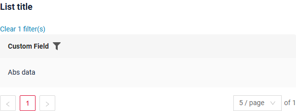
=== "Info widget"
    _not applicable_
=== "Form widget"
    _not applicable_

### How to add?
??? Example
    === "List widget"
        **Step 1** Add **@SearchParameter** to corresponding **DataResponseDTO**. (Advanced customization [SearchParameter](/advancedCustomization/element/searchparameter/searchparameter))
        ```java
        --8<--
        {{ external_links.github_raw_doc }}/fields/picktree/filtration/MyExample3286DTO.java
        --8<--
        ```
        **Step 2**  Add **fields.enableFilter** to corresponding **FieldMetaBuilder**.
        ```java
        --8<--
        {{ external_links.github_raw_doc }}/fields/picktree/filtration/MyExample3286Meta.java:buildIndependentMeta
        --8<--
        ```
    === "Info widget"
        _not applicable_
    === "Form widget"
        _not applicable_

    [:material-play-circle: Live Sample]({{ external_links.code_samples }}/ui/#/screen/myexample3286){:target="_blank"} ·
    [:fontawesome-brands-github: GitHub]({{ external_links.github_ui }}/{{ external_links.github_branch }}/src/main/java/org/demo/documentation/fields/picktree/filtration){:target="_blank"}

## Drilldown
[:material-play-circle: Live Sample]({{ external_links.code_samples }}/ui/#/screen/myexample3285){:target="_blank"} ·
[:fontawesome-brands-github: GitHub]({{ external_links.github_ui }}/{{ external_links.github_branch }}/src/main/java/org/demo/documentation/fields/picktree/drilldown){:target="_blank"}

`DrillDown` allows you to navigate to another view by simply tapping on it. Target view and other drill-down parts can be calculated based on business logic of application

Also, it optionally allows you to filter data on target view before it will be opened `see more` [DrillDown](/features/element/drilldown/drilldown)


### How does it look?
=== "List widget"
    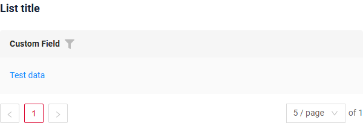
=== "Info widget"
    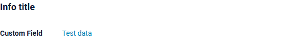
=== "Form widget"
    _not applicable_

### How to add?
??? Example

    **Option 1**

    `Step 1` Add [fields.setDrilldown](/features/element/drilldown/drilldown) to corresponding **FieldMetaBuilder**.
    ```java
    --8<--
    {{ external_links.github_raw_doc }}/fields/picktree/drilldown/MyExample3285Meta.java:buildRowDependentMeta
    --8<--
    ```
    === "List widget"

        `Step 2` Add **"drillDown": "true"**  to .widget.json.
        ```json
        --8<--
        {{ external_links.github_raw_doc }}/fields/picktree/drilldown/MyExample3285List.widget.json
        --8<--
        ```
        **Option 2**
           Add **"drillDownKey"** :  `custom field`  to .widget.json. See more [Drilldown](/advancedCustomization/element/drilldown/drilldown) 
 
    === "Info widget"

        `Step 2` Add **"drillDown": "true"**  to .widget.json.
        ```json
        --8<--
        {{ external_links.github_raw_doc }}/fields/picktree/drilldown/MyExample3285Info.widget.json
        --8<--
        ```
        **Option 2**
           Add **"drillDownKey"** :  `custom field`  to .widget.json. See more [Drilldown](/advancedCustomization/element/drilldown/drilldown) 
 
    === "Form widget"
        _not applicable_

    [:material-play-circle: Live Sample]({{ external_links.code_samples }}/ui/#/screen/myexample3285){:target="_blank"} ·
    [:fontawesome-brands-github: GitHub]({{ external_links.github_ui }}/{{ external_links.github_branch }}/src/main/java/org/demo/documentation/fields/picktree/drilldown){:target="_blank"}

[Advanced customization](/advancedCustomization/element/drilldown/drilldown)

## Validation
`Validation` allows you to check any business rules for user-entered value. There are types of validation:

1) Exception:Displays a message to notify users about technical or business errors.

   `Business Exception`:
   [:material-play-circle: Live Sample]({{ external_links.code_samples }}/ui/#/screen/myexample3292){:target="_blank"} ·
   [:fontawesome-brands-github: GitHub]({{ external_links.github_ui }}/{{ external_links.github_branch }}/src/main/java/org/demo/documentation/fields/picktree/validationbusinessex){:target="_blank"}

   `Runtime Exception`:
   [:material-play-circle: Live Sample]({{ external_links.code_samples }}/ui/#/screen/myexample3295){:target="_blank"} ·
   [:fontawesome-brands-github: GitHub]({{ external_links.github_ui }}/{{ external_links.github_branch }}/src/main/java/org/demo/documentation/fields/picktree/validationruntimeex){:target="_blank"}
   
2) Confirm: Presents a dialog with an optional message, requiring user confirmation or cancellation before proceeding.

   [:material-play-circle: Live Sample]({{ external_links.code_samples }}/ui/#/screen/myexample3293){:target="_blank"} ·
   [:fontawesome-brands-github: GitHub]({{ external_links.github_ui }}/{{ external_links.github_branch }}/src/main/java/org/demo/documentation/fields/picktree/validationconfirm){:target="_blank"}

3) Field level validation: shows error next to all fields, that validation failed for

   `Option 1`:
   [:material-play-circle: Live Sample]({{ external_links.code_samples }}/ui/#/screen/myexample3291){:target="_blank"} ·
   [:fontawesome-brands-github: GitHub]({{ external_links.github_ui }}/{{ external_links.github_branch }}/src/main/java/org/demo/documentation/fields/picktree/validationannotation){:target="_blank"}

   `Option 2`:
   [:material-play-circle: Live Sample]({{ external_links.code_samples }}/ui/#/screen/myexample3294){:target="_blank"} ·
   [:fontawesome-brands-github: GitHub]({{ external_links.github_ui }}/{{ external_links.github_branch }}/src/main/java/org/demo/documentation/fields/picktree/validationdynamic){:target="_blank"}

### How does it look?
=== "List widget"
    === "BusinessException"
        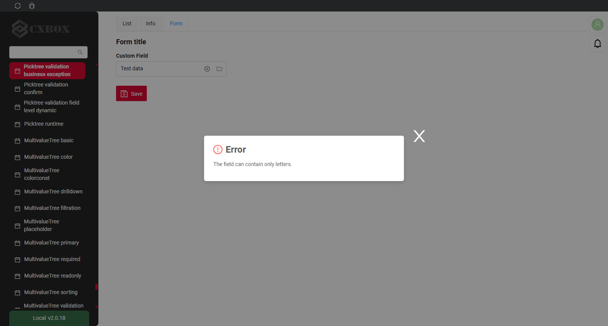
    === "RuntimeException"
        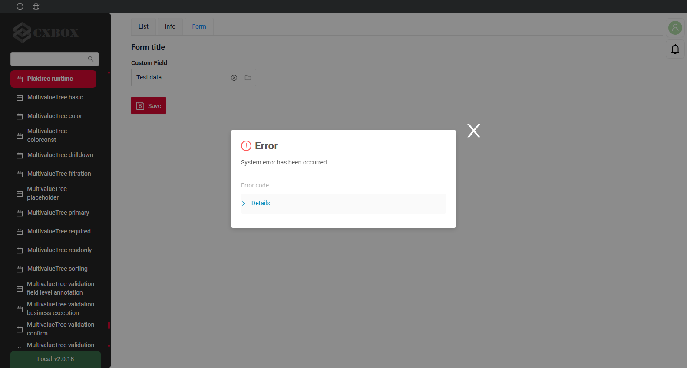
    === "Confirm"
        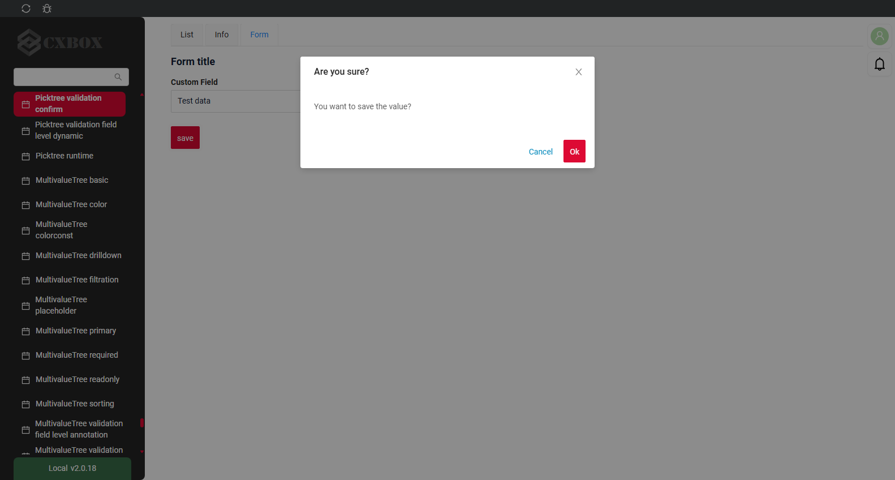
    === "Field level validation"
        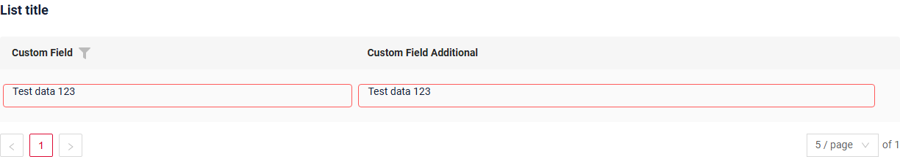
=== "Info widget"
    _not applicable_
=== "Form widget"
    === "BusinessException"
        
    === "RuntimeException"
        
    === "Confirm"
        
    === "Field level validation"
        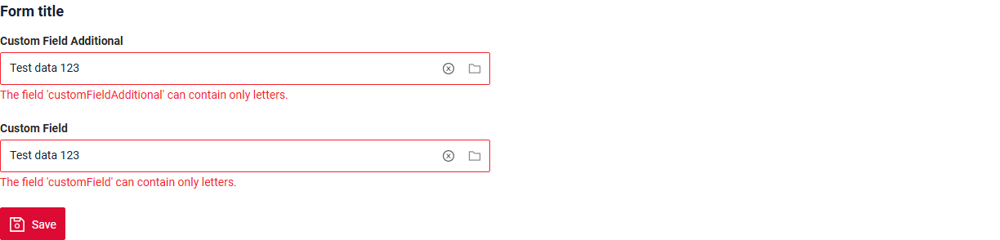
### How to add?
??? Example
    === "BusinessException"
        `BusinessException` describes an error  within a business process.

        Add **BusinessException** to corresponding **VersionAwareResponseService**.
        ```java
        --8<--
        {{ external_links.github_raw_doc }}/fields/picktree/validationbusinessex/MyExample3292Service.java:doUpdateEntity
        --8<--
        ```
        === "List widget"
            **Works for List.**
        === "Info widget"
            **_not applicable_**
        === "Form widget"
            **Works for Form.**

        [:material-play-circle: Live Sample]({{ external_links.code_samples }}/ui/#/screen/myexample3292){:target="_blank"} ·
        [:fontawesome-brands-github: GitHub]({{ external_links.github_ui }}/{{ external_links.github_branch }}/src/main/java/org/demo/documentation/fields/picktree/validationbusinessex){:target="_blank"}

    === "RuntimeException"

        `RuntimeException` describes technical error  within a business process.
        
        Add **RuntimeException** to corresponding **VersionAwareResponseService**.

        ```java
        --8<--
        {{ external_links.github_raw_doc }}/fields/picktree/validationruntimeex/MyExample3295Service.java:doUpdateEntity
        --8<--
        ```

        === "List widget"
            **Works for List.**
        === "Info widget"
            **_not applicable_**
        === "Form widget"
            **Works for Form.**

        [:material-play-circle: Live Sample]({{ external_links.code_samples }}/ui/#/screen/myexample3295){:target="_blank"} ·
        [:fontawesome-brands-github: GitHub]({{ external_links.github_ui }}/{{ external_links.github_branch }}/src/main/java/org/demo/documentation/fields/picktree/validationruntimeex){:target="_blank"}

    === "Confirm"
        Add [PreAction.confirm](/advancedCustomization_validation) to corresponding **VersionAwareResponseService**.

        ```java
        --8<--
        {{ external_links.github_raw_doc }}/fields/picktree/validationconfirm/MyExample3293Service.java:getActions
        --8<--
        ```
        === "List widget"
            **Works for List.**
        === "Info widget"
            **_not applicable_**
        === "Form widget"
            **Works for Form.**

        [:material-play-circle: Live Sample]({{ external_links.code_samples }}/ui/#/screen/myexample3293){:target="_blank"} ·
        [:fontawesome-brands-github: GitHub]({{ external_links.github_ui }}/{{ external_links.github_branch }}/src/main/java/org/demo/documentation/fields/picktree/validationconfirm){:target="_blank"}

    === "Field level validation"
        === "Option 1"
            Add javax.validation to corresponding **DataResponseDTO**.

            Use if:

            Requires a simple fields check (javax validation)
            ```java
            --8<--
            {{ external_links.github_raw_doc }}/fields/picktree/validationannotation/MyExample3291DTO.java
            --8<--
            ```
            === "List widget"
                **Works for List.**
            === "Info widget"
                **_not applicable_**
            === "Form widget"
                **Works for Form.**

            [:material-play-circle: Live Sample]({{ external_links.code_samples }}/ui/#/screen/myexample3291){:target="_blank"} ·
            [:fontawesome-brands-github: GitHub]({{ external_links.github_ui }}/{{ external_links.github_branch }}/src/main/java/org/demo/documentation/fields/picktree/validationannotation){:target="_blank"}

        === "Option 2"
            Create сustom service for business logic check.

            Use if:

            Business logic check required for fields

            `Step 1`  Create сustom method for check.
            ```java
            --8<--
            {{ external_links.github_raw_doc }}/fields/picktree/validationdynamic/MyExample3294Service.java:validateFields
            --8<--
            ```
            `Step 2` Add сustom method for check to corresponding **VersionAwareResponseService**.
            ```java
            --8<--
            {{ external_links.github_raw_doc }}/fields/picktree/validationdynamic/MyExample3294Service.java:doUpdateEntity
            --8<--
            ```

            [:material-play-circle: Live Sample]({{ external_links.code_samples }}/ui/#/screen/myexample3294){:target="_blank"} ·
            [:fontawesome-brands-github: GitHub]({{ external_links.github_ui }}/{{ external_links.github_branch }}/src/main/java/org/demo/documentation/fields/picktree/validationdynamic){:target="_blank"}

## Sorting
[:material-play-circle: Live Sample]({{ external_links.code_samples }}/ui/#/screen/myexample3290){:target="_blank"} ·
[:fontawesome-brands-github: GitHub]({{ external_links.github_ui }}/{{ external_links.github_branch }}/src/main/java/org/demo/documentation/fields/picktree/sorting){:target="_blank"}

`Sorting` allows you to sort data in ascending or descending order. Sort by value join field.

### How does it look?
=== "List widget"
    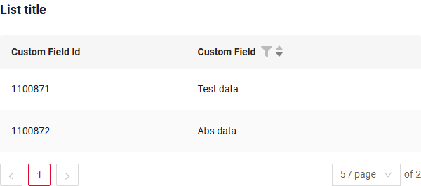
=== "Info widget"
    _not applicable_
=== "Form widget"
    _not applicable_
### How to add?
??? Example
    === "List widget"
        see more [Sorting](/widget/type/property/sorting/sorting)

        **Step 1**  Add **fields.enableSort** to corresponding **FieldMetaBuilder**.
        ```java
        --8<--
        {{ external_links.github_raw_doc }}/fields/picktree/sorting/MyExample3290Meta.java:buildIndependentMeta
        --8<--
        ```
        [:material-play-circle: Live Sample]({{ external_links.code_samples }}/ui/#/screen/myexample3290){:target="_blank"} ·
        [:fontawesome-brands-github: GitHub]({{ external_links.github_ui }}/{{ external_links.github_branch }}/src/main/java/org/demo/documentation/fields/picktree/sorting){:target="_blank"}

    === "Info widget"
        _not applicable_
    === "Form widget"
        _not applicable_


## Required
[:material-play-circle: Live Sample]({{ external_links.code_samples }}/ui/#/screen/myexample3288){:target="_blank"} ·
[:fontawesome-brands-github: GitHub]({{ external_links.github_ui }}/{{ external_links.github_branch }}/src/main/java/org/demo/documentation/fields/picktree/required){:target="_blank"}

`Required` allows you to denote, that this field must have a value provided. 

### How does it look?
=== "List widget"
    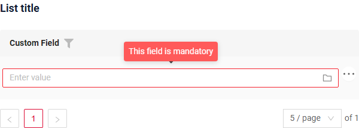
=== "Info widget"
    _not applicable_
=== "Form widget"
    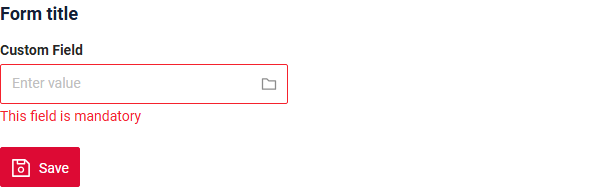
### How to add?
??? Example
    Add **fields.setRequired** to corresponding **FieldMetaBuilder**.
    ```java
    --8<--
    {{ external_links.github_raw_doc }}/fields/picktree/required/MyExample3288Meta.java:buildRowDependentMeta
    --8<--
    ```
    === "List widget"
        **Works for List.**
    === "Info widget"
        **_not applicable_**
    === "Form widget"
        **Works for Form.**

    [:material-play-circle: Live Sample]({{ external_links.code_samples }}/ui/#/screen/myexample3288){:target="_blank"} ·
    [:fontawesome-brands-github: GitHub]({{ external_links.github_ui }}/{{ external_links.github_branch }}/src/main/java/org/demo/documentation/fields/picktree/required){:target="_blank"}
