# RichText

Available since [v2.0.18](/new/version2018/)

`RichText` is a component for editing and displaying formatted multi-line text. The user formats the text with a toolbar: headings, bold, italic, underline, strikethrough, lists, quotes, code and text color.
The value is stored as Markdown, the same format that Yandex Wiki uses.

## Basics
[:material-play-circle: Live Sample]({{ external_links.code_samples }}/ui/#/screen/myexample425){:target="_blank"} ·
[:fontawesome-brands-github: GitHub]({{ external_links.github_ui }}/{{ external_links.github_branch }}/src/main/java/org/demo/documentation/fields/richtext/basic){:target="_blank"}

### How does it look?

=== "List widget"
    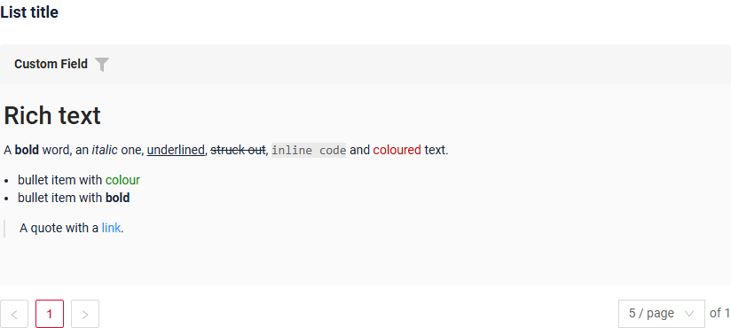
=== "Info widget"
    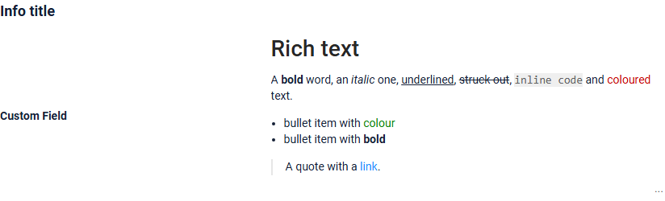
=== "Form widget"
    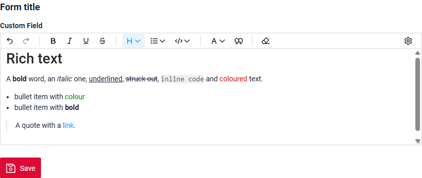

The formatting is shown in view mode and in edit mode. The toolbar is shown in edit mode only. See [Formatting](#formatting) for what the toolbar can do.

!!! warning
    The value is stored with formatting marks, for example `**bold**`. If a field stores `richText`, use the `richText` type on every widget that shows this field. A widget with another type, for example `text`, shows the marks as they are.

!!! info
    The supported content size is up to **8,000 characters**, formatting marks included.

### How to add?
??? Example
    **Step1** Add **String** field to corresponding **BaseEntity**. The value keeps formatting marks, so the column needs more room than for plain text.

    ```java
    --8<--
    {{ external_links.github_raw_doc }}/fields/richtext/basic/MyEntity425.java
    --8<--
    ```

    **Step2** Add field **String** to corresponding **DataResponseDTO**.

    ```java
    --8<--
    {{ external_links.github_raw_doc }}/fields/richtext/basic/MyExample425DTO.java
    --8<--
    ```

    === "List widget"
        **Step3** Add to **_.widget.json_**.

        ```json
        --8<--
        {{ external_links.github_raw_doc }}/fields/richtext/basic/MyExample425List.widget.json
        --8<--
        ```
    === "Info widget"
        **Step3** Add to **_.widget.json_**.

        ```json
        --8<--
        {{ external_links.github_raw_doc }}/fields/richtext/basic/MyExample425Info.widget.json
        --8<--
        ```

    === "Form widget"
        **Step3** Add to **_.widget.json_**.

        ```json
        --8<--
        {{ external_links.github_raw_doc }}/fields/richtext/basic/MyExample425Form.widget.json
        --8<--
        ```

    [:material-play-circle: Live Sample]({{ external_links.code_samples }}/ui/#/screen/myexample425){:target="_blank"} ·
    [:fontawesome-brands-github: GitHub]({{ external_links.github_ui }}/{{ external_links.github_branch }}/src/main/java/org/demo/documentation/fields/richtext/basic){:target="_blank"}

## Placeholder
[:material-play-circle: Live Sample]({{ external_links.code_samples }}/ui/#/screen/myexample426){:target="_blank"} ·
[:fontawesome-brands-github: GitHub]({{ external_links.github_ui }}/{{ external_links.github_branch }}/src/main/java/org/demo/documentation/fields/richtext/placeholder){:target="_blank"}

`Placeholder` allows you to provide a concise hint, guiding users on the expected value. This hint is displayed before any user input. It can be calculated based on business logic of application. It is shown for a `Readonly` field as well.

!!! note "Visual editor: since release 3.0.2"
    Up to and including [release 3.0.1](https://doc.cxbox.org/new/version3001/), the placeholder is shown only in the **Markdown markup** mode, the visual editor shows an empty field.
    Since [release 3.0.2](https://doc.cxbox.org/new/version3002/), the placeholder is shown in both modes.

### How does it look?
=== "List widget"
    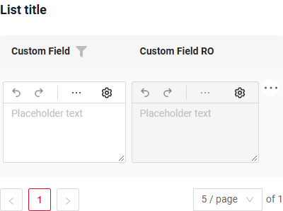
=== "Info widget"
    _not applicable_
=== "Form widget"
    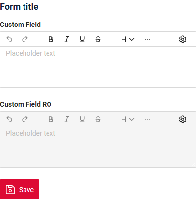
### How to add?
??? Example

    Add **fields.setPlaceholder** to corresponding **FieldMetaBuilder**.

    ```java
    --8<--
    {{ external_links.github_raw_doc }}/fields/richtext/placeholder/MyExample426Meta.java:buildRowDependentMeta
    --8<--
    ```
    === "List widget"
        **Works for List.**
    === "Info widget"
        **_not applicable_**
    === "Form widget"
        **Works for Form.**

    [:material-play-circle: Live Sample]({{ external_links.code_samples }}/ui/#/screen/myexample426){:target="_blank"} ·
    [:fontawesome-brands-github: GitHub]({{ external_links.github_ui }}/{{ external_links.github_branch }}/src/main/java/org/demo/documentation/fields/richtext/placeholder){:target="_blank"}

## Color
**not available**

## Readonly/Editable
`Readonly/Editable` indicates whether the field can be edited or not. It can be calculated based on business logic of application

`Editable`
[:material-play-circle: Live Sample]({{ external_links.code_samples }}/ui/#/screen/myexample425){:target="_blank"} ·
[:fontawesome-brands-github: GitHub]({{ external_links.github_ui }}/{{ external_links.github_branch }}/src/main/java/org/demo/documentation/fields/richtext/basic){:target="_blank"}

`Readonly`
[:material-play-circle: Live Sample]({{ external_links.code_samples }}/ui/#/screen/myexample427){:target="_blank"} ·
[:fontawesome-brands-github: GitHub]({{ external_links.github_ui }}/{{ external_links.github_branch }}/src/main/java/org/demo/documentation/fields/richtext/ro){:target="_blank"}

### How does it look?
=== "Editable"
    === "List widget"
        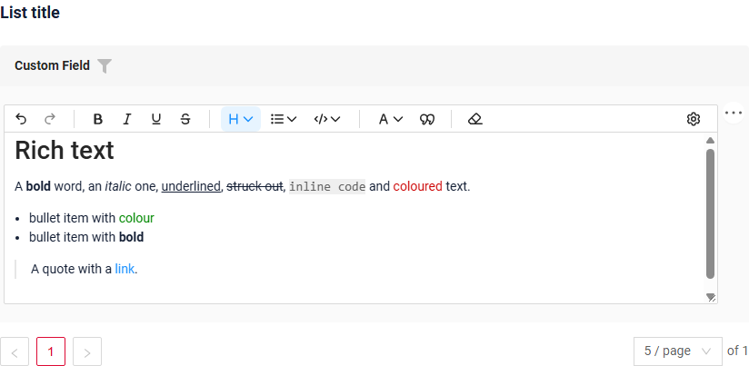
    === "Info widget"
        _not applicable_
    === "Form widget"
        
=== "Readonly"
    === "List widget"
        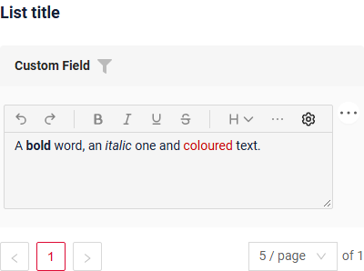
    === "Info widget"
        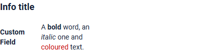
    === "Form widget"
        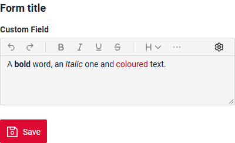

### How to add?
??? Example
    === "Editable"
        **Step1** Add mapping DTO->entity to corresponding **VersionAwareResponseService**.
        ```java
        --8<--
        {{ external_links.github_raw_doc }}/fields/richtext/basic/MyExample425Service.java:doUpdateEntity
        --8<--
        ```
        **Step2** Add **fields.setEnabled** to corresponding **FieldMetaBuilder**.
        ```java
        --8<--
        {{ external_links.github_raw_doc }}/fields/richtext/basic/MyExample425Meta.java:buildRowDependentMeta
        --8<--
        ```
        === "List widget"
            **Works for List.**
        === "Info widget"
            **_not applicable_**
        === "Form widget"
            **Works for Form.**

        [:material-play-circle: Live Sample]({{ external_links.code_samples }}/ui/#/screen/myexample425){:target="_blank"} ·
        [:fontawesome-brands-github: GitHub]({{ external_links.github_ui }}/{{ external_links.github_branch }}/src/main/java/org/demo/documentation/fields/richtext/basic){:target="_blank"}

    === "Readonly"

        **Option 1** Enabled by default.
        ```java
        --8<--
        {{ external_links.github_raw_doc }}/fields/richtext/ro/MyExample427Meta.java:buildRowDependentMeta
        --8<--
        ```
        **Option 2** `Not recommended.` Property fields.setDisabled() overrides the enabled field if you use after property fields.setEnabled.

        === "List widget"
            **Works for List.**
        === "Info widget"
             **Works for Info.**
        === "Form widget"
            **Works for Form.**

        [:material-play-circle: Live Sample]({{ external_links.code_samples }}/ui/#/screen/myexample427){:target="_blank"} ·
        [:fontawesome-brands-github: GitHub]({{ external_links.github_ui }}/{{ external_links.github_branch }}/src/main/java/org/demo/documentation/fields/richtext/ro){:target="_blank"}

## Filtering
`Filtering` allows you to search data based on criteria.
For `MyExample field` filtering is case-insensitive and retrieves records containing the specified value at any position (similar to SQL ```Like %value%``` ).

**Plain text**

[:material-play-circle: Live Sample]({{ external_links.code_samples }}/ui/#/screen/myexample438){:target="_blank"} ·
[:fontawesome-brands-github: GitHub]({{ external_links.github_ui }}/{{ external_links.github_branch }}/src/main/java/org/demo/documentation/fields/richtext/filtrationplaintext){:target="_blank"}

The filter compares only letters and digits, so formatting marks do not get in the way: `metal type` finds "**Metal** type".

**Default** `not recommended`

[:material-play-circle: Live Sample]({{ external_links.code_samples }}/ui/#/screen/myexample428){:target="_blank"} ·
[:fontawesome-brands-github: GitHub]({{ external_links.github_ui }}/{{ external_links.github_branch }}/src/main/java/org/demo/documentation/fields/richtext/filtration){:target="_blank"}

The filter searches the stored value with formatting marks: `metal type` does not find "**Metal** type", because the bold marks stand between the words (`**Metal** type`).

### How does it look?
=== "Plain text"
    === "List widget"
        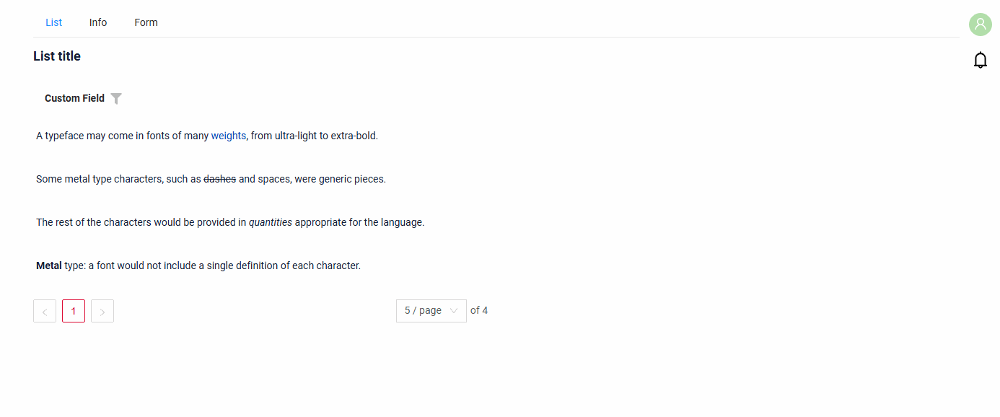
    === "Info widget"
        _not applicable_
    === "Form widget"
        _not applicable_
=== "Default (not recommended)"
    === "List widget"
        
    === "Info widget"
        _not applicable_
    === "Form widget"
        _not applicable_

### How to add?
??? Example
    === "Plain text"
        **Step 1** Add a column with only the letters and digits of the value to corresponding **BaseEntity**. The database computes it, the application does not write it.
        In the sample the table is created by Hibernate, so the column is described in `columnDefinition` (PostgreSQL). If the table is created by Liquibase, add the column by the SQL of Step 5.
        ```java
        --8<--
        {{ external_links.github_raw_doc }}/fields/richtext/filtrationplaintext/MyEntity438.java
        --8<--
        ```
        **Step 2** Add a provider that keeps only the letters and digits of the value the user typed in the filter.
        ```java
        --8<--
        {{ external_links.github_raw_doc }}/fields/richtext/filtrationplaintext/PlainTextValueProvider.java
        --8<--
        ```
        **Step 3** Add **@SearchParameter** with this column and this provider to the field of corresponding **DataResponseDTO**. (Advanced customization [SearchParameter](/advancedCustomization/element/searchparameter/searchparameter))
        ```java
        --8<--
        {{ external_links.github_raw_doc }}/fields/richtext/filtrationplaintext/MyExample438DTO.java
        --8<--
        ```
        **Step 4** Add **fields.enableFilter** to corresponding **FieldMetaBuilder**.
        ```java
        --8<--
        {{ external_links.github_raw_doc }}/fields/richtext/filtrationplaintext/MyExample438Meta.java:buildIndependentMeta
        --8<--
        ```
        **Step 5** For a large table, add an index. The filter sends `upper(column) LIKE '%VALUE%'`, so the index is built on `upper(column)`.

        === "PostgreSQL"
            ```sql
            -- the column, if the table is created by Liquibase
            ALTER TABLE my_entity ADD COLUMN custom_field_plain text
              GENERATED ALWAYS AS (regexp_replace(custom_field, '[^[:alnum:]]', '', 'g')) STORED;
            -- the index for LIKE '%value%'
            CREATE EXTENSION IF NOT EXISTS pg_trgm;
            CREATE INDEX my_entity_custom_field_plain_trgm ON my_entity USING gin (upper(custom_field_plain) gin_trgm_ops);
            ```
        === "Oracle"
            ```sql
            -- the column, for a VARCHAR2 column CUSTOM_FIELD
            ALTER TABLE MY_ENTITY ADD CUSTOM_FIELD_PLAIN VARCHAR2(4000)
              GENERATED ALWAYS AS (REGEXP_REPLACE(CUSTOM_FIELD, '[^[:alnum:]]', '')) VIRTUAL;
            ```
            An ordinary Oracle index does not speed up `LIKE '%value%'`: the value starts with `%`.

        !!! restriction
            The filter compares only letters and digits, in the column and in the typed value: spaces, punctuation and formatting marks are ignored.
            So `metal type`, `metaltype` and `Metal-Type` find "**Metal** type" alike. The name of a text color and the address of a link are letters too, so they are found as well.

        === "List widget"
            **Works for List.**
        === "Info widget"
            _not applicable_
        === "Form widget"
            _not applicable_

        [:material-play-circle: Live Sample]({{ external_links.code_samples }}/ui/#/screen/myexample438){:target="_blank"} ·
        [:fontawesome-brands-github: GitHub]({{ external_links.github_ui }}/{{ external_links.github_branch }}/src/main/java/org/demo/documentation/fields/richtext/filtrationplaintext){:target="_blank"}

    === "Default (not recommended)"
        `Not recommended.` The filter searches the stored value with formatting marks.

        **Step 1** Add **@SearchParameter** to corresponding **DataResponseDTO**. (Advanced customization [SearchParameter](/advancedCustomization/element/searchparameter/searchparameter))
        ```java
        --8<--
        {{ external_links.github_raw_doc }}/fields/richtext/filtration/MyExample428DTO.java
        --8<--
        ```
        **Step 2**  Add **fields.enableFilter** to corresponding **FieldMetaBuilder**.
        ```java
        --8<--
        {{ external_links.github_raw_doc }}/fields/richtext/filtration/MyExample428Meta.java:buildIndependentMeta
        --8<--
        ```
        === "List widget"
            **Works for List.**
        === "Info widget"
            _not applicable_
        === "Form widget"
            _not applicable_

        [:material-play-circle: Live Sample]({{ external_links.code_samples }}/ui/#/screen/myexample428){:target="_blank"} ·
        [:fontawesome-brands-github: GitHub]({{ external_links.github_ui }}/{{ external_links.github_branch }}/src/main/java/org/demo/documentation/fields/richtext/filtration){:target="_blank"}

## Drilldown
**not available**

## Validation
`Validation` allows you to check any business rules for user-entered value. There are types of validation:

1) Exception:Displays a message to notify users about technical or business errors.

   `Business Exception`:
   [:material-play-circle: Live Sample]({{ external_links.code_samples }}/ui/#/screen/myexample431){:target="_blank"} ·
   [:fontawesome-brands-github: GitHub]({{ external_links.github_ui }}/{{ external_links.github_branch }}/src/main/java/org/demo/documentation/fields/richtext/validationbusinessex){:target="_blank"}

   `Runtime Exception`:
   [:material-play-circle: Live Sample]({{ external_links.code_samples }}/ui/#/screen/myexample432){:target="_blank"} ·
   [:fontawesome-brands-github: GitHub]({{ external_links.github_ui }}/{{ external_links.github_branch }}/src/main/java/org/demo/documentation/fields/richtext/validationruntimeex){:target="_blank"}

2) Confirm: Presents a dialog with an optional message, requiring user confirmation or cancellation before proceeding.

   [:material-play-circle: Live Sample]({{ external_links.code_samples }}/ui/#/screen/myexample433){:target="_blank"} ·
   [:fontawesome-brands-github: GitHub]({{ external_links.github_ui }}/{{ external_links.github_branch }}/src/main/java/org/demo/documentation/fields/richtext/validationconfirm){:target="_blank"}

3) Field level validation: shows error next to all fields, that validation failed for

   `Option 1`:
   [:material-play-circle: Live Sample]({{ external_links.code_samples }}/ui/#/screen/myexample434){:target="_blank"} ·
   [:fontawesome-brands-github: GitHub]({{ external_links.github_ui }}/{{ external_links.github_branch }}/src/main/java/org/demo/documentation/fields/richtext/validationannotation){:target="_blank"}

   `Option 2`:
   [:material-play-circle: Live Sample]({{ external_links.code_samples }}/ui/#/screen/myexample435){:target="_blank"} ·
   [:fontawesome-brands-github: GitHub]({{ external_links.github_ui }}/{{ external_links.github_branch }}/src/main/java/org/demo/documentation/fields/richtext/validationdynamic){:target="_blank"}

The value is checked as it is stored, with formatting marks. In the samples the value can contain no more than 50 characters: "A **short** note." counts 17 characters (`A **short** note.`), not 13.

### How does it look?
=== "List widget"
    === "BusinessException"
        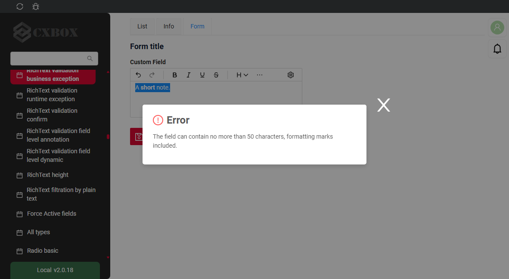
    === "RuntimeException"
        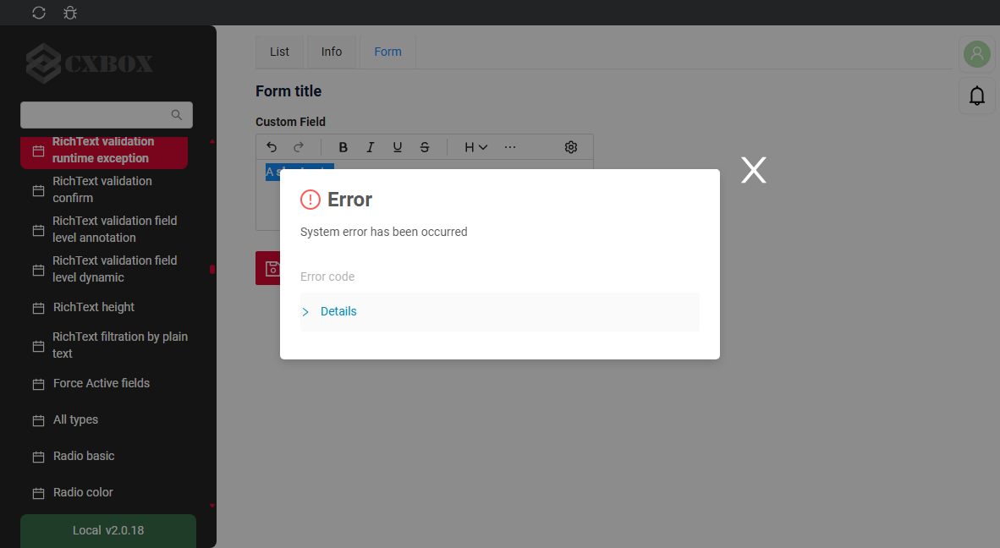
    === "Confirm"
        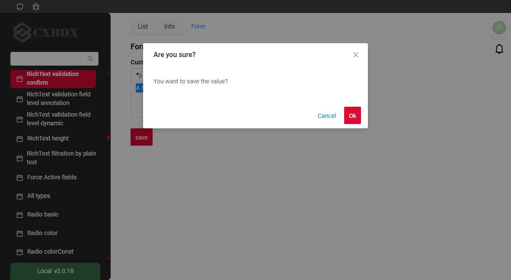
    === "Field level validation"
        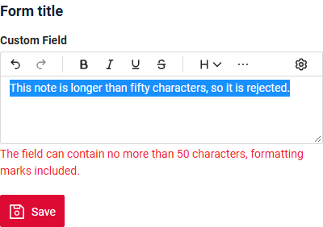
=== "Info widget"
    _not applicable_
=== "Form widget"
    === "BusinessException"
        
    === "RuntimeException"
        
    === "Confirm"
        
    === "Field level validation"
        
### How to add?
??? Example
    === "BusinessException"
        `BusinessException` describes an error  within a business process.

        Add **BusinessException** to corresponding **VersionAwareResponseService**.
        ```java
        --8<--
        {{ external_links.github_raw_doc }}/fields/richtext/validationbusinessex/MyExample431Service.java:doUpdateEntity
        --8<--
        ```
        === "List widget"
            **Works for List.**
        === "Info widget"
            **_not applicable_**
        === "Form widget"
            **Works for Form.**

        [:material-play-circle: Live Sample]({{ external_links.code_samples }}/ui/#/screen/myexample431){:target="_blank"} ·
        [:fontawesome-brands-github: GitHub]({{ external_links.github_ui }}/{{ external_links.github_branch }}/src/main/java/org/demo/documentation/fields/richtext/validationbusinessex){:target="_blank"}

    === "RuntimeException"

        `RuntimeException` describes technical error  within a business process.

        Add **RuntimeException** to corresponding **VersionAwareResponseService**.
        ```java
        --8<--
        {{ external_links.github_raw_doc }}/fields/richtext/validationruntimeex/MyExample432Service.java:doUpdateEntity
        --8<--
        ```

        === "List widget"
            **Works for List.**
        === "Info widget"
            **_not applicable_**
        === "Form widget"
            **Works for Form.**

        [:material-play-circle: Live Sample]({{ external_links.code_samples }}/ui/#/screen/myexample432){:target="_blank"} ·
        [:fontawesome-brands-github: GitHub]({{ external_links.github_ui }}/{{ external_links.github_branch }}/src/main/java/org/demo/documentation/fields/richtext/validationruntimeex){:target="_blank"}

    === "Confirm"
        Add [PreAction.confirm](/advancedCustomization_validation) to corresponding **VersionAwareResponseService**.
        ```java
        --8<--
        {{ external_links.github_raw_doc }}/fields/richtext/validationconfirm/MyExample433Service.java:getActions
        --8<--
        ```
        === "List widget"
            **Works for List.**
        === "Info widget"
            **_not applicable_**
        === "Form widget"
            **Works for Form.**

        [:material-play-circle: Live Sample]({{ external_links.code_samples }}/ui/#/screen/myexample433){:target="_blank"} ·
        [:fontawesome-brands-github: GitHub]({{ external_links.github_ui }}/{{ external_links.github_branch }}/src/main/java/org/demo/documentation/fields/richtext/validationconfirm){:target="_blank"}

    === "Field level validation"
        === "Option 1"
            Use if:

            Requires a simple fields check (javax validation)

            Add javax.validation to corresponding **DataResponseDTO**.
            ```java
            --8<--
            {{ external_links.github_raw_doc }}/fields/richtext/validationannotation/MyExample434DTO.java
            --8<--
            ```
            === "List widget"
                **Works for List.**
            === "Info widget"
                **_not applicable_**
            === "Form widget"
                **Works for Form.**

            [:material-play-circle: Live Sample]({{ external_links.code_samples }}/ui/#/screen/myexample434){:target="_blank"} ·
            [:fontawesome-brands-github: GitHub]({{ external_links.github_ui }}/{{ external_links.github_branch }}/src/main/java/org/demo/documentation/fields/richtext/validationannotation){:target="_blank"}

        === "Option 2"
            Create сustom service for business logic check.

            Use if:

            Business logic check required for fields

            `Step 1`  Create сustom method for check.
            ```java
            --8<--
            {{ external_links.github_raw_doc }}/fields/richtext/validationdynamic/MyExample435Service.java:validateFields
            --8<--
            ```
            `Step 2` Add сustom method for check to corresponding **VersionAwareResponseService**.
            ```java
            --8<--
            {{ external_links.github_raw_doc }}/fields/richtext/validationdynamic/MyExample435Service.java:doUpdateEntity
            --8<--
            ```

            [:material-play-circle: Live Sample]({{ external_links.code_samples }}/ui/#/screen/myexample435){:target="_blank"} ·
            [:fontawesome-brands-github: GitHub]({{ external_links.github_ui }}/{{ external_links.github_branch }}/src/main/java/org/demo/documentation/fields/richtext/validationdynamic){:target="_blank"}

## Sorting
[:material-play-circle: Live Sample]({{ external_links.code_samples }}/ui/#/screen/myexample429){:target="_blank"} ·
[:fontawesome-brands-github: GitHub]({{ external_links.github_ui }}/{{ external_links.github_branch }}/src/main/java/org/demo/documentation/fields/richtext/sorting){:target="_blank"}

`Sorting` allows you to sort data in ascending or descending order.
`MyExample field` is a text field, so lexicographic sorting by the stored value is used for it.

### How does it look?
=== "List widget"
    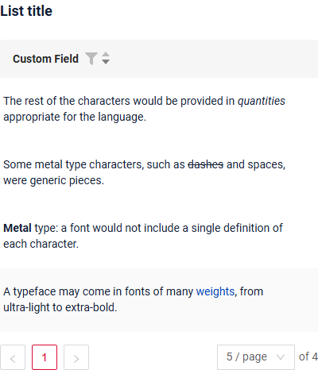
=== "Info widget"
    _not applicable_
=== "Form widget"
    _not applicable_
### How to add?
??? Example
    === "List widget"
        see more [Sorting](/widget/type/property/sorting/sorting)

        **Step 1**  Add **fields.enableSort** to corresponding **FieldMetaBuilder**.
        ```java
        --8<--
        {{ external_links.github_raw_doc }}/fields/richtext/sorting/MyExample429Meta.java:buildIndependentMeta
        --8<--
        ```
        [:material-play-circle: Live Sample]({{ external_links.code_samples }}/ui/#/screen/myexample429){:target="_blank"} ·
        [:fontawesome-brands-github: GitHub]({{ external_links.github_ui }}/{{ external_links.github_branch }}/src/main/java/org/demo/documentation/fields/richtext/sorting){:target="_blank"}

    === "Info widget"
        _not applicable_
    === "Form widget"
        _not applicable_

## Required
[:material-play-circle: Live Sample]({{ external_links.code_samples }}/ui/#/screen/myexample430){:target="_blank"} ·
[:fontawesome-brands-github: GitHub]({{ external_links.github_ui }}/{{ external_links.github_branch }}/src/main/java/org/demo/documentation/fields/richtext/required){:target="_blank"}

`Required` allows you to denote, that this field must have a value provided. By default, `RichText field` is not required

### How does it look?
=== "List widget"
    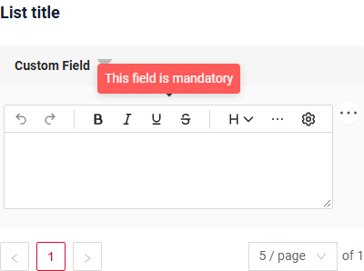
=== "Info widget"
    _not applicable_
=== "Form widget"
    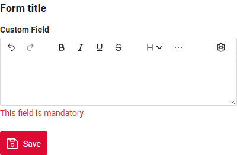
### How to add?
??? Example
    Add **fields.setRequired** to corresponding **FieldMetaBuilder**.
    ```java
    --8<--
    {{ external_links.github_raw_doc }}/fields/richtext/required/MyExample430Meta.java:buildRowDependentMeta
    --8<--
    ```
    === "List widget"
        **Works for List.**
    === "Info widget"
        **_not applicable_**
    === "Form widget"
        **Works for Form.**

    [:material-play-circle: Live Sample]({{ external_links.code_samples }}/ui/#/screen/myexample430){:target="_blank"} ·
    [:fontawesome-brands-github: GitHub]({{ external_links.github_ui }}/{{ external_links.github_branch }}/src/main/java/org/demo/documentation/fields/richtext/required){:target="_blank"}

## Additional properties

### <a id="editing-modes">Editing modes</a>
[:material-play-circle: Live Sample]({{ external_links.code_samples }}/ui/#/screen/myexample425){:target="_blank"} ·
[:fontawesome-brands-github: GitHub]({{ external_links.github_ui }}/{{ external_links.github_branch }}/src/main/java/org/demo/documentation/fields/richtext/basic){:target="_blank"}

The settings button (gear) on the toolbar switches the editor:

* **Visual Editor** - the formatted text (the default mode);
* **Markdown markup** - shows and edits the value as it is stored, with formatting marks.

A read-only or disabled field always shows the formatted text.

#### How does it look?
=== "Visual Editor"
    
=== "Markdown markup"
    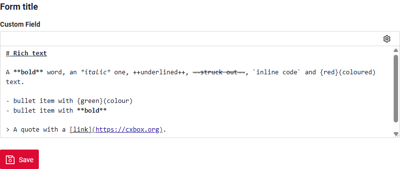

#### How to add?
??? Example
    Works by default for the `richText` field, nothing to add.

### <a id="height">Field height</a>
[:material-play-circle: Live Sample]({{ external_links.code_samples }}/ui/#/screen/myexample436){:target="_blank"} ·
[:fontawesome-brands-github: GitHub]({{ external_links.github_ui }}/{{ external_links.github_branch }}/src/main/java/org/demo/documentation/fields/richtext/height){:target="_blank"}

The height of the field is set in rows. A row is as high as a line of the `text` field, a heading takes more room.

| Parameter     | Mode                                                                        | Default |
|---------------|-----------------------------------------------------------------------------|---------|
| `minRows`     | view mode (List, Info)                                                      | 1       |
| `maxRows`     | view mode (List, Info)                                                      | 10      |
| `editMinRows` | edit mode (Form, inline editing in List); if not set, `minRows` is used     | 5       |
| `editMaxRows` | edit mode (Form, inline editing in List); if not set, `maxRows` is used     | 10      |

* In view mode, a value longer than `maxRows` is cut: the last row fades out and ends with **...**. Hovering over **...** shows the full value in a tooltip.
* In edit mode, the field grows with the text from `editMinRows` to `editMaxRows`, then a scroll bar appears. The user can drag the bottom right corner of the field within these limits.

!!! tip
    To show the whole value on Info, set a `maxRows` that the value never reaches.

#### How does it look?
=== "List widget"
    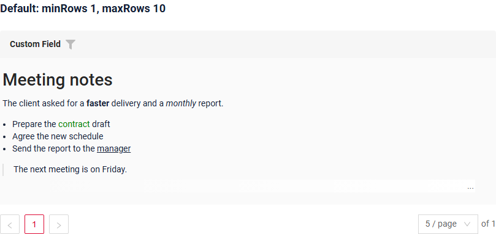
    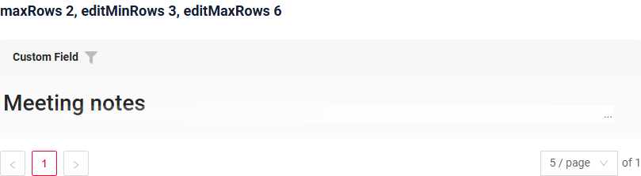
=== "Info widget"
    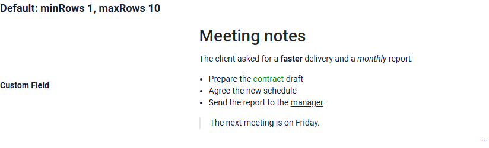
    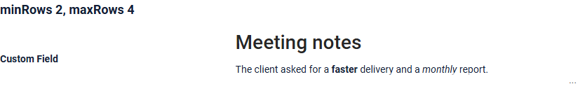
=== "Form widget"
    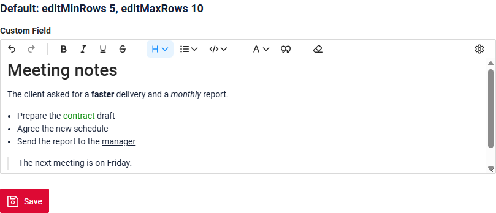
    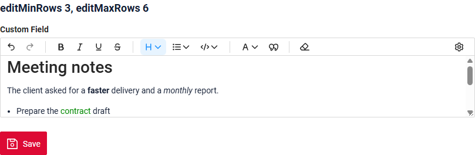

#### How to add?
??? Example
    === "List widget"
        Add **"maxRows"**, **"editMinRows"**, **"editMaxRows"** to the field in .widget.json.
        ```json
        --8<--
        {{ external_links.github_raw_doc }}/fields/richtext/height/MyExample436List.widget.json
        --8<--
        ```
    === "Info widget"
        Add **"minRows"**, **"maxRows"** to the field in .widget.json.
        ```json
        --8<--
        {{ external_links.github_raw_doc }}/fields/richtext/height/MyExample436Info.widget.json
        --8<--
        ```
    === "Form widget"
        Add **"editMinRows"**, **"editMaxRows"** to the field in .widget.json.
        ```json
        --8<--
        {{ external_links.github_raw_doc }}/fields/richtext/height/MyExample436Form.widget.json
        --8<--
        ```

    The defaults for all `richText` fields are frontend constants **richTextMinRows**, **richTextMaxRows**, **richTextEditMinRows**, **richTextEditMaxRows**:
    ```
    ui/src/fields/RichText/constants.ts
    ```

    [:material-play-circle: Live Sample]({{ external_links.code_samples }}/ui/#/screen/myexample436){:target="_blank"} ·
    [:fontawesome-brands-github: GitHub]({{ external_links.github_ui }}/{{ external_links.github_branch }}/src/main/java/org/demo/documentation/fields/richtext/height){:target="_blank"}

### <a id="formatting">Formatting</a>
[:material-play-circle: Live Sample]({{ external_links.code_samples }}/ui/#/screen/myexample425){:target="_blank"} ·
[:fontawesome-brands-github: GitHub]({{ external_links.github_ui }}/{{ external_links.github_branch }}/src/main/java/org/demo/documentation/fields/richtext/basic){:target="_blank"}

The user formats the text with the toolbar. When the field is narrow, the buttons that do not fit go to the **⋯** menu. **Undo**, **Redo** and **Clear Format** work for all formatting below.

The value is stored as Markdown, the same format that Yandex Wiki uses. Markdown cannot express some combinations of formatting, and Yandex Wiki fails in these cases too.

✅ supported, ⚠️ supported with a caveat, ❌ not supported, — not checked.

**Basics**

| #  | Feature                                          | Toolbar                                              | Status | Yandex Wiki | Stored as                        |
|----|--------------------------------------------------|------------------------------------------------------|:------:|:-----------:|----------------------------------|
| 1  | Bold                                             | Bold                                                 | ✅ | ✅ | `**bold**`                       |
| 2  | Italic                                           | Italic                                               | ✅ | ✅ | `*italic*`                       |
| 3  | Underline                                        | Underline                                            | ✅ | ✅ | `++under++`                      |
| 4  | Strikethrough                                    | Strikethrough                                        | ✅ | ✅ | `~~strike~~`                     |
| 5  | Inline code                                      | Code: Inline code                                    | ✅ | ✅ | `` `code` ``                     |
| 6  | Text color                                       | Text color: Gray, Yellow, Orange, Red, Green, Blue, Violet; Default removes the color | ✅ | ✅ | `{red}(text)` |
| 7  | Link                                             | no button, type it in the [Markdown markup](#editing-modes) | ✅ | ✅ | `[text](url)`             |
| 8  | Heading H1–H6                                    | Heading: Heading 1 … Heading 6; Text makes a paragraph | ✅ | ✅ | `# Head` … `###### Head`       |
| 9  | Bullet / ordered list, nested list               | List: Bullet List, Ordered List, Sink Item, Lift Item | ✅ | ✅ | `- item` / `1. item`           |
| 10 | Blockquote                                       | Quote                                                | ✅ | ✅ | `> quote`                        |
| 11 | Code block                                       | Code: Code block                                     | ✅ | ✅ | ` ```\ncode\n``` `               |
| 12 | Paragraph (Enter) / line break (Shift+Enter)     | keyboard                                             | ✅ | ✅ | `a\n\nb` / `a  \nb`              |
| 13 | Text starting with 4 spaces or a tab stays plain text | keyboard                                        | ✅ | — | `    text` stays text            |

**Combinations & overlaps**

| #  | Feature                                          | Status | Yandex Wiki | Stored as                          |
|----|--------------------------------------------------|:------:|:-----------:|------------------------------------|
| 14 | Two+ styles combined                             | ✅ | ✅ | `***x***`, `{red}(**x**)`          |
| 15 | Styles inside heading / list / quote             | ✅ | ✅ | `# **b** head`, `- {red}(c) item`  |
| 16 | Three+ styles overlapping in a staircase         | ✅ | ✅ | `++abc**def**++**gh~~ij~~**~~kl~~` |
| 17 | Style across a line break (Shift+Enter)          | ✅ | ✅ | `**a**  \n**b**`                   |
| 18 | Bold and italic overlapping each other           | ⚠️ | — | an invisible separator is inserted where they meet |
| 19 | Bold or italic touching a parenthesis            | ❌ | ❌ | `abc*def)*ghi` cannot be written in Markdown; the toolbar disables such formatting |

**Text color**

| #  | Feature                                          | Status | Yandex Wiki | Stored as                          |
|----|--------------------------------------------------|:------:|:-----------:|------------------------------------|
| 20 | Color over text with parentheses                 | ✅ | ✅ | `{red}(Hello \(world\))`           |
| 21 | Color across line breaks (Shift+Enter)           | ✅ | ✅ | `{red}(a)  \n{red}(b)`             |
| 22 | Color on inline code                             | ⚠️ | — | impossible, inline code excludes other styles |

!!! restriction
    * 13 - a line that starts with 4 spaces or a tab is not turned into a code block. Use **Code block** for code.
    * 18 - where bold and italic overlap, the editor adds an invisible character between them, so both are kept.
    * 19 - bold, italic, underline, strikethrough and inline code are disabled for a selection that starts or ends at a parenthesis next to a letter, for example `)def` in `abc)def`. Text color works.
    * 22 - inline code cannot have a color.
