# suggestionPickList
`suggestionPickList` is a component that allows you to select values from a dropdown list and display data from various external sources, such as microservices, files, and others.
 
## Basics
[:material-play-circle: Live Sample]({{ external_links.code_samples }}/ui/#/screen/myexample3080){:target="_blank"} ·
[:fontawesome-brands-github: GitHub]({{ external_links.github_ui }}/{{ external_links.github_branch }}/src/main/java/org/demo/documentation/fields/suggestion/basic){:target="_blank"}

### How does it look?

=== "List widget"
    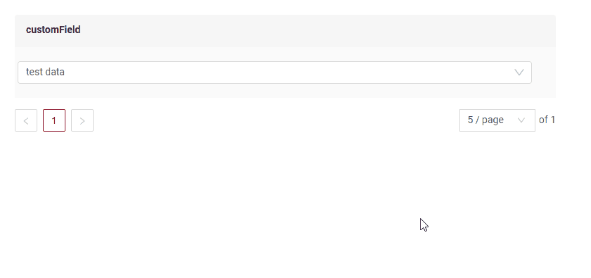
=== "Info widget"
    _not applicable_    
=== "Form widget"
    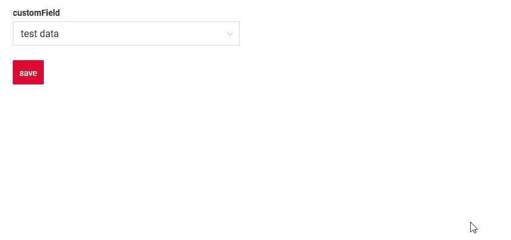

### How to add?

??? Example
    - **Step 1. Create Popup**

        In the following example, we use a microservice as the data source. The example entity creation 
        in microservices described in [Microservices](/features/element/microservices/existingmicroservices/existingmicroservices)

        +  **Step 1.1**  Create Popup List **_.widget.json_**. We create based on an entity that accesses the microservice.
            ```json
            --8<--
            {{ external_links.github_raw_doc }}/fields/suggestion/basic/microservice/MyExample3080Suggest.widget.json
            --8<--
            ```  
    -   **Step 2** Add **Popup** to **_.view.json_**.

        === "list.view.json"
            ```json
            --8<--
            {{ external_links.github_raw_doc }}/fields/suggestion/basic/microservice/myexample3091list.widget.json
            --8<--
            ```
        === "form.view.json"
            ```json
            --8<--
            {{ external_links.github_raw_doc }}/fields/suggestion/basic/microservice/myexample3091form.widget.json
            --8<--
            ```
    -   **Step3** Add bc myexamplesuggection to corresponding **EnumBcIdentifier**.
    
          ```java
          --8<--
          {{ external_links.github_raw_doc }}/fields/suggestion/basic/CxboxMyExample3080Controller.java:bc
          --8<--
          ```

    === "List widget"
        **Step4** Add suggestionPickList and pickMap to **_.widget.json_**.

        `popupBcName` — the name of the BC (Business Component) that opens in the pop-up. Requirements 2 and 3 must be satisfied.
        
        `pickMap`: Maps fields between the parent BC and popup(child) BC

        * `customField` (parent BC) <- `customFieldSuggestion` (popup(child) BC).
        * `customFieldDate` (parent BC) <- `customFieldSuggestionDate` (popup(child) BC).

        ```json
        --8<--
        {{ external_links.github_raw_doc }}/fields/suggestion/basic/microservice/MyExample3091List.widget.json
        --8<--
        ```    

    === "Info widget"
        **_not applicable_**

    === "Form widget"

        **Step4** Add suggestionPickList and pickMap to **_.widget.json_**.

        `popupBcName` — the name of the BC (Business Component) that opens in the pop-up. Requirements 2 and 3 must be satisfied.
        
        `pickMap`: Maps fields between the parent BC and popup(child) BC

        * `customField` (parent BC) <- `customFieldSuggestion` (popup(child) BC).
        * `customFieldDate` (parent BC) <- `customFieldSuggestionDate` (popup(child) BC).


        ```json
        --8<--
        {{ external_links.github_raw_doc }}/fields/suggestion/basic/microservice/MyExample3091Form.widget.json
        --8<--
        ```   

    [:material-play-circle: Live Sample]({{ external_links.code_samples }}/ui/#/screen/myexample3080){:target="_blank"} ·
    [:fontawesome-brands-github: GitHub]({{ external_links.github_ui }}/{{ external_links.github_branch }}/src/main/java/org/demo/documentation/fields/suggestion/basic){:target="_blank"}

## Placeholder
[:material-play-circle: Live Sample]({{ external_links.code_samples }}/ui/#/screen/myexample3086){:target="_blank"} ·
[:fontawesome-brands-github: GitHub]({{ external_links.github_ui }}/{{ external_links.github_branch }}/src/main/java/org/demo/documentation/fields/suggestion/placeholder){:target="_blank"}

`Placeholder` allows you to provide a concise hint, guiding users on the expected value. This hint is displayed before any user input. It can be calculated based on business logic of application
### How does it look?
=== "List widget"
    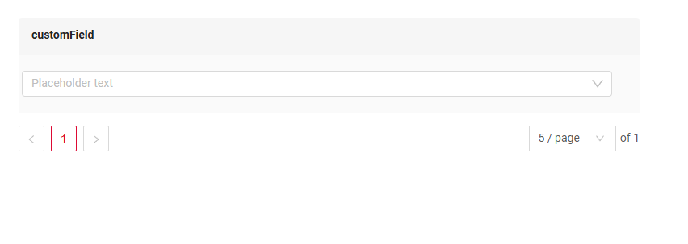
=== "Info widget"
    _not applicable_
=== "Form widget"
    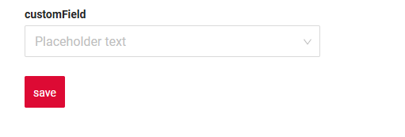
### How to add?
??? Example
    Add **fields.setPlaceholder** to corresponding **FieldMetaBuilder**.
    ```java
    --8<--
    {{ external_links.github_raw_doc }}/fields/suggestion/placeholder/forfield/MyExample3097Meta.java:buildRowDependentMeta
    --8<--
    ```  
    === "List widget"
        **Works for List.**
    === "Info widget"
        **_not applicable_**
    === "Form widget"
        **Works for Form.**

    [:material-play-circle: Live Sample]({{ external_links.code_samples }}/ui/#/screen/myexample3086){:target="_blank"} ·
    [:fontawesome-brands-github: GitHub]({{ external_links.github_ui }}/{{ external_links.github_branch }}/src/main/java/org/demo/documentation/fields/suggestion/placeholder){:target="_blank"}

 
## Color
`Color` allows you to specify a field color. It can be calculated based on business logic of application

**Calculated color**

[:material-play-circle: Live Sample]({{ external_links.code_samples }}/ui/#/screen/myexample3093list){:target="_blank"} ·
[:fontawesome-brands-github: GitHub]({{ external_links.github_ui }}/{{ external_links.github_branch }}/src/main/java/org/demo/documentation/fields/suggestion/color/colorcalc){:target="_blank"}

**Constant color**

[:material-play-circle: Live Sample]({{ external_links.code_samples }}/ui/#/screen/myexample3094list){:target="_blank"} ·
[:fontawesome-brands-github: GitHub]({{ external_links.github_ui }}/{{ external_links.github_branch }}/src/main/java/org/demo/documentation/fields/suggestion/color/colorconst){:target="_blank"}

### How does it look?
=== "List widget"
    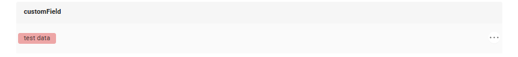
=== "Info widget"
    
=== "Form widget"
    _not applicable_

### How to add?
??? Example
    === "Calculated color"
        **Step 1**   Add `custom field for color` to corresponding **DataResponseDTO**. The field can contain a HEX color or be null.
        ```java
        --8<--
        {{ external_links.github_raw_doc }}/fields/suggestion/color/colorcalc/forfield/MyExample3093DTO.java
        --8<--
        ```    

        === "List widget"    
            **Step 2** Add **"bgColorKey"** :  `custom field for color`  to .widget.json.
            ```json
            --8<--
            {{ external_links.github_raw_doc }}/fields/suggestion/color/colorcalc/MyExample3093List.widget.json
            --8<--
            ```
        === "Info widget"
            **Step 2** Add **"bgColorKey"** :  `custom field for color`  to .widget.json.
            ```json
            --8<--
            {{ external_links.github_raw_doc }}/fields/suggestion/color/colorcalc/MyExample3093Info.widget.json
            --8<--
            ```
        === "Form widget"
            _not applicable_

        [:material-play-circle: Live Sample]({{ external_links.code_samples }}/ui/#/screen/myexample3093list){:target="_blank"} ·
        [:fontawesome-brands-github: GitHub]({{ external_links.github_ui }}/{{ external_links.github_branch }}/src/main/java/org/demo/documentation/fields/suggestion/color/colorcalc){:target="_blank"}

    === "Constant color"
        === "List widget" 
            Add **"bgColor"** :  `HEX color`  to .widget.json.
            ```json
            --8<--
            {{ external_links.github_raw_doc }}/fields/suggestion/color/colorconst/MyExample3094List.widget.json
            --8<--
            ```
        === "Info widget"
            Add **"bgColor"** :  `HEX color`  to .widget.json.
            ```json
            --8<--
            {{ external_links.github_raw_doc }}/fields/suggestion/color/colorconst/MyExample3094Info.widget.json
            --8<--
            ```
        === "Form widget"
            _not applicable_

        [:material-play-circle: Live Sample]({{ external_links.code_samples }}/ui/#/screen/myexample3094list){:target="_blank"} ·
        [:fontawesome-brands-github: GitHub]({{ external_links.github_ui }}/{{ external_links.github_branch }}/src/main/java/org/demo/documentation/fields/suggestion/color/colorconst){:target="_blank"}

## Readonly/Editable
`Readonly/Editable` indicates whether the field can be edited or not. It can be calculated based on business logic of application

`Editable`
[:material-play-circle: Live Sample]({{ external_links.code_samples }}/ui/#/screen/myexample3080){:target="_blank"} ·
[:fontawesome-brands-github: GitHub]({{ external_links.github_ui }}/{{ external_links.github_branch }}/src/main/java/org/demo/documentation/fields/suggestion/basic){:target="_blank"}

`Readonly`
[:material-play-circle: Live Sample]({{ external_links.code_samples }}/ui/#/screen/myexample3088){:target="_blank"} ·
[:fontawesome-brands-github: GitHub]({{ external_links.github_ui }}/{{ external_links.github_branch }}/src/main/java/org/demo/documentation/fields/suggestion/ro){:target="_blank"}

### How does it look?
=== "Editable"
    === "List widget"
        
    === "Info widget"
        _not applicable_
    === "Form widget"
        
=== "Readonly"
    === "List widget"
        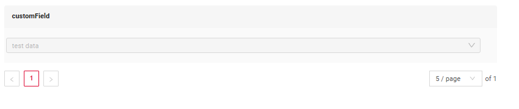
    === "Info widget"
        _not applicable_
    === "Form widget"
        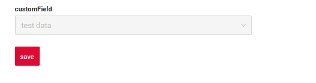

### How to add?
??? Example
    === "Editable"
        **Step1** Add mapping DTO->entity to corresponding **VersionAwareResponseService**.
        ```java
        --8<--
        {{ external_links.github_raw_doc }}/fields/suggestion/basic/microservice/forfield/MyExample3091Service.java:doUpdateEntity
        --8<--
        ```
        **Step2** Add **fields.setEnabled** to corresponding **FieldMetaBuilder**.
        ```java
        --8<--
        {{ external_links.github_raw_doc }}/fields/suggestion/basic/microservice/forfield/MyExample3091Meta.java:buildRowDependentMeta
        --8<--
        ```    
        === "List widget"
            **Works for List.**
        === "Info widget"
            **_not applicable_**
        === "Form widget"
            **Works for Form.**

        [:material-play-circle: Live Sample]({{ external_links.code_samples }}/ui/#/screen/myexample3080){:target="_blank"} ·
        [:fontawesome-brands-github: GitHub]({{ external_links.github_ui }}/{{ external_links.github_branch }}/src/main/java/org/demo/documentation/fields/suggestion/basic){:target="_blank"}

    === "Readonly"
    
        **Option 1** Enabled by default.
        ```java
        --8<--
        {{ external_links.github_raw_doc }}/fields/suggestion/ro/forfield/MyExample3099Meta.java:buildRowDependentMeta
        --8<--
        ```    
        **Option 2** `Not recommended.` Property fields.setDisabled() overrides the enabled field if you use after property fields.setEnabled.
        === "List widget"
            **Works for List.**
        === "Info widget"
            **Works for Info.**
        === "Form widget"
            **Works for Form.**

        [:material-play-circle: Live Sample]({{ external_links.code_samples }}/ui/#/screen/myexample3088){:target="_blank"} ·
        [:fontawesome-brands-github: GitHub]({{ external_links.github_ui }}/{{ external_links.github_branch }}/src/main/java/org/demo/documentation/fields/suggestion/ro){:target="_blank"}

## Filtering
[:material-play-circle: Live Sample]({{ external_links.code_samples }}/ui/#/screen/myexample3085){:target="_blank"} ·
[:fontawesome-brands-github: GitHub]({{ external_links.github_ui }}/{{ external_links.github_branch }}/src/main/java/org/demo/documentation/fields/suggestion/filtration){:target="_blank"}

`Filtering` allows you to search data based on criteria. Search uses in operator which compares ids in this case.


### How does it look?
=== "List widget"
    === "Dropdown list"
        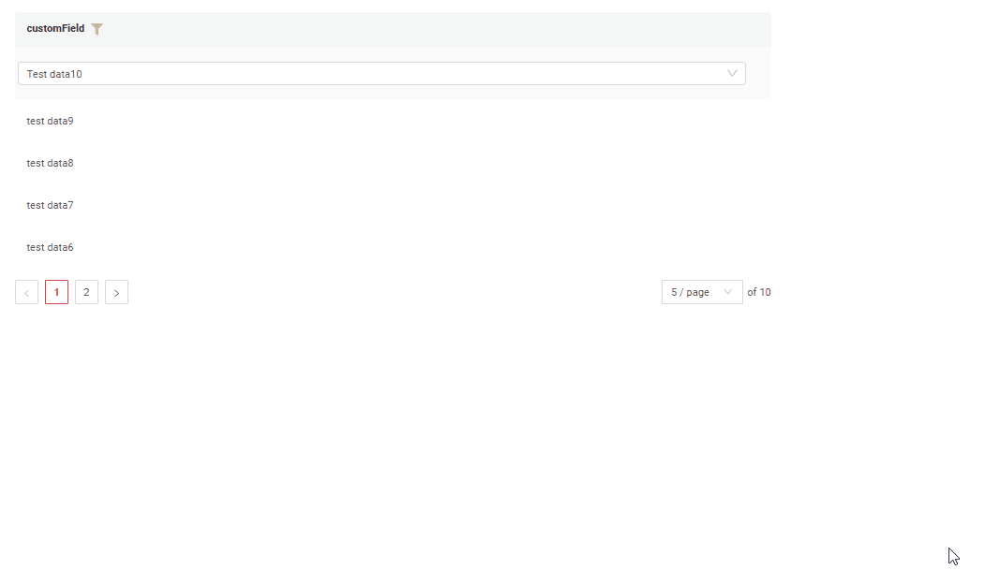
    === "Field of type suggestionPickList"
        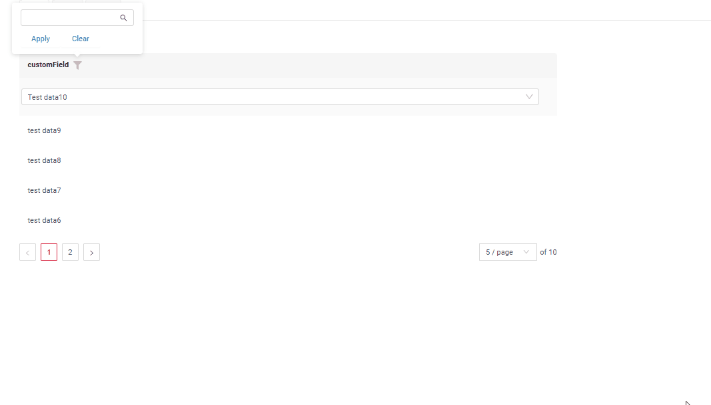
=== "Info widget"
    _not applicable_
=== "Form widget"
    _not applicable_

### How to add?
??? Example
    === "List widget"
        === "Dropdown list"
            The dropdown list filtering is performed either by an external service or by the logic described in getList.

            === "microservice"                 
                see more [microservices](features/element/microservices/microservices/#getting-data-all-getlist)
    
                ```java
                --8<--
                {{ external_links.github_raw_doc }}/fields/suggestion/filtration/MyEntity3085Dao.java
                --8<--
                ```
            === "csv" 
                ```java
                --8<--
                {{ external_links.github_raw_doc }}/fields/suggestion/basic/listvalues/forsuggectionpicklistfield/MyEntity4600Dao.java
                --8<--
                ``` 
        === "Field of type suggestionPickList"
            For fields of type suggestionPickList, the filtering matches the configuration of the corresponding field type in the database.
           
            **Step 1** Add **@SearchParameter** to corresponding **DataResponseDTO**. (Advanced customization [SearchParameter](/advancedCustomization/element/searchparameter/searchparameter))
            ```java
            --8<--
            {{ external_links.github_raw_doc }}/fields/suggestion/filtration/forfield/MyExample3096DTO.java
            --8<--
            ```
            **Step 2**  Add **fields.enableFilter** to corresponding **FieldMetaBuilder**.
            ```java
            --8<--
            {{ external_links.github_raw_doc }}/fields/suggestion/filtration/forfield/MyExample3096Meta.java:buildIndependentMeta
            --8<--
            ```
    === "Info widget"
        _not applicable_
    === "Form widget"
        _not applicable_

    [:material-play-circle: Live Sample]({{ external_links.code_samples }}/ui/#/screen/myexample3085){:target="_blank"} ·
    [:fontawesome-brands-github: GitHub]({{ external_links.github_ui }}/{{ external_links.github_branch }}/src/main/java/org/demo/documentation/fields/suggestion/filtration){:target="_blank"}
 
## Drilldown
[:material-play-circle: Live Sample]({{ external_links.code_samples }}/ui/#/screen/myexample3084){:target="_blank"} ·
[:fontawesome-brands-github: GitHub]({{ external_links.github_ui }}/{{ external_links.github_branch }}/src/main/java/org/demo/documentation/fields/suggestion/drilldown){:target="_blank"}

`DrillDown` allows you to navigate to another view by simply tapping on it. Target view and other drill-down parts can be calculated based on business logic of application

Also, it optionally allows you to filter data on target view before it will be opened `see more` [DrillDown](/features/element/drilldown/drilldown)


### How does it look?
=== "List widget"
    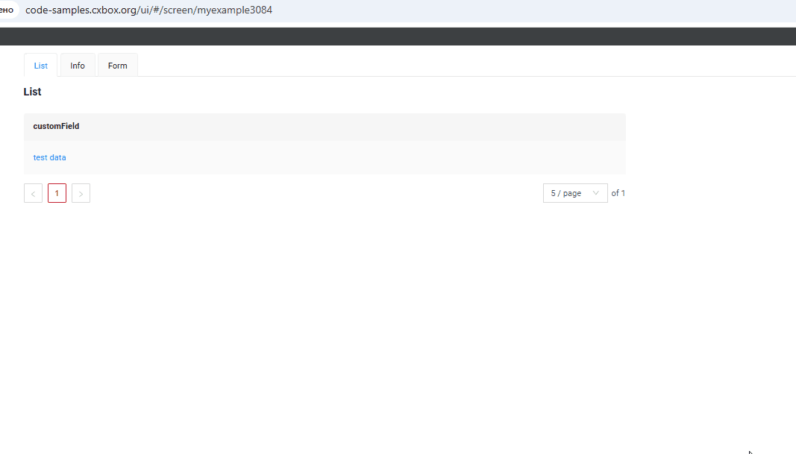
=== "Info widget"
    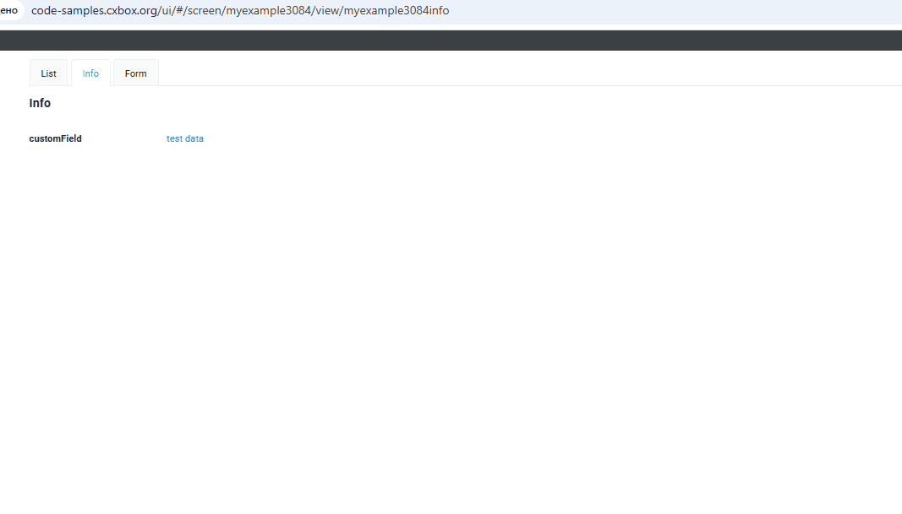
=== "Form widget"
    _not applicable_

### How to add?
??? Example

    **Option 1**

    `Step 1` Add [fields.setDrilldown](/features/element/drilldown/drilldown) to corresponding **FieldMetaBuilder**.
    ```java
    --8<--
    {{ external_links.github_raw_doc }}/fields/suggestion/drilldown/forfield/MyExample3095Meta.java:buildRowDependentMeta
    --8<--
    ```
    === "List widget"

        `Step 2` Add **"drillDown": "true"**  to .widget.json.
        ```json
        --8<--
        {{ external_links.github_raw_doc }}/fields/suggestion/drilldown/MyExample3095List.widget.json
        --8<--
        ```
        **Option 2**
           Add **"drillDownKey"** :  `custom field`  to .widget.json. See more [Drilldown](/advancedCustomization/element/drilldown/drilldown) 
 
    === "Info widget"

        `Step 2` Add **"drillDown": "true"**  to .widget.json.
        ```json
        --8<--
        {{ external_links.github_raw_doc }}/fields/suggestion/drilldown/MyExample3095Info.widget.json
        --8<--
        ```
        **Option 2**
           Add **"drillDownKey"** :  `custom field`  to .widget.json. See more [Drilldown](/advancedCustomization/element/drilldown/drilldown) 
 
    === "Form widget"
        _not applicable_

    [:material-play-circle: Live Sample]({{ external_links.code_samples }}/ui/#/screen/myexample3084){:target="_blank"} ·
    [:fontawesome-brands-github: GitHub]({{ external_links.github_ui }}/{{ external_links.github_branch }}/src/main/java/org/demo/documentation/fields/suggestion/drilldown){:target="_blank"}

[Advanced customization](/advancedCustomization/element/drilldown/drilldown)
 
## Validation
`Validation` allows you to check any business rules for user-entered value. There are types of validation:

1) Exception:Displays a message to notify users about technical or business errors.

   `Business Exception`:
   [:material-play-circle: Live Sample]({{ external_links.code_samples }}/ui/#/screen/myexample3112){:target="_blank"} ·
   [:fontawesome-brands-github: GitHub]({{ external_links.github_ui }}/{{ external_links.github_branch }}/src/main/java/org/demo/documentation/fields/suggestion/validationbusinessex){:target="_blank"}

   `Runtime Exception`:
   [:material-play-circle: Live Sample]({{ external_links.code_samples }}/ui/#/screen/myexample3119){:target="_blank"} ·
   [:fontawesome-brands-github: GitHub]({{ external_links.github_ui }}/{{ external_links.github_branch }}/src/main/java/org/demo/documentation/fields/suggestion/validationruntimeex){:target="_blank"}

2) Confirm: Presents a dialog with an optional message, requiring user confirmation or cancellation before proceeding.

   [:material-play-circle: Live Sample]({{ external_links.code_samples }}/ui/#/screen/myexample3114){:target="_blank"} ·
   [:fontawesome-brands-github: GitHub]({{ external_links.github_ui }}/{{ external_links.github_branch }}/src/main/java/org/demo/documentation/fields/suggestion/validationconfirm){:target="_blank"}

3) Field level validation: shows error next to all fields, that validation failed for

   `Option 1`:
   [:material-play-circle: Live Sample]({{ external_links.code_samples }}/ui/#/screen/myexample3110){:target="_blank"} ·
   [:fontawesome-brands-github: GitHub]({{ external_links.github_ui }}/{{ external_links.github_branch }}/src/main/java/org/demo/documentation/fields/suggestion/validationannotation){:target="_blank"}

   `Option 2`:
   [:material-play-circle: Live Sample]({{ external_links.code_samples }}/ui/#/screen/myexample3117){:target="_blank"} ·
   [:fontawesome-brands-github: GitHub]({{ external_links.github_ui }}/{{ external_links.github_branch }}/src/main/java/org/demo/documentation/fields/suggestion/validationdynamic){:target="_blank"}

### How does it look?
=== "BusinessException"
    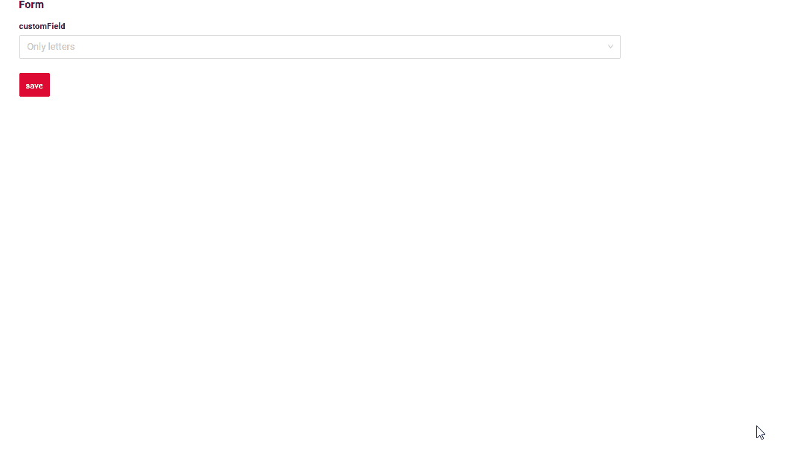
=== "RuntimeException"
    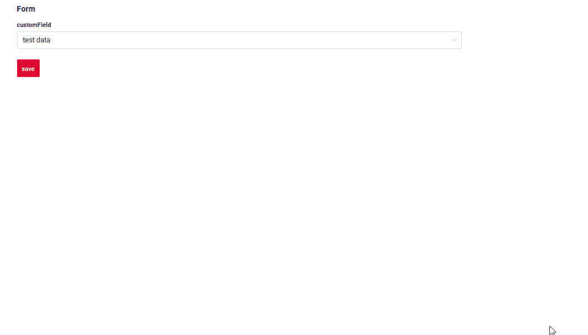
=== "Confirm"
    
=== "Field level validation"
    

### How to add?
??? Example
    === "BusinessException"
        `BusinessException` describes an error  within a business process.

        Add **BusinessException** to corresponding **VersionAwareResponseService**.
        ```java
        --8<--
        {{ external_links.github_raw_doc }}/fields/suggestion/validationbusinessex/forfield/MyExample3113Service.java:doUpdateEntity
        --8<--
        ```
        === "List widget"
            **Works for List.**
        === "Info widget"
            **_not applicable_**
        === "Form widget"
            **Works for Form.**

        [:material-play-circle: Live Sample]({{ external_links.code_samples }}/ui/#/screen/myexample3112){:target="_blank"} ·
        [:fontawesome-brands-github: GitHub]({{ external_links.github_ui }}/{{ external_links.github_branch }}/src/main/java/org/demo/documentation/fields/suggestion/validationbusinessex){:target="_blank"}

    === "RuntimeException"

        `RuntimeException` describes technical error  within a business process.
        
        Add **RuntimeException** to corresponding **VersionAwareResponseService**.

        ```java
        --8<--
        {{ external_links.github_raw_doc }}/fields/suggestion/validationruntimeex/forfield/MyExample3120Service.java:doUpdateEntity
        --8<--
        ```

        === "List widget"
            **Works for List.**
        === "Info widget"
            **_not applicable_**
        === "Form widget"
            **Works for Form.**

        [:material-play-circle: Live Sample]({{ external_links.code_samples }}/ui/#/screen/myexample3119){:target="_blank"} ·
        [:fontawesome-brands-github: GitHub]({{ external_links.github_ui }}/{{ external_links.github_branch }}/src/main/java/org/demo/documentation/fields/suggestion/validationruntimeex){:target="_blank"}

    === "Confirm"
        Add [PreAction.confirm](/advancedCustomization_validation) to corresponding **VersionAwareResponseService**.

        ```java
        --8<--
        {{ external_links.github_raw_doc }}/fields/suggestion/validationconfirm/forfield/MyExample3116Service.java:getActions
        --8<--
        ```
        === "List widget"
            **Works for List.**
        === "Info widget"
            **_not applicable_**
        === "Form widget"
            **Works for Form.**

        [:material-play-circle: Live Sample]({{ external_links.code_samples }}/ui/#/screen/myexample3114){:target="_blank"} ·
        [:fontawesome-brands-github: GitHub]({{ external_links.github_ui }}/{{ external_links.github_branch }}/src/main/java/org/demo/documentation/fields/suggestion/validationconfirm){:target="_blank"}

    === "Field level validation"
        === "Option 1"
            Add javax.validation to corresponding **DataResponseDTO**.

            Use if:

            Requires a simple fields check (javax validation)
            ```java
            --8<--
            {{ external_links.github_raw_doc }}/fields/suggestion/validationannotation/forfield/MyExample3111DTO.java
            --8<--
            ```
            === "List widget"
                **Works for List.**
            === "Info widget"
                **_not applicable_**
            === "Form widget"
                **Works for Form.**

            [:material-play-circle: Live Sample]({{ external_links.code_samples }}/ui/#/screen/myexample3110){:target="_blank"} ·
            [:fontawesome-brands-github: GitHub]({{ external_links.github_ui }}/{{ external_links.github_branch }}/src/main/java/org/demo/documentation/fields/suggestion/validationannotation){:target="_blank"}

        === "Option 2"
            Create сustom service for business logic check.

            Use if:

            Business logic check required for fields

            `Step 1`  Create сustom method for check.
            ```java
            --8<--
            {{ external_links.github_raw_doc }}/fields/suggestion/validationdynamic/forfield/MyExample3118Service.java:validateFields
            --8<--
            ```
            `Step 2` Add сustom method for check to corresponding **VersionAwareResponseService**.
            ```java
            --8<--
            {{ external_links.github_raw_doc }}/fields/suggestion/validationdynamic/forfield/MyExample3118Service.java:doUpdateEntity
            --8<--
            ```

            [:material-play-circle: Live Sample]({{ external_links.code_samples }}/ui/#/screen/myexample3117){:target="_blank"} ·
            [:fontawesome-brands-github: GitHub]({{ external_links.github_ui }}/{{ external_links.github_branch }}/src/main/java/org/demo/documentation/fields/suggestion/validationdynamic){:target="_blank"}

## Sorting
[:material-play-circle: Live Sample]({{ external_links.code_samples }}/ui/#/screen/myexample3122){:target="_blank"} ·
[:fontawesome-brands-github: GitHub]({{ external_links.github_ui }}/{{ external_links.github_branch }}/src/main/java/org/demo/documentation/fields/suggestion/sorting){:target="_blank"}

`Sorting` allows you to sort data in ascending or descending order. Sort by value join field.

### How does it look?
=== "List widget"
    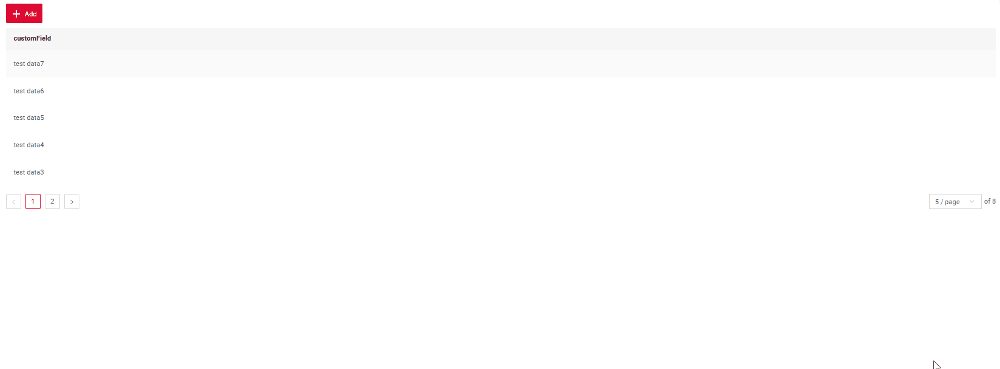
=== "Info widget"
    _not applicable_
=== "Form widget"
    _not applicable_
### How to add?
??? Example
    === "List widget"
        see more [Sorting](/widget/type/property/sorting/sorting)

        **Step 1**  Add **fields.enableSort** to corresponding **FieldMetaBuilder**.
        ```java
        --8<--
        {{ external_links.github_raw_doc }}/fields/suggestion/sorting/forfield/MyExample3122Meta.java:buildIndependentMeta
        --8<--
        ```
        [:material-play-circle: Live Sample]({{ external_links.code_samples }}/ui/#/screen/myexample3122){:target="_blank"} ·
        [:fontawesome-brands-github: GitHub]({{ external_links.github_ui }}/{{ external_links.github_branch }}/src/main/java/org/demo/documentation/fields/suggestion/sorting){:target="_blank"}

    === "Info widget"
        _not applicable_
    === "Form widget"
        _not applicable_


## Required
[:material-play-circle: Live Sample]({{ external_links.code_samples }}/ui/#/screen/myexample3087){:target="_blank"} ·
[:fontawesome-brands-github: GitHub]({{ external_links.github_ui }}/{{ external_links.github_branch }}/src/main/java/org/demo/documentation/fields/suggestion/required){:target="_blank"}

`Required` allows you to denote, that this field must have a value provided.

### How does it look?
=== "List widget"
    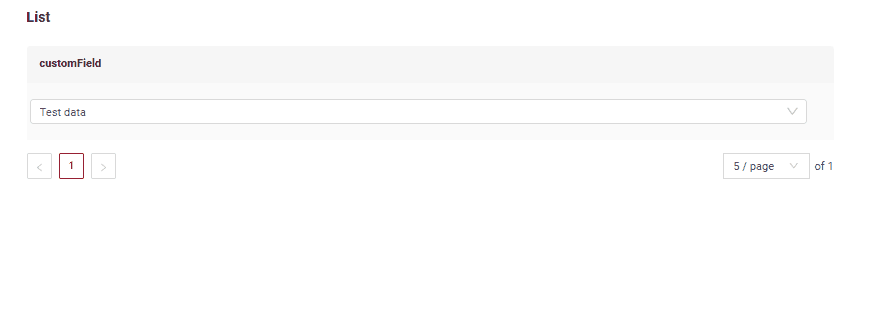
=== "Info widget"
    _not applicable_
=== "Form widget"
    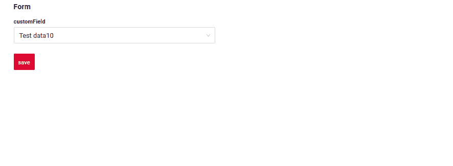
### How to add?
??? Example
    Add **fields.setRequired** to corresponding **FieldMetaBuilder**.
    ```java
    --8<--
    {{ external_links.github_raw_doc }}/fields/suggestion/required/forfield/MyExample3098Meta.java:buildRowDependentMeta
    --8<--
    ```
=== "List widget"
    **Works for List.**
=== "Info widget"
    **_not applicable_**
=== "Form widget"
    **Works for Form.**

    [:material-play-circle: Live Sample]({{ external_links.code_samples }}/ui/#/screen/myexample3087){:target="_blank"} ·
    [:fontawesome-brands-github: GitHub]({{ external_links.github_ui }}/{{ external_links.github_branch }}/src/main/java/org/demo/documentation/fields/suggestion/required){:target="_blank"}
