# Time
`Time`  is a component for time editing. It can be used for editing and displaying time.

## Basics
[:material-play-circle: Live Sample]({{ external_links.code_samples }}/ui/#/screen/myexample3500){:target="_blank"} ·
[:fontawesome-brands-github: GitHub]({{ external_links.github_ui }}/{{ external_links.github_branch }}/src/main/java/org/demo/documentation/fields/time/base){:target="_blank"}

The time type supports various formats for representing and manipulating time values. 

!!! info
    The format of this field is designed to support business scenarios in which the same field is used in different contexts:
     as **date and time** , as **time only**.

    This approach allows for consistent data storage while providing flexible representation and usage across different parts of the system.

**Supported Formats**:

| Format       | Value range           | Example     |
| ------------ | --------------------- | ----------- |
| *default*    | 00–23 : 00–59 : 00–59 | 15:45:28    |
| `HH:mm:ss`   | 00–23 : 00–59 : 00–59 | 15:45:28    |
| `HH:mm`      | 00–23 : 00–59         | 15:28       |
| `HH`         | 00–23                 | 15          |
| `hh:mm:ss A` | 01–12 : 00–59 : 00–59 | 03:45:28 PM |
| `hh:mm A`    | 01–12 : 00–59         | 03:28 PM    |
| `hh A`       | 01–12                 | 03 PM       |

**NOT supported formats**

| Format  | Value range   | Example |
| ------- | ------------- | ------- |
| `mm:ss` | 00–59 : 00–59 | 45:28   |
| `mm`    | 00–59         | 15      |
| `ss`    | 00–59         | 28      |


### How does it look?

=== "List widget"
    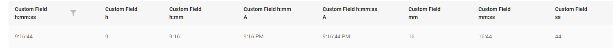
=== "Info widget"
    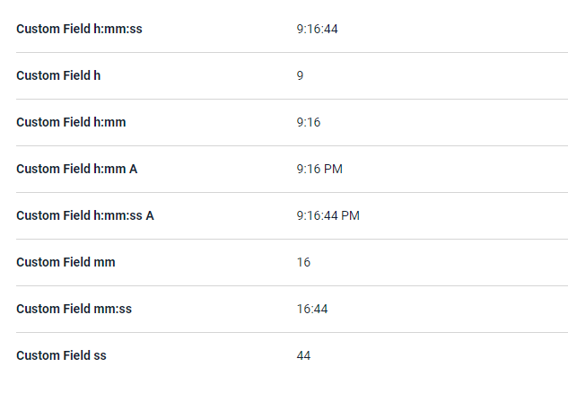
=== "Form widget"
    


### How to add?
??? Example
    === "LocalDateTime(recommended)"

        [:material-play-circle: Live Sample]({{ external_links.code_samples }}/ui/#/screen/myexample3500){:target="_blank"} ·
        [:fontawesome-brands-github: GitHub]({{ external_links.github_ui }}/{{ external_links.github_branch }}/src/main/java/org/demo/documentation/fields/time/base){:target="_blank"}

        We recommend using the **`LocalDateTime`** type, as the format of this field is designed to support business scenarios in which the same field is used in different contexts:
        
        * in some cases, it is treated as **date and time** (for example, when creating a meeting);
          * in other cases, the **same field** is displayed as **time only**, without a date.
        
        This approach ensures consistent data modeling while allowing flexible representation of the field across different parts of the system.

        **Step1** Add field **LocalDateTime** to corresponding **BaseEntity**.
        ```java
        --8<--
        {{ external_links.github_raw_doc }}/fields/time/base/MyEntity3500.java
        --8<--
        ```
    
        **Step2**  Add field **LocalDateTime** to corresponding **DataResponseDTO**.
        ```java
        --8<--
        {{ external_links.github_raw_doc }}/fields/time/base/Example3500DTO.java
        --8<--
        ```

        === "List widget"
            **Step3** Add to **_.widget.json_**.
    
            To set the format, add  "format".  
    
            By default, there will be a standard format applied: "HH : mm:ss"
            ```json
            --8<--
            {{ external_links.github_raw_doc }}/fields/time/base/MyExample3500List.widget.json
            --8<--
            ```
        === "Info widget"
            **Step3** Add to **_.widget.json_**.
            
            ```json
            --8<--
            {{ external_links.github_raw_doc }}/fields/time/base/MyExample3500Info.widget.json
            --8<--
            ```
    
        === "Form widget"
    
            **Step3** Add to **_.widget.json_**.
    
            ```json
            --8<--
            {{ external_links.github_raw_doc }}/fields/time/base/MyExample3500Form.widget.json
            --8<--
            ```    
    
        [:material-play-circle: Live Sample]({{ external_links.code_samples }}/ui/#/screen/myexample3500){:target="_blank"} ·
        [:fontawesome-brands-github: GitHub]({{ external_links.github_ui }}/{{ external_links.github_branch }}/src/main/java/org/demo/documentation/fields/time/base){:target="_blank"}

    === "LocalTime"
        [:material-play-circle: Live Sample]({{ external_links.code_samples }}/ui/#/screen/myexample3512){:target="_blank"} ·
        [:fontawesome-brands-github: GitHub]({{ external_links.github_ui }}/{{ external_links.github_branch }}/src/main/java/org/demo/documentation/fields/time/baselocaltime){:target="_blank"}

        **Step1** Add field **LocalTime** to corresponding **BaseEntity**.
        ```java
        --8<--
        {{ external_links.github_raw_doc }}/fields/time/baselocaltime/MyEntity3512.java
        --8<--
        ```
    
        **Step2**  Add field **LocalTime** to corresponding **DataResponseDTO**.
        Add  @JsonSerialize(using = LocalTimeWithDateSerializer.class).
        Add  @JsonDeserialize(using = LocalTimeWithDateDeserializer.class).

        ```java
        --8<--
        {{ external_links.github_raw_doc }}/fields/time/baselocaltime/MyExample3512DTO.java
        --8<--
        ```

        === "List widget"
            **Step3** Add to **_.widget.json_**.
    
            To set the format, add  "format".  
    
            By default, there will be a standard format applied: "HH : mm:ss"
            ```json
            --8<--
            {{ external_links.github_raw_doc }}/fields/time/baselocaltime/MyExample3512List.widget.json
            --8<--
            ```
        === "Info widget"
            **Step3** Add to **_.widget.json_**.
            
            ```json
            --8<--
            {{ external_links.github_raw_doc }}/fields/time/baselocaltime/MyExample3512Info.widget.json
            --8<--
            ```
    
        === "Form widget"
    
            **Step3** Add to **_.widget.json_**.
    
            ```json
            --8<--
            {{ external_links.github_raw_doc }}/fields/time/baselocaltime/MyExample3512Form.widget.json
            --8<--
            ```    
    
        [:material-play-circle: Live Sample]({{ external_links.code_samples }}/ui/#/screen/myexample3512){:target="_blank"} ·
        [:fontawesome-brands-github: GitHub]({{ external_links.github_ui }}/{{ external_links.github_branch }}/src/main/java/org/demo/documentation/fields/time/baselocaltime){:target="_blank"}

## Placeholder
[:material-play-circle: Live Sample]({{ external_links.code_samples }}/ui/#/screen/myexample3505){:target="_blank"} ·
[:fontawesome-brands-github: GitHub]({{ external_links.github_ui }}/{{ external_links.github_branch }}/src/main/java/org/demo/documentation/fields/time/placeholder){:target="_blank"}

`Placeholder` allows you to provide a concise hint, guiding users on the expected value. This hint is displayed before any user input. It can be calculated based on business logic of application.
### How does it look?
=== "List widget"
    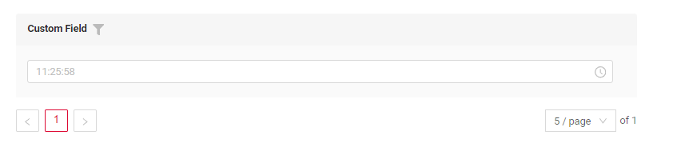
=== "Info widget"
    _not applicable_
=== "Form widget"
    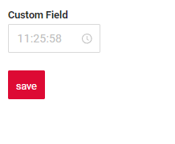

### How to add?
??? Example

    Add **fields.setPlaceholder** to corresponding **FieldMetaBuilder**.
    
    ```java
    --8<--
    {{ external_links.github_raw_doc }}/fields/time/placeholder/MyExample3505Meta.java:buildRowDependentMeta
    --8<--
    ```   

    === "List widget"
        **Works for List.**
    === "Info widget"
        **_not applicable_**
    === "Form widget"
        **Works for Form.**

    [:material-play-circle: Live Sample]({{ external_links.code_samples }}/ui/#/screen/myexample3505){:target="_blank"} ·
    [:fontawesome-brands-github: GitHub]({{ external_links.github_ui }}/{{ external_links.github_branch }}/src/main/java/org/demo/documentation/fields/time/placeholder){:target="_blank"}

## Color
`Color` allows you to specify a field color. It can be calculated based on business logic of application

**Calculated color**

[:material-play-circle: Live Sample]({{ external_links.code_samples }}/ui/#/screen/myexample3501){:target="_blank"} ·
[:fontawesome-brands-github: GitHub]({{ external_links.github_ui }}/{{ external_links.github_branch }}/src/main/java/org/demo/documentation/fields/time/color){:target="_blank"}

**Constant color**

[:material-play-circle: Live Sample]({{ external_links.code_samples }}/ui/#/screen/myexample3502){:target="_blank"} ·
[:fontawesome-brands-github: GitHub]({{ external_links.github_ui }}/{{ external_links.github_branch }}/src/main/java/org/demo/documentation/fields/time/colorconst){:target="_blank"}

### How does it look?
=== "List widget"
    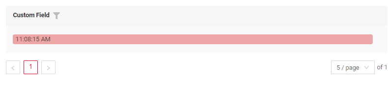

=== "Info widget"
    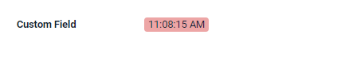

=== "Form widget"
    _not applicable_


### How to add?
??? Example
    === "Calculated color"
        **Step 1**   Add `custom field for color` to corresponding **DataResponseDTO**. The field can contain a HEX color or be null. 

        ```java
        --8<--
        {{ external_links.github_raw_doc }}/fields/time/color/MyExample3501DTO.java
        --8<--
        ```
        === "List widget"   
            **Step 2** Add **"bgColorKey"** :  `custom field for color`  to .widget.json.
            ```json
            --8<--
            {{ external_links.github_raw_doc }}/fields/time/color/MyExample3501List.widget.json
            --8<--
            ```
        === "Info widget"
            **Step 2** Add **"bgColorKey"** :  `custom field for color`  to .widget.json.
            ```json
            --8<--
            {{ external_links.github_raw_doc }}/fields/time/color/MyExample3501Info.widget.json
            --8<--
            ```   
        === "Form widget"
            _not applicable_   

        [:material-play-circle: Live Sample]({{ external_links.code_samples }}/ui/#/screen/myexample3501){:target="_blank"} ·
        [:fontawesome-brands-github: GitHub]({{ external_links.github_ui }}/{{ external_links.github_branch }}/src/main/java/org/demo/documentation/fields/time/color){:target="_blank"}

    === "Constant color"
        === "List widget" 
            Add **"bgColor"** :  `HEX color`  to .widget.json.
            ```json
            --8<--
            {{ external_links.github_raw_doc }}/fields/time/colorconst/MyExample3502List.widget.json
            --8<--
            ```

        === "Info widget"
            Add **"bgColor"** :  `HEX color`  to .widget.json.
            ```json
            --8<--
            {{ external_links.github_raw_doc }}/fields/time/colorconst/MyExample3502Info.widget.json
            --8<--
            ```   

        === "Form widget"
            _not applicable_    

        [:material-play-circle: Live Sample]({{ external_links.code_samples }}/ui/#/screen/myexample3502){:target="_blank"} ·
        [:fontawesome-brands-github: GitHub]({{ external_links.github_ui }}/{{ external_links.github_branch }}/src/main/java/org/demo/documentation/fields/time/colorconst){:target="_blank"}


 
## Readonly/Editable
`Readonly/Editable` indicates whether the field can be edited or not. It can be calculated based on business logic of application

`Editable`
[:material-play-circle: Live Sample]({{ external_links.code_samples }}/ui/#/screen/myexample3500){:target="_blank"} ·
[:fontawesome-brands-github: GitHub]({{ external_links.github_ui }}/{{ external_links.github_branch }}/src/main/java/org/demo/documentation/fields/time/basic){:target="_blank"}

`Readonly`
[:material-play-circle: Live Sample]({{ external_links.code_samples }}/ui/#/screen/myexample3507){:target="_blank"} ·
[:fontawesome-brands-github: GitHub]({{ external_links.github_ui }}/{{ external_links.github_branch }}/src/main/java/org/demo/documentation/fields/time/ro){:target="_blank"}


### How does it look?
=== "Editable"
    === "List widget"
        
    === "Info widget"
        
    === "Form widget"
        
=== "Readonly"
    === "List widget"
        
    === "Info widget"
        
    === "Form widget"
        


### How to add?
??? Example
    === "Editable"
        **Step1** Add mapping DTO->entity to corresponding **VersionAwareResponseService**.
        ```java
        --8<--
        {{ external_links.github_raw_doc }}/fields/time/base/myexample3500Service.java:doUpdateEntity
        --8<--
        ```
        **Step2** Add **fields.setEnabled** to corresponding **FieldMetaBuilder**.
        ```java
        --8<--
        {{ external_links.github_raw_doc }}/fields/time/base/myexample3500Meta.java:buildRowDependentMeta
        --8<--
        ```
        === "List widget"
            **Works for List.**
        === "Info widget"
            **_not applicable_**
        === "Form widget"
            **Works for Form.**
   
    === "Readonly"
    
        **Option 1** Enabled by default.
        ```java
        --8<--
        {{ external_links.github_raw_doc }}/fields/time/ro/MyExample3507Meta.java:buildRowDependentMeta
        --8<--
        ```    
 
        **Option 2** `Not recommended.` Property fields.setDisabled() overrides the enabled field if you use after property fields.setEnabled.
        === "List widget"
            **Works for List.**
        === "Info widget"
            **Works for Info.**
        === "Form widget"
            **Works for Form.**

 
## Filtering
[:material-play-circle: Live Sample]({{ external_links.code_samples }}/ui/#/screen/myexample3504){:target="_blank"} ·
[:fontawesome-brands-github: GitHub]({{ external_links.github_ui }}/{{ external_links.github_branch }}/src/main/java/org/demo/documentation/fields/time/filtration){:target="_blank"}

`Filtering` allows you to search data based on criteria. Search uses equals (=) operator.
### How does it look?
=== "List widget"
    
=== "Info widget"
    _not applicable_
=== "Form widget"
    _not applicable_

### How to add?
??? Example
    === "List widget"
        **Step 1** Add **@SearchParameter** to corresponding **DataResponseDTO**. (Advanced customization [SearchParameter](/advancedCustomization/element/searchparameter/searchparameter))
        ```java
        --8<--
        {{ external_links.github_raw_doc }}/fields/time/filtration/MyExample3504DTO.java   
        --8<--
        ```   
        **Step 2**  Add **fields.enableFilter** to corresponding **FieldMetaBuilder**.
        ```java
        --8<--
        {{ external_links.github_raw_doc }}/fields/time/filtration/MyExample3504Meta.java:buildIndependentMeta
        --8<--
        ```       

        [:material-play-circle: Live Sample]({{ external_links.code_samples }}/ui/#/screen/myexample3504){:target="_blank"} ·
        [:fontawesome-brands-github: GitHub]({{ external_links.github_ui }}/{{ external_links.github_branch }}/src/main/java/org/demo/documentation/fields/time/filtration){:target="_blank"}

    === "Info widget"
        _not applicable_
    === "Form widget"
        _not applicable_
 

## Drilldown
[:material-play-circle: Live Sample]({{ external_links.code_samples }}/ui/#/screen/myexample3503){:target="_blank"} ·
[:fontawesome-brands-github: GitHub]({{ external_links.github_ui }}/{{ external_links.github_branch }}/src/main/java/org/demo/documentation/fields/time/drilldown){:target="_blank"}

`DrillDown` allows you to navigate to another view by simply tapping on it. Target view and other drill-down parts can be calculated based on business logic of application

Also, it optionally allows you to filter data on target view before it will be opened `see more` [DrillDown](/features/element/drilldown/drilldown)


### How does it look?
=== "List widget"
    
=== "Info widget"
    
=== "Form widget"
    _not applicable_

### How to add?
??? Example

    **Option 1**

    `Step 1` Add [fields.setDrilldown](/features/element/drilldown/drilldown) to corresponding **FieldMetaBuilder**.
    ```java
    --8<--
    {{ external_links.github_raw_doc }}/fields/time/drilldown/MyExample3503Meta.java:buildRowDependentMeta
    --8<--
    ```
    === "List widget"
        `Step 2` Add **"drillDown": "true"**  to .widget.json.
        ```json
        --8<--
        {{ external_links.github_raw_doc }}/fields/time/drilldown/MyExample3503List.widget.json
        --8<--
        ```
        **Option 2**
           Add **"drillDownKey"** :  `custom field`  to .widget.json. See more [Drilldown](/advancedCustomization/element/drilldown/drilldown) 
 
    === "Info widget"

        `Step 2` Add **"drillDown": "true"**  to .widget.json.
        ```json
        --8<--
        {{ external_links.github_raw_doc }}/fields/time/drilldown/MyExample3503Info.widget.json
        --8<--
        ```
        **Option 2**
           Add **"drillDownKey"** :  `custom field`  to .widget.json. See more [Drilldown](/advancedCustomization/element/drilldown/drilldown) 
 
    === "Form widget"
        _not applicable_
[Advanced customization](/advancedCustomization/element/drilldown/drilldown)


## Validation
 
`Validation` allows you to check any business rules for user-entered value. There are types of validation:

1) Exception:Displays a message to notify users about technical or business errors.

   `Business Exception`:
   [:material-play-circle: Live Sample]({{ external_links.code_samples }}/ui/#/screen/myexample4101){:target="_blank"} ·
   [:fontawesome-brands-github: GitHub]({{ external_links.github_ui }}/{{ external_links.github_branch }}/src/main/java/org/demo/documentation/fields/time/validationbusinessex){:target="_blank"}

   `Runtime Exception`:
   [:material-play-circle: Live Sample]({{ external_links.code_samples }}/ui/#/screen/myexample4104){:target="_blank"} ·
   [:fontawesome-brands-github: GitHub]({{ external_links.github_ui }}/{{ external_links.github_branch }}/src/main/java/org/demo/documentation/fields/time/validationruntimeex){:target="_blank"}
   
2) Confirm: Presents a dialog with an optional message, requiring user confirmation or cancellation before proceeding.

   [:material-play-circle: Live Sample]({{ external_links.code_samples }}/ui/#/screen/myexample4103){:target="_blank"} ·
   [:fontawesome-brands-github: GitHub]({{ external_links.github_ui }}/{{ external_links.github_branch }}/src/main/java/org/demo/documentation/fields/time/validationconfirm){:target="_blank"}

3) Field level validation: shows error next to all fields, that validation failed for

   `Option 1`:
   [:material-play-circle: Live Sample]({{ external_links.code_samples }}/ui/#/screen/myexample165){:target="_blank"} ·
   [:fontawesome-brands-github: GitHub]({{ external_links.github_ui }}/{{ external_links.github_branch }}/src/main/java/org/demo/documentation/fields/time/validationannotation){:target="_blank"}

   `Option 2`:
   [:material-play-circle: Live Sample]({{ external_links.code_samples }}/ui/#/screen/myexample320){:target="_blank"} ·
   [:fontawesome-brands-github: GitHub]({{ external_links.github_ui }}/{{ external_links.github_branch }}/src/main/java/org/demo/documentation/fields/time/validationdynamic){:target="_blank"}

### How does it look?
=== "List widget"
    === "BusinessException"
        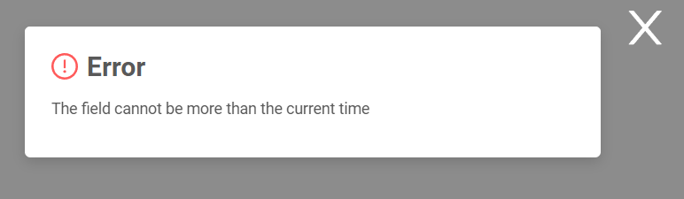
    === "RuntimeException"
           
    === "Confirm"
        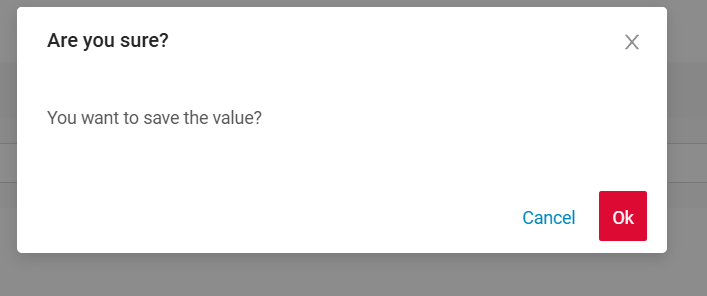
    === "Field level validation"
        
=== "Info widget"
    _not applicable_
=== "Form widget"
    === "BusinessException"
        
    === "RuntimeException"
        
    === "Confirm"
        
    === "Field level validation"
        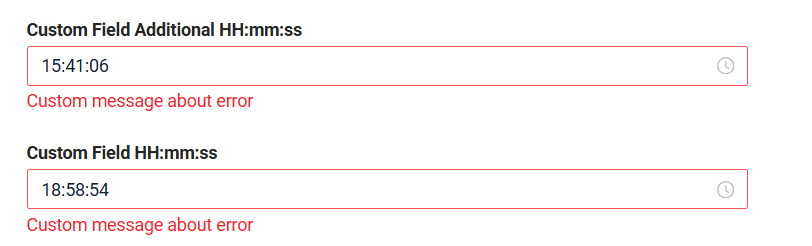


### How to add?
??? Example
    === "BusinessException"
        `BusinessException` describes an error  within a business process.
    
        Add **BusinessException** to corresponding **VersionAwareResponseService**.
        ```java
        --8<--
        {{ external_links.github_raw_doc }}/fields/time/validationbusinessex/MyExample4101Service.java:doUpdateEntity
        --8<--
        ```

        [:material-play-circle: Live Sample]({{ external_links.code_samples }}/ui/#/screen/myexample4101){:target="_blank"} ·
        [:fontawesome-brands-github: GitHub]({{ external_links.github_ui }}/{{ external_links.github_branch }}/src/main/java/org/demo/documentation/fields/time/validationbusinessex){:target="_blank"}

        === "List widget"
            **Works for List.**
        === "Info widget"
            **_not applicable_**
        === "Form widget"
            **Works for Form.**
    === "RuntimeException"

        `RuntimeException` describes technical error  within a business process.
        
        Add **RuntimeException** to corresponding **VersionAwareResponseService**.
        ```java
        --8<--
        {{ external_links.github_raw_doc }}/fields/time/validationruntimeex/MyExample4104Service.java:doUpdateEntity
        --8<--
        ```

        [:material-play-circle: Live Sample]({{ external_links.code_samples }}/ui/#/screen/myexample4104){:target="_blank"} ·
        [:fontawesome-brands-github: GitHub]({{ external_links.github_ui }}/{{ external_links.github_branch }}/src/main/java/org/demo/documentation/fields/time/validationruntimeex){:target="_blank"}

        === "List widget"
            **Works for List.**
        === "Info widget"
            **_not applicable_**
        === "Form widget"
            **Works for Form.**
    === "Confirm"
        Add [PreAction.confirm](/advancedCustomization/element/confirm/confirm) to corresponding **VersionAwareResponseService**.
        ```java
        --8<--
        {{ external_links.github_raw_doc }}/fields/time/validationconfirm/MyExample4103Service.java:getActions
        --8<--
        ```
        
        [:material-play-circle: Live Sample]({{ external_links.code_samples }}/ui/#/screen/myexample4103){:target="_blank"} ·
        [:fontawesome-brands-github: GitHub]({{ external_links.github_ui }}/{{ external_links.github_branch }}/src/main/java/org/demo/documentation/fields/time/validationconfirm){:target="_blank"}

        === "List widget"
            **Works for List.**
        === "Info widget"
            **_not applicable_**
        === "Form widget"
            **Works for Form.**
    === "Field level validation"
        === "Option 1"
            Add javax.validation to corresponding **DataResponseDTO**.

            Use if:

            Requires a simple fields check (javax validation)
            ```java
            --8<--
            {{ external_links.github_raw_doc }}/fields/time/validationannotation/MyExample165DTO.java
            --8<--
            ```
            === "List widget"
                **Works for List.**
            === "Info widget"
                **_not applicable_**
            === "Form widget"
                **Works for Form.**
        === "Option 2"
            Create сustom service for business logic check.

            Use if:

            Business logic check required for fields

            `Step 1`  Create сustom method for check.
            ```java
            --8<--
            {{ external_links.github_raw_doc }}/fields/time/validationdynamic/MyExample320Service.java:valitimeFields
            --8<--
            ```
            `Step 2` Add сustom method for check to corresponding **VersionAwareResponseService**.
            ```java
            --8<--
            {{ external_links.github_raw_doc }}/fields/time/validationdynamic/MyExample320Service.java:doUptimeEntity
            --8<--
            ```


## Sorting
[:material-play-circle: Live Sample]({{ external_links.code_samples }}/ui/#/screen/myexample3508){:target="_blank"} ·
[:fontawesome-brands-github: GitHub]({{ external_links.github_ui }}/{{ external_links.github_branch }}/src/main/java/org/demo/documentation/fields/time/sorting){:target="_blank"}

`Sorting` allows you to sort data in ascending or descending order.

### How does it look?
=== "List widget"
    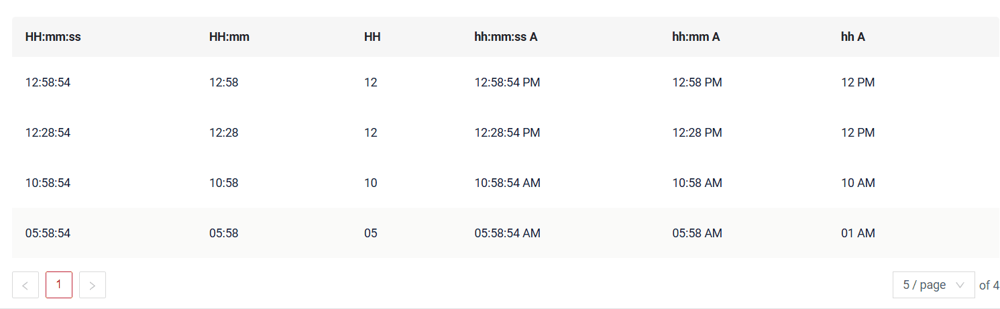
=== "Info widget"
    _not applicable_
=== "Form widget"
    _not applicable_
### How to add?
??? Example
    === "List widget"
        see more [Sorting](/widget/type/property/sorting/sorting)

        **Step 1**  Add **fields.enableSort** to corresponding **FieldMetaBuilder**.
        ```java
        --8<--
        {{ external_links.github_raw_doc }}/fields/time/sorting/MyExample3508Meta.java:buildIndependentMeta
        --8<--
        ```
        [:material-play-circle: Live Sample]({{ external_links.code_samples }}/ui/#/screen/myexample3508){:target="_blank"} ·
        [:fontawesome-brands-github: GitHub]({{ external_links.github_ui }}/{{ external_links.github_branch }}/src/main/java/org/demo/documentation/fields/time/sorting){:target="_blank"}

    === "Info widget"
        _not applicable_
    === "Form widget"
        _not applicable_

## Required
[:material-play-circle: Live Sample]({{ external_links.code_samples }}/ui/#/screen/myexample3506){:target="_blank"} ·
[:fontawesome-brands-github: GitHub]({{ external_links.github_ui }}/{{ external_links.github_branch }}/src/main/java/org/demo/documentation/fields/time/required){:target="_blank"}

`Required` allows you to denote, that this field must have a value provided.

### How does it look?
=== "List widget"
    
=== "Info widget"
    _not applicable_
=== "Form widget"
    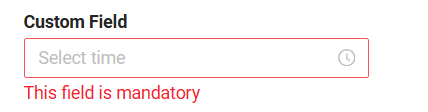
### How to add?
??? Example
    Add **fields.setRequired** to corresponding **FieldMetaBuilder**.
    ```java
    --8<--
    {{ external_links.github_raw_doc }}/fields/time/required/MyExample3506Meta.java:buildRowDependentMeta
    --8<--
    ```
    === "List widget"
        **Works for List.**
    === "Info widget"
        **_not applicable_**
    === "Form widget"
        **Works for Form.**
 