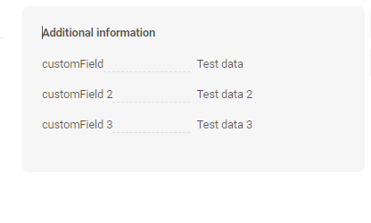
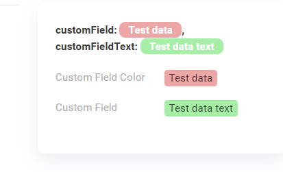
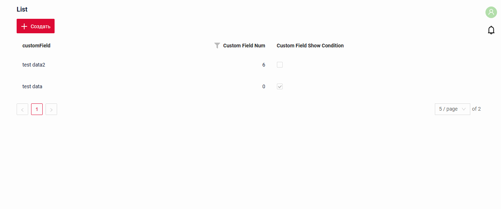

# AdditionalInfo
 
`AdditionalInfo` widget is a component only for data viewing. Widget is always located **on the right**.

## Basics
[:material-play-circle: Live Sample]({{ external_links.code_samples }}/ui/#/screen/myexample3600){:target="_blank"} ·
[:fontawesome-brands-github: GitHub]({{ external_links.github_ui }}/{{ external_links.github_branch }}/src/main/java/org/demo/documentation/widgets/additionalinfo/base){:target="_blank"}
### How does it look?


###  <a id="Howtoaddbacis">How to add?</a> 
??? Example
    **Step1** Create file **_.widget.json_** with  type  **AdditionalInfo**.

    * name -  static (unique within the project)
    * [title](#Title) - (optional) 
    * type = "AdditionalInfo" (required)
    * bc - (required)
    * fields- (required) see  [field types](/widget/fields/fieldtypes/)  
    * [options](#Fieldslayout)  

    ```json
    --8<--
    {{ external_links.github_raw_doc }}/widgets/additionalinfo/base/MyExample3600Additional.widget.json
    --8<--
    ```
    **Step2** Add widget to corresponding ****_.view.json_** **.

    ```json
    --8<--
    {{ external_links.github_raw_doc }}/widgets/additionalinfo/base/MyExample3600List.widget.json
    --8<--
    ```
## Title
<!--Title - a name displayed above the additional information.--->
### Title Basic

### Title Color
`Title Color` allows you to specify a color for a title. It can be constant or calculated.

**Constant color**

[:material-play-circle: Live Sample]({{ external_links.code_samples }}/ui/#/screen/myexample3025/view/myexample3025constcolor){:target="_blank"} ·
[:fontawesome-brands-github: GitHub]({{ external_links.github_ui }}/{{ external_links.github_branch }}/src/main/java/org/demo/documentation/widgets/additionalinfo/colortitle){:target="_blank"}

*Constant color* is a fixed color that doesn't change. It remains the same regardless of any factors in the application.
**Calculated color**

[:material-play-circle: Live Sample]({{ external_links.code_samples }}/ui/#/screen/myexample3025/view/myexample3025){:target="_blank"} ·
[:fontawesome-brands-github: GitHub]({{ external_links.github_ui }}/{{ external_links.github_branch }}/src/main/java/org/demo/documentation/widgets/additionalinfo/colortitle){:target="_blank"}

*Calculated color* can be used to change a title color dynamically. It changes depending on business logic or data in the application.

!!! info
    Title colorization is **applicable** to the following [fields](/widget/fields/fieldtypes/): date, dateTime, dateTimeWithSeconds, number, money, percent, time, input, text, dictionary, radio, checkbox, multivalue, multivalueHover.

##### How does it look?


##### How to add?
??? Example
    === "Calculated color"

        **Step 1**   Add `custom field for color` to corresponding **DataResponseDTO**. The field can contain a HEX color or be null.
        ```java
        --8<--
        {{ external_links.github_raw_doc }}/widgets/additionalinfo/colortitle/MyExample3025DTO.java:colorDTO
        --8<--
        ```  
 
        **Step 2** Add **"bgColorKey"** :  `custom field for color` and  to .widget.json.

        Add in `title` field with `${customField}` 

        ```json
        --8<--
        {{ external_links.github_raw_doc }}/widgets/additionalinfo/colortitle/MyExample3025.widget.json
        --8<--
        ```       

    === "Constant color"
 
        Add **"bgColor"** :  `HEX color`  to .widget.json.

        Add in `title` field with `${customField}` 

        ```json
        --8<--
        {{ external_links.github_raw_doc }}/widgets/additionalinfo/colortitle/MyExample3025ColorConst.widget.json
        --8<--
        ```


## <a id="bc">Business component</a>
This specifies the business component (BC) to which this form belongs.
A business component represents a specific part of a system that handles a particular business logic or data.

see more  [Business component](/environment/businesscomponent/businesscomponent/)

## <a id="Showcondition">Show condition</a>

[:material-play-circle: Live Sample]({{ external_links.code_samples }}/ui/#/screen/myexample3600){:target="_blank"} ·
[:fontawesome-brands-github: GitHub]({{ external_links.github_ui }}/{{ external_links.github_branch }}/src/main/java/org/demo/documentation/widgets/additionalinfo/base){:target="_blank"}

* `no show condition - recommended`: widget always visible

  [:material-play-circle: Live Sample]({{ external_links.code_samples }}/ui/#/screen/myexample4231){:target="_blank"} ·
  [:fontawesome-brands-github: GitHub]({{ external_links.github_ui }}/{{ external_links.github_branch }}/src/main/java/org/demo/documentation/widgets/additionalinfo/showcondition){:target="_blank"}

* `show condition by current entity`: condition can include boolean expression depending on current entity fields. Field updates will trigger condition recalculation only on save or if field is force active

!!! info
    When all widgets on the right are hidden, the other widgets of the view take the whole width.

!!! tips
    It is recommended not to use `Show condition` when possible, because wide usage of this feature makes application hard to support.

#### <a id="howdoesitlook">How does it look?</a>
=== "no show condition"
    
=== "show condition by current entity"
    

#### <a id="howtoadd">How to add?</a>
??? Example

    === "no show condition"
        see [Basic](#Howtoaddbacis)

    === "show condition by current entity"
        **Step1** Add **showCondition** to **_.widget.json_**. see more [showCondition](/widget/type/property/showcondition/showcondition)

        ```json
        --8<--
        {{ external_links.github_raw_doc }}/widgets/additionalinfo/showcondition/MyExample4231AddInfo.widget.json
        --8<--
        ```

        [:material-play-circle: Live Sample]({{ external_links.code_samples }}/ui/#/screen/myexample4231){:target="_blank"} ·
        [:fontawesome-brands-github: GitHub]({{ external_links.github_ui }}/{{ external_links.github_branch }}/src/main/java/org/demo/documentation/widgets/additionalinfo/showcondition){:target="_blank"}

## <a id="bc">Fields</a>

## Options layout
_not applicable_


## Actions
`Actions` show available actions as separate buttons
see [Actions](/features/element/actions/actions)
