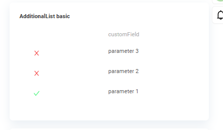
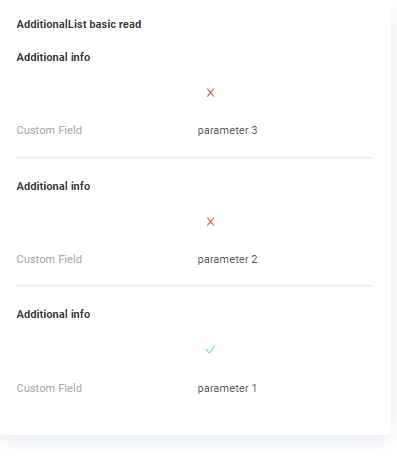

# AdditionalList
 
`AdditionalList` widget is additionallist 

## <a id="basic">Basic</a>
[:material-play-circle: Live Sample]({{ external_links.code_samples }}/ui/#/screen/myexample3190){:target="_blank"} ·
[:fontawesome-brands-github: GitHub]({{ external_links.github_ui }}/{{ external_links.github_branch }}/src/main/java/org/demo/documentation/widgets/additionallist/base){:target="_blank"}
### How does it look?
=== "basic"
    
=== "read"
    

###  <a id="Howtoaddbacis">How to add?</a> 
??? Example
    === "basic"
        **Step1** Create file **_.widget.json_** with type = **"AdditionalList"**
    
        Add existing field to a AdditionalList widget. see more [Fields](#fields)
        ```json
        --8<--
        {{ external_links.github_raw_doc }}/widgets/additionallist/base/onefield/MyExample3190Additional.widget.json
        --8<--
        ```
     
        **Step2** Add widget to corresponding ****_.view.json_** **.
    
        ```json
        --8<--
        {{ external_links.github_raw_doc }}/widgets/additionallist/base/onefield/myexample3190list.view.json
        --8<--
        ```
    === "read"
        **Step1** Create file **_.widget.json_** with type = **"AdditionalInfo"**
    
        Add existing field to a AdditionalInfo widget. see more [Fields](#fields)
        ```json
        --8<--
        {{ external_links.github_raw_doc }}/widgets/additionallist/base/onefield/MyExample3190AdditionalInfo.widget.json
        --8<--
        ```

        **Step2** Create file **_.widget.json_** with type = **"AdditionalList"**
    
        Add existing field to a AdditionalList widget. see more [Fields](#fields)
        ```json
        --8<--
        {{ external_links.github_raw_doc }}/widgets/additionallist/base/onefield/MyExample3190AdditionalRead.widget.json
        --8<--
        ```

        **Step3** Add widget to corresponding ****_.view.json_** **.
    
        ```json
        --8<--
        {{ external_links.github_raw_doc }}/widgets/additionallist/base/onefield/myexample3190list.view.json
        --8<--
        ```

## <a id="Title">Title</a>
[:material-play-circle: Live Sample]({{ external_links.code_samples }}/ui/#/screen/myexample3195){:target="_blank"} ·
[:fontawesome-brands-github: GitHub]({{ external_links.github_ui }}/{{ external_links.github_branch }}/src/main/java/org/demo/documentation/widgets/additionallist/title){:target="_blank"}

### Title Basic
`Title` for widget (optional)

There are types of:

* `constant title`: shows constant text.
* `constant title empty`: if you want to visually connect widgets by  them to be placed one under another
 
#### How does it look?
=== "Constant title"
    === "basic"
        
    === "read"
        
=== "Constant title empty"
    === "basic"
        
    === "read"
         

#### How to add?
??? Example
    === "Constant title"
        === "basic"
            **Step1** Add name for **title** to **_.widget.json_**.
            ```json
            --8<--
            {{ external_links.github_raw_doc }}/widgets/additionallist/title/MyExample3195Additional.widget.json
            --8<--
            ```
 
        === "read"
            **Step1** Add name for **title** to **_.widget.json_**.
            ```json
            --8<--
            {{ external_links.github_raw_doc }}/widgets/additionallist/title/MyExample3195AdditionalRead.widget.json
            --8<--
            ```
        [:material-play-circle: Live Sample]({{ external_links.code_samples }}/ui/#/screen/myexample3195/view/myexample3195list){:target="_blank"} ·
        [:fontawesome-brands-github: GitHub]({{ external_links.github_ui }}/{{ external_links.github_branch }}/src/main/java/org/demo/documentation/widgets/additionallist/title){:target="_blank"}
            
    === "Constant title empty"
        === "basic"
            **Step1** Delete parameter **title** to **_.widget.json_**.
            ```json
            --8<--
            {{ external_links.github_raw_doc }}/widgets/additionallist/title/MyExample3195AdditionalEmptyTitle.widget.json
            --8<--
            ```
        === "read"
            **Step1** Delete parameter **title** to **_.widget.json_**.
            ```json
            --8<--
            {{ external_links.github_raw_doc }}/widgets/additionallist/title/MyExample3195AdditionalInfoEmpty.widget.json
            --8<--
            ```
        [:material-play-circle: Live Sample]({{ external_links.code_samples }}/ui/#/screen/myexample3195){:target="_blank"} ·
        [:fontawesome-brands-github: GitHub]({{ external_links.github_ui }}/{{ external_links.github_branch }}/src/main/java/org/demo/documentation/widgets/additionallist/title){:target="_blank"}


### Title Color
`Title Color` allows you to specify a color for a title. It can be constant or calculated.
 
**Constant color**

[:material-play-circle: Live Sample]({{ external_links.code_samples }}/ui/#/screen/myexample3196/view/myexample3196listconstant){:target="_blank"} ·
[:fontawesome-brands-github: GitHub]({{ external_links.github_ui }}/{{ external_links.github_branch }}/src/main/java/org/demo/documentation/widgets/additionallist/colortitle){:target="_blank"}

*Constant color* is a fixed color that doesn't change. It remains the same regardless of any factors in the application.
 
**Calculated color**

[:material-play-circle: Live Sample]({{ external_links.code_samples }}/ui/#/screen/myexample3196/view/myexample3196list){:target="_blank"} ·
[:fontawesome-brands-github: GitHub]({{ external_links.github_ui }}/{{ external_links.github_branch }}/src/main/java/org/demo/documentation/widgets/additionallist/colortitle){:target="_blank"}

*Calculated color* can be used to change a title color dynamically. It changes depending on business logic or data in the application.

!!! info
    Title colorization is **applicable** to the following [fields](/widget/fields/fieldtypes/): date, dateTime, dateTimeWithSeconds, number, money, percent, time, input, text, dictionary, radio, checkbox, multivalue, multivalueHover.

##### How does it look?


##### How to add?
??? Example
    === "Calculated color"
        === "basic"
            **Step 1**   Add `custom field for color` to corresponding **DataResponseDTO**. The field can contain a HEX color or be null.
            ```java
            --8<--
            {{ external_links.github_raw_doc }}/widgets/additionallist/colortitle/twofields/MyExample3196DTO.java
            --8<--
            ```  
     
            **Step 2** Add **"bgColorKey"** :  `custom field for color` and  to .widget.json.
    
            Add in `title` field with `${customField}` 
    
            ```json
            --8<--
            {{ external_links.github_raw_doc }}/widgets/additionallist/colortitle/twofields/MyExample3196AdditionalConstant.widget.json
            --8<--
            ``` 
    
            [:material-play-circle: Live Sample]({{ external_links.code_samples }}/ui/#/screen/myexample3196/view/myexample3196listconstant){:target="_blank"} ·
            [:fontawesome-brands-github: GitHub]({{ external_links.github_ui }}/{{ external_links.github_branch }}/src/main/java/org/demo/documentation/widgets/additionallist/colortitle){:target="_blank"}
     
    === "Constant color"
        === "basic"
            Add **"bgColor"** :  `HEX color`  to .widget.json.
    
            Add in `title` field with `${customField}` 
    
            ```json
            --8<--
            {{ external_links.github_raw_doc }}/widgets/additionallist/colortitle/MyExample3196AdditionalConstant.widget.json
            --8<--
            ```
    
            [:material-play-circle: Live Sample]({{ external_links.code_samples }}/ui/#/screen/myexample3196/view/myexample3196list){:target="_blank"} ·
            [:fontawesome-brands-github: GitHub]({{ external_links.github_ui }}/{{ external_links.github_branch }}/src/main/java/org/demo/documentation/widgets/additionallist/colortitle){:target="_blank"}
     
## <a id="bc">Business component</a>
This specifies the business component (BC) to which this form belongs.
A business component represents a specific part of a system that handles a particular business logic or data.

see more  [Business component](/environment/businesscomponent/businesscomponent/)

## <a id="Showcondition">Show condition</a>

[:material-play-circle: Live Sample]({{ external_links.code_samples }}/ui/#/screen/myexample3002){:target="_blank"} ·
[:fontawesome-brands-github: GitHub]({{ external_links.github_ui }}/{{ external_links.github_branch }}/src/main/java/org/demo/documentation/widgets/additionallist/base){:target="_blank"}

* `no show condition - recommended`: widget always visible

  [:material-play-circle: Live Sample]({{ external_links.code_samples }}/ui/#/screen/myexample3193){:target="_blank"} ·
  [:fontawesome-brands-github: GitHub]({{ external_links.github_ui }}/{{ external_links.github_branch }}/src/main/java/org/demo/documentation/widgets/additionallist/showcondition/bycurrententity){:target="_blank"}

* `show condition by current entity`: condition can include boolean expression depending on current entity fields. Field updates will trigger condition recalculation only on save or if field is force active

<!--
  [:material-play-circle: Live Sample]({{ external_links.code_samples }}/ui/#/screen/myexample3005/view/myexample3007showcondform){:target="_blank"} ·
  [:fontawesome-brands-github: GitHub]({{ external_links.github_ui }}/{{ external_links.github_branch }}/src/main/java/org/demo/documentation/widgets/form/showcondition/bycurrententity){:target="_blank"}
 
* `show condition by parent entity`: condition can include boolean expression depending on parent entity. Parent field updates will trigger condition recalculation only on save or if field is force active shown on same view
-->
!!! tips
    It is recommended not to use `Show condition` when possible, because wide usage of this feature makes application hard to support.

#### <a id="howdoesitlook">How does it look?</a>
=== "no show condition"
    see [Basic](#иasic)
=== "show condition by current entity"
    
<!--
=== "show condition by parent entity"
    
-->

#### <a id="howtoadd">How to add?</a>
??? Example

    === "no show condition"
        see [Basic](#Howtoaddbacis)

    === "show condition by current entity"
        **Step1** Add **showCondition** to **_.widget.json_**. see more [showCondition](/widget/type/property/showcondition/showcondition)
        ```json
        --8<--
        {{ external_links.github_raw_doc }}/widgets/additionallist/showcondition/bycurrententity/MyExample31012.widget.json
        --8<--
        ```
<!--
    === "show condition by parent entity"
        **Step1** Add **showCondition** to **_.widget.json_**. see more [showCondition](/widget/type/property/showcondition/showcondition)
        ```json
        --8<--
        {{ external_links.github_raw_doc }}/widgets/additionallist/showcondition/byparententity/child/MyExample3107.widget.json
        --8<--
        ```
-->

## <a id="fields">Fields</a>
Fields Configuration. The fields array defines the individual fields present within the form.

```json
{
    "title": "Custom Field",
    "key": "customField",
    "type": "input"
}
```

* **"title"**

  Description:  Field Title.
  
  Type: String(optional).
  
* **"key"**
  
    Description: Name field to corresponding DataResponseDTO.
  
    Type: String(required).
  
* **"type"**
  
  Description: [Field types](/widget/fields/fieldtypes/)
  
  Type: String(required).


### How to add?
??? Example

    === "With plugin(recommended)"
        **Step 1** Download plugin
            [download Intellij Plugin](https://plugins.jetbrains.com/plugin/195-tesler-helper)
    
        **Step 2** Add existing field to an existing form widget
            
    === "Example of writing code"
        Add field to **_.widget.json_**.

          ```json
             --8<--
             {{ external_links.github_raw_doc }}/widgets/additionallist/base/onefield/MyExample3190Additional.widget.json
             --8<--
          ```

## <a id="Fieldslayout">Options layout</a>
**options.layout** - no use in this type.

## Actions
_not applicable_

## Additional properties
#### Customization of displayed columns
[:material-play-circle: Live Sample]({{ external_links.code_samples }}/ui/#/screen/myexample3135){:target="_blank"} ·
[:fontawesome-brands-github: GitHub]({{ external_links.github_ui }}/{{ external_links.github_branch }}/src/main/java/org/demo/documentation/widgets/list/customizationcolumns){:target="_blank"}

To customize the columns displayed on a list widget, you can perform two main actions:

* Hide columns
* Swap columns

!!! info
    Currently, table customization data is stored within internal tables, even when microservices are used.

###### Basic
When customizing columns, records are inserted into the ADDITIONAL_FIELDS table.
Table *ADDITIONAL_FIELDS* for store user-specific settings:

* `user_id`:  The user ID for which the columns are being customized.
* `view`: The name of the view where the columns are customized.
* `widget`: The name of the widget where the columns are customized.
* `order_fields`: When configuring swap columns, the field sequence will be updated, and a new comma-separated sequence of fields will be saved.
* `added_to_additional_fields`: User-hidden fields.
* `removed_from_additional_fields`

###### How does it look?
=== "Hide columns"
    
=== "Swap columns"
    
=== "Pre-hidden"
    

###### How to add?
??? Example
    === "Hide and Swap columns"

        Add in **options** parameter **additional** to corresponding **.widget.json**.
            
        ```
        "additional": {
          "enabled": true
        }
        ```
        
        ```json
        --8<--
        {{ external_links.github_raw_doc }}/widgets/list/customizationcolumns/MyExample3135List.widget.json
        --8<--
        ```
        
        [:material-play-circle: Live Sample]({{ external_links.code_samples }}/ui/#/screen/myexample3135){:target="_blank"} ·
        [:fontawesome-brands-github: GitHub]({{ external_links.github_ui }}/{{ external_links.github_branch }}/src/main/java/org/demo/documentation/widgets/list/customizationcolumns){:target="_blank"}
        

    === "Pre-hidden columns"
        
        Сan also set columns to be pre-hidden, meaning they will be hidden when the widget opens.
        
        Add in **options** parameter **additional** to corresponding **.widget.json**.
        
        Add in **options** parameter **fields** with list of hidden fields  to corresponding **.widget.json**.
            
        ```
           "additional": {
              "fields": ["customFieldPercent", "customFieldRadio"],
              "enabled": true
            }
        ```
        
        ```json
        --8<--
        {{ external_links.github_raw_doc }}/widgets/list/customizationcolumns/MyExample3135ListHiddenFields.widget.json
        --8<--
        ```
        
        [:material-play-circle: Live Sample]({{ external_links.code_samples }}/ui/#/screen/myexample3135/view/myexample3135listhidden){:target="_blank"} ·
        [:fontawesome-brands-github: GitHub]({{ external_links.github_ui }}/{{ external_links.github_branch }}/src/main/java/org/demo/documentation/widgets/list/customizationcolumns){:target="_blank"}

### Filtration
#### Basic 
see more  [Fields](/widget/type/property/filtration/filtration/)
#### FullTextSearch
_not applicable_
#### Filter group
_not applicable_
### Pagination
_not applicable_
### Export to Excel

