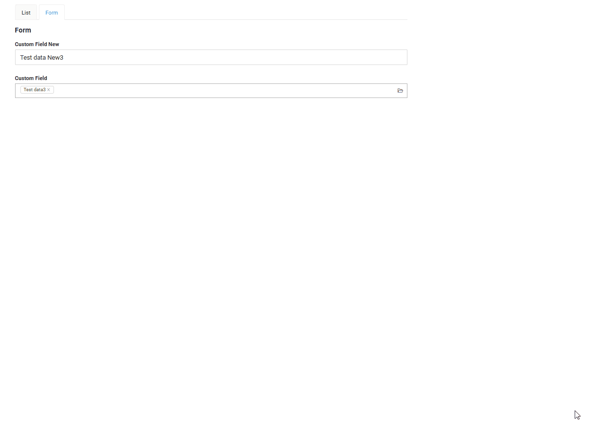
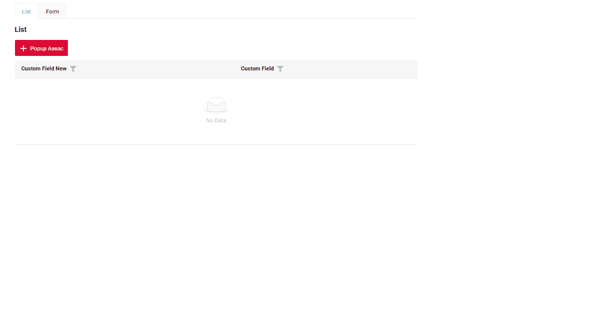
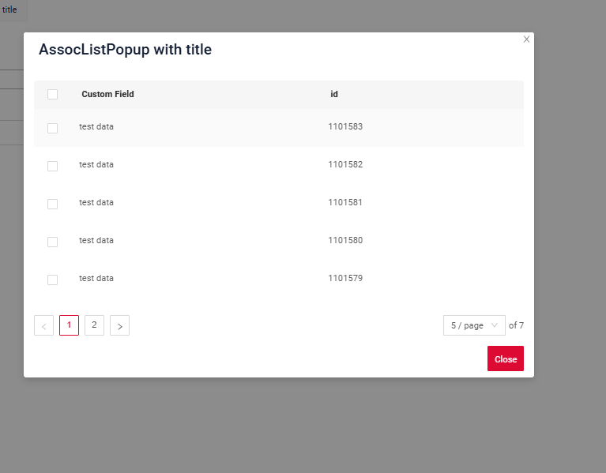
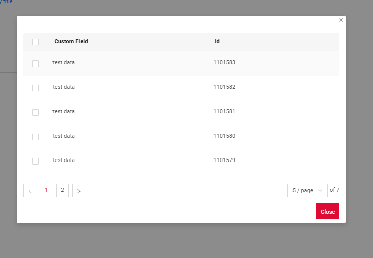
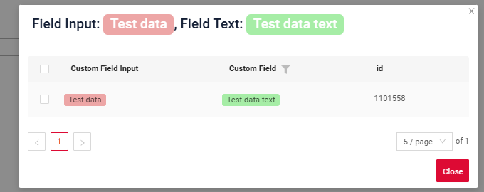
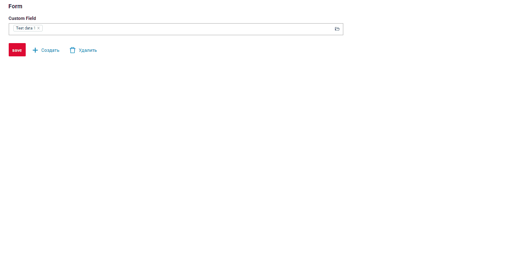
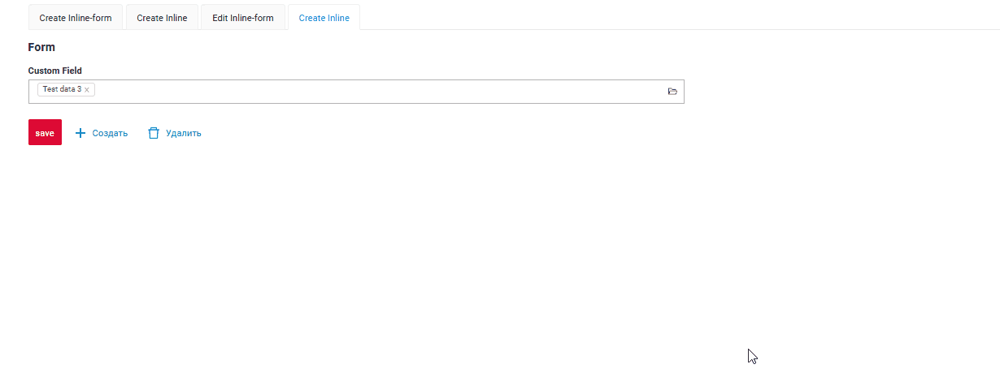

# AssocListPopup

`AssocListPopup` widget is a popup component designed to the selection of multiple values.
## Basics
[:material-play-circle: Live Sample]({{ external_links.code_samples }}/ui/#/screen/myexample3053){:target="_blank"} ·
[:fontawesome-brands-github: GitHub]({{ external_links.github_ui }}/{{ external_links.github_branch }}/src/main/java/org/demo/documentation/widgets/assoc/base){:target="_blank"}
### How does it look?
=== "Assoc widget field"
    === "List"
        _not applicable_
    === "Info"
        _not applicable_
    === "Form"
        
=== "Assoc widget button"
    === "List"
        
    === "Info"
        _not applicable_
    === "Form"
        _not applicable_

###  <a id="Howtoaddbacis">How to add?</a>
??? Example
    === "Assoc widget field"
        === "List"
            _not applicable_
        === "Info"
            _not applicable_

        === "Form"
            **Step1** Add field with type **multivalue** see more [Fields](#fields)

            ```json
            --8<--
            {{ external_links.github_raw_doc }}/widgets/assoc/base/MyExample3053Form.widget.json
            --8<--
            ```
       
            **Step2** Add widget to corresponding ****_.view.json_** **.
        
            ```json
            --8<--
            {{ external_links.github_raw_doc }}/widgets/assoc/base/myexample3053form.view.json
            --8<--
            ```
    === "Assoc widget button"
        === "List"
            **Step1** Add button `associate` to corresponding **VersionAwareResponseService**. 
            ```java
            --8<--
            {{ external_links.github_raw_doc }}/widgets/assoc/base/MyExample3053Service.java:getActions
            --8<--
            ```
            **Step2** Add method `doAssociate` to corresponding **VersionAwareResponseService**. 

            `associate`

            ```java
            --8<--
            {{ external_links.github_raw_doc }}/widgets/assoc/base/MyExample3053Service.java:doAssociate
            --8<--
            ```
            method `addNewRecords`
            ```java
            --8<--
            {{ external_links.github_raw_doc }}/widgets/assoc/base/MyExample3053Service.java:addNewRecords
            --8<--
            ```

            **Step3** Create file **_.widget.json_** with type = **"assoc"** and name = parent bc + "Assoc"

            Add existing field to assoc widget. see more [Fields](#fields)

            ```json
            --8<--
            {{ external_links.github_raw_doc }}/widgets/assoc/base/myexample3053Assoc.widget.json
            --8<--
            ```
            **Step4** Add a dependency on parent BC for Assoc BC for to corresponding **EnumBcIdentifier**
        
             ```java
             --8<--
             {{ external_links.github_raw_doc }}/widgets/assoc/base/CxboxMyExample3053Controller.java:EnumBcIdentifierBc
             --8<--
             ```

             **Step5** Add assoc widget to corresponding ****_.view.json_** **.
        
            ```json
            --8<--
            {{ external_links.github_raw_doc }}/widgets/assoc/base/myexample3053list.view.json
            --8<--
            ```
 
        === "Info"
              _not applicable_

        === "Form"
              _not applicable_


## <a id="Title">Title</a>
[:material-play-circle: Live Sample]({{ external_links.code_samples }}/ui/#/screen/myexample3090){:target="_blank"} ·
[:fontawesome-brands-github: GitHub]({{ external_links.github_ui }}/{{ external_links.github_branch }}/src/main/java/org/demo/documentation/widgets/assoc/title){:target="_blank"}

### Title Basic
`Title` for widget (optional)

There are types of:

* `constant title`: shows constant text.
* `constant title empty`: if you want to visually connect widgets by  them to be placed one under another

#### How does it look?
=== "Constant title"
    
=== "Constant title empty"
    

#### How to add?
??? Example
    === "Constant title"
        **Step1** Add name for **title** to **_.widget.json_**.
        ```json
        --8<--
        {{ external_links.github_raw_doc }}/widgets/assoc/title/myEntity3090MultiPickAssocListPopup.widget.json
        --8<--
        ```
        [:material-play-circle: Live Sample]({{ external_links.code_samples }}/ui/#/screen/myexample3090){:target="_blank"} ·
        [:fontawesome-brands-github: GitHub]({{ external_links.github_ui }}/{{ external_links.github_branch }}/src/main/java/org/demo/documentation/widgets/assoc/title){:target="_blank"}

    === "Constant title empty"
    
        **Step1** Delete parameter **title** to **_.widget.json_**.
        ```json
        --8<--
        {{ external_links.github_raw_doc }}/widgets/assoc/title/myEntity3090MultiPickAssocEmptyListPopup.widget.json
        --8<--
        ```
    
        [:material-play-circle: Live Sample]({{ external_links.code_samples }}/ui/#/screen/myexample3090/view/myexample3090emptytitle){:target="_blank"} ·
        [:fontawesome-brands-github: GitHub]({{ external_links.github_ui }}/{{ external_links.github_branch }}/src/main/java/org/demo/documentation/widgets/assoc/title){:target="_blank"}
    

### Title Color
`Title Color` allows you to specify a color for a title. It can be constant or calculated.

**Constant color**

[:material-play-circle: Live Sample]({{ external_links.code_samples }}/ui/#/screen/myexample3025/view/myexample3025constcolor){:target="_blank"} ·
[:fontawesome-brands-github: GitHub]({{ external_links.github_ui }}/{{ external_links.github_branch }}/src/main/java/org/demo/documentation/widgets/assoc/colortitle){:target="_blank"}

*Constant color* is a fixed color that doesn't change. It remains the same regardless of any factors in the application.

**Calculated color**

[:material-play-circle: Live Sample]({{ external_links.code_samples }}/ui/#/screen/myexample3025/view/myexample3025){:target="_blank"} ·
[:fontawesome-brands-github: GitHub]({{ external_links.github_ui }}/{{ external_links.github_branch }}/src/main/java/org/demo/documentation/widgets/assoc/colortitle){:target="_blank"}

*Calculated color* can be used to change a title color dynamically. It changes depending on business logic or data in the application.

!!! info
    Title colorization is **applicable** to the following [fields](/widget/fields/fieldtypes/): date, dateTime, dateTimeWithSeconds, number, money, percent, time, input, text, dictionary, radio, checkbox, multivalue, multivalueHover.

##### How does it look?


##### How to add?
??? Example
    === "Calculated color"

        **Step 1**   Add `custom field for color` to corresponding **DataResponseDTO**. The field can contain a HEX color or be null.
        ```java
        --8<--
        {{ external_links.github_raw_doc }}/widgets/assoc/colortitle/color/MyEntity3056MultiPickDTO.java
        --8<--
        ```  
 
        **Step 2** Add **"bgColorKey"** :  `custom field for color` and  to .widget.json.

        Add in `title` field with `${customField}` 

        ```json
        --8<--
        {{ external_links.github_raw_doc }}/widgets/assoc/colortitle/color/myEntity3056MultiPickAssocListPopup.widget.json
        --8<--
        ``` 

        [:material-play-circle: Live Sample]({{ external_links.code_samples }}/ui/#/screen/myexample3052/view/myexample3056color){:target="_blank"} ·
        [:fontawesome-brands-github: GitHub]({{ external_links.github_ui }}/{{ external_links.github_branch }}/src/main/java/org/demo/documentation/widgets/assoc/colortitle/color){:target="_blank"}

    === "Constant color"
 
        Add **"bgColor"** :  `HEX color`  to .widget.json.

        Add in `title` field with `${customField}` 

        ```json
        --8<--
        {{ external_links.github_raw_doc }}/widgets/assoc/colortitle/colorconst/myEntity3056MultiPickAssocListPopup0.widget.json
        --8<--
        ```
 
        [:material-play-circle: Live Sample]({{ external_links.code_samples }}/ui/#/screen/myexample3052/view/myexample3056colorconst){:target="_blank"} ·
        [:fontawesome-brands-github: GitHub]({{ external_links.github_ui }}/{{ external_links.github_branch }}/src/main/java/org/demo/documentation/widgets/assoc/colortitle/colorconst){:target="_blank"}
 
## <a id="bc">Business component</a>
This specifies the business component (BC) to which this form belongs.
A business component represents a specific part of a system that handles a particular business logic or data.

see more  [Business component](/environment/businesscomponent/businesscomponent/)

## <a id="Showcondition">Show condition</a>
  

## <a id="fields">Fields</a>
Fields Configuration. The fields array defines the individual fields present within the form.

```json
{
    "title": "Custom Field",
    "key": "customField",
    "type": "input"
}
```

* **"title"**

  Description:  Field Title.

  Type: String(optional).

* **"key"**

  Description: Name field to corresponding DataResponseDTO.

  Type: String(required).

* **"type"**

  Description: [Field types](/widget/fields/fieldtypes/)

  Type: String(required).


### How to add?
??? Example

    === "With plugin(recommended)"
        **Step 1** Download plugin
            [download Intellij Plugin](https://plugins.jetbrains.com/plugin/195-tesler-helper)
    
        **Step 2** Add existing field to an existing form widget
            
    === "Example of writing code"
        Add field to **_.widget.json_**.

          ```json
             --8<--
             {{ external_links.github_raw_doc }}/widgets/assoc/base/myEntity3053MultiAssocListPopup.widget.json
             --8<--
          ```

## <a id="Fieldslayout">Options layout</a>
**options.layout** - no use in this type.

## Actions
`Actions` show available actions as separate buttons see more [Actions](/features/element/actions/actions).

**Standard Actions**:

* [`Create`](#standart_create): Action to initialize the process of creating a new record
* [`Delete`](#standart_delete): Remove an existing record
* [`Edit`](#standart_edit): Users to update or correct information
* [`Save`](#standart_save): Action to store the data entered or modified
* [`Cancel-create`](#standart_cancel_create): Action to abort the creation of a new record, discarding any input without saving

As for assoc widget, there are several actions.
#### Create
`Create` button enables you to create a new value by clicking the `Add` button. This action can be performed in three different ways, feel free to choose any, depending on your logic of application:

There are three methods to create a record:

* [Inline](#createinline): You can add a line directly.

!!! info
    Pagination won't function until the page is refreshed after adding records.

* [Inline-form](#withwidget): You can add data using a form widget without leaving your current view.

* [With view](#withview): not applicable.

##### <a id="createinline">Inline</a>
[:material-play-circle: Live Sample]({{ external_links.code_samples }}/ui/#/screen/myexample3054/view/myexample3054inlinecreate){:target="_blank"} ·
[:fontawesome-brands-github: GitHub]({{ external_links.github_ui }}/{{ external_links.github_branch }}/src/main/java/org/demo/documentation/widgets/assoc/actions/create/basic){:target="_blank"}

With `Line Addition`, a new empty row is immediately added to the top of the assoc widget when the "Add" button is clicked. This is a quick way to add rows without needing to input data beforehand.
###### How does it look?


###### How to add?
??? Example

    **Step1** Add button `create` to corresponding **VersionAwareResponseService**. 
    ```java
    --8<--
    {{ external_links.github_raw_doc }}/widgets/assoc/actions/MyEntity3054MultiMultivalueService.java:getActions
    --8<--
    ```
 
    **Step2** Add button `create` to corresponding **.widget.json**. 
    ```json
    --8<--
    {{ external_links.github_raw_doc }}/widgets/assoc/actions/create/myEntity3054MultiAssocListPopupCreateAssocListPopup.widget.json
    --8<--
    ```

    **Step3** Add **fields.setEnabled** to corresponding **FieldMetaBuilder**.
    ```java
    --8<--
    {{ external_links.github_raw_doc }}}/widgets/assoc/actions/MyEntity3054MultiMultivalueMeta.java:buildRowDependentMeta
    --8<--
    ``` 
    [:material-play-circle: Live Sample]({{ external_links.code_samples }}/ui/#/screen/myexample3054){:target="_blank"} ·
    [:fontawesome-brands-github: GitHub]({{ external_links.github_ui }}/{{ external_links.github_branch }}/src/main/java/org/demo/documentation/widgets/assoc/actions/create/basic){:target="_blank"}

##### <a id="withwidget">Inline-form</a>
[:material-play-circle: Live Sample]({{ external_links.code_samples }}/ui/#/screen/myexample3054/view/myexample3054create){:target="_blank"} ·
[:fontawesome-brands-github: GitHub]({{ external_links.github_ui }}/{{ external_links.github_branch }}/src/main/java/org/demo/documentation/widgets/assoc/actions/create/withwidget){:target="_blank"}

`Create with widget` opens an additional widget when the "Add" button is clicked. The form will appear on the same screen, allowing you to view both the assoc of entities and the form for adding a new row.
After filling the information in and clicking "Save", the new row is added to the assoc.
###### How does it look?


###### How to add?
??? Example

    **Step1** Add button `create` to corresponding **VersionAwareResponseService**. 
    ```java
    --8<--
    {{ external_links.github_raw_doc }}/widgets/assoc/actions/MyEntity3054MultiMultivalueService.java:getActions
    --8<--
    ```
    **Step2** Add **fields.setEnabled** to corresponding **FieldMetaBuilder**.
    ```java
    --8<--
    {{ external_links.github_raw_doc }}}/widgets/assoc/actions/MyEntity3054MultiMultivalueMeta.java:buildRowDependentMeta
    --8<--
    ```
     **Step3** Create widget.json with type `Form` that appears when you click a button
    ```json
    --8<--
    {{ external_links.github_raw_doc }}/widgets/assoc/actions/myEntity3054MultiFormForPopup.widget.json
    --8<--
    ```
 
     **Step4** Add widget.json with type `Form` to corresponding **.view.json**. 
    ```json
    --8<--
    {{ external_links.github_raw_doc }}/widgets/assoc/actions/create/myexample3054inlinecreate.view.json
    --8<--
    ```

     **Step5** Add button `create` and widget with type `Form` to corresponding **.widget.json**.
       
    `options`.`create`: Name widget that appears when you click a button
        
    ```json
    --8<--
    {{ external_links.github_raw_doc }}/widgets/assoc/actions/create/myEntity3054MultiAssocListPopup.widget.json
    --8<--
    ```
 
    [:material-play-circle: Live Sample]({{ external_links.code_samples }}/ui/#/screen/myexample3054){:target="_blank"} ·
    [:fontawesome-brands-github: GitHub]({{ external_links.github_ui }}/{{ external_links.github_branch }}/src/main/java/org/demo/documentation/widgets/assoc/actions/create/withwidget){:target="_blank"}

##### <a id="withview">With view</a>
_not applicable_


#### **<a id="standart_delete">Delete</a>**
`Delete` remove an existing record.

[:material-play-circle: Live Sample]({{ external_links.code_samples }}/ui/#/screen/myexample3054/view/myexample3054delete){:target="_blank"} ·
[:fontawesome-brands-github: GitHub]({{ external_links.github_ui }}/{{ external_links.github_branch }}/src/main/java/org/demo/documentation/widgets/assoc/actions/delete){:target="_blank"}

###### How does it look?


###### How to add?
??? Example

    **Step1** Add action *delete* to corresponding **VersionAwareResponseService**. 

    By default, the access button is available when a record exist.

    ```java
    --8<--
    {{ external_links.github_raw_doc }}/widgets/assoc/actions/MyExample3054Service.java:getActions
    --8<--
    ```  
 
    **Step2** Add button ot group button to corresponding **.widget.json**.
   
    ```json
    --8<--
    {{ external_links.github_raw_doc }}/widgets/assoc/actions/save/myEntity3054MultiAssocSaveListPopup.widget.json
    --8<--
    ``` 
    [:material-play-circle: Live Sample]({{ external_links.code_samples }}/ui/#/screen/myexample3054/view/myexample3054delete){:target="_blank"} ·
    [:fontawesome-brands-github: GitHub]({{ external_links.github_ui }}/{{ external_links.github_branch }}/src/main/java/org/demo/documentation/widgets/assoc/actions/delete){:target="_blank"}

#### Edit
`Edit` enables you to change the field value. Just like with `Create` button, there are three ways of implementing this Action.

There are three methods to create a record:

* [Inline edit](#editline): You can edit a line directly.

* [Inline-form](#editwithwidget): You can edit data using a form widget without leaving your current view.

* [With view](#editwithview): not applicable

##### <a id="editline">Inline edit </a>
[:material-play-circle: Live Sample]({{ external_links.code_samples }}/ui/#/screen/myexample3700){:target="_blank"} ·
[:fontawesome-brands-github: GitHub]({{ external_links.github_ui }}/{{ external_links.github_branch }}/src/main/java/org/demo/documentation/widgets/assoc/actions/edit/basic){:target="_blank"}


`Edit Inline` implies inline-edit. Click twice on the value you want to change.
###### How does it look?


###### How to add?
??? Example

    **Step1** Add **fields.setEnabled** to corresponding **FieldMetaBuilder**.
    ```java
    --8<--
    {{ external_links.github_raw_doc }}/widgets/assoc/actions/edit/basic/MyExample3700Meta.java:buildRowDependentMeta
    --8<--
    ```
 
    [:material-play-circle: Live Sample]({{ external_links.code_samples }}/ui/#/screen/myexample3700){:target="_blank"} ·
    [:fontawesome-brands-github: GitHub]({{ external_links.github_ui }}/{{ external_links.github_branch }}/src/main/java/org/demo/documentation/widgets/assoc/actions/edit/basic){:target="_blank"}

##### <a id="editwithwidger">Inline-form</a>
_not applicable_

<!--
[:material-play-circle: Live Sample]({{ external_links.code_samples }}/ui/#/screen/myexample3065){:target="_blank"} ·
[:fontawesome-brands-github: GitHub]({{ external_links.github_ui }}/{{ external_links.github_branch }}/src/main/java/org/demo/documentation/widgets/assoc/actions/edit/withwidget){:target="_blank"}

`Edit with widget` opens an additional widget when clicking on the Edit option from a three-dot menu.

###### How does it look?


###### How to add?
??? Example

    **Step1** Add button `edit` to corresponding **VersionAwareResponseService**.
    ```java
    --8<--
    {{ external_links.github_raw_doc }}/widgets/assoc/actions/edit/withwidget/MyExample3065Service.java:getActions
    --8<--
    ```

    **Step2** Add **fields.setEnabled** to corresponding **FieldMetaBuilder**.
    ```java
    --8<--
    {{ external_links.github_raw_doc }}/widgets/assoc/actions/edit/withwidget/MyExample3065Meta.java:buildRowDependentMeta
    --8<--
    ```
 
    **Step2**  Create widget.json with type `Form` that appears when you click a button
    ```json
    --8<--
    {{ external_links.github_raw_doc }}/widgets/assoc/actions/edit/withwidget/myEntity3065EditForm.widget.json
    --8<--
    ```
 
     **Step4** Add widget.json with type `Form` to corresponding **.view.json**. 
    ```json
    --8<--
    {{ external_links.github_raw_doc }}/widgets/assoc/actions/edit/withwidget/myexample3065assoc.view.json
    --8<--
    ```

     **Step5** Add button `edit` and widget with type `Form` to corresponding **.widget.json**.
       
    `options`.`edit`: Name widget that appears when you click a button
        
    ```json
    --8<--
    {{ external_links.github_raw_doc }}/widgets/assoc/actions/edit/withwidget/MyExample3065assoc.widget.json
    --8<--
    ```

    [:material-play-circle: Live Sample]({{ external_links.code_samples }}/ui/#/screen/myexample3065){:target="_blank"} ·
    [:fontawesome-brands-github: GitHub]({{ external_links.github_ui }}/{{ external_links.github_branch }}/src/main/java/org/demo/documentation/widgets/assoc/actions/edit/withwidget){:target="_blank"}
-->

##### <a id="editwithview">With view</a>
not applicable

### Additional properties
#### Customization of displayed columns
not applicable
#### Filtration
##### Basic
see more  [Fields](/widget/type/property/filtration/filtration/)
#### FullTextSearch
`FullTextSearch` - when the user types in the full text search input area, then widget filters the rows that match the search query.
see [FullTextSearch](/widget/type/property/filtration/filtration/#by-fulltextsearch)
##### Personal filter group
not applicable
##### Filter group
not applicable
#### Pagination
`Pagination` is the process of dividing content into separate, discrete pages, making it easier to navigate and consume large amounts of information.
see [Pagination](/widget/type/property/pagination/pagination)

#### Export to Excel
not applicable
