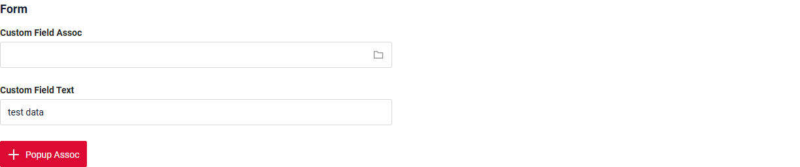
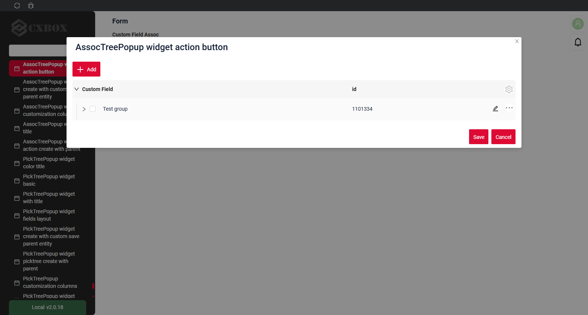
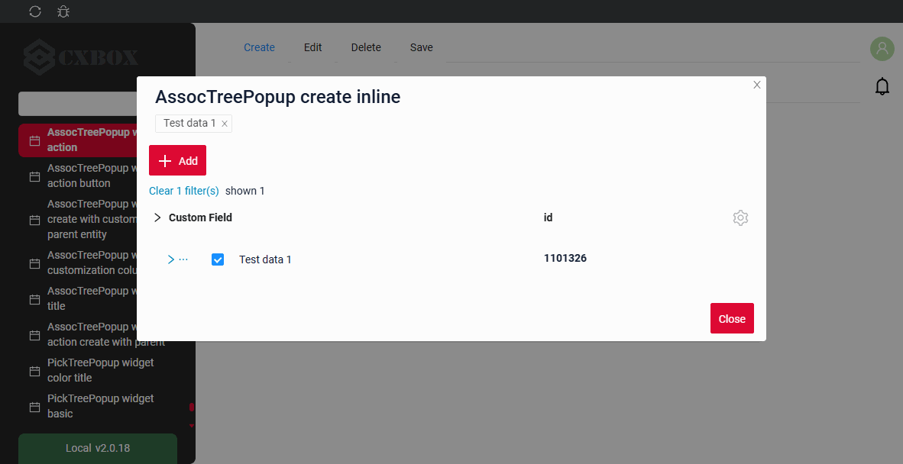
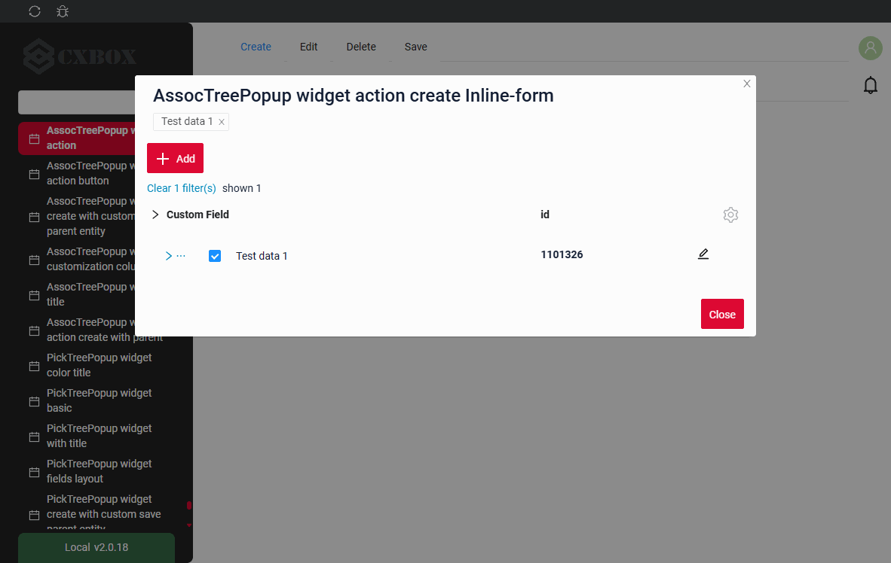
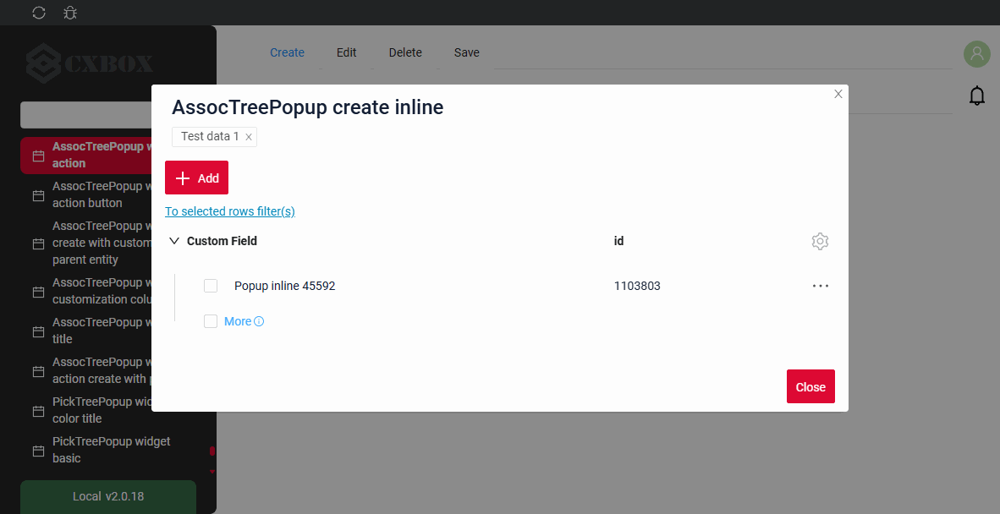
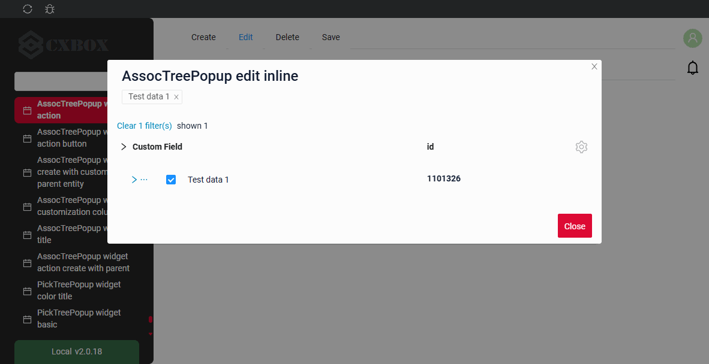
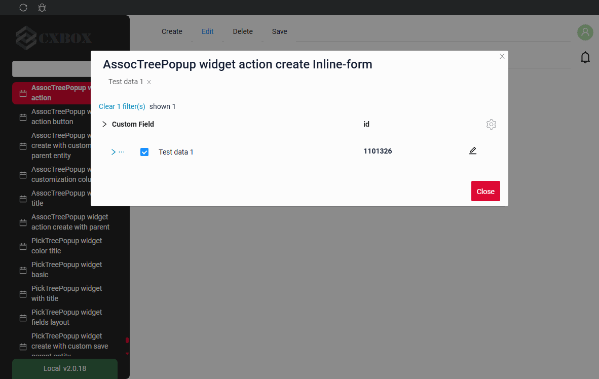
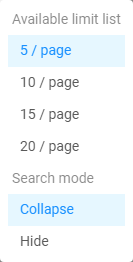

# AssocTreePopup

`AssocTreePopup` widget is a popup component designed to the selection of multiple values.

!!! info
    The following features are **not available** for the `AssocTreePopup` widget in this release:

    * fully or partially expanded initial load (the tree always opens collapsed)

## Basics
[:material-play-circle: Live Sample]({{ external_links.code_samples }}/ui/#/screen/myexample3330){:target="_blank"} ·
[:fontawesome-brands-github: GitHub]({{ external_links.github_ui }}/{{ external_links.github_branch }}/src/main/java/org/demo/documentation/widgets/assoctree/base){:target="_blank"}

The popup shows the records as a tree: the requirements of the [Tree widget](/widget/type/tree/tree/#basics) apply to the business component of the popup.

The minimal data set of a record of the popup is:

* `id` — the identifier of the record.
* `parentId` — the identifier of the parent record. For a root record the value is `null`.
  The backend must **always** return this field, and the field must be **filterable**, because the tree is built with the requests `parentId.specified=false` (root records) and `parentId.equals=<id>` (child records). see more [Lazy load](#lazyload)
* a name (title) field — the value shown in the tree column.
* `isLeaf` — a computed boolean flag. The default value is `false`. The value `true` means that the record has no child records, so the expand arrow is not displayed for it.

!!! info
    The **first** field of the `fields` array is rendered as the tree column: the expand arrow and the checkbox. All the other fields are rendered as ordinary columns.

    `parentId` and `isLeaf` are service fields: they are declared in the popup widget with type **hidden**.

**<a id="optionstree">options.tree</a>**

All tree specific settings are placed in **options**.**tree** of **_.widget.json_**.

??? Example

    | Property                 | Type                                            | Default                  | Description                                                                                                       |
    |--------------------------|-------------------------------------------------|--------------------------|-------------------------------------------------------------------------------------------------------------------|
    | `parentIdFieldKey`       | String                                          | `parentId`               | Name of the field that holds the identifier of the parent record.                                                   |
    | `isLeafFieldKey`         | String                                          | `isLeaf`                 | Name of the field that holds the flag "the record has no child records".                                             |
    | `searchModes`            | Array of `collapse`, `hide`                     | `["collapse", "hide"]`   | Modes of displaying the filtration result. The first item of the array is the active one. see [Search modes](#searchmodes) |
    | `onFilterApplyNestLevel` | Number                                          | `0`                      | How many levels of the navigation path are shown above a found record in `collapse` mode. see [Search modes](#searchmodes) |
    | `insertPosition`         | `start`, `end`                                  | —                        | Where a newly created row is inserted inside its node. see [Create](#createinline)                                  |
    | `selection`              | `node`, `nodeAndLeaf`, `leaf`                   | —                        | What the user is allowed to check. see [Selection modes](#selectionmodes) |
    | `confirms`               | Array of `paginationUnselect`, `paginationSelect` | `["paginationUnselect"]` | Confirmations shown when the selection touches a node whose records are not all loaded yet. see [Selection modes](#selectionmodes) |

**<a id="lazyload">Lazy load</a>**

The tree is always loaded **lazily** and always opens **collapsed**: only the root records are requested when the popup is opened, and the child records of a node are requested when the user expands it.

!!! info
    The operation `specified` is used **only** to select the records with an empty parent. For all the other requests the operation `equals` is used.
    This is why the field that holds the parent identifier must be filterable on the backend.

Every node keeps **its own pagination state**, so the records of one node are loaded page by page independently of the neighbouring nodes. see more [Pagination](#pagination)

??? Example
    * **Root records** are requested with the filter by an empty parent:

    ```
    ?parentId.specified=false&_page=1&_limit=5
    ```

    * **Child records** of a node are requested when the node is expanded:

    ```
    ?parentId.equals=<id>&_page=1&_limit=5
    ```

### How does it look?
=== "Assoc widget field"
    === "List"
        
    === "Info"
        _not applicable_
    === "Form"
        
=== "Assoc widget button"
    === "List"
        
    === "Info"
        _not applicable_
    === "Form"
        _not applicable_

!!! info

    The button-based association differs from the MultiValue field association in the following way:
    
    Previously selected records are not shown.
    
    Records selected by the user in the opened association are also not displayed as selected chips.
    
    This behavior occurs because the button-based association is not directly tied. Instead, it is designed to add records to a table.
    
    Recommendation
    If you plan to use a button-based association, you must add filtering to the opened association in order to exclude records that have already been selected and added to the table.

**Value selection:**

=== "Assoc widget field "
    
=== "Assoc widget button"
    


**Opening the widget:**

=== "Assoc widget field "
    
=== "Assoc widget button"
    

###  <a id="Howtoaddbacis">How to add?</a>
??? Example
    === "Assoc widget field"
        === "List"
            **Step1** Add field with type **multivalueTree** see more [Fields](#fields)

            ```json
            --8<--
            {{ external_links.github_raw_doc }}/widgets/assoctree/base/MyExample3330List.widget.json
            --8<--
            ```
       
            **Step2** Create popup widget **_.widget.json_** with type = **"AssocTreePopup"**.

            For the tree to work correctly, the popup widget must contain the `parentId` and `isLeaf` fields. These fields should be configured as **hidden**.

            ```json
            --8<--
            {{ external_links.github_raw_doc }}/widgets/assoctree/base/myEntity3330MultiAssocTreePopup.widget.json
            --8<--
            ```

            **Step3** Add widget to corresponding ****_.view.json_** **.
        
            ```json
            --8<--
            {{ external_links.github_raw_doc }}/widgets/assoctree/base/myexample3330list.view.json
            --8<--
            ```
        === "Info"
            _not applicable_

        === "Form"
            **Step1** Add field with type **multivalueTree** see more [Fields](#fields)

            ```json
            --8<--
            {{ external_links.github_raw_doc }}/widgets/assoctree/base/MyExample3330Form.widget.json
            --8<--
            ```
       
            **Step2** Create popup widget **_.widget.json_** with type = **"AssocTreePopup"**.

            For the tree to work correctly, the popup widget must contain the `parentId` and `isLeaf` fields. These fields should be configured as **hidden**.

            ```json
            --8<--
            {{ external_links.github_raw_doc }}/widgets/assoctree/base/myEntity3330MultiAssocTreePopup.widget.json
            --8<--
            ```

            **Step3** Add widget to corresponding ****_.view.json_** **.
        
            ```json
            --8<--
            {{ external_links.github_raw_doc }}/widgets/assoctree/base/myexample3330form.view.json
            --8<--
            ```
    === "Assoc widget button"
        === "List"
            **Step1** Add button `associate` to corresponding **VersionAwareResponseService**. 
            ```java
            --8<--
            {{ external_links.github_raw_doc }}/widgets/assoctree/base/MyExample3330Service.java:getActions
            --8<--
            ```
            **Step2** Add method `doAssociate` to corresponding **VersionAwareResponseService**. 

            `associate`

            ```java
            --8<--
            {{ external_links.github_raw_doc }}/widgets/assoctree/base/MyExample3330Service.java:doAssociate
            --8<--
            ```
            method `addNewRecords`
            ```java
            --8<--
            {{ external_links.github_raw_doc }}/widgets/assoctree/base/MyExample3330Service.java:addNewRecords
            --8<--
            ```

            **Step3** Create file **_.widget.json_** with type = **"assoc"** and name = parent bc + "Assoc"

            Add existing field to assoc widget. see more [Fields](#fields)

            ```json
            --8<--
            {{ external_links.github_raw_doc }}/widgets/assoctree/base/myexample3330Assoc.widget.json
            --8<--
            ```
            **Step4** Add a dependency on parent BC for Assoc BC for to corresponding **EnumBcIdentifier**
        
             ```java
             --8<--
             {{ external_links.github_raw_doc }}/widgets/assoctree/base/CxboxMyExample3330Controller.java
             --8<--
             ```

             **Step5** Add assoc widget to corresponding ****_.view.json_** **.
        
            ```json
            --8<--
            {{ external_links.github_raw_doc }}/widgets/assoctree/base/myexample3330list.view.json
            --8<--
            ```
 
        === "Info"
              _not applicable_

        === "Form"
              _not applicable_


## <a id="Title">Title</a>
[:material-play-circle: Live Sample]({{ external_links.code_samples }}/ui/#/screen/myexample3336){:target="_blank"} ·
[:fontawesome-brands-github: GitHub]({{ external_links.github_ui }}/{{ external_links.github_branch }}/src/main/java/org/demo/documentation/widgets/assoctree/title){:target="_blank"}

### Title Basic
`Title` for widget (optional)

There are types of:

* `constant title`: shows constant text.
* `constant title empty`: if you want to visually connect widgets by  them to be placed one under another

#### How does it look?
=== "Constant title"
    
=== "Constant title empty"
    

#### How to add?
??? Example
    === "Constant title"
        **Step1** Add name for **title** to **_.widget.json_**.
        ```json
        --8<--
        {{ external_links.github_raw_doc }}/widgets/assoctree/title/myEntity3336MultiPickAssocTreePopup.widget.json
        --8<--
        ```
        [:material-play-circle: Live Sample]({{ external_links.code_samples }}/ui/#/screen/myexample3336){:target="_blank"} ·
        [:fontawesome-brands-github: GitHub]({{ external_links.github_ui }}/{{ external_links.github_branch }}/src/main/java/org/demo/documentation/widgets/assoctree/title){:target="_blank"}

    === "Constant title empty"
    
        **Step1** Delete parameter **title** to **_.widget.json_**.
        ```json
        --8<--
        {{ external_links.github_raw_doc }}/widgets/assoctree/title/myEntity3336MultiPickAssocEmptyListPopup.widget.json
        --8<--
        ```
    
        [:material-play-circle: Live Sample]({{ external_links.code_samples }}/ui/#/screen/myexample3336/view/myexample3336emptytitle){:target="_blank"} ·
        [:fontawesome-brands-github: GitHub]({{ external_links.github_ui }}/{{ external_links.github_branch }}/src/main/java/org/demo/documentation/widgets/assoctree/title){:target="_blank"}
    

### Title Color
`Title Color` allows you to specify a color for a title. It can be constant or calculated.

**Constant color**

[:material-play-circle: Live Sample]({{ external_links.code_samples }}/ui/#/screen/myexample3329/view/myexample3329formcolorconst){:target="_blank"} ·
[:fontawesome-brands-github: GitHub]({{ external_links.github_ui }}/{{ external_links.github_branch }}/src/main/java/org/demo/documentation/widgets/assoctree/colortitle){:target="_blank"}

*Constant color* is a fixed color that doesn't change. It remains the same regardless of any factors in the application.

**Calculated color**

[:material-play-circle: Live Sample]({{ external_links.code_samples }}/ui/#/screen/myexample3329/view/myexample3329form){:target="_blank"} ·
[:fontawesome-brands-github: GitHub]({{ external_links.github_ui }}/{{ external_links.github_branch }}/src/main/java/org/demo/documentation/widgets/assoctree/colortitle){:target="_blank"}

*Calculated color* can be used to change a title color dynamically. It changes depending on business logic or data in the application.

!!! info
    Title colorization is **applicable** to the following [fields](/widget/fields/fieldtypes/): date, dateTime, dateTimeWithSeconds, number, money, percent, time, input, text, dictionary, radio, checkbox, multivalueTree, multivalueHover.

##### How does it look?


##### How to add?
??? Example
    === "Calculated color"

        **Step 1**   Add `custom field for color` to corresponding **DataResponseDTO**. The field can contain a HEX color or be null.
        ```java
        --8<--
        {{ external_links.github_raw_doc }}/widgets/assoctree/colortitle/color/MyEntity3332MultiPickDTO.java
        --8<--
        ```  
 
        **Step 2** Add **"bgColorKey"** :  `custom field for color` and  to .widget.json.

        Add in `title` field with `${customField}` 

        ```json
        --8<--
        {{ external_links.github_raw_doc }}/widgets/assoctree/colortitle/color/myEntity3332MultiPickAssocTreePopup.widget.json
        --8<--
        ``` 

        [:material-play-circle: Live Sample]({{ external_links.code_samples }}/ui/#/screen/myexample3329/view/myexample3332color){:target="_blank"} ·
        [:fontawesome-brands-github: GitHub]({{ external_links.github_ui }}/{{ external_links.github_branch }}/src/main/java/org/demo/documentation/widgets/assoctree/colortitle/color){:target="_blank"}

    === "Constant color"
 
        Add **"bgColor"** :  `HEX color`  to .widget.json.

        Add in `title` field with `${customField}` 

        ```json
        --8<--
        {{ external_links.github_raw_doc }}/widgets/assoctree/colortitle/colorconst/myEntity3332MultiPickAssocTreePopup0.widget.json
        --8<--
        ```
 
        [:material-play-circle: Live Sample]({{ external_links.code_samples }}/ui/#/screen/myexample3329/view/myexample3332colorconst){:target="_blank"} ·
        [:fontawesome-brands-github: GitHub]({{ external_links.github_ui }}/{{ external_links.github_branch }}/src/main/java/org/demo/documentation/widgets/assoctree/colortitle/colorconst){:target="_blank"}
 
## <a id="bc">Business component</a>
This specifies the business component (BC) to which this form belongs.
A business component represents a specific part of a system that handles a particular business logic or data.

see more  [Business component](/environment/businesscomponent/businesscomponent/)

## <a id="Showcondition">Show condition</a>
  

## <a id="fields">Fields</a>
Fields Configuration. The fields array defines the individual fields present within the form.

```json
{
    "title": "Custom Field",
    "key": "customField",
    "type": "input"
}
```

* **"title"**

  Description:  Field Title.

  Type: String(optional).

* **"key"**

  Description: Name field to corresponding DataResponseDTO.

  Type: String(required).

* **"type"**

  Description: [Field types](/widget/fields/fieldtypes/)

  Type: String(required).


### How to add?
??? Example

    === "With plugin(recommended)"
        **Step 1** Download plugin
            [download Intellij Plugin](https://document.cxbox.org/plugin/plugininstalling)
    
        **Step 2** Add existing field to an existing form widget
            
    === "Example of writing code"
        Add field to **_.widget.json_**.

          ```json
             --8<--
             {{ external_links.github_raw_doc }}/widgets/assoctree/base/myEntity3330MultiAssocTreePopup.widget.json
             --8<--
          ```

## <a id="Fieldslayout">Options layout</a>
**options.layout** - no use in this type.

## Actions
`Actions` show available actions as separate buttons see more [Actions](/features/element/actions/actions).

**Standard Actions**:

* [`Create`](#standart_create): Action to initialize the process of creating a new record
* [`Delete`](#standart_delete): Remove an existing record
* [`Edit`](#standart_edit): Users to update or correct information
* [`Save`](#standart_save): Action to store the data entered or modified
* [`Cancel-create`](#standart_cancel_create): Action to abort the creation of a new record, discarding any input without saving

As for assoc widget, there are several actions.
#### Create
`Create` button enables you to create a new value by clicking the `Add` button. This action can be performed in three different ways, feel free to choose any, depending on your logic of application:

There are three methods to create a record:

* [Inline](#createinline): You can add a line directly.

!!! info
    Pagination won't function until the page is refreshed after adding records.

* [Inline-form](#withwidget): You can add data using a form widget without leaving your current view.

* [With view](#withview): not applicable.

##### <a id="createinline">Inline</a>
[:material-play-circle: Live Sample]({{ external_links.code_samples }}/ui/#/screen/myexample3331/view/myexample3331inlinecreate){:target="_blank"} ·
[:fontawesome-brands-github: GitHub]({{ external_links.github_ui }}/{{ external_links.github_branch }}/src/main/java/org/demo/documentation/widgets/assoctree/actions/create){:target="_blank"}

With `Line Addition`, a new empty row is immediately added to the top of the assoc widget when the "Add" button is clicked. This is a quick way to add rows without needing to input data beforehand.

The position of the newly created row inside its node is defined by **options**.**tree**.**insertPosition**: `start` places it before the already loaded rows of the node, `end` places it after them. see [options.tree](#optionstree)

###### How does it look?


###### How to add?
??? Example

    **Step1** Add button `create` to corresponding **VersionAwareResponseService**. 
    ```java
    --8<--
    {{ external_links.github_raw_doc }}/widgets/assoctree/actions/MyEntity3331MultiMultivalueService.java:getActions
    --8<--
    ```
 
    **Step2** Add button `create` to corresponding **.widget.json**. 

    The position of a newly created row inside its node is defined by `options`.`tree`.`insertPosition`: `start` places it before the already loaded rows of the node, `end` places it after them.

    ```json
    --8<--
    {{ external_links.github_raw_doc }}/widgets/assoctree/actions/create/myEntity3331MultiAssocTreePopupCreateAssocTreePopup.widget.json
    --8<--
    ```

    **Step3** Add **fields.setEnabled** to corresponding **FieldMetaBuilder**.
    ```java
    --8<--
    {{ external_links.github_raw_doc }}}/widgets/assoc/actions/MyEntity3054MultiMultivalueMeta.java:buildRowDependentMeta
    --8<--
    ``` 
    [:material-play-circle: Live Sample]({{ external_links.code_samples }}/ui/#/screen/myexample3331){:target="_blank"} ·
    [:fontawesome-brands-github: GitHub]({{ external_links.github_ui }}/{{ external_links.github_branch }}/src/main/java/org/demo/documentation/widgets/assoctree/actions/create){:target="_blank"}

##### <a id="withwidget">Inline-form</a>
[:material-play-circle: Live Sample]({{ external_links.code_samples }}/ui/#/screen/myexample3331/view/myexample3331create){:target="_blank"} ·
[:fontawesome-brands-github: GitHub]({{ external_links.github_ui }}/{{ external_links.github_branch }}/src/main/java/org/demo/documentation/widgets/assoctree/actions/create){:target="_blank"}

`Create with widget` opens an additional widget when the "Add" button is clicked. The form will appear on the same screen, allowing you to view both the assoc of entities and the form for adding a new row.
After filling the information in and clicking "Save", the new row is added to the assoc.

The position of the newly created row inside its node is defined by **options**.**tree**.**insertPosition**: `start` places it before the already loaded rows of the node, `end` places it after them. see [options.tree](#optionstree)

###### How does it look?


###### How to add?
??? Example

    **Step1** Add button `create` to corresponding **VersionAwareResponseService**. 
    ```java
    --8<--
    {{ external_links.github_raw_doc }}/widgets/assoctree/actions/MyEntity3331MultiMultivalueService.java:getActions
    --8<--
    ```
    **Step2** Add **fields.setEnabled** to corresponding **FieldMetaBuilder**.
    ```java
    --8<--
    {{ external_links.github_raw_doc }}}/widgets/assoc/actions/MyEntity3054MultiMultivalueMeta.java:buildRowDependentMeta
    --8<--
    ```
     **Step3** Create widget.json with type `Form` that appears when you click a button
    ```json
    --8<--
    {{ external_links.github_raw_doc }}/widgets/assoctree/actions/myEntity3331MultiFormForPopup.widget.json
    --8<--
    ```
 
     **Step4** Add widget.json with type `Form` to corresponding **.view.json**. 
    ```json
    --8<--
    {{ external_links.github_raw_doc }}/widgets/assoctree/actions/create/myexample3331inlinecreate.view.json
    --8<--
    ```

     **Step5** Add button `create` and widget with type `Form` to corresponding **.widget.json**.
       
    `options`.`create`: Name widget that appears when you click a button

    The position of a newly created row inside its node is defined by `options`.`tree`.`insertPosition`: `start` places it before the already loaded rows of the node, `end` places it after them.

        
    ```json
    --8<--
    {{ external_links.github_raw_doc }}/widgets/assoctree/actions/create/myEntity3331MultiAssocTreePopup.widget.json
    --8<--
    ```
 
    [:material-play-circle: Live Sample]({{ external_links.code_samples }}/ui/#/screen/myexample3331){:target="_blank"} ·
    [:fontawesome-brands-github: GitHub]({{ external_links.github_ui }}/{{ external_links.github_branch }}/src/main/java/org/demo/documentation/widgets/assoctree/actions/create){:target="_blank"}

##### <a id="withview">With view</a>
_not applicable_


#### **<a id="standart_delete">Delete</a>**
[:material-play-circle: Live Sample]({{ external_links.code_samples }}/ui/#/screen/myexample3331/view/myexample3331delete){:target="_blank"} ·
[:fontawesome-brands-github: GitHub]({{ external_links.github_ui }}/{{ external_links.github_branch }}/src/main/java/org/demo/documentation/widgets/assoctree/actions/delete){:target="_blank"}

`Delete` remove an existing record.

!!! tips
    Please note that the row you are attempting to delete may be referenced by another part of the system or a parent entity. To ensure clarity, you should handle this exception and provide a explanation to the user.

###### How does it look?


###### How to add?
??? Example

    **Step1** Add action *delete* to corresponding **VersionAwareResponseService**. 

    By default, the access button is available when a record exist.

    ```java
    --8<--
    {{ external_links.github_raw_doc }}/widgets/assoctree/actions/MyExample3331Service.java:getActions
    --8<--
    ```  
 
    **Step2** Add button ot group button to corresponding **.widget.json**.
   
    ```json
    --8<--
    {{ external_links.github_raw_doc }}/widgets/assoctree/actions/save/myEntity3331MultiAssocSaveListPopup.widget.json
    --8<--
    ``` 
    [:material-play-circle: Live Sample]({{ external_links.code_samples }}/ui/#/screen/myexample3331/view/myexample3331delete){:target="_blank"} ·
    [:fontawesome-brands-github: GitHub]({{ external_links.github_ui }}/{{ external_links.github_branch }}/src/main/java/org/demo/documentation/widgets/assoctree/actions/delete){:target="_blank"}

#### Edit
`Edit` enables you to change the field value. Just like with `Create` button, there are three ways of implementing this Action.

There are three methods to create a record:

* [Inline edit](#editline): You can edit a line directly.

* [Inline-form](#editwithwidget): You can edit data using a form widget without leaving your current view.

* [With view](#editwithview): not applicable

##### <a id="editline">Inline edit </a>
[:material-play-circle: Live Sample]({{ external_links.code_samples }}/ui/#/screen/myexample3331/view/myexample3331edit){:target="_blank"} ·
[:fontawesome-brands-github: GitHub]({{ external_links.github_ui }}/{{ external_links.github_branch }}/src/main/java/org/demo/documentation/widgets/assoctree/actions/edit){:target="_blank"}


`Edit Inline` implies inline-edit. Click twice on the value you want to change.
###### How does it look?


###### How to add?
??? Example

    **Step1** Add **fields.setEnabled** to corresponding **FieldMetaBuilder**.
    ```java
    --8<--
    {{ external_links.github_raw_doc }}/widgets/assoctree/actions/MyExample3331Meta.java:buildRowDependentMeta
    --8<--
    ```
 
    [:material-play-circle: Live Sample]({{ external_links.code_samples }}/ui/#/screen/myexample3331/view/myexample3331edit){:target="_blank"} ·
    [:fontawesome-brands-github: GitHub]({{ external_links.github_ui }}/{{ external_links.github_branch }}/src/main/java/org/demo/documentation/widgets/assoctree/actions/edit){:target="_blank"}

##### <a id="editwithwidger">Inline-form</a>
[:material-play-circle: Live Sample]({{ external_links.code_samples }}/ui/#/screen/myexample3331/view/myexample3331editinlineform){:target="_blank"} ·
[:fontawesome-brands-github: GitHub]({{ external_links.github_ui }}/{{ external_links.github_branch }}/src/main/java/org/demo/documentation/widgets/assoctree/actions/edit){:target="_blank"}

`Edit with widget` opens an additional widget when clicking on the Edit option from a three-dot menu.

###### How does it look?


###### How to add?
??? Example

    **Step1** Add button `edit` to corresponding **VersionAwareResponseService**.
    ```java
    --8<--
    {{ external_links.github_raw_doc }}/widgets/assoctree/actions/MyExample3331Service.java:getActions
    --8<--
    ```

    **Step2** Add **fields.setEnabled** to corresponding **FieldMetaBuilder**.
    ```java
    --8<--
    {{ external_links.github_raw_doc }}/widgets/assoctree/actions/MyExample3331Meta.java:buildRowDependentMeta
    --8<--
    ```
 
    **Step2**  Create widget.json with type `Form` that appears when you click a button
    ```json
    --8<--
    {{ external_links.github_raw_doc }}/widgets/assoctree/actions/edit/MyExample3331FormEdit.widget.json
    --8<--
    ```
 
     **Step4** Add widget.json with type `Form` to corresponding **.view.json**. 
    ```json
    --8<--
    {{ external_links.github_raw_doc }}/widgets/assoctree/actions/edit/myexample3331editinlineform.view.json
    --8<--
    ```

     **Step5** Add button `edit` and widget with type `Form` to corresponding **.widget.json**.
       
    `options`.`edit`: Name widget that appears when you click a button
        
    ```json
    --8<--
    {{ external_links.github_raw_doc }}/widgets/assoctree/actions/edit/MyExample3331Edit.widget.json
    --8<--
    ```

    [:material-play-circle: Live Sample]({{ external_links.code_samples }}/ui/#/screen/myexample3331/view/myexample3331editinlineform){:target="_blank"} ·
    [:fontawesome-brands-github: GitHub]({{ external_links.github_ui }}/{{ external_links.github_branch }}/src/main/java/org/demo/documentation/widgets/assoctree/actions/edit){:target="_blank"}

##### <a id="editwithview">With view</a>
not applicable

### Additional properties
#### <a id="noderefresh">Node refresh</a>
After an action (save, delete, cancel-create) the popup refreshes only the **node** the record belongs to, in the same way as a [Tree widget](/widget/type/tree/tree/#noderefresh):

* the row is updated from the response of the action or, if the response does not contain it, re-read with the request `?id.equals=<id>`;
* the row-meta of the row is requested again;
* if the record is not returned any more, the row is removed from the tree;
* the node is collapsed and its already loaded child records are forgotten, so they are loaded again on the next expand.

!!! info
    Sibling records and parent records are **not** refreshed automatically. `PostAction.refreshBC` is not supported for a tree in this release: the root page is loaded again, but the expanded nodes and their already loaded child records stay as they are.

#### Customization of displayed columns
not applicable
#### Filtration
##### Basic
see more  [Fields](/widget/type/property/filtration/filtration/)

Filtration of the popup is a standard request. The rows that match the filter are returned by the backend without any hierarchy, and the popup decides how to display them, see [Search modes](#searchmodes).

The panel above the tree shows:

* `Clear N filter(s)` — the number of applied filters and the possibility to reset them;
* `Shown N` — how many found records are currently displayed;
* `More M` — how many found records are not displayed yet, where `M` is the number of found records minus the number of shown records.

!!! info
    With the pagination mode `nextAndPreviousWithCount` the `/count` request is **not** performed after filtration. Instead of the number of found records an `i` icon is displayed with the tooltip **"Load more and show count"**.

#### FullTextSearch
`FullTextSearch` - when the user types in the full text search input area, then widget filters the rows that match the search query.
see [FullTextSearch](/widget/type/property/filtration/filtration/#by-fulltextsearch)

The result of a full text search is displayed in the same way as the result of filtration, see [Search modes](#searchmodes).
##### Personal filter group
not applicable
##### Filter group
not applicable

#### <a id="searchmodes">Search modes</a>
[:fontawesome-brands-github: GitHub]({{ external_links.github_ui }}/{{ external_links.github_branch }}/src/main/java/org/demo/documentation/widgets/property/filtration/fulltextsearch/forassoc){:target="_blank"}

The way the result of filtration and full text search is displayed is defined by **options**.**tree**.**searchModes**.

There are two modes:

* `collapse` — **search results and tree**. The tree displays the found records together with the records that are required for navigation: the navigation path above every found record is restored `onFilterApplyNestLevel` levels up. The user can navigate through the tree, expand and collapse branches, see the neighbouring records and load additional records.
* `hide` — **search results only**. The tree displays only the found records, everything else is hidden. The user works with the search result only and cannot navigate through the other records of the tree.

Both modes can be available at the same time. The **first** item of the `searchModes` array is the mode that is active when the filter is applied; the user switches between the available modes in the gear menu of the popup.

**Restoring the path upwards**

In `collapse` mode the records whose parents have not been loaded yet are placed under a pseudo node. The `>...` button loads the missing parents with the request `?id.equals=<parentId>` and moves the records into the hierarchy. One click restores up to **2** levels of nesting, so for a deep hierarchy the button has to be pressed several times.

###### How does it look?
=== "Search results and tree (collapse)"
    
=== "Search results only (hide)"
    
=== "Switching between modes"
    

###### How to add?
??? Example
    **Step1** Add **options**.**tree**.**searchModes** to corresponding **_.widget.json_**.

    The first item of the array is the mode that is active when the filter is applied.

    ```
    "tree": {
      "searchModes": ["collapse", "hide"],
      "onFilterApplyNestLevel": 0
    }
    ```

    ```json
    --8<--
    {{ external_links.github_raw_doc }}/widgets/property/filtration/fulltextsearch/forassoc/myEntity3625PickAssocTreePopup.widget.json
    --8<--
    ```

    [:fontawesome-brands-github: GitHub]({{ external_links.github_ui }}/{{ external_links.github_branch }}/src/main/java/org/demo/documentation/widgets/property/filtration/fulltextsearch/forassoc){:target="_blank"}

#### <a id="pagination">Pagination</a>
`Pagination` is the process of dividing content into separate, discrete pages, making it easier to navigate and consume large amounts of information.
see [Pagination](/widget/type/property/pagination/pagination)

The popup has no navigation arrows. Instead of the "next" arrow the last row of a node is the **`More`** button, which loads the next page of the node and appends it to the already loaded records. The limit selector (`availableLimitsList`) is moved to the gear menu of the popup.

The `More` button follows the same algorithm as the "next" arrow of the three pagination modes:

| Pagination mode              | When `More` is displayed                                                                      | Counter                                     |
|------------------------------|-----------------------------------------------------------------------------------------------|---------------------------------------------|
| `nextAndPreviousWithHasNext` | `hasNext` returned by the backend is `true`                                                     | not displayed                               |
| `nextAndPreviousWithCount`   | `count` is greater than the number of already loaded records                                    | how many records are left to load           |
| `nextAndPreviousSmart`       | the backend returned more records than the limit of the node                                    | not displayed                               |

see more [Pagination modes](/widget/type/property/pagination/pagination)

###### How does it look?


###### How to add?
??? Example
    === "availableLimitsList"
        The list of available limits is displayed in the gear menu of the popup.

        ```
        "pagination": {
          "availableLimitsList": [1, 2, 3]
        }
        ```

        ```json
        --8<--
        {{ external_links.github_raw_doc }}/widgets/property/pagination/availablelimitselist/myEntity3867MultiPickAssocTreePopup.widget.json
        --8<--
        ```

        [:fontawesome-brands-github: GitHub]({{ external_links.github_ui }}/{{ external_links.github_branch }}/src/main/java/org/demo/documentation/widgets/property/pagination/availablelimitselist){:target="_blank"}

    === "Page limit"
        The default number of the records requested for a node is defined by the page limit, see [Page limit](/widget/type/property/defaultlimitpage/defaultlimitpage).

        ```json
        --8<--
        {{ external_links.github_raw_doc }}/widgets/property/defaultlimitpage/myEntity359AssocPickAssocTreePopup.widget.json
        --8<--
        ```

        [:fontawesome-brands-github: GitHub]({{ external_links.github_ui }}/{{ external_links.github_branch }}/src/main/java/org/demo/documentation/widgets/property/defaultlimitpage){:target="_blank"}

#### Export to Excel
not applicable

#### Multi-upload files
not applicable

##### Sorting
`Sorting` allows the user to sort the records by a column.
see [Sorting](/widget/type/property/sorting/sorting)

Sorting of the popup works **inside a node**: the records are sorted among the children of the same parent, the hierarchy itself is not changed. In all other respects sorting is standard.

#### <a id="selectionmodes">Selection modes</a>
[:material-play-circle: Live Sample]({{ external_links.code_samples }}/ui/#/screen/myexample3261/view/myexample3261list){:target="_blank"} ·
[:fontawesome-brands-github: GitHub]({{ external_links.github_ui }}/{{ external_links.github_branch }}/src/main/java/org/demo/documentation/widgets/tree/base/inner){:target="_blank"}

Checkboxes are available both on the nodes and on the leaves of the tree. What exactly the user is allowed to check is defined by **options**.**tree**.**selection**:

* `node` — only the nodes can be checked.
* `leaf` — only the leaves can be checked.
* `nodeAndLeaf` — both the nodes and the leaves can be checked.

!!! info
    The checkbox of the `More` row is always **disabled**: this row is a pagination control, not a record.

**Rule 1.** What the user selected **explicitly** is marked with a **bright** checkmark, and exactly that is sent to the backend. Everything that is selected **indirectly**, as a consequence of an explicit selection, is marked with a **dimmed** checkmark or a **dimmed** square.

The following cases are possible:

* **The user picks the leaves manually.** The identifiers of the picked leaves are sent to the backend. The parent group is marked with a dimmed square, because the group itself is not selected.

* **The user picks a group.** The identifier of the group is sent to the backend. All the children of the group, including the `More` row, become dimmed: they are selected as a part of the group and cannot be selected separately.

* **The user unchecks a child of a selected group.** The selection switches to the manual mode: the group is no longer sent to the backend, instead the identifiers of the remaining children are sent.

!!! info
    Limitation: the selection "the group **minus** N records" cannot be expressed. Such a selection is always transformed into the explicit list of the remaining records.

* **The user checks all the children of a group manually.** This is **not** the same as picking the group itself. The two selections are visually distinguishable, and they behave differently: when new records of that group appear, they are **not** selected in the manual case, while they are a part of the selection when the group itself is picked.

##### Confirmation for a node that is not fully loaded
A node may have records that are not loaded yet, hidden behind the `More` row. **options**.**tree**.**confirms** defines which actions on such a node are confirmed:

| Value                | Description                                                                                                                                                                  |
|----------------------|------------------------------------------------------------------------------------------------------------------------------------------------------------------------------|
| `paginationUnselect` | The user unchecks a child of a selected node. After the confirmation the selection switches to the manual mode: only the loaded records stay selected, the hidden ones are lost. |
| `paginationSelect`   | The user checks the node itself. After the confirmation the whole node is selected, including the records hidden behind `More`.                                                |

The default value is `["paginationUnselect"]`, an empty array disables the confirmations. see more [options.tree](#optionstree)

##### How does it look?
=== "Selection of a group"
    
=== "Manual selection of the children"
    
=== "Confirmation for a node that is not fully loaded"
    

##### How to add?
??? Example
    Add in **options** parameter **tree** to corresponding **.widget.json**.

    ```
    "tree": {
      "selection": "node",
      "confirms": ["paginationUnselect"]
    }
    ```

    ```json
    --8<--
    {{ external_links.github_raw_doc }}/widgets/tree/base/inner/myexample3261AssocTreePopup.widget.json
    --8<--
    ```

    [:material-play-circle: Live Sample]({{ external_links.code_samples }}/ui/#/screen/myexample3261/view/myexample3261list){:target="_blank"} ·
    [:fontawesome-brands-github: GitHub]({{ external_links.github_ui }}/{{ external_links.github_branch }}/src/main/java/org/demo/documentation/widgets/tree/base/inner){:target="_blank"}

!!! info
    The button usage and the `multivalueTree` field usage differ in the way the already selected values are shown.

    On a field with type `multivalueTree` the popup shows the already selected values as **tags** at the top, so the user continues the previous selection.

    The popup opened by a button is not directly tied to a field, so it always opens **from scratch**, without the tags of the already selected values. Add filtering to the opened association in order to exclude the records that have already been added.
