# AssocTreePopup

`AssocTreePopup` widget is a popup component designed to the selection of multiple values from a hierarchical, lazily loaded tree.

It is the tree-shaped analogue of [AssocListPopup](/widget/type/assoclistpopup/assoclistpopup): the records are shown not as a flat list, but as an expandable tree, and the user marks the required records with checkboxes.

## Basics
[:material-play-circle: Live Sample]({{ external_links.code_samples }}/ui/#/screen/myexample3261/view/myexample3261list){:target="_blank"} ·
[:fontawesome-brands-github: GitHub]({{ external_links.github_ui }}/{{ external_links.github_branch }}/src/main/java/org/demo/documentation/widgets/tree/base/inner){:target="_blank"}

For the widget to work correctly, the same requirements as for the [Tree](/widget/type/tree/tree) widget must be met.

The minimal data set of a record is:

* `id` — the identifier of the record.
* `parentId` — the identifier of the parent record. For a root record the value is `null`.
  The backend must **always** return this field, and the field must be **filterable**. see more [Lazy load](/widget/type/tree/tree/#lazyload)
* a name (title) field — the value shown in the tree column.
* `isLeaf` — a computed boolean flag. The default value is `false`. The value `true` means that the record has no child records, so the expand arrow is not displayed for it.

!!! info
    The **first** field of the `fields` array is rendered as the tree column: the checkbox, the expand arrow and the indent of the nesting level are placed in it (Ant Design Tree style). All the other fields are rendered as ordinary columns.

    `parentId` and `isLeaf` are service fields. They must be declared in the widget with type **hidden**.

All tree specific settings are placed in **options**.**tree**. see more [options.tree](/widget/type/tree/tree/#optionstree)

There are two ways to use the widget:

* `Assoc widget field` — the popup is opened from a field with type `multivalueTree`. The values already selected are shown as tags at the top of the popup.
* `Assoc widget button` — the popup is opened by the `associate` button. The selected values are added to a separate widget.

### How does it look?
=== "Assoc widget field"
    === "List"
        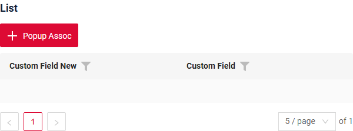
    === "Info"
        _not applicable_
    === "Form"
        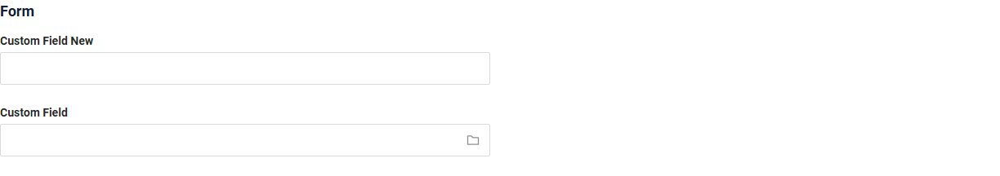
=== "Assoc widget button"
    === "List"
        
    === "Info"
        _not applicable_
    === "Form"
        _not applicable_

!!! info

    The button-based association differs from the MultiValue field association in the following way:

    Previously selected records are not shown.

    Records selected by the user in the opened association are also not displayed as selected chips.

    This behavior occurs because the button-based association is not directly tied. Instead, it is designed to add records to a table.

    Recommendation
    If you plan to use a button-based association, you must add filtering to the opened association in order to exclude records that have already been selected and added to the table.

**Value selection:**

=== "Assoc widget field "
    
=== "Assoc widget button"
    <!-- TODO screenshot -->


**Opening the widget:**

=== "Assoc widget field "
    
=== "Assoc widget button"
    <!-- TODO screenshot -->

###  <a id="Howtoaddbacis">How to add?</a>
??? Example
    === "Assoc widget field"
        === "List"
            **Step1** Create field `parentId`, `isLeaf` to corresponding **DataResponseDTO**.

            * `parentId` — identifies the parent record of the current record and defines the parent-child relationship in the tree. If the record is a root node, `parentId` must be empty. The field must be **filterable**.
            * `isLeaf` — indicates whether the record can be expanded. The value `true` means that the record cannot be expanded, while `false` means that the record can be expanded to display child records.

            ```java
            --8<--
            {{ external_links.github_raw_doc }}/widgets/tree/base/inner/Myexample3261Pick0DTO.java
            --8<--
            ```

            **Step2** Add field with type **multivalueTree** see more [Fields](#fields)

            ```json
            --8<--
            {{ external_links.github_raw_doc }}/widgets/tree/base/inner/MyExample3263List.widget.json
            --8<--
            ```

            **Step3** Create file **_.widget.json_** with type = **"AssocTreePopup"**

            Add existing field to assoc widget. see more [Fields](#fields)

            The widget must contain the `parentId` and `isLeaf` fields. These fields should be configured as **hidden**.

            ```json
            --8<--
            {{ external_links.github_raw_doc }}/widgets/tree/base/inner/myexample3261AssocTreePopup.widget.json
            --8<--
            ```

            **Step4** Add a dependency on parent BC for popup BC for to corresponding **EnumBcIdentifier**

            ```java
            --8<--
            {{ external_links.github_raw_doc }}/widgets/tree/base/CxboxMyExample3263Controller.java
            --8<--
            ```

            **Step5** Add widget and popup widget to corresponding ****_.view.json_** **.

            ```json
            --8<--
            {{ external_links.github_raw_doc }}/widgets/tree/base/views/myexample3261list.view.json
            --8<--
            ```
        === "Info"
            _not applicable_

        === "Form"
            **Step1** Add field with type **multivalueTree** see more [Fields](#fields)

            ```json
            --8<--
            {{ external_links.github_raw_doc }}/widgets/tree/base/inner/MyExample3263List.widget.json
            --8<--
            ```

            **Step2** Add widget to corresponding ****_.view.json_** **.

            ```json
            --8<--
            {{ external_links.github_raw_doc }}/widgets/tree/base/views/myexample3261list.view.json
            --8<--
            ```
    === "Assoc widget button"
        === "List"
            **Step1** Add button `associate` and method `doAssociate` to corresponding **VersionAwareResponseService**.

            ```java
            --8<--
            {{ external_links.github_raw_doc }}/widgets/tree/base/inner/Myexample3263Service.java
            --8<--
            ```

            **Step2** Create file **_.widget.json_** with type = **"AssocTreePopup"** and name = parent bc + "Assoc"

            Add existing field to assoc widget. see more [Fields](#fields)

            The widget must contain the `parentId` and `isLeaf` fields. These fields should be configured as **hidden**.

            ```json
            --8<--
            {{ external_links.github_raw_doc }}/widgets/tree/base/inner/myexample3261AssocTreeButton.widget.json
            --8<--
            ```

            **Step3** Add a dependency on parent BC for Assoc BC for to corresponding **EnumBcIdentifier**

            ```java
            --8<--
            {{ external_links.github_raw_doc }}/widgets/tree/base/CxboxMyExample3263Controller.java
            --8<--
            ```

            **Step4** Add assoc widget to corresponding ****_.view.json_** **.

            ```json
            --8<--
            {{ external_links.github_raw_doc }}/widgets/tree/base/views/myexample3261list.view.json
            --8<--
            ```

        === "Info"
              _not applicable_

        === "Form"
              _not applicable_

## <a id="Title">Title</a>
[:material-play-circle: Live Sample]({{ external_links.code_samples }}/ui/#/screen/myexample3267/view/myexample3267listall){:target="_blank"} ·
[:fontawesome-brands-github: GitHub]({{ external_links.github_ui }}/{{ external_links.github_branch }}/src/main/java/org/demo/documentation/widgets/tree/colortitle/forfields){:target="_blank"}

### Title Basic
`Title` for widget (optional)

There are types of:

* `constant title`: shows constant text.
* `constant title empty`: if you want to visually connect widgets by  them to be placed one under another

#### How does it look?
=== "Constant title"
    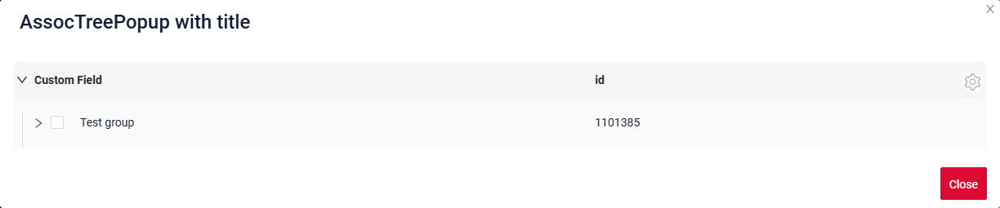
=== "Constant title empty"
    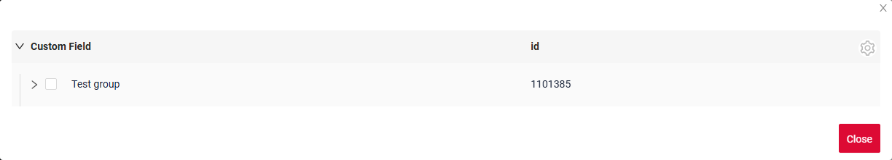

#### How to add?
??? Example
    === "Constant title"
        **Step1** Add name for **title** to **_.widget.json_**.
        ```json
        --8<--
        {{ external_links.github_raw_doc }}/widgets/tree/colortitle/forfields/myEntity3267MultiMultiAssocTreePopup.widget.json
        --8<--
        ```
        [:material-play-circle: Live Sample]({{ external_links.code_samples }}/ui/#/screen/myexample3267/view/myexample3267listall){:target="_blank"} ·
        [:fontawesome-brands-github: GitHub]({{ external_links.github_ui }}/{{ external_links.github_branch }}/src/main/java/org/demo/documentation/widgets/tree/colortitle/forfields){:target="_blank"}

    === "Constant title empty"

        **Step1** Delete parameter **title** to **_.widget.json_**.

### Title Color
`Title Color` allows you to specify a color for a title. It can be constant or calculated.

**Constant color**

[:material-play-circle: Live Sample]({{ external_links.code_samples }}/ui/#/screen/myexample3267/view/myexample3267listcolorconstall){:target="_blank"} ·
[:fontawesome-brands-github: GitHub]({{ external_links.github_ui }}/{{ external_links.github_branch }}/src/main/java/org/demo/documentation/widgets/tree/colortitle){:target="_blank"}

*Constant color* is a fixed color that doesn't change. It remains the same regardless of any factors in the application.

**Calculated color**

[:material-play-circle: Live Sample]({{ external_links.code_samples }}/ui/#/screen/myexample3267/view/myexample3267listall){:target="_blank"} ·
[:fontawesome-brands-github: GitHub]({{ external_links.github_ui }}/{{ external_links.github_branch }}/src/main/java/org/demo/documentation/widgets/tree/colortitle){:target="_blank"}

*Calculated color* can be used to change a title color dynamically. It changes depending on business logic or data in the application.

!!! info
    Title colorization is **applicable** to the following [fields](/widget/fields/fieldtypes/): date, dateTime, dateTimeWithSeconds, number, money, percent, time, input, text, dictionary, radio, checkbox, multivalue, multivalueHover.

##### How does it look?
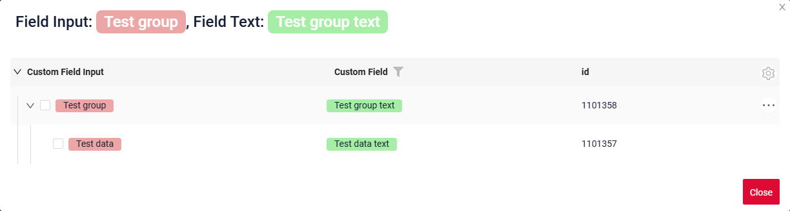

##### How to add?
??? Example
    === "Calculated color"

        **Step 1**   Add `custom field for color` to corresponding **DataResponseDTO**. The field can contain a HEX color or be null.
        ```java
        --8<--
        {{ external_links.github_raw_doc }}/widgets/tree/colortitle/MyExample3267DTO.java:colorDTO
        --8<--
        ```

        **Step 2** Add **"bgColorKey"** :  `custom field for color` and  to .widget.json.

        Add in `title` field with `${customField}`

        ```
        "bgColorKey": "customFieldColor"
        ```

        [:material-play-circle: Live Sample]({{ external_links.code_samples }}/ui/#/screen/myexample3267/view/myexample3267listall){:target="_blank"} ·
        [:fontawesome-brands-github: GitHub]({{ external_links.github_ui }}/{{ external_links.github_branch }}/src/main/java/org/demo/documentation/widgets/tree/colortitle){:target="_blank"}

    === "Constant color"

        Add **"bgColor"** :  `HEX color`  to .widget.json.

        Add in `title` field with `${customField}`

        ```
        "bgColor": "#F5A623"
        ```

        [:material-play-circle: Live Sample]({{ external_links.code_samples }}/ui/#/screen/myexample3267/view/myexample3267listcolorconstall){:target="_blank"} ·
        [:fontawesome-brands-github: GitHub]({{ external_links.github_ui }}/{{ external_links.github_branch }}/src/main/java/org/demo/documentation/widgets/tree/colortitle){:target="_blank"}

## <a id="bc">Business component</a>
This specifies the business component (BC) to which this form belongs.
A business component represents a specific part of a system that handles a particular business logic or data.

see more  [Business component](/environment/businesscomponent/businesscomponent/)

## <a id="Showcondition">Show condition</a>


## <a id="fields">Fields</a>
Fields Configuration. The fields array defines the individual fields present within the form.

```json
{
    "title": "Custom Field",
    "key": "customField",
    "type": "input"
}
```

* **"title"**

  Description:  Field Title.

  Type: String(optional).

* **"key"**

  Description: Name field to corresponding DataResponseDTO.

  Type: String(required).

* **"type"**

  Description: [Field types](/widget/fields/fieldtypes/)

  Type: String(required).

!!! info
    The **first** field of the `fields` array is rendered as the tree column.

    The fields `parentId` and `isLeaf` must be declared with type **hidden**.

### How to add?
??? Example

    === "With plugin(recommended)"
        **Step 1** Download plugin
            [download Intellij Plugin](https://document.cxbox.org/plugin/plugininstalling)

        **Step 2** Add existing field to an existing form widget
            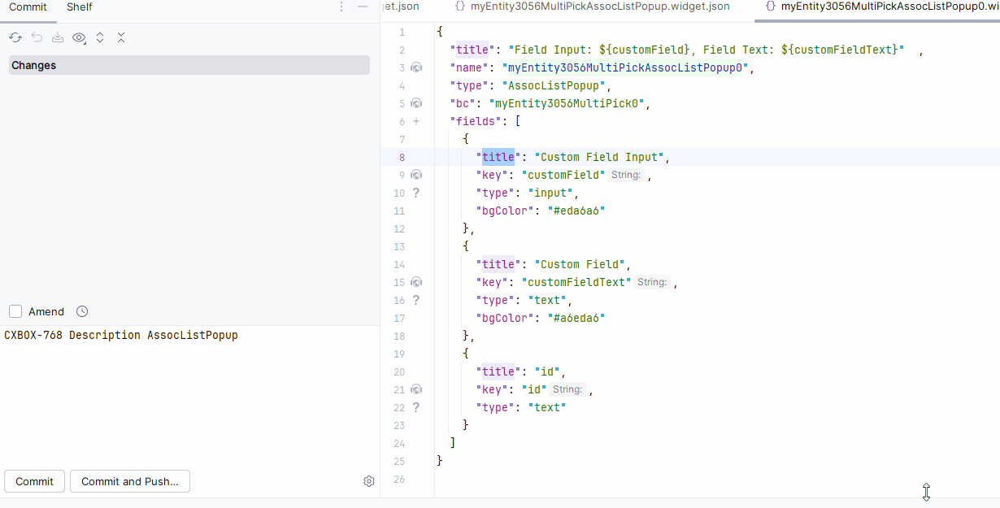
    === "Example of writing code"
        Add field to **_.widget.json_**.

          ```json
             --8<--
             {{ external_links.github_raw_doc }}/widgets/tree/base/inner/myexample3261AssocTreePopup.widget.json
             --8<--
          ```

## <a id="Fieldslayout">Options layout</a>
**options.layout** - no use in this type.

## Actions
`Actions` show available actions as separate buttons see more [Actions](/features/element/actions/actions).

**Standard Actions**:

* [`Create`](#standart_create): Action to initialize the process of creating a new record
* [`Delete`](#standart_delete): Remove an existing record
* [`Edit`](#standart_edit): Users to update or correct information
* [`Save`](#standart_save): Action to store the data entered or modified
* [`Cancel-create`](#standart_cancel_create): Action to abort the creation of a new record, discarding any input without saving

As for assoc tree widget, there are several actions.
####  <a id="standart_create">Create</a>
`Create` button enables you to create a new value by clicking the `Add` button. This action can be performed in three different ways, feel free to choose any, depending on your logic of application:

There are three methods to create a record:

* [Inline](#createinline): You can add a line directly.

!!! info
    Pagination won't function until the page is refreshed after adding records.

* [Inline-form](#withwidget): You can add data using a form widget without leaving your current view.

* [With view](#withview): not applicable.

!!! info
    The position of a newly created row inside its node is defined by **options**.**tree**.**insertPosition** (`start`, `end`). see more [options.tree](/widget/type/tree/tree/#optionstree)

##### <a id="createinline">Inline</a>
With `Line Addition`, a new empty row is immediately added to the top of the widget when the "Add" button is clicked. This is a quick way to add rows without needing to input data beforehand.
###### How does it look?
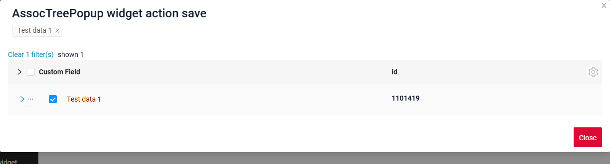

###### How to add?
The action is configured in the same way as for the tree widget, see [Inline](/widget/type/tree/tree/#createinline).

##### <a id="withwidget">Inline-form</a>
`Create with widget` opens an additional widget when the "Add" button is clicked. The form will appear on the same screen, allowing you to view both the tree of entities and the form for adding a new row.
After filling the information in and clicking "Save", the new row is added to the tree.
###### How does it look?


###### How to add?
The action is configured in the same way as for the tree widget, see [Inline-form](/widget/type/tree/tree/#withwidget).

##### <a id="withview">With view</a>
_not applicable_

#### **<a id="standart_delete">Delete</a>**
`Delete` remove an existing record.

!!! tips
    Please note that the row you are attempting to delete may be referenced by another part of the system or a parent entity. To ensure clarity, you should handle this exception and provide a explanation to the user.

###### How does it look?
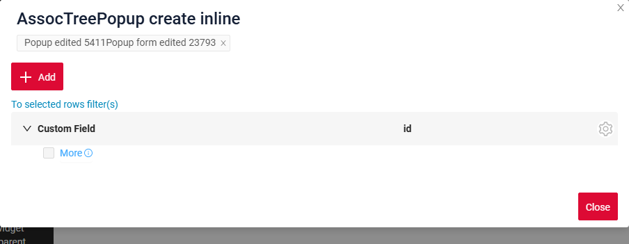

###### How to add?
The action is configured in the same way as for the tree widget, see [Actions](/widget/type/tree/tree/#actions).

#### <a id="standart_edit">Edit</a>
`Edit` enables you to change the field value. Just like with `Create` button, there are three ways of implementing this Action.

There are three methods to create a record:

* [Inline edit](#editline): You can edit a line directly.

* [Inline-form](#editwithwidger): You can edit data using a form widget without leaving your current view.

* [With view](#editwithview): not applicable

##### <a id="editline">Inline edit </a>
`Edit Inline` implies inline-edit. Click twice on the value you want to change.
###### How does it look?


###### How to add?
The action is configured in the same way as for the tree widget, see [Inline edit](/widget/type/tree/tree/#editline).

##### <a id="editwithwidger">Inline-form</a>
_not applicable_

##### <a id="editwithview">With view</a>
not applicable

### Additional properties
#### Customization of displayed columns
not applicable
#### Filtration
##### Basic
see more  [Fields](/widget/type/property/filtration/filtration/)
#### FullTextSearch
`FullTextSearch` - when the user types in the full text search input area, then widget filters the rows that match the search query.
see [FullTextSearch](/widget/type/property/filtration/filtration/#by-fulltextsearch)
##### Personal filter group
not applicable
##### Filter group
not applicable
#### Pagination
`Pagination` is the process of dividing content into separate, discrete pages, making it easier to navigate and consume large amounts of information.
see [Pagination](/widget/type/property/pagination/pagination)
#### Export to Excel
not applicable

!!! info
    `Export to Excel` is **not available** for the tree widgets in this release.

#### <a id="lazyload">Lazy load</a>
[:fontawesome-brands-github: GitHub]({{ external_links.github_ui }}/{{ external_links.github_branch }}/src/main/java/org/demo/documentation/widgets/property/pagination){:target="_blank"}

Every node keeps **its own pagination state**, so the records of one node are loaded page by page independently of the neighbouring nodes.

!!! info
    Instead of the "next page" arrow the tree shows the `More` button in the last row of a node.

    The page size selector `availableLimitsList` is placed in the gear menu of the widget.

###### How does it look?
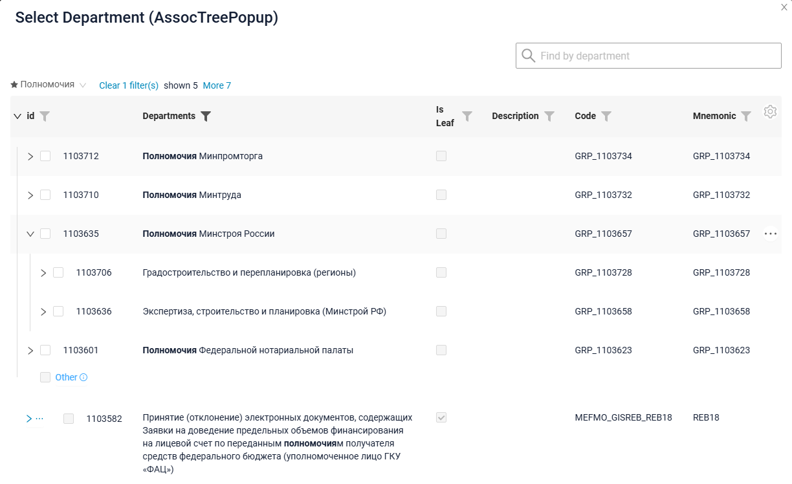

###### How to add?
??? Example
    Add in **options** parameter **pagination** to corresponding **.widget.json**.

    ```
    "pagination": {
      "availableLimitsList": [1, 2, 3]
    }
    ```

    ```json
    --8<--
    {{ external_links.github_raw_doc }}/widgets/property/pagination/availablelimitselist/myEntity3867MultiPickAssocTreePopup.widget.json
    --8<--
    ```

    [:fontawesome-brands-github: GitHub]({{ external_links.github_ui }}/{{ external_links.github_branch }}/src/main/java/org/demo/documentation/widgets/property/pagination/availablelimitselist){:target="_blank"}

The default number of the records requested for a node is defined by the page limit, see [Page limit](/widget/type/property/defaultlimitpage/defaultlimitpage).

```json
--8<--
{{ external_links.github_raw_doc }}/widgets/property/defaultlimitpage/myEntity359AssocPickAssocTreePopup.widget.json
--8<--
```

[:fontawesome-brands-github: GitHub]({{ external_links.github_ui }}/{{ external_links.github_branch }}/src/main/java/org/demo/documentation/widgets/property/defaultlimitpage){:target="_blank"}

#### <a id="searchmodes">Search modes</a>
[:fontawesome-brands-github: GitHub]({{ external_links.github_ui }}/{{ external_links.github_branch }}/src/main/java/org/demo/documentation/widgets/property/filtration/fulltextsearch/forassoc){:target="_blank"}

Filtration and full text search are performed with a standard request. The found records are displayed in one of two modes, defined by **options**.**tree**.**searchModes**:

* `collapse` — the found records are displayed together with the navigation path. The number of the levels of the path shown above a found record is defined by **options**.**tree**.**onFilterApplyNestLevel** (default `0`).
* `hide` — only the found records are displayed, everything else is hidden.

Both modes can be available at the same time, the first item of the array is the active one. The user switches between them.

The panel above the tree shows:

* `Clear N filter(s)` — the number of the applied filters,
* `Shown N` — the number of the displayed records,
* `More M` — the number of the found records that are not displayed yet.

###### How does it look?
=== "collapse"
    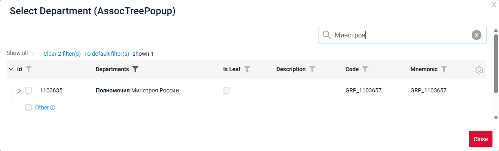
=== "hide"
    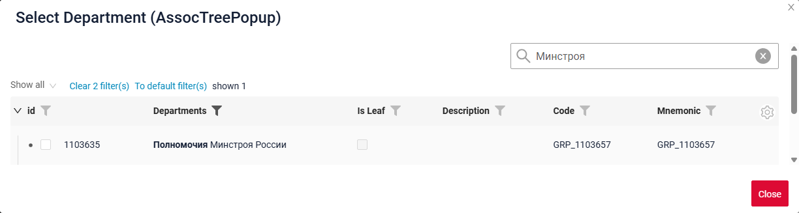

###### How to add?
??? Example
    Add in **options** parameter **fullTextSearch** and parameter **tree** to corresponding **.widget.json**.

    ```
    "tree": {
      "searchModes": ["collapse", "hide"],
      "onFilterApplyNestLevel": 0
    }
    ```

    ```json
    --8<--
    {{ external_links.github_raw_doc }}/widgets/property/filtration/fulltextsearch/forassoc/myEntity3625PickAssocTreePopup.widget.json
    --8<--
    ```

    [:fontawesome-brands-github: GitHub]({{ external_links.github_ui }}/{{ external_links.github_branch }}/src/main/java/org/demo/documentation/widgets/property/filtration/fulltextsearch/forassoc){:target="_blank"}

#### <a id="selectionmodes">Selection modes</a>
[:material-play-circle: Live Sample]({{ external_links.code_samples }}/ui/#/screen/myexample3261/view/myexample3261list){:target="_blank"} ·
[:fontawesome-brands-github: GitHub]({{ external_links.github_ui }}/{{ external_links.github_branch }}/src/main/java/org/demo/documentation/widgets/tree/base/inner){:target="_blank"}

Checkboxes are available both on the nodes and on the leaves of the tree. What exactly the user is allowed to check is defined by **options**.**tree**.**selection**:

* `node` — only the nodes can be checked.
* `leaf` — only the leaves can be checked.
* `nodeAndLeaf` — both the nodes and the leaves can be checked.

!!! info
    The checkbox of the `More` row is always **disabled**: this row is a pagination control, not a record.

**Rule 1.** What the user selected **explicitly** is marked with a **bright** checkmark, and exactly that is sent to the backend. Everything that is selected **indirectly**, as a consequence of an explicit selection, is marked with a **dimmed** checkmark or a **dimmed** square.

The following cases are possible:

* **The user picks the leaves manually.** The identifiers of the picked leaves are sent to the backend. The parent group is marked with a dimmed square, because the group itself is not selected.

* **The user picks a group.** The identifier of the group is sent to the backend. All the children of the group, including the `More` row, become dimmed: they are selected as a part of the group and cannot be selected separately.

* **The user unchecks a child of a selected group.** The selection switches to the manual mode: the group is no longer sent to the backend, instead the identifiers of the remaining children are sent.

!!! info
    Limitation: the selection "the group **minus** N records" cannot be expressed. Such a selection is always transformed into the explicit list of the remaining records.

* **The user checks all the children of a group manually.** This is **not** the same as picking the group itself. The two selections are visually distinguishable, and they behave differently: when new records of that group appear, they are **not** selected in the manual case, while they are a part of the selection when the group itself is picked.

##### Confirmation on page change
**options**.**tree**.**confirms** defines the confirmation dialog shown when the user changes the page while a selection exists:

| Value                | Description                                                                 |
|----------------------|-----------------------------------------------------------------------------|
| `paginationUnselect` | The confirmation is shown when the page is changed and the selection is lost.|
| `paginationSelect`   | The confirmation is shown when the page is changed and the selection is kept.|

The default value is `["paginationUnselect"]`. see more [options.tree](/widget/type/tree/tree/#optionstree)

##### How does it look?
=== "Selection of a group"
    
=== "Manual selection of the children"
    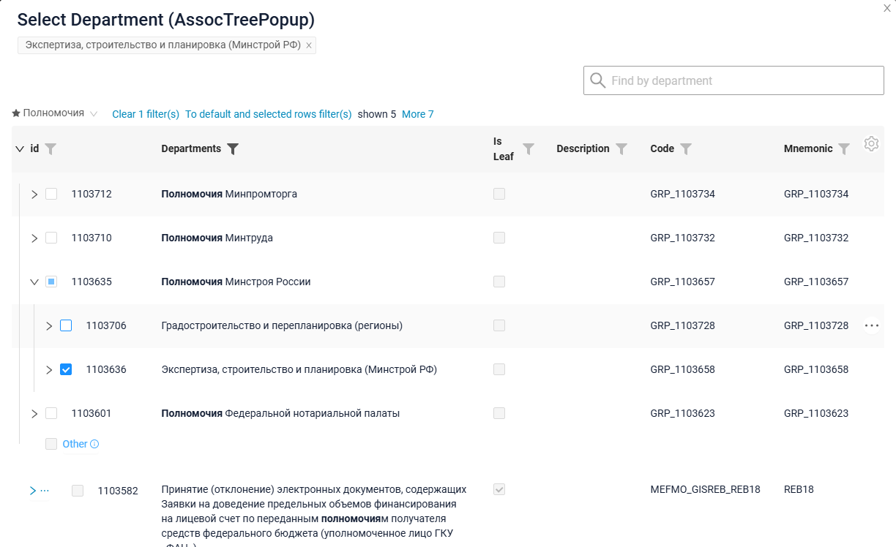
=== "Confirmation on page change"
    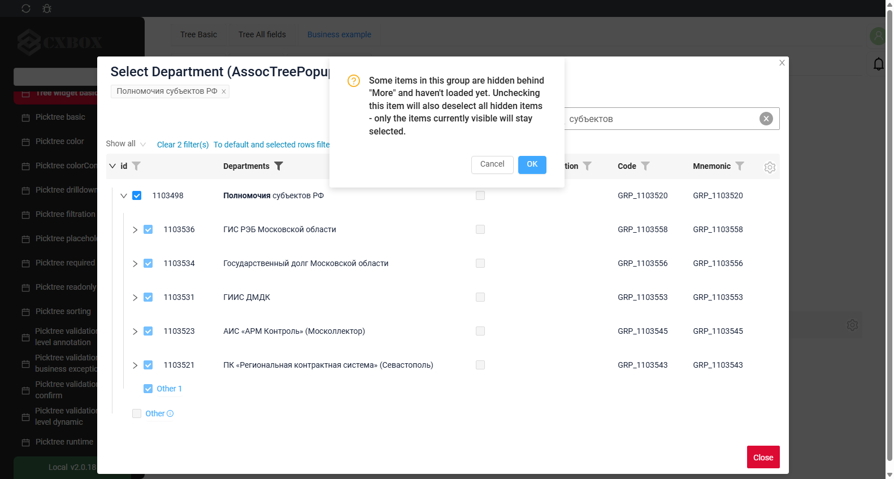

##### How to add?
??? Example
    Add in **options** parameter **tree** to corresponding **.widget.json**.

    ```
    "tree": {
      "selection": "node",
      "confirms": ["paginationUnselect"]
    }
    ```

    ```json
    --8<--
    {{ external_links.github_raw_doc }}/widgets/tree/base/inner/myexample3261AssocTreePopup.widget.json
    --8<--
    ```

    [:material-play-circle: Live Sample]({{ external_links.code_samples }}/ui/#/screen/myexample3261/view/myexample3261list){:target="_blank"} ·
    [:fontawesome-brands-github: GitHub]({{ external_links.github_ui }}/{{ external_links.github_branch }}/src/main/java/org/demo/documentation/widgets/tree/base/inner){:target="_blank"}

!!! info
    The button usage and the `multivalueTree` field usage differ in the way the already selected values are shown.

    On a field with type `multivalueTree` the popup shows the already selected values as **tags** at the top, so the user continues the previous selection.

    The popup opened by a button is not directly tied to a field, so it always opens **from scratch**, without the tags of the already selected values. Add filtering to the opened association in order to exclude the records that have already been added.
