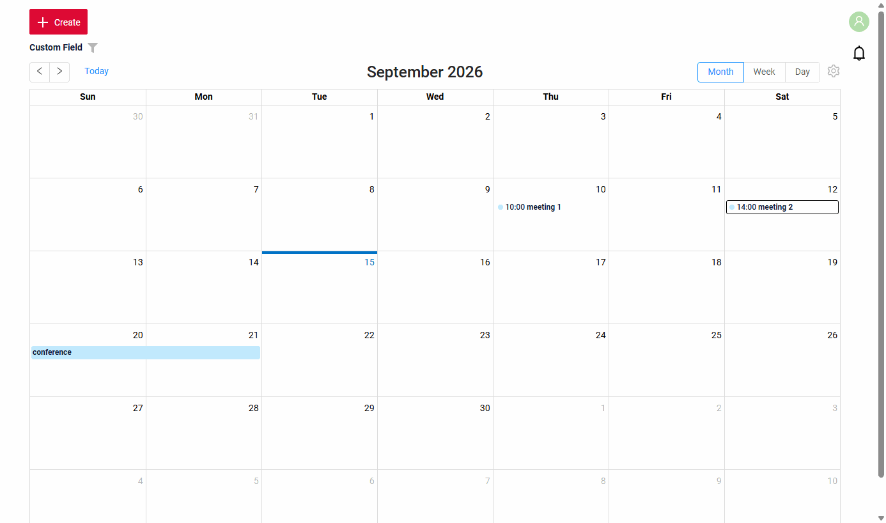
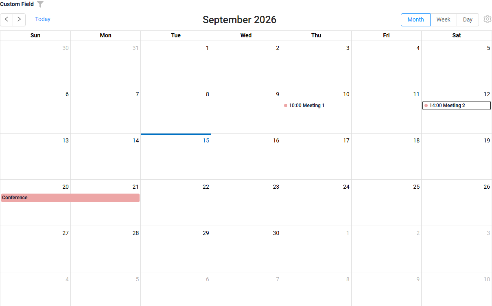
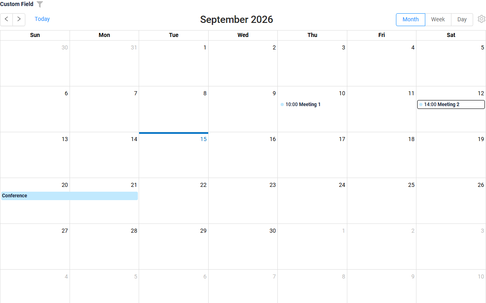
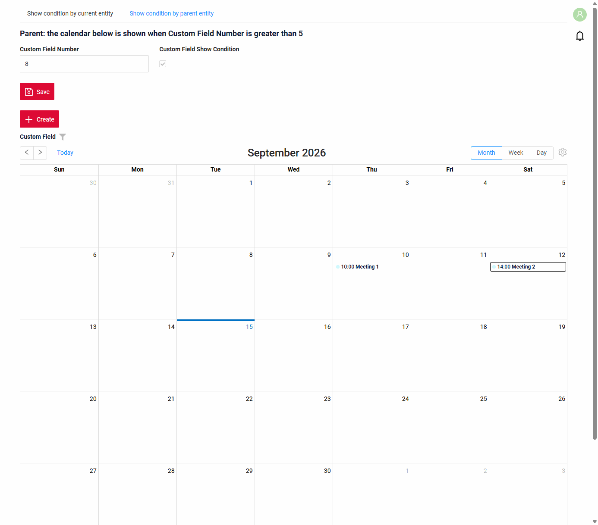
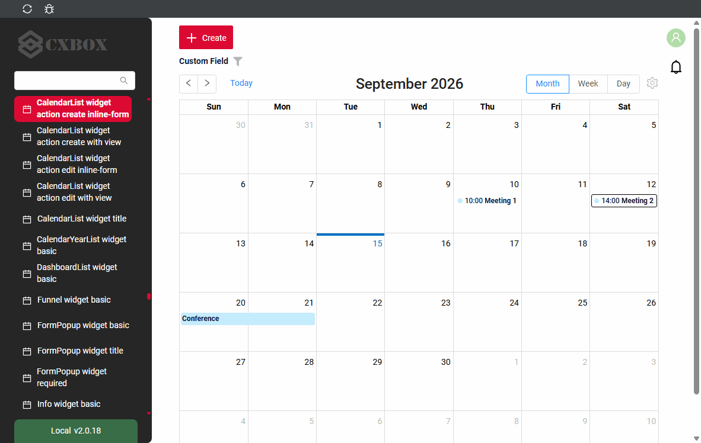
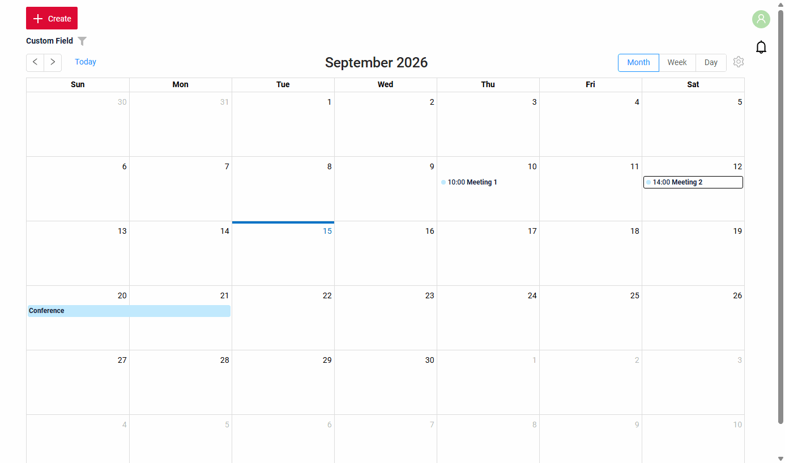
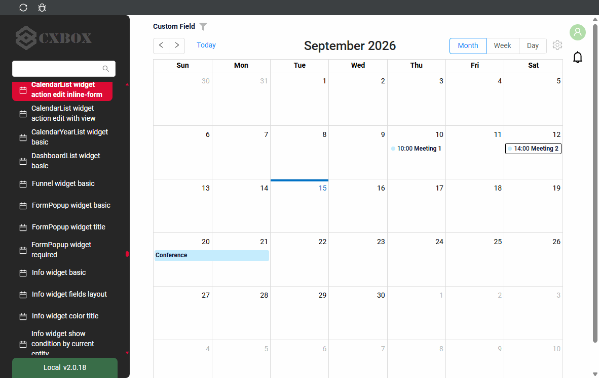
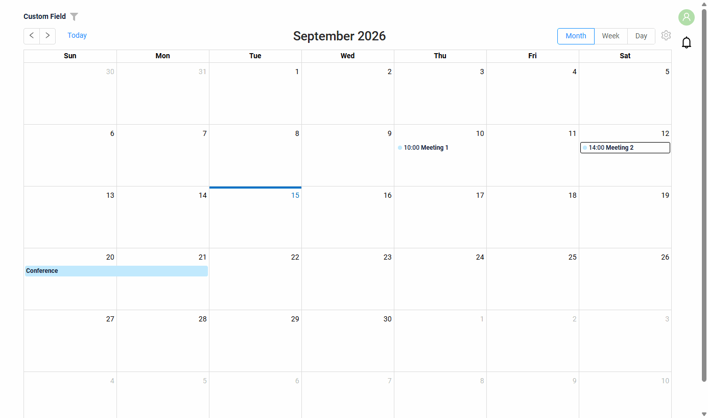
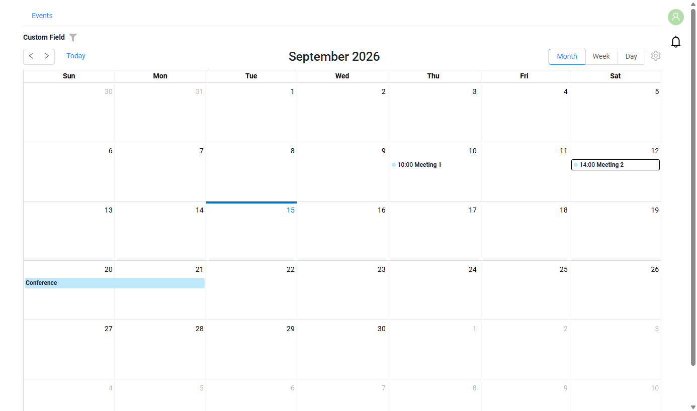
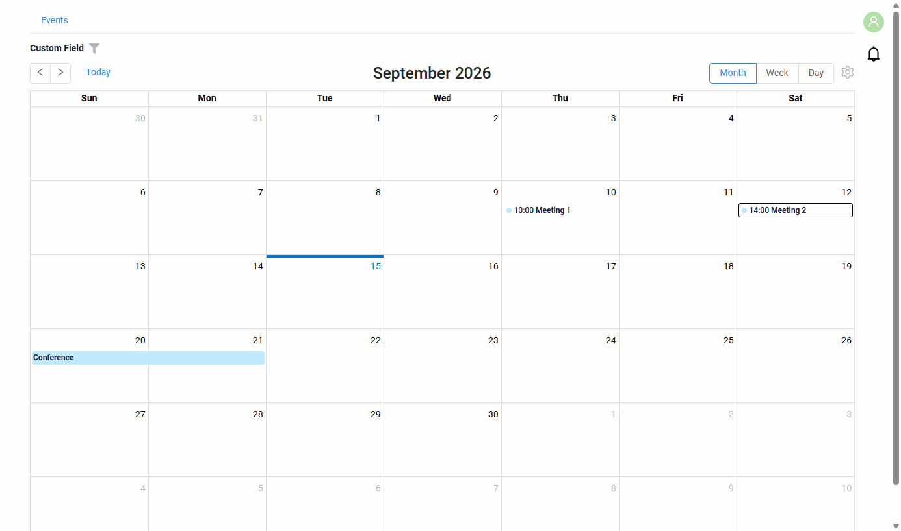

# CalendarList

`CalendarList` widget shows the records as events of a calendar: a month, a week or a day.

## Basics
[:material-play-circle: Live Sample]({{ external_links.code_samples }}/ui/#/screen/myexample5055){:target="_blank"} ·
[:fontawesome-brands-github: GitHub]({{ external_links.github_ui }}/{{ external_links.github_branch }}/src/main/java/org/demo/documentation/widgets/calendarlist/base/events){:target="_blank"}

### How does it look?


A record is shown as an event by three fields of the widget:

* a title field — the value shown in the event;
* a start field and an end field — `dateTime` fields with the period of the event.

**options.calendar**

The fields of the event are set in **options**.**calendar** of **_.widget.json_**.

??? Example

    | Property        | Type   | Default | Description                                               |
    |-----------------|--------|---------|-----------------------------------------------------------|
    | `valueFieldKey` | String | `value` | Name of the field shown as the title of the event.        |
    | `startFieldKey` | String | `start` | Name of the `dateTime` field with the start of the event. |
    | `endFieldKey`   | String | `end`   | Name of the `dateTime` field with the end of the event.   |

!!! info
    The title field can have a drilldown: a click on the title of the event opens the link, a click on the rest of the event opens the edit form. see [Edit](#editwithwidget)

###  <a id="Howtoaddbacis">How to add?</a>
??? Example
    **Step1** Create file **_.widget.json_** with type = **"CalendarList"**. Add the fields of the event and **options.calendar**.
    ```json
    --8<--
    {{ external_links.github_raw_doc }}/widgets/calendarlist/base/events/MyExample5055List.widget.json
    --8<--
    ```

    **Step2** Add widget to corresponding ****_.view.json_** **.
    ```json
    --8<--
    {{ external_links.github_raw_doc }}/widgets/calendarlist/base/events/myexample5055list.view.json
    --8<--
    ```

## <a id="Title">Title</a>
[:material-play-circle: Live Sample]({{ external_links.code_samples }}/ui/#/screen/myexample5066){:target="_blank"} ·
[:fontawesome-brands-github: GitHub]({{ external_links.github_ui }}/{{ external_links.github_branch }}/src/main/java/org/demo/documentation/widgets/calendarlist/title){:target="_blank"}

!!! info
    Title is **not available** in this release: the widget does not show a title.

## <a id="Color">Color</a>
`Color` allows you to specify a color for the events. It is set for the title field of the event (`valueFieldKey`) and can be constant or calculated.

**Calculated color**

[:material-play-circle: Live Sample]({{ external_links.code_samples }}/ui/#/screen/myexample5056/view/myexample5056list){:target="_blank"} ·
[:fontawesome-brands-github: GitHub]({{ external_links.github_ui }}/{{ external_links.github_branch }}/src/main/java/org/demo/documentation/widgets/calendarlist/color){:target="_blank"}

*Calculated color* can be used to change the color of an event dynamically. It changes depending on business logic or data in the application.

**Constant color**

[:material-play-circle: Live Sample]({{ external_links.code_samples }}/ui/#/screen/myexample5056/view/myexample5056listcolorconst){:target="_blank"} ·
[:fontawesome-brands-github: GitHub]({{ external_links.github_ui }}/{{ external_links.github_branch }}/src/main/java/org/demo/documentation/widgets/calendarlist/color){:target="_blank"}

*Constant color* is a fixed color that doesn't change. It remains the same regardless of any factors in the application.

##### How does it look?


##### How to add?
??? Example
    === "Calculated color"

        **Step 1**   Add `custom field for color` to corresponding **DataResponseDTO**. The field can contain a HEX color or be null.
        ```java
        --8<--
        {{ external_links.github_raw_doc }}/widgets/calendarlist/color/MyExample5056DTO.java:colorDTO
        --8<--
        ```

        **Step 2** Add **"bgColorKey"** :  `custom field for color` to the title field of the event in .widget.json.

        ```json
        --8<--
        {{ external_links.github_raw_doc }}/widgets/calendarlist/color/MyExample5056.widget.json
        --8<--
        ```

        [:material-play-circle: Live Sample]({{ external_links.code_samples }}/ui/#/screen/myexample5056/view/myexample5056list){:target="_blank"} ·
        [:fontawesome-brands-github: GitHub]({{ external_links.github_ui }}/{{ external_links.github_branch }}/src/main/java/org/demo/documentation/widgets/calendarlist/color){:target="_blank"}

    === "Constant color"

        Add **"bgColor"** :  `HEX color` to the title field of the event in .widget.json.

        ```json
        --8<--
        {{ external_links.github_raw_doc }}/widgets/calendarlist/color/MyExample5056ColorConst.widget.json
        --8<--
        ```

        [:material-play-circle: Live Sample]({{ external_links.code_samples }}/ui/#/screen/myexample5056/view/myexample5056listcolorconst){:target="_blank"} ·
        [:fontawesome-brands-github: GitHub]({{ external_links.github_ui }}/{{ external_links.github_branch }}/src/main/java/org/demo/documentation/widgets/calendarlist/color){:target="_blank"}

## <a id="bc">Business component</a>
This specifies the business component (BC) to which this widget belongs.
A business component represents a specific part of a system that handles a particular business logic or data.

see more  [Business component](/environment/businesscomponent/businesscomponent/)

## <a id="Showcondition">Show condition</a>

* `no show condition - recommended`: widget always visible

  [:material-play-circle: Live Sample]({{ external_links.code_samples }}/ui/#/screen/myexample5055){:target="_blank"} ·
  [:fontawesome-brands-github: GitHub]({{ external_links.github_ui }}/{{ external_links.github_branch }}/src/main/java/org/demo/documentation/widgets/calendarlist/base/events){:target="_blank"}

* `show condition by current entity`: **not recommended** for the calendar.

  [:material-play-circle: Live Sample]({{ external_links.code_samples }}/ui/#/screen/myexample5057){:target="_blank"} ·
  [:fontawesome-brands-github: GitHub]({{ external_links.github_ui }}/{{ external_links.github_branch }}/src/main/java/org/demo/documentation/widgets/calendarlist/showcondition/bycurrententity){:target="_blank"}

* `show condition by parent entity`: condition can include boolean expression depending on parent entity. Parent field updates will trigger condition recalculation only on save or if field is force active shown on same view

  [:material-play-circle: Live Sample]({{ external_links.code_samples }}/ui/#/screen/myexample5057/view/myexample5059showcond){:target="_blank"} ·
  [:fontawesome-brands-github: GitHub]({{ external_links.github_ui }}/{{ external_links.github_branch }}/src/main/java/org/demo/documentation/widgets/calendarlist/showcondition/byparententity){:target="_blank"}

!!! tips
    It is recommended not to use `Show condition` when possible, because wide usage of this feature makes application hard to support.

#### <a id="howdoesitlook">How does it look?</a>
=== "no show condition"
    
=== "show condition by parent entity"
    

#### <a id="howtoadd">How to add?</a>
??? Example

    === "no show condition"
        see [Basic](#Howtoaddbacis)

    === "show condition by parent entity"
        **Step1** Add **showCondition** to **_.widget.json_**. see more [showCondition](/widget/type/property/showcondition/showcondition)
        ```json
        --8<--
        {{ external_links.github_raw_doc }}/widgets/calendarlist/showcondition/byparententity/MyExample5059Child.widget.json
        --8<--
        ```
        [:material-play-circle: Live Sample]({{ external_links.code_samples }}/ui/#/screen/myexample5057/view/myexample5059showcond){:target="_blank"} ·
        [:fontawesome-brands-github: GitHub]({{ external_links.github_ui }}/{{ external_links.github_branch }}/src/main/java/org/demo/documentation/widgets/calendarlist/showcondition/byparententity){:target="_blank"}

## <a id="fields">Fields</a>
Fields Configuration. The fields array defines the fields of the event (see [options.calendar](#basics)) and the fields available for filtration.

```json
{
    "title": "Custom Field",
    "key": "customField",
    "type": "input"
}
```

* **"title"**

  Description:  Field Title.

  Type: String(optional).

* **"key"**

    Description: Name field to corresponding DataResponseDTO.

    Type: String(required).

* **"type"**

  Description: [Field types](/widget/fields/fieldtypes/)

  Type: String(required).

### How to add?
??? Example

    Add field to **_.widget.json_**.

    ```json
    --8<--
    {{ external_links.github_raw_doc }}/widgets/calendarlist/base/events/MyExample5055List.widget.json
    --8<--
    ```

## <a id="Fieldslayout">Options layout</a>
**options.layout** - no use in this type.

## <a id="actions">Actions</a>
`Actions` show available actions as separate buttons see more [Actions](/features/element/actions/actions).

#### Create
`Create` button enables you to create a new record. There are the methods to create a record:

* Inline: **not available** in this release.

* [Inline-form](#withwidget): You can add data using a form widget in a popup over the calendar. This is the default when `options.create.widget` is set.

* [With view](#withview): You can create a record by navigating to a view.

##### <a id="withwidget">Inline-form</a>
[:material-play-circle: Live Sample]({{ external_links.code_samples }}/ui/#/screen/myexample5061){:target="_blank"} ·
[:fontawesome-brands-github: GitHub]({{ external_links.github_ui }}/{{ external_links.github_branch }}/src/main/java/org/demo/documentation/widgets/calendarlist/actions/create/withwidget){:target="_blank"}

`Create with widget` opens the form widget of `options.create` in a popup over the calendar when the "Create" button is clicked. After filling the information in and clicking "Save", the popup is closed and the new event is shown in the calendar.

`options.create.style`:

* `inlineForm` (default) or `popup`: the form is shown in a popup;
* `none`: no form.

The width of the popup is the `gridWidth` of the form widget in **_.view.json_**, like for the other popup widgets.

###### How does it look?


###### How to add?
??? Example

    **Step1** Add button `create` to corresponding **VersionAwareResponseService**.
    ```java
    --8<--
    {{ external_links.github_raw_doc }}/widgets/calendarlist/actions/create/withwidget/MyExample5061Service.java:getActions
    --8<--
    ```
    **Step2** Add **fields.setEnabled** to corresponding **FieldMetaBuilder**.
    ```java
    --8<--
    {{ external_links.github_raw_doc }}/widgets/calendarlist/actions/create/withwidget/MyExample5061Meta.java:buildRowDependentMeta
    --8<--
    ```

     **Step3** Create widget.json with type `Form` that appears when you click a button
    ```json
    --8<--
    {{ external_links.github_raw_doc }}/widgets/calendarlist/actions/create/withwidget/myEntity5061CreateForm.widget.json
    --8<--
    ```

     **Step4** Add widget.json with type `Form` to corresponding **.view.json**. `gridWidth` is the width of the popup.
    ```json
    --8<--
    {{ external_links.github_raw_doc }}/widgets/calendarlist/actions/create/withwidget/myexample5061list.view.json
    --8<--
    ```

     **Step5** Add button `create` and widget with type `Form` to corresponding **.widget.json**.

    `options`.`create`: Name widget that appears when you click a button

    ```json
    --8<--
    {{ external_links.github_raw_doc }}/widgets/calendarlist/actions/create/withwidget/MyExample5061.widget.json
    --8<--
    ```

    [:material-play-circle: Live Sample]({{ external_links.code_samples }}/ui/#/screen/myexample5061){:target="_blank"} ·
    [:fontawesome-brands-github: GitHub]({{ external_links.github_ui }}/{{ external_links.github_branch }}/src/main/java/org/demo/documentation/widgets/calendarlist/actions/create/withwidget){:target="_blank"}

##### <a id="withview">With view</a>
[:material-play-circle: Live Sample]({{ external_links.code_samples }}/ui/#/screen/myexample5062){:target="_blank"} ·
[:fontawesome-brands-github: GitHub]({{ external_links.github_ui }}/{{ external_links.github_branch }}/src/main/java/org/demo/documentation/widgets/calendarlist/actions/create/newview){:target="_blank"}

With `Create with view`, clicking the "Create" button opens a separate view that displays only the data entry form. After completing the form and saving, the system returns to the calendar with the new event.

###### How does it look?


###### How to add?
??? Example

    **Step1** Add button `create` to corresponding **VersionAwareResponseService**.
    ```java
    --8<--
    {{ external_links.github_raw_doc }}/widgets/calendarlist/actions/create/newview/MyExample5062Service.java:getActions
    --8<--
    ```
     **Step2** Add **PostAction.drillDown** to method **doCreateEntity** to corresponding **VersionAwareResponseService**.
    ```java
    --8<--
    {{ external_links.github_raw_doc }}/widgets/calendarlist/actions/create/newview/MyExample5062Service.java:doCreateEntity
    --8<--
    ```
    **Step3** Add button `create` to corresponding **.widget.json**.
    ```json
    --8<--
    {{ external_links.github_raw_doc }}/widgets/calendarlist/actions/create/newview/MyExample5062.widget.json
    --8<--
    ```

    [:material-play-circle: Live Sample]({{ external_links.code_samples }}/ui/#/screen/myexample5062){:target="_blank"} ·
    [:fontawesome-brands-github: GitHub]({{ external_links.github_ui }}/{{ external_links.github_branch }}/src/main/java/org/demo/documentation/widgets/calendarlist/actions/create/newview){:target="_blank"}

#### Edit
`Edit` enables you to change the field value. There are the methods to edit a record:

* Inline edit: **not available** in this release.

* [Inline-form](#editwithwidget): A click on the event opens the form widget in a popover next to the event.

* [With view](#editwithview): You can edit a record by navigating to a view.

##### <a id="editwithwidget">Inline-form</a>
[:material-play-circle: Live Sample]({{ external_links.code_samples }}/ui/#/screen/myexample5064){:target="_blank"} ·
[:fontawesome-brands-github: GitHub]({{ external_links.github_ui }}/{{ external_links.github_branch }}/src/main/java/org/demo/documentation/widgets/calendarlist/actions/edit/withwidget){:target="_blank"}

`Edit with widget` opens the form widget of `options.edit` in a popover when clicking on the event. The actions of the record are in the three-dot menu of the form.
`options.edit.style` `inlineForm` (default) and `popup` both show the popover. The width of the popover is the `gridWidth` of the form widget in **_.view.json_**.

###### How does it look?


###### How to add?
??? Example

    **Step1** Add button `save` to corresponding **VersionAwareResponseService**.
    ```java
    --8<--
    {{ external_links.github_raw_doc }}/widgets/calendarlist/actions/edit/withwidget/MyExample5064Service.java:getActions
    --8<--
    ```

    **Step2** Add **fields.setEnabled** to corresponding **FieldMetaBuilder**.
    ```java
    --8<--
    {{ external_links.github_raw_doc }}/widgets/calendarlist/actions/edit/withwidget/MyExample5064Meta.java:buildRowDependentMeta
    --8<--
    ```

    **Step3**  Create widget.json with type `Form` that appears when you click an event
    ```json
    --8<--
    {{ external_links.github_raw_doc }}/widgets/calendarlist/actions/edit/withwidget/myEntity5064EditForm.widget.json
    --8<--
    ```

     **Step4** Add widget.json with type `Form` to corresponding **.view.json**. `gridWidth` is the width of the popover.
    ```json
    --8<--
    {{ external_links.github_raw_doc }}/widgets/calendarlist/actions/edit/withwidget/myexample5064list.view.json
    --8<--
    ```

     **Step5** Add widget with type `Form` to corresponding **.widget.json**.

    `options`.`edit`: Name widget that appears when you click an event

    ```json
    --8<--
    {{ external_links.github_raw_doc }}/widgets/calendarlist/actions/edit/withwidget/MyExample5064.widget.json
    --8<--
    ```

    [:material-play-circle: Live Sample]({{ external_links.code_samples }}/ui/#/screen/myexample5064){:target="_blank"} ·
    [:fontawesome-brands-github: GitHub]({{ external_links.github_ui }}/{{ external_links.github_branch }}/src/main/java/org/demo/documentation/widgets/calendarlist/actions/edit/withwidget){:target="_blank"}

##### <a id="editwithview">With view</a>
[:material-play-circle: Live Sample]({{ external_links.code_samples }}/ui/#/screen/myexample5065){:target="_blank"} ·
[:fontawesome-brands-github: GitHub]({{ external_links.github_ui }}/{{ external_links.github_branch }}/src/main/java/org/demo/documentation/widgets/calendarlist/actions/edit/newview){:target="_blank"}

With `Edit with view`, you can edit the entity from a separate view that displays only the data entry form. Click on the "Edit" option in the three-dot menu of the event.

###### How does it look?


###### How to add?
??? Example

    **Step1** Add action *edit* to corresponding **VersionAwareResponseService**.

    Add **PostAction.drillDown** to method *edit*

    ```java
    --8<--
    {{ external_links.github_raw_doc }}/widgets/calendarlist/actions/edit/newview/MyExample5065Service.java:getActions
    --8<--
    ```
    **Step2** Add button or group button to corresponding **.widget.json**.

    ```json
    --8<--
    {{ external_links.github_raw_doc }}/widgets/calendarlist/actions/edit/newview/MyExample5065.widget.json
    --8<--
    ```
    [:material-play-circle: Live Sample]({{ external_links.code_samples }}/ui/#/screen/myexample5065){:target="_blank"} ·
    [:fontawesome-brands-github: GitHub]({{ external_links.github_ui }}/{{ external_links.github_branch }}/src/main/java/org/demo/documentation/widgets/calendarlist/actions/edit/newview){:target="_blank"}

### Additional properties
#### Customization of displayed columns
_not applicable_: the calendar has no columns.

#### Filtration
The fields of the widget with a filter are shown above the calendar; the start and the end fields of the event are not shown there, the shown period filters the records by them.



see more  [Fields](/widget/type/property/filtration/filtration/)

#### <a id="pagination">Pagination</a>
The periods of the calendar are its pages: the arrows go to the next and the previous month, week or day, "Today" returns to the current period.
The records of the shown period are requested with the filter by the start and the end fields.



#### <a id="monthweekday">Month / Week / Day</a>
The buttons "Month", "Week", "Day" of the toolbar show the events of a month, a week or a day:

* `Month` (default): the events of the month by days; a day shows up to 5 events, the others are behind "+N more";
* `Week`, `Day`: the events are placed by hours.


