# CardList

`CardList` widget shows records as file cards in rows. Each card shows a preview of the record file, a title, a description and a status.
The user turns the pages, selects a card with a click and opens, edits and deletes files right on the cards.

!!! info "CardList and CardCarouselList"
    [CardList](/widget/type/cardlist/cardlist) and [CardCarouselList](/widget/type/cardcarousellist/cardcarousellist) show the same cards and are set up the same way. Both load one page of records at a time: 5 by default, set by the [page limit](/widget/type/property/defaultlimitpage/defaultlimitpage).

    * **CardList**: any number of records. The page buttons below the cards open the next pages.
    * **CardCarouselList**: only the records of the first page. The arrows scroll the cards of this page, there is no next page. To show all records, set the page limit to their number, up to 20: the whole page is loaded at once.

## Basics
[:material-play-circle: Live Sample]({{ external_links.code_samples }}/ui/#/screen/myexample5300){:target="_blank"} ·
[:fontawesome-brands-github: GitHub]({{ external_links.github_ui }}/{{ external_links.github_branch }}/src/main/java/org/demo/documentation/widgets/cardlist/base){:target="_blank"}

### How does it look?
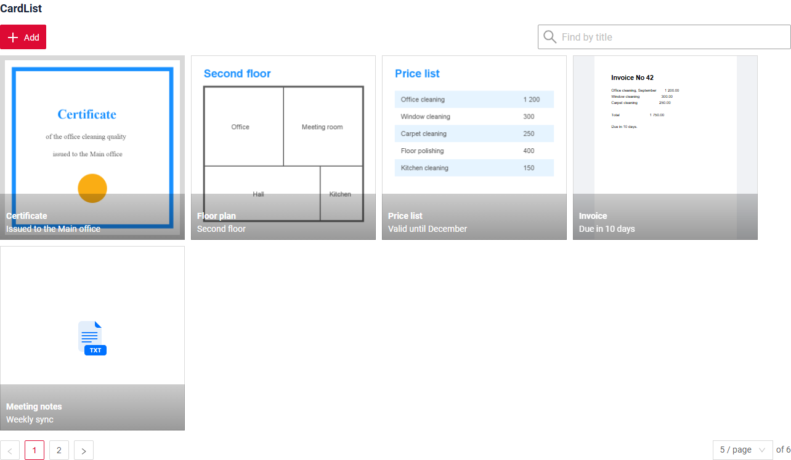

The widget needs one field of type [fileUpload](/widget/fields/field/fileUpload/fileUpload/). A card shows this file.
Without other settings the card title is the file name. In the sample the title and the description come from fields, see [Card options](#cardoptions).

* One card is one record of the business component.
* The cards fill the width of the widget and go on in the next row. The pagination under the cards turns the pages, see [Pagination](#pagination).
* A click on a card makes it the current record.

###  <a id="Howtoaddbacis">How to add?</a>
??? Example
    **Step1** Create file **_.widget.json_** with type = **"CardList"**.
    Add a field with type `fileUpload` and fields for the title and the description. Set them in `options.card`. see more [Fields](#fields)
    ```json
    --8<--
    {{ external_links.github_raw_doc }}/widgets/cardlist/base/MyExample5300CardList.widget.json
    --8<--
    ```

    **Step2** Add widget to corresponding ****_.view.json_** **.

    ```json
    --8<--
    {{ external_links.github_raw_doc }}/widgets/cardlist/base/myexample5300list.view.json
    --8<--
    ```

## Main visual parts
[:material-play-circle: Live Sample]({{ external_links.code_samples }}/ui/#/screen/myexample5300){:target="_blank"} ·
[:fontawesome-brands-github: GitHub]({{ external_links.github_ui }}/{{ external_links.github_branch }}/src/main/java/org/demo/documentation/widgets/cardlist/base){:target="_blank"}

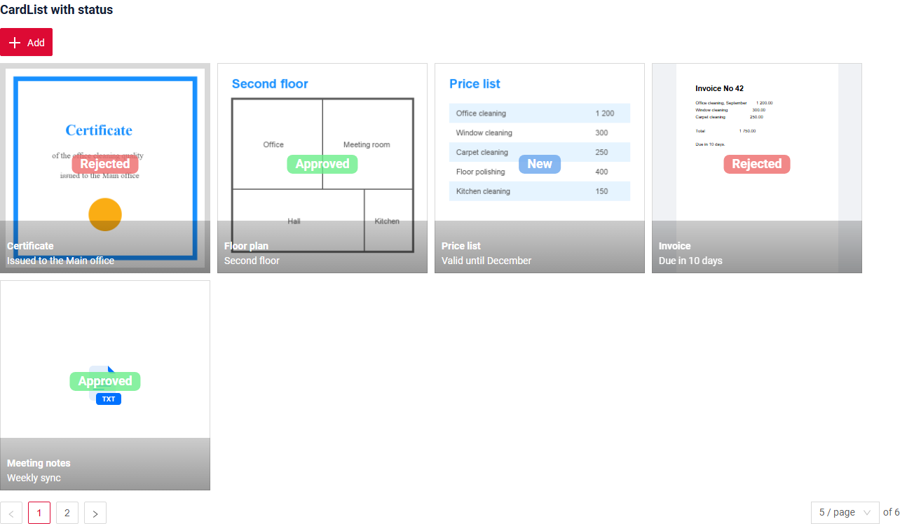

* `preview` - the file of the fileUpload field. see [Preview](#preview)
* `status` - the value of the first **dictionary** field, in the middle of the card. see [Status](#status)
* `title` - the file name or a field from `titleFieldKey`. see [Card options](#cardoptions)
* `description` - a field from `descriptionFieldKey`, under the title. see [Card options](#cardoptions)
* `actions` - record actions as icons. They are shown when the mouse is over the card. see [Actions](#actions)
* `pagination` - turns the pages of the cards. see [Pagination](#pagination)
* `read widget` - the file of the selected card, large, above the cards. see [Read widget](#read)

## <a id="Title">Title</a>
[:material-play-circle: Live Sample]({{ external_links.code_samples }}/ui/#/screen/myexample5301){:target="_blank"} ·
[:fontawesome-brands-github: GitHub]({{ external_links.github_ui }}/{{ external_links.github_branch }}/src/main/java/org/demo/documentation/widgets/cardlist/title){:target="_blank"}

### Title Basic
`Title` for widget (optional)

There are types of:

* `constant title`: shows constant text.
* `constant title empty`: if you want to visually connect widgets by  them to be placed one under another

#### How does it look?
=== "Constant title"
    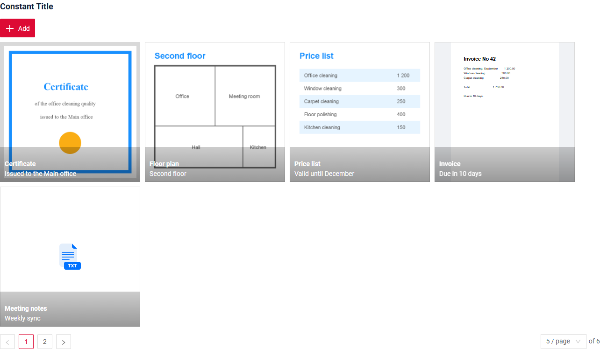
=== "Constant title empty"
    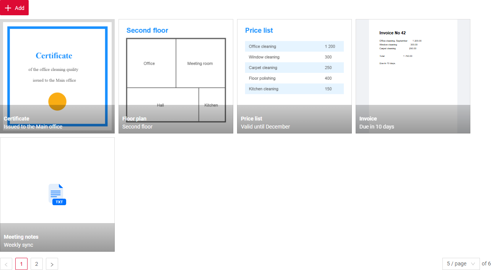

#### How to add?
??? Example
    === "Constant title"
        **Step1** Add name for **title** to **_.widget.json_**.
        ```json
        --8<--
        {{ external_links.github_raw_doc }}/widgets/cardlist/title/MyExample5301CardList.widget.json
        --8<--
        ```
        [:material-play-circle: Live Sample]({{ external_links.code_samples }}/ui/#/screen/myexample5301/view/myexample5301title){:target="_blank"} ·
        [:fontawesome-brands-github: GitHub]({{ external_links.github_ui }}/{{ external_links.github_branch }}/src/main/java/org/demo/documentation/widgets/cardlist/title){:target="_blank"}

    === "Constant title empty"
        **Step1** Delete parameter **title** to **_.widget.json_**.
        ```json
        --8<--
        {{ external_links.github_raw_doc }}/widgets/cardlist/title/MyExample5301EmptyTitle.widget.json
        --8<--
        ```
        [:material-play-circle: Live Sample]({{ external_links.code_samples }}/ui/#/screen/myexample5301/view/myexample5301emptytitle){:target="_blank"} ·
        [:fontawesome-brands-github: GitHub]({{ external_links.github_ui }}/{{ external_links.github_branch }}/src/main/java/org/demo/documentation/widgets/cardlist/title){:target="_blank"}

### Title Color
`Title Color` allows you to specify a color for a title. It can be constant or calculated.
The title shows field values of the current record, that is of the selected card.

**Constant color**

[:material-play-circle: Live Sample]({{ external_links.code_samples }}/ui/#/screen/myexample5302/view/myexample5302colorconst){:target="_blank"} ·
[:fontawesome-brands-github: GitHub]({{ external_links.github_ui }}/{{ external_links.github_branch }}/src/main/java/org/demo/documentation/widgets/cardlist/colortitle){:target="_blank"}

*Constant color* is a fixed color that doesn't change. It remains the same regardless of any factors in the application.

**Calculated color**

[:material-play-circle: Live Sample]({{ external_links.code_samples }}/ui/#/screen/myexample5302/view/myexample5302color){:target="_blank"} ·
[:fontawesome-brands-github: GitHub]({{ external_links.github_ui }}/{{ external_links.github_branch }}/src/main/java/org/demo/documentation/widgets/cardlist/colortitle){:target="_blank"}

*Calculated color* can be used to change a title color dynamically. It changes depending on business logic or data in the application.

!!! info
    Title colorization is **applicable** to the following [fields](/widget/fields/fieldtypes/): date, dateTime, dateTimeWithSeconds, number, money, percent, time, input, text, dictionary, radio, checkbox, pickList, inlinePickList, multivalue, multivalueHover.

##### How does it look?
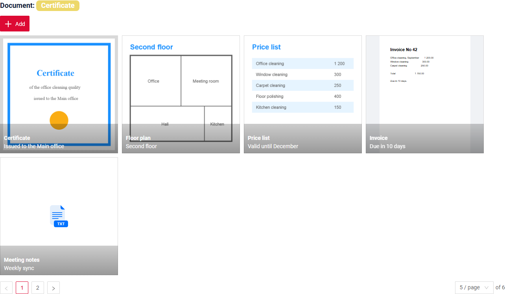

##### How to add?
??? Example
    === "Calculated color"

        **Step 1**   Add `custom field for color` to corresponding **DataResponseDTO**. The field can contain a HEX color or be null.
        ```java
        --8<--
        {{ external_links.github_raw_doc }}/widgets/cardlist/colortitle/MyExample5302DTO.java:colorDTO
        --8<--
        ```

        **Step 2** Add **"bgColorKey"** :  `custom field for color` and  to .widget.json.

        Add in `title` field with `${customField}`

        ```json
        --8<--
        {{ external_links.github_raw_doc }}/widgets/cardlist/colortitle/MyExample5302CardList.widget.json
        --8<--
        ```

        [:material-play-circle: Live Sample]({{ external_links.code_samples }}/ui/#/screen/myexample5302/view/myexample5302color){:target="_blank"} ·
        [:fontawesome-brands-github: GitHub]({{ external_links.github_ui }}/{{ external_links.github_branch }}/src/main/java/org/demo/documentation/widgets/cardlist/colortitle){:target="_blank"}

    === "Constant color"

        Add **"bgColor"** :  `HEX color`  to .widget.json.

        Add in `title` field with `${customField}`

        ```json
        --8<--
        {{ external_links.github_raw_doc }}/widgets/cardlist/colortitle/MyExample5302ColorConst.widget.json
        --8<--
        ```

        [:material-play-circle: Live Sample]({{ external_links.code_samples }}/ui/#/screen/myexample5302/view/myexample5302colorconst){:target="_blank"} ·
        [:fontawesome-brands-github: GitHub]({{ external_links.github_ui }}/{{ external_links.github_branch }}/src/main/java/org/demo/documentation/widgets/cardlist/colortitle){:target="_blank"}

## <a id="bc">Business component</a>
This specifies the business component (BC) to which this form belongs.
A business component represents a specific part of a system that handles a particular business logic or data.

see more  [Business component](/environment/businesscomponent/businesscomponent/)

## <a id="Showcondition">Show condition</a>

* `no show condition - recommended`: widget always visible

  [:material-play-circle: Live Sample]({{ external_links.code_samples }}/ui/#/screen/myexample5300){:target="_blank"} ·
  [:fontawesome-brands-github: GitHub]({{ external_links.github_ui }}/{{ external_links.github_branch }}/src/main/java/org/demo/documentation/widgets/cardlist/base){:target="_blank"}

* `show condition by current entity`: **not recommended**. The condition is calculated by the selected card, so the widget can hide itself when the user selects another card.

* `show condition by parent entity`: condition can include boolean expression depending on parent entity. Parent field updates will trigger condition recalculation only on save or if field is force active shown on same view

  [:material-play-circle: Live Sample]({{ external_links.code_samples }}/ui/#/screen/myexample5303){:target="_blank"} ·
  [:fontawesome-brands-github: GitHub]({{ external_links.github_ui }}/{{ external_links.github_branch }}/src/main/java/org/demo/documentation/widgets/cardlist/showcondition){:target="_blank"}

!!! tips
    It is recommended not to use `Show condition` when possible, because wide usage of this feature makes application hard to support.

#### <a id="howdoesitlook">How does it look?</a>
=== "no show condition"
    
=== "show condition by parent entity"
    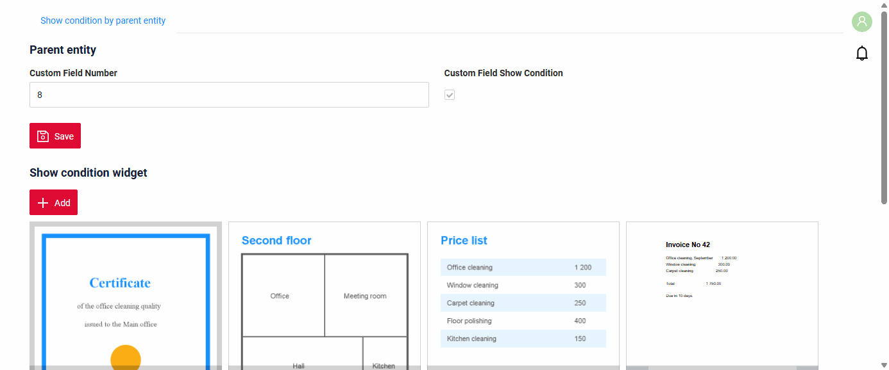

#### <a id="howtoadd">How to add?</a>
??? Example

    === "no show condition"
        see [Basic](#Howtoaddbacis)

    === "show condition by parent entity"
        **Step1** Add **showCondition** to **_.widget.json_**. see more [showCondition](/widget/type/property/showcondition/showcondition)
        ```json
        --8<--
        {{ external_links.github_raw_doc }}/widgets/cardlist/showcondition/MyExample5313CardList.widget.json
        --8<--
        ```

## <a id="fields">Fields</a>
Fields Configuration. The fields array defines the fields used by the cards.

```json
{
    "title": "Document",
    "key": "document",
    "type": "fileUpload",
    "fileIdKey": "documentId",
    "preview": {
        "enabled": true,
        "mode": "inline"
    }
}
```

* **"title"**

  Description:  Field Title.

  Type: String(optional).

* **"key"**

    Description: Name field to corresponding DataResponseDTO.

    Type: String(required).

* **"type"**

  Description: [Field types](/widget/fields/fieldtypes/)

  Type: String(required).

The widget uses only these fields:

| Field | Where it is shown |
|---|---|
| **fileUpload** | preview of the card; the first fileUpload field or the field from `valueFieldKey` |
| any field from `titleFieldKey` | title of the card |
| any field from `descriptionFieldKey` | description of the card |
| the first **dictionary** field | status of the card |

Other fields are not shown on the card. They can be used in the create and edit form.

### How to add?
??? Example
    Add field to **_.widget.json_**.

      ```json
         --8<--
         {{ external_links.github_raw_doc }}/widgets/cardlist/base/MyExample5300CardList.widget.json
         --8<--
      ```

## <a id="Fieldslayout">Options layout</a>
_not applicable_

## <a id="actions">Actions</a>
`Actions` show available actions as separate buttons see more [Actions](/features/element/actions/actions).

Record actions are shown as icons on the card. The widget actions (for example **Add**) are shown above the cards.

!!! info
    All record actions of the service are shown on the card, **Save** and **Cancel** too.
    Leave only the needed ones with **actionGroups**: `"actionGroups": {"include": ["create", "delete"]}`.

### Create
[:material-play-circle: Live Sample]({{ external_links.code_samples }}/ui/#/screen/myexample5300){:target="_blank"} ·
[:fontawesome-brands-github: GitHub]({{ external_links.github_ui }}/{{ external_links.github_branch }}/src/main/java/org/demo/documentation/widgets/cardlist/base){:target="_blank"}

`Create` button enables you to create a new card by clicking the `Add` button. The file popup opens with a form under the file: the user uploads a file, fills the fields and saves the record.

* `Inline`: **not applicable**: an empty card has no place to upload a file.
* `With widget`: **Add** opens a popup with an empty file preview and the form from `options.create`. **Save** creates the record, **Cancel** removes the new card.
* `With view`: **not applicable**

!!! warning
    The form must have type **Form**. A **FormPopup** is not shown in the popup.

#### How does it look?
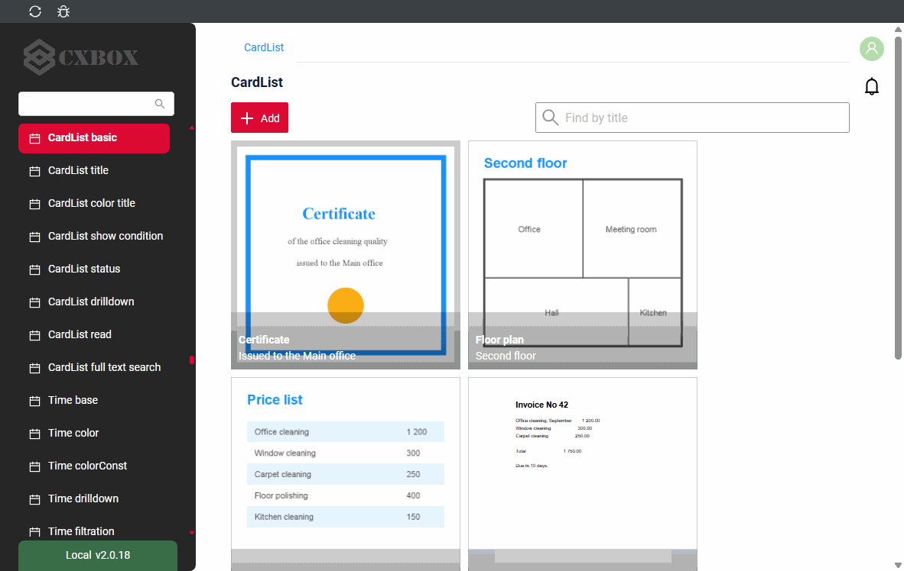

#### How to add?
??? Example
    **Step 1** Add action create to corresponding **VersionAwareResponseService**.
    ```java
    --8<--
    {{ external_links.github_raw_doc }}/widgets/cardlist/base/MyExample5300Service.java:getActions
    --8<--
    ```

    **Step 2** Create a Form widget for the popup.
    ```json
    --8<--
    {{ external_links.github_raw_doc }}/widgets/cardlist/base/MyExample5300Form.widget.json
    --8<--
    ```

    **Step 3** Add **options.create** and **options.edit** with `"style": "popup"` to the CardList widget.
    ```json
    --8<--
    {{ external_links.github_raw_doc }}/widgets/cardlist/base/MyExample5300CardList.widget.json
    --8<--
    ```

    **Step 4** Add both widgets to the **_.view.json_**.
    ```json
    --8<--
    {{ external_links.github_raw_doc }}/widgets/cardlist/base/myexample5300list.view.json
    --8<--
    ```

### Edit
[:material-play-circle: Live Sample]({{ external_links.code_samples }}/ui/#/screen/myexample5300){:target="_blank"} ·
[:fontawesome-brands-github: GitHub]({{ external_links.github_ui }}/{{ external_links.github_branch }}/src/main/java/org/demo/documentation/widgets/cardlist/base){:target="_blank"}

With `options.edit` the card has the **edit** icon. It opens a popup with the file and the form under it. **Save** saves the record and closes the popup.
Arrows at the bottom of the popup move to the previous or the next card.

Without `options.edit` the card has the **eye** icon. It opens the file in a popup for viewing.

#### How does it look?
=== "With options.edit"
    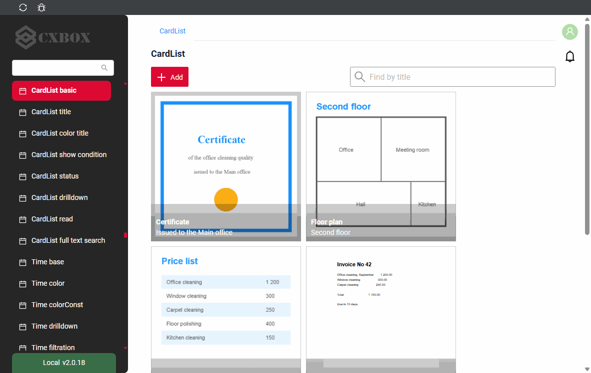
=== "Without options.edit"
    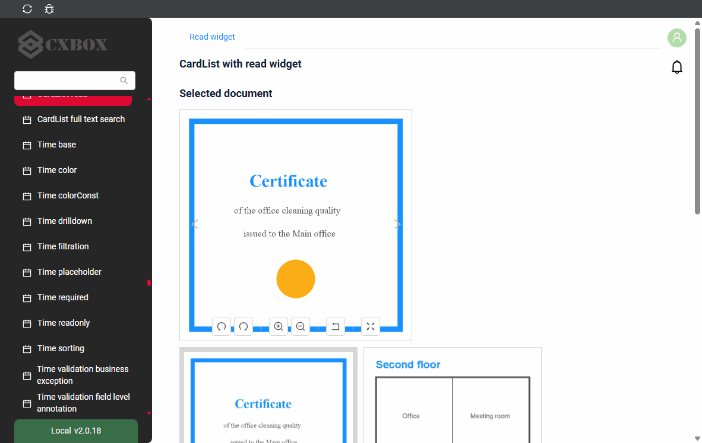

#### How to add?
??? Example
    see [Create](#create), **Step 2** - **Step 4**.

### Delete
[:material-play-circle: Live Sample]({{ external_links.code_samples }}/ui/#/screen/myexample5300){:target="_blank"} ·
[:fontawesome-brands-github: GitHub]({{ external_links.github_ui }}/{{ external_links.github_branch }}/src/main/java/org/demo/documentation/widgets/cardlist/base){:target="_blank"}

The **delete** icon deletes the record at once, like in [List](/widget/type/list/list/).

#### How does it look?
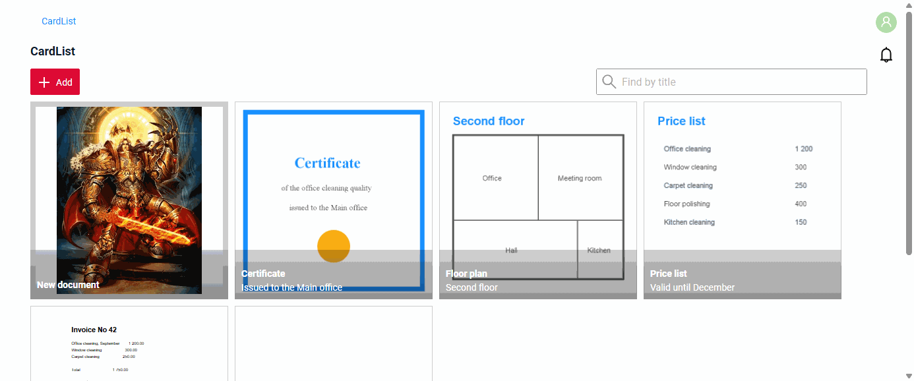

#### How to add?
??? Example
    Add action delete to corresponding **VersionAwareResponseService**.
    ```java
    --8<--
    {{ external_links.github_raw_doc }}/widgets/cardlist/base/MyExample5300Service.java:getActions
    --8<--
    ```

## Additional properties
### <a id="cardoptions">Card options</a>
[:material-play-circle: Live Sample]({{ external_links.code_samples }}/ui/#/screen/myexample5300){:target="_blank"} ·
[:fontawesome-brands-github: GitHub]({{ external_links.github_ui }}/{{ external_links.github_branch }}/src/main/java/org/demo/documentation/widgets/cardlist/base){:target="_blank"}

`options.card` sets which fields are shown on the card. All keys are optional.

| Key | What it sets | Default |
|---|---|---|
| `valueFieldKey` | fileUpload field of the card | the first fileUpload field |
| `titleFieldKey` | field for the title | the file name |
| `descriptionFieldKey` | field for the description | no description |

With a description the title and the description are cut to one line. Without a description a long title wraps to the next lines.

#### How to add?
??? Example
    Add **options.card** to **_.widget.json_**.
    ```json
    --8<--
    {{ external_links.github_raw_doc }}/widgets/cardlist/base/MyExample5300CardList.widget.json
    --8<--
    ```

### <a id="cardsize">Card size</a>
[:material-play-circle: Live Sample]({{ external_links.code_samples }}/ui/#/screen/myexample5300){:target="_blank"} ·
[:fontawesome-brands-github: GitHub]({{ external_links.github_ui }}/{{ external_links.github_branch }}/src/main/java/org/demo/documentation/widgets/cardlist/base){:target="_blank"}

The size of a card is set on the fileUpload field of the card:

* `width`: the width of the card in pixels. Default: 300.
* `minRows`: the height of the card in rows of 40 pixels. By default the card is square.

A row has as many cards as fit into the width of the widget, the rest go to the next rows.

### <a id="preview">Preview</a>
[:material-play-circle: Live Sample]({{ external_links.code_samples }}/ui/#/screen/myexample5300){:target="_blank"} ·
[:fontawesome-brands-github: GitHub]({{ external_links.github_ui }}/{{ external_links.github_branch }}/src/main/java/org/demo/documentation/widgets/cardlist/base){:target="_blank"}

The card shows a preview of the file when `preview` of the fileUpload field has `"enabled": true`: a picture or the first page of a PDF. Other files are shown with the icon of their type.

* Only `"mode": "inline"` is supported. Other modes also work as inline and give a warning in the browser console.
* Without `preview` or with `"enabled": false` the card shows only the icon of the file type.

#### How to add?
??? Example
    Add **preview** with `"enabled": true` and `"mode": "inline"` to the fileUpload field in **_.widget.json_**.
    ```json
    --8<--
    {{ external_links.github_raw_doc }}/widgets/cardlist/base/MyExample5300CardList.widget.json
    --8<--
    ```

### <a id="status">Status</a>
[:material-play-circle: Live Sample]({{ external_links.code_samples }}/ui/#/screen/myexample5305){:target="_blank"} ·
[:fontawesome-brands-github: GitHub]({{ external_links.github_ui }}/{{ external_links.github_branch }}/src/main/java/org/demo/documentation/widgets/cardlist/status){:target="_blank"}

`Status` shows the value of a dictionary field in the middle of the card, over the preview. The color of the status is set like the [title color](#Title): constant `bgColor` or calculated `bgColorKey` of the dictionary field.

!!! info
    The widget takes the first field with type `dictionary`. There is no parameter to choose another dictionary field.

#### How does it look?


#### How to add?
??? Example
    **Step 1** Add a dictionary field and a field for its color to corresponding **DataResponseDTO**.
    ```java
    --8<--
    {{ external_links.github_raw_doc }}/widgets/cardlist/status/MyExample5305DTO.java:statusDTO
    --8<--
    ```

    **Step 2** Add the dictionary field with **"bgColorKey"** to **_.widget.json_**.
    ```json
    --8<--
    {{ external_links.github_raw_doc }}/widgets/cardlist/status/MyExample5305CardList.widget.json
    --8<--
    ```

### <a id="drilldown">DrillDown</a>
[:material-play-circle: Live Sample]({{ external_links.code_samples }}/ui/#/screen/myexample5306){:target="_blank"} ·
[:fontawesome-brands-github: GitHub]({{ external_links.github_ui }}/{{ external_links.github_branch }}/src/main/java/org/demo/documentation/widgets/cardlist/drilldown){:target="_blank"}

`DrillDown` allows you to navigate to another view from a card.

* The card title gets a link icon. A click on the title opens the target view.
* A click on other parts of the card (the preview, the description, the empty space) only selects the card, it does not open the link.
* The target view is calculated for each card, so every card can open its own record or its own view. In the sample the title opens the form of the record of the card.

#### How does it look?
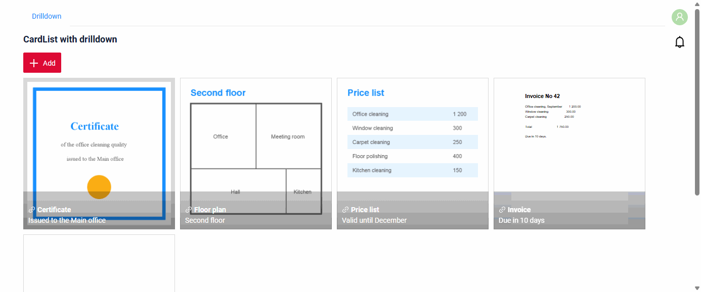

#### How to add?
??? Example
    `Step 1` Add **"drillDown": true** to the fileUpload field of the card in **_.widget.json_**.
    ```json
    --8<--
    {{ external_links.github_raw_doc }}/widgets/cardlist/drilldown/MyExample5306CardList.widget.json
    --8<--
    ```

    `Step 2` Add **fields.setDrilldown** for the same fileUpload field to corresponding **FieldMetaBuilder**. The link is built for the record of each card.
    ```java
    --8<--
    {{ external_links.github_raw_doc }}/widgets/cardlist/drilldown/MyExample5306Meta.java:drilldown
    --8<--
    ```

    [:material-play-circle: Live Sample]({{ external_links.code_samples }}/ui/#/screen/myexample5306){:target="_blank"} ·
    [:fontawesome-brands-github: GitHub]({{ external_links.github_ui }}/{{ external_links.github_branch }}/src/main/java/org/demo/documentation/widgets/cardlist/drilldown){:target="_blank"}

### <a id="read">Read widget</a>
[:material-play-circle: Live Sample]({{ external_links.code_samples }}/ui/#/screen/myexample5307){:target="_blank"} ·
[:fontawesome-brands-github: GitHub]({{ external_links.github_ui }}/{{ external_links.github_branch }}/src/main/java/org/demo/documentation/widgets/cardlist/read){:target="_blank"}

`Read widget` shows the file of the selected card in a large view above the cards. Arrows on the large view select the previous or the next card. A picture has buttons to rotate, zoom, reset and open it in full screen.

* The read widget is an Info or a Form widget with the same fileUpload field. Only the file preview is shown, other fields of the widget are not shown.
* `options.layout` of the read widget sets the size and the place of the preview: `span` of the fileUpload field is its width, `minRows` of the field is its height. To place the preview in the middle, put the fileUpload column between two columns of other fields: the read widget shows only the file, so these columns stay empty.

#### How does it look?
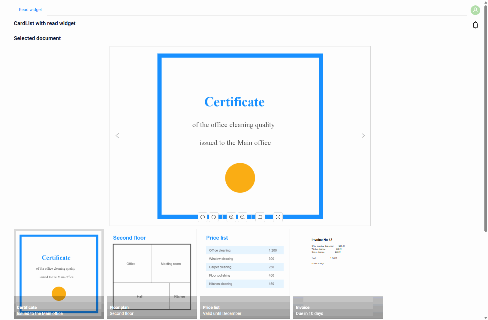

#### How to add?
??? Example
    **Step 1** Create an Info widget with the fileUpload field.
    ```json
    --8<--
    {{ external_links.github_raw_doc }}/widgets/cardlist/read/MyExample5307Read.widget.json
    --8<--
    ```

    **Step 2** Add **options.read.widget** to the CardList widget.
    ```json
    --8<--
    {{ external_links.github_raw_doc }}/widgets/cardlist/read/MyExample5307CardList.widget.json
    --8<--
    ```

    **Step 3** Add both widgets to the **_.view.json_**.
    ```json
    --8<--
    {{ external_links.github_raw_doc }}/widgets/cardlist/read/myexample5307list.view.json
    --8<--
    ```

### Filtration
_not applicable_

### FullTextSearch
[:material-play-circle: Live Sample]({{ external_links.code_samples }}/ui/#/screen/myexample5308){:target="_blank"} ·
[:fontawesome-brands-github: GitHub]({{ external_links.github_ui }}/{{ external_links.github_branch }}/src/main/java/org/demo/documentation/widgets/cardlist/fulltextsearch){:target="_blank"}

`FullTextSearch` - when the user types in the search box of the widget, the widget shows the cards that match the search query. The service filters the records, like in List.

#### How does it look?
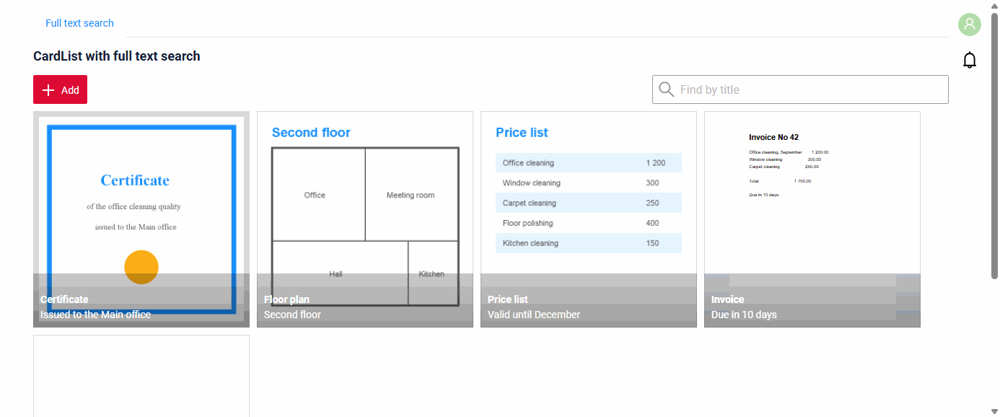

see [FullTextSearch](/widget/type/property/filtration/filtration/#by-fulltextsearch)

#### How to add?
??? Example
    **Step 1** Add **fullTextSearch** to **options** of **_.widget.json_**.
    ```json
    --8<--
    {{ external_links.github_raw_doc }}/widgets/cardlist/fulltextsearch/MyExample5308CardList.widget.json
    --8<--
    ```

    **Step 2** Add the search specification to the repository.
    ```java
    --8<--
    {{ external_links.github_raw_doc }}/widgets/cardlist/fulltextsearch/MyEntity5308Repository.java:getFullTextSearchSpecification
    --8<--
    ```

    **Step 3** Apply it in **getSpecification** of the service.
    ```java
    --8<--
    {{ external_links.github_raw_doc }}/widgets/cardlist/fulltextsearch/MyExample5308Service.java:getSpecification
    --8<--
    ```

### <a id="pagination">Pagination</a>
[:material-play-circle: Live Sample]({{ external_links.code_samples }}/ui/#/screen/myexample5300){:target="_blank"} ·
[:fontawesome-brands-github: GitHub]({{ external_links.github_ui }}/{{ external_links.github_branch }}/src/main/java/org/demo/documentation/widgets/cardlist/base){:target="_blank"}

`Pagination` works like in [List](/widget/type/list/list/): the pagination under the cards turns the pages, 5 cards on a page by default.

#### How does it look?
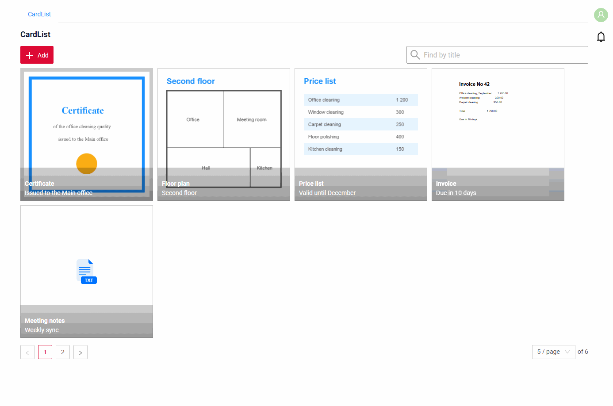

see [Pagination](/widget/type/property/pagination/pagination) and [Default page limit](/widget/type/property/defaultlimitpage/defaultlimitpage)

### Export to Excel
_not applicable_

### Multi-upload files
[:material-play-circle: Live Sample]({{ external_links.code_samples }}/ui/#/screen/myexample6100/view/myexample6100cardlist){:target="_blank"} ·
[:fontawesome-brands-github: GitHub]({{ external_links.github_ui }}/{{ external_links.github_branch }}/src/main/java/org/demo/documentation/feature/file){:target="_blank"}

We have implemented multi-file upload. You can use a dedicated drag-and-drop zone or a standard button to select your files. Every uploaded file becomes a new card.

see more [Multi-upload files](/widget/type/property/multiupload/multiupload)

### Customization of displayed columns
_not applicable_

### Sorting
_not applicable_
