# Column2D

`Column2D` widget draws a column chart: one bar per category on the X axis, a number on the Y axis.
Several bars per category are shown when the records are grouped by a field. The user can switch the chart to a table.

## Basics
[:material-play-circle: Live Sample]({{ external_links.code_samples }}/ui/#/screen/myexample4252){:target="_blank"} ·
[:fontawesome-brands-github: GitHub]({{ external_links.github_ui }}/{{ external_links.github_branch }}/src/main/java/org/demo/documentation/widgets/column2d/base){:target="_blank"}
### How does it look?


Every record of the business component is one bar of the chart. The widget takes the bar from two fields:

* `xValueFieldKey`: the field with the category on the X axis (a client, a month, a product).
* `yValueFieldKey`: the numeric field with the height of the bar on the Y axis.

The `title` of these fields is shown as the axis title. Records without a Y value are skipped.
The backend returns the records in the order of the X axis: the chart does not sort them.

Options of `options.chart2D`:

| Option                  | Required | Description                                                                                                                    |
|-------------------------|----------|--------------------------------------------------------------------------------------------------------------------------------|
| `xValueFieldKey`        | yes      | Field key for the X axis.                                                                                                      |
| `yValueFieldKey`        | yes      | Field key for the Y axis. Must be a numeric field type (`number`, `money`, `percent`).                                         |
| `groupFieldKey`         | no       | Field key that splits the bars of a category. One bar per value, the values are shown in the legend. See [Groups](#groups).    |
| `stack`                 | no       | `true` puts the bars of a category one on top of the other. See [Stack](#stack).                                               |
| `yMin`, `yMax`, `yStep` | no       | Scale and step of the Y axis. See [Axis scale and step](#axis).                                                                |
| `xMin`, `xMax`, `xStep` | no       | Scale and step of the X axis. Only for a numeric X field. See [Axis scale and step](#axis).                                    |
| `descriptionFieldKey`   | no       | Field keys shown in the tooltip instead of the X value. See [Tooltip](#tooltip).                                               |

###  <a id="Howtoaddbacis">How to add?</a>
??? Example
    **Step1** Create **DataResponseDTO** with the fields of a bar: the X value and the Y value.
    ```java
    --8<--
    {{ external_links.github_raw_doc }}/widgets/column2d/base/MyExample4252DTO.java
    --8<--
    ```

    **Step2** Create **DAO** extends AbstractAnySourceBaseDAO<> implements AnySourceBaseDAO.
    The DAO returns one record per bar, sorted along the X axis, with a unique `id`.
    ```java
    --8<--
    {{ external_links.github_raw_doc }}/widgets/column2d/base/MyExample4252Dao.java:getStats
    --8<--
    ```
    In the sample the sums are calculated by the database:
    ```java
    --8<--
    {{ external_links.github_raw_doc }}/widgets/column2d/data/MyEntity4252Repository.java:clientSums
    --8<--
    ```

    **Step3** Create **Meta** extends AnySourceFieldMetaBuilder.
    ```java
    --8<--
    {{ external_links.github_raw_doc }}/widgets/column2d/base/MyExample4252Meta.java
    --8<--
    ```

    **Step4** Create **Service** extends AnySourceVersionAwareResponseService.
    ```java
    --8<--
    {{ external_links.github_raw_doc }}/widgets/column2d/base/MyExample4252Service.java
    --8<--
    ```

    **Step5** Create file **_.widget.json_** with type = **"Column2D"**.
    Add the fields of the bar and **options.chart2D** with `xValueFieldKey` and `yValueFieldKey`.
    ```json
    --8<--
    {{ external_links.github_raw_doc }}/widgets/column2d/base/MyExample4252Column2D.widget.json
    --8<--
    ```

    **Step6** Add widget to corresponding **_.view.json_**.
    ```json
    --8<--
    {{ external_links.github_raw_doc }}/widgets/column2d/base/myexample4252column2d.view.json
    --8<--
    ```

    **Step7** Set the page limit of the business component to the number of bars, for example 1000.
    The default limit is 5. When the business component has more records than the limit, the widget shows only the table.
    See [Page limit](#pagelimit).

    Add the business component to the **BC_PROPERTIES** table:
    ```csv
    BC;PAGE_LIMIT;MASS_PAGE_LIMIT;SORT;FILTER;ID
    myExampleBc4252;1000;NULL;NULL;'""';
    ```

## <a id="Title">Title</a>
[:material-play-circle: Live Sample]({{ external_links.code_samples }}/ui/#/screen/myexample4253){:target="_blank"} ·
[:fontawesome-brands-github: GitHub]({{ external_links.github_ui }}/{{ external_links.github_branch }}/src/main/java/org/demo/documentation/widgets/column2d/title){:target="_blank"}

### Title Basic
`Title` for widget (optional)

There are types of:

* `constant title`: shows constant text.
* `constant title empty`: if you want to visually connect widgets by them to be placed one under another

#### How does it look?
=== "Constant title"
    
=== "Constant title empty"
    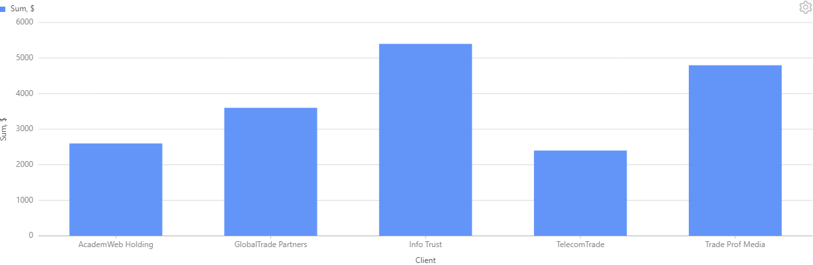

#### How to add?
??? Example
    === "Constant title"
        **Step1** Add name for **title** to **_.widget.json_**.
        ```json
        --8<--
        {{ external_links.github_raw_doc }}/widgets/column2d/title/MyExample4253Column2D.widget.json
        --8<--
        ```
    === "Constant title empty"
        **Step1** Delete parameter **title** from **_.widget.json_**.
        ```json
        --8<--
        {{ external_links.github_raw_doc }}/widgets/column2d/title/MyExample4253Column2DEmptyTitle.widget.json
        --8<--
        ```

### Title Color
_not applicable_

## <a id="bc">Business component</a>
This specifies the business component (BC) to which this widget belongs.
A business component represents a specific part of a system that handles a particular business logic or data.

The chart takes the data from an **AnySource** business component: the DAO builds the bars (for example, a sum per client)
and returns them in the order of the X axis. One record is one bar, so the `id` of a record must be unique.

see more  [Business component](/environment/businesscomponent/businesscomponent/)

## <a id="Showcondition">Show condition</a>
[:material-play-circle: Live Sample]({{ external_links.code_samples }}/ui/#/screen/myexample4276){:target="_blank"} ·
[:fontawesome-brands-github: GitHub]({{ external_links.github_ui }}/{{ external_links.github_branch }}/src/main/java/org/demo/documentation/widgets/column2d/showcondition){:target="_blank"}

* `no show condition - recommended`: widget always visible
* `show condition by current entity`: the chart is shown when a field of the current record of another business component on the view has the given value

!!! tips
    It is recommended not to use `Show condition` when possible, because wide usage of this feature makes application hard to support.

#### <a id="howdoesitlook">How does it look?</a>
=== "no show condition"
    
=== "show condition by current entity"
    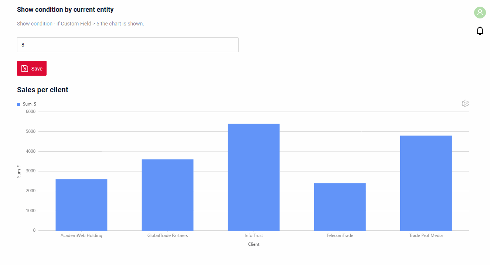

#### <a id="howtoadd">How to add?</a>
??? Example

    === "no show condition"
        see [Basic](#Howtoaddbacis)

    === "show condition by current entity"
        **Step1** Add the field of the condition to the **DataResponseDTO** of the other business component.
        ```java
        --8<--
        {{ external_links.github_raw_doc }}/widgets/column2d/showcondition/MyExample4276FormDTO.java:customFieldShowCond
        --8<--
        ```
        **Step2** Add **showCondition** to **_.widget.json_**. see more [showCondition](/widget/type/property/showcondition/showcondition)
        ```json
        --8<--
        {{ external_links.github_raw_doc }}/widgets/column2d/showcondition/MyExample4276Column2D.widget.json
        --8<--
        ```

## <a id="fields">Fields</a>
Fields Configuration. The fields array defines the fields of a bar. The chart uses the fields named in `options.chart2D`;
the other fields are shown in the [table mode](#tablemode) and in the tooltip.

```json
{
    "title": "Client",
    "key": "clientName",
    "type": "input"
}
```

* **"title"**

  Description: Field Title. For the X and Y fields it is the axis title. An empty title hides the axis title.

  Type: String(optional).

* **"key"**

    Description: Name field to corresponding DataResponseDTO.

    Type: String(required).

* **"type"**

  Description: [Field types](/widget/fields/fieldtypes/). The Y field must be numeric.

  Type: String(required).

A field with type `hidden` is not shown in the table mode. Use it for the values that only the drilldown filter needs.

### How to add?
??? Example
    Add field to **_.widget.json_**.

      ```json
         --8<--
         {{ external_links.github_raw_doc }}/widgets/column2d/base/MyExample4252Column2D.widget.json
         --8<--
      ```

## <a id="Fieldslayout">Options layout</a>
**options.layout** - no use in this type.

## Actions
_not applicable_

### Additional properties

#### <a id="tooltip">Tooltip</a>
[:material-play-circle: Live Sample]({{ external_links.code_samples }}/ui/#/screen/myexample4256){:target="_blank"} ·
[:fontawesome-brands-github: GitHub]({{ external_links.github_ui }}/{{ external_links.github_branch }}/src/main/java/org/demo/documentation/widgets/column2d/tooltip){:target="_blank"}

The tooltip appears when the user moves the mouse over a bar. By default it shows the X value and the value of every bar of the category.
`descriptionFieldKey` replaces it with the values of the listed fields of the record, joined with a comma.

###### How does it look?
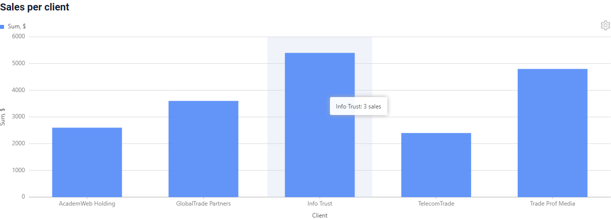

###### How to add?
??? Example
    **Step1** Fill the description field in the DAO.
    ```java
    --8<--
    {{ external_links.github_raw_doc }}/widgets/column2d/tooltip/MyExample4256Dao.java:getStats
    --8<--
    ```
    **Step2** Add the description field to **fields** and **descriptionFieldKey** to **options.chart2D** in **_.widget.json_**.
    ```json
    --8<--
    {{ external_links.github_raw_doc }}/widgets/column2d/tooltip/MyExample4256Column2D.widget.json
    --8<--
    ```

#### <a id="color">Color</a>
[:material-play-circle: Live Sample]({{ external_links.code_samples }}/ui/#/screen/myexample4257){:target="_blank"} ·
[:fontawesome-brands-github: GitHub]({{ external_links.github_ui }}/{{ external_links.github_branch }}/src/main/java/org/demo/documentation/widgets/column2d/color){:target="_blank"}

The color of the bars is set on the X field:

* `bgColorKey`: the key of the field with the color of the record. The color is set per group: all bars of a group take the color of its first record.
  Without `groupFieldKey` all bars have one color.
* `bgColor`: one constant color for all bars.

Without them the widget uses the default palette.

###### How does it look?
=== "Calculated color"
    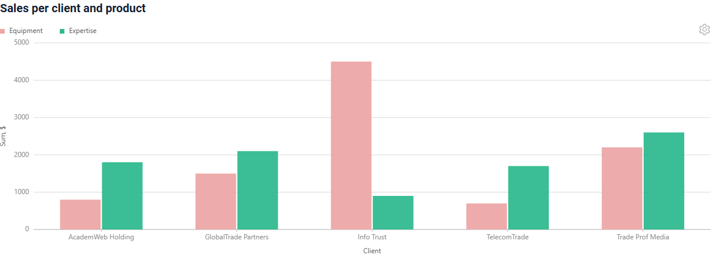
=== "Constant color"
    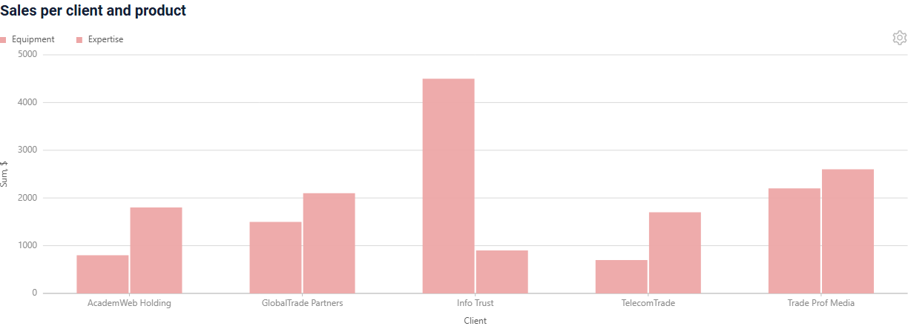

###### How to add?
??? Example
    === "Calculated color"
        **Step1** Add the color field to **DataResponseDTO** and fill it in the DAO.
        ```java
        --8<--
        {{ external_links.github_raw_doc }}/widgets/column2d/color/MyExample4257Dao.java:getStats
        --8<--
        ```
        **Step2** Add **bgColorKey** to the X field in **_.widget.json_**.
        ```json
        --8<--
        {{ external_links.github_raw_doc }}/widgets/column2d/color/MyExample4257Column2D.widget.json
        --8<--
        ```
    === "Constant color"
        **Step1** Add **bgColor** to the X field in **_.widget.json_**.
        ```json
        --8<--
        {{ external_links.github_raw_doc }}/widgets/column2d/color/MyExample4257Column2DColorConst.widget.json
        --8<--
        ```

#### <a id="drilldown">Drilldown</a>
[:material-play-circle: Live Sample]({{ external_links.code_samples }}/ui/#/screen/myexample4258){:target="_blank"} ·
[:fontawesome-brands-github: GitHub]({{ external_links.github_ui }}/{{ external_links.github_branch }}/src/main/java/org/demo/documentation/widgets/column2d/drilldown){:target="_blank"}

A click on a bar opens the view with the records behind the bar. The drilldown is set on the X field:
`drillDown: true` in the widget and the target view with a filter in the Meta of the record.
With `groupFieldKey` the bar knows its group, so the filter can include the group value.

In the table mode the X value is a link with the same drilldown.

###### How does it look?
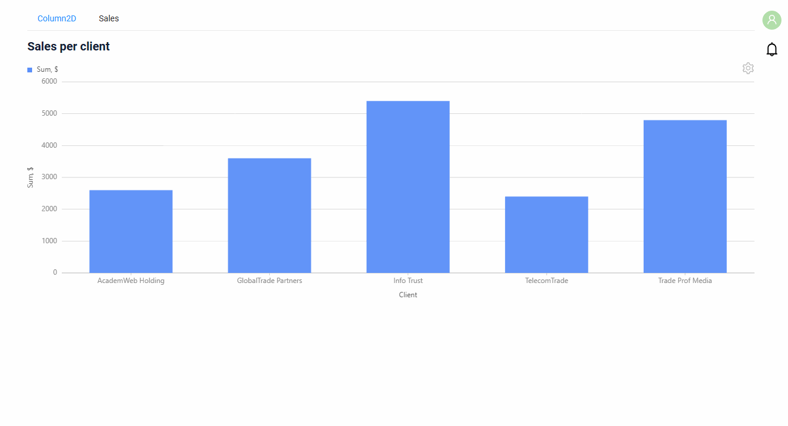

###### How to add?
??? Example
    **Step1** Add **drillDown** to the X field in **_.widget.json_**.
    ```json
    --8<--
    {{ external_links.github_raw_doc }}/widgets/column2d/drilldown/MyExample4258Column2D.widget.json
    --8<--
    ```
    **Step2** Set the target view and the filter in **buildRowDependentMeta** of the **Meta**.
    ```java
    --8<--
    {{ external_links.github_raw_doc }}/widgets/column2d/drilldown/MyExample4258Meta.java:buildRowDependentMeta
    --8<--
    ```
    **Step3** Add the target **List** widget and its view. The filtered fields have **@SearchParameter** in the DTO.
    ```java
    --8<--
    {{ external_links.github_raw_doc }}/widgets/column2d/drilldown/MyExample4258SaleDTO.java
    --8<--
    ```

    see more [DrillDown](/advancedCustomization/element/drillDown/drillDown)

#### <a id="tablemode">Table mode</a>
[:material-play-circle: Live Sample]({{ external_links.code_samples }}/ui/#/screen/myexample4252){:target="_blank"} ·
[:fontawesome-brands-github: GitHub]({{ external_links.github_ui }}/{{ external_links.github_branch }}/src/main/java/org/demo/documentation/widgets/column2d/base){:target="_blank"}

The settings icon of the widget opens the `Mode` menu with `Chart` and `Table`. In the table mode the widget shows the records
as a table with a column per field of the widget (fields with type `hidden` are not shown).

###### How does it look?
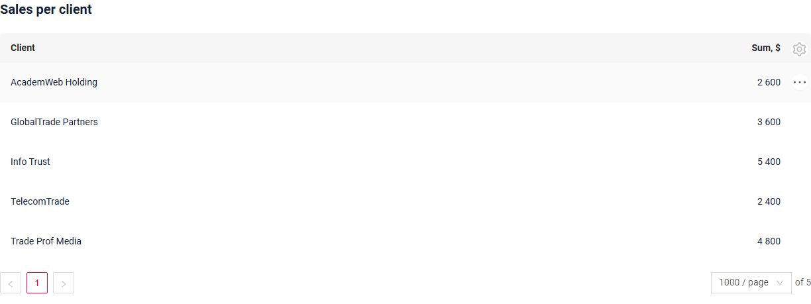

###### How to add?
The table mode is always available, nothing to add.

#### <a id="groups">Groups</a>
[:material-play-circle: Live Sample]({{ external_links.code_samples }}/ui/#/screen/myexample4254/view/myexample4254column2d){:target="_blank"} ·
[:fontawesome-brands-github: GitHub]({{ external_links.github_ui }}/{{ external_links.github_branch }}/src/main/java/org/demo/documentation/widgets/column2d/group){:target="_blank"}

`groupFieldKey` splits the bars of a category: one bar per value of the field, side by side. The values are shown in the legend.
A click on a legend value hides or shows its bars.

Without `groupFieldKey` the chart has one bar per category, and the legend shows the title of the Y field.

###### How does it look?
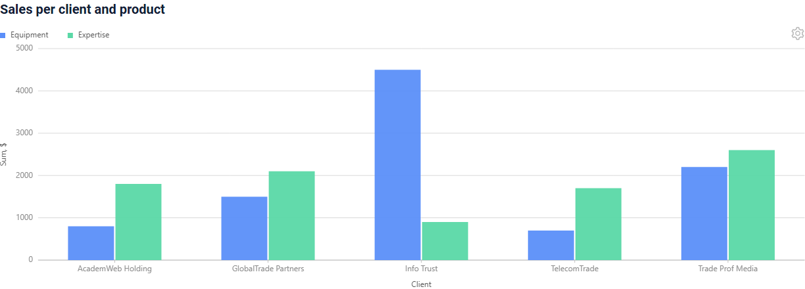

###### How to add?
??? Example
    **Step1** Add **groupFieldKey** to **options.chart2D** in **_.widget.json_**.
    ```json
    --8<--
    {{ external_links.github_raw_doc }}/widgets/column2d/group/MyExample4254Column2D.widget.json
    --8<--
    ```
    **Step2** The DAO returns one record per X value and group.
    ```java
    --8<--
    {{ external_links.github_raw_doc }}/widgets/column2d/data/MyEntity4252Repository.java:clientProductSums
    --8<--
    ```

#### <a id="stack">Stack</a>
[:material-play-circle: Live Sample]({{ external_links.code_samples }}/ui/#/screen/myexample4254/view/myexample4254column2dstack){:target="_blank"} ·
[:fontawesome-brands-github: GitHub]({{ external_links.github_ui }}/{{ external_links.github_branch }}/src/main/java/org/demo/documentation/widgets/column2d/group){:target="_blank"}

`stack: true` puts the bars of a category one on top of the other: the height of the column is the sum of the group values.
Use it with `groupFieldKey`.

###### How does it look?
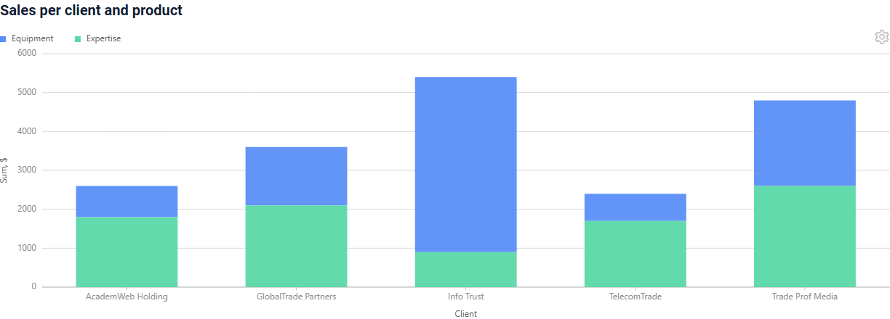

###### How to add?
??? Example
    **Step1** Add **stack** to **options.chart2D** in **_.widget.json_**.
    ```json
    --8<--
    {{ external_links.github_raw_doc }}/widgets/column2d/group/MyExample4254Column2DStack.widget.json
    --8<--
    ```

#### <a id="axis">Axis scale and step</a>
[:material-play-circle: Live Sample]({{ external_links.code_samples }}/ui/#/screen/myexample4255){:target="_blank"} ·
[:fontawesome-brands-github: GitHub]({{ external_links.github_ui }}/{{ external_links.github_branch }}/src/main/java/org/demo/documentation/widgets/column2d/axes){:target="_blank"}

`yMin`, `yMax` set the range of the Y axis, `yStep` sets the distance between the axis labels.
Without them the range is taken from the data.

`xMin`, `xMax`, `xStep` do the same for the X axis and work only when the X field has a numeric type.
For a text X field they are ignored, and the widget writes a message to the browser console.

###### How does it look?
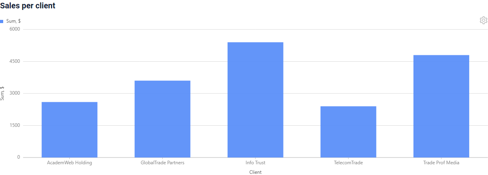

###### How to add?
??? Example
    **Step1** Add **yMin**, **yMax**, **yStep** to **options.chart2D** in **_.widget.json_**.
    ```json
    --8<--
    {{ external_links.github_raw_doc }}/widgets/column2d/axes/MyExample4255Column2D.widget.json
    --8<--
    ```

#### DualAxes2D
A `Column2D` widget can be combined with a `Line2D` widget in one area with the `DualAxes2D` widget:
the charts share the X axis and can have separate Y axes.

#### Customization of displayed columns
**not available** in this release.

#### Filtration
##### Basic
Works only in the [table mode](#tablemode): the column filters are shown for the fields with `enableFilter` in the Meta,
as in a List widget. In the chart mode there are no filters. The widget sends the filter to the backend, and the AnySource DAO
of the chart applies it itself: the DAO of the samples does not, so there is no Live Sample.
see more [Filtration](/widget/type/property/filtration/filtration/)

#### FullTextSearch
Works only in the [table mode](#tablemode) with `options.fullTextSearch` in **_.widget.json_**: the search input is shown above
the table. The widget sends the search text to the backend, and the AnySource DAO of the chart applies it itself.
see [FullTextSearch](/widget/type/property/filtration/filtration/#by-fulltextsearch)
##### Personal filter group
**not available** in this release: the settings menu of the chart has only the `Mode` items, so there is no `Save filters` item.
##### Filter group
Works only in the [table mode](#tablemode): the filter groups of the business component are shown above the table, as in a List widget.
The widget sends the filter of the chosen group to the backend, and the AnySource DAO of the chart applies it itself.
see [Filter group](/widget/type/property/filtration/filtration/#by-filter-group)

#### Pagination
_not applicable_: the chart shows one page, see [Page limit](#pagelimit).

#### Export to Excel
**not available** in this release.

#### Multi-upload files
_not applicable_

#### Sorting
Works only in the [table mode](#tablemode) for the fields with `enableSort` in the Meta. The widget sends the sort to the backend,
and the AnySource DAO of the chart applies it itself.
see more [Sorting](/widget/type/property/sorting/sorting)

#### <a id="pagelimit">Page limit</a>
[:material-play-circle: Live Sample]({{ external_links.code_samples }}/ui/#/screen/myexample4259){:target="_blank"} ·
[:fontawesome-brands-github: GitHub]({{ external_links.github_ui }}/{{ external_links.github_branch }}/src/main/java/org/demo/documentation/widgets/column2d/limit){:target="_blank"}

The chart draws only the first page of the business component. When the business component has more records than the page limit,
the chart is not drawn: the widget opens in the table mode, the `Chart` mode is disabled and a warning icon explains why.

Set the page limit of the business component to the number of bars, see [Page limit](/widget/type/property/defaultlimitpage/defaultlimitpage).

###### How does it look?
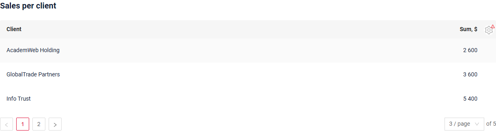

###### How to add?
??? Example
    **Step1** Set the page limit in the **BC_PROPERTIES** table. In the sample it is 3 for 5 bars.
    ```csv
    BC;PAGE_LIMIT;MASS_PAGE_LIMIT;SORT;FILTER;ID
    myExampleBc4259;3;NULL;NULL;'""';
    ```
    **Step2** The DAO returns the page asked by the widget.
    ```java
    --8<--
    {{ external_links.github_raw_doc }}/widgets/column2d/limit/MyExample4259Dao.java:getList
    --8<--
    ```

#### <a id="nodata">No data</a>
[:material-play-circle: Live Sample]({{ external_links.code_samples }}/ui/#/screen/myexample4260){:target="_blank"} ·
[:fontawesome-brands-github: GitHub]({{ external_links.github_ui }}/{{ external_links.github_branch }}/src/main/java/org/demo/documentation/widgets/column2d/nodata){:target="_blank"}

When the business component returns no records, the widget shows `No Data` instead of the chart.

###### How does it look?


#### <a id="parentchild">Parent-child</a>
**not available** in the chart mode in this release: a click on a bar does not select the record, the child widgets do not change.
In the [table mode](#tablemode) a click on a row selects the record, and the child widgets show the data of this record.
