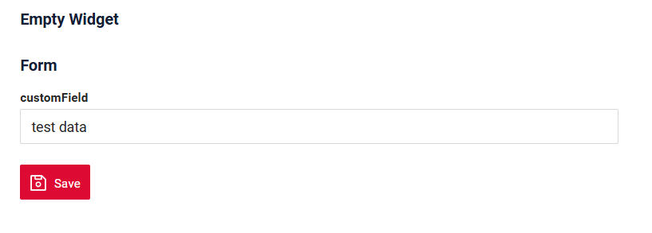

# EmptyWidget
 
`EmptyWidget` widget is a component for displaying text.

* does not support control elements (e.g., action buttons or menus) and fields.

## Basics
[:material-play-circle: Live Sample]({{ external_links.code_samples }}/ui/#/screen/myexample5022){:target="_blank"} ·
[:fontawesome-brands-github: GitHub]({{ external_links.github_ui }}/{{ external_links.github_branch }}/src/main/java/org/demo/documentation/widgets/emptywidget/base){:target="_blank"}
### How does it look?
=== "Empty widget"
    
=== "Empty widget with other widget"
    
=== "EmptyWidget and emptywidget"
    

###  <a id="Howtoaddbacis">How to add?</a>
??? Example
 
    **Step1** Create file **_.widget.json_**. with  type = **"EmptyWidget"**

    ```json
       --8<--
       {{ external_links.github_raw_doc }}/widgets/emptywidget/base/myExample5022EmptyWidget.widget.json
       --8<--
    ```

    **Step2** Add widget to corresponding ****_.view.json_** **.

    ```json
        --8<--
        {{ external_links.github_raw_doc }}/widgets/emptywidget/base/myexample5022empty.view.json
        --8<--
    ```

    [:material-play-circle: Live Sample]({{ external_links.code_samples }}/ui/#/screen/myexample5022){:target="_blank"} ·
    [:fontawesome-brands-github: GitHub]({{ external_links.github_ui }}/{{ external_links.github_branch }}/src/main/java/org/demo/documentation/widgets/emptywidget/base){:target="_blank"}

## <a id="Title">Title</a>
[:material-play-circle: Live Sample]({{ external_links.code_samples }}/ui/#/screen/myexample5034){:target="_blank"} ·
[:fontawesome-brands-github: GitHub]({{ external_links.github_ui }}/{{ external_links.github_branch }}/src/main/java/org/demo/documentation/widgets/emptywidget/title){:target="_blank"}

### Title Basic
`Title` for widget.

There are types of:

* `constant title`: shows constant text. 
* `calculated title`: shows value provided in hidden text field, e.g. it can be calculated based on business logic of application
 
#### How does it look?
=== "Constant title"
     
=== "Calculated title"
    
#### How to add?
??? Example
    === "Constant title"
        **Step1** Add name for **title** to **_.widget.json_**.
        ```java
        --8<--
        {{ external_links.github_raw_doc }}/widgets/emptywidget/title/myExample5034const.widget.json
        --8<--
        ```
        [:material-play-circle: Live Sample]({{ external_links.code_samples }}/ui/#/screen/myexample5034){:target="_blank"} ·
        [:fontawesome-brands-github: GitHub]({{ external_links.github_ui }}/{{ external_links.github_branch }}/src/main/java/org/demo/documentation/widgets/emptywidget/title){:target="_blank"}

    === "Calculated title"
        <!--родитель??-->
        **Step1** Add ${customField} for **title** to **_.widget.json_**.

        Dynamic data output in the title only works if these fields are displayed on or passed as the hidden type from other widget [List widget](/widget/type/list/list), [Form widget](/widget/type/form/form),[Info widget](/widget/type/info/info).

        ```java
        --8<--
        {{ external_links.github_raw_doc }}/widgets/emptywidget/title/myExample5034.widget.json
        --8<--
        ```
        [:material-play-circle: Live Sample]({{ external_links.code_samples }}/ui/#/screen/myexample5034/view/myexample5034form){:target="_blank"} ·
        [:fontawesome-brands-github: GitHub]({{ external_links.github_ui }}/{{ external_links.github_branch }}/src/main/java/org/demo/documentation/widgets/emptywidget/title/myExample5034.widget.json){:target="_blank"}

### <a id="TitleColor">Title Color</a>
 
`Title Color` allows you to specify a color for a title. It can be constant or calculated.
 
[:material-play-circle: Live Sample]({{ external_links.code_samples }}/ui/#/screen/myexample5031/view/myexample5031formconstcolor){:target="_blank"} ·
[:fontawesome-brands-github: GitHub]({{ external_links.github_ui }}/{{ external_links.github_branch }}/src/main/java/org/demo/documentation/widgets/emptywidget/colortitle){:target="_blank"}

* `Constant color*` is a fixed color that doesn't change. It remains the same regardless of any factors in the application.

[:material-play-circle: Live Sample]({{ external_links.code_samples }}/ui/#/screen/myexample5031/view/myexample5031form){:target="_blank"} ·
[:fontawesome-brands-github: GitHub]({{ external_links.github_ui }}/{{ external_links.github_branch }}/src/main/java/org/demo/documentation/widgets/emptywidget/colortitle){:target="_blank"}

* `Calculated color` can be used to change a title color dynamically. It changes depending on business logic or data in the application.

!!! info
    Title colorization is **applicable** to the following [fields](/widget/fields/fieldtypes/): date, dateTime, dateTimeWithSeconds, number, money, percent, time, input, text, dictionary, radio, checkbox, multivalue, multivalueHover.


##### How does it look?


##### How to add?
 
??? Example
    === "Calculated color"

        **Step 1**   Add `custom field for color` to corresponding **DataResponseDTO**. The field can contain a HEX color or be null.
        ```java
        --8<--
        {{ external_links.github_raw_doc }}/widgets/emptywidget/colortitle/MyExample5031DTO.java:colorDTO
        --8<--
        ```   
 
         **Step 2** Dynamic data output in the header only works if these fields are displayed on or passedas the hidden type from other  widget [List widget](/widget/type/list/list), [Form widget](/widget/type/form/form),[Info widget](/widget/type/info/info)
        with the bgColorKey property.

        Add **"bgColorKey"** :  `custom field for color` and  to .widget.json .([List widget](/widget/type/list/list), [Form widget](/widget/type/form/form),[Info widget](/widget/type/info/info))

        Add in `title` field with `${customField}` 

        ```json
        {
        "label": "Custom Field",
        "key": "customFieldText",
        "type": "input",
        "bgColorKey": "customFieldTextColor"
        }
        ```

        ```json
        --8<--
        {{ external_links.github_raw_doc }}/widgets/emptywidget/colortitle/myExample5032Form.widget.json
        --8<--
        ```     

         **Step 3** Add in `title` field with `${customField} . 

        ```json
        --8<--
        {{ external_links.github_raw_doc }}/widgets/emptywidget/colortitle/myExample5032emptywidget.widget.json
        --8<--
        ```     

        [:material-play-circle: Live Sample]({{ external_links.code_samples }}/ui/#/screen/myexample5031/view/myexample5031form){:target="_blank"} ·
        [:fontawesome-brands-github: GitHub]({{ external_links.github_ui }}/{{ external_links.github_branch }}/src/main/java/org/demo/documentation/widgets/emptywidget/colortitle){:target="_blank"}

    === "Constant color"
        Constant color in the title only works if these fields are displayed on or passedas the hidden type from other  widget [List widget](/widget/type/list/list), [Form widget](/widget/type/form/form),[Info widget](/widget/type/info/info).

        Add **"bgColor"** :  `HEX color`  to .widget.json.([List widget](/widget/type/list/list), [Form widget](/widget/type/form/form),[Info widget](/widget/type/info/info).

        Add in `title` field with `${customField}` 
 
        ```json
        --8<--
        {{ external_links.github_raw_doc }}/widgets/emptywidget/colortitle/myExample5031EmptyWidgetConstColor.widget.json
        --8<--
        ```
        
        [:material-play-circle: Live Sample]({{ external_links.code_samples }}/ui/#/screen/myexample5031/view/myexample5031formconstcolor){:target="_blank"} ·
        [:fontawesome-brands-github: GitHub]({{ external_links.github_ui }}/{{ external_links.github_branch }}/src/main/java/org/demo/documentation/widgets/emptywidget/colortitle){:target="_blank"}


## <a id="Showcondition">Show condition</a> 
see more [showCondition](/widget/type/property/showcondition/showcondition)

[:material-play-circle: Live Sample]({{ external_links.code_samples }}/ui/#/screen/myexample5021){:target="_blank"} ·
[:fontawesome-brands-github: GitHub]({{ external_links.github_ui }}/{{ external_links.github_branch }}/src/main/java/org/demo/documentation/widgets/emptywidget/base){:target="_blank"}

* `no show condition - recommended`: widget always visible

[:material-play-circle: Live Sample]({{ external_links.code_samples }}/ui/#/screen/myexample5033/view/myexample5033form){:target="_blank"} ·
[:fontawesome-brands-github: GitHub]({{ external_links.github_ui }}/{{ external_links.github_branch }}/src/main/java/org/demo/documentation/widgets/emptywidget/showcondition/bycurrententity){:target="_blank"}

* `show condition by current entity`: condition can include boolean expression depending on current entity fields. Field updates will trigger condition recalculation only on save or if field is force active

[:material-play-circle: Live Sample]({{ external_links.code_samples }}/ui/#/screen/myexample3005/view/myexample3007showcondform){:target="_blank"} ·
[:fontawesome-brands-github: GitHub]({{ external_links.github_ui }}/{{ external_links.github_branch }}/src/main/java/org/demo/documentation/widgets/form/showcondition/byparententity){:target="_blank"}

* `show condition by parent entity`: condition can include boolean expression depending on parent entity. Parent field updates will trigger condition recalculation only on save or if field is force active shown on same view

!!! tips
    It is recommended not to use `Show condition` when possible, because wide usage of this feature makes application hard to support.


#### <a id="howdoesitlook">How does it look?</a>
=== "no show condition"
    
=== "show condition by current entity"
    
=== "show condition by parent entity"
    

### <a id="howtoadd">How to add?</a>
??? Example

    === "no show condition"
        see [Basic](#Howtoaddbacis)
        [:material-play-circle: Live Sample]({{ external_links.code_samples }}/ui/#/screen/myexample5022){:target="_blank"} ·
        [:fontawesome-brands-github: GitHub]({{ external_links.github_ui }}/{{ external_links.github_branch }}/src/main/java/org/demo/documentation/widgets/emptywidget/base){:target="_blank"}

    === "show condition by current entity"
        `showCondition` only works if these fields for showCondition are displayed on or passed as the hidden type from other widget [List widget](/widget/type/list/list), [Form widget](/widget/type/form/form),[Info widget](/widget/type/info/info).

        **Step1** Add **showCondition** to **_.widget.json_**. see more [showCondition](/widget/type/property/showcondition/showcondition)
        ```json
        --8<--
        {{ external_links.github_raw_doc }}/widgets/emptywidget/showcondition/bycurrententity/myExample5033.widget.json
        --8<--
        ```

        [:material-play-circle: Live Sample]({{ external_links.code_samples }}/ui/#/screen/myexample5033/view/myexample5033form){:target="_blank"} ·
        [:fontawesome-brands-github: GitHub]({{ external_links.github_ui }}/{{ external_links.github_branch }}/src/main/java/org/demo/documentation/widgets/emptywidget/showcondition/bycurrententity){:target="_blank"}

    === "show condition by parent entity"
        `showCondition` only works if these fields for showCondition are displayed on or passed as the hidden type from other widget [List widget](/widget/type/list/list), [Form widget](/widget/type/form/form),[Info widget](/widget/type/info/info).

        **Step1** Add **showCondition** to **_.widget.json_**. see more [showCondition](/widget/type/property/showcondition/showcondition)
        ```json
        --8<--
        {{ external_links.github_raw_doc }}/widgets/form/showcondition/byparententity/child/MyExample3006Form.widget.json
        --8<--
        ```
        [:material-play-circle: Live Sample]({{ external_links.code_samples }}/ui/#/screen/myexample3005/view/myexample3007showcondform){:target="_blank"} ·
        [:fontawesome-brands-github: GitHub]({{ external_links.github_ui }}/{{ external_links.github_branch }}/src/main/java/org/demo/documentation/widgets/form/showcondition/byparententity){:target="_blank"}

 
## <a id="bc">Business component</a>
This specifies the business component (BC) to which this emptywidget belongs.
A business component represents a specific part of a system that handles a particular business logic or data.

see more  [Business component](/environment/businesscomponent/businesscomponent/)

## <a id="fields">Fields</a>
This widget type does not support fields

## Options
This widget type does not support options

## Standard Actions
This widget type does not support buttons