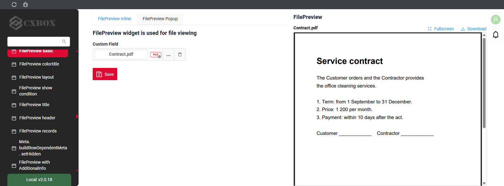
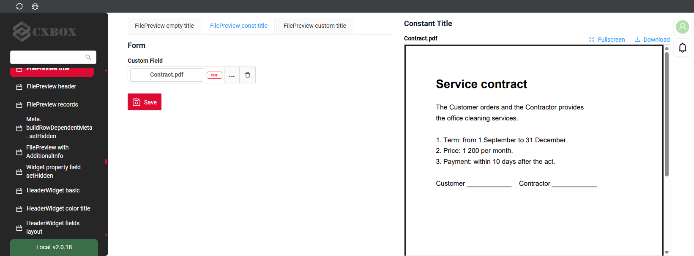
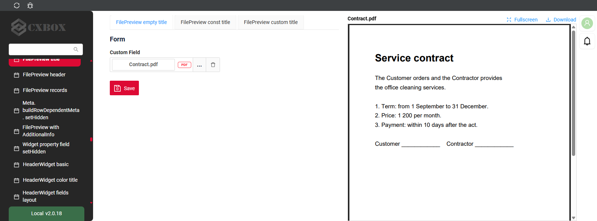
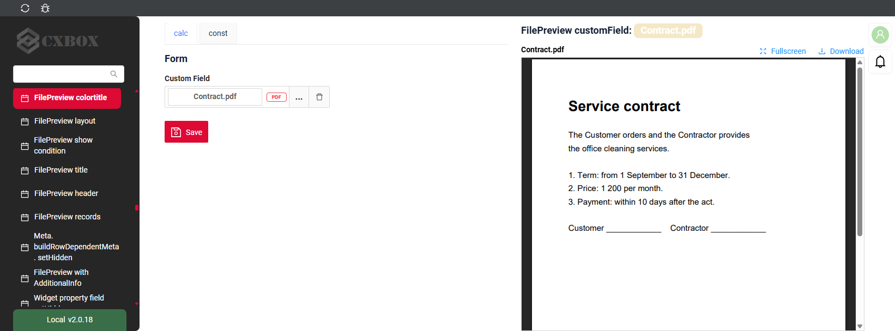
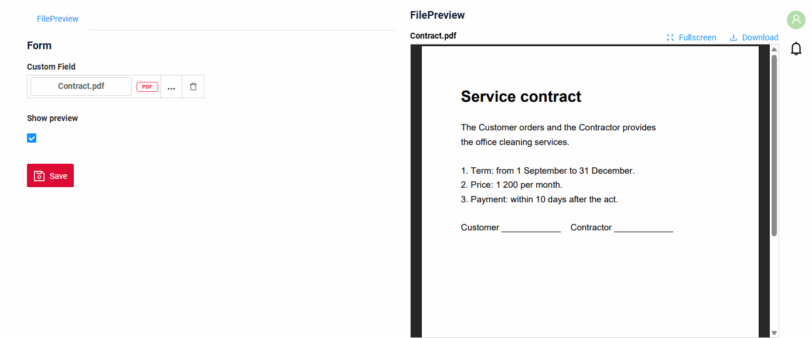
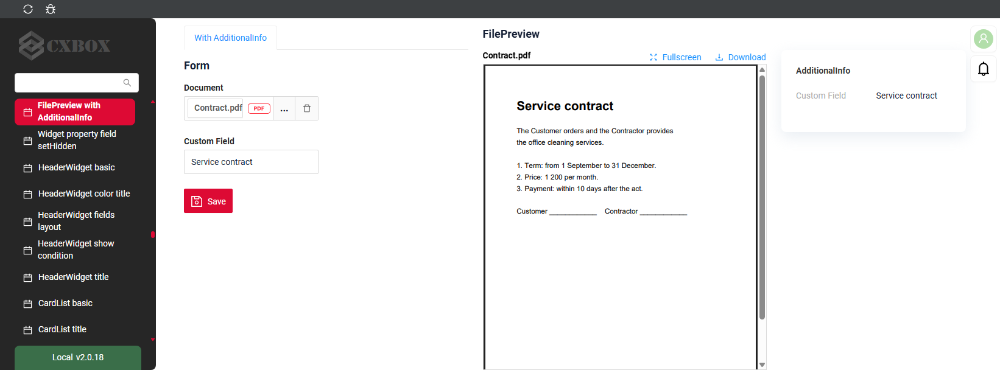
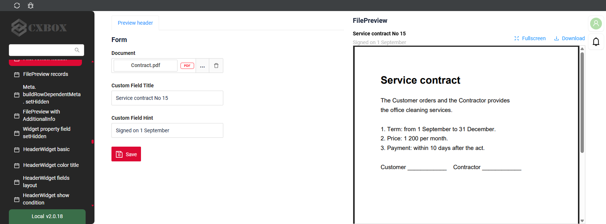
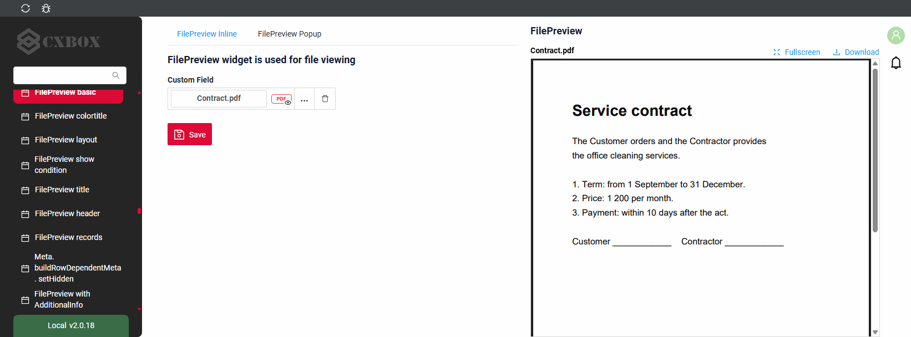
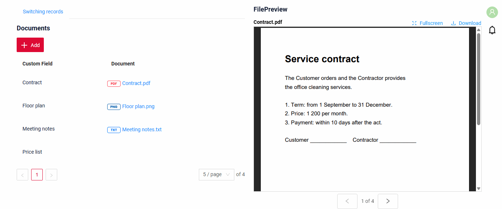

# FilePreview

`FilePreview` widget shows the file of the current record right on the page, next to the other widgets.
The user reads the document and fills in the form at the same time: the file stays in view while the page scrolls.

## Basics
[:material-play-circle: Live Sample]({{ external_links.code_samples }}/ui/#/screen/myexample5003){:target="_blank"} ·
[:fontawesome-brands-github: GitHub]({{ external_links.github_ui }}/{{ external_links.github_branch }}/src/main/java/org/demo/documentation/widgets/filepreview/base){:target="_blank"}

### How does it look?


The widget needs one field of type [fileUpload](/widget/fields/field/fileUpload/fileUpload/) with `"preview": {"enabled": true, "mode": "inline"}`.
The file is shown at once, without a popup.

* The widget always takes the right half of the view. The other widgets of the view are placed in the left half.
* The widget is fixed at the top of the screen: the file stays in view while the page scrolls.
* The widget cannot be collapsed. Its place stays the same when the record has no file.
* The widget shows the file of the current record of its business component. When another widget of the same business component selects a record, the preview shows its file.

!!! info
    Due to its fixed position, other widgets cannot be placed under FilePreview.

    `"mode": "inline"` works only in FilePreview. In other widgets the file opens in a popup, as with `"mode": "popup"`.

###  <a id="Howtoaddbacis">How to add?</a>
??? Example
    **Step1** Create file **_.widget.json_** with type = **"FilePreview"**.
    Add a field with type `fileUpload` and `"preview": {"enabled": true, "mode": "inline"}`. see more [Fields](#fields)
    ```json
    --8<--
    {{ external_links.github_raw_doc }}/widgets/filepreview/base/MyExample5003InlineFilePreview.widget.json
    --8<--
    ```

    **Step2** Add widget to corresponding **_.view.json_**. `position` and `gridWidth` do not change the place of the widget.

    ```json
    --8<--
    {{ external_links.github_raw_doc }}/widgets/filepreview/base/MyExample5003Inlineform.view.json
    --8<--
    ```

## Main visual parts
[:material-play-circle: Live Sample]({{ external_links.code_samples }}/ui/#/screen/myexample5009){:target="_blank"} ·
[:fontawesome-brands-github: GitHub]({{ external_links.github_ui }}/{{ external_links.github_branch }}/src/main/java/org/demo/documentation/widgets/filepreview/records){:target="_blank"}

* `title` - the title of the widget. see [Title](#Title)
* `header` - the file name or a field from `preview.titleKey`, the hint from `preview.hintKey`. see [Preview header](#header)
* `Fullscreen` and `Download` - buttons in the header. see [Fullscreen and Download](#fullscreen)
* `file` - pdf, image or audio. Other files and records without a file show a message. see [File types](#filetypes)
* `arrows` - switch the records of the business component, `1 of 4` shows the current one. see [Switching records](#records)

## <a id="Title">Title</a>
[:material-play-circle: Live Sample]({{ external_links.code_samples }}/ui/#/screen/myexample5007){:target="_blank"} ·
[:fontawesome-brands-github: GitHub]({{ external_links.github_ui }}/{{ external_links.github_branch }}/src/main/java/org/demo/documentation/widgets/filepreview/title){:target="_blank"}

### Title Basic
`Title` for widget (optional)

There are types of:

* `constant title`: shows constant text.
* `constant title empty`: if you want to visually connect widgets by  them to be placed one under another

#### How does it look?
=== "Constant title"
    
=== "Constant title empty"
    

#### How to add?
??? Example
    === "Constant title"
        **Step1** Add name for **title** to **_.widget.json_**.
        ```json
        --8<--
        {{ external_links.github_raw_doc }}/widgets/filepreview/title/MyExample5007FilePreview.widget.json
        --8<--
        ```
        [:material-play-circle: Live Sample]({{ external_links.code_samples }}/ui/#/screen/myexample5007/view/MyExample5007form){:target="_blank"} ·
        [:fontawesome-brands-github: GitHub]({{ external_links.github_ui }}/{{ external_links.github_branch }}/src/main/java/org/demo/documentation/widgets/filepreview/title){:target="_blank"}

    === "Constant title empty"
        **Step1** Delete parameter **title** to **_.widget.json_**.
        ```json
        --8<--
        {{ external_links.github_raw_doc }}/widgets/filepreview/title/MyExample5007FilePreviewTitleEmpty.widget.json
        --8<--
        ```
        [:material-play-circle: Live Sample]({{ external_links.code_samples }}/ui/#/screen/myexample5007/view/MyExample5007formemptytitle){:target="_blank"} ·
        [:fontawesome-brands-github: GitHub]({{ external_links.github_ui }}/{{ external_links.github_branch }}/src/main/java/org/demo/documentation/widgets/filepreview/title){:target="_blank"}

### Title Color
`Title Color` allows you to specify a color for a title. It can be constant or calculated.
The title shows field values of the current record.

**Constant color**

[:material-play-circle: Live Sample]({{ external_links.code_samples }}/ui/#/screen/myexample5004/view/MyExample5004form){:target="_blank"} ·
[:fontawesome-brands-github: GitHub]({{ external_links.github_ui }}/{{ external_links.github_branch }}/src/main/java/org/demo/documentation/widgets/filepreview/colortitle){:target="_blank"}

*Constant color* is a fixed color that doesn't change. It remains the same regardless of any factors in the application.

**Calculated color**

[:material-play-circle: Live Sample]({{ external_links.code_samples }}/ui/#/screen/myexample5004/view/MyExample5004formcalc){:target="_blank"} ·
[:fontawesome-brands-github: GitHub]({{ external_links.github_ui }}/{{ external_links.github_branch }}/src/main/java/org/demo/documentation/widgets/filepreview/colortitle){:target="_blank"}

*Calculated color* can be used to change a title color dynamically. It changes depending on business logic or data in the application.

!!! info
    Title colorization is **applicable** to the following [fields](/widget/fields/fieldtypes/): date, dateTime, dateTimeWithSeconds, number, money, percent, time, input, text, dictionary, radio, checkbox, pickList, inlinePickList, multivalue, multivalueHover, fileUpload.

##### How does it look?


##### How to add?
??? Example
    === "Calculated color"

        **Step 1**   Add `custom field for color` to corresponding **DataResponseDTO**. The field can contain a HEX color or be null.
        ```java
        --8<--
        {{ external_links.github_raw_doc }}/widgets/filepreview/colortitle/MyExample5004DTO.java:colorDTO
        --8<--
        ```

        **Step 2** Add **"bgColorKey"** :  `custom field for color` to .widget.json.

        Add in `title` field with `${customField}`

        ```json
        --8<--
        {{ external_links.github_raw_doc }}/widgets/filepreview/colortitle/MyExample5004FilePreviewCalc.widget.json
        --8<--
        ```

        [:material-play-circle: Live Sample]({{ external_links.code_samples }}/ui/#/screen/myexample5004/view/MyExample5004formcalc){:target="_blank"} ·
        [:fontawesome-brands-github: GitHub]({{ external_links.github_ui }}/{{ external_links.github_branch }}/src/main/java/org/demo/documentation/widgets/filepreview/colortitle){:target="_blank"}

    === "Constant color"

        Add **"bgColor"** :  `HEX color`  to .widget.json.

        Add in `title` field with `${customField}`

        ```json
        --8<--
        {{ external_links.github_raw_doc }}/widgets/filepreview/colortitle/MyExample5004FilePreview.widget.json
        --8<--
        ```

        [:material-play-circle: Live Sample]({{ external_links.code_samples }}/ui/#/screen/myexample5004/view/MyExample5004form){:target="_blank"} ·
        [:fontawesome-brands-github: GitHub]({{ external_links.github_ui }}/{{ external_links.github_branch }}/src/main/java/org/demo/documentation/widgets/filepreview/colortitle){:target="_blank"}

## <a id="bc">Business component</a>
This specifies the business component (BC) to which this widget belongs.
A business component represents a specific part of a system that handles a particular business logic or data.
The widget shows the file of the current record of this business component.

see more  [Business component](/environment/businesscomponent/businesscomponent/)

## <a id="Showcondition">Show condition</a>

* `no show condition - recommended`: widget always visible

  [:material-play-circle: Live Sample]({{ external_links.code_samples }}/ui/#/screen/myexample5003){:target="_blank"} ·
  [:fontawesome-brands-github: GitHub]({{ external_links.github_ui }}/{{ external_links.github_branch }}/src/main/java/org/demo/documentation/widgets/filepreview/base){:target="_blank"}

* `show condition by current entity`: condition can include boolean expression depending on current entity fields. Field updates will trigger condition recalculation only on save or if field is force active

  [:material-play-circle: Live Sample]({{ external_links.code_samples }}/ui/#/screen/myexample5006){:target="_blank"} ·
  [:fontawesome-brands-github: GitHub]({{ external_links.github_ui }}/{{ external_links.github_branch }}/src/main/java/org/demo/documentation/widgets/filepreview/showcondition){:target="_blank"}

* `show condition by parent entity`: condition can include boolean expression depending on parent entity. Parent field updates will trigger condition recalculation only on save or if field is force active shown on same view

!!! tips
    It is recommended not to use `Show condition` when possible, because wide usage of this feature makes application hard to support.

#### <a id="howdoesitlook">How does it look?</a>
=== "no show condition"
    
=== "show condition by current entity"
    

#### <a id="howtoadd">How to add?</a>
??? Example

    === "no show condition"
        see [Basic](#Howtoaddbacis)

    === "show condition by current entity"
        **Step1** Add **showCondition** to **_.widget.json_**. see more [showCondition](/widget/type/property/showcondition/showcondition)
        ```json
        --8<--
        {{ external_links.github_raw_doc }}/widgets/filepreview/showcondition/MyExample5006FilePreview.widget.json
        --8<--
        ```

## <a id="fields">Fields</a>
[:material-play-circle: Live Sample]({{ external_links.code_samples }}/ui/#/screen/myexample5002){:target="_blank"} ·
[:fontawesome-brands-github: GitHub]({{ external_links.github_ui }}/{{ external_links.github_branch }}/src/main/java/org/demo/documentation/widgets/filepreview/allpropertiesfield){:target="_blank"}

Fields Configuration. The fields array defines the file field of the widget.

```json
{
    "label": "Custom Field",
    "key": "customField",
    "type": "fileUpload",
    "fileIdKey": "customFieldId",
    "preview": {
        "enabled": true,
        "mode": "inline"
    }
}
```

* **"label"**

  Description:  Field Title.

  Type: String(optional).

* **"key"**

    Description: Name field to corresponding DataResponseDTO.

    Type: String(required).

* **"type"**

  Description: [Field types](/widget/fields/fieldtypes/)

  Type: String(required).

* **"preview"**

  Description: `"enabled": true` and `"mode": "inline"` show the file in the widget. `titleKey` and `hintKey` change the header, see [Preview header](#header).

  Type: Object(required).

The widget shows only the first field of type **fileUpload** with `"mode": "inline"`. Other fields are not shown.
Without such a field the widget shows nothing, and the browser console says why.

### How to add?
??? Example
    Add field to **_.widget.json_**.

      ```json
         --8<--
         {{ external_links.github_raw_doc }}/widgets/filepreview/allpropertiesfield/MyExample5002FilePreview.widget.json
         --8<--
      ```

## <a id="Fieldslayout">Options layout</a>
_not applicable_

## <a id="actions">Actions</a>
_not applicable_

The widget has no actions. The file is uploaded, changed and saved in another widget of the same business component, for example in a form next to it.

## Additional properties
### <a id="layout">Place on the view</a>
[:material-play-circle: Live Sample]({{ external_links.code_samples }}/ui/#/screen/myexample5005){:target="_blank"} ·
[:fontawesome-brands-github: GitHub]({{ external_links.github_ui }}/{{ external_links.github_branch }}/src/main/java/org/demo/documentation/widgets/filepreview/fieldslayoute){:target="_blank"}

* The widget takes the right half of the view with any `gridWidth` and `position`.
* A view shows one FilePreview widget: the first one in the `.view.json`. Other FilePreview widgets of the view are not shown.
* The right half stays empty while the widget is hidden by its [Show condition](#Showcondition).

### <a id="additionalinfo">With AdditionalInfo widgets</a>
[:material-play-circle: Live Sample]({{ external_links.code_samples }}/ui/#/screen/myexample5011){:target="_blank"} ·
[:fontawesome-brands-github: GitHub]({{ external_links.github_ui }}/{{ external_links.github_branch }}/src/main/java/org/demo/documentation/widgets/filepreview/additionalinfo){:target="_blank"}

When the view has [AdditionalInfo](/widget/type/additionalinfo/additionalinfo) widgets, they take the right quarter of the screen.
The rest is divided in half: the other widgets on the left, FilePreview on the right.

#### How does it look?


#### How to add?
??? Example
    Add FilePreview and AdditionalInfo widgets to **_.view.json_**.
    ```json
    --8<--
    {{ external_links.github_raw_doc }}/widgets/filepreview/additionalinfo/myexample5011addinfo.view.json
    --8<--
    ```

### <a id="header">Preview header</a>
[:material-play-circle: Live Sample]({{ external_links.code_samples }}/ui/#/screen/myexample5008){:target="_blank"} ·
[:fontawesome-brands-github: GitHub]({{ external_links.github_ui }}/{{ external_links.github_branch }}/src/main/java/org/demo/documentation/widgets/filepreview/header){:target="_blank"}

The header above the file shows the file name. It can show fields of the record instead:

* `titleKey` - the field shown instead of the file name.
* `hintKey` - the field shown under it as a hint.

#### How does it look?


#### How to add?
??? Example
    Add **titleKey** and **hintKey** to **preview** of the field in **_.widget.json_**.
    ```json
    --8<--
    {{ external_links.github_raw_doc }}/widgets/filepreview/header/MyExample5008FilePreview.widget.json
    --8<--
    ```

### <a id="fullscreen">Fullscreen and Download</a>
[:material-play-circle: Live Sample]({{ external_links.code_samples }}/ui/#/screen/myexample5003){:target="_blank"} ·
[:fontawesome-brands-github: GitHub]({{ external_links.github_ui }}/{{ external_links.github_branch }}/src/main/java/org/demo/documentation/widgets/filepreview/base){:target="_blank"}

* `Fullscreen` opens the file on the whole screen. The arrows switch the records there too; the cross returns to the view.
* `Download` saves the file.

Both buttons are always shown, no settings are needed.

#### How does it look?


### <a id="records">Switching records</a>
[:material-play-circle: Live Sample]({{ external_links.code_samples }}/ui/#/screen/myexample5009){:target="_blank"} ·
[:fontawesome-brands-github: GitHub]({{ external_links.github_ui }}/{{ external_links.github_branch }}/src/main/java/org/demo/documentation/widgets/filepreview/records){:target="_blank"}

When the business component has several records, arrows are shown under the file. They switch the current record,
so the other widgets of the same business component switch too: in the sample the list selects the row of the shown file.
The arrows go through the records of the loaded page.

#### How does it look?


#### How to add?
??? Example
    Add FilePreview and a List of the same business component to **_.view.json_**.
    ```json
    --8<--
    {{ external_links.github_raw_doc }}/widgets/filepreview/records/myexample5009list.view.json
    --8<--
    ```

### <a id="filetypes">File types</a>
[:material-play-circle: Live Sample]({{ external_links.code_samples }}/ui/#/screen/myexample5009){:target="_blank"} ·
[:fontawesome-brands-github: GitHub]({{ external_links.github_ui }}/{{ external_links.github_branch }}/src/main/java/org/demo/documentation/widgets/filepreview/records){:target="_blank"}

| File | What the widget shows |
|---|---|
| pdf | the document, with the scroll |
| image: png, jpg, gif, svg, webp and other | the image |
| audio: mp3, wav, ogg, m4a, aac, flac | the player |
| other types, for example txt, docx, xlsx | "This file type cannot be viewed" and the Download button |
| a record without a file | "There is no file in this row" |

The examples are in [Switching records](#records).

### Filtration
_not applicable_

### FullTextSearch
_not applicable_

### <a id="pagination">Pagination</a>
_not applicable_

### Export to Excel
_not applicable_

### Multi-upload files
_not applicable_

### Customization of displayed columns
_not applicable_

### Sorting
_not applicable_
