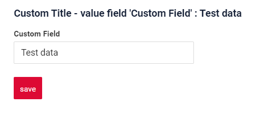

# Form
!!! warning line end "Work in progress"
 
`Form` widget is a component for data viewing and editing. Usually it shows multiple fields. Also, it can show available actions.
## Basics
[:material-play-circle: Live Sample]({{ external_links.code_samples }}/ui/#/screen/myexample3000){:target="_blank"} ·
[:fontawesome-brands-github: GitHub]({{ external_links.github_ui }}/{{ external_links.github_branch }}/src/main/java/org/demo/documentation/widgets/form/base){:target="_blank"}
### How does it look?


### How to add?
??? Example
    
    **Step1** Create file **_.widget.json_**.

    * name - (can be empty string) static
    * [title](#Title) - (optional) 
    * type = "Form" (required)
    * bc - (required)
    * fields- (required) see  [field types](/widget/fields/fieldtypes/)  
    * [options](#Fieldslayout)  

    ```json
    --8<--
    {{ external_links.github_raw }}/widgets/form/base/MyExample3000Form.widget.json
    --8<--
    ```
    **Step2** Add name widget to corresponding ****_.view.json_** **.

    ```json
    --8<--
    {{ external_links.github_raw }}/widgets/form/base/myexample3000form.view.json
    --8<--
    ```
<!-- //описать про  появлении кнопки save--->

## Main visual parts
[Title](#Title), fields block in grid, actions block
<!-- 
### How does it look?
=== "Main visual parts"
* original picture
* picture with red squares on main elements
--->
### <a id="Title">Title</a>
[:material-play-circle: Live Sample]({{ external_links.code_samples }}/ui/#/screen/myexample3003){:target="_blank"} ·
[:fontawesome-brands-github: GitHub]({{ external_links.github_ui }}/{{ external_links.github_branch }}/src/main/java/org/demo/documentation/widgets/form/title){:target="_blank"}

Title - (optional)

There are types of:

* `constant title`: shows constant text. can be empty
* `calculated title`: shows value provided in hidden text field, e.g. it can be calculated based on business logic of application

#### How does it look?
=== "Constant title"
    
=== "Constant title empty"
    
=== "Calculated title"
    
#### How to add?
??? Example
    === "Constant title"
        **Step1** Add name for **title** to **_.widget.json_**.
        ```java
        --8<--
        {{ external_links.github_raw }}/widgets/form/title/MyExample3003Form.widget.json
        --8<--
        ```
    
    === "Constant title empty"
        **Step1** Delete parameter **title** to **_.widget.json_**.
        ```java
        --8<--
        {{ external_links.github_raw }}/widgets/form/title/MyExample3003EmptyTitleForm.widget.json
        --8<--
        ```
    === "Calculated title"
        **Step1** Add filed to corresponding **DataResponseDTO**.
        ```java
        --8<--
        {{ external_links.github_raw }}/widgets/form/title/MyExample3003DTO.java
        --8<--
        ```
        **Step2** Add ${customTitleField} for **title** to **_.widget.json_**.
        ```java
        --8<--
        {{ external_links.github_raw }}/widgets/form/title/MyExample3003FormCustomTitle.widget.json
        --8<--
        ```   

###  <a id="Fieldslayout">Fields layout</a>
[:material-play-circle: Live Sample]({{ external_links.code_samples }}/ui/#/screen/myexample3004){:target="_blank"} ·
[:fontawesome-brands-github: GitHub]({{ external_links.github_ui }}/{{ external_links.github_branch }}/src/main/java/org/demo/documentation/widgets/form/fieldslayoute){:target="_blank"}

* `single column layout - recommended`: shows each field on new row. Each field can have width from 1 to 24.
* `multi column layout`: shows fields in grid. Grid can contain any number of rows. Each row can contain any number of fields, until sum of fields widths in row is less than 24. Each field can have width from 1 to 24.
* `empty`: only title and actions are shown. Usually used when standard buttons position needs to be changed (for example we want to show buttons under widget). One can hide buttons on widget with data. Create separate widget only with buttons and place it anywhere on view

!!! tip
    It is recommended to use `single column` layout when possible, because dynamic fields hiding (add link) always works correctly in this case.
 
#### How does it look?
=== "Single column layout - recommended"
     
=== "Multi column layout"
    
=== "Empty only buttons"
    
#### How to add?
??? Example
    === "Single column layout - recommended"

        **Step1** Create **"options": {"layout": {}}**.

        **Step2** Add fields to **"options": {"layout": {}}**

        Forming a row:

        * Open `cols` : "cols": [
        * Add All fields(customField,customField2,customField3) with span from 1 to 24.
        * Close `cols` : ]

        ```java
        --8<--
        {{ external_links.github_raw }}/widgets/form/fieldslayoute/MyExample3004Form.widget.json
        --8<--
        ```

    === "Multi column layout"
        **Step1** Create **"options": {"layout": {}}**.

        **Step2** Add fields to **"options": {"layout": {}}**.\

        Forming a row1 : 

        * Open `cols` : "cols": [ 
        * Add All filed(customField,customField2,customField3)
        * Check sum span <= 24 (customField span = 12,customField2 = 6, customField3 = 6 : sum 24)
        * Close `cols` : ]

        Forming a row2 : 

        * Open 'cols' : "cols": [ 
        * Add All filed(customField4)
        * Check sum span <= 24 (customField4 span = 12 : sum 12)
        * Close 'cols' : ]
 
        ```java
        --8<--
        {{ external_links.github_raw }}/widgets/form/title/MyExample3003EmptyTitleForm.widget.json
        --8<--
        ```
    === "Empty only buttons"
         **Step1** Create **"options": {"layout": {}}**.

        === "Only button 'Save'"
            On default 
            ```java
            --8<--
            {{ external_links.github_raw }}/widgets/form/fieldslayoute/MyExample3004EmptyOnlyButtonsForm.widget.json
            --8<--
            ```

        === "Without button 'Save'" 
            see [Action groups](#Actionsgroups)

        === "Other button" 
            see [Custom actions](#CustomActions)
        
### Show condition
* `no show condition - recommended`: widget always visible
* `show condition by current entity`: condition can include boolean expression depending on current entity fields. Field updates will trigger condition recalculation only on save or if field is force active
* `show condition by parent entity`: condition can include boolean expression depending on parent entity. Parent field updates will trigger condition recalculation only on save or if field is force active shown on same view
!!! tip
    It is recommended not to use `Show condition` when possible, because wide usage of this feature makes application hard to support.
<!--
#### How does it look?
=== "no show condition"
    
=== "show condition by current entity"
    TODO>>add gif
=== "show condition by parent entity"
    TODO>>add gif

#### How to add?
??? Example
    === "no show condition"
    === "show condition by current entity"
    === "show condition by parent entity"
-->

### Actions
`Actions` show available actions as separate buttons

<!--
### How does it look?
=== "actions"
##### How to add?
??? Example

### Standard actions
#### create
##### How does it look?
=== "Form widget"
##### How to add?
??? Example

#### cancel-create
##### How does it look?
=== "Form widget"
##### How to add?
??? Example

#### save
##### How does it look?
=== "Form widget"
##### How to add?
??? Example

#### delete
##### How does it look?
=== "Form widget"
##### How to add?
??? Example

#### copy
##### How does it look?
=== "Form widget"
##### How to add?
??? Example
-->

####  <a id="CustomActions">Custom actions</a>
Any custom business logic

<!--
##### features
* text - (can be empty string) static 
* icon - (optional) static
* availability condition (optional)
* preAction - (optional) CONFIRMATION,INFORMATION,ERROR,CUSTOM
* invoker - (required). can change data. can additionally return
* postAction - (optional) REFRESH_BC, DOWNLOAD_FILE, DOWNLOAD_FILE_BY_URL, OPEN_PICK_LIST, DRILL_DOWN, DELAYED_REFRESH_BC, SHOW_MESSAGE, POST_DELETE
* fields validation results
* business and other exceptions
* scope - (required) bc, record
* AutoSaveBefore (optional)
 
### How does it look?
=== "text"
    === "empty"
    === "filled"
=== "icon"
    === "only icon"
    === "icon and text"
=== "availability"
    === "false"
    === "true"
=== "preAction"
    === "CONFIRMATION"
    === "INFORMATION"
    === "ERROR"
=== "postAction"
    === "DRILL_DOWN"
    === "DOWNLOAD_FILE"
    === "SHOW_MESSAGE"
    === "REFRESH_BC"
    === "...Deprecated"
        === "DOWNLOAD_FILE_BY_URL"
        === "OPEN_PICK_LIST"
        === "DELAYED_REFRESH_BC"
        === "POST_DELETE"
=== "scope bc"
    === "bc"
    === "record"
-->
#### <a id="Actionsgroups">Actions groups</a>
`Actions groups` group subset of available actions into a single button with drop down

<!--
##### How does it look?
=== "Form widget"
##### How to add?
??? Example

-->