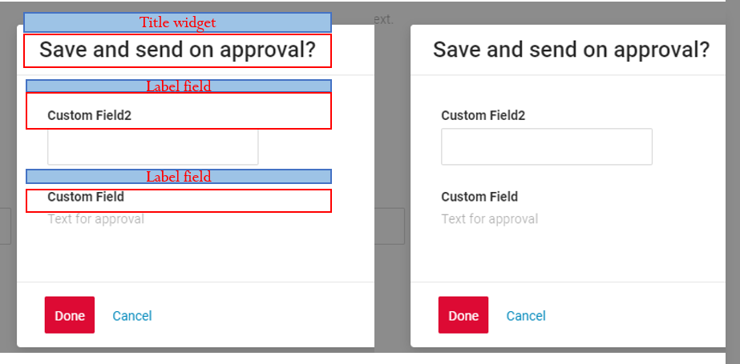

# FormPopup

`FormPopup` is a component for additional field checks in popup and the ability to add information inside the popup.

## Basics
[:material-play-circle: Live Sample]({{ external_links.code_samples }}/ui/#/screen/myexample3400){:target="_blank"} ·
[:fontawesome-brands-github: GitHub]({{ external_links.github_ui }}/{{ external_links.github_branch }}/src/main/java/org/demo/documentation/widgets/formpopup/base){:target="_blank"}
### How does it look?


###  <a id="Howtoaddbacis">How to add?</a>
??? Example
    
    **Step1**  Add type **"FormPopup"** to **BaseFieldExtractor**.
    ```java
	@Override
	public List<String> getSupportedTypes() {
		return Lists.newArrayList(
				"Funnel",
				"RingProgress",
				"DashboardList",
				"FormPopup"
		);
	}
    ```
    **Step2**  Add file **"ActionsExt"**.
    ```java
    @UtilityClass
    public class ActionsExt {

        public static PreAction confirmWithCustomWidget(@Nullable String message, @Nullable String widget, @Nullable String yesButton, @Nullable String noButton) {
            Map<String, String> customParameters = new HashMap<>();
            customParameters.put("subtype", "confirmWithCustomWidget");
            if (widget != null) {
                customParameters.put("widget", widget);
            }
            if (yesButton != null) {
                customParameters.put("yesText", yesButton);
            }
            if (noButton != null) {
                customParameters.put("noText", noButton);
            }
            return PreAction.custom(message, customParameters);
        }
    
    }
    ```
    **Step3** Add a button **"save-send"** that raises the widget Popup
    ```java
    --8<--
    {{ external_links.github_raw_doc }}/widgets/formpopup/base/MyExample3400FormButton.widget.json
    --8<--
    ```
    **Step4** Add widget with type **FormPopup**
    ```json
    --8<--
    {{ external_links.github_raw_doc }}/widgets/formpopup/base/MyExample3400Formpopup.widget.json
    --8<--
    ```
    **Step5** Add widget **FormPopup** on view
    ```json
    --8<--
    {{ external_links.github_raw_doc }}/widgets/formpopup/base/myexample3400formpopup.view.json
    --8<--
    ```
    **Step6** Add **withPreAction** with action **confirmWithCommentwith**
    ```java
    --8<--
    {{ external_links.github_raw_doc }}/widgets/formpopup/base/MyExample3400Service.java
    --8<--
    ```
## Main visual parts
### Title
_not applicable_

### Icon
_not applicable_

### Color
_not applicable_

### Fields layout
_not applicable_

### Show condition
_not applicable_

### Actions
`Actions` show available actions as separate buttons
see [Actions](/features/element/actions/actions)

<!-- 
## Main visual parts
[Title](#Title), [fields block](#Fieldslayout) in grid, [actions block](#Showcondition)

### <a id="Title">Title</a>
[:material-play-circle: Live Sample]({{ external_links.code_samples }}/ui/#/screen/myexample3003){:target="_blank"} ·
[:fontawesome-brands-github: GitHub]({{ external_links.github_ui }}/{{ external_links.github_branch }}/src/main/java/org/demo/documentation/widgets/form/title){:target="_blank"}

Title - (optional)

    

There are types of:

* `constant title`: shows constant text.
* `calculated title`: shows value provided in hidden text field, e.g. it can be calculated based on business logic of application

#### How does it look?
=== "Constant title"
    
=== "Calculated title"
    
#### How to add?
??? Example
    === "Constant title"
        **Step1** Add name for **title** to **_.widget.json_**.
        ```java
        --8<--
        {{ external_links.github_raw_doc }}/widgets/form/title/MyExample3003Form.widget.json
        --8<--
        ```

    === "Calculated title"
 
        **Step1** Add ${customField} for **title** to **_.widget.json_**.
        ```java
        --8<--
        {{ external_links.github_raw_doc }}/widgets/form/title/MyExample3003FormCustomTitle.widget.json
        --8<--
        ```   
 
###  <a id="Fieldslayout">Fields layout</a>
[:material-play-circle: Live Sample]({{ external_links.code_samples }}/ui/#/screen/myexample3004){:target="_blank"} ·
[:fontawesome-brands-github: GitHub]({{ external_links.github_ui }}/{{ external_links.github_branch }}/src/main/java/org/demo/documentation/widgets/form/fieldslayoute){:target="_blank"}

* `single column layout - recommended`: shows each field on new row. Each field can have width from 1 to 24.
* `multi column layout`: shows fields in grid. Grid can contain any number of rows. Each row can contain any number of fields, until sum of fields widths in row is less than 24. Each field can have width from 1 to 24.
* `empty`: only title and actions are shown. Usually used when standard buttons position needs to be changed (for example we want to show buttons under widget). One can hide buttons on widget with data. Create separate widget only with buttons and place it anywhere on view

!!! tips
    It is recommended to use `single column` layout when possible, because dynamic fields hiding (add link) always works correctly in this case.

!!! info
    The line has a size of 24 span, if you define fields on one line with a field width sum exceeding 24 span in total,that field and any subsequent fields will be moved to a new line . This means that each line will accommodate fields until the total width reaches 24 span, and any excess width will continue on the next line.
    
    For example, you have three fields with widths of 12, 8, and 10 characters, respectively. In this case, the first field and two field will fit completely on the first line as it is within the 24-character limit. However, the thirt field's width contributes to the totat.It has finally become more 24. As a result, the third field will be moved to the next line.


#### How does it look?
=== "Single column layout - recommended"
     
=== "Multi column layout"
    
=== "Empty only buttons"
    
#### How to add?
??? Example
    === "Single column layout - recommended"

        **Step1** Create **"options": {"layout": {}}**.

        **Step2** Add fields to **"options": {"layout": {}}**

        Forming rows:

        * Open `cols` : "cols": [
        * Add All fields(customField,customField2,customField3) with span from 1 to 24.
        * Close `cols` : ]

        ```json
        --8<--
        {{ external_links.github_raw_doc }}/widgets/form/fieldslayoute/MyExample3004Form.widget.json
        --8<--
        ```

    === "Multi column layout"
        **Step1** Create **"options": {"layout": {}}**.

        **Step2** Add fields to **"options": {"layout": {}}**.

        Forming row1 : 

        * Open `cols` : "cols": [ 
        * Add all feild : customField,customField2,customField3
        * Check sum span <= 24: customField (span = 12),customField2 = 6, customField3 = 6 : sum 24)
        * Close `cols` : ]

        Forming a row2 : 

        * Open 'cols' : "cols": [ 
        * Add All filed(customField4)
        * Check sum span <= 24 (customField4 span = 12 : sum 12)
        * Close 'cols' : ]
 
        ```json
        --8<--
        {{ external_links.github_raw_doc }}/widgets/form/title/MyExample3004MultiColumnForm.widget.json
        --8<--
        ```
    === "Empty only buttons"
        **Step1** Create **"options": {"layout": {}}**.

        Button "Create" - On default

        ```json
        --8<--
        {{ external_links.github_raw_doc }}/widgets/form/fieldslayoute/MyExample3004EmptyOnlyButtonsForm.widget.json
        --8<--
        ```
###  <a id="Fieldslayout">Fields layout</a>
**options.layout** - no use in this type.
###  <a id="Showcondition">Show condition</a>
_not applicable_

### Actions
`Actions` show available actions as separate buttons
see [Actions](/features/element/actions/actions)
-->