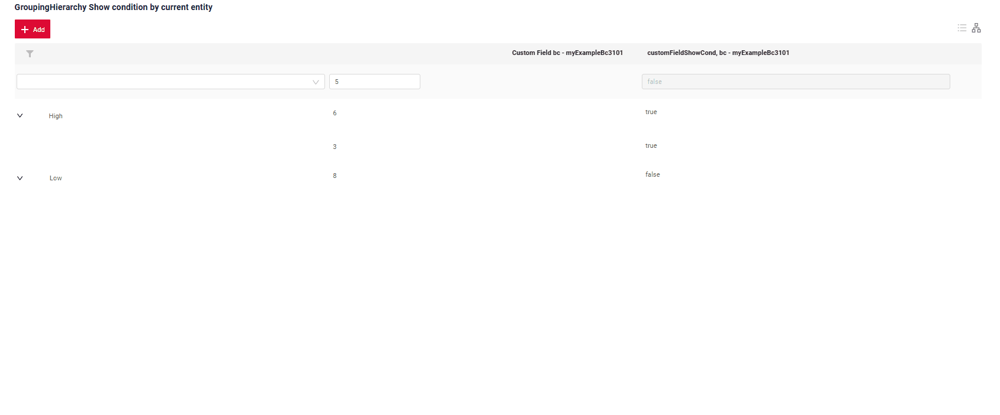

# GroupingHierarchy
 
`GroupingHierarchy`  widget presents shared information across multiple records, enabling rows to be grouped by one or more specified fields.

## Basics
[:material-play-circle: Live Sample]({{ external_links.code_samples }}/ui/#/screen/myexample3121){:target="_blank"} ·
[:fontawesome-brands-github: GitHub]({{ external_links.github_ui }}/{{ external_links.github_branch }}/src/main/java/org/demo/documentation/widgets/groupinghierarhy/base){:target="_blank"}

!!! info
    In `GroupingHierarchy` mode, all data should be sourced from the backend (e.g., with a backend page size set to 1000), 
    grouping is handled in-memory on the front end.

    If the backend indicates that the total line count exceeds the page size, the widget will switch to "GroupingHierarchy" mode, and the mode-switching icon will be highlighted in red. 
    Hovering over the icon will display the message "Warning!Rows were fetched from backend - limit for "Grouping Hierarhical" mode is ...(1000). Only "GroupingHierarchy" mode is available""

In "Grouping Hierarchy" mode, the number of nesting levels is unlimited.

### How does it look?


###  <a id="Howtoaddbacis">How to add?</a> 
??? Example
    **Step1** Create file **_.widget.json_** with type = **"GroupingHierarchy"**
    Add existing field to a GroupingHierarchy widget. see more [Fields](#fields)
    ```json
    --8<--
    {{ external_links.github_raw_doc }}/widgets/groupinghierarhy/base/MyExample3121GH.widget.json
    --8<--
    ```
 
    **Step2** Add widget to corresponding ****_.view.json_** **.

    ```json
    --8<--
    {{ external_links.github_raw_doc }}/widgets/groupinghierarhy/base/myexample3121gh.view.json
    --8<--
    ```

    [:material-play-circle: Live Sample]({{ external_links.code_samples }}/ui/#/screen/myexample3121){:target="_blank"} ·
    [:fontawesome-brands-github: GitHub]({{ external_links.github_ui }}/{{ external_links.github_branch }}/src/main/java/org/demo/documentation/widgets/groupinghierarhy/base){:target="_blank"}

 
## <a id="Title">Title</a>
[:material-play-circle: Live Sample]({{ external_links.code_samples }}/ui/#/screen/myexample3139){:target="_blank"} ·
[:fontawesome-brands-github: GitHub]({{ external_links.github_ui }}/{{ external_links.github_branch }}/src/main/java/org/demo/documentation/widgets/groupinghierarhy/title){:target="_blank"}

### Title Basic
`Title` for widget (optional)

There are types of:

* `constant title`: shows constant text.
* `constant title empty`: if you want to visually connect widgets by  them to be placed one under another
 
#### How does it look?
=== "Constant title"
    
=== "Constant title empty"
    
 
#### How to add?
??? Example
    === "Constant title"
        **Step1** Add name for **title** to **_.widget.json_**.
        ```json
        --8<--
        {{ external_links.github_raw_doc }}/widgets/groupinghierarhy/title/MyExample3139GH.widget.json
        --8<--
        ```
        [:material-play-circle: Live Sample]({{ external_links.code_samples }}/ui/#/screen/myexample3139){:target="_blank"} ·
        [:fontawesome-brands-github: GitHub]({{ external_links.github_ui }}/{{ external_links.github_branch }}/src/main/java/org/demo/documentation/widgets/groupinghierarhy/title){:target="_blank"}


    === "Constant title empty"

        **Step1** Delete parameter **title** to **_.widget.json_**.
        ```json
        --8<--
        {{ external_links.github_raw_doc }}/widgets/groupinghierarhy/title/MyExample3139EmptyTitle.widget.json
        --8<--
        ```

        [:material-play-circle: Live Sample]({{ external_links.code_samples }}/ui/#/screen/myexample3139){:target="_blank"} ·
        [:fontawesome-brands-github: GitHub]({{ external_links.github_ui }}/{{ external_links.github_branch }}/src/main/java/org/demo/documentation/widgets/groupinghierarhy/title){:target="_blank"}
        

### Title Color
`Title Color` allows you to specify a color for a title. It can be constant or calculated.

**Constant color**

[:material-play-circle: Live Sample]({{ external_links.code_samples }}/ui/#/screen/myexample3133/view/myexample3133constcolor){:target="_blank"} ·
[:fontawesome-brands-github: GitHub]({{ external_links.github_ui }}/{{ external_links.github_branch }}/src/main/java/org/demo/documentation/widgets/groupinghierarhy/colortitle){:target="_blank"}

*Constant color* is a fixed color that doesn't change. It remains the same regardless of any factors in the application.

**Calculated color**

[:material-play-circle: Live Sample]({{ external_links.code_samples }}/ui/#/screen/myexample3133/view/myexample3133){:target="_blank"} ·
[:fontawesome-brands-github: GitHub]({{ external_links.github_ui }}/{{ external_links.github_branch }}/src/main/java/org/demo/documentation/widgets/groupinghierarhy/colortitle){:target="_blank"}

*Calculated color* can be used to change a title color dynamically. It changes depending on business logic or data in the application.

!!! info
    Title colorization is **applicable** to the following [fields](/widget/fields/fieldtypes/): date, dateTime, dateTimeWithSeconds, number, money, percent, time, input, text, dictionary, radio, checkbox, multivalue, multivalueHover.

##### How does it look?


##### How to add?
??? Example
    === "Calculated color"

        **Step 1**   Add `custom field for color` to corresponding **DataResponseDTO**. The field can contain a HEX color or be null.
        ```java
        --8<--
        {{ external_links.github_raw_doc }}/widgets/groupinghierarhy/colortitle/MyExample3133DTO.java
        --8<--
        ```  
 
        **Step 2** Add **"bgColorKey"** :  `custom field for color` and  to .widget.json.

        Add in `title` field with `${customField}` 

        ```json
        --8<--
        {{ external_links.github_raw_doc }}/widgets/groupinghierarhy/colortitle/MyExample3133.widget.json
        --8<--
        ``` 

        [:material-play-circle: Live Sample]({{ external_links.code_samples }}/ui/#/screen/myexample3133/view/myexample3133){:target="_blank"} ·
        [:fontawesome-brands-github: GitHub]({{ external_links.github_ui }}/{{ external_links.github_branch }}/src/main/java/org/demo/documentation/widgets/groupinghierarhy/colortitle){:target="_blank"}

    === "Constant color"
 
        Add **"bgColor"** :  `HEX color`  to .widget.json.

        Add in `title` field with `${customField}` 

        ```json
        --8<--
        {{ external_links.github_raw_doc }}/widgets/groupinghierarhy/colortitle/MyExample3050ColorConst.widget.json
        --8<--
        ```

        [:material-play-circle: Live Sample]({{ external_links.code_samples }}/ui/#/screen/myexample3133/view/myexample3133constcolor){:target="_blank"} ·
        [:fontawesome-brands-github: GitHub]({{ external_links.github_ui }}/{{ external_links.github_branch }}/src/main/java/org/demo/documentation/widgets/groupinghierarhy/colortitle){:target="_blank"}

## <a id="bc">Business component</a>
This specifies the business component (BC) to which this form belongs.
A business component represents a specific part of a system that handles a particular business logic or data.

see more  [Business component](/environment/businesscomponent/businesscomponent/)

## <a id="Showcondition">Show condition</a>

[:material-play-circle: Live Sample]({{ external_links.code_samples }}/ui/#/screen/myexample3002){:target="_blank"} ·
[:fontawesome-brands-github: GitHub]({{ external_links.github_ui }}/{{ external_links.github_branch }}/src/main/java/org/demo/documentation/widgets/groupinghierarhy/base){:target="_blank"}

* `no show condition - recommended`: widget always visible

[:material-play-circle: Live Sample]({{ external_links.code_samples }}/ui/#/screen/myexample3101){:target="_blank"} ·
[:fontawesome-brands-github: GitHub]({{ external_links.github_ui }}/{{ external_links.github_branch }}/src/main/java/org/demo/documentation/widgets/groupinghierarhy/showcondition/byparententity){:target="_blank"}

* `show condition by current entity`: condition can include boolean expression depending on current entity fields. Field updates will trigger condition recalculation only on save or if field is force active

<!--
  [:material-play-circle: Live Sample]({{ external_links.code_samples }}/ui/#/screen/myexample3005/view/myexample3007showcondform){:target="_blank"} ·
  [:fontawesome-brands-github: GitHub]({{ external_links.github_ui }}/{{ external_links.github_branch }}/src/main/java/org/demo/documentation/widgets/form/showcondition/bycurrententity){:target="_blank"}
 
* `show condition by parent entity`: condition can include boolean expression depending on parent entity. Parent field updates will trigger condition recalculation only on save or if field is force active shown on same view
-->
!!! tips
    It is recommended not to use `Show condition` when possible, because wide usage of this feature makes application hard to support.

#### <a id="howdoesitlook">How does it look?</a>
=== "no show condition"
    
=== "show condition by current entity"
    
<!--
=== "show condition by parent entity"
    
-->

#### <a id="howtoadd">How to add?</a>
??? Example

    === "no show condition"
        see [Basics](#Howtoaddbacis)

    === "show condition by current entity"
        **Step1** Add **showCondition** to **_.widget.json_**. see more [showCondition](/widget/type/property/showcondition/showcondition)
        ```json
        --8<--
        {{ external_links.github_raw_doc }}/widgets/groupinghierarhy/showcondition/bycurrententity/MyExample31012.widget.json
        --8<--
        ```
<!--
    === "show condition by parent entity"
        **Step1** Add **showCondition** to **_.widget.json_**. see more [showCondition](/widget/type/property/showcondition/showcondition)
        ```json
        --8<--
        {{ external_links.github_raw_doc }}/widgets/groupinghierarhy/showcondition/byparententity/child/MyExample3107.widget.json
        --8<--
        ```
-->

## <a id="fields">Fields</a>
Fields Configuration. The fields array defines the individual fields present within the form.

```json
{
    "title": "Custom Field",
    "key": "customField",
    "type": "input"
}
```

* **"title"**

  Description:  Field Title.
  
  Type: String(required).
  
* **"key"**
  
    Description: Name field to corresponding DataResponseDTO.
  
    Type: String(required).
  
* **"type"**
  
  Description: [Field types](/widget/fields/fieldtypes/)
  
  Type: String(required).

### How to add?
??? Example

    === "With plugin(recommended)"
        **Step 1** Download plugin
            [download Intellij Plugin](https://plugins.jetbrains.com/plugin/195-tesler-helper)
    
        **Step 2** Add existing field to an existing form widget
            

    === "Example of writing code"
        Add field to **_.widget.json_**.

        ```json
        --8<--
        {{ external_links.github_raw_doc }}/widgets/groupinghierarhy/base/MyExample3121GH.widget.json
        --8<--
        ```

## <a id="Fieldslayout">Options layout</a>
**options.layout** - no use in this type.


## Actions
`Actions` show available actions as separate buttons see more [Actions](/features/element/actions/actions).

As for GroupingHierarchy widget, there are several actions. 
#### Create 
`Create` button enables you to create a new value by clicking the `Add` button. This action can be performed in three different ways, feel free to choose any, depending on your logic of application:   

There are three methods to create a record:

1. [Line addition](#createbasic): You can add a line directly.

!!! info
    Pagination won't function until the page is refreshed after adding records.

2. [With widget](#withwidget): You can add data using a form widget without leaving your current view.

3. [With view](#withview): You can create a record by navigating to a view.

##### <a id="createbasic">Line addition</a>
[:material-play-circle: Live Sample]({{ external_links.code_samples }}/ui/#/screen/myexample3059){:target="_blank"} ·
[:fontawesome-brands-github: GitHub]({{ external_links.github_ui }}/{{ external_links.github_branch }}/src/main/java/org/demo/documentation/widgets/groupinghierarhy/actions/create/basic){:target="_blank"}

With `Line Addition`, a new empty row is immediately added to the top of the GroupingHierarchy widget when the "Add" button is clicked. This is a quick way to add rows without needing to input data beforehand.
###### How does it look?


###### How to add?
??? Example
    
    **Step1** Add button `create` to corresponding **VersionAwareResponseService**. 
    ```java
    --8<--
    {{ external_links.github_raw_doc }}/widgets/groupinghierarhy/actions/create/basic/MyExample3059Service.java:getActions
    --8<--
    ```
     **Step2** Add button `create` to corresponding **.widget.json**. 
    ```json
    --8<--
    {{ external_links.github_raw_doc }}/widgets/groupinghierarhy/actions/create/basic/MyExample3059GroupingHierarchy.widget.json
    --8<--
    ```
     **Step3** Add **fields.setEnabled** to corresponding **FieldMetaBuilder**.
    ```java
    --8<--
    {{ external_links.github_raw_doc }}/widgets/groupinghierarhy/actions/create/basic/MyExample3059Meta.java:buildRowDependentMeta
    --8<--
    ```
    [:material-play-circle: Live Sample]({{ external_links.code_samples }}/ui/#/screen/myexample3059){:target="_blank"} ·
    [:fontawesome-brands-github: GitHub]({{ external_links.github_ui }}/{{ external_links.github_branch }}/src/main/java/org/demo/documentation/widgets/groupinghierarhy/actions/create/basic){:target="_blank"}

##### <a id="withwidget">With widget</a> 
[:material-play-circle: Live Sample]({{ external_links.code_samples }}/ui/#/screen/myexample3064){:target="_blank"} ·
[:fontawesome-brands-github: GitHub]({{ external_links.github_ui }}/{{ external_links.github_branch }}/src/main/java/org/demo/documentation/widgets/groupinghierarhy/actions/create/withwidget){:target="_blank"}

`Create with widget` opens an additional widget when the "Add" button is clicked. The form will appear on the same screen, allowing you to view both the GroupingHierarchy of entities and the form for adding a new row. 
After filling the information in and clicking "Save", the new row is added to the GroupingHierarchy. 
###### How does it look?


###### How to add?
??? Example

    **Step1** Add button `create` to corresponding **VersionAwareResponseService**. 
    ```java
    --8<--
    {{ external_links.github_raw_doc }}/widgets/groupinghierarhy/actions/create/withwidget/MyExample3064Service.java:getActions
    --8<--
    ```
    **Step2** Add **fields.setEnabled** to corresponding **FieldMetaBuilder**.
    ```java
    --8<--
    {{ external_links.github_raw_doc }}/widgets/groupinghierarhy/actions/create/withwidget/MyExample3064Meta.java:buildRowDependentMeta
    --8<--
    ```

     **Step3** Create widget.json with type `Form` that appears when you click a button
    ```json
    --8<--
    {{ external_links.github_raw_doc }}/widgets/groupinghierarhy/actions/create/withwidget/myEntity3064CreateForm.widget.json
    --8<--
    ```
 
     **Step4** Add widget.json with type `Form` to corresponding **.view.json**. 
    ```json
    --8<--
    {{ external_links.github_raw_doc }}/widgets/groupinghierarhy/actions/create/withwidget/myexample3064GroupingHierarchy.view.json
    --8<--
    ```

     **Step5** Add button `create` and widget with type `Form` to corresponding **.widget.json**.
       
    `options`.`create`: Name widget that appears when you click a button
        
    ```json
    --8<--
    {{ external_links.github_raw_doc }}/widgets/groupinghierarhy/actions/create/withwidget/MyExample3064GroupingHierarchy.widget.json
    --8<--
    ```

    [:material-play-circle: Live Sample]({{ external_links.code_samples }}/ui/#/screen/myexample3064){:target="_blank"} ·
    [:fontawesome-brands-github: GitHub]({{ external_links.github_ui }}/{{ external_links.github_branch }}/src/main/java/org/demo/documentation/widgets/groupinghierarhy/actions/create/withwidget){:target="_blank"}

##### <a id="withview">With view</a>
[:material-play-circle: Live Sample]({{ external_links.code_samples }}/ui/#/screen/myexample3066){:target="_blank"} ·
[:fontawesome-brands-github: GitHub]({{ external_links.github_ui }}/{{ external_links.github_branch }}/src/main/java/org/demo/documentation/widgets/groupinghierarhy/actions/create/newview){:target="_blank"}

With `Create with view`, clicking the "Add" button opens a separate view that displays only the data entry form. After completing the form and saving, the system returns to the GroupingHierarchy of entities with the new row added. 
###### How does it look? 


###### How to add?
??? Example

    **Step1** Add button `create` to corresponding **VersionAwareResponseService**. 
    ```java
    --8<--
    {{ external_links.github_raw_doc }}/widgets/groupinghierarhy/actions/create/newview/MyExample3066Service.java:getActions
    --8<--
    ```
     **Step2** Add **PostAction.drillDown** to method **doCreateEntity** to corresponding **VersionAwareResponseService**. 
    ```java
    --8<--
    {{ external_links.github_raw_doc }}/widgets/groupinghierarhy/actions/create/newview/MyExample3066Service.java:doCreateEntity
    --8<--
    ```
    **Step4** Add button `create` to corresponding **.widget.json**.
  
    ```json
    --8<--
    {{ external_links.github_raw_doc }}/widgets/groupinghierarhy/actions/create/newview/MyExample3066GroupingHierarchy.widget.json
    --8<--
    ```

    [:material-play-circle: Live Sample]({{ external_links.code_samples }}/ui/#/screen/myexample3066){:target="_blank"} ·
    [:fontawesome-brands-github: GitHub]({{ external_links.github_ui }}/{{ external_links.github_branch }}/src/main/java/org/demo/documentation/widgets/groupinghierarhy/actions/create/newview){:target="_blank"}


#### Edit 
`Edit` enables you to change the field value. Just like with `Create` button, there are three ways of implementing this Action. 

There are three methods to create a record:

1. [Line edit](#editline): You can edit a line directly.

2. [With widget](#editwithwidget): You can edit data using a form widget without leaving your current view.

3. [With view](#editwithview): You can edit a record by navigating to a view.

##### <a id="editline">Line edit </a>
[:material-play-circle: Live Sample]({{ external_links.code_samples }}/ui/#/screen/myexample3700){:target="_blank"} ·
[:fontawesome-brands-github: GitHub]({{ external_links.github_ui }}/{{ external_links.github_branch }}/src/main/java/org/demo/documentation/widgets/groupinghierarhy/actions/edit/basic){:target="_blank"}


`Edit Basic` implies inline-edit. Click twice on the value you want to change.
###### How does it look?


###### How to add?
??? Example

    **Step1** Add **fields.setEnabled** to corresponding **FieldMetaBuilder**.
    ```java
    --8<--
    {{ external_links.github_raw_doc }}/widgets/groupinghierarhy/actions/edit/basic/MyExample3700Meta.java:buildRowDependentMeta
    --8<--
    ```
 
    [:material-play-circle: Live Sample]({{ external_links.code_samples }}/ui/#/screen/myexample3700){:target="_blank"} ·
    [:fontawesome-brands-github: GitHub]({{ external_links.github_ui }}/{{ external_links.github_branch }}/src/main/java/org/demo/documentation/widgets/groupinghierarhy/actions/edit/basic){:target="_blank"}

##### <a id="editwithwidger">With widget</a>
[:material-play-circle: Live Sample]({{ external_links.code_samples }}/ui/#/screen/myexample3065){:target="_blank"} ·
[:fontawesome-brands-github: GitHub]({{ external_links.github_ui }}/{{ external_links.github_branch }}/src/main/java/org/demo/documentation/widgets/groupinghierarhy/actions/edit/withwidget){:target="_blank"}

`Edit with widget` opens an additional widget when clicking on the Edit option from a three-dot menu. 

###### How does it look?


###### How to add?
??? Example

    **Step1** Add button `edit` to corresponding **VersionAwareResponseService**.
    ```java
    --8<--
    {{ external_links.github_raw_doc }}/widgets/groupinghierarhy/actions/edit/withwidget/MyExample3065Service.java:getActions
    --8<--
    ```

    **Step2** Add **fields.setEnabled** to corresponding **FieldMetaBuilder**.
    ```java
    --8<--
    {{ external_links.github_raw_doc }}/widgets/groupinghierarhy/actions/edit/withwidget/MyExample3065Meta.java:buildRowDependentMeta
    --8<--
    ```
 
    **Step2**  Create widget.json with type `Form` that appears when you click a button
    ```json
    --8<--
    {{ external_links.github_raw_doc }}/widgets/groupinghierarhy/actions/edit/withwidget/myEntity3065EditForm.widget.json
    --8<--
    ```
 
     **Step4** Add widget.json with type `Form` to corresponding **.view.json**. 
    ```json
    --8<--
    {{ external_links.github_raw_doc }}/widgets/groupinghierarhy/actions/edit/withwidget/myexample3065GroupingHierarchy.view.json
    --8<--
    ```

     **Step5** Add button `edit` and widget with type `Form` to corresponding **.widget.json**.
       
    `options`.`edit`: Name widget that appears when you click a button
        
    ```json
    --8<--
    {{ external_links.github_raw_doc }}/widgets/groupinghierarhy/actions/edit/withwidget/MyExample3065GroupingHierarchy.widget.json
    --8<--
    ```

    [:material-play-circle: Live Sample]({{ external_links.code_samples }}/ui/#/screen/myexample3065){:target="_blank"} ·
    [:fontawesome-brands-github: GitHub]({{ external_links.github_ui }}/{{ external_links.github_branch }}/src/main/java/org/demo/documentation/widgets/groupinghierarhy/actions/edit/withwidget){:target="_blank"}

##### <a id="editwithview">With view</a>
[:material-play-circle: Live Sample]({{ external_links.code_samples }}/ui/#/screen/myexample3075){:target="_blank"} ·
[:fontawesome-brands-github: GitHub]({{ external_links.github_ui }}/{{ external_links.github_branch }}/src/main/java/org/demo/documentation/widgets/groupinghierarhy/actions/edit/newview){:target="_blank"}

With `Edit with view`, you can edit the entity from a separate view that displays only the data entry form. Click on the "Edit" option in the three-dot menu.  

###### How does it look? 


###### How to add?
??? Example

    **Step1** Add action *edit* to corresponding **VersionAwareResponseService**. 
    
    Add **PostAction.drillDown** to method *edit*

    ```java
    --8<--
    {{ external_links.github_raw_doc }}/widgets/groupinghierarhy/actions/create/newview/MyExample3066Service.java:getActions
    --8<--
    ```
    **Step2** Add button ot group button to corresponding **.widget.json**.
   
    ```json
    --8<--
    {{ external_links.github_raw_doc }}/widgets/groupinghierarhy/actions/edit/withwidget/MyExample3065GroupingHierarchy.widget.json
    --8<--
    ```
    [:material-play-circle: Live Sample]({{ external_links.code_samples }}/ui/#/screen/myexample3075){:target="_blank"} ·
    [:fontawesome-brands-github: GitHub]({{ external_links.github_ui }}/{{ external_links.github_branch }}/src/main/java/org/demo/documentation/widgets/groupinghierarhy/actions/edit/newview){:target="_blank"}


### Additional properties

Alternate Columns (Opening Columns) The columns that organize the group cannot be closed or moved. They are always provided at the beginning of the widget in the specified order, basically blocking the widget fields. When switching to the "Table" mode (table), the restriction is preserved
#### FullTextSearch
`FullTextSearch` - when the user types in the full text search input area, then widget filters the rows that match the search query.
see [FullTextSearch](/features/element/filtration/fulltextsearch/fulltextsearch/)

