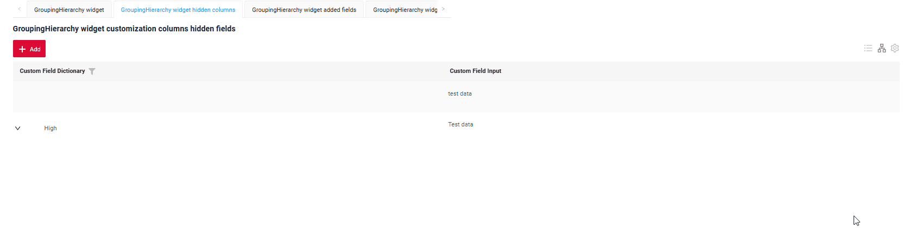
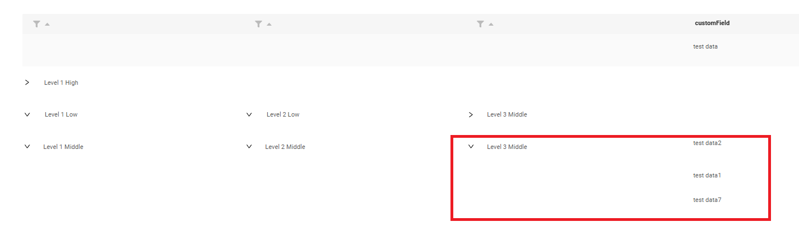

# GroupingHierarchy
 
`GroupingHierarchy`  widget presents shared information across multiple records, enabling rows to be grouped by one or more specified fields.


The availability of this function depends on the type:

This function is available for: MultivalueHover, Hint, Multivalue, MultipleSelect, Inline, PickList, Radio, Money, Number, Dictionary, DateTimeWithSeconds, Date, Checkbox, DateTime, Text, FileUpload.

See more [field types](/widget/fields/fieldtypes/)

## Basics
[:material-play-circle: Live Sample]({{ external_links.code_samples }}/ui/#/screen/myexample3121){:target="_blank"} ·
[:fontawesome-brands-github: GitHub]({{ external_links.github_ui }}/{{ external_links.github_branch }}/src/main/java/org/demo/documentation/widgets/groupinghierarhy/base){:target="_blank"}

`Grouping Hierarchy` mode features :

* All data should be sourced from the backend (e.g., with a backend page size set to 1000), 
    grouping is handled in-memory on the front end.

    If the backend indicates that the total line count exceeds the page size, the widget will switch to List mode, and the mode-switching icon will be highlighted in red. 
    Hovering over the icon will display the message `Warning!Rows were fetched from backend - limit for Grouping Hierarhical mode is ...(1000). Only GroupingHierarchy mode is available.`
    see more [Default limit page](/widget/type/property/defaultlimitpage/defaultlimitpage)

* The number of nesting levels is unlimited.

* Fields containing either a single element or no elements are displayed in their expanded form by default.The line is expanded by default if the expanded branch occupies the same amount of space as it does when collapsed.

* This widget is essentially a List widget with an added "grouping" feature, allowing users to toggle between a standard table view and a "grouping hierarchy" view.
 

### How does it look?
=== "Basic"
    
=== "Groupinghierarhy to List"
    

###  <a id="Howtoaddbacis">How to add?</a> 
??? Example
    **Step1** Create file **_.widget.json_** with type = **"GroupingHierarchy"**

    Add parameter **groupingHierarchy** with field for grouping.
    Fields keys from Fields widget block separated with comma.
    Field order is not important and will be taken from Fields block.

    ```json
     "groupingHierarchy": {
      "fields": [
        "customFieldDictionary"
      ]
    }
    ```

    Add existing field to a GroupingHierarchy widget. see more [Fields](#fields)
    ```json
    --8<--
    {{ external_links.github_raw_doc }}/widgets/groupinghierarhy/base/MyExample3121GH.widget.json
    --8<--
    ```
 
    **Step2** Add widget to corresponding ****_.view.json_** **.

    ```json
    --8<--
    {{ external_links.github_raw_doc }}/widgets/groupinghierarhy/base/myexample3121gh.view.json
    --8<--
    ```

    **Step3** Add bc to **BC_PROPERTIES.csv**. see more [Default limit page](/widget/type/property/defaultlimitpage/defaultlimitpage)

    ```csv
    ID;BC;PAGE_LIMIT;SORT;FILTER
    1;'myexample';1000;NULL;'""'
    ```

    [:material-play-circle: Live Sample]({{ external_links.code_samples }}/ui/#/screen/myexample3121){:target="_blank"} ·
    [:fontawesome-brands-github: GitHub]({{ external_links.github_ui }}/{{ external_links.github_branch }}/src/main/java/org/demo/documentation/widgets/groupinghierarhy/base){:target="_blank"}

 
## <a id="Title">Title</a>
[:material-play-circle: Live Sample]({{ external_links.code_samples }}/ui/#/screen/myexample3139){:target="_blank"} ·
[:fontawesome-brands-github: GitHub]({{ external_links.github_ui }}/{{ external_links.github_branch }}/src/main/java/org/demo/documentation/widgets/groupinghierarhy/title){:target="_blank"}

### Title Basic
`Title` for widget (optional)

There are types of:

* `constant title`: shows constant text.
* `constant title empty`: if you want to visually connect widgets by  them to be placed one under another
 
#### How does it look?
=== "Constant title"
    
=== "Constant title empty"
    
 
#### How to add?
??? Example
    === "Constant title"
        **Step1** Add name for **title** to **_.widget.json_**.
        ```json
        --8<--
        {{ external_links.github_raw_doc }}/widgets/groupinghierarhy/title/MyExample3139GH.widget.json
        --8<--
        ```
        [:material-play-circle: Live Sample]({{ external_links.code_samples }}/ui/#/screen/myexample3139){:target="_blank"} ·
        [:fontawesome-brands-github: GitHub]({{ external_links.github_ui }}/{{ external_links.github_branch }}/src/main/java/org/demo/documentation/widgets/groupinghierarhy/title){:target="_blank"}


    === "Constant title empty"

        **Step1** Delete parameter **title** to **_.widget.json_**.
        ```json
        --8<--
        {{ external_links.github_raw_doc }}/widgets/groupinghierarhy/title/MyExample3139EmptyTitle.widget.json
        --8<--
        ```

        [:material-play-circle: Live Sample]({{ external_links.code_samples }}/ui/#/screen/myexample3139){:target="_blank"} ·
        [:fontawesome-brands-github: GitHub]({{ external_links.github_ui }}/{{ external_links.github_branch }}/src/main/java/org/demo/documentation/widgets/groupinghierarhy/title){:target="_blank"}
        

### Title Color
`Title Color` allows you to specify a color for a title. It can be constant or calculated.

**Constant color**

[:material-play-circle: Live Sample]({{ external_links.code_samples }}/ui/#/screen/myexample3133/view/myexample3133constcolor){:target="_blank"} ·
[:fontawesome-brands-github: GitHub]({{ external_links.github_ui }}/{{ external_links.github_branch }}/src/main/java/org/demo/documentation/widgets/groupinghierarhy/colortitle){:target="_blank"}

*Constant color* is a fixed color that doesn't change. It remains the same regardless of any factors in the application.

**Calculated color**

[:material-play-circle: Live Sample]({{ external_links.code_samples }}/ui/#/screen/myexample3133/view/myexample3133){:target="_blank"} ·
[:fontawesome-brands-github: GitHub]({{ external_links.github_ui }}/{{ external_links.github_branch }}/src/main/java/org/demo/documentation/widgets/groupinghierarhy/colortitle){:target="_blank"}

*Calculated color* can be used to change a title color dynamically. It changes depending on business logic or data in the application.

!!! info
    Title colorization is **applicable** to the following [fields](/widget/fields/fieldtypes/): date, dateTime, dateTimeWithSeconds, number, money, percent, time, input, text, dictionary, radio, checkbox, multivalue, multivalueHover.

##### How does it look?


##### How to add?
??? Example
    === "Calculated color"

        **Step 1**   Add `custom field for color` to corresponding **DataResponseDTO**. The field can contain a HEX color or be null.
        ```java
        --8<--
        {{ external_links.github_raw_doc }}/widgets/groupinghierarhy/colortitle/MyExample3133DTO.java
        --8<--
        ```  
 
        **Step 2** Add **"bgColorKey"** :  `custom field for color` and  to .widget.json.

        Add in `title` field with `${customField}` 

        ```json
        --8<--
        {{ external_links.github_raw_doc }}/widgets/groupinghierarhy/colortitle/MyExample3133List.widget.json
        --8<--
        ``` 

        [:material-play-circle: Live Sample]({{ external_links.code_samples }}/ui/#/screen/myexample3133/view/myexample3133){:target="_blank"} ·
        [:fontawesome-brands-github: GitHub]({{ external_links.github_ui }}/{{ external_links.github_branch }}/src/main/java/org/demo/documentation/widgets/groupinghierarhy/colortitle){:target="_blank"}

    === "Constant color"
 
        Add **"bgColor"** :  `HEX color`  to .widget.json.

        Add in `title` field with `${customField}` 

        ```json
        --8<--
        {{ external_links.github_raw_doc }}/widgets/groupinghierarhy/colortitle/MyExample3133ColorConstList.widget.json
        --8<--
        ```

        [:material-play-circle: Live Sample]({{ external_links.code_samples }}/ui/#/screen/myexample3133/view/myexample3133constcolor){:target="_blank"} ·
        [:fontawesome-brands-github: GitHub]({{ external_links.github_ui }}/{{ external_links.github_branch }}/src/main/java/org/demo/documentation/widgets/groupinghierarhy/colortitle){:target="_blank"}

## <a id="bc">Business component</a>
This specifies the business component (BC) to which this form belongs.
A business component represents a specific part of a system that handles a particular business logic or data.

see more  [Business component](/environment/businesscomponent/businesscomponent/)

## <a id="Showcondition">Show condition</a>

[:material-play-circle: Live Sample]({{ external_links.code_samples }}/ui/#/screen/myexample3121){:target="_blank"} ·
[:fontawesome-brands-github: GitHub]({{ external_links.github_ui }}/{{ external_links.github_branch }}/src/main/java/org/demo/documentation/widgets/groupinghierarhy/base){:target="_blank"}

* `no show condition - recommended`: widget always visible

[:material-play-circle: Live Sample]({{ external_links.code_samples }}/ui/#/screen/myexample3171){:target="_blank"} ·
[:fontawesome-brands-github: GitHub]({{ external_links.github_ui }}/{{ external_links.github_branch }}/src/main/java/org/demo/documentation/widgets/groupinghierarhy/showcondition/bycurrententity){:target="_blank"}

* `show condition by current entity`: condition can include boolean expression depending on current entity fields. Field updates will trigger condition recalculation only on save or if field is force active

<!--
  [:material-play-circle: Live Sample]({{ external_links.code_samples }}/ui/#/screen/myexample3005/view/myexample3007showcondform){:target="_blank"} ·
  [:fontawesome-brands-github: GitHub]({{ external_links.github_ui }}/{{ external_links.github_branch }}/src/main/java/org/demo/documentation/widgets/form/showcondition/bycurrententity){:target="_blank"}
 
* `show condition by parent entity`: condition can include boolean expression depending on parent entity. Parent field updates will trigger condition recalculation only on save or if field is force active shown on same view
-->
!!! tips
    It is recommended not to use `Show condition` when possible, because wide usage of this feature makes application hard to support.

#### <a id="howdoesitlook">How does it look?</a>
=== "no show condition"
    
=== "show condition by current entity"
    
<!--
=== "show condition by parent entity"
    
-->

#### <a id="howtoadd">How to add?</a>
??? Example

    === "no show condition"
        see [Basic](#Howtoaddbacis)

        [:material-play-circle: Live Sample]({{ external_links.code_samples }}/ui/#/screen/myexample3121){:target="_blank"} ·
        [:fontawesome-brands-github: GitHub]({{ external_links.github_ui }}/{{ external_links.github_branch }}/src/main/java/org/demo/documentation/widgets/groupinghierarhy/base){:target="_blank"}

    === "show condition by current entity"
        **Step1** Add **showCondition** to **_.widget.json_**. see more [showCondition](/widget/type/property/showcondition/showcondition)
        ```json
        --8<--
        {{ external_links.github_raw_doc }}/widgets/groupinghierarhy/showcondition/bycurrententity/MyExample3171showcond.widget.json
        --8<--
        ```
        [:material-play-circle: Live Sample]({{ external_links.code_samples }}/ui/#/screen/myexample3171){:target="_blank"} ·
        [:fontawesome-brands-github: GitHub]({{ external_links.github_ui }}/{{ external_links.github_branch }}/src/main/java/org/demo/documentation/widgets/groupinghierarhy/showcondition/bycurrententity){:target="_blank"}

<!--
    === "show condition by parent entity"
        **Step1** Add **showCondition** to **_.widget.json_**. see more [showCondition](/widget/type/property/showcondition/showcondition)
        ```json
        --8<--
        {{ external_links.github_raw_doc }}/widgets/groupinghierarhy/showcondition/byparententity/child/MyExample3107.widget.json
        --8<--
        ```
-->

## <a id="fields">Fields</a>
Fields Configuration. The fields array defines the individual fields present within the form.

```json
{
    "label": "Custom Field",
    "key": "customField",
    "type": "input"
}
```

* **"label"**

  Description:  Field Title.
  
  Type: String(optional).
  
* **"key"**
  
    Description: Name field to corresponding DataResponseDTO.
  
    Type: String(required).
  
* **"type"**
  
  Description: [Field types](/widget/fields/fieldtypes/)
  
  Type: String(required).

### How to add?
??? Example

    === "With plugin(recommended)"
        **Step 1** Download plugin
            [download Intellij Plugin](https://plugins.jetbrains.com/plugin/195-tesler-helper)
    
        **Step 2** Add existing field to an existing form widget
            

    === "Example of writing code"
        Add field to **_.widget.json_**.

        ```json
        --8<--
        {{ external_links.github_raw_doc }}/widgets/groupinghierarhy/base/MyExample3121GH.widget.json
        --8<--
        ```

## <a id="Fieldslayout">Options layout</a>
**options.layout** - no use in this type.


## Actions
`Actions` show available actions as separate buttons see more [Actions](/features/element/actions/actions).

As for GroupingHierarchy widget, there are several actions. 
#### Create 
`Create` button enables you to create a new value by clicking the `Add` button. This action can be performed in three different ways, feel free to choose any, depending on your logic of application:   

There are three methods to create a record:

1. [Inline](#createinline): You can add a line directly.

!!! info
    Pagination won't function until the page is refreshed after adding records.

2. [Inline-form](#withwidget): You can add data using a form widget without leaving your current view.

3. [With view](#withview): You can create a record by navigating to a view.

##### <a id="createinline">Inline</a>
[:material-play-circle: Live Sample]({{ external_links.code_samples }}/ui/#/screen/myexample3148){:target="_blank"} ·
[:fontawesome-brands-github: GitHub]({{ external_links.github_ui }}/{{ external_links.github_branch }}/src/main/java/org/demo/documentation/widgets/groupinghierarhy/actions/create/basic){:target="_blank"}

With `Line Addition`, a new empty row is immediately added to the top of the GroupingHierarchy widget when the "Add" button is clicked. This is a quick way to add rows without needing to input data beforehand.
###### How does it look?


###### How to add?
??? Example
    
    **Step1** Add button `create` to corresponding **VersionAwareResponseService**. 
    ```java
    --8<--
    {{ external_links.github_raw_doc }}/widgets/groupinghierarhy/actions/create/basic/MyExample3148Service.java:getActions
    --8<--
    ```
     **Step2** Add button `create` to corresponding **.widget.json**. 
    ```json
    --8<--
    {{ external_links.github_raw_doc }}/widgets/groupinghierarhy/actions/create/basic/MyExample3148GH.widget.json
    --8<--
    ```
     **Step3** Add **fields.setEnabled** to corresponding **FieldMetaBuilder**.
    ```java
    --8<--
    {{ external_links.github_raw_doc }}/widgets/groupinghierarhy/actions/create/basic/MyExample3148Meta.java:buildRowDependentMeta
    --8<--
    ```
    [:material-play-circle: Live Sample]({{ external_links.code_samples }}/ui/#/screen/myexample3148){:target="_blank"} ·
    [:fontawesome-brands-github: GitHub]({{ external_links.github_ui }}/{{ external_links.github_branch }}/src/main/java/org/demo/documentation/widgets/groupinghierarhy/actions/create/basic){:target="_blank"}

##### <a id="withwidget">Inline-form</a> 
[:material-play-circle: Live Sample]({{ external_links.code_samples }}/ui/#/screen/myexample3159){:target="_blank"} ·
[:fontawesome-brands-github: GitHub]({{ external_links.github_ui }}/{{ external_links.github_branch }}/src/main/java/org/demo/documentation/widgets/groupinghierarhy/actions/create/withwidget){:target="_blank"}

`Create with widget` opens an additional widget when the "Add" button is clicked. The form will appear on the same screen, allowing you to view both the GroupingHierarchy of entities and the form for adding a new row. 
After filling the information in and clicking "Save", the new row is added to the GroupingHierarchy. 
###### How does it look?


###### How to add?
??? Example

    **Step1** Add button `create` to corresponding **VersionAwareResponseService**. 
    ```java
    --8<--
    {{ external_links.github_raw_doc }}/widgets/groupinghierarhy/actions/create/withwidget/MyExample3159Service.java:getActions
    --8<--
    ```
    **Step2** Add **fields.setEnabled** to corresponding **FieldMetaBuilder**.
    ```java
    --8<--
    {{ external_links.github_raw_doc }}/widgets/groupinghierarhy/actions/create/withwidget/MyExample3159Meta.java:buildRowDependentMeta
    --8<--
    ```

     **Step3** Create widget.json with type `Form` that appears when you click a button
    ```json
    --8<--
    {{ external_links.github_raw_doc }}/widgets/groupinghierarhy/actions/create/withwidget/myEntity3159CreateForm.widget.json
    --8<--
    ```
 
     **Step4** Add widget.json with type `Form` to corresponding **.view.json**. 
    ```json
    --8<--
    {{ external_links.github_raw_doc }}/widgets/groupinghierarhy/actions/create/withwidget/myexample3159gh.view.json
    --8<--
    ```

     **Step5** Add button `create` and widget with type `Form` to corresponding **.widget.json**.
       
    `options`.`create`: Name widget that appears when you click a button
        
    ```json
    --8<--
    {{ external_links.github_raw_doc }}/widgets/groupinghierarhy/actions/create/withwidget/MyExample3159GH.widget.json
    --8<--
    ```

    [:material-play-circle: Live Sample]({{ external_links.code_samples }}/ui/#/screen/myexample3159){:target="_blank"} ·
    [:fontawesome-brands-github: GitHub]({{ external_links.github_ui }}/{{ external_links.github_branch }}/src/main/java/org/demo/documentation/widgets/groupinghierarhy/actions/create/withwidget){:target="_blank"}

##### <a id="withview">With view</a>
[:material-play-circle: Live Sample]({{ external_links.code_samples }}/ui/#/screen/myexample3149){:target="_blank"} ·
[:fontawesome-brands-github: GitHub]({{ external_links.github_ui }}/{{ external_links.github_branch }}/src/main/java/org/demo/documentation/widgets/groupinghierarhy/actions/create/newview){:target="_blank"}

With `Create with view`, clicking the "Add" button opens a separate view that displays only the data entry form. After completing the form and saving, the system returns to the GroupingHierarchy of entities with the new row added. 
###### How does it look? 


###### How to add?
??? Example

    **Step1** Add button `create` to corresponding **VersionAwareResponseService**. 
    ```java
    --8<--
    {{ external_links.github_raw_doc }}/widgets/groupinghierarhy/actions/create/newview/MyExample3149Service.java:getActions
    --8<--
    ```
     **Step2** Add **PostAction.drillDown** to method **doCreateEntity** to corresponding **VersionAwareResponseService**. 
    ```java
    --8<--
    {{ external_links.github_raw_doc }}/widgets/groupinghierarhy/actions/create/newview/MyExample3149Service.java:doCreateEntity
    --8<--
    ```
    **Step4** Add button `create` to corresponding **.widget.json**.
  
    ```json
    --8<--
    {{ external_links.github_raw_doc }}/widgets/groupinghierarhy/actions/create/newview/MyExample3149GH.widget.json
    --8<--
    ```

    [:material-play-circle: Live Sample]({{ external_links.code_samples }}/ui/#/screen/myexample3149){:target="_blank"} ·
    [:fontawesome-brands-github: GitHub]({{ external_links.github_ui }}/{{ external_links.github_branch }}/src/main/java/org/demo/documentation/widgets/groupinghierarhy/actions/create/newview){:target="_blank"}


#### Edit 
`Edit` enables you to change the field value. Just like with `Create` button, there are three ways of implementing this Action. 

There are three methods to create a record:

1. [Inline edit](#editline): You can edit a line directly.

2. [Inline-form](#editwithwidget): You can edit data using a form widget without leaving your current view.

3. [With view](#editwithview): You can edit a record by navigating to a view.

##### <a id="editline">Inline edit </a>
[:material-play-circle: Live Sample]({{ external_links.code_samples }}/ui/#/screen/myexample3166){:target="_blank"} ·
[:fontawesome-brands-github: GitHub]({{ external_links.github_ui }}/{{ external_links.github_branch }}/src/main/java/org/demo/documentation/widgets/groupinghierarhy/actions/edit/basic){:target="_blank"}


`Edit Inline` implies inline-edit. Click twice on the value you want to change.
###### How does it look?


###### How to add?
??? Example

    **Step1** Add **fields.setEnabled** to corresponding **FieldMetaBuilder**.
    ```java
    --8<--
    {{ external_links.github_raw_doc }}/widgets/groupinghierarhy/actions/edit/basic/MyExample3166Meta.java:buildRowDependentMeta
    --8<--
    ```
 
    [:material-play-circle: Live Sample]({{ external_links.code_samples }}/ui/#/screen/myexample3166){:target="_blank"} ·
    [:fontawesome-brands-github: GitHub]({{ external_links.github_ui }}/{{ external_links.github_branch }}/src/main/java/org/demo/documentation/widgets/groupinghierarhy/actions/edit/basic){:target="_blank"}

##### <a id="editwithwidget">Inline-form</a>
[:material-play-circle: Live Sample]({{ external_links.code_samples }}/ui/#/screen/myexample3168){:target="_blank"} ·
[:fontawesome-brands-github: GitHub]({{ external_links.github_ui }}/{{ external_links.github_branch }}/src/main/java/org/demo/documentation/widgets/groupinghierarhy/actions/edit/withwidget){:target="_blank"}

`Edit with widget` opens an additional widget when clicking on the Edit option from a three-dot menu. 

###### How does it look?


###### How to add?
??? Example

    **Step1** Add button `edit` to corresponding **VersionAwareResponseService**.
    ```java
    --8<--
    {{ external_links.github_raw_doc }}/widgets/groupinghierarhy/actions/edit/withwidget/MyExample3168Service.java:getActions
    --8<--
    ```

    **Step2** Add **fields.setEnabled** to corresponding **FieldMetaBuilder**.
    ```java
    --8<--
    {{ external_links.github_raw_doc }}/widgets/groupinghierarhy/actions/edit/withwidget/MyExample3168Meta.java:buildRowDependentMeta
    --8<--
    ```
 
    **Step2**  Create widget.json with type `Form` that appears when you click a button
    ```json
    --8<--
    {{ external_links.github_raw_doc }}/widgets/groupinghierarhy/actions/edit/withwidget/myEntity3168EditForm.widget.json
    --8<--
    ```
 
     **Step4** Add widget.json with type `Form` to corresponding **.view.json**. 
    ```json
    --8<--
    {{ external_links.github_raw_doc }}/widgets/groupinghierarhy/actions/edit/withwidget/myexample3168gh.view.json
    --8<--
    ```

     **Step5** Add button `edit` and widget with type `Form` to corresponding **.widget.json**.
       
    `options`.`edit`: Name widget that appears when you click a button
        
    ```json
    --8<--
    {{ external_links.github_raw_doc }}/widgets/groupinghierarhy/actions/edit/withwidget/MyExample3168GH.widget.json
    --8<--
    ```

    [:material-play-circle: Live Sample]({{ external_links.code_samples }}/ui/#/screen/myexample3168){:target="_blank"} ·
    [:fontawesome-brands-github: GitHub]({{ external_links.github_ui }}/{{ external_links.github_branch }}/src/main/java/org/demo/documentation/widgets/groupinghierarhy/actions/edit/withwidget){:target="_blank"}

##### <a id="editwithview">With view</a>
[:material-play-circle: Live Sample]({{ external_links.code_samples }}/ui/#/screen/myexample3167){:target="_blank"} ·
[:fontawesome-brands-github: GitHub]({{ external_links.github_ui }}/{{ external_links.github_branch }}/src/main/java/org/demo/documentation/widgets/groupinghierarhy/actions/edit/newview){:target="_blank"}

With `Edit with view`, you can edit the entity from a separate view that displays only the data entry form. Click on the "Edit" option in the three-dot menu.  

###### How does it look? 


###### How to add?
??? Example

    **Step1** Add action *edit* to corresponding **VersionAwareResponseService**. 
    
    Add **PostAction.drillDown** to method *edit*

    ```java
    --8<--
    {{ external_links.github_raw_doc }}/widgets/groupinghierarhy/actions/create/newview/MyExample3149Service.java:getActions
    --8<--
    ```
    **Step2** Add button ot group button to corresponding **.widget.json**.
   
    ```json
    --8<--
    {{ external_links.github_raw_doc }}/widgets/groupinghierarhy/actions/edit/withwidget/MyExample3168GH.widget.json
    --8<--
    ```
    [:material-play-circle: Live Sample]({{ external_links.code_samples }}/ui/#/screen/myexample3167){:target="_blank"} ·
    [:fontawesome-brands-github: GitHub]({{ external_links.github_ui }}/{{ external_links.github_branch }}/src/main/java/org/demo/documentation/widgets/groupinghierarhy/actions/edit/newview){:target="_blank"}


### Additional properties
#### Customization of displayed columns
[:material-play-circle: Live Sample]({{ external_links.code_samples }}/ui/#/screen/myexample3175){:target="_blank"} ·
[:fontawesome-brands-github: GitHub]({{ external_links.github_ui }}/{{ external_links.github_branch }}/src/main/java/org/demo/documentation/widgets/groupinghierarhy/customizationcolumns){:target="_blank"}

To customize the columns displayed on a list widget, you can perform two main actions:

* Hide columns
* Swap columns

!!! info
    Currently, table customization data is stored within internal tables, even when microservices are used.

###### Basic
When customizing columns, records are inserted into the ADDITIONAL_FIELDS table.
Table *ADDITIONAL_FIELDS* for store user-specific settings:

* `user_id`:  The user ID for which the columns are being customized.
* `view`: The name of the view where the columns are customized.
* `widget`: The name of the widget where the columns are customized.
* `order_fields`: When configuring swap columns, the field sequence will be updated, and a new comma-separated sequence of fields will be saved.
* `added_to_additional_fields`: User-hidden fields.
* `removed_from_additional_fields`

!!! info
    The columns used for grouping cannot be hidden or rearranged. They are always displayed at the start of the widget, following the order defined in the main Fields section. This restriction also applies when switching to "Table" mode, ensuring the grouping columns remain prominently displayed.

###### How does it look?
=== "Hide columns"
    
=== "Swap columns"
    
=== "Pre-hidden"
    

###### How to add?
??? Example
    === "Hide and Swap columns"

        Add in **options** parameter **additional** to corresponding **.widget.json**.
            
        ```
        "additional": {
          "enabled": true
        }
        ```
        
        ```json
        --8<--
        {{ external_links.github_raw_doc }}/widgets/groupinghierarhy/customizationcolumns/MyExample3175GH.widget.json
        --8<--
        ```
        
        [:material-play-circle: Live Sample]({{ external_links.code_samples }}/ui/#/screen/myexample3175){:target="_blank"} ·
        [:fontawesome-brands-github: GitHub]({{ external_links.github_ui }}/{{ external_links.github_branch }}/src/main/java/org/demo/documentation/widgets/groupinghierarhy/customizationcolumns){:target="_blank"}
        

    === "Pre-hidden columns"
        
        Сan also set columns to be pre-hidden, meaning they will be hidden when the widget opens.
        
        Add in **options** parameter **additional** to corresponding **.widget.json**.
        
        Add in **options** parameter **fields** with list of hidden fields  to corresponding **.widget.json**.
            
        ```
           "additional": {
              "fields": ["customFieldPercent", "customFieldRadio"],
              "enabled": true
            }
        ```
        
        ```json
        --8<--
        {{ external_links.github_raw_doc }}/widgets/groupinghierarhy/customizationcolumns/MyExample3175GHHiddenFields.widget.json
        --8<--
        ```
        
        [:material-play-circle: Live Sample]({{ external_links.code_samples }}/ui/#/screen/myexample3135/view/myexample3175ghhidden){:target="_blank"} ·
        [:fontawesome-brands-github: GitHub]({{ external_links.github_ui }}/{{ external_links.github_branch }}/src/main/java/org/demo/documentation/widgets/groupinghierarhy/customizationcolumns){:target="_blank"}

###### Handling Old Records
`Delete fields with widget`

When fields stored in the additional settings table are deleted from the widget, the functionality will continue to work correctly by ignoring these old fields.

#### FullTextSearch
`FullTextSearch` - when the user types in the full text search input area, then widget filters the rows that match the search query.
see [FullTextSearch](/widget/type/property/filtration/filtration/#by-fulltextsearch)

#### Pagination
Pagination in the "Grouping Hierarchy" mode is not functioning. It only works when switched to "Table" mode.

see [Pagination](/widget/type/property/pagination/pagination)

#### Sorting
All queries always start with sorting by grouping columns, followed by user-specified sorting
##### How does it look?
 
 
#### Collapse all button
Added a button with the ability to collapse all
##### How does it look?

##### How to add?
By default

#### Counter
`Counter` tracks the number of nested elements at each level of a tree.

It operates in three modes:

* none (default): The counter is not displayed.
* collapsed: The counter appears only for grouping fields in their collapsed state. It disappears when the grouping field is expanded.
* always: The counter is shown regardless of the grouping field's state, both when collapsed and expanded.


##### How does it look?
=== "always"
    
=== "collapsed"
    
=== "none"
    

##### How to add?
??? Example
    === "always"
        Add in **groupingHierarchy**  **counterMode** to corresponding **.widget.json**.
            
        ```
        "groupingHierarchy": {
          "counterMode": "always",
          "fields": [

          ]
        }
        ```
        
        ```json
        --8<--
        {{ external_links.github_raw_doc }}/widgets/groupinghierarhy/counter/MyExample3201GHAlways.widget.json
        --8<--
        ```

        [:material-play-circle: Live Sample]({{ external_links.code_samples }}/ui/#//screen/myexample3201/view/myexample3201ghalways){:target="_blank"} ·
        [:fontawesome-brands-github: GitHub]({{ external_links.github_ui }}/{{ external_links.github_branch }}/src/main/java/org/demo/documentation/widgets/groupinghierarhy/counter){:target="_blank"}
    === "collapsed"
        Add in **groupingHierarchy**  **counterMode** to corresponding **.widget.json**.
            
        ```
        "groupingHierarchy": {
          "counterMode": "collapsed",
          "fields": [

          ]
        }
        ```
        
        ```json
        --8<--
        {{ external_links.github_raw_doc }}/widgets/groupinghierarhy/counter/MyExample3201GHCollapsed.widget.json
        --8<--
        ```

        [:material-play-circle: Live Sample]({{ external_links.code_samples }}/ui/#//screen/myexample3201/view/myexample3201ghalways){:target="_blank"} ·
        [:fontawesome-brands-github: GitHub]({{ external_links.github_ui }}/{{ external_links.github_branch }}/src/main/java/org/demo/documentation/widgets/groupinghierarhy/counter){:target="_blank"}

    === "none"
        On default or add in **groupingHierarchy**  **counterMode** to corresponding **.widget.json**.
            
        ```
        "groupingHierarchy": {
          "counterMode": "none",
          "fields": [

          ]
        }
        ```
        
        ```json
        --8<--
        {{ external_links.github_raw_doc }}/widgets/groupinghierarhy/counter/MyExample3201GH.widget.json
        --8<--
        ```

        [:material-play-circle: Live Sample]({{ external_links.code_samples }}/ui/#//screen/myexample3201/view/myexample3201gh){:target="_blank"} ·
        [:fontawesome-brands-github: GitHub]({{ external_links.github_ui }}/{{ external_links.github_branch }}/src/main/java/org/demo/documentation/widgets/groupinghierarhy/counter){:target="_blank"}

#### Quick Transition to "Unallocated Rows"
After mass loading, grouping columns are populated by editing individual rows. 
Once a row is updated, the user is automatically "transferred" to the same row within the hierarchy.

To enable quick navigation back to unallocated records, a "floating" icon is displayed above the table on the right. 
Clicking this icon takes the user directly to the unallocated rows. If no unallocated rows are present, the icon remains hidden.

##### How does it look?
 
##### How to add?
By default


#### Default GroupingHierarchy
This function can be used to display the grouping structure in advance, even when no data is available.
The number of nesting levels is unlimited.

`Level 1`
[:material-play-circle: Live Sample]({{ external_links.code_samples }}/ui/#//screen/myexample3164){:target="_blank"} ·
[:fontawesome-brands-github: GitHub]({{ external_links.github_ui }}/{{ external_links.github_branch }}/src/main/java/org/demo/documentation/widgets/groupinghierarhy/counter/defaultgroupinghierarchy/onelevel){:target="_blank"}

`Level 2`
[:material-play-circle: Live Sample]({{ external_links.code_samples }}/ui/#//screen/myexample3157){:target="_blank"} ·
[:fontawesome-brands-github: GitHub]({{ external_links.github_ui }}/{{ external_links.github_branch }}/src/main/java/org/demo/documentation/widgets/groupinghierarhy/counter/defaultgroupinghierarchy/twolevel){:target="_blank"}

`Level 3`
[:material-play-circle: Live Sample]({{ external_links.code_samples }}/ui/#//screen/myexample3165){:target="_blank"} ·
[:fontawesome-brands-github: GitHub]({{ external_links.github_ui }}/{{ external_links.github_branch }}/src/main/java/org/demo/documentation/widgets/groupinghierarhy/counter/defaultgroupinghierarchy/threelevel){:target="_blank"}

`Level 4`
[:material-play-circle: Live Sample]({{ external_links.code_samples }}/ui/#//screen/myexample3155){:target="_blank"} ·
[:fontawesome-brands-github: GitHub]({{ external_links.github_ui }}/{{ external_links.github_branch }}/src/main/java/org/demo/documentation/widgets/groupinghierarhy/counter/defaultgroupinghierarchy/fourlevel){:target="_blank"}

`Level 5`
[:material-play-circle: Live Sample]({{ external_links.code_samples }}/ui/#//screen/myexample3158){:target="_blank"} ·
[:fontawesome-brands-github: GitHub]({{ external_links.github_ui }}/{{ external_links.github_branch }}/src/main/java/org/demo/documentation/widgets/groupinghierarhy/counter/defaultgroupinghierarchy/fivelevel){:target="_blank"}

###### How does it look?
=== "Level 1"
    
=== "Level 2"
    
=== "Level 3"
    
=== "Level 4"
    
=== "Level 5"
    

###### How to add?
??? Example
    === "Level 1,2,3,4"
    
        `Step 1` Add  **groupingHierarchy** to corresponding **.widget.json**.
            
        ```json
        --8<--
        {{ external_links.github_raw_doc }}/widgets/groupinghierarhy/defaultgroupinghierarchy/fourlevel/MyExample3155GH.widget.json
        --8<--
        ```
        `Step 2` Add  **defaultGroupingHierarchy** to corresponding `buildIndependentMeta` **FieldMetaBuilder**.
         
         [defaultGroupingHierarchy()](/environment/meta/buildindependentmeta/defaultgh)
 
        ```java
        --8<--
        {{ external_links.github_raw_doc }}/widgets/groupinghierarhy/defaultgroupinghierarchy/fourlevel/MyExample3155Meta.java:buildIndependentMeta
        --8<--
        ```
        `Level 1`
        [:material-play-circle: Live Sample]({{ external_links.code_samples }}/ui/#//screen/myexample3164){:target="_blank"} ·
        [:fontawesome-brands-github: GitHub]({{ external_links.github_ui }}/{{ external_links.github_branch }}/src/main/java/org/demo/documentation/widgets/groupinghierarhy/counter/defaultgroupinghierarchy/onelevel){:target="_blank"}
        
        `Level 2`
        [:material-play-circle: Live Sample]({{ external_links.code_samples }}/ui/#//screen/myexample3157){:target="_blank"} ·
        [:fontawesome-brands-github: GitHub]({{ external_links.github_ui }}/{{ external_links.github_branch }}/src/main/java/org/demo/documentation/widgets/groupinghierarhy/counter/defaultgroupinghierarchy/twolevel){:target="_blank"}
        
        `Level 3`
        [:material-play-circle: Live Sample]({{ external_links.code_samples }}/ui/#//screen/myexample3165){:target="_blank"} ·
        [:fontawesome-brands-github: GitHub]({{ external_links.github_ui }}/{{ external_links.github_branch }}/src/main/java/org/demo/documentation/widgets/groupinghierarhy/counter/defaultgroupinghierarchy/threelevel){:target="_blank"}
        
        `Level 4`
        [:material-play-circle: Live Sample]({{ external_links.code_samples }}/ui/#//screen/myexample3155){:target="_blank"} ·
        [:fontawesome-brands-github: GitHub]({{ external_links.github_ui }}/{{ external_links.github_branch }}/src/main/java/org/demo/documentation/widgets/groupinghierarhy/counter/defaultgroupinghierarchy/fourlevel){:target="_blank"}

    === "Level >=5"

        `Step 1` Add  **groupingHierarchy** to corresponding **.widget.json**.
            
        ```json
        --8<--
        {{ external_links.github_raw_doc }}/widgets/groupinghierarhy/defaultgroupinghierarchy/fivelevel/MyExample3158GH.widget.json
        --8<--
        ```
        `Step 2` Add  **defaultGroupingHierarchy** to corresponding `buildIndependentMeta` **FieldMetaBuilder**.
         
         [defaultGroupingHierarchy()](/environment/meta/buildindependentmeta/defaultgh)
    
        
        ```java
        --8<--
        {{ external_links.github_raw_doc }}/widgets/groupinghierarhy/defaultgroupinghierarchy/fivelevel/MyExample3158Meta.java:buildIndependentMeta
        --8<--
        ```

        `Level 5`
        [:material-play-circle: Live Sample]({{ external_links.code_samples }}/ui/#//screen/myexample3158){:target="_blank"} ·
        [:fontawesome-brands-github: GitHub]({{ external_links.github_ui }}/{{ external_links.github_branch }}/src/main/java/org/demo/documentation/widgets/groupinghierarhy/counter/defaultgroupinghierarchy/fivelevel){:target="_blank"}


#### <a id="default_expanded ">Default GroupingHierarchy. Default Expanded </a>
[:material-play-circle: Live Sample]({{ external_links.code_samples }}/ui/#/screen/myexample3203){:target="_blank"} ·
[:fontawesome-brands-github: GitHub]({{ external_links.github_ui }}/{{ external_links.github_branch }}/src/main/java/org/demo/documentation/widgets/groupinghierarhy/defaultgroupinghierarchy/defaultexpanded){:target="_blank"}

only Default GroupingHierarchy

The defaultExpanded parameter determines whether a group in the hierarchy is expanded or collapsed by default.

* true:
  The group is expanded by default, regardless of the number of elements nested in it. All levels are fully visible immediately.
* false:
  Collapsed when the group contains more than one element.
* null or missing:
  Default (same as false)

##### How does it look?


##### How to add?
??? Example

    Add in **groupingHierarchy**  **addWithCfg** to corresponding **FieldMetaBuilder**.

    Add **defaultExpanded** to corresponding **addWithCfg**.

    ```
    .addWithCfg(
                CustomFieldDictionaryEnum.LEVEL_1_HIGH,
                cfg -> cfg.defaultExpanded(true),
    ```
        
    ```json
    --8<--
    {{ external_links.github_raw_doc }}/widgets/groupinghierarhy/defaultgroupinghierarchy/defaultexpanded/MyExample3203GH.widget.json
    --8<--
    ```

    [:material-play-circle: Live Sample]({{ external_links.code_samples }}/ui/#/screen/myexample3203){:target="_blank"} ·
    [:fontawesome-brands-github: GitHub]({{ external_links.github_ui }}/{{ external_links.github_branch }}/src/main/java/org/demo/documentation/widgets/groupinghierarhy/defaultgroupinghierarchy/defaultexpanded){:target="_blank"}

#### Group Display Mode
The `groupMode` setting (`"aggregate"` / `"compact"`) is **not explicitly defined** in the metadata.  
If either the `aggFields` or `aggLevels` parameter is specified, the value of `groupMode` is automatically set to `"aggregate"`.

By default, the value of `groupMode` is `"compact"`.

##### How does it look?
=== "`groupMode: compact` (default mode)"
    
=== "`groupMode: aggregate`"
    

##### **compact**
  
**By default**, the `compact` mode is used. If the `groupMode` parameter is not specified, this mode is applied automatically.

In this mode, the contents of a group (e.g., rows within a “folder”) are displayed **on the same row** as the group header.

This layout provides a clean and compact visual structure.

`Inline Editing`
    
Inline editing of rows is supported.

When enabled, clicking on a row will activate **edit mode for the entire row**, including group header rows.

##### **aggregate**

This mode is used when aggregated values (e.g., sum, max, min) need to be displayed at the group level.

**Compact display is not possible** in this mode because the group header row is used to show aggregate values.

- The aggregate row is shown directly at the grouping field level, regardless of whether the group is expanded or collapsed.
- If a group does not contain any data rows, no aggregate values are displayed.
- The contents of the group start from the next row
- A grand total row for the entire table is displayed at the very bottom.

`Inline Editing`

Inline editing is not available  for group headers in `aggregate` mode.

This is because those rows are dedicated to displaying aggregate information.

#### Data Aggregation 
You can enable aggregation mode to calculate summary values for groups and for the entire table.
 
Supports **4 standard functions**:

[:material-play-circle: Live Sample]({{ external_links.code_samples }}/ui/#/screen/myexample3124/view/myexample3124ghsum){:target="_blank"} ·
[:fontawesome-brands-github: GitHub]({{ external_links.github_ui }}/{{ external_links.github_branch }}/src/main/java/org/demo/documentation/widgets/groupinghierarhy/aggregate/aggfields/MyExample3124SumGH.widget.json){:target="_blank"}

`sum` — calculates the **total sum** of the values in the column.

[:material-play-circle: Live Sample]({{ external_links.code_samples }}/ui/#/screen/myexample3124/view/myexample3124ghmin){:target="_blank"} ·
[:fontawesome-brands-github: GitHub]({{ external_links.github_ui }}/{{ external_links.github_branch }}/src/main/java/org/demo/documentation/widgets/groupinghierarhy/aggregate/aggfields/MyExample3124MinGH.widget.json){:target="_blank"}

`min` — finds the **minimum value** in the column.

[:material-play-circle: Live Sample]({{ external_links.code_samples }}/ui/#/screen/myexample3124/view/myexample3124ghmax){:target="_blank"} ·
[:fontawesome-brands-github: GitHub]({{ external_links.github_ui }}/{{ external_links.github_branch }}/src/main/java/org/demo/documentation/widgets/groupinghierarhy/aggregate/aggfields/MyExample3124MaxGH.widget.json.widget.json){:target="_blank"}

`max` — finds the **maximum value** in the column.

[:material-play-circle: Live Sample]({{ external_links.code_samples }}/ui/#/screen/myexample3124/view/myexample3124ghavg){:target="_blank"} ·
[:fontawesome-brands-github: GitHub]({{ external_links.github_ui }}/{{ external_links.github_branch }}/src/main/java/org/demo/documentation/widgets/groupinghierarhy/aggregate/aggfields/MyExample3124AvgGH.widget.json){:target="_blank"}

`avg` — calculates the **average value** of the column.


!!! info "UI behavior"
    The table has some **special display behavior**.
    See [Group Mode = aggregate](#groupmode) for details.

**Appearance customization**  
You can adjust the **color and transparency** of aggregate rows in the settings.

    ..\src\components\widgets\Table\groupingHierarchy\constants\index.ts

!!! info 
    All fields used for aggregation must be present in the interface.
    They can be either visible or hidden.

!!! Attention    
    Field cannot be both a grouping field and an aggregated field

###### How does it look?
=== "sum"
     
=== "min"
    
=== "max"
    
=== "avg"
    


###### How to add?
??? Example

    aggFields (array of objects)
            
    Description: Defines which columns will be aggregated and how their values will be calculated.
    
    Each aggFields object contains:
    
    * fieldKey — the column whose values will be aggregated.
                
    * func — the aggregation function. Supported values:
        
        sum — calculates the total sum,
        
        min — the minimum value,
        
        max — the maximum value,
        
        avg — the average value.

    * description (optional) — a text description of the aggregation, displayed in the UI.

    ```json
    "options": {
        "groupingHierarchy": {
          "fields": [
            "customFieldDictionary"
          ],
          "aggFields": [ // array of aggFields objects
            {
              "fieldKey": "customField", //  the column whose values will be aggregated and displayed above it.
              "func": "sum", // aggregation function: sum/min/max/avg
              "description": "My sum" // OPTIONAL. Description for UI
            }
          ]
        }
    }
    ```
    === "sum"
        ```json
        --8<--
        {{ external_links.github_raw_doc }}/widgets/groupinghierarhy/aggregate/aggfields/MyExample3124SumGH.widget.json
        --8<--
        ```  

        [:material-play-circle: Live Sample]({{ external_links.code_samples }}/ui/#/screen/myexample3124/view/myexample3124ghsum){:target="_blank"} ·
        [:fontawesome-brands-github: GitHub]({{ external_links.github_ui }}/{{ external_links.github_branch }}/src/main/java/org/demo/documentation/widgets/groupinghierarhy/aggregate/aggfields/MyExample3124SumGH.widget.json){:target="_blank"}
        
    === "min"
        ```json
        --8<--
        {{ external_links.github_raw_doc }}/widgets/groupinghierarhy/aggregate/aggfields/MyExample3124MinGH.widget.json
        --8<--
        ```  

        [:material-play-circle: Live Sample]({{ external_links.code_samples }}/ui/#/screen/myexample3124/view/myexample3124ghmin){:target="_blank"} ·
        [:fontawesome-brands-github: GitHub]({{ external_links.github_ui }}/{{ external_links.github_branch }}/src/main/java/org/demo/documentation/widgets/groupinghierarhy/aggregate/aggfields/MyExample3124MinGH.widget.json){:target="_blank"}

    === "max"
        ```json
        --8<--
        {{ external_links.github_raw_doc }}/widgets/groupinghierarhy/aggregate/aggfields/MyExample3124MaxGH.widget.json
        --8<--
        ```  
        [:material-play-circle: Live Sample]({{ external_links.code_samples }}/ui/#/screen/myexample3124/view/myexample3124ghmax){:target="_blank"} ·
        [:fontawesome-brands-github: GitHub]({{ external_links.github_ui }}/{{ external_links.github_branch }}/src/main/java/org/demo/documentation/widgets/groupinghierarhy/aggregate/aggfields/MyExample3124MaxGH.widget.json.widget.json){:target="_blank"}

    === "avg"
        ```json
        --8<--
        {{ external_links.github_raw_doc }}/widgets/groupinghierarhy/aggregate/aggfields/MyExample3124AvgGH.widget.json
        --8<--
        ```

        [:material-play-circle: Live Sample]({{ external_links.code_samples }}/ui/#/screen/myexample3124/view/myexample3124ghavg){:target="_blank"} ·
        [:fontawesome-brands-github: GitHub]({{ external_links.github_ui }}/{{ external_links.github_branch }}/src/main/java/org/demo/documentation/widgets/groupinghierarhy/aggregate/aggfields/MyExample3124AvgGH.widget.json){:target="_blank"}

             
##### Options
###### Aggregated values in different columns
Options for displaying aggregated values:

[:material-play-circle: Live Sample]({{ external_links.code_samples }}/ui/#/screen/myexample3124/view/myexample3124ghsum){:target="_blank"} ·
[:fontawesome-brands-github: GitHub]({{ external_links.github_ui }}/{{ external_links.github_branch }}/src/main/java/org/demo/documentation/widgets/groupinghierarhy/aggregate/aggfields/MyExample3124SumGH.widget.json){:target="_blank"}

* **Above the same column** — show the aggregated value directly above the column that is being aggregated.

[:material-play-circle: Live Sample]({{ external_links.code_samples }}/ui/#/screen/myexample3124/view/myexample3124ghsum){:target="_blank"} ·
[:fontawesome-brands-github: GitHub]({{ external_links.github_ui }}/{{ external_links.github_branch }}/src/main/java/org/demo/documentation/widgets/groupinghierarhy/aggregate/aggfields/MyExample3124SumGHForOptionalParameter.widget.json){:target="_blank"}

* **Above another column** — show the aggregated value above a different column of your choice.

💡 You can also display **aggregations for multiple fields** either above the same column or above another column.

How does it look?

=== "Above the same column"
    
=== "Above another column"
    

 
You can also define **custom aggregation functions** (see [Custom](#custom-functions)).

How to add?

??? Example 
    === "Above the same column"

        aggFields (array of objects)
                
        Description: Defines which columns will be aggregated and how their values will be calculated.
        
        Each aggFields object contains:
        
        * fieldKey — the column whose values will be aggregated.
                    
        * func — the aggregation function. Supported values:
            
            sum — calculates the total sum,
            
            min — the minimum value,
            
            max — the maximum value,
            
            avg — the average value.

        ```json
        "options": {
            "groupingHierarchy": {
              "fields": [
                "customFieldDictionary"
              ],
              "aggFields": [ // array of aggFields objects
                {
                  "fieldKey": "customField", //  the column whose values will be aggregated and displayed above it.
                  "func": "sum" // aggregation function: sum/min/max/avg
                }
              ]
            }
        }
        ```

        Added `aggFields` to corresponding widget.json.

        ```json
        --8<--
        {{ external_links.github_raw_doc }}/widgets/groupinghierarhy/aggregate/aggfields/MyExample3124SumGH.widget.json
        --8<--
        ```  

        [:material-play-circle: Live Sample]({{ external_links.code_samples }}/ui/#/screen/myexample3124/view/myexample3124ghsum){:target="_blank"} ·
        [:fontawesome-brands-github: GitHub]({{ external_links.github_ui }}/{{ external_links.github_branch }}/src/main/java/org/demo/documentation/widgets/groupinghierarhy/aggregate/aggfields/MyExample3124SumGH.widget.json){:target="_blank"}

    === "Above another column and aggregations for multiple fields"

        aggFields (array of objects)
                
        Description: Defines which columns will be aggregated and how their values will be calculated.
        
        Each aggFields object contains:
        
        * fieldKey — the column whose values will be aggregated.
                    
        * func — the aggregation function. Supported values:
            
            sum — calculates the total sum,
            
            min — the minimum value,
            
            max — the maximum value,
            
            avg — the average value.
        
        * argFieldKeys (optional) — list of column names whose values will be aggregated.You can also aggregate multiple fields at once by listing them here.
        
        * description (optional) — a text description of the aggregation, displayed in the UI.

        ```json
        "options": {
            "groupingHierarchy": {
              "fields": [
                "customFieldDictionary"
              ],
              "aggFields": [ // array of aggFields objects
                {
                  "fieldKey": "customField", // the column above which the aggregated value will be displayed.
                  "func": "sum", // aggregation function: sum/min/max/avg
                  "argFieldKeys": ["customFieldNumber"], // OPTIONAL. If you need to display an aggregated value not above the column being aggregated,or if you need to aggregate multiple fields at once, list the column names separated by commas.
                  "description": "Sum field customFieldNumber" // OPTIONAL. Description for UI
                }
              ]
            }
        }
        ```

        Added `aggFields` to corresponding widget.json.

        ```json
        --8<--
        {{ external_links.github_raw_doc }}/widgets/groupinghierarhy/aggregate/aggfields/MyExample3124SumGHForOptionalParameter.widget.json
        --8<--
        ```  
        [:material-play-circle: Live Sample]({{ external_links.code_samples }}/ui/#/screen/myexample3124/view/myexample3124ghsum){:target="_blank"} ·
        [:fontawesome-brands-github: GitHub]({{ external_links.github_ui }}/{{ external_links.github_branch }}/src/main/java/org/demo/documentation/widgets/groupinghierarhy/aggregate/aggfields/MyExample3124SumGHForOptionalParameter.widget.json){:target="_blank"}

###### Aggregated Total
[:material-play-circle: Live Sample]({{ external_links.code_samples }}/ui/#/screen/myexample3124/view/myexample3125agglevelwithouttotal){:target="_blank"} ·
[:fontawesome-brands-github: GitHub]({{ external_links.github_ui }}/{{ external_links.github_branch }}/src/main/java/org/demo/documentation/widgets/groupinghierarhy/aggregate/agglevels/MyExample3125AggLevelsWithoutCountGH.widget.json){:target="_blank"}

You can enable or hide the grand total row (aggregation).

By default, if aggregation is enabled, the **Total** row is displayed automatically.

!!! note "Grand Total Row Rule"
    If the table contains no data rows, the grand total row is not displayed.
    As soon as at least one data row appears, the grand total row becomes visible.

How does it look?
=== "Without total"
    
=== "With total"
    

How to add?

??? Example

    To remove the Total row, use the aggLevels parameter.

    It defines which fields are aggregated at each grouping level using the aggFields tag.
    
    * The level number is specified with the level parameter.
    * Levels are numbered starting from 1 and match the order of fields in groupingHierarchy.fields.
    * If you set level = 0, aggregated values will be shown in a separate Total row.
    * If level 0 is not defined, the Total row will not appear.

        ```
         "options": {
            "groupingHierarchy": {
              "fields": [
                "location",
                "object"
              ],
              "aggLevels": [
                {
                  "level": 1,
                  "aggFields": [
                    {
                      "fieldKey": "insuranceValue",
                      "func": "sum",
                      "argFieldKeys": [
                        "annualPremium"
                      ],
                      "description": "sum fields `Annual Premium`"
                    }
                  ]
                },
                {
                  "level": 2,
                  "aggFields": [
                    {
                      "fieldKey": "insuranceAmount",
                      "func": "sum",
                      "argFieldKeys": [
                        "insuranceAmount"
                      ]
                    }
                  ]
                }
              ]
            }
        ```

        ```json
        --8<--
        {{ external_links.github_raw_doc }}/widgets/groupinghierarhy/aggregate/agglevels/MyExample3125AggLevelsWithoutCountGH.widget.json
        --8<--
        ```  

        [:material-play-circle: Live Sample]({{ external_links.code_samples }}/ui/#/screen/myexample3124/view/myexample3125agglevelwithouttotal){:target="_blank"} ·
        [:fontawesome-brands-github: GitHub]({{ external_links.github_ui }}/{{ external_links.github_branch }}/src/main/java/org/demo/documentation/widgets/groupinghierarhy/aggregate/agglevels/MyExample3125AggLevelsWithoutCountGH.widget.json){:target="_blank"}

###### Aggregated values in different levels
[:material-play-circle: Live Sample]({{ external_links.code_samples }}/ui/#/screen/myexample3124/view/myexample3125agglevel){:target="_blank"} ·
[:fontawesome-brands-github: GitHub]({{ external_links.github_ui }}/{{ external_links.github_branch }}/src/main/java/org/demo/documentation/widgets/groupinghierarhy/aggregate/agglevels/MyExample3125AggLevelsGH.widget.json){:target="_blank"}

Apply different aggregation standard functions at grouping levels and total level.

How does it look?


How to add?

??? Example  

    The aggLevels parameter defines which fields are aggregated at each grouping level using the aggFields tag.
    
    level — specifies the level number.
    
    Levels are numbered starting from 1 and correspond to the order of fields in groupingHierarchy.fields.
    
    You can specify the level where aggregation is required, and the aggregated data will be displayed at that level.
    
    * aggFields (array of objects)

    Description: Defines which columns will be aggregated and how their values will be calculated.
    
    Each aggFields object contains:
    
    * fieldKey — the column whose values will be aggregated.
                
    * func — the aggregation function. Supported values:
        
        sum — calculates the total sum,
        
        min — the minimum value,
        
        max — the maximum value,
        
        avg — the average value.
    
    * argFieldKeys (optional) — list of column names whose values will be aggregated.You can also aggregate multiple fields at once by listing them here.
    
    * description (optional) — a text description of the aggregation, displayed in the UI. 

        ```
         "options": {
            "groupingHierarchy": {
              "fields": [
                "location",
                "object"
              ],
              "aggLevels": [
                {
                  "level": 0,
                  "aggFields": [
                    {
                      "fieldKey": "insuranceValue",
                      "func": "sum",
                      "argFieldKeys": [
                        "insuranceValue"
                      ],
                      "description": "sum fields `Insured amount`"
                    }
                  ]
                },
                {
                  "level": 1,
                  "aggFields": [
                    {
                      "fieldKey": "insuranceValue", // the column above which the aggregated value will be displayed.
                      "func": "sum",  // aggregation function: sum/min/max/avg
                      "argFieldKeys": [ // OPTIONAL. If you need to display an aggregated value not above the column being aggregated,or if you need to aggregate multiple fields at once, list the column names separated by commas.
                        "annualPremium"
                      ],
                      "description": "sum fields `Annual Premium`" // OPTIONAL. Description for UI
                    }
                  ]
                },
                {
                  "level": 2,
                  "aggFields": [
                    {
                      "fieldKey": "insuranceAmount",
                      "func": "sum",
                      "argFieldKeys": [
                        "insuranceAmount"
                      ]
                    }
                  ]
                }
              ]
            }
        ```

        ```json
        --8<--
        {{ external_links.github_raw_doc }}/widgets/groupinghierarhy/aggregate/agglevels/MyExample3125AggLevelsGH.widget.json
        --8<--
        ``` 

        [:material-play-circle: Live Sample]({{ external_links.code_samples }}/ui/#/screen/myexample3124/view/myexample3125agglevel){:target="_blank"} ·
        [:fontawesome-brands-github: GitHub]({{ external_links.github_ui }}/{{ external_links.github_branch }}/src/main/java/org/demo/documentation/widgets/groupinghierarhy/aggregate/agglevels/MyExample3125AggLevelsGH.widget.json){:target="_blank"}

###### Custom functions
[:material-play-circle: Live Sample]({{ external_links.code_samples }}/ui/#/screen/myexample3124/view/myexample3126customfunctgh){:target="_blank"} ·
[:fontawesome-brands-github: GitHub]({{ external_links.github_ui }}/{{ external_links.github_branch }}/src/main/java/org/demo/documentation/widgets/groupinghierarhy/aggregate/customfunction/MyExample3126GH.widget.json){:target="_blank"}

**Custom functions** — define your own aggregation rules when standard ones are not enough.

How does it look?


How to add?

??? Example

    The aggLevels parameter defines which fields are aggregated at each grouping level using the aggFields tag.
    
    level — specifies the level number.
    
    Levels are numbered starting from 1 and correspond to the order of fields in groupingHierarchy.fields.
    
    You can specify the level where aggregation is required, and the aggregated data will be displayed at that level.
    
    * aggFields (array of objects)

    Description: Defines which columns will be aggregated and how their values will be calculated.
    
    Each aggFields object contains:
    
    * fieldKey — the column whose values will be aggregated.
                
    * func — min

    * argFieldKeys (optional) — list of column names whose values will be aggregated.You can also aggregate multiple fields at once by listing them here.
    
    * description (optional) — a text description of the aggregation, displayed in the UI. 

        ```
         "options": {
            "groupingHierarchy": {
              "fields": [
                "location",
                "object"
              ],
              "aggLevels": [
                {
                  "level": 0,
                  "aggFields": [
                    {
                      "fieldKey": "insuranceValue",
                      "func": "sum",
                      "argFieldKeys": [
                        "insuranceValue"
                      ],
                      "description": "sum fields `Insured amount`"
                    }
                  ]
                },
                {
                  "level": 1,
                  "aggFields": [
                    {
                      "fieldKey": "insuranceValue", // the column above which the aggregated value will be displayed.
                      "func": "sum",  // aggregation function: sum/min/max/avg
                      "argFieldKeys": [ // OPTIONAL. If you need to display an aggregated value not above the column being aggregated,or if you need to aggregate multiple fields at once, list the column names separated by commas.
                        "annualPremium"
                      ],
                      "description": "sum fields `Annual Premium`" // OPTIONAL. Description for UI
                    }
                  ]
                },
                {
                  "level": 2,
                  "aggFields": [
                    {
                      "fieldKey": "insuranceAmount",
                      "func": "sum",
                      "argFieldKeys": [
                        "insuranceAmount"
                      ]
                    }
                  ]
                }
              ]
            }
        ```

        ```json
        --8<--
        {{ external_links.github_raw_doc }}/widgets/groupinghierarhy/aggregate/customfunction/MyExample3126GH.widget.json
        --8<--
        ``` 
        [:material-play-circle: Live Sample]({{ external_links.code_samples }}/ui/#/screen/myexample3124/view/myexample3126customfunctgh){:target="_blank"} ·
        [:fontawesome-brands-github: GitHub]({{ external_links.github_ui }}/{{ external_links.github_branch }}/src/main/java/org/demo/documentation/widgets/groupinghierarhy/aggregate/customfunction/MyExample3126GH.widget.json){:target="_blank"}
 
#### Multi-upload files
We have implemented multi-file upload. You can use a dedicated drag-and-drop zone or a standard button to select your files.

see more [Multi-upload files](/widget/type/property/bullupload/bulkupload)
 