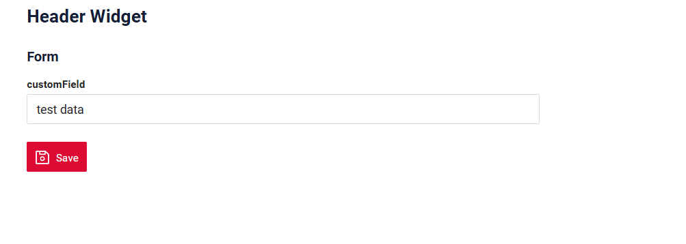

# HeaderWidget
 
`HeaderWidget` widget is a component for displaying a header.

* does not support control elements (e.g., action buttons or menus).
* used to highlight or emphasize a specific context on the current screen.

## Basics
[:material-play-circle: Live Sample]({{ external_links.code_samples }}/ui/#/screen/myexample5021){:target="_blank"} ·
[:fontawesome-brands-github: GitHub]({{ external_links.github_ui }}/{{ external_links.github_branch }}/src/main/java/org/demo/documentation/widgets/headerwidget/base){:target="_blank"}
### How does it look?
=== "Header widget"
    
=== "Header widget with other widget"
    

###  <a id="Howtoaddbacis">How to add?</a>
??? Example
    
    **Step1** Create file **_.widget.json_**. with  type = **"HeaderWidget"**

    ```json
       --8<--
       {{ external_links.github_raw_doc }}/widgets/headerwidget/base/myExample5021HeaderWidget.widget.json
       --8<--
    ```

    **Step2** Add widget to corresponding ****_.view.json_** **.

    ```json
        --8<--
        {{ external_links.github_raw_doc }}/widgets/headerwidget/base/myexample5021.view.json
        --8<--
    ```

    [:material-play-circle: Live Sample]({{ external_links.code_samples }}/ui/#/screen/myexample5021){:target="_blank"} ·
    [:fontawesome-brands-github: GitHub]({{ external_links.github_ui }}/{{ external_links.github_branch }}/src/main/java/org/demo/documentation/widgets/headerwidget/base){:target="_blank"}

## <a id="Title">Title</a>
[:material-play-circle: Live Sample]({{ external_links.code_samples }}/ui/#/screen/myexample5027){:target="_blank"} ·
[:fontawesome-brands-github: GitHub]({{ external_links.github_ui }}/{{ external_links.github_branch }}/src/main/java/org/demo/documentation/widgets/headerwidget/title){:target="_blank"}

### Title Basic
`Title` for widget.

There are types of:

* `constant title`: shows constant text. 
* `calculated title`: shows value provided in hidden text field, e.g. it can be calculated based on business logic of application
 
#### How does it look?
=== "Constant title"
     
=== "Calculated title"
    
#### How to add?
??? Example
    === "Constant title"
        **Step1** Add name for **title** to **_.widget.json_**. 
        ```java
        --8<--
        {{ external_links.github_raw_doc }}/widgets/headerwidget/title/myExample5027const.widget.json
        --8<--
        ```
        [:material-play-circle: Live Sample]({{ external_links.code_samples }}/ui/#/screen/myexample5027){:target="_blank"} ·
        [:fontawesome-brands-github: GitHub]({{ external_links.github_ui }}/{{ external_links.github_branch }}/src/main/java/org/demo/documentation/widgets/headerwidget/title/myExample5027const.widget.json){:target="_blank"}

    === "Calculated title"
        <!--родитель??-->
        **Step1** Add ${customField} for **title** to **_.widget.json_**. Add `customField` with type `hidden`  to corresponding ****_.widget.json_** **. 

        !!! info
            To ensure a field value is received by the frontend and displayed in the header, it must be specified within the `fields` array.
        
        ```java
        --8<--
        {{ external_links.github_raw_doc }}/widgets/headerwidget/title/myExample5027.widget.json
        --8<--
        ```
        [:material-play-circle: Live Sample]({{ external_links.code_samples }}/ui/#/screen/myexample5027/view/myexample5027form){:target="_blank"} ·
        [:fontawesome-brands-github: GitHub]({{ external_links.github_ui }}/{{ external_links.github_branch }}/src/main/java/org/demo/documentation/widgets/headerwidget/title/myExample5027.widget.json){:target="_blank"}

### <a id="TitleColor">Title Color</a>
 
`Title Color` allows you to specify a color for a title. It can be constant or calculated.
 
[:material-play-circle: Live Sample]({{ external_links.code_samples }}/ui/#/screen/myexample5024/view/myexample5024form){:target="_blank"} ·
[:fontawesome-brands-github: GitHub]({{ external_links.github_ui }}/{{ external_links.github_branch }}/src/main/java/org/demo/documentation/widgets/headerwidget/colortitle){:target="_blank"}

* `Constant color*` is a fixed color that doesn't change. It remains the same regardless of any factors in the application.

[:material-play-circle: Live Sample]({{ external_links.code_samples }}/ui/#/screen/myexample5024/view/myexample5024formcolorconst){:target="_blank"} ·
[:fontawesome-brands-github: GitHub]({{ external_links.github_ui }}/{{ external_links.github_branch }}/src/main/java/org/demo/documentation/widgets/headerwidget/colortitle){:target="_blank"}

* `Calculated color` can be used to change a title color dynamically. It changes depending on business logic or data in the application.

!!! info
    Title colorization is **applicable** to the following [fields](/widget/fields/fieldtypes/): date, dateTime, dateTimeWithSeconds, number, money, percent, time, input, text, dictionary, radio, checkbox, multivalue, multivalueHover.


##### How does it look?


##### How to add?
 
??? Example
    === "Calculated color"

        **Step 1**   Add `custom field for color` to corresponding **DataResponseDTO**. The field can contain a HEX color or be null.
        ```java
        --8<--
        {{ external_links.github_raw_doc }}/widgets/headerwidget/colortitle/MyExample5024DTO.java:colorDTO
        --8<--
        ```   
 
        **Step 2** Dynamic data output in the header only works if these fields are displayed on or passedas the [Field hidden](/widget/fields/field/hidden/hidden/) type from other  widget [List widget](/widget/type/list/list), [Form widget](/widget/type/form/form),[Info widget](/widget/type/info/info)
        with the bgColorKey property.

        Add **"bgColorKey"** :  `custom field for color` and  to .widget.json .([List widget](/widget/type/list/list), [Form widget](/widget/type/form/form),[Info widget](/widget/type/info/info))

        Add in `title` field with `${customField}` 

        ```json
        {
        "label": "Custom Field",
        "key": "customFieldText",
        "type": "input",
        "bgColorKey": "customFieldTextColor"
        }
        ```

        ```json
        --8<--
        {{ external_links.github_raw_doc }}/widgets/headerwidget/colortitle/myExample5024Form.widget.json
        --8<--
        ```     

        **Step 3** Add in `title` field with `${customField} . Add field to the `fields` array.
        

        ```json
        --8<--
        {{ external_links.github_raw_doc }}/widgets/headerwidget/colortitle/myExample5024HeaderWidget.widget.json
        --8<--
        ```     

        [:material-play-circle: Live Sample]({{ external_links.code_samples }}/ui/#/screen/myexample5024/view/myexample5024form){:target="_blank"} ·
        [:fontawesome-brands-github: GitHub]({{ external_links.github_ui }}/{{ external_links.github_branch }}/src/main/java/org/demo/documentation/widgets/headerwidget/colortitle){:target="_blank"}

    === "Constant color"
 
        Add **"bgColor"** :  `HEX color`  to .widget.json.

        Add in `title` field with `${customField}` 

        !!! info
            To ensure a field value is received by the frontend and displayed in the header, it must be specified within the `fields` array.
        

        ```json
        --8<--
        {{ external_links.github_raw_doc }}/widgets/headerwidget/colortitle/myExample5024HeaderWidgetConstColor.widget.json
        --8<--
        ```
        
        [:material-play-circle: Live Sample]({{ external_links.code_samples }}/ui/#/screen/myexample5024/view/myexample5024formcolorconst){:target="_blank"} ·
        [:fontawesome-brands-github: GitHub]({{ external_links.github_ui }}/{{ external_links.github_branch }}/src/main/java/org/demo/documentation/widgets/headerwidget/colortitle){:target="_blank"}


## <a id="Showcondition">Show condition</a> 
see more [showCondition](/widget/type/property/showcondition/showcondition)

[:material-play-circle: Live Sample]({{ external_links.code_samples }}/ui/#/screen/myexample5021){:target="_blank"} ·
[:fontawesome-brands-github: GitHub]({{ external_links.github_ui }}/{{ external_links.github_branch }}/src/main/java/org/demo/documentation/widgets/headerwidget/base){:target="_blank"}

* `no show condition - recommended`: widget always visible

[:material-play-circle: Live Sample]({{ external_links.code_samples }}/ui/#/screen/myexample5026/view/myexample5026form){:target="_blank"} ·
[:fontawesome-brands-github: GitHub]({{ external_links.github_ui }}/{{ external_links.github_branch }}/src/main/java/org/demo/documentation/widgets/headerwidget/showcondition/bycurrententity){:target="_blank"}

* `show condition by current entity`: condition can include boolean expression depending on current entity fields. Field updates will trigger condition recalculation only on save or if field is force active

[:material-play-circle: Live Sample]({{ external_links.code_samples }}/ui/#/screen/myexample5026/view/myexample5030form){:target="_blank"} ·
[:fontawesome-brands-github: GitHub]({{ external_links.github_ui }}/{{ external_links.github_branch }}/src/main/java/org/demo/documentation/widgets/headerwidget/showcondition/byparententity){:target="_blank"}

* `show condition by parent entity`: condition can include boolean expression depending on parent entity. Parent field updates will trigger condition recalculation only on save or if field is force active shown on same view

!!! tips
    It is recommended not to use `Show condition` when possible, because wide usage of this feature makes application hard to support.


#### <a id="howdoesitlook">How does it look?</a>
=== "no show condition"
    
=== "show condition by current entity"
    
=== "show condition by parent entity"
    

### <a id="howtoadd">How to add?</a>
??? Example

    === "no show condition"
        see [Basic](#Howtoaddbacis)
        [:material-play-circle: Live Sample]({{ external_links.code_samples }}/ui/#/screen/myexample5021){:target="_blank"} ·
        [:fontawesome-brands-github: GitHub]({{ external_links.github_ui }}/{{ external_links.github_branch }}/src/main/java/org/demo/documentation/widgets/headerwidget/base){:target="_blank"}

    === "show condition by current entity"
        **Step1** Add **showCondition** to **_.widget.json_**. see more [showCondition](/widget/type/property/showcondition/showcondition)
        ```json
        --8<--
        {{ external_links.github_raw_doc }}/widgets/headerwidget/showcondition/bycurrententity/myExample5026.widget.json
        --8<--
        ```

        [:material-play-circle: Live Sample]({{ external_links.code_samples }}/ui/#/screen/myexample5026/view/myexample5026form){:target="_blank"} ·
        [:fontawesome-brands-github: GitHub]({{ external_links.github_ui }}/{{ external_links.github_branch }}/src/main/java/org/demo/documentation/widgets/headerwidget/showcondition/bycurrententity){:target="_blank"}

    === "show condition by parent entity"
        **Step1** Add **showCondition** to **_.widget.json_**. see more [showCondition](/widget/type/property/showcondition/showcondition)
        ```json
        --8<--
        {{ external_links.github_raw_doc }}/widgets/headerwidget/showcondition/bycurrententity/myExample5026.widget.json
        --8<--
        ```
        [:material-play-circle: Live Sample]({{ external_links.code_samples }}/ui/#/screen/myexample5026/view/myexample5030form){:target="_blank"} ·
        [:fontawesome-brands-github: GitHub]({{ external_links.github_ui }}/{{ external_links.github_branch }}/src/main/java/org/demo/documentation/widgets/form/headerwidget/byparententity){:target="_blank"}
 
## <a id="bc">Business component</a>
This specifies the business component (BC) to which this headerwidget belongs.
A business component represents a specific part of a system that handles a particular business logic or data.

see more  [Business component](/environment/businesscomponent/businesscomponent/)

## <a id="fields">Fields</a>
This array is usually empty.

However, if you need to use field values for displaying data (for example, to dynamically generate a header based on a field value see [Title Color](#TitleColor) ),
you should add the required field with the [Field hidden](/widget/fields/field/hidden/hidden/) type — this way the frontend will be able to retrieve its value.


```json
{
    "label": "Custom Field",
    "key": "customField",
    "type": "hidden"
}
```

* **"label"**

Description:  Field Title.

Type: String(optional).

* **"key"**

Description: Name field to corresponding DataResponseDTO.

Type: String(required).

* **"type"**

Description: [Field hidden](/widget/fields/field/hidden/hidden/)

Type: hidden.

### How to add?
??? Example

    === "With plugin(recommended)"
        **Step 1** Download plugin
            [download Intellij Plugin](https://document.cxbox.org/plugin/plugininstalling)
    
        **Step 2** Add existing field to an existing headerwidget widget
            

    === "Example of writing code"
        Add field to **_.widget.json_**.

        ```json
        "name": "myexampleHeader",
        "title": "Header Widget",
        "type": "HeaderWidget",
        "bc": "myexample",
        {
            "label": "Custom Field",
            "key": "customField",
            "type": "hidden"
        }
        ```
        
see more  [Fields](/widget/fields/fieldtypes/)

## Options
This widget type does not support options

## Standard Actions
This widget type does not support buttons