# Info
 
`Info` widget is a component only for data viewing.
## Basics
[:material-play-circle: Live Sample]({{ external_links.code_samples }}/ui/#/screen/myexample3001){:target="_blank"} ·
[:fontawesome-brands-github: GitHub]({{ external_links.github_ui }}/{{ external_links.github_branch }}/src/main/java/org/demo/documentation/widgets/info/base){:target="_blank"}
### How does it look?
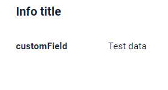


###  <a id="Howtoaddbacis">How to add?</a> 
??? Example
    **Step1** Create file **_.widget.json_**. with type = "Info"
 
    ```json
    --8<--
    {{ external_links.github_raw_doc }}/widgets/info/base/MyExample3001Info.widget.json
    --8<--
    ```
    **Step2** Add widget to corresponding ****_.view.json_** **.

    ```json
    --8<--
    {{ external_links.github_raw_doc }}/widgets/info/base/myexample3001info.view.json
    --8<--
    ```

    [:material-play-circle: Live Sample]({{ external_links.code_samples }}/ui/#/screen/myexample3001){:target="_blank"} ·
    [:fontawesome-brands-github: GitHub]({{ external_links.github_ui }}/{{ external_links.github_branch }}/src/main/java/org/demo/documentation/widgets/info/base){:target="_blank"}
     
## <a id="Title">Title</a>
[:material-play-circle: Live Sample]({{ external_links.code_samples }}/ui/#/screen/myexample3008){:target="_blank"} ·
[:fontawesome-brands-github: GitHub]({{ external_links.github_ui }}/{{ external_links.github_branch }}/src/main/java/org/demo/documentation/widgets/form/title){:target="_blank"}

### Title Basic
Title - (optional)

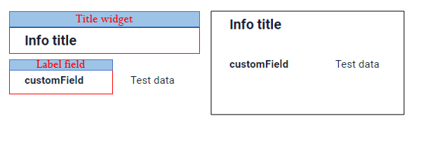    

There are types of:

* `constant title`: shows constant text.
* `constant title empty`: if you want to visually connect widgets by  them to be placed one under another
* `calculated title`: shows value provided in hidden text field, e.g. it can be calculated based on business logic of application

#### How does it look?
=== "Constant title"
    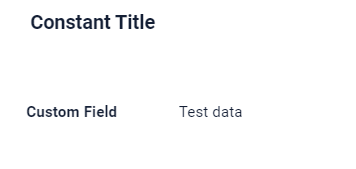
=== "Constant title empty"
    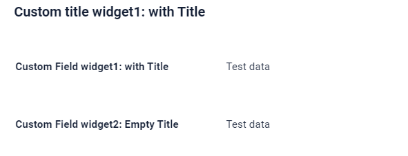
=== "Calculated title"
    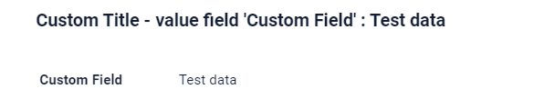
#### How to add?
??? Example
    === "Constant title"
        **Step1** Add name for **title** to **_.widget.json_**.
        ```json
        --8<--
        {{ external_links.github_raw_doc }}/widgets/info/title/MyExample3102Info.widget.json
        --8<--
        ```

        [:material-play-circle: Live Sample]({{ external_links.code_samples }}/ui/#/screen/myexample3008){:target="_blank"} ·
        [:fontawesome-brands-github: GitHub]({{ external_links.github_ui }}/{{ external_links.github_branch }}/src/main/java/org/demo/documentation/widgets/form/title){:target="_blank"}

    === "Constant title empty"
        **Step1** Delete parameter **title** to **_.widget.json_**.
        ```json
        --8<--
        {{ external_links.github_raw_doc }}/widgets/info/title/MyExample3102EmptyTitle.widget.json
        --8<--
        ```

        [:material-play-circle: Live Sample]({{ external_links.code_samples }}/ui/#/screen/myexample3008){:target="_blank"} ·
        [:fontawesome-brands-github: GitHub]({{ external_links.github_ui }}/{{ external_links.github_branch }}/src/main/java/org/demo/documentation/widgets/form/title){:target="_blank"}

    === "Calculated title"
        <!--родитель??-->
        **Step1** Add ${customField} for **title** to **_.widget.json_**.
        ```json
        --8<--
        {{ external_links.github_raw_doc }}/widgets/info/title/MyExample3102CustomTitle.widget.json
        --8<--
        ```

        [:material-play-circle: Live Sample]({{ external_links.code_samples }}/ui/#/screen/myexample3008){:target="_blank"} ·
        [:fontawesome-brands-github: GitHub]({{ external_links.github_ui }}/{{ external_links.github_branch }}/src/main/java/org/demo/documentation/widgets/form/title){:target="_blank"}


### Title Color
`Title Color` allows you to specify a color for a title. It can be constant or calculated.

**Constant color**

[:material-play-circle: Live Sample]({{ external_links.code_samples }}/ui/#/screen/myexample3025/view/myexample3025constcolor){:target="_blank"} ·
[:fontawesome-brands-github: GitHub]({{ external_links.github_ui }}/{{ external_links.github_branch }}/src/main/java/org/demo/documentation/widgets/info/colortitle){:target="_blank"}

*Constant color* is a fixed color that doesn't change. It remains the same regardless of any factors in the application.

**Calculated color**

[:material-play-circle: Live Sample]({{ external_links.code_samples }}/ui/#/screen/myexample3025/view/myexample3025){:target="_blank"} ·
[:fontawesome-brands-github: GitHub]({{ external_links.github_ui }}/{{ external_links.github_branch }}/src/main/java/org/demo/documentation/widgets/info/colortitle){:target="_blank"}

*Calculated color* can be used to change a title color dynamically. It changes depending on business logic or data in the application.

!!! info
    Title colorization is **applicable** to the following [fields](/widget/fields/fieldtypes/): date, dateTime, dateTimeWithSeconds, number, money, percent, time, input, text, dictionary, radio, checkbox, multivalue, multivalueHover.

##### How does it look?
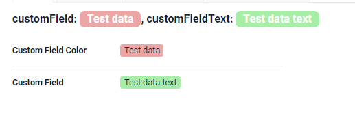

##### How to add?
??? Example
    === "Calculated color"

        **Step 1**   Add `custom field for color` to corresponding **DataResponseDTO**. The field can contain a HEX color or be null.
        ```java
        --8<--
        {{ external_links.github_raw_doc }}/widgets/info/colortitle/MyExample3040DTO.java:colorDTO
        --8<--
        ```  
 
        **Step 2** Add **"bgColorKey"** :  `custom field for color` and  to .widget.json.

        Add in `title` field with `${customField}` 

        ```json
        --8<--
        {{ external_links.github_raw_doc }}/widgets/info/colortitle/MyExample3040.widget.json
        --8<--
        ```       

        [:material-play-circle: Live Sample]({{ external_links.code_samples }}/ui/#/screen/myexample3025/view/myexample3025){:target="_blank"} ·
        [:fontawesome-brands-github: GitHub]({{ external_links.github_ui }}/{{ external_links.github_branch }}/src/main/java/org/demo/documentation/widgets/info/colortitle){:target="_blank"}

    === "Constant color"
 
        Add **"bgColor"** :  `HEX color`  to .widget.json.

        Add in `title` field with `${customField}` 

        ```json
        --8<--
        {{ external_links.github_raw_doc }}/widgets/info/colortitle/MyExample3040ColorConst.widget.json
        --8<--
        ```

        [:material-play-circle: Live Sample]({{ external_links.code_samples }}/ui/#/screen/myexample3025/view/myexample3025constcolor){:target="_blank"} ·
        [:fontawesome-brands-github: GitHub]({{ external_links.github_ui }}/{{ external_links.github_branch }}/src/main/java/org/demo/documentation/widgets/info/colortitle){:target="_blank"}

## <a id="bc">Business component</a>
This specifies the business component (BC) to which this form belongs.
A business component represents a specific part of a system that handles a particular business logic or data.

see more  [Business component](/environment/businesscomponent/businesscomponent/)
 
## <a id="Showcondition">Show condition</a> 
The `showCondition` is used to define the availability or visibility of the widget dynamically.
The `showCondition` in configuration represents the condition under which the widge will be made visible to the user. It controls whether the form appears on the user interface based on the value of a specific field in another or currentbusiness component.

  [:material-play-circle: Live Sample]({{ external_links.code_samples }}/ui/#/screen/myexample3000){:target="_blank"} ·
  [:fontawesome-brands-github: GitHub]({{ external_links.github_ui }}/{{ external_links.github_branch }}/src/main/java/org/demo/documentation/widgets/form/base){:target="_blank"}

* `no show condition - recommended`: widget always visible
 
  [:material-play-circle: Live Sample]({{ external_links.code_samples }}/ui/#/screen/myexample3005/view/myexample3005showcondform){:target="_blank"} ·
  [:fontawesome-brands-github: GitHub]({{ external_links.github_ui }}/{{ external_links.github_branch }}/src/main/java/org/demo/documentation/widgets/form/showcondition/bycurrententity){:target="_blank"}

* `show condition by current entity`: condition can include boolean expression depending on current entity fields. Field updates will trigger condition recalculation only on save or if field is force active

 
  [:material-play-circle: Live Sample]({{ external_links.code_samples }}/ui/#/screen/myexample3005/view/myexample3007showcondform){:target="_blank"} ·
  [:fontawesome-brands-github: GitHub]({{ external_links.github_ui }}/{{ external_links.github_branch }}/src/main/java/org/demo/documentation/widgets/form/showcondition/byparententity){:target="_blank"}

* `show condition by parent entity`: condition can include boolean expression depending on parent entity. Parent field updates will trigger condition recalculation only on save or if field is force active shown on same view

!!! tips
    It is recommended not to use `Show condition` when possible, because wide usage of this feature makes application hard to support.

### <a id="howdoesitlook">How does it look?</a>
=== "no show condition"
    
=== "show condition by current entity"
    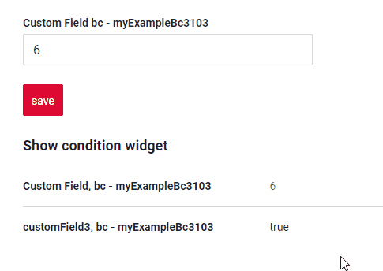
=== "show condition by parent entity"
    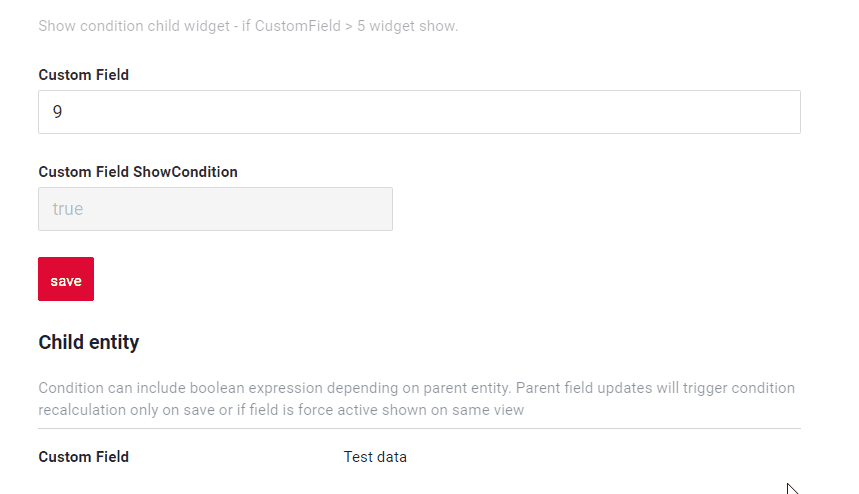
 
### <a id="howtoadd">How to add?</a>
??? Example
 
    === "no show condition"
        see [Basics](#Howtoaddbacis)

        [:material-play-circle: Live Sample]({{ external_links.code_samples }}/ui/#/screen/myexample3000){:target="_blank"} ·
        [:fontawesome-brands-github: GitHub]({{ external_links.github_ui }}/{{ external_links.github_branch }}/src/main/java/org/demo/documentation/widgets/form/base){:target="_blank"}

    === "show condition by current entity"
        **Step1** Add **showCondition** to **_.widget.json_**. see more [showCondition](/widget/type/property/showcondition/showcondition)
        ```json
        --8<--
        {{ external_links.github_raw_doc }}/widgets/info/showcondition/bycurrententity/MyExample31032.widget.json
        --8<--
        ```

        [:material-play-circle: Live Sample]({{ external_links.code_samples }}/ui/#/screen/myexample3005/view/myexample3005showcondform){:target="_blank"} ·
        [:fontawesome-brands-github: GitHub]({{ external_links.github_ui }}/{{ external_links.github_branch }}/src/main/java/org/demo/documentation/widgets/form/showcondition/bycurrententity){:target="_blank"}

    === "show condition by parent entity"
        **Step1** Add **showCondition** to **_.widget.json_**. see more [showCondition](/widget/type/property/showcondition/showcondition)
        ```json
        --8<--
        {{ external_links.github_raw_doc }}/widgets/info/showcondition/byparententity/child/MyExample3107.widget.json
        --8<--
        ```

        [:material-play-circle: Live Sample]({{ external_links.code_samples }}/ui/#/screen/myexample3005/view/myexample3007showcondform){:target="_blank"} ·
        [:fontawesome-brands-github: GitHub]({{ external_links.github_ui }}/{{ external_links.github_branch }}/src/main/java/org/demo/documentation/widgets/form/showcondition/byparententity){:target="_blank"}

## <a id="bc">Fields</a>
Fields Configuration. The fields array defines the individual fields present within the form.
### How to add?
??? Example

    === "With plugin"
        **Step 1** Download plugin
            [download Intellij Plugin](https://plugins.jetbrains.com/plugin/195-tesler-helper)
    
        **Step 2** Add existing field to an existing form widget
            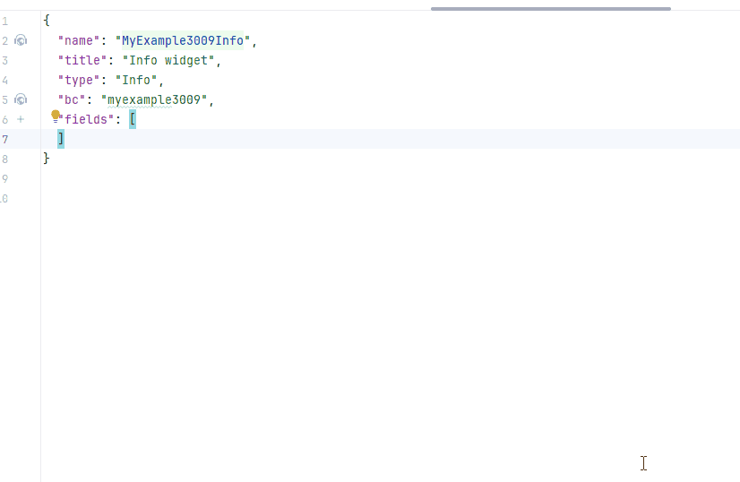
    === "Other"
        Add field to **_.widget.json_**.
        ```json
        {
            "label": "Custom Field",
            "key": "customField",
            "type": "input"
        }
        ```

        * **"label"**
        
        Description:  Field Title.
        
        Type: String(optional).
        
        * **"key"**
        
        Description: Name field to corresponding DataResponseDTO.
        
        Type: String(required).
        
        * **"type"**
        
        Description: [Field types](/widget/fields/fieldtypes/)
        
        Type: String(required).


        ```json
           --8<--
           {{ external_links.github_raw_doc }}/widgets/info/base/MyExample3001Info.widget.json
           --8<--
        ```


see more  [Fields](/widget/fields/fieldtypes/)

## <a id="Fieldslayout">Options layout</a>
[:material-play-circle: Live Sample]({{ external_links.code_samples }}/ui/#/screen/myexample3004){:target="_blank"} ·
[:fontawesome-brands-github: GitHub]({{ external_links.github_ui }}/{{ external_links.github_branch }}/src/main/java/org/demo/documentation/widgets/form/fieldslayoute){:target="_blank"}

* `single column layout - recommended`: shows each field on new row. Each field can have width from 1 to 24.

    !!! tips
        Use single column layout when fields are frequently hidden or rearranged. This avoids layout issues and ensures the best user experience.

* `multi column layout`: shows fields in grid. Grid can contain any number of rows. Each row can contain any number of fields, until sum of fields widths in row is less than 24. Each field can have width from 1 to 24.
* `empty`: only title and actions are shown. Usually used when standard buttons position needs to be changed (for example we want to show buttons under widget). One can hide buttons on widget with data. Create separate widget only with buttons and place it anywhere on view

!!! tips
    It is recommended to use `single column` layout when possible, because dynamic fields hiding (add link) always works correctly in this case.

!!! info
    The line has a size of 24 span, if you define fields on one line with a field width sum exceeding 24 span in total,that field and any subsequent fields will be moved to a new line . This means that each line will accommodate fields until the total width reaches 24 span, and any excess width will continue on the next line.

    For example, you have three fields with widths of 12, 8, and 10 characters, respectively. In this case, the first field and two field will fit completely on the first line as it is within the 24-character limit. However, the thirt field's width contributes to the totat.It has finally become more 24. As a result, the third field will be moved to the next line.


#### How does it look?
=== "Single column layout - recommended"
    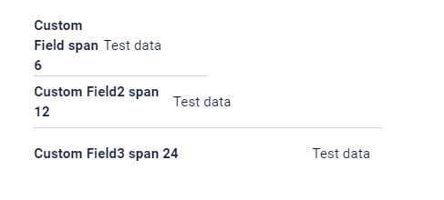
=== "Multi column layout"
    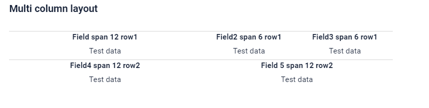
=== "Empty only buttons"
    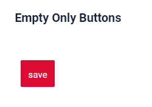
#### How to add?
??? Example
    === "Single column layout - recommended"

        **Step1** Create **"options": {"layout": {}}**.

        **Step2** Add fields to **"options": {"layout": {}}**

        Forming rows:

        * Open `cols` : "cols": [
        * Add All fields(customField,customField2,customField3) with span from 1 to 24.
        * Close `cols` : ]

        ```json
        --8<--
        {{ external_links.github_raw_doc }}/widgets/info/fieldslayoute/MyExample3008Info.widget.json
        --8<--
        ```

        [:material-play-circle: Live Sample]({{ external_links.code_samples }}/ui/#/screen/myexample3004){:target="_blank"} ·
        [:fontawesome-brands-github: GitHub]({{ external_links.github_ui }}/{{ external_links.github_branch }}/src/main/java/org/demo/documentation/widgets/form/fieldslayoute){:target="_blank"}

    === "Multi column layout"
        **Step1** Create **"options": {"layout": {}}**.

        **Step2** Add fields to **"options": {"layout": {}}**.

        Forming row1 : 

        * Open `cols` : "cols": [ 
        * Add all feild : customField,customField2,customField3
        * Check sum span <= 24: customField (span = 12),customField2 = 6, customField3 = 6 : sum 24)
        * Close `cols` : ]

        Forming a row2 : 

        * Open 'cols' : "cols": [ 
        * Add All filed(customField4)
        * Check sum span <= 24 (customField4 span = 12 : sum 12)
        * Close 'cols' : ]
 
        ```json
        --8<--
        {{ external_links.github_raw_doc }}/widgets/info/fieldslayoute/MyExample3008MultiColumn.widget.json
        --8<--
        ```

        [:material-play-circle: Live Sample]({{ external_links.code_samples }}/ui/#/screen/myexample3004){:target="_blank"} ·
        [:fontawesome-brands-github: GitHub]({{ external_links.github_ui }}/{{ external_links.github_branch }}/src/main/java/org/demo/documentation/widgets/form/fieldslayoute){:target="_blank"}

    === "Empty only buttons"
        **Step1** Create **"options": {"layout": {}}**.

        Button "Create" - On default
        
        ```json
        --8<--
        {{ external_links.github_raw_doc }}/widgets/info/fieldslayoute/MyExample3008EmptyOnlyButtons.widget.json
        --8<--
        ```

        [:material-play-circle: Live Sample]({{ external_links.code_samples }}/ui/#/screen/myexample3004){:target="_blank"} ·
        [:fontawesome-brands-github: GitHub]({{ external_links.github_ui }}/{{ external_links.github_branch }}/src/main/java/org/demo/documentation/widgets/form/fieldslayoute){:target="_blank"}

## Actions
This widget type does not support buttons


 