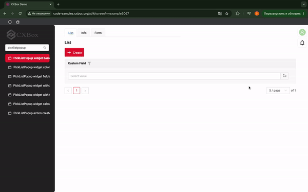
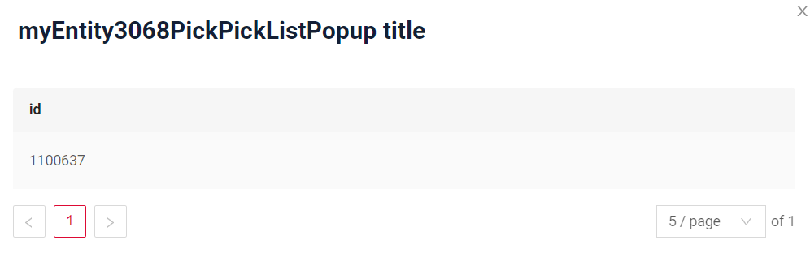
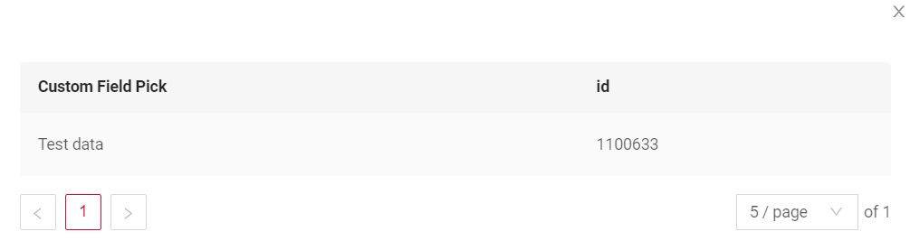
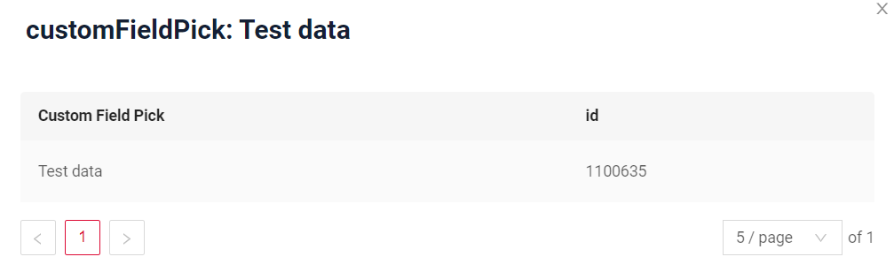
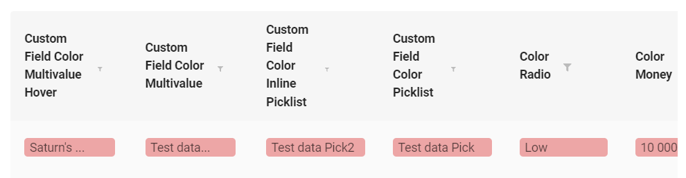
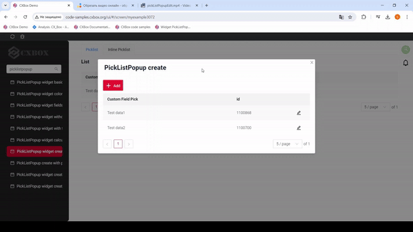
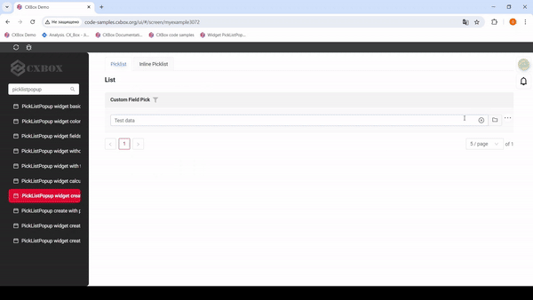
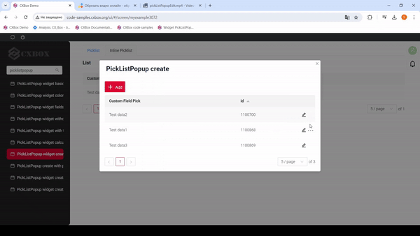

# PickListPopup

`PickListPopup` is a component that allows the user to select a value from a Popup list of entities.

## Basics
[:material-play-circle: Live Sample]({{ external_links.code_samples }}/ui/#/screen/myexample3067){:target="_blank"} ·
[:fontawesome-brands-github: GitHub]

### How does it look?


### How to add?
??? Example
    === "Calculated color"

        **Step 1**   Add `custom field for color` to corresponding **DataResponseDTO**. The field can contain a HEX color or be null.
        ```java
        --8<--
        {{ external_links.github_raw_doc }}/widgets/picklist/colortitle/MyExample3060DTO.java:colorDTO
        --8<--
        ```  
 
        **Step 2** Add **"bgColorKey"** :  `custom field for color` and  to .widget.json.

        Add in `title` field with `${customField}` 

        ```json
        --8<--
        {{ external_links.github_raw_doc }}/widgets/picklist/colortitle/myEntity3061PickListPopup.widget.json
        --8<--
        ```       

    === "Constant color"
 
        Add **"bgColor"** :  `HEX color`  to .widget.json.

        Add in `title` field with `${customField}` 

        ```json
        --8<--
        {{ external_links.github_raw_doc }}/widgets/picklist/colortitle/myEntity3061PickListPopupColorConst.widget.json
        --8<--
        ```
## Title
[:material-play-circle: Live Sample]({{ external_links.code_samples }}/ui/#/screen/myexample3068){:target="_blank"} ·
[:fontawesome-brands-github: GitHub]({{ external_links.github_ui }}/{{ external_links.github_branch }}/src/main/java/org/demo/documentation/widgets/picklist/title){:target="_blank"}

### Title Basic


There are 3 types of titles for a Picklist Popup:

* `constant title`: displays a fixed piece of text which cannot be changed. 
* `constant title empty`: shows no text.
* `calculated title`: displays a dynamic piece of text, meaning it can change based on business logic or data in the application.

!!! tips 
    Use `constant title empty` if you want to visually connect widgets and place them one under another. 

#### How does it look?
=== "Constant title"
    
=== "Constant title empty"
    
=== "Calculated title"
    


#### How to add?
??? Example
    === "Constant title"
        **Step1** Add name for **title** to **_.widget.json_**.
        ```json
        --8<--
        {{ external_links.github_raw_doc }}/widgets/picklist/title/myEntity3068PickPickListPopup.widget.json
        --8<--
        ```
    
    === "Constant title empty"
        **Step1** Delete parameter **title** to **_.widget.json_**.
        ```json
        --8<--
        {{ external_links.github_raw_doc }}/widgets/picklist/title/MyExample3104EmptyTitle.widget.json
        --8<--
        ```
    === "Calculated title"
        <!--родитель??-->
        **Step1** Add ${customField} for **title** to **_.widget.json_**.
        ```json
        --8<--
        {{ external_links.github_raw_doc }}/widgets/picklist/title/myEntity3071PickPickListPopup.widget.json
        --8<--
        ```

### Title Color
`Title Color` allows you to specify a color for a title. It can be constant or calculated.

**Constant color**

[:material-play-circle: Live Sample]({{ external_links.code_samples }}/ui/#/screen/myexample3025/view/myexample3025constcolor){:target="_blank"} ·
[:fontawesome-brands-github: GitHub]({{ external_links.github_ui }}/{{ external_links.github_branch }}/src/main/java/org/demo/documentation/widgets/picklist/colortitle){:target="_blank"}

*Constant color* is a fixed color that doesn't change. It remains the same regardless of any factors in the application.
**Calculated color**

[:material-play-circle: Live Sample]({{ external_links.code_samples }}/ui/#/screen/myexample3025/view/myexample3025){:target="_blank"} ·
[:fontawesome-brands-github: GitHub]({{ external_links.github_ui }}/{{ external_links.github_branch }}/src/main/java/org/demo/documentation/widgets/picklist/colortitle){:target="_blank"}

*Calculated color* can be used to change a title color dynamically. It changes depending on business logic or data in the application.

!!! info
    Title colorization is **applicable** to the following [fields](/widget/fields/fieldtypes/): date, dateTime, dateTimeWithSeconds, number, money, percent, time, input, text, dictionary, radio, checkbox, multivalue, multivalueHover.

#### How does it look?


#### How to add?
??? Example
    === "Calculated color"

        **Step 1**   Add `custom field for color` to corresponding **DataResponseDTO**. The field can contain a HEX color or be null.
        ```java
        --8<--
        {{ external_links.github_raw_doc }}/widgets/picklist/color/MyEntity3061PickDTO.java:colorDTO
        --8<--
        ```  
 
        **Step 2** Add **"bgColorKey"** :  `custom field for color` and  to .widget.json.

        Add in `title` field with `${customField}` 

        ```json
        --8<--
        {{ external_links.github_raw_doc }}/widgets/picklist/color/myEntity3061PickListPopup.widget.json
        --8<--
        ```       

    === "Constant color"
 
        Add **"bgColor"** :  `HEX color`  to .widget.json.

        Add in `title` field with `${customField}` 

        ```json
        --8<--
        {{ external_links.github_raw_doc }}/widgets/picklist/color/myEntity3061PickListPopupColorConst.widget.json
        --8<--
        ```

## <a id="bc">Business component</a>
This specifies the business component (BC) to which this form belongs.
A business component represents a specific part of a system that handles a particular business logic or data.

see more  [Business component](/environment/businesscomponent/businesscomponent/)

## <a id="Showcondition">Show condition</a>
_not applicable_

## <a id="bc">Fields</a>

## Options layout 
*not applicable* 


### Actions 
`Actions` show available actions as separate buttons. 
As for PickList Popup, there are several actions.  

[:material-play-circle: Live Sample]({{ external_links.code_samples }}/ui/#/screen/myexample3072){:target="_blank"} ·
[:fontawesome-brands-github: GitHub]

#### Create
`Create` button enables you to create a new value right in the Popup List of entities. 

##### How does it look?


##### How to add? 

#### Edit
`Edit` enables you to change the field value by clicking on a *Pencil icon*.

##### How does it look?


##### How to add?

#### Filter 
`Filter` enables you to filter the entities from the Popup list by clicking on a *Filter icon*. 

##### How does it look?
!

##### How to add?

#### Delete 
`Delete` enables you to delete the value from the Popup list by clicking on a *Delete option* from the three-dots menu.

##### How does it look?
!

##### How to add?