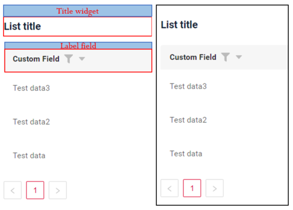

# PickListPopup

`PickListPopup` is a component that allows not only to select a value from Popup list of entities, but also to create a
new one with the help of *Create* button. 

## Basics
[:material-play-circle: Live Sample]({{ external_links.code_samples }}/ui/#/screen/myexample3067){:target="_blank"} ·
[:fontawesome-brands-github: GitHub]

### How does it look?

### How to add?

## Main visual parts

### Title
[:material-play-circle: Live Sample]({{ external_links.code_samples }}/ui/#/screen/myexample3068){:target="_blank"} ·
[:fontawesome-brands-github: GitHub]

Title - (optional)

There are 3 types of titles for a Picklist Popup:

* `constant title`: shows constant text in the title
* `constant title empty`: shows no text (use this if you want to visually connect widgets and place them one under another)
* `calculated title`: shows value provided in hidden text field, e.g. it can be calculated based on business logic of application

#### How does it look?
=== "Constant title"
    
=== "Constant title empty"
    
=== "Calculated title"
    

#### How to add?

### Icon 
*not applicable*

### Color
`Color` allows you to specify a field color. It can be calculated based on business logic of application.

`Calculated color`:
[:material-play-circle: Live Sample]({{ external_links.code_samples }}/ui/#/screen/myexample3060/view/myexample3060form){:target="_blank"} ·
[:fontawesome-brands-github: GitHub]

`Constant color`:
[:material-play-circle: Live Sample]({{ external_links.code_samples }}/ui/#/screen/myexample3060/view/myexample3060formcolorconst){:target="_blank"} ·
[:fontawesome-brands-github: GitHub]

#### How does it look?

#### How to add? 

### Fields Layout 
*not applicable* 

### Show condition 
*not applicable* 

### Actions 
`Actions` show available actions as separate buttons. As for Picklist Popup, there is a Create button, which enables you to create a new value right in the Popup list of entities.

[:material-play-circle: Live Sample]({{ external_links.code_samples }}/ui/#/screen/myexample3072){:target="_blank"} ·
[:fontawesome-brands-github: GitHub] 

#### How does it look?

#### How to add? 