# PickTreePopup

`PickTreePopup` is a component that allows the user to select a value from a Popup list of entities.
 
## Basics
[:material-play-circle: Live Sample]({{ external_links.code_samples }}/ui/#/screen/myexample3343){:target="_blank"} ·
[:fontawesome-brands-github: GitHub]({{ external_links.github_ui }}/{{ external_links.github_branch }}/src/main/java/org/demo/documentation/widgets/picktree/basic){:target="_blank"}

### How does it look?
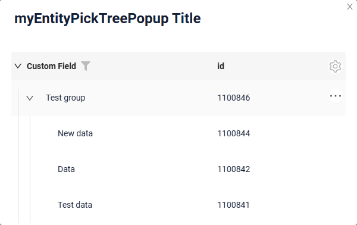

??? Example
 
    **Step1** Add field with type **pickTree**  see more [Fields](#fields)

    ```json
    --8<--
    {{ external_links.github_raw_doc }}/widgets/picktree/base/onefield/MyExample3351List.widget.json
    --8<--
    ```
 
    **Step2** Add widget and popup widget to corresponding ****_.view.json_** **.

    ```json
    --8<--
    {{ external_links.github_raw_doc }}/widgets/picktree/base/onefield/myexample3351list.view.json
    --8<--
    ```
 
    [:material-play-circle: Live Sample]({{ external_links.code_samples }}/ui/#/screen/myexample3343){:target="_blank"} ·
    [:fontawesome-brands-github: GitHub]({{ external_links.github_ui }}/{{ external_links.github_branch }}/src/main/java/org/demo/documentation/widgets/picktree/basic){:target="_blank"}

 
## Title
[:material-play-circle: Live Sample]({{ external_links.code_samples }}/ui/#/screen/myexample3344){:target="_blank"} ·
[:fontawesome-brands-github: GitHub]({{ external_links.github_ui }}/{{ external_links.github_branch }}/src/main/java/org/demo/documentation/widgets/picktree/title){:target="_blank"}

### Title Basic
There are 3 types of titles for a Picktree Popup:

* `constant title`: displays a fixed piece of text which cannot be changed. 
* `constant title empty`: shows no text.
* `calculated title`: displays a dynamic piece of text, meaning it can change based on business logic or data in the application.
 
#### How does it look?
=== "Constant title"
    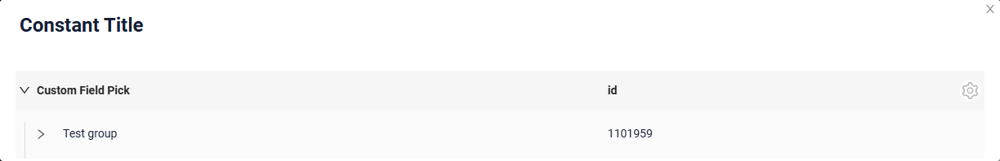
=== "Constant title empty"
    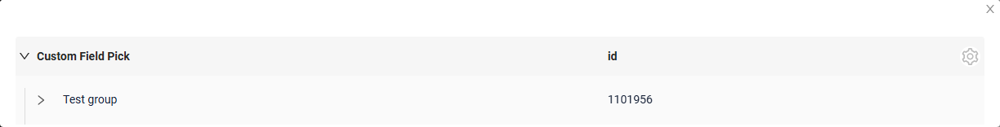
=== "Calculated title"
    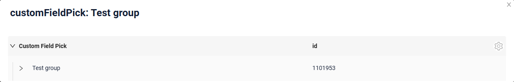


#### How to add?
!!! info
    The popup is a tree: the business component of the popup must return `parentId` (filterable, `null` for the roots) and `isLeaf`, both declared as **hidden** fields of the popup widget. The tree settings are described in [options.tree](/widget/type/tree/tree/#optionstree).

??? Example
    === "Constant title"
        **Step1** Add name for **title** to **_.widget.json_**.
        ```json
        --8<--
        {{ external_links.github_raw_doc }}/widgets/picktree/title/withtitle/myEntity3344PickPickTreePopup.widget.json
        --8<--
        ```
 
    === "Constant title empty"
        **Step1** Delete parameter **title** to **_.widget.json_**.
        ```json
        --8<--
        {{ external_links.github_raw_doc }}/widgets/picktree/title/withouttitle/myEntity3345PickPickTreePopup.widget.json
        --8<--
        ```
 
    === "Calculated title"
        <!--родитель??-->
        **Step1** Add ${customField} for **title** to **_.widget.json_**.
        ```json
        --8<--
        {{ external_links.github_raw_doc }}/widgets/picktree/title/calculatedtitle/myEntity3347PickPickTreePopup.widget.json
        --8<--
        ```
 
### Title Color
`Title Color` allows you to specify a color for a title. It can be constant or calculated.

**Constant color**

[:material-play-circle: Live Sample]({{ external_links.code_samples }}/ui/#/screen/myexample3341/view/myexample3341formcolorconst){:target="_blank"} ·
[:fontawesome-brands-github: GitHub]({{ external_links.github_ui }}/{{ external_links.github_branch }}/src/main/java/org/demo/documentation/widgets/picktree/colortitle){:target="_blank"}

*Constant color* is a fixed color that doesn't change. It remains the same regardless of any factors in the application.
**Calculated color**

[:material-play-circle: Live Sample]({{ external_links.code_samples }}/ui/#/screen/myexample3341/view/myexample3341form){:target="_blank"} ·
[:fontawesome-brands-github: GitHub]({{ external_links.github_ui }}/{{ external_links.github_branch }}/src/main/java/org/demo/documentation/widgets/picktree/colortitle){:target="_blank"}

*Calculated color* can be used to change a title color dynamically. It changes depending on business logic or data in the application.

!!! info
    Title colorization is **applicable** to the following [fields](/widget/fields/fieldtypes/): date, dateTime, dateTimeWithSeconds, number, money, percent, time, input, text, dictionary, radio, checkbox, multivalue, multivalueHover.

#### How does it look?
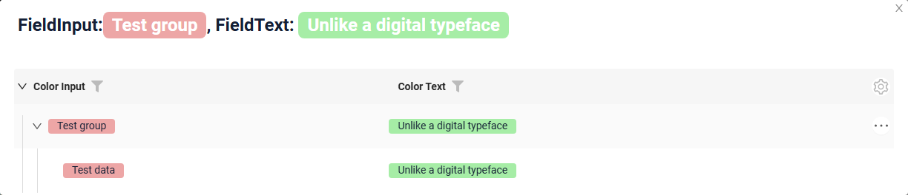

#### How to add?
??? Example
    === "Calculated color"

        **Step 1**   Add `custom field for color` to corresponding **DataResponseDTO**. The field can contain a HEX color or be null.
        ```java
        --8<--
        {{ external_links.github_raw_doc }}/widgets/picktree/colortitle/MyEntity3342PickDTO.java:colorDTO
        --8<--
        ```  
 
        **Step 2** Add **"bgColorKey"** :  `custom field for color` and  to .widget.json.

        Add in `title` field with `${customField}` 

        ```json
        --8<--
        {{ external_links.github_raw_doc }}/widgets/picktree/colortitle/myEntity3342PickTreePopupColorConst.widget.json
        --8<--
        ```       
 
    === "Constant color"
 
        Add **"bgColor"** :  `HEX color`  to .widget.json.

        Add in `title` field with `${customField}` 

        ```json
        --8<--
        {{ external_links.github_raw_doc }}/widgets/picktree/colortitle/myEntity3342PickTreePopupColorConst.widget.json
        --8<--
        ```
 
## <a id="bc">Business component</a>
This specifies the business component (BC) to which this form belongs.
A business component represents a specific part of a system that handles a particular business logic or data.

see more  [Business component](/environment/businesscomponent/businesscomponent/)

## <a id="Showcondition">Show condition</a>


## <a id="fields">Fields</a>
Fields Configuration. The fields array defines the individual fields present within the form.

```json
{
    "title": "Custom Field",
    "key": "customField",
    "type": "input"
}
```

* **"title"**

  Description:  Field Title.

  Type: String(optional).

* **"key"**

  Description: Name field to corresponding DataResponseDTO.

  Type: String(required).

* **"type"**

  Description: [Field types](/widget/fields/fieldtypes/)

  Type: String(required).


### How to add?
??? Example

    === "With plugin(recommended)"
        **Step 1** Download plugin
            [download Intellij Plugin](https://document.cxbox.org/plugin/plugininstalling)
    
        **Step 2** Add existing field to an existing form widget
            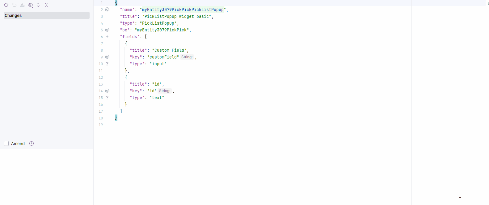
    === "Example of writing code"
        Add field to **_.widget.json_**.

          ```json
             --8<--
             {{ external_links.github_raw_doc }}/widgets/picktree/base/onefield/picktreepopup/picktree/myEntity3351PickPickPickTreePopup.widget.json
             --8<--
          ```
 
## <a id="Fieldslayout">Options layout</a>
**options.layout** - no use in this type.

## Standard Actions
`Actions` show available actions as separate buttons see more [Actions](/features/element/actions/actions).

**Standard Actions**:

* [`Create`](#standart_create): Action to initialize the process of creating a new record
* `Delete` - _not applicable_
* `Edit`  -  _not applicable_
* [`Save`](#standart_save): Action to store the data entered or modified
* [`Cancel-create`](#standart_cancel_create): Action to abort the creation of a new record, discarding any input without saving
 

####  <a id="standart_create">Create</a>  
`Create` button enables you to create a new value by clicking the `Add` button. This action can be performed in three different ways, feel free to choose any, depending on your logic of application:

There are three methods to create a record:

* [Inline](#createinline): You can add a line directly.

!!! info
    Pagination won't function until the page is refreshed after adding records.

* [Inline-form](#withwidget): You can add data using a form widget without leaving your current view.

* [With view](#withview): not applicable.

##### <a id="createinline">Inline</a>
[:material-play-circle: Live Sample]({{ external_links.code_samples }}/ui/#/screen/myexample3353){:target="_blank"} ·
[:fontawesome-brands-github: GitHub]({{ external_links.github_ui }}/{{ external_links.github_branch }}/src/main/java/org/demo/documentation/widgets/picktree/actions/create){:target="_blank"}

With `Line Addition`, a new empty row is immediately added to the top of the assoc widget when the "Add" button is clicked. This is a quick way to add rows without needing to input data beforehand.
_Unavailable in this release, see `CXBOX-1369`. The sample is kept so that the behaviour can be re-checked._

<!--
###### How does it look?
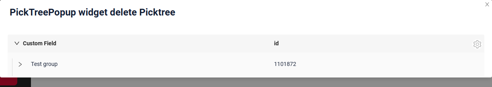

###### How to add?
??? Example

    **Step1** Add button `create` to corresponding **VersionAwareResponseService**. 
    ```java
    --8<--
    {{ external_links.github_raw_doc }}/widgets/picktree/actions/create/picktree/MyEntity3348PickPickService.java:getActions
    --8<--
    ```

    **Step2** Add button `create` to corresponding **.widget.json**. 
    ```json
    --8<--
    {{ external_links.github_raw_doc }}/widgets/picktree/actions/create/picktree/myEntity3348PickPickTreeCreateInlinePopup.widget.json
    --8<--
    ```
 
    **Step3** Add **fields.setEnabled** to corresponding **FieldMetaBuilder**.
    ```java
    --8<--
    {{ external_links.github_raw_doc }}/widgets/picktree/actions/create/picktree/MyEntity3348PickPickMeta.java:buildRowDependentMeta
    --8<--
    ```
 
    [:material-play-circle: Live Sample]({{ external_links.code_samples }}/ui/#/screen/myexample3353){:target="_blank"} ·
    [:fontawesome-brands-github: GitHub]({{ external_links.github_ui }}/{{ external_links.github_branch }}/src/main/java/org/demo/documentation/widgets/picktree/actions/create){:target="_blank"}
-->

##### <a id="withwidget">Inline-form</a>
[:material-play-circle: Live Sample]({{ external_links.code_samples }}/ui/#/screen/myexample3353/view/myexample3348listinlineform){:target="_blank"} ·
[:fontawesome-brands-github: GitHub]({{ external_links.github_ui }}/{{ external_links.github_branch }}/src/main/java/org/demo/documentation/widgets/picktree/actions/create){:target="_blank"}

`Create with widget` opens an additional widget when the "Add" button is clicked. The form will appear on the same screen, allowing you to view both the assoc of entities and the form for adding a new row.
After filling the information in and clicking "Save", the new row is added to the assoc.
_Unavailable in this release, see `CXBOX-1369`. The sample is kept so that the behaviour can be re-checked._

<!--
###### How does it look?
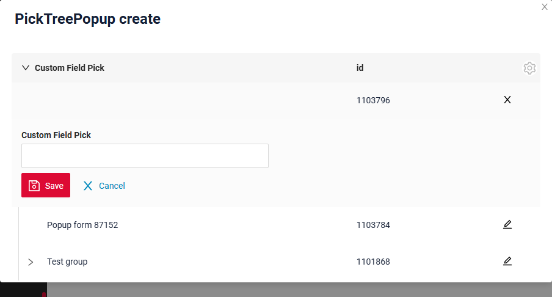

###### How to add?
??? Example

    **Step1** Add button `create` to corresponding **VersionAwareResponseService**. 
    ```java
    --8<--
    {{ external_links.github_raw_doc }}/widgets/picktree/actions/create/picktree/MyEntity3348PickPickService.java:getActions
    --8<--
    ```
    **Step2** Add **fields.setEnabled** to corresponding **FieldMetaBuilder**.
    ```java
    --8<--
    {{ external_links.github_raw_doc }}/widgets/picktree/actions/create/picktree/MyEntity3348PickPickMeta.java:buildRowDependentMeta
    --8<--
    ```
    **Step3** Create widget.json with type `Form` that appears when you click a button
    ```json
    --8<--
    {{ external_links.github_raw_doc }}/widgets/picktree/actions/create/picktree/myEntity3348PickPickTreePopupForm.widget.json
    --8<--
    ```
 
     **Step4** Add widget.json with type `Form` to corresponding **.view.json**. 
    ```json
    --8<--
    {{ external_links.github_raw_doc }}/widgets/picktree/actions/create/picktree/myexample3348listinlineform.view.json
    --8<--
    ```
 
     **Step5** Add button `create` and widget with type `Form` to corresponding **.widget.json**.
       
    `options`.`create`: Name widget that appears when you click a button
        
    ```json
    --8<--
    {{ external_links.github_raw_doc }}/widgets/picktree/actions/create/picktree/myEntity3348PickPickTreePopup.widget.json
    --8<--
    ``` 
 
    [:material-play-circle: Live Sample]({{ external_links.code_samples }}/ui/#/screen/myexample3353/view/myexample3348listinlineform){:target="_blank"} ·
    [:fontawesome-brands-github: GitHub]({{ external_links.github_ui }}/{{ external_links.github_branch }}/src/main/java/org/demo/documentation/widgets/picktree/actions/create){:target="_blank"}
-->

##### <a id="withview">With view</a>
_not applicable_

#### Delete
_not applicable_
 
#### Edit
_not applicable_

###  **<a id="standart_save">Save</a>**
[:material-play-circle: Live Sample]({{ external_links.code_samples }}/ui/#/screen/myexample3353/view/myexample3355form){:target="_blank"} ·
[:fontawesome-brands-github: GitHub]({{ external_links.github_ui }}/{{ external_links.github_branch }}/src/main/java/org/demo/documentation/widgets/picktree/actions/save){:target="_blank"}

`Save` to store the data entered or modified. see [information on autosave](/features/element/autosave/autosave)
 
###### How does it look?


###### How to add?
??? Example

    **Step1** Add action *save* to corresponding **VersionAwareResponseService**. 

    ```java
    --8<--
    {{ external_links.github_raw_doc }}/widgets/picktree/actions/save/MyExample3355Service.java:getActions
    --8<--
    ```  
    **Step2** Add button ot group button to corresponding **.widget.json**.
   
    ```json
    --8<--
    {{ external_links.github_raw_doc }}/widgets/picktree/actions/save/MyExample3355Form.widget.json
    --8<--
    ```

    [:material-play-circle: Live Sample]({{ external_links.code_samples }}/ui/#/screen/myexample3353/view/myexample3355form){:target="_blank"} ·
    [:fontawesome-brands-github: GitHub]({{ external_links.github_ui }}/{{ external_links.github_branch }}/src/main/java/org/demo/documentation/widgets/picktree/actions/save){:target="_blank"}


### **<a id="standart_cancel_create">Cancel-create</a>**
[:material-play-circle: Live Sample]({{ external_links.code_samples }}/ui/#/screen/myexample3353/view/myexample3356form){:target="_blank"} ·
[:fontawesome-brands-github: GitHub]({{ external_links.github_ui }}/{{ external_links.github_branch }}/src/main/java/org/demo/documentation/widgets/picktree/actions/cancelcreate/basic){:target="_blank"}

`Cancel-create` abort the creation of a new record, discarding any input without saving
 
###### How does it look?
=== "Basic"
    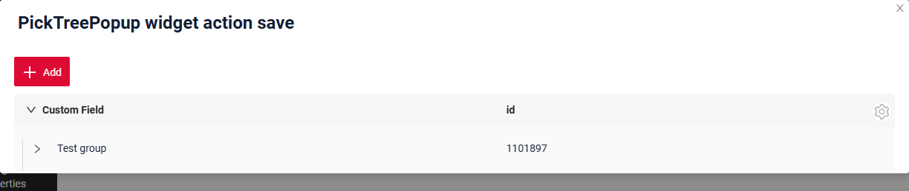
=== "With drilldown"
    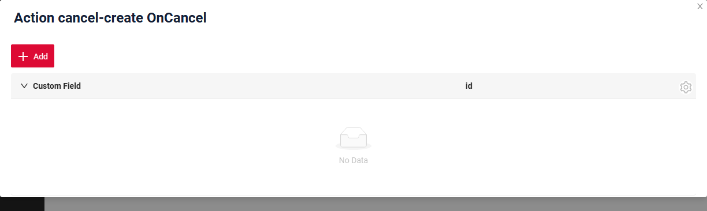

###### How to add?
??? Example
    === "Basic"

        **Step1** Add standart action *cancelCreate* to corresponding **VersionAwareResponseService**. 
        The interface displays "cancelCreate" as the default option.

        ```java
        --8<--
        {{ external_links.github_raw_doc }}/widgets/picktree/actions/cancelcreate/basic/MyEntity3356PickPickService.java:getActions
        --8<--
        ```
         **Step2** Add action *cancel-create* to corresponding **PickTreePopup**. 
 
        ```json
        --8<--
        {{ external_links.github_raw_doc }}/widgets/picktree/actions/cancelcreate/basic/myEntity3356PickPickPickTreePopup.widget.json
        --8<--
        ```
 
        [:material-play-circle: Live Sample]({{ external_links.code_samples }}/ui/#/screen/myexample3353/view/myexample3356form){:target="_blank"} ·
        [:fontawesome-brands-github: GitHub]({{ external_links.github_ui }}/{{ external_links.github_branch }}/src/main/java/org/demo/documentation/widgets/picktree/actions/cancelcreate/basic){:target="_blank"}

    === "With postAction"
        **Step1** Add action *cancel* to corresponding **VersionAwareResponseService** with postAction. 
    
        ```java
        --8<--
        {{ external_links.github_raw_doc }}/widgets/picktree/actions/cancelcreate/postaction/MyEntity3356PickPostActionPickService.java:getActions
        --8<--
        ``` 
 
        **Step2** Add button ot group button to corresponding **.widget.json**.
       
        ```json
        --8<--
        {{ external_links.github_raw_doc }}/widgets/picktree/actions/cancelcreate/postaction/myEntity3356PickPostActionPickPickTreePopup.widget.json
        --8<--
        ```
 
        [:material-play-circle: Live Sample]({{ external_links.code_samples }}/ui/#/screen/myexample3353/view/myexample3356formpostaction){:target="_blank"} ·
        [:fontawesome-brands-github: GitHub]({{ external_links.github_ui }}/{{ external_links.github_branch }}/src/main/java/org/demo/documentation/widgets/picktree/actions/cancelcreate/postaction){:target="_blank"}

    === "Method onCancel"
        !!! info
            Only for **Inner** Business Component see more [Business Component](/environment/businesscomponent/businesscomponent/)

        **Step1** Add standart action *cancelCreate* to corresponding **VersionAwareResponseService**. 
    
        ```java
        --8<--
        {{ external_links.github_raw_doc }}/widgets/picktree/actions/cancelcreate/oncancel/MyEntity3356PickOnCancelPickService.java:getActions
        --8<--
        ```
        **Step2** Add method *onCancel* to corresponding **VersionAwareResponseService**. 
        ```java
        --8<--
        {{ external_links.github_raw_doc }}/widgets/picktree/actions/cancelcreate/oncancel/MyEntity3356PickOnCancelPickService.java:onCancel
        --8<--
        ```
        **Step3** Add button ot group button to corresponding **.widget.json**.
       
        ```json
        --8<--
        {{ external_links.github_raw_doc }}/widgets/picktree/actions/cancelcreate/oncancel/myEntity3356PickOnCancelPickPickTreePopup.widget.json
        --8<--
        ```

        [:material-play-circle: Live Sample]({{ external_links.code_samples }}/ui/#/screen/myexample3353/view/myexample3356formoncancel){:target="_blank"} ·
        [:fontawesome-brands-github: GitHub]({{ external_links.github_ui }}/{{ external_links.github_branch }}/src/main/java/org/demo/documentation/widgets/picktree/actions/cancelcreate/oncancel){:target="_blank"}


<!--
`Edit` enables you to change the field value. Just like with `Create` button, there are three ways of implementing this Action.

There are three methods to create a record:
  [Inline edit](#editline): You can edit a line directly.


* [Inline-form](#editwithwidget): You can edit data using a form widget without leaving your current view.

* With view: not applicable

 
##### <a id="editline">Inline edit </a>
[:material-play-circle: Live Sample]({{ external_links.code_samples }}/ui/#/screen/myexample3353/view/myexample3353listinline){:target="_blank"} ·
[:fontawesome-brands-github: GitHub]({{ external_links.github_ui }}/{{ external_links.github_branch }}/src/main/java/org/demo/documentation/widgets/picktree/actions/edit){:target="_blank"}

`Edit Inline` implies inline-edit. Click twice on the value you want to change.

_Unavailable in this release, see `CXBOX-1369`. The sample is kept so that the behaviour can be re-checked._

<!--
###### How does it look?


###### How to add?
??? Example

    **Step1** Add **fields.setEnabled** to corresponding **FieldMetaBuilder** and `doUpdateEntity` to corresponding **VersionAwareResponseService**.
    ```java
    --8<--
    {{ external_links.github_raw_doc }}/widgets/picktree/actions/edit/picktreepopup/picktree/MyEntity3353PickPickService.java:doUpdateEntity
    --8<--
    ```

    **Step2** Add button `save` to corresponding **.widget.json**.
    ```json
    --8<--
    {{ external_links.github_raw_doc }}/widgets/picktree/actions/edit/picktreepopup/picktree/inline/myEntity3353PickTreePopupInline.widget.json
    --8<--
    ```

    [:material-play-circle: Live Sample]({{ external_links.code_samples }}/ui/#/screen/myexample3353/view/myexample3353listinline){:target="_blank"} ·
    [:fontawesome-brands-github: GitHub]({{ external_links.github_ui }}/{{ external_links.github_branch }}/src/main/java/org/demo/documentation/widgets/picktree/actions/edit){:target="_blank"}
-->

##### <a id="editwithwidger">Inline-form</a>
[:material-play-circle: Live Sample]({{ external_links.code_samples }}/ui/#/screen/myexample3353/view/myexample3353listinlineform){:target="_blank"} ·
[:fontawesome-brands-github: GitHub]({{ external_links.github_ui }}/{{ external_links.github_branch }}/src/main/java/org/demo/documentation/widgets/picktree/actions/edit){:target="_blank"}

`Edit with widget` opens an additional widget when clicking on the Edit option from a three-dot menu.

_Unavailable in this release, see `CXBOX-1369`. The sample is kept so that the behaviour can be re-checked._

<!--
###### How does it look?
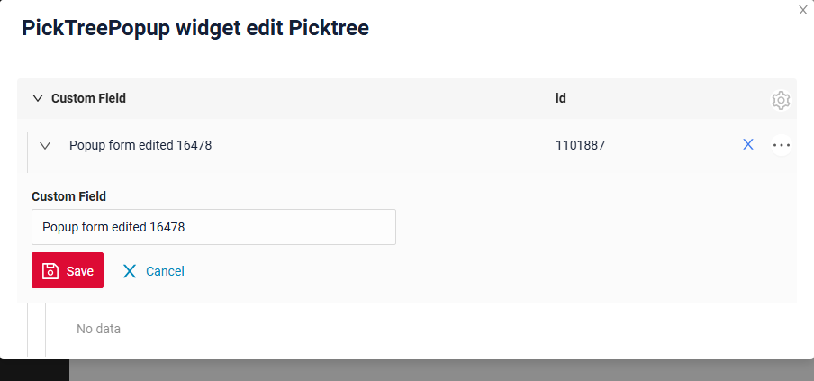

###### How to add?
??? Example

    **Step1** Create widget.json with type `Form` that appears when you click a button
    ```json
    --8<--
    {{ external_links.github_raw_doc }}/widgets/picktree/actions/edit/picktreepopup/picktree/inlineform/myEntity3353FormForEditPickTreeInlineForm.widget.json
    --8<--
    ```

    **Step2** Add widget.json with type `Form` to corresponding **.view.json**.
    ```json
    --8<--
    {{ external_links.github_raw_doc }}/widgets/picktree/actions/edit/myexample3353listinlineform.view.json
    --8<--
    ```

    **Step3** Add button `edit` and widget with type `Form` to corresponding **.widget.json**.

    `options`.`edit`: Name widget that appears when you click a button

    ```json
    --8<--
    {{ external_links.github_raw_doc }}/widgets/picktree/actions/edit/picktreepopup/picktree/inlineform/myEntity3353PickTreeInlineForm.widget.json
    --8<--
    ```

    [:material-play-circle: Live Sample]({{ external_links.code_samples }}/ui/#/screen/myexample3353/view/myexample3353listinlineform){:target="_blank"} ·
    [:fontawesome-brands-github: GitHub]({{ external_links.github_ui }}/{{ external_links.github_branch }}/src/main/java/org/demo/documentation/widgets/picktree/actions/edit){:target="_blank"}
-->

#### **<a id="standart_delete">Delete</a>**
[:material-play-circle: Live Sample]({{ external_links.code_samples }}/ui/#/screen/myexample3353/view/myexample3354form){:target="_blank"} ·
[:fontawesome-brands-github: GitHub]({{ external_links.github_ui }}/{{ external_links.github_branch }}/src/main/java/org/demo/documentation/widgets/picktree/actions/delete){:target="_blank"}

`Delete` remove an existing record.

!!! tips
    Please note that the row you are attempting to delete may be referenced by another part of the system or a parent entity. To ensure clarity, you should handle this exception and provide a explanation to the user.

_Unavailable in this release, see `CXBOX-1369`. The sample is kept so that the behaviour can be re-checked._

<!--
###### How does it look?
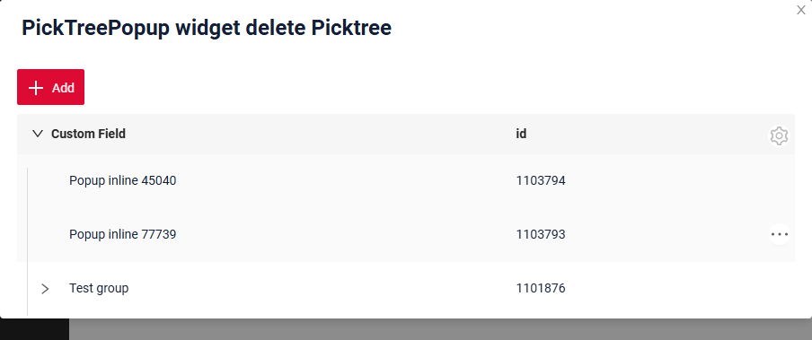

###### How to add?
??? Example

    **Step1** Add action *delete* to corresponding **VersionAwareResponseService**.

    By default, the access button is available when a record exist.

    ```java
    --8<--
    {{ external_links.github_raw_doc }}/widgets/picktree/actions/delete/forpicktreepopup/MyEntity3354PickPickService.java:getActions
    --8<--
    ```
    **Step2** Optional. Add *deleteEntity* to corresponding **VersionAwareResponseService**.

    ```java
    --8<--
    {{ external_links.github_raw_doc }}/widgets/picktree/actions/delete/forpicktreepopup/MyEntity3354PickPickService.java:deleteEntity
    --8<--
    ```
    **Step3** Add button ot group button to corresponding **.widget.json**.

    ```json
    --8<--
    {{ external_links.github_raw_doc }}/widgets/picktree/actions/delete/forpicktreepopup/myEntity3354PickPickPickTreePopup.widget.json
    --8<--
    ```
    [:material-play-circle: Live Sample]({{ external_links.code_samples }}/ui/#/screen/myexample3353/view/myexample3354form){:target="_blank"} ·
    [:fontawesome-brands-github: GitHub]({{ external_links.github_ui }}/{{ external_links.github_branch }}/src/main/java/org/demo/documentation/widgets/picktree/actions/delete){:target="_blank"}
-->

### Additional properties
#### Customization of displayed columns
not applicable
#### Filtration
##### Basic
see more  [Fields](/widget/type/property/filtration/filtration/)
#### FullTextSearch
`FullTextSearch` - when the user types in the full text search input area, then widget filters the rows that match the search query.
see [FullTextSearch](/widget/type/property/filtration/filtration/#by-fulltextsearch)
##### Personal filter group
not applicable
##### Filter group
not applicable
#### Pagination
`Pagination` is the process of dividing content into separate, discrete pages, making it easier to navigate and consume large amounts of information.
see [Pagination](/widget/type/property/pagination/pagination)

#### Export to Excel
not applicable

#### <a id="lazyload">Lazy load</a>
[:fontawesome-brands-github: GitHub]({{ external_links.github_ui }}/{{ external_links.github_branch }}/src/main/java/org/demo/documentation/widgets/property/pagination){:target="_blank"}

Every node keeps **its own pagination state**, so the records of one node are loaded page by page independently of the neighbouring nodes.

!!! info
    Instead of the "next page" arrow the tree shows the `More` button in the last row of a node.

    The page size selector `availableLimitsList` is placed in the gear menu of the widget.

###### How does it look?
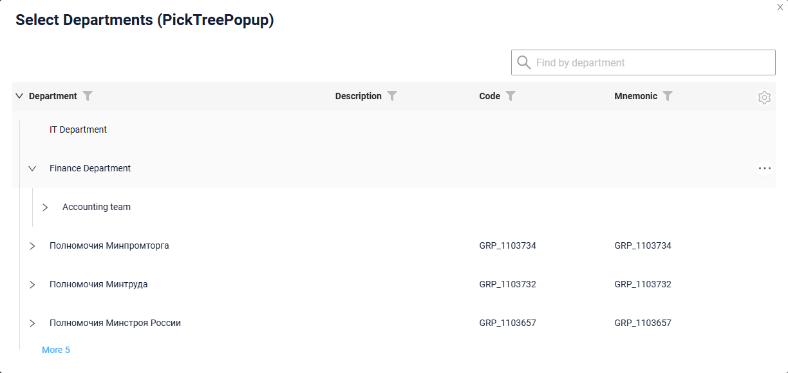

###### How to add?
??? Example
    Add in **options** parameter **pagination** to corresponding **.widget.json**.

    ```
    "pagination": {
      "availableLimitsList": [1, 2, 3]
    }
    ```

    ```json
    --8<--
    {{ external_links.github_raw_doc }}/widgets/property/pagination/availablelimitselist/myEntity3867PickPickPickTreePopup.widget.json
    --8<--
    ```

    [:fontawesome-brands-github: GitHub]({{ external_links.github_ui }}/{{ external_links.github_branch }}/src/main/java/org/demo/documentation/widgets/property/pagination/availablelimitselist){:target="_blank"}

The default number of the records requested for a node is defined by the page limit, see [Page limit](/widget/type/property/defaultlimitpage/defaultlimitpage).

```json
--8<--
{{ external_links.github_raw_doc }}/widgets/property/defaultlimitpage/myEntity359PickPickPickTreePopup.widget.json
--8<--
```

[:material-play-circle: Live Sample]({{ external_links.code_samples }}/ui/#/screen/myexample359/view/myexample359picktree){:target="_blank"} ·
[:fontawesome-brands-github: GitHub]({{ external_links.github_ui }}/{{ external_links.github_branch }}/src/main/java/org/demo/documentation/widgets/property/defaultlimitpage){:target="_blank"}

#### <a id="searchmodes">Search modes</a>
[:fontawesome-brands-github: GitHub]({{ external_links.github_ui }}/{{ external_links.github_branch }}/src/main/java/org/demo/documentation/widgets/property/filtration/fulltextsearch/forpicklist){:target="_blank"}

Filtration and full text search are performed with a standard request. The found records are displayed in one of two modes, defined by **options**.**tree**.**searchModes**:

* `collapse` — the found records are displayed together with the navigation path. The number of the levels of the path shown above a found record is defined by **options**.**tree**.**onFilterApplyNestLevel** (default `0`).
* `hide` — only the found records are displayed, everything else is hidden.

Both modes can be available at the same time, the first item of the array is the active one. The user switches between them.

The panel above the tree shows:

* `Clear N filter(s)` — the number of the applied filters,
* `Shown N` — the number of the displayed records,
* `More M` — the number of the found records that are not displayed yet.

###### How does it look?
=== "collapse"
    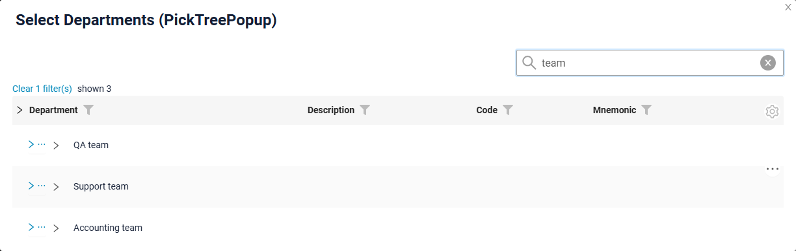
=== "hide"
    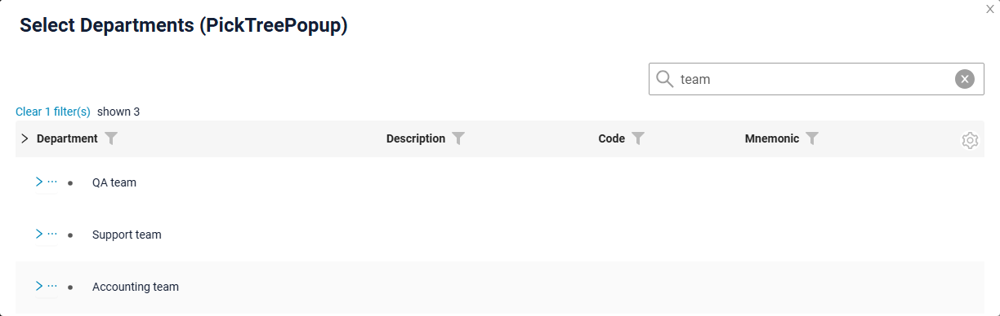

###### How to add?
??? Example
    Add in **options** parameter **fullTextSearch** and parameter **tree** to corresponding **.widget.json**.

    ```
    "tree": {
      "searchModes": ["collapse", "hide"],
      "onFilterApplyNestLevel": 0
    }
    ```

    ```json
    --8<--
    {{ external_links.github_raw_doc }}/widgets/property/filtration/fulltextsearch/forpicklist/myEntity3614PickPickPickTreePopup.widget.json
    --8<--
    ```

    [:fontawesome-brands-github: GitHub]({{ external_links.github_ui }}/{{ external_links.github_branch }}/src/main/java/org/demo/documentation/widgets/property/filtration/fulltextsearch/forpicklist){:target="_blank"}

#### <a id="selection">Selection modes</a>
A value is picked by a click on the row. What exactly the user is allowed to pick is defined by **options**.**tree**.**selection**:

* `node` — only the nodes can be picked.
* `leaf` — only the leaves can be picked.
* `nodeAndLeaf` — both the nodes and the leaves can be picked.

The rows that cannot be picked are still displayed and can be expanded, so the user navigates through them to the required record.

!!! info
    The `More` row is a pagination control, not a record, so it cannot be picked.

##### How does it look?
=== "node"
    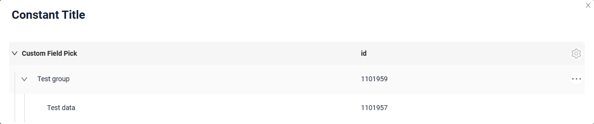
=== "leaf"
    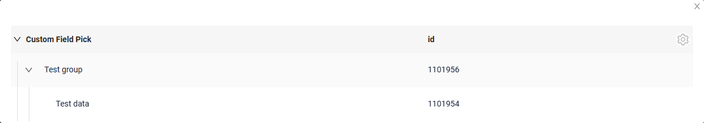
=== "nodeAndLeaf"
    

##### How to add?
??? Example
    Add in **options** parameter **tree** to corresponding **.widget.json**.

    ```
    "tree": {
      "selection": "leaf"
    }
    ```

    ```json
    --8<--
    {{ external_links.github_raw_doc }}/widgets/tree/base/inner/myexample3261TreePickListPopup.widget.json
    --8<--
    ```

    [:material-play-circle: Live Sample]({{ external_links.code_samples }}/ui/#/screen/myexample3261/view/myexample3261list){:target="_blank"} ·
    [:fontawesome-brands-github: GitHub]({{ external_links.github_ui }}/{{ external_links.github_branch }}/src/main/java/org/demo/documentation/widgets/tree/base/inner){:target="_blank"}
