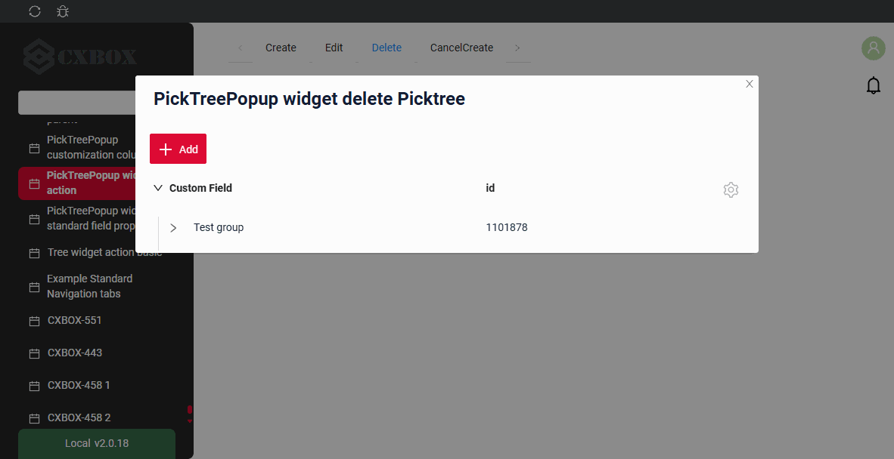
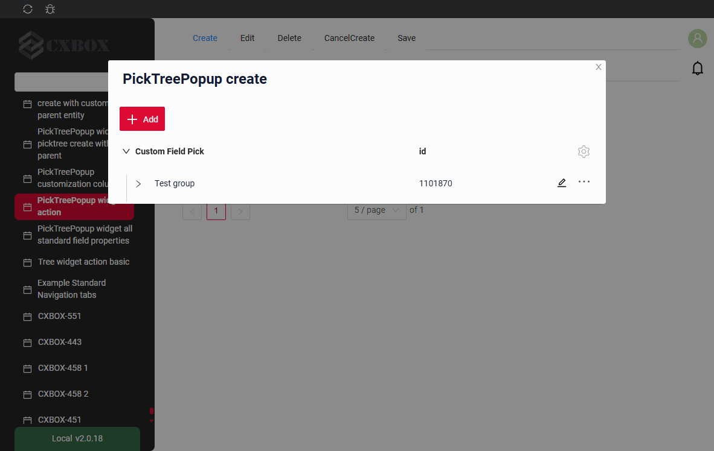
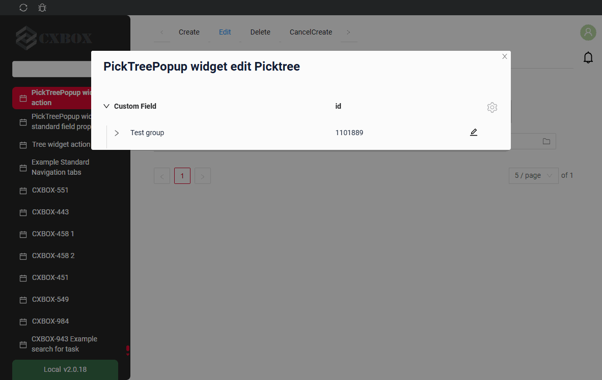
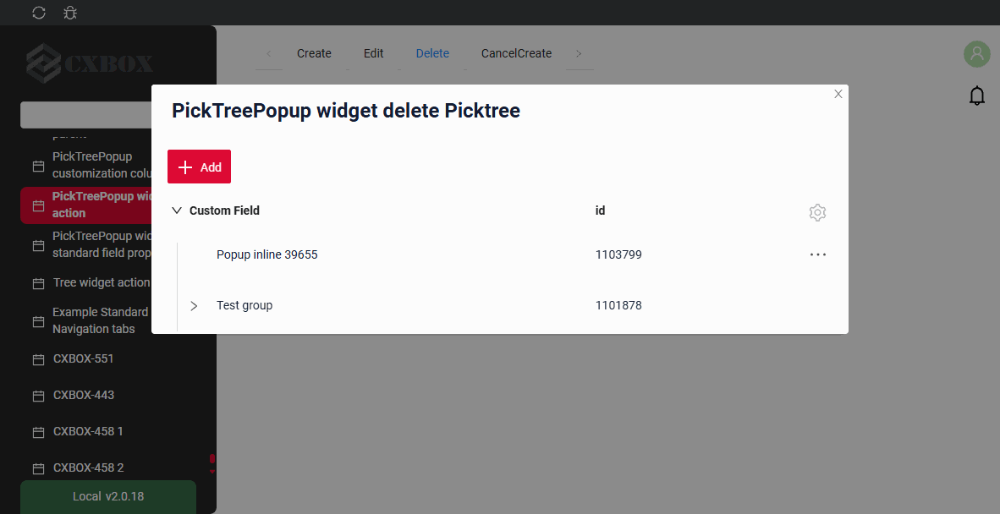
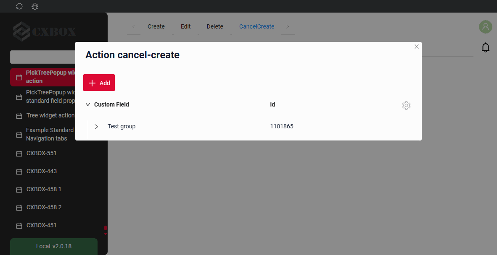
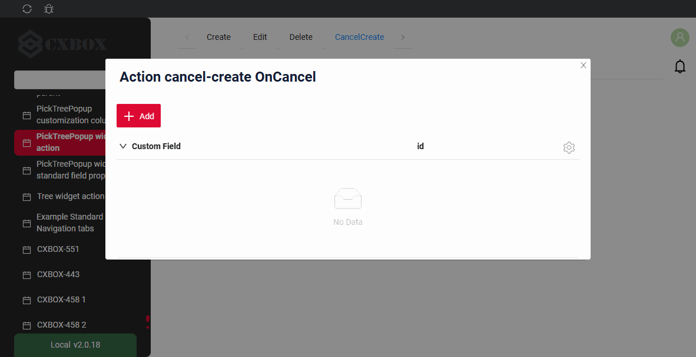
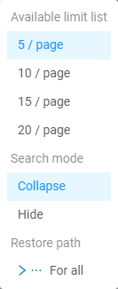

# PickTreePopup

Available since [v3.0.1](/new/version3001/)

`PickTreePopup` is a component that allows the user to select a value from a Popup list of entities.

!!! info
    The following features are **not available** for the `PickTreePopup` widget in this release:

    * fully or partially expanded initial load (the tree always opens collapsed)


## Basics
[:material-play-circle: Live Sample]({{ external_links.code_samples }}/ui/#/screen/myexample3343){:target="_blank"} ·
[:fontawesome-brands-github: GitHub]({{ external_links.github_ui }}/{{ external_links.github_branch }}/src/main/java/org/demo/documentation/widgets/picktree/base){:target="_blank"}

The popup shows the records as a tree: the requirements of the [Tree widget](/widget/type/tree/tree/#basics) apply to the business component of the popup.

The minimal data set of a record of the popup is:

* `id` — the identifier of the record.
* `parentId` — the identifier of the parent record. For a root record the value is `null`.
  The backend must **always** return this field, and the field must be **filterable**, because the tree is built with the requests `parentId.specified=false` (root records) and `parentId.equals=<id>` (child records). see more [Lazy load](#lazyload)
* a name (title) field — the value shown in the tree column and picked into the field.
* `isLeaf` — a computed boolean flag. The default value is `false`. The value `true` means that the record has no child records, so the expand arrow is not displayed for it.

!!! info
    The **first** field of the `fields` array is rendered as the tree column: the expand arrow. All the other fields are rendered as ordinary columns.

    `parentId` and `isLeaf` are service fields: they are declared in the popup widget with type **hidden**.

**<a id="optionstree">options.tree</a>**

All tree specific settings are placed in **options**.**tree** of **_.widget.json_**.

??? Example

    | Property                 | Type                                            | Default                  | Description                                                                                                       |
    |--------------------------|-------------------------------------------------|--------------------------|-------------------------------------------------------------------------------------------------------------------|
    | `parentIdFieldKey`       | String                                          | `parentId`               | Name of the field that holds the identifier of the parent record.                                                   |
    | `isLeafFieldKey`         | String                                          | `isLeaf`                 | Name of the field that holds the flag "the record has no child records".                                             |
    | `searchModes`            | Array of `collapse`, `hide`                     | `["collapse", "hide"]`   | Modes of displaying the filtration result. The first item of the array is the active one. see [Search modes](#searchmodes) |
    | `onFilterApplyNestLevel` | Number                                          | `0`                      | How many levels of the navigation path are shown above a found record in `collapse` mode. see [Search modes](#searchmodes) |
    | `insertPosition`         | `start`, `end`                                  | —                        | Where a newly created row is inserted inside its node. see [Create](#createinline)                                  |
    | `selection`              | `node`, `nodeAndLeaf`, `leaf`                   | —                        | What the user is allowed to pick. see [Selection modes](#selection) |

**<a id="lazyload">Lazy load</a>**

The tree is always loaded **lazily** and always opens **collapsed**: only the root records are requested when the popup is opened, and the child records of a node are requested when the user expands it.

!!! info
    The operation `specified` is used **only** to select the records with an empty parent. For all the other requests the operation `equals` is used.
    This is why the field that holds the parent identifier must be filterable on the backend.

Every node keeps **its own pagination state**, so the records of one node are loaded page by page independently of the neighbouring nodes. see more [Pagination](#pagination)

??? Example
    * **Root records** are requested with the filter by an empty parent:

    ```
    ?parentId.specified=false&_page=1&_limit=5
    ```

    * **Child records** of a node are requested when the node is expanded:

    ```
    ?parentId.equals=<id>&_page=1&_limit=5
    ```

### How does it look?


??? Example
 
    **Step1** Add field with type **pickTree**  see more [Fields](#fields)

    ```json
    --8<--
    {{ external_links.github_raw_doc }}/widgets/picktree/base/onefield/MyExample3351List.widget.json
    --8<--
    ```
 
    **Step2** Create popup widget **_.widget.json_** with type = **"PickTreePopup"**.

    For the tree to work correctly, the popup widget must contain the `parentId` and `isLeaf` fields. These fields should be configured as **hidden**.

    ```json
    --8<--
    {{ external_links.github_raw_doc }}/widgets/picktree/base/onefield/picktreepopup/picktree/myEntity3351PickPickPickTreePopup.widget.json
    --8<--
    ```

    **Step3** Add widget and popup widget to corresponding **_.view.json_**.

    ```json
    --8<--
    {{ external_links.github_raw_doc }}/widgets/picktree/base/onefield/myexample3351list.view.json
    --8<--
    ```
 
    [:material-play-circle: Live Sample]({{ external_links.code_samples }}/ui/#/screen/myexample3343){:target="_blank"} ·
    [:fontawesome-brands-github: GitHub]({{ external_links.github_ui }}/{{ external_links.github_branch }}/src/main/java/org/demo/documentation/widgets/picktree/base){:target="_blank"}

 
## Title
[:material-play-circle: Live Sample]({{ external_links.code_samples }}/ui/#/screen/myexample3344){:target="_blank"} ·
[:fontawesome-brands-github: GitHub]({{ external_links.github_ui }}/{{ external_links.github_branch }}/src/main/java/org/demo/documentation/widgets/picktree/title){:target="_blank"}

### Title Basic
There are 3 types of titles for a Picktree Popup:

* `constant title`: displays a fixed piece of text which cannot be changed. 
* `constant title empty`: shows no text.
* `calculated title`: displays a dynamic piece of text, meaning it can change based on business logic or data in the application.
 
#### How does it look?
=== "Constant title"
    
=== "Constant title empty"
    
=== "Calculated title"
    


#### How to add?
??? Example
    === "Constant title"
        **Step1** Add name for **title** to **_.widget.json_**.
        ```json
        --8<--
        {{ external_links.github_raw_doc }}/widgets/picktree/title/withtitle/myEntity3344PickPickTreePopup.widget.json
        --8<--
        ```
 
    === "Constant title empty"
        **Step1** Delete parameter **title** to **_.widget.json_**.
        ```json
        --8<--
        {{ external_links.github_raw_doc }}/widgets/picktree/title/withouttitle/myEntity3345PickPickTreePopup.widget.json
        --8<--
        ```
 
    === "Calculated title"
        <!--родитель??-->
        **Step1** Add ${customField} for **title** to **_.widget.json_**.
        ```json
        --8<--
        {{ external_links.github_raw_doc }}/widgets/picktree/title/calculatedtitle/myEntity3347PickPickTreePopup.widget.json
        --8<--
        ```
 
### Title Color
`Title Color` allows you to specify a color for a title. It can be constant or calculated.

**Constant color**

[:material-play-circle: Live Sample]({{ external_links.code_samples }}/ui/#/screen/myexample3341/view/myexample3341formcolorconst){:target="_blank"} ·
[:fontawesome-brands-github: GitHub]({{ external_links.github_ui }}/{{ external_links.github_branch }}/src/main/java/org/demo/documentation/widgets/picktree/colortitle){:target="_blank"}

*Constant color* is a fixed color that doesn't change. It remains the same regardless of any factors in the application.
**Calculated color**

[:material-play-circle: Live Sample]({{ external_links.code_samples }}/ui/#/screen/myexample3341/view/myexample3341form){:target="_blank"} ·
[:fontawesome-brands-github: GitHub]({{ external_links.github_ui }}/{{ external_links.github_branch }}/src/main/java/org/demo/documentation/widgets/picktree/colortitle){:target="_blank"}

*Calculated color* can be used to change a title color dynamically. It changes depending on business logic or data in the application.

!!! info
    Title colorization is **applicable** to the following [fields](/widget/fields/fieldtypes/): date, dateTime, dateTimeWithSeconds, number, money, percent, time, input, text, dictionary, radio, checkbox, pickList, inlinePickList, multivalue, multivalueHover.

#### How does it look?


#### How to add?
??? Example
    === "Calculated color"

        **Step 1**   Add `custom field for color` to corresponding **DataResponseDTO**. The field can contain a HEX color or be null.
        ```java
        --8<--
        {{ external_links.github_raw_doc }}/widgets/picktree/colortitle/MyEntity3342PickDTO.java:colorDTO
        --8<--
        ```  
 
        **Step 2** Add **"bgColorKey"** :  `custom field for color` and  to .widget.json.

        Add in `title` field with `${customField}` 

        ```json
        --8<--
        {{ external_links.github_raw_doc }}/widgets/picktree/colortitle/myEntity3342PickTreePopup.widget.json
        --8<--
        ```       
 
    === "Constant color"
 
        Add **"bgColor"** :  `HEX color`  to .widget.json.

        Add in `title` field with `${customField}` 

        ```json
        --8<--
        {{ external_links.github_raw_doc }}/widgets/picktree/colortitle/myEntity3342PickTreePopupColorConst.widget.json
        --8<--
        ```
 
## <a id="bc">Business component</a>
This specifies the business component (BC) to which this form belongs.
A business component represents a specific part of a system that handles a particular business logic or data.

see more  [Business component](/environment/businesscomponent/businesscomponent/)

## <a id="Showcondition">Show condition</a>


## <a id="fields">Fields</a>
Fields Configuration. The fields array defines the individual fields present within the form.

```json
{
    "title": "Custom Field",
    "key": "customField",
    "type": "input"
}
```

* **"title"**

  Description:  Field Title.

  Type: String(optional).

* **"key"**

  Description: Name field to corresponding DataResponseDTO.

  Type: String(required).

* **"type"**

  Description: [Field types](/widget/fields/fieldtypes/)

  Type: String(required).


### How to add?
??? Example

    === "With plugin(recommended)"
        **Step 1** Download plugin
            [download Intellij Plugin](https://doc.cxbox.org/plugin/plugininstalling)
    
        **Step 2** Add existing field to an existing form widget
            
    === "Example of writing code"
        Add field to **_.widget.json_**.

          ```json
             --8<--
             {{ external_links.github_raw_doc }}/widgets/picktree/base/onefield/picktreepopup/picktree/myEntity3351PickPickPickTreePopup.widget.json
             --8<--
          ```
 
## <a id="Fieldslayout">Options layout</a>
**options.layout** - no use in this type.

## Standard Actions
`Actions` show available actions as separate buttons see more [Actions](/features/element/actions/actions).

**Standard Actions**:

* [`Create`](#standart_create): Action to initialize the process of creating a new record
* [`Edit`](#standart_edit): Action to change a record of the popup (inline-form)
* [`Delete`](#standart_delete): Action to remove a record of the popup
* [`Save`](#standart_save): Action to store the data entered or modified
* [`Cancel-create`](#standart_cancel_create): Action to abort the creation of a new record, discarding any input without saving
 

####  <a id="standart_create">Create</a>  
`Create` button enables you to create a new value by clicking the `Add` button. This action can be performed in three different ways, feel free to choose any, depending on your logic of application:

There are three methods to create a record:

* [Inline](#createinline): You can add a line directly.

!!! info
    Pagination won't function until the page is refreshed after adding records.

* [Inline-form](#withwidget): You can add data using a form widget without leaving your current view.

* [With view](#withview): not applicable.

##### <a id="createinline">Inline</a>
[:material-play-circle: Live Sample]({{ external_links.code_samples }}/ui/#/screen/myexample3353){:target="_blank"} ·
[:fontawesome-brands-github: GitHub]({{ external_links.github_ui }}/{{ external_links.github_branch }}/src/main/java/org/demo/documentation/widgets/picktree/actions/create){:target="_blank"}

With `Line Addition`, a new empty row is immediately added to the popup when the "Add" button is clicked. This is a quick way to add rows without needing to input data beforehand.

The position of the newly created row inside its node is defined by **options**.**tree**.**insertPosition**: `start` places it before the already loaded rows of the node, `end` places it after them. see [options.tree](#optionstree)

###### How does it look?


###### How to add?
??? Example

    **Step1** Add button `create` to corresponding **VersionAwareResponseService**. 
    ```java
    --8<--
    {{ external_links.github_raw_doc }}/widgets/picktree/actions/create/picktree/MyEntity3348PickPickService.java:getActions
    --8<--
    ```

    **Step2** Add button `create` to corresponding **.widget.json**. 

    The position of a newly created row inside its node is defined by `options`.`tree`.`insertPosition`: `start` places it before the already loaded rows of the node, `end` places it after them.

    ```json
    --8<--
    {{ external_links.github_raw_doc }}/widgets/picktree/actions/create/picktree/myEntity3348PickPickTreeCreateInlinePopup.widget.json
    --8<--
    ```
 
    **Step3** Add **fields.setEnabled** to corresponding **FieldMetaBuilder**.
    ```java
    --8<--
    {{ external_links.github_raw_doc }}/widgets/picktree/actions/create/picktree/MyEntity3348PickPickMeta.java:buildRowDependentMeta
    --8<--
    ```
 
    [:material-play-circle: Live Sample]({{ external_links.code_samples }}/ui/#/screen/myexample3353){:target="_blank"} ·
    [:fontawesome-brands-github: GitHub]({{ external_links.github_ui }}/{{ external_links.github_branch }}/src/main/java/org/demo/documentation/widgets/picktree/actions/create){:target="_blank"}

##### <a id="withwidget">Inline-form</a>
[:material-play-circle: Live Sample]({{ external_links.code_samples }}/ui/#/screen/myexample3353/view/myexample3348listinlineform){:target="_blank"} ·
[:fontawesome-brands-github: GitHub]({{ external_links.github_ui }}/{{ external_links.github_branch }}/src/main/java/org/demo/documentation/widgets/picktree/actions/create){:target="_blank"}

`Create with widget` opens an additional widget when the "Add" button is clicked. The form will appear in the popup, allowing you to view both the tree of entities and the form for adding a new row.
After filling the information in and clicking "Save", the new row is added to the tree.

The position of the newly created row inside its node is defined by **options**.**tree**.**insertPosition**: `start` places it before the already loaded rows of the node, `end` places it after them. see [options.tree](#optionstree)

###### How does it look?


###### How to add?
??? Example

    **Step1** Add button `create` to corresponding **VersionAwareResponseService**. 
    ```java
    --8<--
    {{ external_links.github_raw_doc }}/widgets/picktree/actions/create/picktree/MyEntity3348PickPickService.java:getActions
    --8<--
    ```
    **Step2** Add **fields.setEnabled** to corresponding **FieldMetaBuilder**.
    ```java
    --8<--
    {{ external_links.github_raw_doc }}/widgets/picktree/actions/create/picktree/MyEntity3348PickPickMeta.java:buildRowDependentMeta
    --8<--
    ```
    **Step3** Create widget.json with type `Form` that appears when you click a button
    ```json
    --8<--
    {{ external_links.github_raw_doc }}/widgets/picktree/actions/create/picktree/myEntity3348PickPickTreePopupForm.widget.json
    --8<--
    ```
 
     **Step4** Add widget.json with type `Form` to corresponding **.view.json**. 
    ```json
    --8<--
    {{ external_links.github_raw_doc }}/widgets/picktree/actions/create/picktree/myexample3348listinlineform.view.json
    --8<--
    ```
 
     **Step5** Add button `create` and widget with type `Form` to corresponding **.widget.json**.
       
    `options`.`create`: Name widget that appears when you click a button

    The position of a newly created row inside its node is defined by `options`.`tree`.`insertPosition`: `start` places it before the already loaded rows of the node, `end` places it after them.

        
    ```json
    --8<--
    {{ external_links.github_raw_doc }}/widgets/picktree/actions/create/picktree/myEntity3348PickPickTreePopup.widget.json
    --8<--
    ``` 
 
    [:material-play-circle: Live Sample]({{ external_links.code_samples }}/ui/#/screen/myexample3353/view/myexample3348listinlineform){:target="_blank"} ·
    [:fontawesome-brands-github: GitHub]({{ external_links.github_ui }}/{{ external_links.github_branch }}/src/main/java/org/demo/documentation/widgets/picktree/actions/create){:target="_blank"}

##### <a id="withview">With view</a>
_not applicable_

#### <a id="standart_edit">Edit</a>
`Edit` enables you to change the field value. Just like with `Create` button, there are three ways of implementing this Action.

There are three methods to edit a record:

* [Inline](#editline): not applicable

* [Inline-form](#editwithwidger): You can edit data using a form widget without leaving your current view.

* With view: not applicable

##### <a id="editline">Inline</a>
_not applicable_: a click on a row of the popup picks the value. A row is edited through the [inline-form](#editwithwidger) or right after it is created.

##### <a id="editwithwidger">Inline-form</a>
[:material-play-circle: Live Sample]({{ external_links.code_samples }}/ui/#/screen/myexample3353/view/myexample3353listinlineform){:target="_blank"} ·
[:fontawesome-brands-github: GitHub]({{ external_links.github_ui }}/{{ external_links.github_branch }}/src/main/java/org/demo/documentation/widgets/picktree/actions/edit){:target="_blank"}

`Edit with widget` opens an additional widget when clicking on the Edit option from a three-dot menu.

###### How does it look?


###### How to add?
??? Example

    **Step1** Create widget.json with type `Form` that appears when you click a button
    ```json
    --8<--
    {{ external_links.github_raw_doc }}/widgets/picktree/actions/edit/picktreepopup/picktree/inlineform/myEntity3353FormForEditPickTreeInlineForm.widget.json
    --8<--
    ```

    **Step2** Add widget.json with type `Form` to corresponding **.view.json**.
    ```json
    --8<--
    {{ external_links.github_raw_doc }}/widgets/picktree/actions/edit/myexample3353listinlineform.view.json
    --8<--
    ```

    **Step3** Add button `edit` and widget with type `Form` to corresponding **.widget.json**.

    `options`.`edit`: Name widget that appears when you click a button

    ```json
    --8<--
    {{ external_links.github_raw_doc }}/widgets/picktree/actions/edit/picktreepopup/picktree/inlineform/myEntity3353PickTreeInlineForm.widget.json
    --8<--
    ```

    [:material-play-circle: Live Sample]({{ external_links.code_samples }}/ui/#/screen/myexample3353/view/myexample3353listinlineform){:target="_blank"} ·
    [:fontawesome-brands-github: GitHub]({{ external_links.github_ui }}/{{ external_links.github_branch }}/src/main/java/org/demo/documentation/widgets/picktree/actions/edit){:target="_blank"}

##### With view
_not applicable_

#### **<a id="standart_delete">Delete</a>**
[:material-play-circle: Live Sample]({{ external_links.code_samples }}/ui/#/screen/myexample3353/view/myexample3354form){:target="_blank"} ·
[:fontawesome-brands-github: GitHub]({{ external_links.github_ui }}/{{ external_links.github_branch }}/src/main/java/org/demo/documentation/widgets/picktree/actions/delete){:target="_blank"}

`Delete` remove an existing record.

!!! tips
    Please note that the row you are attempting to delete may be referenced by another part of the system or a parent entity. To ensure clarity, you should handle this exception and provide a explanation to the user.

###### How does it look?


###### How to add?
??? Example

    **Step1** Add action *delete* to corresponding **VersionAwareResponseService**.

    By default, the access button is available when a record exist.

    ```java
    --8<--
    {{ external_links.github_raw_doc }}/widgets/picktree/actions/delete/forpicktreepopup/MyEntity3354PickPickService.java:getActions
    --8<--
    ```
    **Step2** Optional. Add *deleteEntity* to corresponding **VersionAwareResponseService**.

    ```java
    --8<--
    {{ external_links.github_raw_doc }}/widgets/picktree/actions/delete/forpicktreepopup/MyEntity3354PickPickService.java:deleteEntity
    --8<--
    ```
    **Step3** Add button or group button to corresponding **.widget.json**.

    ```json
    --8<--
    {{ external_links.github_raw_doc }}/widgets/picktree/actions/delete/forpicktreepopup/myEntity3354PickPickPickTreePopup.widget.json
    --8<--
    ```
    [:material-play-circle: Live Sample]({{ external_links.code_samples }}/ui/#/screen/myexample3353/view/myexample3354form){:target="_blank"} ·
    [:fontawesome-brands-github: GitHub]({{ external_links.github_ui }}/{{ external_links.github_branch }}/src/main/java/org/demo/documentation/widgets/picktree/actions/delete){:target="_blank"}

###  **<a id="standart_save">Save</a>**
[:material-play-circle: Live Sample]({{ external_links.code_samples }}/ui/#/screen/myexample3353/view/myexample3355form){:target="_blank"} ·
[:fontawesome-brands-github: GitHub]({{ external_links.github_ui }}/{{ external_links.github_branch }}/src/main/java/org/demo/documentation/widgets/picktree/actions/save){:target="_blank"}

`Save` to store the data entered or modified. see [information on autosave](/features/element/autosave/autosave)
 
###### How does it look?


###### How to add?
??? Example

    **Step1** Add action *save* to corresponding **VersionAwareResponseService**. 

    ```java
    --8<--
    {{ external_links.github_raw_doc }}/widgets/picktree/actions/save/MyExample3355Service.java:getActions
    --8<--
    ```  
    **Step2** Add button or group button to corresponding **.widget.json**.
   
    ```json
    --8<--
    {{ external_links.github_raw_doc }}/widgets/picktree/actions/save/MyExample3355Form.widget.json
    --8<--
    ```

    [:material-play-circle: Live Sample]({{ external_links.code_samples }}/ui/#/screen/myexample3353/view/myexample3355form){:target="_blank"} ·
    [:fontawesome-brands-github: GitHub]({{ external_links.github_ui }}/{{ external_links.github_branch }}/src/main/java/org/demo/documentation/widgets/picktree/actions/save){:target="_blank"}


### **<a id="standart_cancel_create">Cancel-create</a>**
[:material-play-circle: Live Sample]({{ external_links.code_samples }}/ui/#/screen/myexample3353/view/myexample3356form){:target="_blank"} ·
[:fontawesome-brands-github: GitHub]({{ external_links.github_ui }}/{{ external_links.github_branch }}/src/main/java/org/demo/documentation/widgets/picktree/actions/cancelcreate/basic){:target="_blank"}

`Cancel-create` abort the creation of a new record, discarding any input without saving
 
###### How does it look?
=== "Basic"
    
=== "With drilldown"
    

###### How to add?
??? Example
    === "Basic"

        **Step1** Add standart action *cancelCreate* to corresponding **VersionAwareResponseService**. 
        The interface displays "cancelCreate" as the default option.

        ```java
        --8<--
        {{ external_links.github_raw_doc }}/widgets/picktree/actions/cancelcreate/basic/MyEntity3356PickPickService.java:getActions
        --8<--
        ```
         **Step2** Add action *cancel-create* to corresponding **PickTreePopup**. 
 
        ```json
        --8<--
        {{ external_links.github_raw_doc }}/widgets/picktree/actions/cancelcreate/basic/myEntity3356PickPickPickTreePopup.widget.json
        --8<--
        ```
 
        [:material-play-circle: Live Sample]({{ external_links.code_samples }}/ui/#/screen/myexample3353/view/myexample3356form){:target="_blank"} ·
        [:fontawesome-brands-github: GitHub]({{ external_links.github_ui }}/{{ external_links.github_branch }}/src/main/java/org/demo/documentation/widgets/picktree/actions/cancelcreate/basic){:target="_blank"}

    === "With postAction"
        **Step1** Add action *cancel* to corresponding **VersionAwareResponseService** with postAction. 
    
        ```java
        --8<--
        {{ external_links.github_raw_doc }}/widgets/picktree/actions/cancelcreate/postaction/MyEntity3356PickPostActionPickService.java:getActions
        --8<--
        ``` 
 
        **Step2** Add button or group button to corresponding **.widget.json**.
       
        ```json
        --8<--
        {{ external_links.github_raw_doc }}/widgets/picktree/actions/cancelcreate/postaction/myEntity3356PickPostActionPickPickTreePopup.widget.json
        --8<--
        ```
 
        [:material-play-circle: Live Sample]({{ external_links.code_samples }}/ui/#/screen/myexample3353/view/myexample3356formpostaction){:target="_blank"} ·
        [:fontawesome-brands-github: GitHub]({{ external_links.github_ui }}/{{ external_links.github_branch }}/src/main/java/org/demo/documentation/widgets/picktree/actions/cancelcreate/postaction){:target="_blank"}

    === "Method onCancel"
        !!! info
            Only for **Inner** Business Component see more [Business Component](/environment/businesscomponent/businesscomponent/)

        **Step1** Add standart action *cancelCreate* to corresponding **VersionAwareResponseService**. 
    
        ```java
        --8<--
        {{ external_links.github_raw_doc }}/widgets/picktree/actions/cancelcreate/oncancel/MyEntity3356PickOnCancelPickService.java:getActions
        --8<--
        ```
        **Step2** Add method *onCancel* to corresponding **VersionAwareResponseService**. 
        ```java
        --8<--
        {{ external_links.github_raw_doc }}/widgets/picktree/actions/cancelcreate/oncancel/MyEntity3356PickOnCancelPickService.java:onCancel
        --8<--
        ```
        **Step3** Add button or group button to corresponding **.widget.json**.
       
        ```json
        --8<--
        {{ external_links.github_raw_doc }}/widgets/picktree/actions/cancelcreate/oncancel/myEntity3356PickOnCancelPickPickTreePopup.widget.json
        --8<--
        ```

        [:material-play-circle: Live Sample]({{ external_links.code_samples }}/ui/#/screen/myexample3353/view/myexample3356formoncancel){:target="_blank"} ·
        [:fontawesome-brands-github: GitHub]({{ external_links.github_ui }}/{{ external_links.github_branch }}/src/main/java/org/demo/documentation/widgets/picktree/actions/cancelcreate/oncancel){:target="_blank"}


### Additional properties
#### <a id="noderefresh">Node refresh</a>
After an action (save, delete, cancel-create) the popup refreshes only the **node** the record belongs to, in the same way as a [Tree widget](/widget/type/tree/tree/#noderefresh):

* the row is updated from the response of the action or, if the response does not contain it, re-read with the request `?id.equals=<id>`;
* the row-meta of the row is requested again;
* if the record is not returned any more, the row is removed from the tree;
* the node is collapsed and its already loaded child records are forgotten, so they are loaded again on the next expand.

!!! info
    Sibling records and parent records are **not** refreshed automatically. `PostAction.refreshBC` is not supported for a tree in this release: the root page is loaded again, but the expanded nodes and their already loaded child records stay as they are.

#### Customization of displayed columns
not applicable
#### Filtration
##### Basic
see more  [Fields](/widget/type/property/filtration/filtration/)

Filtration of the popup is a standard request. The rows that match the filter are returned by the backend without any hierarchy, and the popup decides how to display them, see [Search modes](#searchmodes).

The panel above the tree shows:

* `Clear N filter(s)` — the number of applied filters and the possibility to reset them;
* `Shown N` — how many found records are currently displayed;
* `More M` — how many found records are not displayed yet, where `M` is the number of found records minus the number of shown records.

!!! info
    With the pagination mode `nextAndPreviousWithCount` the `/count` request is **not** performed after filtration. Instead of the number of found records an `i` icon is displayed with the tooltip **"Load more and show count"**.

#### FullTextSearch
`FullTextSearch` - when the user types in the full text search input area, then widget filters the rows that match the search query.
see [FullTextSearch](/widget/type/property/filtration/filtration/#by-fulltextsearch)

The result of a full text search is displayed in the same way as the result of filtration, see [Search modes](#searchmodes).
##### Personal filter group
not applicable
##### Filter group
not applicable

#### <a id="searchmodes">Search modes</a>
[:fontawesome-brands-github: GitHub]({{ external_links.github_ui }}/{{ external_links.github_branch }}/src/main/java/org/demo/documentation/widgets/property/filtration/fulltextsearch/forpicklist){:target="_blank"}

The way the result of filtration and full text search is displayed is defined by **options**.**tree**.**searchModes**.

There are two modes:

* `collapse` — **search results and tree**. The tree displays the found records together with the records that are required for navigation: the navigation path above every found record is restored `onFilterApplyNestLevel` levels up. The user can navigate through the tree, expand and collapse branches, see the neighbouring records and load additional records.
* `hide` — **search results only**. The tree displays only the found records, everything else is hidden. The user works with the search result only and cannot navigate through the other records of the tree.

Both modes can be available at the same time. The **first** item of the `searchModes` array is the mode that is active when the filter is applied; the user switches between the available modes in the gear menu of the popup.

**Restoring the path upwards**

In `collapse` mode the records whose parents have not been loaded yet are placed under a pseudo node. The `>...` button loads the missing parents with the request `?id.equals=<parentId>` and moves the records into the hierarchy. One click restores up to **2** levels of nesting, so for a deep hierarchy the button has to be pressed several times.

###### How does it look?
=== "Search results and tree (collapse)"
    
=== "Search results only (hide)"
    
=== "Switching between modes"
    

###### How to add?
??? Example
    **Step1** Add **options**.**tree**.**searchModes** to corresponding **_.widget.json_**.

    The first item of the array is the mode that is active when the filter is applied.

    ```
    "tree": {
      "searchModes": ["collapse", "hide"],
      "onFilterApplyNestLevel": 0
    }
    ```

    ```json
    --8<--
    {{ external_links.github_raw_doc }}/widgets/property/filtration/fulltextsearch/forpicklist/myEntity3614PickPickPickTreePopup.widget.json
    --8<--
    ```

    [:fontawesome-brands-github: GitHub]({{ external_links.github_ui }}/{{ external_links.github_branch }}/src/main/java/org/demo/documentation/widgets/property/filtration/fulltextsearch/forpicklist){:target="_blank"}

#### <a id="pagination">Pagination</a>
`Pagination` is the process of dividing content into separate, discrete pages, making it easier to navigate and consume large amounts of information.
see [Pagination](/widget/type/property/pagination/pagination)

The popup has no navigation arrows. Instead of the "next" arrow the last row of a node is the **`More`** button, which loads the next page of the node and appends it to the already loaded records. The limit selector (`availableLimitsList`) is moved to the gear menu of the popup.

The `More` button follows the same algorithm as the "next" arrow of the three pagination modes:

| Pagination mode              | When `More` is displayed                                                                      | Counter                                     |
|------------------------------|-----------------------------------------------------------------------------------------------|---------------------------------------------|
| `nextAndPreviousWithHasNext` | `hasNext` returned by the backend is `true`                                                     | not displayed                               |
| `nextAndPreviousWithCount`   | `count` is greater than the number of already loaded records                                    | how many records are left to load           |
| `nextAndPreviousSmart`       | the backend returned more records than the limit of the node                                    | not displayed                               |

see more [Pagination modes](/widget/type/property/pagination/pagination)

###### How does it look?


###### How to add?
??? Example
    === "availableLimitsList"
        The list of available limits is displayed in the gear menu of the popup.

        ```
        "pagination": {
          "availableLimitsList": [1, 2, 3]
        }
        ```

        ```json
        --8<--
        {{ external_links.github_raw_doc }}/widgets/property/pagination/availablelimitselist/myEntity3867PickPickPickTreePopup.widget.json
        --8<--
        ```

        [:fontawesome-brands-github: GitHub]({{ external_links.github_ui }}/{{ external_links.github_branch }}/src/main/java/org/demo/documentation/widgets/property/pagination/availablelimitselist){:target="_blank"}

    === "Page limit"
        The default number of the records requested for a node is defined by the page limit, see [Page limit](/widget/type/property/defaultlimitpage/defaultlimitpage).

        ```json
        --8<--
        {{ external_links.github_raw_doc }}/widgets/property/defaultlimitpage/myEntity359PickPickPickTreePopup.widget.json
        --8<--
        ```

        [:material-play-circle: Live Sample]({{ external_links.code_samples }}/ui/#/screen/myexample359/view/myexample359picktree){:target="_blank"} ·
        [:fontawesome-brands-github: GitHub]({{ external_links.github_ui }}/{{ external_links.github_branch }}/src/main/java/org/demo/documentation/widgets/property/defaultlimitpage){:target="_blank"}

#### Export to Excel
not applicable

#### Multi-upload files
not applicable

##### Sorting
`Sorting` allows the user to sort the records by a column.
see [Sorting](/widget/type/property/sorting/sorting)

Sorting of the popup works **inside a node**: the records are sorted among the children of the same parent, the hierarchy itself is not changed. In all other respects sorting is standard.

#### <a id="selection">Selection modes</a>
A value is picked by a click on the row. What exactly the user is allowed to pick is defined by **options**.**tree**.**selection**:

* `node` — only the nodes can be picked.
* `leaf` — only the leaves can be picked.
* `nodeAndLeaf` — both the nodes and the leaves can be picked.

The rows that cannot be picked are still displayed and can be expanded, so the user navigates through them to the required record.

!!! info
    The `More` row is a pagination control, not a record, so it cannot be picked.

##### How does it look?
=== "node"
    
=== "leaf"
    
=== "nodeAndLeaf"
    

##### How to add?
??? Example
    Add in **options** parameter **tree** to corresponding **.widget.json**.

    ```
    "tree": {
      "selection": "leaf"
    }
    ```

    ```json
    --8<--
    {{ external_links.github_raw_doc }}/widgets/tree/base/inner/myexample3261TreePickListPopup.widget.json
    --8<--
    ```

    [:material-play-circle: Live Sample]({{ external_links.code_samples }}/ui/#/screen/myexample3261/view/myexample3261list){:target="_blank"} ·
    [:fontawesome-brands-github: GitHub]({{ external_links.github_ui }}/{{ external_links.github_branch }}/src/main/java/org/demo/documentation/widgets/tree/base/inner){:target="_blank"}
