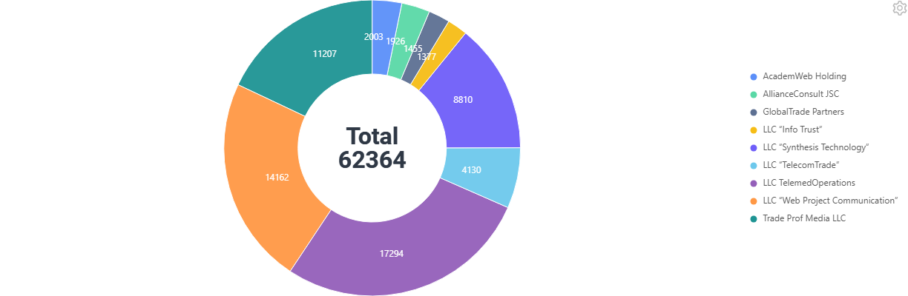
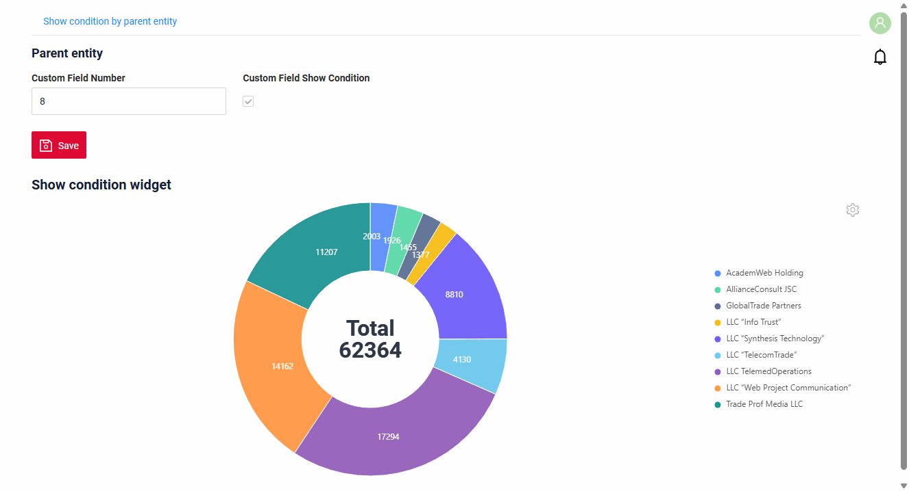
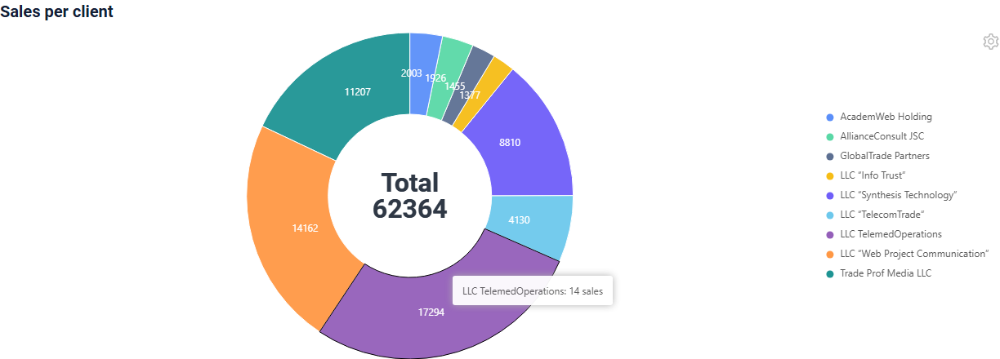
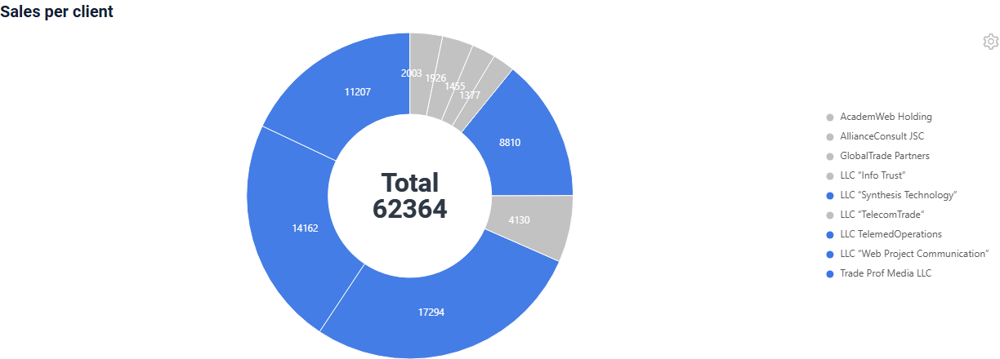
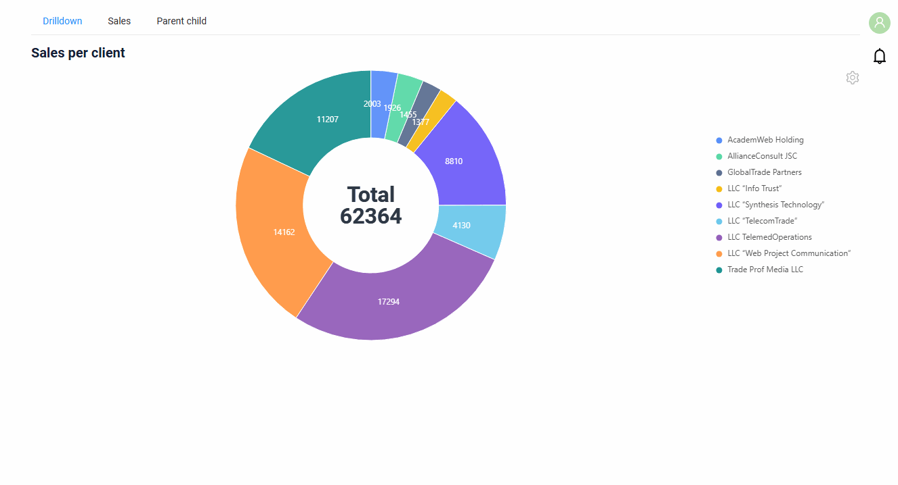
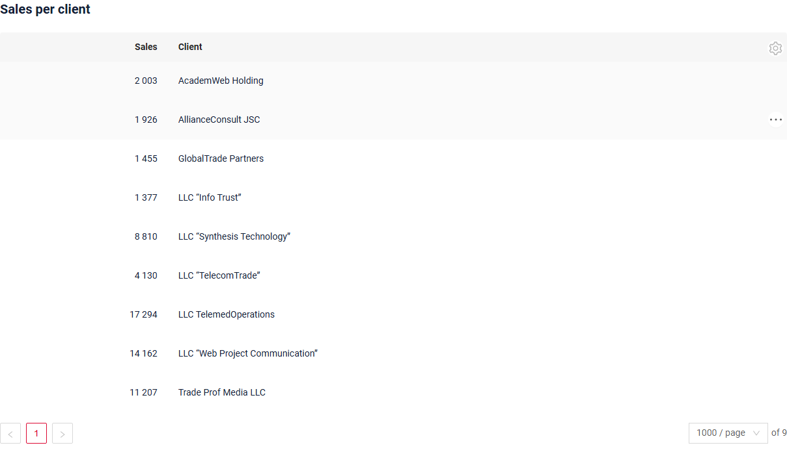
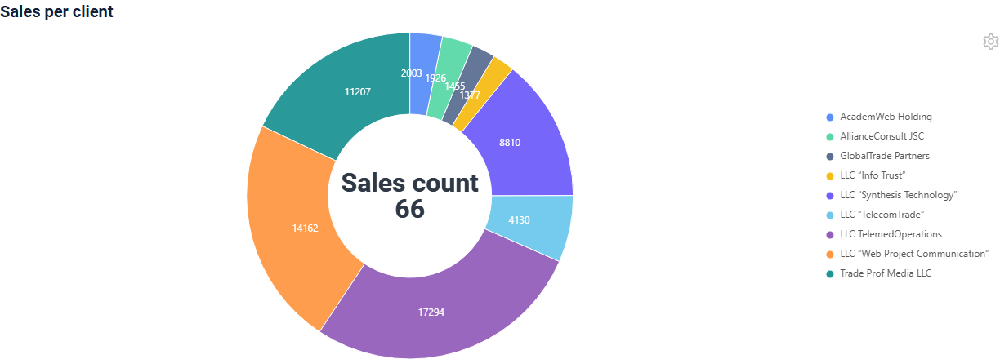
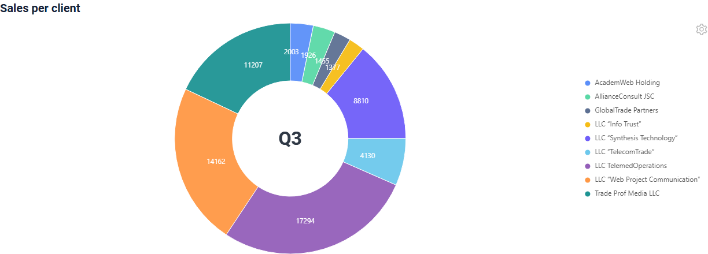
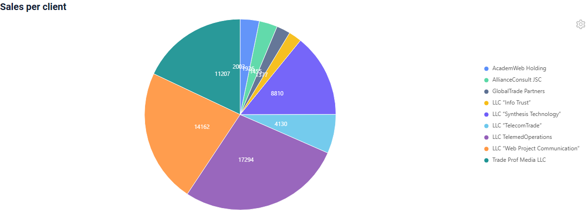
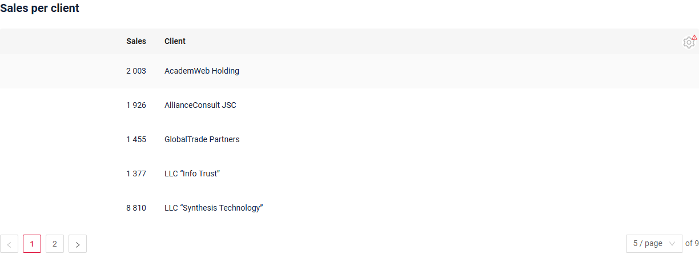

# Pie1D

`Pie1D` widget shows how a whole is split into parts: every record is a segment of a ring, its size is the value of the record.
The total of all values can be shown in the center. Usually the data is aggregated, for example the sales of every client.
The data can be sourced either from a database or from external sources.

## Basics
[:material-play-circle: Live Sample]({{ external_links.code_samples }}/ui/#/screen/myexample4207){:target="_blank"} ·
[:fontawesome-brands-github: GitHub]({{ external_links.github_ui }}/{{ external_links.github_branch }}/src/main/java/org/demo/documentation/widgets/pie1d/base/defaultfields){:target="_blank"}

### How does it look?


The widget shows:

* a segment for every record. The size of the segment is the value of the record, the label inside shows the value.
* the legend with the titles of the records. A click on a title in the legend hides the segment or shows it again, the total in the center is recalculated.
* the total in the center, see [Total](#total).
* the tooltip with the title and the value when the mouse is over a segment, see [Tooltip](#tooltip).

The gear menu in the top right corner switches the widget between the chart and the table, see [Table mode](#tablemode).

Rules for the data:

* one record is one segment. Aggregate the data in the DAO: for example, one record per client with the sum of his sales.
* the segments go clockwise from the top in the order of the records returned by the backend.
* every record has a unique `id`. It is required for the proper functioning of the widget and for the drilldown.

`options.chart1D` sets which fields of the widget the chart uses:

| Parameter | Description |
|---|---|
| `valueFieldKey` | Required. The field with the value of the segment. The field must be a number. |
| `titleFieldKey` | The field with the title of the segment: the legend, the tooltip and the colors of the segments. Without it the segments are colored by the value and the legend is not shown. |
| `descriptionFieldKey` | The list of fields for the tooltip, see [Tooltip](#tooltip). |
| `valuePosition` | Where the values are shown: `inner` (default) or `outer`, see [Label position](#labelposition). |
| `total` | The text in the center, see [Total](#total). |

###  <a id="Howtoaddbacis">How to add?</a>
??? Example
    **Step1** Create **DataResponseDTO** with the fields of the segment: the title and the value.
    ```java
    --8<--
    {{ external_links.github_raw_doc }}/widgets/pie1d/base/defaultfields/MyExample4207DTO.java
    --8<--
    ```

    **Step2** Create **DAO** extends AbstractAnySourceBaseDAO<> implements AnySourceBaseDAO. It returns a record for every segment, each with a unique id.
    ```java
    --8<--
    {{ external_links.github_raw_doc }}/widgets/pie1d/base/defaultfields/MyExample4207Dao.java:getStats
    --8<--
    ```

    **Step3** Create **Meta** extends AnySourceFieldMetaBuilder.
    ```java
    --8<--
    {{ external_links.github_raw_doc }}/widgets/pie1d/base/defaultfields/MyExample4207Meta.java
    --8<--
    ```

    **Step4** Create **Service** extends AnySourceVersionAwareResponseService.
    ```java
    --8<--
    {{ external_links.github_raw_doc }}/widgets/pie1d/base/defaultfields/MyExample4207Service.java
    --8<--
    ```

    **Step5** Create **.widget.json** with type **Pie1D**. Add the fields of the chart to **fields** and map them in **options.chart1D**.
    ```json
    --8<--
    {{ external_links.github_raw_doc }}/widgets/pie1d/base/defaultfields/MyExample4207Pie.widget.json
    --8<--
    ```

    **Step6** Add the widget to the corresponding **.view.json**.
    ```json
    --8<--
    {{ external_links.github_raw_doc }}/widgets/pie1d/base/defaultfields/myexample4207pie.view.json
    --8<--
    ```

    **Step7** Set **PAGE_LIMIT** of the business component in **BC_PROPERTIES** greater than the number of segments: the chart shows one page, see [Page limit](#pagelimit).
    ```
    myExampleBc4207;1000;NULL;NULL;'""';
    ```

    [:material-play-circle: Live Sample]({{ external_links.code_samples }}/ui/#/screen/myexample4207){:target="_blank"} ·
    [:fontawesome-brands-github: GitHub]({{ external_links.github_ui }}/{{ external_links.github_branch }}/src/main/java/org/demo/documentation/widgets/pie1d/base/defaultfields){:target="_blank"}

## <a id="Title">Title</a>
### Title Basic
[:material-play-circle: Live Sample]({{ external_links.code_samples }}/ui/#/screen/myexample4220){:target="_blank"} ·
[:fontawesome-brands-github: GitHub]({{ external_links.github_ui }}/{{ external_links.github_branch }}/src/main/java/org/demo/documentation/widgets/pie1d/title){:target="_blank"}

`Title` for widget (optional)

There are types of:

* `constant title`: shows constant text.
* `constant title empty`: if you want to visually connect widgets by them to be placed one under another

#### How does it look?
=== "Constant title"
    
=== "Constant title empty"
    

#### How to add?
??? Example
    === "Constant title"
        **Step1** Add name for **title** to **_.widget.json_**.
        ```json
        --8<--
        {{ external_links.github_raw_doc }}/widgets/pie1d/title/withtitle/MyExample4220Pie.widget.json
        --8<--
        ```

        [:material-play-circle: Live Sample]({{ external_links.code_samples }}/ui/#/screen/myexample4220/view/myexample4220pie){:target="_blank"} ·
        [:fontawesome-brands-github: GitHub]({{ external_links.github_ui }}/{{ external_links.github_branch }}/src/main/java/org/demo/documentation/widgets/pie1d/title/withtitle){:target="_blank"}

    === "Constant title empty"
        **Step1** Delete parameter **title** from **_.widget.json_**.
        ```json
        --8<--
        {{ external_links.github_raw_doc }}/widgets/pie1d/title/withouttitle/MyExample4217Pie.widget.json
        --8<--
        ```

        [:material-play-circle: Live Sample]({{ external_links.code_samples }}/ui/#/screen/myexample4220/view/myexample4217pie){:target="_blank"} ·
        [:fontawesome-brands-github: GitHub]({{ external_links.github_ui }}/{{ external_links.github_branch }}/src/main/java/org/demo/documentation/widgets/pie1d/title/withouttitle){:target="_blank"}

### Title Color
_not applicable_

## <a id="bc">Business component</a>
This specifies the business component (BC) to which this widget belongs.
A business component represents a specific part of a system that handles a particular business logic or data.

see more  [Business component](/environment/businesscomponent/businesscomponent/)

The data of a chart is usually calculated, so the samples use an AnySource business component: the DAO builds a record for every segment.
Give every record a unique `id`, see [Basics](#basics).

## <a id="Showcondition">Show condition</a>

* `no show condition - recommended`: widget always visible

  [:material-play-circle: Live Sample]({{ external_links.code_samples }}/ui/#/screen/myexample4207){:target="_blank"} ·
  [:fontawesome-brands-github: GitHub]({{ external_links.github_ui }}/{{ external_links.github_branch }}/src/main/java/org/demo/documentation/widgets/pie1d/base/defaultfields){:target="_blank"}

* `show condition by current entity`: **not recommended** for the chart.

* `show condition by parent entity`: condition can include boolean expression depending on parent entity. Parent field updates will trigger condition recalculation only on save or if field is force active shown on same view

  [:material-play-circle: Live Sample]({{ external_links.code_samples }}/ui/#/screen/myexample4215){:target="_blank"} ·
  [:fontawesome-brands-github: GitHub]({{ external_links.github_ui }}/{{ external_links.github_branch }}/src/main/java/org/demo/documentation/widgets/pie1d/showcondition){:target="_blank"}

!!! tips
    It is recommended not to use `Show condition` when possible, because wide usage of this feature makes application hard to support.

#### <a id="howdoesitlook">How does it look?</a>
=== "no show condition"
    
=== "show condition by current entity"
    **Not recommended** for the chart.
=== "show condition by parent entity"
    

#### <a id="howtoadd">How to add?</a>
??? Example

    === "no show condition"
        see [Basics](#basics)

    === "show condition by current entity"
        **Not recommended** for the chart.

    === "show condition by parent entity"
        **Step1** Add **showCondition** to **_.widget.json_**. see more [showCondition](/widget/type/property/showcondition/showcondition)
        ```json
        --8<--
        {{ external_links.github_raw_doc }}/widgets/pie1d/showcondition/MyExample4215Pie.widget.json
        --8<--
        ```
        [:material-play-circle: Live Sample]({{ external_links.code_samples }}/ui/#/screen/myexample4215){:target="_blank"} ·
        [:fontawesome-brands-github: GitHub]({{ external_links.github_ui }}/{{ external_links.github_branch }}/src/main/java/org/demo/documentation/widgets/pie1d/showcondition){:target="_blank"}

## <a id="fields">Fields</a>
Fields Configuration. The fields array defines the fields of a segment. The chart uses the fields named in `options.chart1D`;
the other fields are shown in the [table mode](#tablemode).

```json
{
    "title": "Sales",
    "key": "value",
    "type": "number"
}
```

* **"title"**

  Description: Field Title. It is the title of the column in the table mode.

  Type: String(optional).

* **"key"**

  Description: Name field to corresponding DataResponseDTO.

  Type: String(required).

* **"type"**

  Description: [Field types](/widget/fields/fieldtypes/). The field of `valueFieldKey` must be numeric.

  Type: String(required).

A field with type `hidden` is not shown in the table mode. Use it for the values that only the drilldown filter needs.

### How to add?
??? Example
    Add field to **_.widget.json_**.

      ```json
         --8<--
         {{ external_links.github_raw_doc }}/widgets/pie1d/base/defaultfields/MyExample4207Pie.widget.json
         --8<--
      ```

## <a id="Fieldslayout">Options layout</a>
**options.layout** - no use in this type.

## Actions
_not applicable_

### Additional properties

#### <a id="tooltip">Tooltip</a>
[:material-play-circle: Live Sample]({{ external_links.code_samples }}/ui/#/screen/myexample4211){:target="_blank"} ·
[:fontawesome-brands-github: GitHub]({{ external_links.github_ui }}/{{ external_links.github_branch }}/src/main/java/org/demo/documentation/widgets/pie1d/tooltip){:target="_blank"}

When the mouse is over a segment, the tooltip shows the title and the value of the segment.
`options.chart1D.descriptionFieldKey` replaces them with the text of the listed fields, separated by commas.
Without `titleFieldKey` and `descriptionFieldKey` the tooltip is not shown.

###### How does it look?


###### How to add?
??? Example
    **Step1** Add the field with the text to the **DataResponseDTO** and fill it in the **DAO**.
    ```java
    --8<--
    {{ external_links.github_raw_doc }}/widgets/pie1d/tooltip/MyExample4211Dao.java:getStats
    --8<--
    ```
    **Step2** Add the field to **fields** and to **descriptionFieldKey** in **_.widget.json_**.
    ```json
    --8<--
    {{ external_links.github_raw_doc }}/widgets/pie1d/tooltip/MyExample4211Pie.widget.json
    --8<--
    ```
    [:material-play-circle: Live Sample]({{ external_links.code_samples }}/ui/#/screen/myexample4211){:target="_blank"} ·
    [:fontawesome-brands-github: GitHub]({{ external_links.github_ui }}/{{ external_links.github_branch }}/src/main/java/org/demo/documentation/widgets/pie1d/tooltip){:target="_blank"}

#### <a id="color">Color</a>
`Color` sets the colors of the segments. By default every title gets its own color from the palette of the chart.

**Calculated color**

[:material-play-circle: Live Sample]({{ external_links.code_samples }}/ui/#/screen/myexample4218){:target="_blank"} ·
[:fontawesome-brands-github: GitHub]({{ external_links.github_ui }}/{{ external_links.github_branch }}/src/main/java/org/demo/documentation/widgets/pie1d/color){:target="_blank"}

*Calculated color* can be used to change the color of a segment dynamically. It changes depending on business logic or data in the application.
In the sample the key clients are blue, the others are grey.

**Constant color**

**not recommended**: `bgColor` gives all segments one color, the segments cannot be told apart.

###### How does it look?


###### How to add?
??? Example
    === "Calculated color"
        **Step 1** Add `custom field for color` to corresponding **DataResponseDTO**. The field can contain a HEX color or be null.
        ```java
        --8<--
        {{ external_links.github_raw_doc }}/widgets/pie1d/color/MyExample4218Dao.java:getStats
        --8<--
        ```

        **Step 2** Add **"bgColorKey"** : `custom field for color` to the field of `valueFieldKey` in .widget.json.
        ```json
        --8<--
        {{ external_links.github_raw_doc }}/widgets/pie1d/color/MyExample4218Pie.widget.json
        --8<--
        ```
        [:material-play-circle: Live Sample]({{ external_links.code_samples }}/ui/#/screen/myexample4218){:target="_blank"} ·
        [:fontawesome-brands-github: GitHub]({{ external_links.github_ui }}/{{ external_links.github_branch }}/src/main/java/org/demo/documentation/widgets/pie1d/color){:target="_blank"}

    === "Constant color"
        **not recommended**

#### <a id="drilldown">Drilldown</a>
[:material-play-circle: Live Sample]({{ external_links.code_samples }}/ui/#/screen/myexample4219/view/myexample4219pie){:target="_blank"} ·
[:fontawesome-brands-github: GitHub]({{ external_links.github_ui }}/{{ external_links.github_branch }}/src/main/java/org/demo/documentation/widgets/pie1d/drilldown/drilldown){:target="_blank"}

`DrillDown` allows you to navigate to another view by a click on a segment. Target view and other drill-down parts can be calculated based on business logic of application.
In the sample a click on a segment opens the list of sales filtered by the client of the segment.

Also, it optionally allows you to filter data on target view before it will be opened `see more` [DrillDown](/features/element/drilldown/drilldown)

###### How does it look?


###### How to add?
??? Example
    **Step1** Add **"drillDown": true** to the field of `valueFieldKey` in **_.widget.json_**.
    ```json
    --8<--
    {{ external_links.github_raw_doc }}/widgets/pie1d/drilldown/drilldown/MyExample4219Pie.widget.json
    --8<--
    ```

    **Step2** Add [fields.setDrilldown](/features/element/drilldown/drilldown) or **fields.setDrilldownWithFilter** for the field of `valueFieldKey` to corresponding **FieldMetaBuilder**.
    ```java
    --8<--
    {{ external_links.github_raw_doc }}/widgets/pie1d/drilldown/drilldown/MyExample4219Meta.java:buildRowDependentMeta
    --8<--
    ```
    [:material-play-circle: Live Sample]({{ external_links.code_samples }}/ui/#/screen/myexample4219/view/myexample4219pie){:target="_blank"} ·
    [:fontawesome-brands-github: GitHub]({{ external_links.github_ui }}/{{ external_links.github_branch }}/src/main/java/org/demo/documentation/widgets/pie1d/drilldown/drilldown){:target="_blank"}

#### <a id="tablemode">Table mode</a>
[:material-play-circle: Live Sample]({{ external_links.code_samples }}/ui/#/screen/myexample4207){:target="_blank"} ·
[:fontawesome-brands-github: GitHub]({{ external_links.github_ui }}/{{ external_links.github_branch }}/src/main/java/org/demo/documentation/widgets/pie1d/base/defaultfields){:target="_blank"}

The gear menu in the top right corner has two modes:

* `Chart` (default): the pie.
* `Table`: the same records as a table, a column for every field of the widget.

The mode is not saved: the widget opens in the chart mode.

###### How does it look?
=== "Chart"
    
=== "Table"
    

###### How to add?
The mode switch is available for every chart, no settings are needed.

#### <a id="Icon">Icon</a>
**not available** in this release.

[:material-play-circle: Live Sample]({{ external_links.code_samples }}/ui/#/screen/myexample4214){:target="_blank"} ·
[:fontawesome-brands-github: GitHub]({{ external_links.github_ui }}/{{ external_links.github_branch }}/src/main/java/org/demo/documentation/widgets/pie1d/icon){:target="_blank"}

#### <a id="total">Total</a>
[:material-play-circle: Live Sample]({{ external_links.code_samples }}/ui/#/screen/myexample4261){:target="_blank"} ·
[:fontawesome-brands-github: GitHub]({{ external_links.github_ui }}/{{ external_links.github_branch }}/src/main/java/org/demo/documentation/widgets/pie1d/total){:target="_blank"}

`Total` is the text in the center of the pie. It is set by `options.chart1D.total`:

| Parameter | Description |
|---|---|
| `func` | The aggregate function over the values of the shown segments: `sum`, `avg`, `min`, `max`. `avg` is rounded to two decimal places. |
| `argFieldKeys` | The fields for `func` instead of `valueFieldKey`, for example the count of sales when the segments show the sums. |
| `description` | The text above the result of `func`. |
| `value` | A constant text instead of `func` and `description`. Set either `value` or `func`, not both. |

A click on a title in the legend hides the segment, `func` is recalculated over the shown segments.

###### How does it look?
=== "Aggregate function"
    
=== "Aggregate other field"
    
=== "Constant text"
    

###### How to add?
??? Example
    === "Aggregate function"
        Add **total** with **func** and **description** to **options.chart1D** in **_.widget.json_**.
        ```json
        --8<--
        {{ external_links.github_raw_doc }}/widgets/pie1d/total/MyExample4261Sum.widget.json
        --8<--
        ```
        [:material-play-circle: Live Sample]({{ external_links.code_samples }}/ui/#/screen/myexample4261/view/myexample4261sum){:target="_blank"} ·
        [:fontawesome-brands-github: GitHub]({{ external_links.github_ui }}/{{ external_links.github_branch }}/src/main/java/org/demo/documentation/widgets/pie1d/total){:target="_blank"}

    === "Aggregate other field"
        **Step1** Add the field to the **DataResponseDTO** and fill it in the **DAO**.
        ```java
        --8<--
        {{ external_links.github_raw_doc }}/widgets/pie1d/total/MyExample4261Dao.java:getStats
        --8<--
        ```
        **Step2** Add the field to **fields** and to **total.argFieldKeys** in **_.widget.json_**.
        ```json
        --8<--
        {{ external_links.github_raw_doc }}/widgets/pie1d/total/MyExample4261ArgFields.widget.json
        --8<--
        ```
        [:material-play-circle: Live Sample]({{ external_links.code_samples }}/ui/#/screen/myexample4261/view/myexample4261argfields){:target="_blank"} ·
        [:fontawesome-brands-github: GitHub]({{ external_links.github_ui }}/{{ external_links.github_branch }}/src/main/java/org/demo/documentation/widgets/pie1d/total){:target="_blank"}

    === "Constant text"
        Add **total.value** to **options.chart1D** in **_.widget.json_**.
        ```json
        --8<--
        {{ external_links.github_raw_doc }}/widgets/pie1d/total/MyExample4261Value.widget.json
        --8<--
        ```
        [:material-play-circle: Live Sample]({{ external_links.code_samples }}/ui/#/screen/myexample4261/view/myexample4261value){:target="_blank"} ·
        [:fontawesome-brands-github: GitHub]({{ external_links.github_ui }}/{{ external_links.github_branch }}/src/main/java/org/demo/documentation/widgets/pie1d/total){:target="_blank"}

#### <a id="innerspace">Hole in the center</a>
[:material-play-circle: Live Sample]({{ external_links.code_samples }}/ui/#/screen/myexample4261/view/myexample4261innerspace){:target="_blank"} ·
[:fontawesome-brands-github: GitHub]({{ external_links.github_ui }}/{{ external_links.github_branch }}/src/main/java/org/demo/documentation/widgets/pie1d/total){:target="_blank"}

`options.chart1D.total.innerSpace` sets the size of the hole in the center of the pie, from `0` to `1`, default `0.5`.
`0` draws a full pie without a hole, the [total](#total) is shown over the segments.

###### How does it look?
=== "Default hole"
    
=== "Without hole"
    

###### How to add?
??? Example
    Add **total.innerSpace** to **options.chart1D** in **_.widget.json_**.
    ```json
    --8<--
    {{ external_links.github_raw_doc }}/widgets/pie1d/total/MyExample4261InnerSpace.widget.json
    --8<--
    ```
    [:material-play-circle: Live Sample]({{ external_links.code_samples }}/ui/#/screen/myexample4261/view/myexample4261innerspace){:target="_blank"} ·
    [:fontawesome-brands-github: GitHub]({{ external_links.github_ui }}/{{ external_links.github_branch }}/src/main/java/org/demo/documentation/widgets/pie1d/total){:target="_blank"}

#### <a id="labelposition">Label position</a>
[:material-play-circle: Live Sample]({{ external_links.code_samples }}/ui/#/screen/myexample4262){:target="_blank"} ·
[:fontawesome-brands-github: GitHub]({{ external_links.github_ui }}/{{ external_links.github_branch }}/src/main/java/org/demo/documentation/widgets/pie1d/labelposition){:target="_blank"}

`options.chart1D.valuePosition` sets where the values of the segments are shown:

* `inner` (default): inside the segments.
* `outer`: outside the pie, next to the segments.

###### How does it look?
=== "inner"
    
=== "outer"
    

###### How to add?
??? Example
    Add **valuePosition** to **options.chart1D** in **_.widget.json_**.
    ```json
    --8<--
    {{ external_links.github_raw_doc }}/widgets/pie1d/labelposition/MyExample4262Outer.widget.json
    --8<--
    ```
    [:material-play-circle: Live Sample]({{ external_links.code_samples }}/ui/#/screen/myexample4262/view/myexample4262outer){:target="_blank"} ·
    [:fontawesome-brands-github: GitHub]({{ external_links.github_ui }}/{{ external_links.github_branch }}/src/main/java/org/demo/documentation/widgets/pie1d/labelposition){:target="_blank"}

#### Customization of displayed columns
**not available** in this release.

#### Filtration
##### Basic
Works only in the [table mode](#tablemode): the column filters are shown for the fields with `enableFilter` in the Meta, as in a List widget. In the chart mode there are no filters. The widget sends the filter to the backend, and the AnySource DAO of the chart applies it itself: the DAO of the samples does not, so there is no Live Sample.
see more [Filtration](/widget/type/property/filtration/filtration/)

#### FullTextSearch
Works only in the [table mode](#tablemode) with `options.fullTextSearch` in **_.widget.json_**: the search input is shown above the table. The widget sends the search text to the backend, and the AnySource DAO of the chart applies it itself.
see [FullTextSearch](/widget/type/property/filtration/filtration/#by-fulltextsearch)
##### Personal filter group
**not available** in this release: the settings menu of the chart has only the `Mode` items, so there is no `Save filters` item.
##### Filter group
Works only in the [table mode](#tablemode): the filter groups of the business component are shown above the table, as in a List widget. The widget sends the filter of the chosen group to the backend, and the AnySource DAO of the chart applies it itself.
see [Filter group](/widget/type/property/filtration/filtration/#by-filter-group)

#### Pagination
_not applicable_: the chart shows one page, see [Page limit](#pagelimit).

#### Export to Excel
**not available** in this release.

#### Multi-upload files
_not applicable_

#### Sorting
Works only in the [table mode](#tablemode) for the fields with `enableSort` in the Meta. The widget sends the sort to the backend, and the AnySource DAO of the chart applies it itself.
see more [Sorting](/widget/type/property/sorting/sorting)

#### <a id="pagelimit">Page limit</a>
[:material-play-circle: Live Sample]({{ external_links.code_samples }}/ui/#/screen/myexample4263){:target="_blank"} ·
[:fontawesome-brands-github: GitHub]({{ external_links.github_ui }}/{{ external_links.github_branch }}/src/main/java/org/demo/documentation/widgets/pie1d/pagelimit){:target="_blank"}

The chart draws only the first page of the business component. When the business component has more records than the page limit,
the chart is not drawn: the widget opens in the table mode, the `Chart` mode is disabled and a warning icon explains why.

Set the page limit of the business component to the number of segments, see [Page limit](/widget/type/property/defaultlimitpage/defaultlimitpage).

###### How does it look?


###### How to add?
??? Example
    **Step1** Set the page limit in the **BC_PROPERTIES** table. In the sample it is 5 for 9 segments.
    ```csv
    BC;PAGE_LIMIT;MASS_PAGE_LIMIT;SORT;FILTER;ID
    myExampleBc4263;5;NULL;NULL;'""';
    ```
    **Step2** The DAO returns the page asked by the widget.
    ```java
    --8<--
    {{ external_links.github_raw_doc }}/widgets/pie1d/pagelimit/MyExample4263Dao.java:getList
    --8<--
    ```

#### <a id="nodata">No data</a>
When the backend returns no records, the widget shows the "No data" placeholder instead of the chart.

#### <a id="parentchild">Parent-child</a>
**not available** in the chart mode in this release: a click on a segment does not select the record, the child widgets do not change.
In the [table mode](#tablemode) a click on a row selects the record, and the child widgets show the data of this record.

[:material-play-circle: Live Sample]({{ external_links.code_samples }}/ui/#/screen/myexample4219/view/myexample4212pie){:target="_blank"} ·
[:fontawesome-brands-github: GitHub]({{ external_links.github_ui }}/{{ external_links.github_branch }}/src/main/java/org/demo/documentation/widgets/pie1d/drilldown/parentchild){:target="_blank"}
