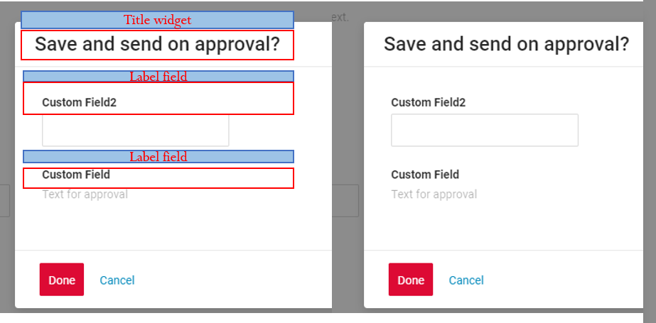
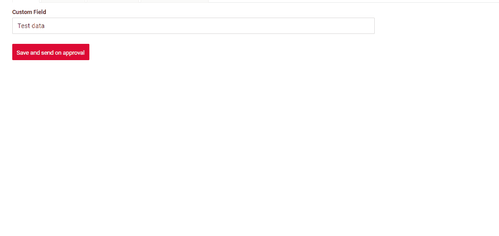
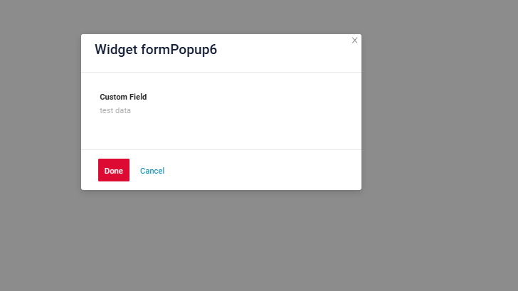
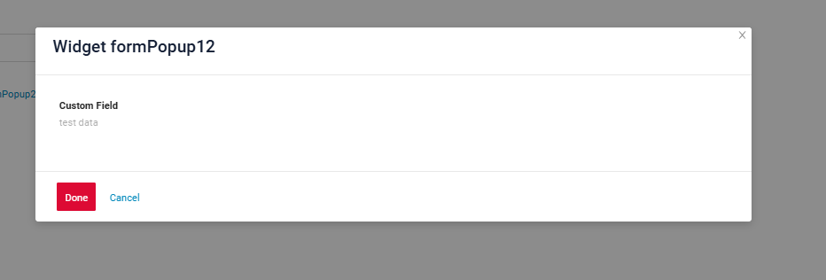
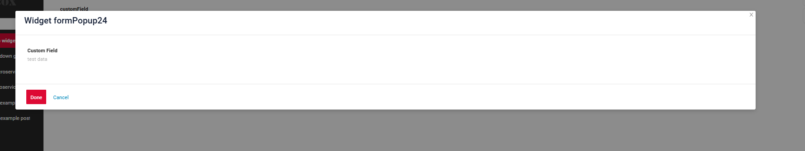

# FormPopup

`FormPopup` widget is a component for additional field checks in popup and the ability to add information inside the popup.

## Basics
[:material-play-circle: Live Sample]({{ external_links.code_samples }}/ui/#/screen/myexample3400){:target="_blank"} ·
[:fontawesome-brands-github: GitHub]({{ external_links.github_ui }}/{{ external_links.github_branch }}/src/main/java/org/demo/documentation/widgets/formpopup/base){:target="_blank"}
### How does it look?


###  <a id="Howtoaddbacis">How to add?</a>
??? Example
    
    **Step1**  Add type **"FormPopup"** to **BaseFieldExtractor**.
    ```java
	@Override
	public List<String> getSupportedTypes() {
		return Lists.newArrayList(
				"Funnel",
				"RingProgress",
				"DashboardList",
				"FormPopup"
		);
	}
    ```

    **Step2**  Add file **"ActionsExt"**.
    ```java
    @UtilityClass
    public class ActionsExt {

        public static PreAction confirmWithCustomWidget(@Nullable String message, @Nullable String widget, @Nullable String yesButton, @Nullable String noButton) {
            Map<String, String> customParameters = new HashMap<>();
            customParameters.put("subtype", "confirmWithCustomWidget");
            if (widget != null) {
                customParameters.put("widget", widget);
            }
            if (yesButton != null) {
                customParameters.put("yesText", yesButton);
            }
            if (noButton != null) {
                customParameters.put("noText", noButton);
            }
            return PreAction.custom(message, customParameters);
        }
    
    }
    ```
    **Step3** Add a button **"save-send"** that raises the widget Popup
    ```java
    --8<--
    {{ external_links.github_raw_doc }}/widgets/formpopup/base/onefield/MyExample3400FormButton.widget.json
    --8<--
    ```
    **Step4** Add widget with type **FormPopup**
    ```json
    --8<--
    {{ external_links.github_raw_doc }}/widgets/formpopup/base/onefield/MyExample3400Formpopup.widget.json
    --8<--
    ```
    **Step5** Add widget **FormPopup** on view
    ```json
    --8<--
    {{ external_links.github_raw_doc }}/widgets/formpopup/base/onefield/myexample3400formpopup.view.json
    --8<--
    ```
    **Step6** Add **withPreAction** with action **confirmWithCommentwith**
    ```java
    --8<--
    {{ external_links.github_raw_doc }}/widgets/formpopup/base/onefield/MyExample3400Service.java
    --8<--
    ```

## <a id="Title">Title</a> 
 
<!--  
### Title Basic
[:material-play-circle: Live Sample]({{ external_links.code_samples }}/ui/#/screen/myexample3003){:target="_blank"} ·
[:fontawesome-brands-github: GitHub]({{ external_links.github_ui }}/{{ external_links.github_branch }}/src/main/java/org/demo/documentation/widgets/form/title){:target="_blank"}

Title - (optional)



There are types of:

* `constant title`: shows constant text.
* `calculated title`: shows value provided in hidden text field, e.g. it can be calculated based on business logic of application

#### How does it look?
=== "Constant title"

=== "Calculated title"

#### How to add?
??? Example
=== "Constant title"
**Step1** Add name for **title** to **_.widget.json_**.
```java
--8<--
{{ external_links.github_raw_doc }}/widgets/form/title/MyExample3003Form.widget.json
--8<--
```

    === "Calculated title"
 
        **Step1** Add ${customField} for **title** to **_.widget.json_**.
        ```java
        --8<--
        {{ external_links.github_raw_doc }}/widgets/form/title/MyExample3003FormCustomTitle.widget.json
        --8<--
        ```  
-->

### Title Color
`Title Color` allows you to specify a color for a title. It can be constant or calculated.

**Constant color**

[:material-play-circle: Live Sample]({{ external_links.code_samples }}/ui/#/screen/myexample3025/view/myexample3025constcolor){:target="_blank"} ·
[:fontawesome-brands-github: GitHub]({{ external_links.github_ui }}/{{ external_links.github_branch }}/src/main/java/org/demo/documentation/widgets/formpopup/colortitle){:target="_blank"}

*Constant color* is a fixed color that doesn't change. It remains the same regardless of any factors in the application.

**Calculated color**

[:material-play-circle: Live Sample]({{ external_links.code_samples }}/ui/#/screen/myexample3025/view/myexample3025){:target="_blank"} ·
[:fontawesome-brands-github: GitHub]({{ external_links.github_ui }}/{{ external_links.github_branch }}/src/main/java/org/demo/documentation/widgets/formpopup/colortitle){:target="_blank"}

*Calculated color* can be used to change a title color dynamically. It changes depending on business logic or data in the application.

!!! info
    Title colorization is **applicable** to the following [fields](/widget/fields/fieldtypes/): date, dateTime, dateTimeWithSeconds, number, money, percent, time, input, text, dictionary, radio, checkbox, multivalue, multivalueHover.

#### How does it look?


#### How to add?
??? Example
    === "Calculated color"

        **Step 1**   Add `custom field for color` to corresponding **DataResponseDTO**. The field can contain a HEX color or be null.
        ```java
        --8<--
        {{ external_links.github_raw_doc }}/widgets/formpopup/colortitle/MyExample3027DTO.java:colorDTO
        --8<--
        ```  
 
        **Step 2** Add **"bgColorKey"** :  `custom field for color` and  to .widget.json.

        Add in `title` field with `${customField}` 

        ```json
        --8<--
        {{ external_links.github_raw_doc }}/widgets/formpopup/colortitle/MyExample3027FormPopup.widget.json
        --8<--
        ```       

    === "Constant color"
 
        Add **"bgColor"** :  `HEX color`  to .widget.json.

        Add in `title` field with `${customField}` 

        ```json
        --8<--
        {{ external_links.github_raw_doc }}/widgets/formpopup/colortitle/MyExample3027FormPopupColorConst.widget.json
        --8<--
        ```
## <a id="Showcondition">Show condition</a>
_not applicable_

## <a id="bc">Business component</a>
This specifies the business component (BC) to which this form belongs.
A business component represents a specific part of a system that handles a particular business logic or data.

see more  [Business component](/environment/businesscomponent/businesscomponent/)

## <a id="fields">Fields</a>
Fields Configuration. The fields array defines the individual fields present within the form.
 
```json
{
    "label": "Custom Field",
    "key": "customField",
    "type": "input"
}
```

* **"label"**

  Description:  Field Title.

  Type: String(optional).

* **"key"**

  Description: Name field to corresponding DataResponseDTO.

  Type: String(required).

* **"type"**

  Description: [Field types](/widget/fields/fieldtypes/)

  Type: String(required).


### How to add?
??? Example

    === "With plugin(recommended)"
        **Step 1** Download plugin
            [download Intellij Plugin](https://plugins.jetbrains.com/plugin/195-tesler-helper)
    
        **Step 2** Add existing field to an existing form widget

            
    === "Example of writing code"
        Add field to **_.widget.json_**.

          ```json
             --8<--
             {{ external_links.github_raw_doc }}/widgets/formpopup/base/onefield/MyExample3400Formpopup.widget.json
             --8<--
          ```

### <a id="Fieldslayout">Options layout</a> 
_not applicable_

 
## Actions
`Actions` show available actions as separate buttons
see [Actions](/features/element/actions/actions)

## Additional properties
### Widget size
[:material-play-circle: Live Sample]({{ external_links.code_samples }}/ui/#/screen/myexample3402){:target="_blank"} ·
[:fontawesome-brands-github: GitHub]({{ external_links.github_ui }}/{{ external_links.github_branch }}/src/main/java/org/demo/documentation/widgets/formpopup/widgetsize){:target="_blank"}

Widget size features:

* The parameter determines the width of the pop-up based on the visible area (viewport) rather than the full screen width.

    - If the view includes additional widgets, the area allocated to these widgets is set to 24.

    - If the view lacks additional widgets, the area without them is also set to 24.

* The pop-up's width cannot extend across the entire screen.

* The pop-up is always centered on the screen.

#### How does it look?
=== "view gridWidth 6 - recommended"
    
=== "view gridWidth 12"
     
=== "view gridWidth 24"
    

#### How to add?
??? Example
    === "gridWidth24 - recommended"
        Change **gridWidth** = 24  to corresponding **view**
        ```json
        --8<--
        {{ external_links.github_raw_doc }}/widgets/formpopup/widgetsize/myexample3402form.view.json
        --8<--
        ```

    === "gridWidth12"
        Change **gridWidth** = 12  to corresponding **view**
        ```json
        --8<--
        {{ external_links.github_raw_doc }}/widgets/formpopup/widgetsize/myexample3402form.view.json
        --8<--
        ``` 

    === "gridWidth6"
        Change **gridWidth** = 6  to corresponding **view**
        ```json
        --8<--
        {{ external_links.github_raw_doc }}/widgets/formpopup/widgetsize/myexample3402form.view.json
        --8<--
        ```
<!-- 
## <a id="Title">Title</a>
[:material-play-circle: Live Sample]({{ external_links.code_samples }}/ui/#/screen/myexample3003){:target="_blank"} ·
[:fontawesome-brands-github: GitHub]({{ external_links.github_ui }}/{{ external_links.github_branch }}/src/main/java/org/demo/documentation/widgets/form/title){:target="_blank"}

Title - (optional)

    

There are types of:

* `constant title`: shows constant text.
* `calculated title`: shows value provided in hidden text field, e.g. it can be calculated based on business logic of application

#### How does it look?
=== "Constant title"
    
=== "Calculated title"
    
#### How to add?
??? Example
    === "Constant title"
        **Step1** Add name for **title** to **_.widget.json_**.
        ```java
        --8<--
        {{ external_links.github_raw_doc }}/widgets/form/title/MyExample3003Form.widget.json
        --8<--
        ```

    === "Calculated title"
 
        **Step1** Add ${customField} for **title** to **_.widget.json_**.
        ```java
        --8<--
        {{ external_links.github_raw_doc }}/widgets/form/title/MyExample3003FormCustomTitle.widget.json
        --8<--
        ```   
 
## Actions
`Actions` show available actions as separate buttons
see [Actions](/features/element/actions/actions)
-->