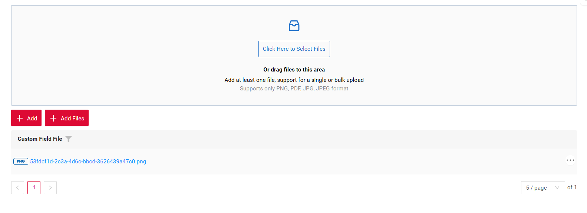

# Multi-upload files

[:material-play-circle: Live Sample]({{ external_links.code_samples }}/ui/#/screen/myexample6100){:target="_blank"}
[:fontawesome-brands-github: GitHub]({{ external_links.github_ui }}/{{ external_links.github_branch }}/src/main/java/org/demo/documentation/feature/file){:target="_blank"}

We have implemented multi-file upload. You can use a dedicated drag-and-drop zone or a standard button to select your files.

This feature supports the following types:

* [Form widget](/widget/type/form/form)
* [List widget](/widget/type/list/list)
* [GroupingHierarchy widget](/widget/type/groupinghierarchy/groupinghierarchy)


This feature supports only field [fileUpload](/widget/fields/field/fileUpload/fileUpload)

##### How does it look?
=== "Button And Multi-upload files"
    
=== "Button"
    
=== "Multi-upload files"
    

There are five main colors used for the progress bar and icon:

* light gray — empty progress bar
* blue — upload in progress
* green — upload completed successfully
* red — an error occurred
* dark gray — file skipped and will not be uploaded (the reason can be viewed by hovering over the progress row)

=== "light gray"
    
=== "blue"
    
=== "green"
    
=== "red"
    
=== "dark gray"
    

Uploaded:

* If all files are uploaded successfully, the progress notification automatically disappears after 2 seconds.
* If some files are skipped, the notification remains visible until it is closed manually or the user navigates to another screen. Information about successfully uploaded files still disappears after 2 seconds.
* When hovering over a notification, it will not disappear until the mouse is moved away (successful notifications also remain visible in this case)
* Limitation: When navigating to another screen, the notification is hidden and the upload is canceled

!!! Button
    A file can be added not only through the standard selection dialog but also by dragging and dropping it onto the upload button.


!!! info
    For fields of type fileUpload, there is an option to cancel the upload: if a new file is added while the previous one is still uploading, the previous upload is canceled.

##### How to add?

??? Example
    === "Button And Multi-upload files"
        `Step1`  Add actionKey **associate** to corresponding **.widget.json**.

        ```json
              {
                "actionKey": "associate",
                "fieldKey": "customFieldFile",
                "mode": "default-and-file-upload-dnd"
              }
        ```
        
        ```json
        --8<--
        {{ external_links.github_raw_doc }}/feature/file/MyExample6100AllList.widget.json
        --8<--
        ``` 
    === "Multi-upload files"
        `Step1`  Add actionKey **associate** to corresponding **.widget.json**.
    
        ```json
              {
                "actionKey": "associate",
                "fieldKey": "customFieldFile",
                "mode": "file-upload-dnd"
              }
        ```
        
        ```json
        --8<--
        {{ external_links.github_raw_doc }}/feature/file/MyExample6100FileList.widget.json
        --8<--
        ``` 
    === "Button"
        `Step1`  Add actionKey **associate** to corresponding **.widget.json**.
    
        ```json
              {
                "actionKey": "associate",
                "fieldKey": "customFieldFile",
                "mode": "default"
              }
        ```
        
        ```json
        --8<--
        {{ external_links.github_raw_doc }}/feature/file/MyExample6100DefaultList.widget.json
        --8<--
        ``` 

    `Step2`  Add **setFileAccept** to corresponding **FieldMetaBuilder**.
        ```java
            fields.setFileAccept(MyExampleDTO_.customFieldFile, List.of(".png",".pdf",".jpg",".jpeg"));
        ```
    
        ```json
        --8<--
        {{ external_links.github_raw_doc }}/feature/file/MyExample6100Meta:buildIndependentMeta
        --8<--
        ```

    `Step3`  Add **associate** to corresponding **ResponseService**.
        
        ```java
            .associate(ast -> ast
            .withCustomParameter(Map.of("subtype", "multiFileUpload"))
            .text("Add Files"))
        ```
    
        ```json
        --8<--
        {{ external_links.github_raw_doc }}/feature/file/MyExample6100Meta:getActions
        --8<--
        ```
    `Step3.1`  Add **doAssociate** to corresponding **ResponseService**. 
        In this service, it is necessary to describe what happens to the files during multiple upload, as well as how and with which properties they are stored.

        ```json
        --8<--
        {{ external_links.github_raw_doc }}/feature/file/MyExample6100Meta:doAssociate
        --8<--
        ```
    `Step3.2`  Add function **fileUpload** to corresponding **ResponseService**.
    
        ```json
        --8<--
        {{ external_links.github_raw_doc }}/feature/file/MyExample6100Meta:fileUpload
        --8<--
        ```