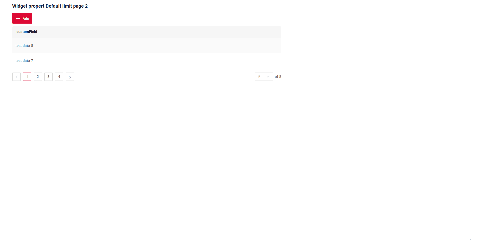

# Default page limit
This function is available for: [GroupingHierarchy](/widget/type/groupinghierarchy/groupinghierarchy),  [List](/widget/type/list/list),

The page limit can be configured in two ways: 

* [Only current business component](#bc-default-page-limit) 
* [At the application level](#app-default-page-limit)


### How does it look?


 
## <a id="bc-default-page-limit">Only current business component</a>
[:material-play-circle: Live Sample]({{ external_links.code_samples }}/ui/#/screen/myexample359){:target="_blank"} ·
[:fontawesome-brands-github: GitHub]({{ external_links.github_ui }}/{{ external_links.github_branch }}/src/main/java/org/demo/documentation/widgets/property/defaultlimitpage){:target="_blank"}
 
### How to add?
??? Example

     Add  business component in **BC_PROPERTIES** TABLE

      BC - name business component
      PAGE_LIMIT - limit page default

      ```csv
      ID;BC;PAGE_LIMIT;SORT;FILTER
      27;'myexample358';2;NULL;'""'
      ```

## <a id="app-default-page-limit">At the application level</a>

### How to add?
[:material-play-circle: Live Sample]({{ external_links.code_samples }}/ui/#/screen/myexample3002){:target="_blank"} ·
[:fontawesome-brands-github: GitHub]({{ external_links.github_ui }}/{{ external_links.github_branch }}/src/main/resources/application.yml){:target="_blank"}

??? Example
     Add `bc-default-page-limit` in application.yml  

      ```
        cxbox:
           meta:
               bc-default-page-limit: 5
      ```