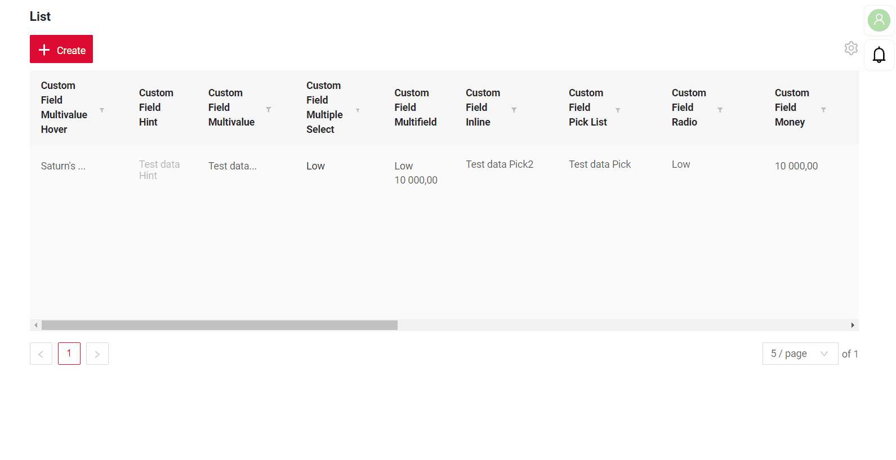
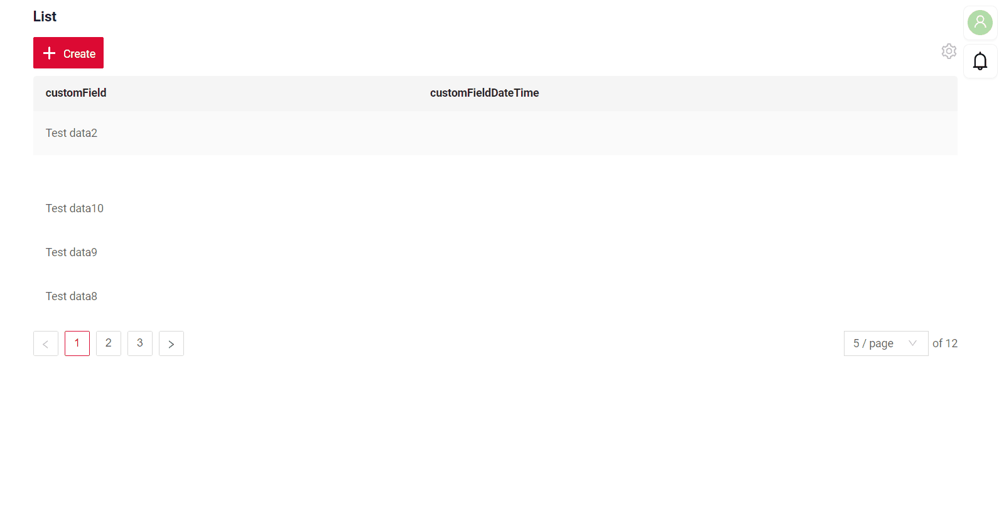
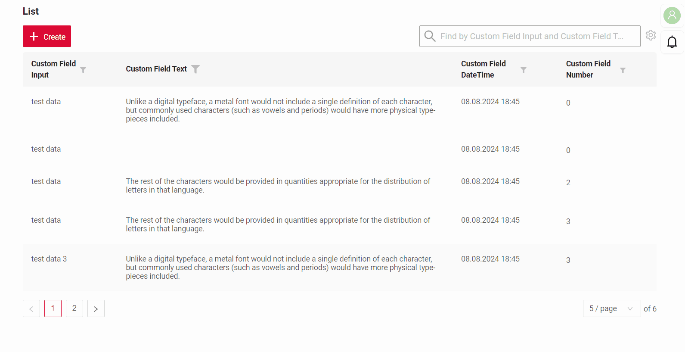

# Export to Excel
`Export to Excel` enables users to download a .xlsx file containing the table's data.

This function is available:
 
* for widgets: [List](/widget/type/list/list),only mode **basic** [AdditionalList](/widget/type/additionallist/additionallist),[GroupingHierarchy](/widget/type/groupinghierarchy/groupinghierarchy).
* for fields: Hint, Multivalue, Inline, Pick List,Radio, Money, Percent, Number, Dictionary, Date Time With Seconds, Date, Checkbox, Date Time, Text, Input.
See more [field types](/widget/fields/fieldtypes/)

The export functionality is accessible via the gear icon and supports the following types:

[:material-play-circle: Live Sample]({{ external_links.code_samples }}/ui/#/screen/myexample3134){:target="_blank"} ·
[:fontawesome-brands-github: GitHub]({{ external_links.github_ui }}/{{ external_links.github_branch }}/src/main/java/org/demo/documentation/widgets/property/excel/inner){:target="_blank"}

* Inner source. Exports data retrieved directly from the database.

[:material-play-circle: Live Sample]({{ external_links.code_samples }}/ui/#/screen/myexample3136){:target="_blank"} ·
[:fontawesome-brands-github: GitHub]({{ external_links.github_ui }}/{{ external_links.github_branch }}/src/main/java/org/demo/documentation/widgets/property/excel/any){:target="_blank"}
 
* Any source. Exports data obtained from microservices or other external sources.

[:material-play-circle: Live Sample]({{ external_links.code_samples }}/ui/#/screen/myexample3138){:target="_blank"} ·
[:fontawesome-brands-github: GitHub]({{ external_links.github_ui }}/{{ external_links.github_branch }}/src/main/java/org/demo/documentation/widgets/property/excel/filtration){:target="_blank"}

* Filtration. Exports only the filtered data based on the user's applied filters.
 
## Basic
The Export function includes two parameters:

* Enabled -  true/false
* Title: None/Custom Name 
If the parameter is not specified, a default title is generated with the format: `List + current date`.

Example: `List 05-12-2024.xlsx`
A custom title can be provided if needed.

### How does it look?
=== "Inner source"
    
=== "Any source"
    
=== "Filtration"
    

### How to add?
??? Example
      Add `export` to corresponding **widget.json**.
    
      ```  
      "export": {
        "enabled": true,
        "title": "Custom Name"
      }
      ```
      ```json
      --8<--
      {{ external_links.github_raw_doc }}/widgets/property/excel/inner/MyExample3134List.widget.json
      --8<--
      ``` 

      * "Inner source"
        [:material-play-circle: Live Sample]({{ external_links.code_samples }}/ui/#/screen/myexample3134){:target="_blank"} ·
        [:fontawesome-brands-github: GitHub]({{ external_links.github_ui }}/{{ external_links.github_branch }}/src/main/java/org/demo/documentation/widgets/property/excel/inner){:target="_blank"}
      
      * "Any source"
        [:material-play-circle: Live Sample]({{ external_links.code_samples }}/ui/#/screen/myexample3136){:target="_blank"} ·
        [:fontawesome-brands-github: GitHub]({{ external_links.github_ui }}/{{ external_links.github_branch }}/src/main/java/org/demo/documentation/widgets/property/excel/any){:target="_blank"}

      * "Filtration"
        [:material-play-circle: Live Sample]({{ external_links.code_samples }}/ui/#/screen/myexample3138){:target="_blank"} ·
        [:fontawesome-brands-github: GitHub]({{ external_links.github_ui }}/{{ external_links.github_branch }}/src/main/java/org/demo/documentation/widgets/property/excel/filtration){:target="_blank"}
