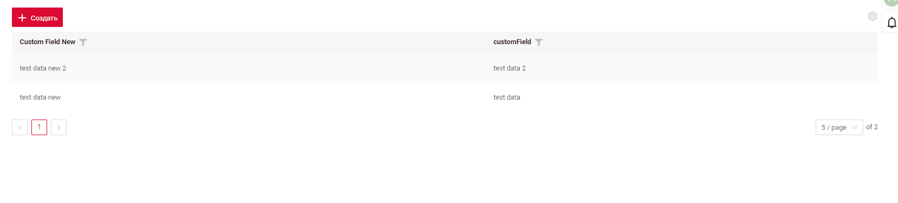

# Filter group
[:material-play-circle: Live Sample]({{ external_links.code_samples }}/ui/#/screen/myexample3616){:target="_blank"}
[:fontawesome-brands-github: GitHub]({{ external_links.github_ui }}/{{ external_links.github_branch }}/src/main/java/org/demo/documentation/feature/filtergroup){:target="_blank"}

A user-filled filter can be saved for each individual user.

## Basic
The "Save Filters" button is located within the gear icon.
When the "Save Filters" button is clicked, a modal window appears displaying all custom filters, which can be deleted if desired.

### How does it look?


### How to add?
??? Example
    The availability of filtering function depends on the type. See more [field types](/widget/fields/fieldtypes/)

    `Step 1` Add **filterSetting** to corresponding **.widget.json**. 

    `enabled` true/false  
        
    ```json
    --8<--
    {{ external_links.github_raw_doc }}/feature/filtergroup/MyExample3616List.widget.json
    --8<--
    ```