# Filtration
 
* [by fields](#by_fields)
* [by fulltextsearch](#by_fulltextsearch) 
* [by personal filter group](#by_personal_filter_group)
* [by filter group](#by_filter_group)
<!-- default filtration  -->

## <a id="by_fields">by fields</a>
The availability or unavailability of filtering operations for each field type see [Fields](/widget/fields/fieldtypes/).

Each field type requires a distinct filtering operation sent by the frontend.
Here are the standard field types with their respective filtering methods see [SearchOperation for filtering](/widget/fields/filtersearchoperation).

This function is available:

* [List widget](/widget/type/list/list)
([:material-play-circle: Live Sample]({{ external_links.code_samples }}/ui/#/screen/myexample3616/view/myexample3616list){:target="_blank"}
[:fontawesome-brands-github: GitHub]({{ external_links.github_ui }}/{{ external_links.github_branch }}/src/main/java/org/demo/documentation/widgets/property/filtration/filtergroup){:target="_blank"}
)
* [AdditionalList widget](/widget/type/additionallist/additionallist)
([:material-play-circle: Live Sample]({{ external_links.code_samples }}/ui/#/screen/myexample3616/view/myexample3616additionallist){:target="_blank"}
[:fontawesome-brands-github: GitHub]({{ external_links.github_ui }}/{{ external_links.github_branch }}/src/main/java/org/demo/documentation/widgets/property/filtration/filtergroup){:target="_blank"}
)
* [GroupingHierarchy widget](/widget/type/groupinghierarchy/groupinghierarchy)
([:material-play-circle: Live Sample]({{ external_links.code_samples }}/ui/#/screen/myexample3121/view/myexample3121gh){:target="_blank"}
[:fontawesome-brands-github: GitHub]({{ external_links.github_ui }}/{{ external_links.github_branch }}/src/main/java/org/demo/documentation/widgets/groupinghierarhy/base){:target="_blank"}
)
* [AssocListPopup widget](/widget/type/assoclistpopup/assoclistpopup)
([:material-play-circle: Live Sample]({{ external_links.code_samples }}/ui/#/screen/myexample3616/view/myexample3616assoc){:target="_blank"}
[:fontawesome-brands-github: GitHub]({{ external_links.github_ui }}/{{ external_links.github_branch }}/src/main/java/org/demo/documentation/widgets/property/filtration/filtergroup/forassoc){:target="_blank"}
)
* [PickListPopup widget](/widget/type/picklistpopup/picklistpopup)
([:material-play-circle: Live Sample]({{ external_links.code_samples }}/ui/#/screen/myexample3616/view/myexample3614picklistpopup){:target="_blank"}
[:fontawesome-brands-github: GitHub]({{ external_links.github_ui }}/{{ external_links.github_branch }}/src/main/java/org/demo/documentation/widgets/property/filtration/fulltextsearch/forpicklist){:target="_blank"}
)
* [Tree widget](/widget/type/tree/tree)
([:material-play-circle: Live Sample]({{ external_links.code_samples }}/ui/#/screen/myexample3616/view/myexample3616tree){:target="_blank"}
[:fontawesome-brands-github: GitHub]({{ external_links.github_ui }}/{{ external_links.github_branch }}/src/main/java/org/demo/documentation/widgets/property/filtration/filtergroup){:target="_blank"}
)
* [AssocTreePopup widget](/widget/type/assoctreepopup/assoctreepopup)
([:material-play-circle: Live Sample]({{ external_links.code_samples }}/ui/#/screen/myexample3261/view/myexample3261list){:target="_blank"}
[:fontawesome-brands-github: GitHub]({{ external_links.github_ui }}/{{ external_links.github_branch }}/src/main/java/org/demo/documentation/widgets/tree/base/inner){:target="_blank"}
)
* [PickTreePopup widget](/widget/type/picktreepopup/picktreepopup)
([:material-play-circle: Live Sample]({{ external_links.code_samples }}/ui/#/screen/myexample3261/view/myexample3261list){:target="_blank"}
[:fontawesome-brands-github: GitHub]({{ external_links.github_ui }}/{{ external_links.github_branch }}/src/main/java/org/demo/documentation/widgets/tree/base/inner){:target="_blank"}
)
* [Pie1D widget](/widget/type/pie1d/pie1d): works only in the [table mode](/widget/type/pie1d/pie1d/#tablemode)
([:material-play-circle: Live Sample]({{ external_links.code_samples }}/ui/#/screen/myexample4264){:target="_blank"}
[:fontawesome-brands-github: GitHub]({{ external_links.github_ui }}/{{ external_links.github_branch }}/src/main/java/org/demo/documentation/widgets/pie1d/filtration){:target="_blank"}
)

### How does it look?
=== "List widget"
    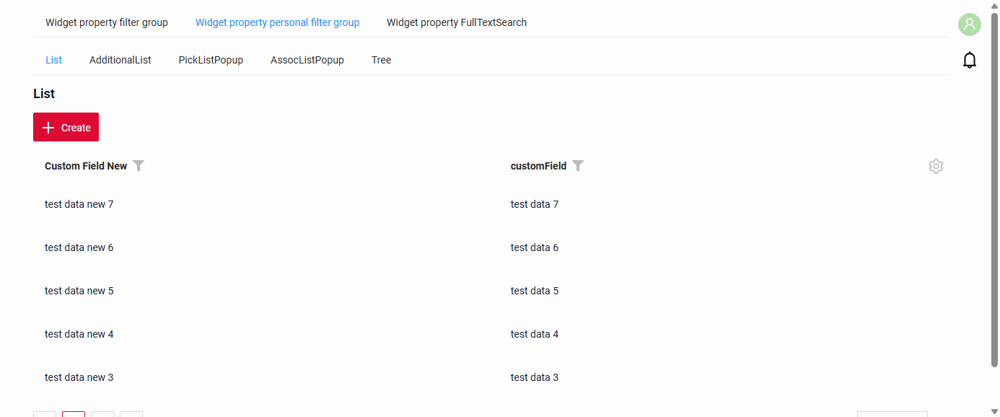
=== "AdditionalList widget"
    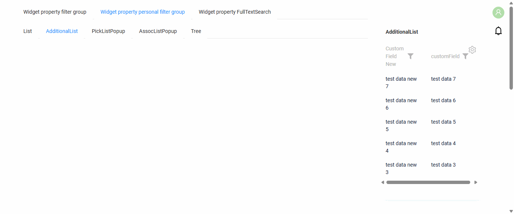
=== "GroupingHierarchy widget"
    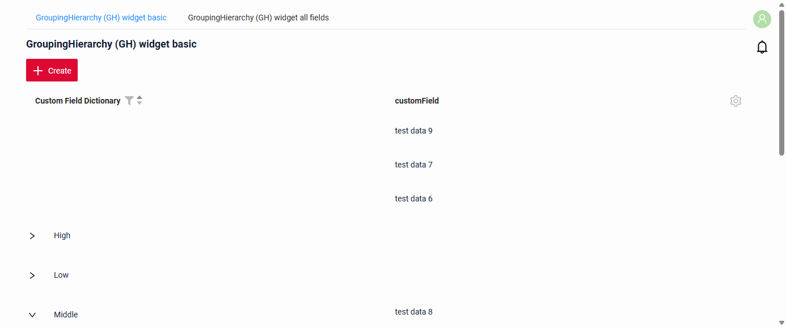
=== "AssocListPopup widget"
    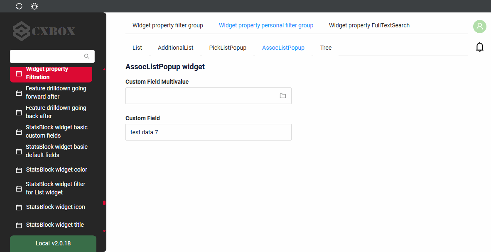
=== "PickListPopup widget"
    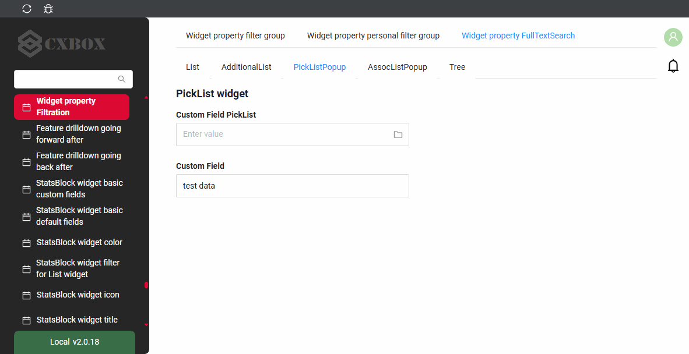
=== "Tree widget"
    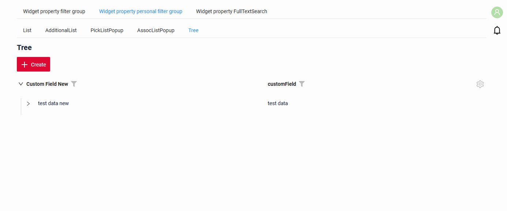
=== "AssocTreePopup widget"
    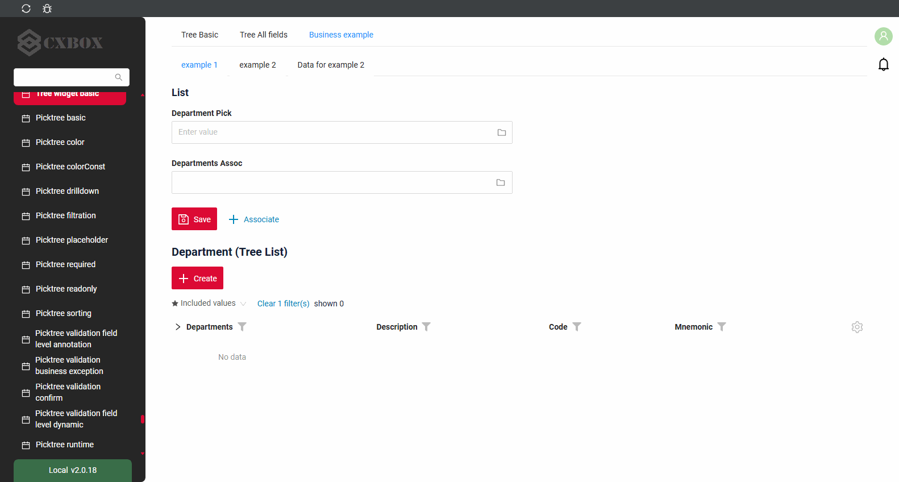
=== "PickTreePopup widget"
    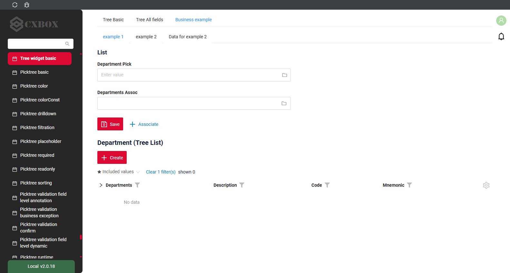
=== "Pie1D widget"
    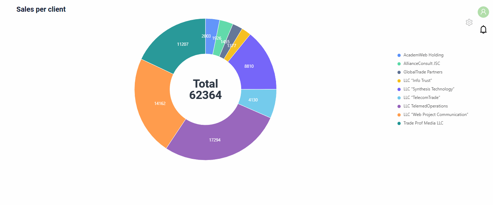

### <a id="by_fields_how_to_add">How to add?</a>
??? Example
    The steps are the same for all widgets.

    `Step 1` Add **@SearchParameter** to corresponding **DataResponseDTO**.
    ```java
    --8<--
    {{ external_links.github_raw_doc }}/widgets/property/filtration/filtergroup/MyExample3616DTO.java
    --8<--
    ```

    `Step 2` Add **fields.enableFilter** to corresponding **FieldMetaBuilder**.
    ```java
    --8<--
    {{ external_links.github_raw_doc }}/widgets/property/filtration/filtergroup/MyExample3616Meta.java:buildIndependentMeta
    --8<--
    ```
    === "List widget"
        [:material-play-circle: Live Sample]({{ external_links.code_samples }}/ui/#/screen/myexample3616/view/myexample3616list){:target="_blank"} ·
        [:fontawesome-brands-github: GitHub]({{ external_links.github_ui }}/{{ external_links.github_branch }}/src/main/java/org/demo/documentation/widgets/property/filtration/filtergroup){:target="_blank"}

    === "AdditionalList widget"
        [:material-play-circle: Live Sample]({{ external_links.code_samples }}/ui/#/screen/myexample3616/view/myexample3616additionallist){:target="_blank"} ·
        [:fontawesome-brands-github: GitHub]({{ external_links.github_ui }}/{{ external_links.github_branch }}/src/main/java/org/demo/documentation/widgets/property/filtration/filtergroup){:target="_blank"}

    === "GroupingHierarchy widget"
        [:material-play-circle: Live Sample]({{ external_links.code_samples }}/ui/#/screen/myexample3121/view/myexample3121gh){:target="_blank"} ·
        [:fontawesome-brands-github: GitHub]({{ external_links.github_ui }}/{{ external_links.github_branch }}/src/main/java/org/demo/documentation/widgets/groupinghierarhy/base){:target="_blank"}

    === "AssocListPopup widget"
        The steps are done for the business component of the popup.

        [:material-play-circle: Live Sample]({{ external_links.code_samples }}/ui/#/screen/myexample3616/view/myexample3616assoc){:target="_blank"} ·
        [:fontawesome-brands-github: GitHub]({{ external_links.github_ui }}/{{ external_links.github_branch }}/src/main/java/org/demo/documentation/widgets/property/filtration/filtergroup/forassoc){:target="_blank"}

    === "PickListPopup widget"
        The steps are done for the business component of the popup.

        [:material-play-circle: Live Sample]({{ external_links.code_samples }}/ui/#/screen/myexample3616/view/myexample3614picklistpopup){:target="_blank"} ·
        [:fontawesome-brands-github: GitHub]({{ external_links.github_ui }}/{{ external_links.github_branch }}/src/main/java/org/demo/documentation/widgets/property/filtration/fulltextsearch/forpicklist){:target="_blank"}

    === "Tree widget"
        The found records are shown by the [search modes](/widget/type/tree/tree/#searchmodes).

        [:material-play-circle: Live Sample]({{ external_links.code_samples }}/ui/#/screen/myexample3616/view/myexample3616tree){:target="_blank"} ·
        [:fontawesome-brands-github: GitHub]({{ external_links.github_ui }}/{{ external_links.github_branch }}/src/main/java/org/demo/documentation/widgets/property/filtration/filtergroup){:target="_blank"}

    === "AssocTreePopup widget"
        The steps are done for the business component of the popup.
        The found records are shown by the [search modes](/widget/type/assoctreepopup/assoctreepopup/#searchmodes).

        [:material-play-circle: Live Sample]({{ external_links.code_samples }}/ui/#/screen/myexample3261/view/myexample3261list){:target="_blank"} ·
        [:fontawesome-brands-github: GitHub]({{ external_links.github_ui }}/{{ external_links.github_branch }}/src/main/java/org/demo/documentation/widgets/tree/base/inner){:target="_blank"}

    === "PickTreePopup widget"
        The steps are done for the business component of the popup.
        The found records are shown by the [search modes](/widget/type/picktreepopup/picktreepopup/#searchmodes).

        [:material-play-circle: Live Sample]({{ external_links.code_samples }}/ui/#/screen/myexample3261/view/myexample3261list){:target="_blank"} ·
        [:fontawesome-brands-github: GitHub]({{ external_links.github_ui }}/{{ external_links.github_branch }}/src/main/java/org/demo/documentation/widgets/tree/base/inner){:target="_blank"}

    === "Pie1D widget"
        Works only in the [table mode](/widget/type/pie1d/pie1d/#tablemode) of the chart.
        After the switch back to the chart, the chart draws only the filtered records. The chart mode does not show that a filter is applied: the filter is cleared in the table mode.
        When the data of the chart come from an AnySource DAO, the DAO applies the filter itself.

        `Step 3` Apply the filter in **getList** of the AnySource DAO.
        ```java
        --8<--
        {{ external_links.github_raw_doc }}/widgets/pie1d/filtration/MyExample4264Dao.java:getList
        --8<--
        ```

        [:material-play-circle: Live Sample]({{ external_links.code_samples }}/ui/#/screen/myexample4264){:target="_blank"} ·
        [:fontawesome-brands-github: GitHub]({{ external_links.github_ui }}/{{ external_links.github_branch }}/src/main/java/org/demo/documentation/widgets/pie1d/filtration){:target="_blank"}

## <a id="by_fulltextsearch">by fulltextsearch</a>
`FullTextSearch` - when the user types in the full text search input area, then widget filters the rows that match the search query
(search criteria is configurable and will usually check if at least one column has corresponding value).
This feature makes it easier for users to quickly find the information they are looking for within a List widget.


This function is available:

* [List widget](/widget/type/list/list)
(  [:material-play-circle: Live Sample]({{ external_links.code_samples }}/ui/#/screen/myexample3616/view/myexample3614list){:target="_blank"}
  [:fontawesome-brands-github: GitHub]({{ external_links.github_ui }}/{{ external_links.github_branch }}/src/main/java/org/demo/documentation/widgets/property/filtration/fulltextsearch){:target="_blank"}
)
* [AssocListPopup widget](/widget/type/assoclistpopup/assoclistpopup)
(  [:material-play-circle: Live Sample]({{ external_links.code_samples }}/ui/#/screen/myexample3616/view/myexample3614assoclistpopup){:target="_blank"}
  [:fontawesome-brands-github: GitHub]({{ external_links.github_ui }}/{{ external_links.github_branch }}/src/main/java/org/demo/documentation/widgets/property/filtration/fulltextsearch/forassoc){:target="_blank"}
)
* [PickListPopup widget](/widget/type/picklistpopup/picklistpopup)
([:material-play-circle: Live Sample]({{ external_links.code_samples }}/ui/#/screen/myexample3616/view/myexample3614picklistpopup){:target="_blank"}
[:fontawesome-brands-github: GitHub]({{ external_links.github_ui }}/{{ external_links.github_branch }}/src/main/java/org/demo/documentation/widgets/property/filtration/fulltextsearch/forpicklist){:target="_blank"}
) 
* [Tree widget](/widget/type/tree/tree)
(  [:material-play-circle: Live Sample]({{ external_links.code_samples }}/ui/#/screen/myexample3616/view/myexample3614tree){:target="_blank"}
  [:fontawesome-brands-github: GitHub]({{ external_links.github_ui }}/{{ external_links.github_branch }}/src/main/java/org/demo/documentation/widgets/property/filtration/fulltextsearch){:target="_blank"}
)
* [AssocTreePopup widget](/widget/type/assoctreepopup/assoctreepopup)
([:material-play-circle: Live Sample]({{ external_links.code_samples }}/ui/#/screen/myexample3261/view/myexample3261list){:target="_blank"}
[:fontawesome-brands-github: GitHub]({{ external_links.github_ui }}/{{ external_links.github_branch }}/src/main/java/org/demo/documentation/widgets/tree/base/inner){:target="_blank"}
)
* [PickTreePopup widget](/widget/type/picktreepopup/picktreepopup)
([:material-play-circle: Live Sample]({{ external_links.code_samples }}/ui/#/screen/myexample3261/view/myexample3261list){:target="_blank"}
[:fontawesome-brands-github: GitHub]({{ external_links.github_ui }}/{{ external_links.github_branch }}/src/main/java/org/demo/documentation/widgets/tree/base/inner){:target="_blank"}
)
* [Pie1D widget](/widget/type/pie1d/pie1d): works only in the [table mode](/widget/type/pie1d/pie1d/#tablemode)
([:material-play-circle: Live Sample]({{ external_links.code_samples }}/ui/#/screen/myexample4265){:target="_blank"}
[:fontawesome-brands-github: GitHub]({{ external_links.github_ui }}/{{ external_links.github_branch }}/src/main/java/org/demo/documentation/widgets/pie1d/fulltextsearch){:target="_blank"}
)

### How does it look?
=== "List widget"
    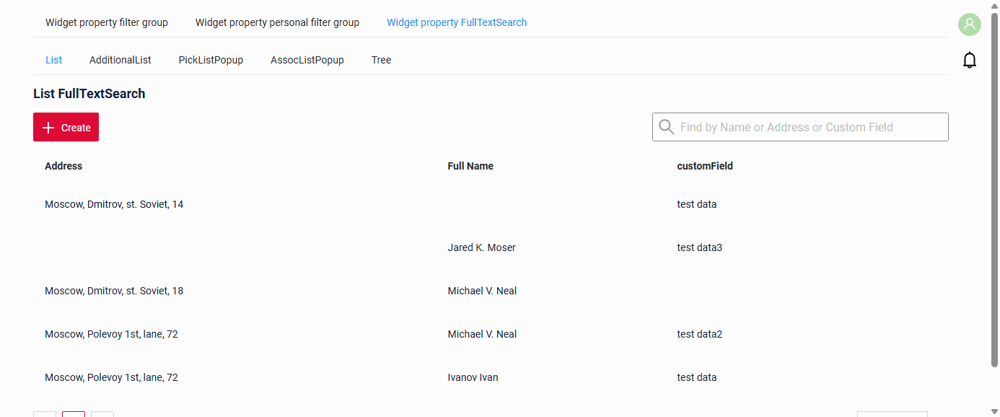
=== "AssocListPopup widget"
    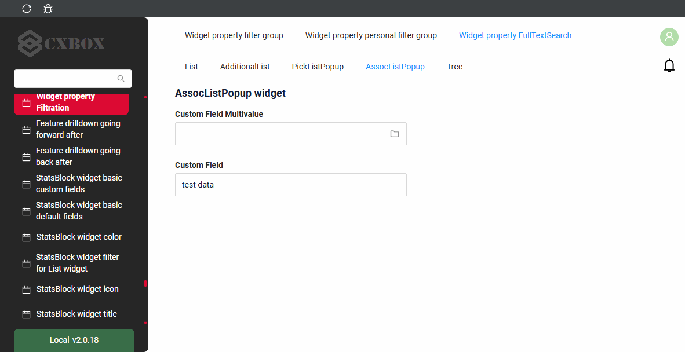
=== "PickListPopup widget"
    
=== "Tree widget"
    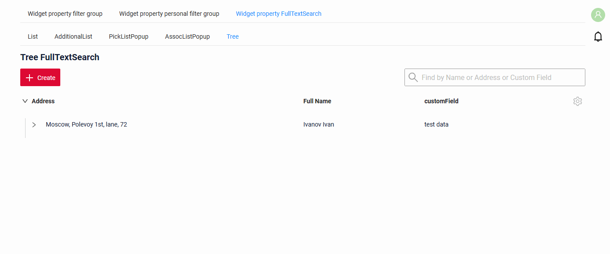
=== "AssocTreePopup widget"
    
=== "PickTreePopup widget"
    
=== "Pie1D widget"
    
### How to add?
??? Example

    `Step 1` Add extension file FullTextSearchExt.java
    ```java
    import java.util.Optional;
    import jakarta.persistence.criteria.CriteriaBuilder;
    import jakarta.persistence.criteria.Path;
    import jakarta.persistence.criteria.Predicate;
    import lombok.NonNull;
    import lombok.experimental.UtilityClass;
    import org.apache.commons.lang3.StringUtils;
    import org.cxbox.core.crudma.bc.BusinessComponent;
    
    @UtilityClass
    public class FullTextSearchExt {
    
        @NonNull
        public static Optional<String> getFullTextSearchFilterParam(BusinessComponent bc) {
            return Optional.ofNullable(bc.getParameters().getParameter("_fullTextSearch"));
        }
    
        public static Predicate likeIgnoreCase(String value, CriteriaBuilder cb, Path<String> path) {
            return cb.like(cb.lower(path), StringUtils.lowerCase("%" + value + "%"));
        }
    
    }
    ```
    === "List widget"  
        `Step 2` Add **specifications** for fulltextsearch fields to corresponding **JpaRepository**. 
        ```java
        --8<--
        {{ external_links.github_raw_doc }}/widgets/property/filtration/fulltextsearch/MyEntity3614Repository.java
        --8<--
        ```
     
        `Step 3` Add **getSpecification** to corresponding **VersionAwareResponseService**. 
        ```java
        --8<--
        {{ external_links.github_raw_doc }}/widgets/property/filtration/fulltextsearch/MyExample3614Service.java:getSpecification
        --8<--
        ```
     
        `Step 4` Add **fullTextSearch** to corresponding **.widget.json**. 
    
        `enabled` true/false  
    
        `placeholder` - description for  fullTextSearch
            
        ```json
        --8<--
        {{ external_links.github_raw_doc }}/widgets/property/filtration/fulltextsearch/MyExample3614List.widget.json
        --8<--
        ```
        [:material-play-circle: Live Sample]({{ external_links.code_samples }}/ui/#/screen/myexample3616/view/myexample3614list){:target="_blank"}
        [:fontawesome-brands-github: GitHub]({{ external_links.github_ui }}/{{ external_links.github_branch }}/src/main/java/org/demo/documentation/widgets/property/filtration/fulltextsearch){:target="_blank"}

    === "AssocListPopup widget"  
        `Step 2` Add **specifications** for fulltextsearch fields to corresponding **JpaRepository**. 
        ```java
        --8<--
        {{ external_links.github_raw_doc }}/widgets/property/filtration/fulltextsearch/forassoc/MyEntity3625Repository.java
        --8<--
        ```
     
        `Step 3` Add **getSpecification** to corresponding **VersionAwareResponseService**. 
        ```java
        --8<--
        {{ external_links.github_raw_doc }}/widgets/property/filtration/fulltextsearch/forassoc/MyEntity3625PickService.java:getSpecification
        --8<--
        ```
     
        `Step 4` Add **fullTextSearch** to corresponding **.widget.json**. 
    
        `enabled` true/false  
    
        `placeholder` - description for  fullTextSearch
            
        ```json
        --8<--
        {{ external_links.github_raw_doc }}/widgets/property/filtration/fulltextsearch/forassoc/myEntity3625PickAssocListPopup.widget.json
        --8<--
        ```
        [:material-play-circle: Live Sample]({{ external_links.code_samples }}/ui/#/screen/myexample3616/view/myexample3614assoclistpopup){:target="_blank"}
        [:fontawesome-brands-github: GitHub]({{ external_links.github_ui }}/{{ external_links.github_branch }}/src/main/java/org/demo/documentation/widgets/property/filtration/fulltextsearch/forassoc){:target="_blank"}

    === "PickListPopup widget"  
        `Step 2` Add **specifications** for fulltextsearch fields to corresponding **JpaRepository**. 
        ```java
        --8<--
        {{ external_links.github_raw_doc }}/widgets/property/filtration/fulltextsearch/forpicklist/MyEntity3614PickRepository.java
        --8<--
        ```
     
        `Step 3` Add **getSpecification** to corresponding **VersionAwareResponseService**. 
        ```java
        --8<--
        {{ external_links.github_raw_doc }}/widgets/property/filtration/fulltextsearch/forpicklist/MyEntity3614PickPickService.java:getSpecification
        --8<--
        ```
     
        `Step 4` Add **fullTextSearch** to corresponding **.widget.json**. 
    
        `enabled` true/false  
    
        `placeholder` - description for  fullTextSearch
            
        ```json
        --8<--
        {{ external_links.github_raw_doc }}/widgets/property/filtration/fulltextsearch/forpicklist/myEntity3614PickPickPickListPopup.widget.json
        --8<--
        ```
        
        [:material-play-circle: Live Sample]({{ external_links.code_samples }}/ui/#/screen/myexample3616/view/myexample3614picklistpopup){:target="_blank"}
        [:fontawesome-brands-github: GitHub]({{ external_links.github_ui }}/{{ external_links.github_branch }}/src/main/java/org/demo/documentation/widgets/property/filtration/fulltextsearch/forpicklist){:target="_blank"}

    === "Tree widget"
        The found records are shown by the [search modes](/widget/type/tree/tree/#searchmodes).

        `Step 2` Add **specifications** for fulltextsearch fields to corresponding **JpaRepository**.
        ```java
        --8<--
        {{ external_links.github_raw_doc }}/widgets/property/filtration/fulltextsearch/MyEntity3614Repository.java
        --8<--
        ```

        `Step 3` Add **getSpecification** to corresponding **VersionAwareResponseService**.
        ```java
        --8<--
        {{ external_links.github_raw_doc }}/widgets/property/filtration/fulltextsearch/MyExample3614Service.java:getSpecification
        --8<--
        ```

        `Step 4` Add **fullTextSearch** to corresponding **.widget.json**.

        `enabled` true/false

        `placeholder` - description for  fullTextSearch

        ```json
        --8<--
        {{ external_links.github_raw_doc }}/widgets/property/filtration/fulltextsearch/MyExample3614Tree.widget.json
        --8<--
        ```
        [:material-play-circle: Live Sample]({{ external_links.code_samples }}/ui/#/screen/myexample3616/view/myexample3614tree){:target="_blank"} ·
        [:fontawesome-brands-github: GitHub]({{ external_links.github_ui }}/{{ external_links.github_branch }}/src/main/java/org/demo/documentation/widgets/property/filtration/fulltextsearch){:target="_blank"}

    === "AssocTreePopup widget"
        The found records are shown by the [search modes](/widget/type/assoctreepopup/assoctreepopup/#searchmodes).

        `Step 2` Add **specifications** for fulltextsearch fields to corresponding **JpaRepository**.
        ```java
        --8<--
        {{ external_links.github_raw_doc }}/widgets/tree/data/inner/MyEntity3261Repository.java
        --8<--
        ```

        `Step 3` Add **getSpecification** to corresponding **VersionAwareResponseService** of the popup.
        ```java
        --8<--
        {{ external_links.github_raw_doc }}/widgets/tree/base/inner/Myexample3261Pick0Service.java:getSpecification
        --8<--
        ```

        `Step 4` Add **fullTextSearch** to corresponding **.widget.json**.

        `enabled` true/false

        `placeholder` - description for  fullTextSearch

        ```json
        --8<--
        {{ external_links.github_raw_doc }}/widgets/tree/base/inner/myexample3261AssocTreePopup.widget.json
        --8<--
        ```
        [:material-play-circle: Live Sample]({{ external_links.code_samples }}/ui/#/screen/myexample3261/view/myexample3261list){:target="_blank"} ·
        [:fontawesome-brands-github: GitHub]({{ external_links.github_ui }}/{{ external_links.github_branch }}/src/main/java/org/demo/documentation/widgets/tree/base/inner){:target="_blank"}

    === "PickTreePopup widget"
        The found records are shown by the [search modes](/widget/type/picktreepopup/picktreepopup/#searchmodes).

        `Step 2` Add **specifications** for fulltextsearch fields to corresponding **JpaRepository**.
        ```java
        --8<--
        {{ external_links.github_raw_doc }}/widgets/tree/data/inner/MyEntity3261Repository.java
        --8<--
        ```

        `Step 3` Add **getSpecification** to corresponding **VersionAwareResponseService** of the popup.
        ```java
        --8<--
        {{ external_links.github_raw_doc }}/widgets/tree/base/inner/Myexample3261PickService.java:getSpecification
        --8<--
        ```

        `Step 4` Add **fullTextSearch** to corresponding **.widget.json**.

        `enabled` true/false

        `placeholder` - description for  fullTextSearch

        ```json
        --8<--
        {{ external_links.github_raw_doc }}/widgets/tree/base/inner/myexample3261TreePickListPopup.widget.json
        --8<--
        ```
        [:material-play-circle: Live Sample]({{ external_links.code_samples }}/ui/#/screen/myexample3261/view/myexample3261list){:target="_blank"} ·
        [:fontawesome-brands-github: GitHub]({{ external_links.github_ui }}/{{ external_links.github_branch }}/src/main/java/org/demo/documentation/widgets/tree/base/inner){:target="_blank"}

    === "Pie1D widget"
        Works only in the [table mode](/widget/type/pie1d/pie1d/#tablemode) of the chart.
        After the switch back to the chart, the chart draws only the filtered records. The chart mode does not show that a filter is applied: the filter is cleared in the table mode.
        When the data of the chart come from an AnySource DAO, the DAO applies the search itself.

        `Step 2` Apply the search text in **getList** of the AnySource DAO.
        ```java
        --8<--
        {{ external_links.github_raw_doc }}/widgets/pie1d/fulltextsearch/MyExample4265Dao.java:getList
        --8<--
        ```

        `Step 3` Add **fullTextSearch** to corresponding **.widget.json**.

        `enabled` true/false

        `placeholder` - description for  fullTextSearch

        ```json
        --8<--
        {{ external_links.github_raw_doc }}/widgets/pie1d/fulltextsearch/MyExample4265Pie.widget.json
        --8<--
        ```

        [:material-play-circle: Live Sample]({{ external_links.code_samples }}/ui/#/screen/myexample4265){:target="_blank"} ·
        [:fontawesome-brands-github: GitHub]({{ external_links.github_ui }}/{{ external_links.github_branch }}/src/main/java/org/demo/documentation/widgets/pie1d/fulltextsearch){:target="_blank"}

## <a id="by_personal_filter_group">by personal filter group</a>

`Personal filter group` - a user-filled filter can be saved for each individual user.

A user-filled filter can be saved for each individual user.

This function is available:

* [List](/widget/type/list/list) (
[:material-play-circle: Live Sample]({{ external_links.code_samples }}/ui/#/screen/myexample3616/view/myexample3616list){:target="_blank"}
[:fontawesome-brands-github: GitHub]({{ external_links.github_ui }}/{{ external_links.github_branch }}/src/main/java/org/demo/documentation/widgets/property/filtration/filtergroup){:target="_blank"}
)

* [Tree](/widget/type/tree/tree) (
[:material-play-circle: Live Sample]({{ external_links.code_samples }}/ui/#/screen/myexample3616/view/myexample3616tree){:target="_blank"}
[:fontawesome-brands-github: GitHub]({{ external_links.github_ui }}/{{ external_links.github_branch }}/src/main/java/org/demo/documentation/widgets/property/filtration/filtergroup){:target="_blank"}
)

* [AdditionalList](/widget/type/additionallist/additionallist) (
[:material-play-circle: Live Sample]({{ external_links.code_samples }}/ui/#/screen/myexample3616/view/myexample3616additionallist){:target="_blank"}
[:fontawesome-brands-github: GitHub]({{ external_links.github_ui }}/{{ external_links.github_branch }}/src/main/java/org/demo/documentation/widgets/property/filtration/filtergroup){:target="_blank"}
)

The "Save Filters" button is located within the gear icon.
When the "Save Filters" button is clicked, a modal window appears displaying all custom filters, which can be deleted if desired.

### How does it look?
=== "List"
    
=== "AdditionalList"
    
=== "Tree"
    
### How to add?
??? Example
    The availability of filtering function depends on the type. See more [field types](/widget/fields/fieldtypes/)

    For fields where individual filters are intended to be saved, it is essential to configure the filtering options. see `Step 1` and `Step 2`
    
    **Step 1** Add **@SearchParameter** to corresponding **DataResponseDTO**. (Advanced customization [SearchParameter](/advancedCustomization/element/searchparameter/searchparameter))
    ```java
    --8<--
    {{ external_links.github_raw_doc }}/widgets/property/filtration/filtergroup/MyExample3616DTO.java
    --8<--
    ```

    **Step 2**  Add **fields.enableFilter** to corresponding **FieldMetaBuilder**.
    ```java
    --8<--
    {{ external_links.github_raw_doc }}/widgets/property/filtration/filtergroup/MyExample3616Meta.java:buildIndependentMeta
    --8<--
    ```
    === "List"
        **Step 3** Add **filterSetting** to corresponding **.widget.json**. 
    
        `enabled` true/false  
            
        ```json
        --8<--
        {{ external_links.github_raw_doc }}/widgets/property/filtration/filtergroup/MyExample3616List.widget.json
        --8<--
        ```

        [:material-play-circle: Live Sample]({{ external_links.code_samples }}/ui/#/screen/myexample3616/view/myexample3616list){:target="_blank"}
        [:fontawesome-brands-github: GitHub]({{ external_links.github_ui }}/{{ external_links.github_branch }}/src/main/java/org/demo/documentation/widgets/property/filtration/filtergroup){:target="_blank"}

    === "AdditionalList"
        **Step 3** Add **filterSetting** to corresponding **.widget.json**. 
    
        `enabled` true/false  
            
        ```json
        --8<--
        {{ external_links.github_raw_doc }}/widgets/property/filtration/filtergroup/MyExample3616AdditionalList.widget.json
        --8<--
        ```

        [:material-play-circle: Live Sample]({{ external_links.code_samples }}/ui/#/screen/myexample3616/view/myexample3616additionallist){:target="_blank"}
        [:fontawesome-brands-github: GitHub]({{ external_links.github_ui }}/{{ external_links.github_branch }}/src/main/java/org/demo/documentation/widgets/property/filtration/filtergroup){:target="_blank"}

    === "Tree"
        The records of the saved filter are shown by the [search modes](/widget/type/tree/tree/#searchmodes).

        **Step 3** Add **filterSetting** to corresponding **.widget.json**.

        `enabled` true/false

        ```json
        --8<--
        {{ external_links.github_raw_doc }}/widgets/property/filtration/filtergroup/MyExample3616Tree.widget.json
        --8<--
        ```

        [:material-play-circle: Live Sample]({{ external_links.code_samples }}/ui/#/screen/myexample3616/view/myexample3616tree){:target="_blank"}
        [:fontawesome-brands-github: GitHub]({{ external_links.github_ui }}/{{ external_links.github_branch }}/src/main/java/org/demo/documentation/widgets/property/filtration/filtergroup){:target="_blank"}

## <a id="by_filter_group">by filter group</a>

`Filter group` - predefined filters settings that users can use in an application. They allow users to quickly apply specific filtering criteria without having to manually input.
 
This function is available:

* [List](/widget/type/list/list)
  ([:material-play-circle: Live Sample]({{ external_links.code_samples }}/ui/#/screen/myexample3616/view/myexample3618list){:target="_blank"}
  [:fontawesome-brands-github: GitHub]({{ external_links.github_ui }}/{{ external_links.github_branch }}/src/main/java/org/demo/documentation/widgets/property/filtration/filtergroupsave){:target="_blank"}
  )
* [Tree](/widget/type/tree/tree)
  ([:material-play-circle: Live Sample]({{ external_links.code_samples }}/ui/#/screen/myexample3616/view/myexample3618tree){:target="_blank"}
  [:fontawesome-brands-github: GitHub]({{ external_links.github_ui }}/{{ external_links.github_branch }}/src/main/java/org/demo/documentation/widgets/property/filtration/filtergroupsave){:target="_blank"}
  )
* [AdditionalList](/widget/type/additionallist/additionallist)
([:material-play-circle: Live Sample]({{ external_links.code_samples }}/ui/#/screen/myexample3616/view/myexample3618additionallist){:target="_blank"}
[:fontawesome-brands-github: GitHub]({{ external_links.github_ui }}/{{ external_links.github_branch }}/src/main/java/org/demo/documentation/widgets/property/filtration/filtergroupsave){:target="_blank"}
)
* [Pie1D](/widget/type/pie1d/pie1d): works only in the [table mode](/widget/type/pie1d/pie1d/#tablemode)
([:material-play-circle: Live Sample]({{ external_links.code_samples }}/ui/#/screen/myexample4266){:target="_blank"}
[:fontawesome-brands-github: GitHub]({{ external_links.github_ui }}/{{ external_links.github_branch }}/src/main/java/org/demo/documentation/widgets/pie1d/filtergroup){:target="_blank"}
)

The option to default filter by saved groups is currently unavailable.
 
### How does it look?
=== "List"
    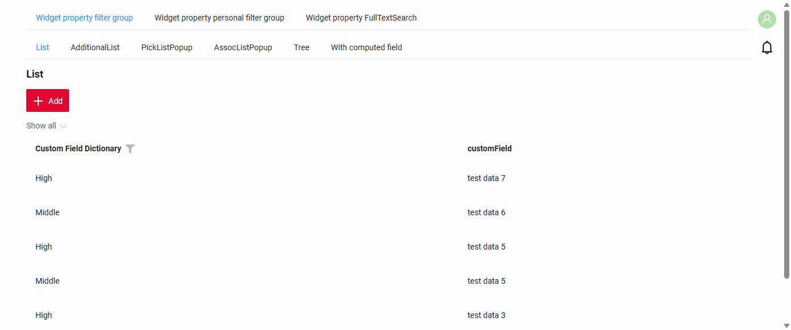
=== "AdditionalList"
    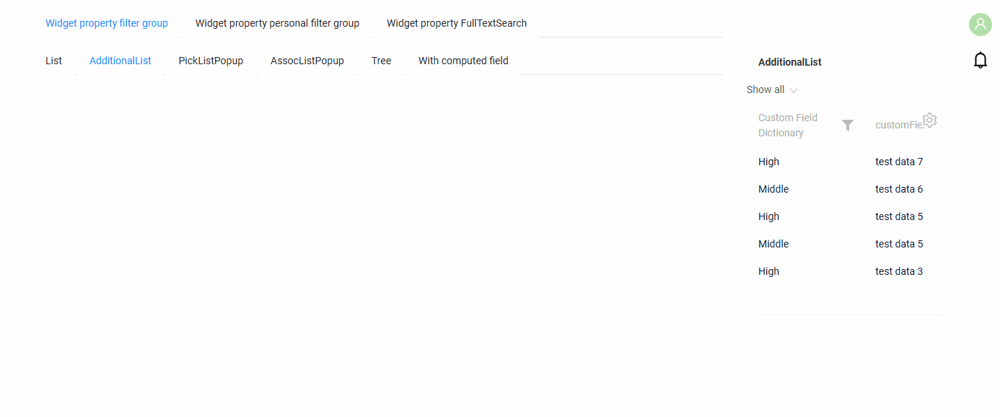
=== "Tree"
    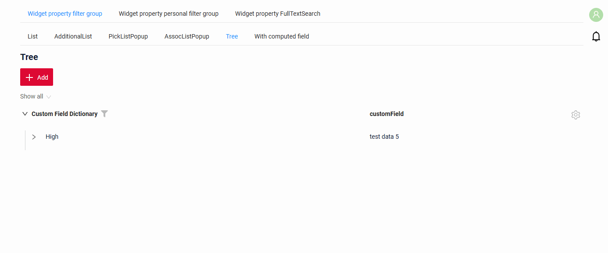
=== "Pie1D"
    

### How to add?
??? Example
    === "Basic"
        !!! tips
            To get the conditions for the `filters` column, follow these steps:
    
            * Add a filter function for fields 
            * Visually fill in the necessary filters in the interface.
            * Open the developer panel.
            * Locate the required request.
            * Use the filter part of this request as the `filters` value
    
            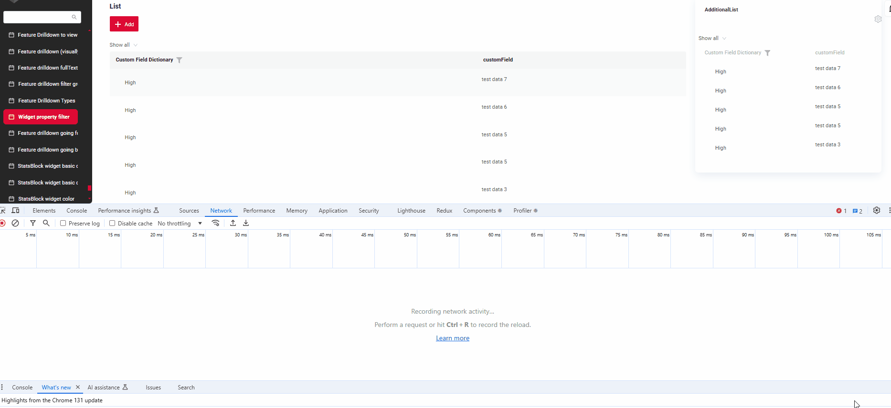
    
        Add  business component in **BC_FILTER_GROUPS** TABLE
    
          `name` - name predefined filter
    
          `BC` - name business component
    
          `filters` - conditions for filtration
        
          ```csv
            name;bc;filters;ID
            Dictionary = High;myexample3618;customFieldDictionary.equalsOneOf=%5B%22High%22%
          ```
        [:material-play-circle: Live Sample]({{ external_links.code_samples }}/ui/#/screen/myexample3616/view/myexample3618list){:target="_blank"}
        [:fontawesome-brands-github: GitHub]({{ external_links.github_ui }}/{{ external_links.github_branch }}/src/main/java/org/demo/documentation/widgets/property/filtration/filtergroupsave){:target="_blank"}

    === "With computed field"

        If the logic for selecting the Filter group is too complex and cannot be expressed using simple and conditions on widget fields, 
        you can add a separate computed hidden field. This field pre-calculates the required value, and then the Filter group is applied to it.

        **Step 1** Add computed boolean field to corresponding **DataResponseDTO**. 
        ```java
        --8<--
        {{ external_links.github_raw_doc }}/widgets/property/filtration/filtergrouphiddenfield/MyExample3628DTO.java
        --8<--
        ```  
        **Step 2** Add  business component in **BC_FILTER_GROUPS** TABLE
    
          `name` - name predefined filter
    
          `BC` - name business component
    
          `filters` - conditions for filtration
        
          ```csv
            name;bc;filters;ID
            Dictionary is null;myexample3628;customFieldHidden.equals=true;
          ```

        [:material-play-circle: Live Sample]({{ external_links.code_samples }}/ui/#/screen/myexample3616/view/myexample3628list){:target="_blank"}
        [:fontawesome-brands-github: GitHub]({{ external_links.github_ui }}/{{ external_links.github_branch }}/src/main/java/org/demo/documentation/widgets/property/filtration/filtergrouphiddenfield){:target="_blank"}

    === "Tree widget"
        The same as **Basic**: the group is a row of **BC_FILTER_GROUPS** for the business component of the tree.
        The records of the group are shown by the [search modes](/widget/type/tree/tree/#searchmodes).

        ```csv
        name;bc;filters;ID
        Dictionary = High;myexample3618;customFieldDictionary.equalsOneOf=%5B%22High%22%5D;
        ```

        [:material-play-circle: Live Sample]({{ external_links.code_samples }}/ui/#/screen/myexample3616/view/myexample3618tree){:target="_blank"} ·
        [:fontawesome-brands-github: GitHub]({{ external_links.github_ui }}/{{ external_links.github_branch }}/src/main/java/org/demo/documentation/widgets/property/filtration/filtergroupsave){:target="_blank"}

    === "Pie1D widget"
        Works only in the [table mode](/widget/type/pie1d/pie1d/#tablemode) of the chart.
        After the switch back to the chart, the chart draws only the filtered records. The chart mode does not show that a filter is applied: the filter is cleared in the table mode.
        When the data of the chart come from an AnySource DAO, the DAO applies the filter of the group itself.

        **Step 1** Add  business component in **BC_FILTER_GROUPS** TABLE

        ```csv
        name;bc;filters;ID
        Sum from 5000;myExampleBc4266;value.greaterOrEqualThan=5000;
        Sum under 5000;myExampleBc4266;value.lessThan=5000;
        ```

        **Step 2** Apply the filter in **getList** of the AnySource DAO.
        ```java
        --8<--
        {{ external_links.github_raw_doc }}/widgets/pie1d/filtergroup/MyExample4266Dao.java:getList
        --8<--
        ```

        [:material-play-circle: Live Sample]({{ external_links.code_samples }}/ui/#/screen/myexample4266){:target="_blank"} ·
        [:fontawesome-brands-github: GitHub]({{ external_links.github_ui }}/{{ external_links.github_branch }}/src/main/java/org/demo/documentation/widgets/pie1d/filtergroup){:target="_blank"}

!!! info

    There is a limitation when using predefined filters of the following types:
    `multivalue`, `pickList`, and `multivalueHover`.
    
     * When such filters are **predefined**, the filter tags display **`id` values**.
     * When the filter is **manually edited** (for example, by adding values via a picklist), the tags are displayed **according to the standard rules**.
    
    This behavior is caused by a frontend limitation:  
    the frontend cannot resolve display names for filter tags if the records specified in the predefined filter are located on **different pages of the picklist popup** and are not loaded in the current UI context.

    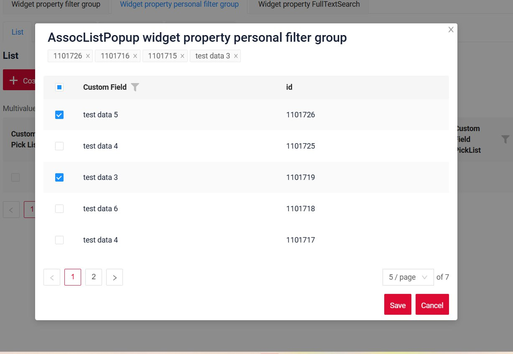   

## Additional properties
### Clear filters
If you have filtered by table, the "Clear all filters" button will appear.
It is suggested to indicate the number of applied filters by displaying "Clear n filters" (where n represents the number of columns being filtered).
 
#### How does it look?
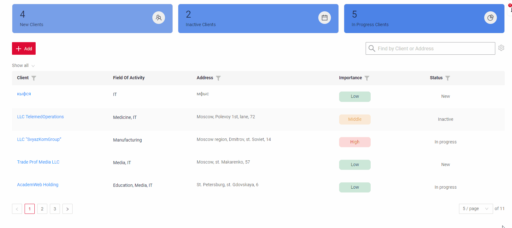
 
#### How to add?
on default