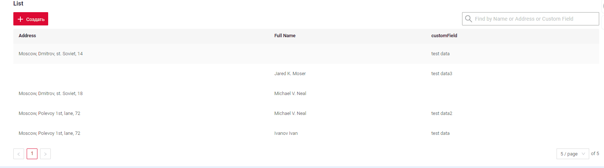

# Filtration
 
* [by fields](#by_fields)
* [by fulltextsearch](#by_fulltextsearch) 
* [by personal filter group](#by_personal_filter_group)
* [by filter group](#by_filter_group)
<!-- default filtration  -->

## <a id="by_fields">by fields</a>
The availability or unavailability of filtering operations for each field type see [Fields](/widget/fields/fieldtypes/).

Each field type requires a distinct filtering operation sent by the frontend.
Here are the standard field types with their respective filtering methods see [SearchOperation for filtering](/widget/fields/filtersearchoperation).

This function is available:

* [List widget](/widget/type/listfamily/list/list)  
* [AdditionalList widget](/widget/type/listfamily/additionallist/additionallist.md) 
* [GroupingHierarchy widget](/widget/type/groupinghierarchyfamily/groupinghierarchy/groupinghierarchy)  
* [AssocListPopup widget](/widget/type/popupfamily/assoclistpopup/assoclistpopup)
* [PickListPopup widget](/widget/type/popupfamily/picklistpopup/picklistpopup)

## <a id="by_fulltextsearch">by fulltextsearch</a>
`FullTextSearch` - when the user types in the full text search input area, then widget filters the rows that match the search query
(search criteria is configurable and will usually check if at least one column has corresponding value).
This feature makes it easier for users to quickly find the information they are looking for within a List widget.


This function is available:

* [List widget](/widget/type/listfamily/list/list)
(  [:material-play-circle: Live Sample]({{ external_links.code_samples }}/ui/#/screen/myexample3616/view/myexample3614list){:target="_blank"}
  [:fontawesome-brands-github: GitHub]({{ external_links.github_ui }}/{{ external_links.github_branch }}/src/main/java/org/demo/documentation/property/filtration/fulltextsearch){:target="_blank"}
)
* [AssocListPopup widget](/widget/type/popupfamily/assoclistpopup/assoclistpopup)
(  [:material-play-circle: Live Sample]({{ external_links.code_samples }}/ui/#/screen/myexample3616/view/myexample3614assoclistpopup){:target="_blank"}
  [:fontawesome-brands-github: GitHub]({{ external_links.github_ui }}/{{ external_links.github_branch }}/src/main/java/org/demo/documentation/property/filtration/fulltextsearch/forassoc){:target="_blank"}
)
* [PickListPopup widget](/widget/type/popupfamily/picklistpopup/picklistpopup)
([:material-play-circle: Live Sample]({{ external_links.code_samples }}/ui/#/screen/myexample3616/view/myexample3614picklistpopup){:target="_blank"}
[:fontawesome-brands-github: GitHub]({{ external_links.github_ui }}/{{ external_links.github_branch }}/src/main/java/org/demo/documentation/property/filtration/fulltextsearch/forpicklist){:target="_blank"}
) 

### How does it look?
=== "List widget"
    
=== "AssocListPopup widget"
    
=== "PickListPopup widget"
    
### How to add?
??? Example

    `Step 1` Add extension file FullTextSearchExt.java
    ```java
    import java.util.Optional;
    import jakarta.persistence.criteria.CriteriaBuilder;
    import jakarta.persistence.criteria.Path;
    import jakarta.persistence.criteria.Predicate;
    import lombok.NonNull;
    import lombok.experimental.UtilityClass;
    import org.apache.commons.lang3.StringUtils;
    import org.cxbox.core.crudma.bc.BusinessComponent;
    
    @UtilityClass
    public class FullTextSearchExt {
    
        @NonNull
        public static Optional<String> getFullTextSearchFilterParam(BusinessComponent bc) {
            return Optional.ofNullable(bc.getParameters().getParameter("_fullTextSearch"));
        }
    
        public static Predicate likeIgnoreCase(String value, CriteriaBuilder cb, Path<String> path) {
            return cb.like(cb.lower(path), StringUtils.lowerCase("%" + value + "%"));
        }
    
    }
    ```
    === "List widget"  
        `Step 2` Add **specifications** for fulltextsearch fields to corresponding **JpaRepository**. 
        ```java
        --8<--
        {{ external_links.github_raw_doc }}/widgets/property/filtration/fulltextsearch/MyEntity3614Repository.java
        --8<--
        ```
     
        `Step 4` Add **getSpecification** to corresponding **VersionAwareResponseService**. 
        ```java
        --8<--
        {{ external_links.github_raw_doc }}/widgets/property/filtration/fulltextsearch/MyExample3614Service.java:getSpecification
        --8<--
        ```
     
        `Step 5` Add **fullTextSearch** to corresponding **.widget.json**. 
    
        `enabled` true/false  
    
        `placeholder` - description for  fullTextSearch
            
        ```json
        --8<--
        {{ external_links.github_raw_doc }}/widgets/property/filtration/fulltextsearch/MyExample3614List.widget.json
        --8<--
        ```
        [:material-play-circle: Live Sample]({{ external_links.code_samples }}/ui/#/screen/myexample3616/view/myexample3614list){:target="_blank"}
        [:fontawesome-brands-github: GitHub]({{ external_links.github_ui }}/{{ external_links.github_branch }}/src/main/java/org/demo/documentation/property/filtration/fulltextsearch){:target="_blank"}

    === "AssocListPopup widget"  
        `Step 2` Add **specifications** for fulltextsearch fields to corresponding **JpaRepository**. 
        ```java
        --8<--
        {{ external_links.github_raw_doc }}/widgets/property/filtration/fulltextsearch/forassoc/MyEntity3625Repository.java
        --8<--
        ```
     
        `Step 4` Add **getSpecification** to corresponding **VersionAwareResponseService**. 
        ```java
        --8<--
        {{ external_links.github_raw_doc }}/widgets/property/filtration/fulltextsearch/forassoc/MyEntity3625PickService.java:getSpecification
        --8<--
        ```
     
        `Step 5` Add **fullTextSearch** to corresponding **.widget.json**. 
    
        `enabled` true/false  
    
        `placeholder` - description for  fullTextSearch
            
        ```json
        --8<--
        {{ external_links.github_raw_doc }}/widgets/property/filtration/fulltextsearch/forassoc/myEntity3625PickAssocListPopup.widget.json
        --8<--
        ```
        [:material-play-circle: Live Sample]({{ external_links.code_samples }}/ui/#/screen/myexample3616/view/myexample3614assoclistpopup){:target="_blank"}
        [:fontawesome-brands-github: GitHub]({{ external_links.github_ui }}/{{ external_links.github_branch }}/src/main/java/org/demo/documentation/property/filtration/fulltextsearch/forassoc){:target="_blank"}

    === "PickListPopup widget"  
        `Step 2` Add **specifications** for fulltextsearch fields to corresponding **JpaRepository**. 
        ```java
        --8<--
        {{ external_links.github_raw_doc }}/widgets/property/filtration/fulltextsearch/forpicklist/MyEntity3614PickRepository.java
        --8<--
        ```
     
        `Step 4` Add **getSpecification** to corresponding **VersionAwareResponseService**. 
        ```java
        --8<--
        {{ external_links.github_raw_doc }}/widgets/property/filtration/fulltextsearch/forpicklist/MyEntity3614PickPickService.java:getSpecification
        --8<--
        ```
     
        `Step 5` Add **fullTextSearch** to corresponding **.widget.json**. 
    
        `enabled` true/false  
    
        `placeholder` - description for  fullTextSearch
            
        ```json
        --8<--
        {{ external_links.github_raw_doc }}/widgets/property/filtration/fulltextsearch/forpicklist/myEntity3614PickPickPickListPopup.widget.json
        --8<--
        ```
        
        [:material-play-circle: Live Sample]({{ external_links.code_samples }}/ui/#/screen/myexample3616/view/myexample3614picklistpopup){:target="_blank"}
        [:fontawesome-brands-github: GitHub]({{ external_links.github_ui }}/{{ external_links.github_branch }}/src/main/java/org/demo/documentation/property/filtration/fulltextsearch/forpicklist){:target="_blank"}

## <a id="by_personal_filter_group">by personal filter group</a>

`Personal filter group` - a user-filled filter can be saved for each individual user.

A user-filled filter can be saved for each individual user.

This function is available:

* [List](/widget/type/listfamily/list/list) (
[:material-play-circle: Live Sample]({{ external_links.code_samples }}/ui/#/screen/myexample3616/view/myexample3616list){:target="_blank"}
[:fontawesome-brands-github: GitHub]({{ external_links.github_ui }}/{{ external_links.github_branch }}/src/main/java/org/demo/documentation/property/filtration/filtergroup){:target="_blank"}
)

* [AdditionalList](/widget/type/listfamily/additionallist/additionallist.md) (
[:material-play-circle: Live Sample]({{ external_links.code_samples }}/ui/#/screen/myexample3616/view/myexample3618additionallist){:target="_blank"}
[:fontawesome-brands-github: GitHub]({{ external_links.github_ui }}/{{ external_links.github_branch }}/src/main/java/org/demo/documentation/property/filtration/filtergroup){:target="_blank"}
)

The "Save Filters" button is located within the gear icon.
When the "Save Filters" button is clicked, a modal window appears displaying all custom filters, which can be deleted if desired.

### How does it look?
=== "List"
    
=== "AdditionalList"
    
### How to add?
??? Example
    The availability of filtering function depends on the type. See more [field types](/widget/fields/fieldtypes/)

    For fields where individual filters are intended to be saved, it is essential to configure the filtering options. see `Step 1` and `Step 2`
    **Step 1** Add **@SearchParameter** to corresponding **DataResponseDTO**. (Advanced customization [SearchParameter](/advancedCustomization/element/searchparameter/searchparameter))
    ```java
    --8<--
    {{ external_links.github_raw_doc }}/widgets/property/filtration/filtergroup/MyExample3616DTO.java
    --8<--
    ```

    **Step 2**  Add **fields.enableFilter** to corresponding **FieldMetaBuilder**.
    ```java
    --8<--
    {{ external_links.github_raw_doc }}/widgets/property/filtration/filtergroup/MyExample3616Meta.java:buildIndependentMeta
    --8<--
    ```
    === "List"
        **Step 3** Add **filterSetting** to corresponding **.widget.json**. 
    
        `enabled` true/false  
            
        ```json
        --8<--
        {{ external_links.github_raw_doc }}/widgets/property/filtration/filtergroup/MyExample3616List.widget.json
        --8<--
        ```

        [:material-play-circle: Live Sample]({{ external_links.code_samples }}/ui/#/screen/myexample3616/view/myexample3616list){:target="_blank"}
        [:fontawesome-brands-github: GitHub]({{ external_links.github_ui }}/{{ external_links.github_branch }}/src/main/java/org/demo/documentation/property/filtration/filtergroup){:target="_blank"}

    === "AdditionalList"
        **Step 3** Add **filterSetting** to corresponding **.widget.json**. 
    
        `enabled` true/false  
            
        ```json
        --8<--
        {{ external_links.github_raw_doc }}/widgets/property/filtration/filtergroup/MyExample3618AdditionalList.widget.json
        --8<--
        ```

        [:material-play-circle: Live Sample]({{ external_links.code_samples }}/ui/#/screen/myexample3616/view/myexample3618additionallist){:target="_blank"}
        [:fontawesome-brands-github: GitHub]({{ external_links.github_ui }}/{{ external_links.github_branch }}/src/main/java/org/demo/documentation/property/filtration/filtergroup){:target="_blank"}

## <a id="by_filter_group">by filter group</a>

`Filter group` - predefined filters settings that users can use in an application. They allow users to quickly apply specific filtering criteria without having to manually input.

This function is available:

* [List](/widget/type/listfamily/list/list)
  ([:material-play-circle: Live Sample]({{ external_links.code_samples }}/ui/#/screen/myexample3616/view/myexample3618list){:target="_blank"}
  [:fontawesome-brands-github: GitHub]({{ external_links.github_ui }}/{{ external_links.github_branch }}/src/main/java/org/demo/documentation/property/filtration/filtergroupsave){:target="_blank"}
  )
* [AdditionalList](/widget/type/listfamily/additionallist/additionallist.md)
([:material-play-circle: Live Sample]({{ external_links.code_samples }}/ui/#/screen/myexample3616/view/myexample3618additionallist){:target="_blank"}
[:fontawesome-brands-github: GitHub]({{ external_links.github_ui }}/{{ external_links.github_branch }}/src/main/java/org/demo/documentation/property/filtration/filtergroupsave){:target="_blank"}
)

The option to default filter by saved groups is currently unavailable.

### How does it look?
=== "List"
    
=== "AdditionalList"
    

### How to add?
??? Example
    !!! tips
        To write this drilldown, follow these steps:

                * Add a filter function for fields 
                * Visually fill in the necessary filters in the interface.
                * Open the developer panel.
                * Locate the required request.
                * Use this query to substitute in your code to get a reference 

        

    Add  business component in **BC_FILTER_GROUPS** TABLE

      `name` - name predefined filter

      `BC` - name business component

      `filters` - conditions for filtration
    
      ```csv
        name;bc;filters;ID
        Dictionary = High;myexample3618;customFieldDictionary.equalsOneOf=%5B%22High%22%
      ```


## Additional properties
### Clear filters
If you have filtered by table, the "Clear all filters" button will appear.
It is suggested to indicate the number of applied filters by displaying "Clear n filters" (where n represents the number of columns being filtered).
 
#### How does it look?

 
#### How to add?
on default