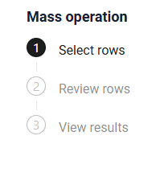
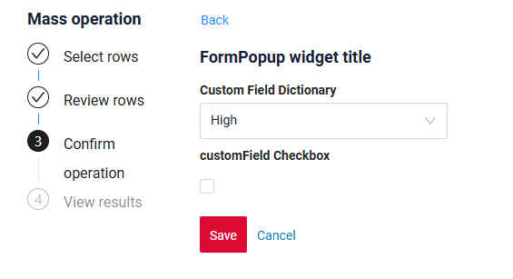

# Bulk operations
[:material-play-circle: Live Sample]({{ external_links.code_samples }}/ui/#/screen/myexample6101){:target="_blank"}
[:fontawesome-brands-github: GitHub]({{ external_links.github_ui }}/{{ external_links.github_branch }}/src/main/java/org/demo/documentation/feature/massoperations){:target="_blank"}

!!! info
    For small and medium data volumes. Use for synchronous processing within a single transaction when the data size is up to 10,000 rows.

`Bulk operations` are a mechanism that allows the user to perform a single action on a large number of table rows at once. Instead of processing each row individually, the user can select a set of data and apply a common operation to it—such as updating, deleting, changing statuses, recalculating values, and other typical scenarios.

This function is available for widgets:

 * [List](/widget/type/list/list),
 * [GroupingHierarchy](/widget/type/groupinghierarchy/groupinghierarchy).

When the table contains at least one row, bulk operations become available. 
After clicking on a bulk operation, the user enters the bulk-operation mode, which consists of several steps:

1. [Selecting rows](#selecting_rows)
2. [Reviewing the selected rows](#reviewing)
3. [Confirming the action](#confirming) (this step is optional)
4. [Viewing the result](#result) 

=== "With confirm"
    [:material-play-circle: Live Sample]({{ external_links.code_samples }}/ui/#/screen/myexample6101/view/myexample6101list){:target="_blank"}
    [:fontawesome-brands-github: GitHub]({{ external_links.github_ui }}/{{ external_links.github_branch }}/src/main/java/org/demo/documentation/feature/massoperations){:target="_blank"}

    
=== "Without confirm"
    [:material-play-circle: Live Sample]({{ external_links.code_samples }}/ui/#/screen/myexample6101/view/myexample6101checkboxtruelist){:target="_blank"}
    [:fontawesome-brands-github: GitHub]({{ external_links.github_ui }}/{{ external_links.github_branch }}/src/main/java/org/demo/documentation/feature/massoperations){:target="_blank"}

    

!!! Specifics
    * Bulk operations become available only if there is at least one row in the table.
    * All requests are executed using the ID of the first selected row!


##### How to add?

??? Example
    - **Step1**  Add actionGroups **massEdit**(Custom name) to corresponding **.widget.json**.

        ```json
            "actionGroups": {
              "include": [
                "massEdit"
              ]
        }
        ```

        ```json
        --8<--
        {{ external_links.github_raw_doc }}/feature/massoperations/myexample6101List.widget.json
        --8<--
        ``` 
    - **Step2** Create action massEdit to corresponding **AwareResponseService*.      

          ```java
          --8<--
          {{ external_links.github_raw_doc }}/feature/massoperations/MyExample6101Service.java:massEdit
          --8<--
          ``` 
 
        - **Step2.1** `.action("massEditCustomTitle", "Mass Edit With Custom Text")`
            
            * `"massEditCustomTitle"` — name button for internal used by backend and frontend.
            * `"Mass Edit With Custom Text"` —  title displayed in the UI.
            
            
        - **Step2.2** `.withPreAction(PreAction.confirmWithWidget(...))`
            
            Adds a confirmation dialog before the mass action executes.
            
            Parameters:
            
            1) The name widget used for the confirmation .
            
            2) **`cfw -> ...`**:
            
            A configuration block where  properties are defined:
            
            2.1) **`.noText("It is text no")`**
              Text for the **Cancel ** button.
            
            2.2) **`.title("Mass Edit Title")`**
                Title of the a confirmation dialog before the mass action executes.
            
            2.3) **`.yesText("It is text yes")`**
                Text for the **Apply** button.
            
            This allows customizing the buttons and title.
            
       - **Step2.3** 
            
        `.scope(ActionScope.MASS)`**
            
        Specifies that this is a **mass action**, applied to all selected rows in the grid.
            
       - **Step2.4**  `.massInvoker((bc, data, ids) -> { ... })`
            
        The main handler for the mass operation.
        
        Parameters:
        
        * **`bc`** — business component context.
        * **`data`** — data submitted from the confirmation dialog based on the *first row*.
        * **`ids`** — the set of IDs of all selected records.
        
        Inside the handler:
         The  method processes each record and returns:
        
        * `MassDTO.success(id)` - result success 
        * `MassDTO.fail(id, "message")` - result error 
  
            
       - **Step2.5**  `return new MassActionResultDTO<>(massResult)...`**
            
        The mass action result includes:
        
        * success/failure information for each record,
        * a UI post-action.
        
       - **Step2.6** `.setAction(PostAction.showMessage(...))`
            
        Displays a message in the UI after the mass action completes.
        
        Parameters:
        
        * `MessageType.INFO` — message type.
        * `"The fields mass operation was completed!"` — message text.

        === "With confirm"
        [:material-play-circle: Live Sample]({{ external_links.code_samples }}/ui/#/screen/myexample6101/view/myexample6101list){:target="_blank"}
        [:fontawesome-brands-github: GitHub]({{ external_links.github_ui }}/{{ external_links.github_branch }}/src/main/java/org/demo/documentation/feature/massoperations){:target="_blank"}
            ```java
            --8<--
            {{ external_links.github_raw_doc }}/feature/massoperations/MyExample6101Service.java:massEdit
            --8<--
            ``` 
        === "Without confirm"
        [:material-play-circle: Live Sample]({{ external_links.code_samples }}/ui/#/screen/myexample6101/view/myexample6101checkboxtruelist){:target="_blank"}
        [:fontawesome-brands-github: GitHub]({{ external_links.github_ui }}/{{ external_links.github_branch }}/src/main/java/org/demo/documentation/feature/massoperations){:target="_blank"}
            ```java
            --8<--
            {{ external_links.github_raw_doc }}/feature/massoperations/MyExample6101Service.java:massCheckboxTrue
            --8<--
            ``` 


## <a id="selecting_rows">Step 1. Selecting rows</a>


1. Checkboxes for selecting rows are displayed in the first column of the table (true = the row is selected).
2. Filtering and sortingremain available.
3. Rows become non-editable while in bulk-operation mode.
4. All selected rows are displayed above the table as chips.

    * If the number of chips exceeds **N**, only the first **N** are shown; the rest are collapsed and replaced with the label **“+N values”**. Hovering over **“+N values”** displays a tooltip: *“Move on to Step 2 to see all the chosen rows.”*
    * A **“Clear”** button is displayed next to the chips. Clicking **Clear** deselects all checkboxes and removes all chips.
    * A gear icon is available for chip-related actions, containing the option **“Select from file”** (importing data from an Excel file [step 4](#result)).
          
  
5. **Available actions**:

    * **Cancel** — exits bulk-operation mode.
    * **Next** — proceeds to Step 2, where only the selected rows are displayed.

## <a id="reviewing">Step 2. Reviewing the selected rows</a>


1.Selected rows from [Step 1. Selecting rows](#selecting_rows) are displayed in read-only mode.

2.Checkboxes are disabled, and rows cannot be edited.

3.Filtering and sorting of the selected rows remain available.

4.Available actions:

4.1.Dynamic **“Next / Apply** button 

* **Next** — moves the user to Step 3 (confirmation).
* **Apply** — immediately executes the bulk action and navigates to the *View Results* step.

4.2.**Back** — returns the user to Step 1 (row selection).
    When returning to Step 1, the table resets to the first page and all filters are cleared.

4.3.**Cancel** — exits bulk-operation mode without applying any changes.

## <a id="confirming">Step 3. Confirming the action</a>
You can enable or disable the confirmation step — if it’s disabled, the system moves directly to the *View results* stage.

In the confirmation step, you can customize 

* the widget’s title
* remove widget’s title
* customize the text of the **Save** and **Cancel** buttons
* the **Back** button is fixed and does not depend on the configuration

=== "Basic"
    
=== "With custom text"
    
=== "Without title"
    

##### How to add?
    === "Basic"
        ```java
        --8<--
        {{ external_links.github_raw_doc }}/feature/massoperations/MyExample6101Service.java:massEdit
        --8<--
        ``` 
    === "With custom text"
        ```java
        --8<--
        {{ external_links.github_raw_doc }}/feature/massoperations/MyExample6101Service.java:massEditCustomTitle
        --8<--
        ``` 
    === "Without title"
        ```java
        --8<--
        {{ external_links.github_raw_doc }}/feature/massoperations/MyExample6101Service.java:massEditWithoutTitle
        --8<--
        ```  

## <a id="result">Step 4. Viewing the result</a>


After performing a mass operation, the status for each row in the table is displayed:

1. **Success** – the operation was completed successfully
2. **Fail** – the operation was not completed

The widget header on displays the number of processed rows (including the number of successful/failed rows).

Filtering/sorting of selected rows is available for any column, including status.

**Available actions:**

1. **Save and Close** – Exit the mass operation mode. The user returns to the normal table view, taking into account all changes made by the operation.

2. **Export** – Export rows to a file.
   2.1 Ability to filter/sort the table before export.
   2.2 File format fully compatible with uploading on Step 1 (Select from File).
   2.3 Tooltip on hover:  “Export of selected rows. You can use this file on Step 1 via ‘Select from File.’”
   2.4 After export, display a notification:  "File exported successfully"

3. **Export failed (for Retry)** – Export all rows with the status “Fail”
   3.1 The table is automatically filtered by failed rows.
   3.2 File format fully compatible with uploading on Step 1 (Select from File).
   3.3 Tooltip on hover: A file with failed rows will be downloaded. To retry the operation for these rows, upload this file on Step 1 via ‘Select from File.’”
  