# Multi-upload files

We have implemented multi-file upload. You can use a dedicated drag-and-drop zone or a standard button to select your files.

## Basics
[:material-play-circle: Live Sample]({{ external_links.code_samples }}/ui/#/screen/myexample6100){:target="_blank"}
[:fontawesome-brands-github: GitHub]({{ external_links.github_ui }}/{{ external_links.github_branch }}/src/main/java/org/demo/documentation/feature/file){:target="_blank"}

This feature supports the following types:

* [List widget](/widget/type/list/list)
* [GroupingHierarchy widget](/widget/type/groupinghierarchy/groupinghierarchy)
* [Tree widget](/widget/type/tree/tree)

This feature supports only field [fileUpload](/widget/fields/field/fileUpload/fileUpload)

The interface supports three distinct modes for displaying the bulk file upload functionality, allowing for flexible user experience configuration:

1. Combined Mode (Button + Multi-upload)
[:material-play-circle: Live Sample]({{ external_links.code_samples }}/ui/#/screen/myexample6100){:target="_blank"}
[:fontawesome-brands-github: GitHub]({{ external_links.github_ui }}/{{ external_links.github_branch }}/src/main/java/org/demo/documentation/feature/file){:target="_blank"}

This mode displays both a button to trigger the upload dialog and a drag-and-drop widget, giving the user maximum choice in how they initiate the upload.

2. Button-Only Mode (Button)
[:material-play-circle: Live Sample]({{ external_links.code_samples }}/ui/#/screen/myexample6100){:target="_blank"}
[:fontawesome-brands-github: GitHub]({{ external_links.github_ui }}/{{ external_links.github_branch }}/src/main/java/org/demo/documentation/feature/file){:target="_blank"}

This mode is designed to display only a button. Clicking it opens the operating system's standard file selection dialog for bulk uploading files.

3. Widget-Only Mode (Multi-upload files)
This mode displays only the interactive drag-and-drop upload widget, without a separate button.

[:material-play-circle: Live Sample]({{ external_links.code_samples }}/ui/#/screen/myexample6100){:target="_blank"}
[:fontawesome-brands-github: GitHub]({{ external_links.github_ui }}/{{ external_links.github_branch }}/src/main/java/org/demo/documentation/feature/file){:target="_blank"}

### How does it look?
=== "Combined Mode (Button + Multi-upload)"
    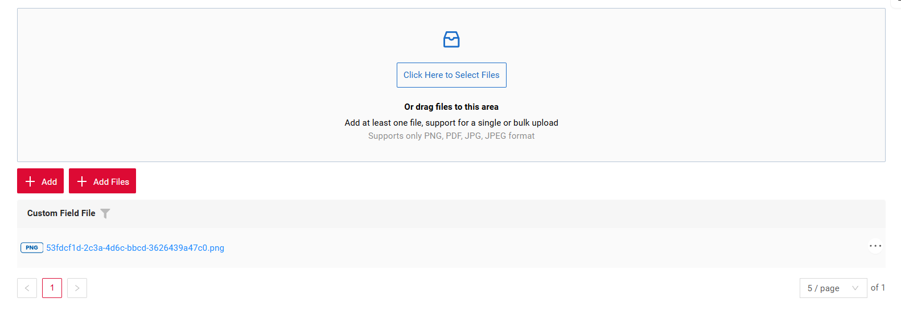
=== "Button-Only Mode (Button)"
    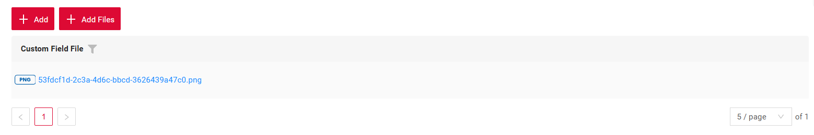
=== "Widget-Only Mode (Multi-upload files)"
    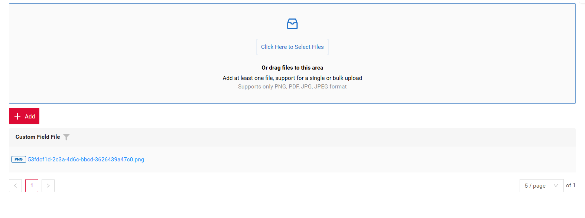

There are five main colors used for the progress bar and icon:

* light gray — empty progress bar
* blue — upload in progress
* green — upload completed successfully
* red — an error occurred
* dark gray — file skipped and will not be uploaded (the reason can be viewed by hovering over the progress row)

=== "light gray"
    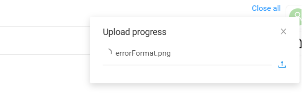
=== "blue"
    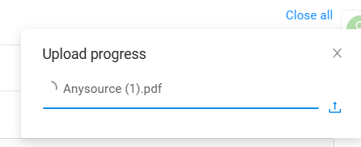
=== "green"
    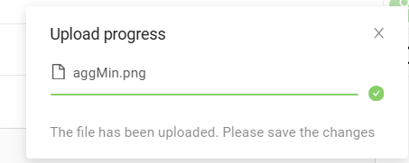
=== "red"
    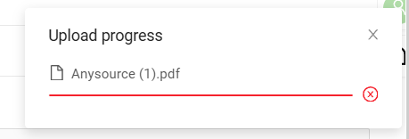
=== "dark gray"
    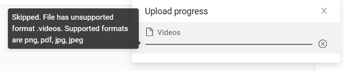

Uploaded:

* If all files are uploaded successfully, the progress notification automatically disappears after 5 seconds.
* If some files are skipped, the notification remains visible until it is closed manually or the user navigates to another screen. Information about successfully uploaded files still disappears after 5 seconds.
* When hovering over a notification, it will not disappear until the mouse is moved away (successful notifications also remain visible in this case)
* Limitation: When navigating to another screen, the notification is hidden and the upload is canceled

!!! Button
    A file can be added not only through the standard selection dialog but also by dragging and dropping it onto the upload button.

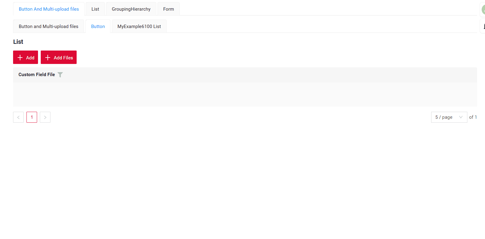

!!! info
    For fields of type fileUpload, there is an option to cancel the upload: if a new file is added while the previous one is still uploading, the previous upload is canceled.

### How to add?

??? Example
    === "Button And Multi-upload files"
        `Step1`  Add actionKey **associate** to corresponding **.widget.json**.

        ```json
              {
                "actionKey": "associate",
                "fieldKey": "customFieldFile",
                "mode": "default-and-file-upload-dnd"
              }
        ```
        
        ```json
        --8<--
        {{ external_links.github_raw_doc }}/feature/file/MyExample6100AllList.widget.json
        --8<--
        ``` 
    === "Multi-upload files"
        `Step1`  Add actionKey **associate** to corresponding **.widget.json**.
    
        ```json
              {
                "actionKey": "associate",
                "fieldKey": "customFieldFile",
                "mode": "file-upload-dnd"
              }
        ```
        
        ```json
        --8<--
        {{ external_links.github_raw_doc }}/feature/file/MyExample6100FileList.widget.json
        --8<--
        ``` 
    === "Button"
        `Step1`  Add actionKey **associate** to corresponding **.widget.json**.
    
        ```json
              {
                "actionKey": "associate",
                "fieldKey": "customFieldFile",
                "mode": "default"
              }
        ```
        
        ```json
        --8<--
        {{ external_links.github_raw_doc }}/feature/file/MyExample6100DefaultList.widget.json
        --8<--
        ``` 

    `Step2`  Add **setFileAccept** to corresponding **FieldMetaBuilder**.

    ```java
    fields.setFileAccept(MyExampleDTO_.customFieldFile, List.of(".png",".pdf",".jpg",".jpeg"));
    ```

    ```java
    --8<--
    {{ external_links.github_raw_doc }}/feature/file/MyExample6100Meta.java:buildIndependentMeta
    --8<--
    ```

    `Step3`  Add **associate** to corresponding **ResponseService**.

    ```java
    .associate(ast -> ast
        .withCustomParameter(Map.of("subtype", "multiFileUpload"))
        .text("Add Files"))
    ```

    ```java
    --8<--
    {{ external_links.github_raw_doc }}/feature/file/MyExample6100Service.java:getActions
    --8<--
    ```

    `Step3.1`  Add **doAssociate** to corresponding **ResponseService**.
    In this service, it is necessary to describe what happens to the files during multiple upload, as well as how and with which properties they are stored.

    ```java
    --8<--
    {{ external_links.github_raw_doc }}/feature/file/MyExample6100Service.java:doAssociate
    --8<--
    ```

    `Step3.2`  Add function **fileUpload** to corresponding **ResponseService**.

    ```java
    --8<--
    {{ external_links.github_raw_doc }}/feature/file/MyExample6100Service.java:fileUpload
    --8<--
    ```

## <a id="action">Action</a>
[:material-play-circle: Live Sample]({{ external_links.code_samples }}/ui/#/screen/myexample6100){:target="_blank"}
[:fontawesome-brands-github: GitHub]({{ external_links.github_ui }}/{{ external_links.github_branch }}/src/main/java/org/demo/documentation/feature/file){:target="_blank"}

!!! warning line end "Work in progress"

The button and the drag-and-drop zone first upload the chosen files, then run one action for all of them on the backend.
The backend decides what to do with the files: for example, create a row for each file and fill its fields, or reject the files with a message.

## <a id="availability">Availability</a>
[:material-play-circle: Live Sample]({{ external_links.code_samples }}/ui/#/screen/myexample6100availability){:target="_blank"}
[:fontawesome-brands-github: GitHub]({{ external_links.github_ui }}/{{ external_links.github_branch }}/src/main/java/org/demo/documentation/feature/file/availability){:target="_blank"}

When adding files is not allowed, the button is hidden, and the drag-and-drop zone stays in its place but turns gray and does not accept files.

For example, documents can be added to a task only while the task is open.
When the task status is "Closed", the "Add Files" button is hidden and the drag-and-drop zone is gray.

### How does it look?
=== "Combined Mode (Button + Multi-upload)"
    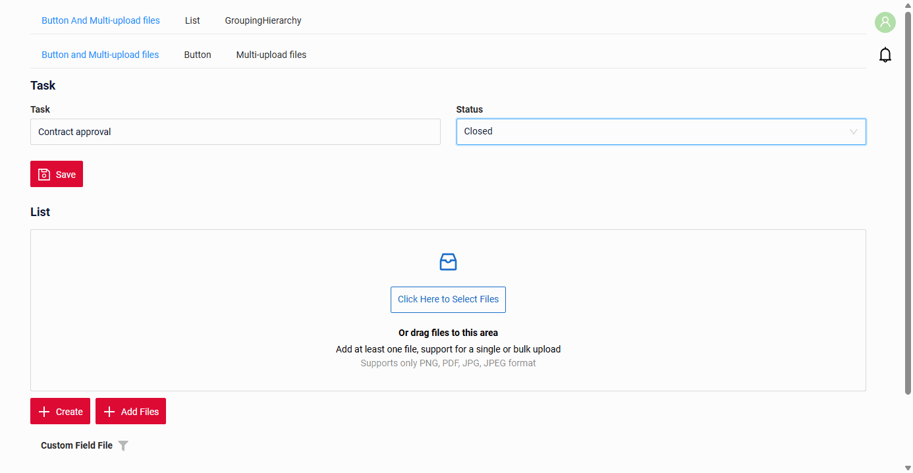
=== "Button-Only Mode (Button)"
    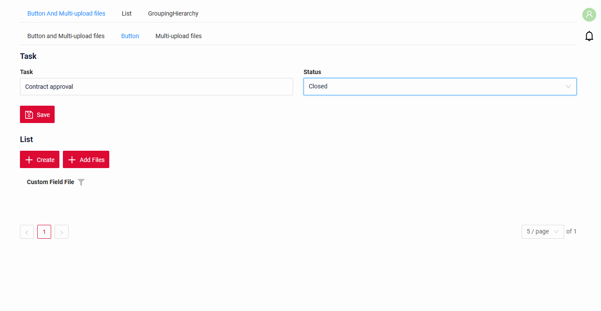
=== "Widget-Only Mode (Multi-upload files)"
    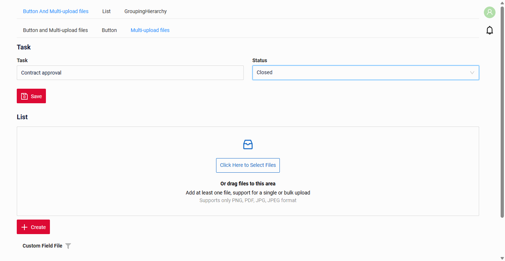

### How to add?

??? Example
    `Step1`  Add **available** to the action in corresponding **ResponseService**.

    ```java
    .associate(ast -> ast
        .withCustomParameter(Map.of("subtype", "multiFileUpload"))
        .text("Add Files")
        .available(this::isTaskOpen))
    ```

    ```java
    --8<--
    {{ external_links.github_raw_doc }}/feature/file/availability/MyExample6105Service.java:getActions
    --8<--
    ```

    see more [Actions](/features/element/actions/actions)

## PostAction

!!! warning line end "Work in progress"
