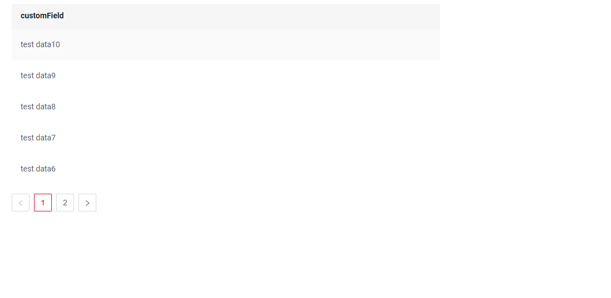
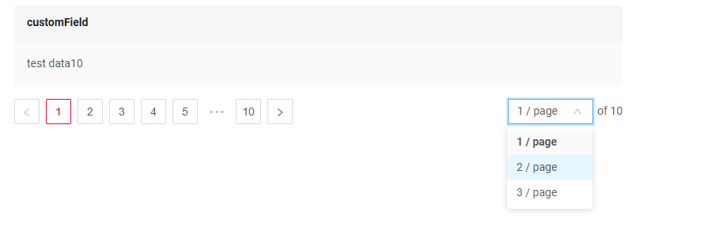

# Pagination

Pagination is the process of dividing content into separate, discrete pages, making it easier to navigate and consume large amounts of information.

The navigation arrows and limit settings block are removed if the number of records is less than the limit.

This function is available:

* [List widget](/widget/type/list/list)
* [AssocListPopup widget](/widget/type/assoclistpopup/assoclistpopup)
* [PickListPopup widget](/widget/type/picklistpopup/picklistpopup)

Pagination modes:

* **Default (nextAndPreviousWithCount)**
* **nextAndPreviousWithHasNext**
* **nextAndPreviousSmart**

**By default**, all widget types use the following navigation mode: `nextAndPreviousSmart`

However, for certain `exception widgets,` the default navigation mode is: `nextAndPreviousWithCount`

`Exception Type Widgets`: 

* [List widget](/widget/type/list/list)
* [AssocListPopup widget](/widget/type/assoclistpopup/assoclistpopup)
* [PickListPopup widget](/widget/type/picklistpopup/picklistpopup)
* [GroupingHierarchy widget](/widget/type/groupinghierarchy/groupinghierarchy)
* DashboardList
* Pie1D
* Column2D
* Line2D
* DualAxes2D

The /count request is executed only if there is at least one widget with the `nextAndPreviousWithCount` mode on the view.
If such a widget is present (as specified in the view’s metadata), the /count request will be triggered.
 
| API Calls (Frontend to Backend) | nextAndPreviousWithCount  | nextAndPreviousWithHasNext | nextAndPreviousSmart |
|---------------------------------|---------------------------|----------------------------|----------------------|
| /meta                           | +                         | +                          | +                    |
| /count                          | +                         | -                          | -                    | 
| /data                           | +                         | +                          | +                    | 


!!! info
    Pagination won't function until the page is refreshed after adding records.

**Use Cases** :

* **`nextAndPreviousWithCount`**: Ideal for backends that leverage database sources.
* **`nextAndPreviousWithHasNext`**: Designed for microservice-based backends where the presence of the next page can be determined, allowing the `hasNext` flag to be populated.
* **`nextAndPreviousSmart`**: Suitable for microservice-based backends where it is not possible to determine if there is a next page, and the `hasNext` flag cannot be populated.  

## <a id="nextAndPreviousWithCount">Default (nextAndPreviousWithCount)</a>
[:material-play-circle: Live Sample]({{ external_links.code_samples }}/ui/#/screen/myexample3861/view/myexample3862list){:target="_blank"} ·
[:fontawesome-brands-github: GitHub]({{ external_links.github_ui }}/{{ external_links.github_branch }}/src/main/java/org/demo/documentation/widgets/property/pagination/nextandpreviouswithcount){:target="_blank"}
 
Frontend Behavior:

* All three responses are utilized, including the `/count` result.
* This mode is best suited for backends that rely on database sources.

### How does it look?


### How to add?
??? Example
    Option 1. By default 

    Option 2. Add in **options** parameter **pagination** to corresponding **.widget.json**.

    ```
      "pagination": {
      "type": "nextAndPreviousWithCount"
      }
    ```
   
    ```json
    --8<--
    {{ external_links.github_raw_doc }}/widgets/property/pagination/nextandpreviouswithcount/MyExample3862List.widget.json
    --8<--
    ```

    [:material-play-circle: Live Sample]({{ external_links.code_samples }}/ui/#/screen/myexample3861/view/myexample3862list){:target="_blank"} ·
    [:fontawesome-brands-github: GitHub]({{ external_links.github_ui }}/{{ external_links.github_branch }}/src/main/java/org/demo/documentation/widgets/property/pagination/nextandpreviouswihhasnext){:target="_blank"}


## <a id="nextAndPreviousWithHasNext">nextAndPreviousWithHasNext</a>
[:material-play-circle: Live Sample]({{ external_links.code_samples }}/ui/#/screen/myexample3861/view/myexample3860list){:target="_blank"} ·
[:fontawesome-brands-github: GitHub]({{ external_links.github_ui }}/{{ external_links.github_branch }}/src/main/java/org/demo/documentation/widgets/property/pagination/nextandpreviouswihhasnext){:target="_blank"}

Frontend Behavior:

* The `/count` endpoint is called, but its result is not used.
* Instead, pagination is based `/data` that indicates whether there is a next or previous page (hasNext/hasPrevious).


Next button availability logic:

* If hasNext (from /data) is true, Next button is available.
* If hasNext (from /data) is false, Next button is disabled.

### How does it look?


### How to add?
??? Example

    Add in **options** parameter **pagination** to corresponding **.widget.json**.

    ```
      "pagination": {
      "type": "nextAndPreviousWihHasNext"
      }
    ```
   
    ```json
    --8<--
    {{ external_links.github_raw_doc }}/widgets/property/pagination/nextandpreviouswihhasnext/MyExample3860List.widget.json
    --8<--
    ```
    !!! info
          To deactivate the functionality `hasNext=true`add in application.yml `cxbox.api.any-source-has-next-enabled = false`


    [:material-play-circle: Live Sample]({{ external_links.code_samples }}/ui/#/screen/myexample3861/view/myexample3860list){:target="_blank"} ·
    [:fontawesome-brands-github: GitHub]({{ external_links.github_ui }}/{{ external_links.github_branch }}/src/main/java/org/demo/documentation/widgets/property/pagination/nextandpreviouswihhasnext){:target="_blank"}


## <a id="nextAndPreviousSmart">nextAndPreviousSmart</a>
[:material-play-circle: Live Sample]({{ external_links.code_samples }}/ui/#/screen/myexample3861/view/myexample3861list){:target="_blank"} ·
[:fontawesome-brands-github: GitHub]({{ external_links.github_ui }}/{{ external_links.github_branch }}/src/main/java/org/demo/documentation/widgets/property/pagination/nextandprevioussmart){:target="_blank"}

Frontend Behavior:

* The `/count` endpoint is called, but its result is not used. 

Next button availability logic:
If the number of records received from `/data` is less than _limit, Next button is disabled.

Disadvantages of this mode:

* If the number of records is a multiple of _limit, a single jump to a page with no records will occur, since it is impossible to determine whether this is the last page.
* If the number of records is a multiple of _limit, a request for the next page will be sent even if it does not exist. If this request returns an error, it should be handled with a try {} catch {} block.
  (For instance, when retrieving data for the next page from a microservice.)

### How does it look?


### How to add?
??? Example

    Add in **options** parameter **pagination** to corresponding **.widget.json**.
    ```
    "pagination": {
    "type": "nextAndPreviousWihHasNext"
    }
    ```
    ```json
      --8<--
        {{ external_links.github_raw_doc }}/widgets/property/pagination/nextandprevioussmart/MyExample3861List.widget.json
      --8<--
    ```
    [:material-play-circle: Live Sample]({{ external_links.code_samples }}/ui/#/screen/myexample3861/view/myexample3861list){:target="_blank"} ·
    [:fontawesome-brands-github: GitHub]({{ external_links.github_ui }}/{{ external_links.github_branch }}/src/main/java/org/demo/documentation/widgets/property/pagination/nextandprevioussmart){:target="_blank"}

## hideLimitOptions

[:material-play-circle: Live Sample]({{ external_links.code_samples }}/ui/#/screen/myexample3861/view/myexample3865list){:target="_blank"} ·
[:fontawesome-brands-github: GitHub]({{ external_links.github_ui }}/{{ external_links.github_branch }}/src/main/java/org/demo/documentation/widgets/property/pagination/hidelimitoptions){:target="_blank"}

Controls the visibility of the records-per-page selection option.

This function is available:

* [List widget](/widget/type/list/list)
* [AssocListPopup widget](/widget/type/assoclistpopup/assoclistpopup)
* [PickListPopup widget](/widget/type/picklistpopup/picklistpopup)

**Values:**

* `true` – Hides the records-per-page selection option.
* `false` (default if not specified) – Shows the records-per-page selection option.

### How does it look?

### How to add?
??? Example

    Add in **options** parameter **pagination** to corresponding **.widget.json**.
    ```
    "pagination": {
      "hideLimitOptions" : true
    }
    ```

    ```json
      --8<--
        {{ external_links.github_raw_doc }}/widgets/property/pagination/hidelimitoptions/MyExample3865List.widget.json
      --8<--
    ```
 
    [:material-play-circle: Live Sample]({{ external_links.code_samples }}/ui/#/screen/myexample3861/view/myexample3865list){:target="_blank"} ·
    [:fontawesome-brands-github: GitHub]({{ external_links.github_ui }}/{{ external_links.github_branch }}/src/main/java/org/demo/documentation/widgets/property/pagination/hidelimitoptions){:target="_blank"}


## availableLimitsList

[:material-play-circle: Live Sample]({{ external_links.code_samples }}/ui/#/screen/myexample3861/view/myexample3867list){:target="_blank"} ·
[:fontawesome-brands-github: GitHub]({{ external_links.github_ui }}/{{ external_links.github_branch }}/src/main/java/org/demo/documentation/widgets/property/pagination/availablelimitselist){:target="_blank"}

Specifies the available options for the number of items displayed per page. Users will see these values in a dropdown.

This function is available:

* [List widget](/widget/type/list/list)
* [AssocListPopup widget](/widget/type/assoclistpopup/assoclistpopup)
* [PickListPopup widget](/widget/type/picklistpopup/picklistpopup)

**Values:**

An array of integers.


**Behavior:**

If not provided, the component use default values [5, 10,15, 20].

The user will only be able to select from the specified values.

**Use Case:**

Restrict pagination options to specific values (e.g., 10, 25, 50, or 100 items per page).

### How does it look?


### How to add?
??? Example

    Add in **options** parameter **pagination** to corresponding **.widget.json**.
    ```
    "pagination": {
        "availableLimitsList": [ 1,2,3 ]
    }
    ```

    ```json
      --8<--
        {{ external_links.github_raw_doc }}/widgets/property/pagination/availablelimitselist/MyExample3867List.widget.json
      --8<--
    ```
 
    [:material-play-circle: Live Sample]({{ external_links.code_samples }}/ui/#/screen/myexample3861/view/myexample3867list){:target="_blank"} ·
    [:fontawesome-brands-github: GitHub]({{ external_links.github_ui }}/{{ external_links.github_branch }}/src/main/java/org/demo/documentation/widgets/property/pagination/availablelimitselist){:target="_blank"}

