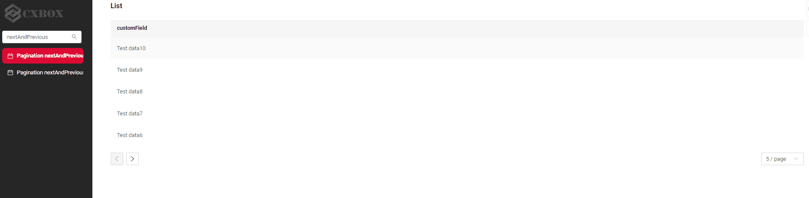

# Pagination
!!! warning line end "Work in progress"

Pagination is the process of dividing content into separate, discrete pages, making it easier to navigate and consume large amounts of information.

The navigation arrows and limit settings block are removed if the number of records is less than the limit.

Pagination modes:

1. **Default (`nextAndPreviousWithCount`)**

  API Calls (Frontend to Backend):

    * `/meta`
    * `/count`
    * `/data`

  Frontend Behavior:

  * All three responses are utilized, including the /count result.
  * This mode is best suited for backends that rely on database sources.

2. **`nextAndPreviousWithHasNext`**

   API Calls (Frontend to Backend):

    * `/meta`
    * `/count` (response is ignored)
    * `/data`
   
    Frontend Behavior:

    * The /count endpoint is called, but its result is not used.
    * Instead, pagination is based on metadata that indicates whether there is a next or previous page (hasNext/hasPrevious).
 
3. **`nextAndPreviousSmart`**

   API Calls (Frontend to Backend):

   * `/meta`
   * `/count` (response is ignored)
   * `/data`

  Frontend Behavior:

  * The /count endpoint is called, but its result is not used.
  * Instead, pagination is based on metadata that indicates whether there is a next or previous page (hasNext/hasPrevious).

** Use Cases** :

* **`nextAndPreviousWithCount`**: Ideal for backends that leverage database sources.
* **`nextAndPreviousWithHasNext`**: Designed for microservice-based backends where the presence of the next page can be determined, allowing the `hasNext` flag to be populated.
* **`nextAndPreviousSmart`**: Suitable for microservice-based backends where it is not possible to determine if there is a next page, and the `hasNext` flag cannot be populated.  
 
## <a id="nextAndPreviousWithHasNext">nextAndPreviousWithHasNext</a>
[:material-play-circle: Live Sample]({{ external_links.code_samples }}/ui/#/screen/myexample3860){:target="_blank"} ·
[:fontawesome-brands-github: GitHub]({{ external_links.github_ui }}/{{ external_links.github_branch }}/src/main/java/org/demo/documentation/feature/microservice/nextandpreviouswihhasnext){:target="_blank"}

Next button availability logic:

* If hasNext (from /data) is true, Next button is available.
* If hasNext (from /data) is false, Next button is disabled.

### How does it look?


### How to add?
??? Example

    Add in **options** parameter **pagination** to corresponding **.widget.json**.

    ```
      "pagination": {
      "type": "nextAndPreviousWihHasNext"
      }
    ```
   
    ```json
    --8<--
    {{ external_links.github_raw_doc }}/feature/microservice/nextandpreviouswihhasnext/MyExample3860List.widget.json
    --8<--
    ```

    [:material-play-circle: Live Sample]({{ external_links.code_samples }}/ui/#/screen/myexample3860){:target="_blank"} ·
    [:fontawesome-brands-github: GitHub]({{ external_links.github_ui }}/{{ external_links.github_branch }}/src/main/java/org/demo/documentation/feature/microservice/nextandpreviouswihhasnext){:target="_blank"}


## <a id="nextAndPreviousSmart">nextAndPreviousSmart</a>
[:material-play-circle: Live Sample]({{ external_links.code_samples }}/ui/#/screen/myexample3861){:target="_blank"} ·
[:fontawesome-brands-github: GitHub]({{ external_links.github_ui }}/{{ external_links.github_branch }}/src/main/java/org/demo/documentation/feature/microservice/nextandprevioussmart){:target="_blank"}
 
Next button availability logic:
If the number of records received from /data is less than _limit, Next button is disabled.

Disadvantages of this mode:

* If the number of records is a multiple of _limit, a single jump to a page with no records will occur, since it is impossible to determine whether this is the last page.
* If the number of records is a multiple of _limit, a request for the next page will be sent even if it does not exist. If this request returns an error, it should be handled with a try {} catch {} block.
  (For instance, when retrieving data for the next page from a microservice.)

### How does it look?


### How to add?
??? Example

    Add in **options** parameter **pagination** to corresponding **.widget.json**.
    ```
    "pagination": {
    "type": "nextAndPreviousWihHasNext"
    }
    ```
    ```json
      --8<--
        {{ external_links.github_raw_doc }}/feature/microservice/nextandprevioussmart/MyExample3861List.widget.json
      --8<--
    ```
    [:material-play-circle: Live Sample]({{ external_links.code_samples }}/ui/#/screen/myexample3861){:target="_blank"} ·
    [:fontawesome-brands-github: GitHub]({{ external_links.github_ui }}/{{ external_links.github_branch }}/src/main/java/org/demo/documentation/feature/microservice/nextandprevioussmart){:target="_blank"}

 