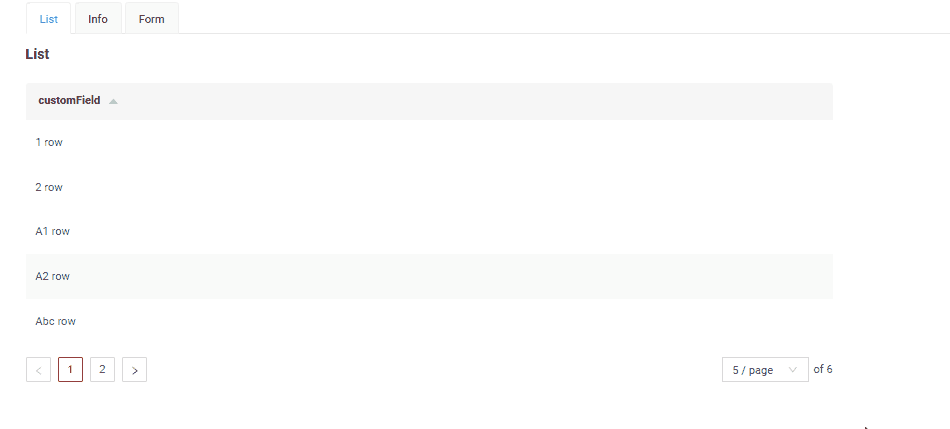

# Sorting
`Sorting` allows you to sort data in ascending or descending order.

This function is available:

* for widgets: [List](/widget/type/list/list), [GroupingHierarchy](/widget/type/groupinghierarchy/groupinghierarchy).
* for fields: See more [field types](/widget/fields/fieldtypes/) 
 
`Sorting` can be enabled in two ways:

*  [On the field](#on_field) Sorting must be enabled explicitly at the field level
* `Not recommended.`  [At the application level](#app-default-sort) Sorting is enabled by default for all fields in the application.

!!! info
    Sorting won't function until the page is refreshed after adding or updating records. 

### How does it look?


## <a id="on_field">On the field</a>
[:material-play-circle: Live Sample]({{ external_links.code_samples }}/ui/#/screen/InputSort){:target="_blank"} ·
[:fontawesome-brands-github: GitHub]({{ external_links.github_ui }}/{{ external_links.github_branch }}/src/main/java/org/demo/documentation/fields/input/sorting){:target="_blank"}

### How to add?
??? Example

    **Step 1**  Add `sort-enabled-default` = `false` in application.yml

    If the parameter is not set to true, sorting must be enabled explicitly at the field level.
    ```
        cxbox:
           widget:
               fields: 
                    sort-enabled-default: false
    ```

    **Step 2**  Add **fields.enableSort** to corresponding **FieldMetaBuilder**.
        ```java
        --8<--
        {{ external_links.github_raw_doc }}/fields/input/sorting/InputSortMeta.java:buildIndependentMeta
        --8<--
        ```

## <a id="app-default-sort">At the application level</a>
`Not recommended.`

If the parameter is set to true, sorting is enabled by default for all fields in the application.

### How to add?
 
??? Example
    Add `sort-enabled-default` in application.yml

      ```
        cxbox:
           widget:
               fields: 
                    sort-enabled-default: true
      ```