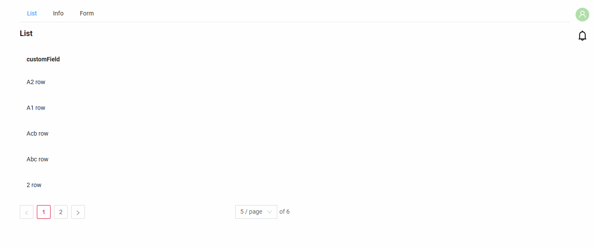

# Sorting
`Sorting` allows you to sort data in ascending or descending order.

This function is available:

* for widgets: [List](/widget/type/list/list), [GroupingHierarchy](/widget/type/groupinghierarchy/groupinghierarchy), [Tree](/widget/type/tree/tree), [AssocTreePopup](/widget/type/assoctreepopup/assoctreepopup), [PickTreePopup](/widget/type/picktreepopup/picktreepopup), [Column2D](/widget/type/column2d/column2d) (only in the table mode, see [Charts](#charts)).

* for fields: See more [field types](/widget/fields/fieldtypes/) 

!!! info
    For the tree widgets sorting works **inside a node**: the records are sorted among the children of the same parent, the hierarchy itself is not changed.
 
## Type sorting

`Sorting` can be enabled in two ways:

*  [On the field](#on_field) Sorting must be enabled explicitly at the field level
* `Not recommended.`  [At the application level](#app-default-sort) Sorting is enabled by default for all fields in the application.

!!! info
    Sorting won't function until the page is refreshed after adding or updating records. 

**Please pay attention to the sorting behavior:**

* If the user has not set a sorting option, the default sorting is applied if it is defined.
* If the user has applied a sorting option, it will be preserved when navigating via drill-down or between screens.

How does it look?


### <a id="on_field">On the field</a>
[:material-play-circle: Live Sample]({{ external_links.code_samples }}/ui/#/screen/InputSort){:target="_blank"} ·
[:fontawesome-brands-github: GitHub]({{ external_links.github_ui }}/{{ external_links.github_branch }}/src/main/java/org/demo/documentation/fields/input/sorting){:target="_blank"}

#### How to add?
??? Example

    **Step 1**  Add `sort-enabled-default` = `false` in application.yml

    If the parameter is not set to true, sorting must be enabled explicitly at the field level.
    ```
        cxbox:
           widget:
               fields: 
                    sort-enabled-default: false
    ```

    **Step 2**  Add **fields.enableSort** to corresponding **FieldMetaBuilder**.
        ```java
        --8<--
        {{ external_links.github_raw_doc }}/fields/input/sorting/InputSortMeta.java:buildIndependentMeta
        --8<--
        ```

### <a id="app-default-sort">At the application level</a>
`Not recommended.`

If the parameter is set to true, sorting is enabled by default for all fields in the application.

#### How to add?
 
??? Example
    Add `sort-enabled-default` in application.yml

      ```
        cxbox:
           widget:
               fields: 
                    sort-enabled-default: true
      ```


## <a id="default_sort">Default sorting</a>
If the parameter is set to true, sorting is enabled by default for all fields in the application.
 
 
### How to add?
??? Example

     Add  business component in **BC_PROPERTIES** TABLE

      BC - name business component
      PAGE_LIMIT - limit page default
      SORT - default sorting

      ```csv
      BC;PAGE_LIMIT;SORT;FILTER;ID
      dateSorting;1000;_sort.0.desc=customField;'""';
      ```

## <a id="charts">Charts</a>
Charts show the sorting only in the table mode. When the data of the chart come from an AnySource DAO, the DAO sorts the records itself.

### How to add?
??? Example
    === "Column2D widget"
        Works only in the [table mode](/widget/type/column2d/column2d/#tablemode) of the chart.
        After the switch back to the chart, the chart draws the records in the sorted order.

        **Step 1** Add **fields.enableSort** to corresponding **FieldMetaBuilder**.
        ```java
        --8<--
        {{ external_links.github_raw_doc }}/widgets/column2d/sorting/MyExample4271Meta.java:buildIndependentMeta
        --8<--
        ```

        **Step 2** Sort the records in **getList** of the AnySource DAO.
        ```java
        --8<--
        {{ external_links.github_raw_doc }}/widgets/column2d/sorting/MyExample4271Dao.java:getList
        --8<--
        ```

        [:material-play-circle: Live Sample]({{ external_links.code_samples }}/ui/#/screen/myexample4271){:target="_blank"} ·
        [:fontawesome-brands-github: GitHub]({{ external_links.github_ui }}/{{ external_links.github_branch }}/src/main/java/org/demo/documentation/widgets/column2d/sorting){:target="_blank"}
