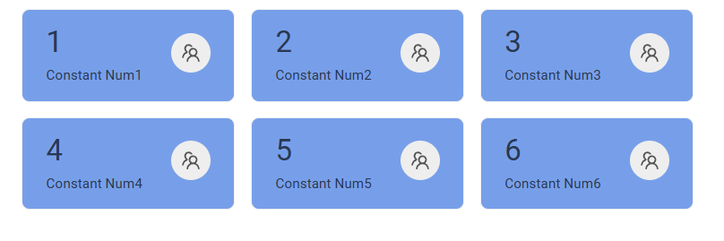
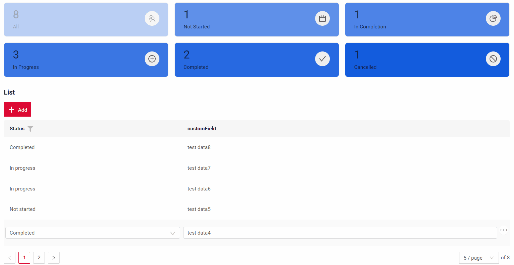

# Statistics blocks
`Statistics blocks`  widget is a  tool designed to display aggregated data in a visually accessible format. This data can be sourced either from a database or from external sources.

The current number of columns per row is set to 3.

## Basics
[:material-play-circle: Live Sample]({{ external_links.code_samples }}/ui/#/screen/myexample4203){:target="_blank"}
[:fontawesome-brands-github: GitHub]({{ external_links.github_ui }}/{{ external_links.github_branch }}/src/main/java/org/demo/documentation/widgets/statsblock/base/defaultfields){:target="_blank"}

### How does it look?

=== "With color" 
    
=== "Without color"
    

### How to add?
??? Example
    === "Default name fields" 
        You have the option to utilized default  field names for standard properties such as color, icon, etc. When doing so, you'll not need to establish mappings for these fields to standard criteria

        **Step1** Create **DataResponseDTO** with custom fields.

        ```java
        --8<--
        {{ external_links.github_raw_doc }}/widgets/statsblock/base/defaultfields/MyExample4203DTO.java
        --8<--
        ```
        **Step2**  Create **DAO** extends AbstractAnySourceBaseDAO<> implements AnySourceBaseDAO.

        [Title](#Title). Optional

        `Value` - field that specifies formulas for data aggregation

        [Icon](#Icon). Optional

        [Color](#Color). Optional

        `Description` - comment for field. Optional

        `Id` - We recommend assigning unique identifiers to each block. This is essential for the proper functioning of the application and for enabling drilldown.
          ```java
          --8<--
          {{ external_links.github_raw_doc }}/widgets/statsblock/base/defaultfields/MyExample4203Dao.java
          --8<--
          ```
          **Step3** Create **Meta** extends AnySourceFieldMetaBuilder.
          ```java
          --8<--
          {{ external_links.github_raw_doc }}/widgets/statsblock/base/defaultfields/MyExample4203Meta.java
          --8<--
          ```
          **Step4** Create **Service** extends AnySourceVersionAwareResponseService.
          ```java
          --8<--
          {{ external_links.github_raw_doc }}/widgets/statsblock/base/defaultfields/MyExample4203Service.java
          --8<--
          ```
 
          **Step5** Create **Widget** with  type **StatsBlock**
          !!! tips
              **fields**. We recommend including all fields used in the widget within this block. This maintains the principle of consistency in your application 
      
          ```json
          --8<--
          {{ external_links.github_raw_doc }}/widgets/statsblock/base/defaultfields/MyExample4203List.widget.json
          --8<--
          ```

        !!! tips
            To display statistical blocks on the same screen where data is added, you need to add **RefreshBC** property.

        [:material-play-circle: Live Sample]({{ external_links.code_samples }}/ui/#/screen/myexample4203){:target="_blank"}
        [:fontawesome-brands-github: GitHub]({{ external_links.github_ui }}/{{ external_links.github_branch }}/src/main/java/org/demo/documentation/widgets/statsblock/base/defaultfields){:target="_blank"}

    === "Custom name fields"
        You have the option to utilize custom field names for standard properties such as color, icon, etc. When doing so, you'll need to establish mappings for these fields to standard criteria

        **Step1** Create **DataResponseDTO** with custom fields. 
        ```java
        --8<--
        {{ external_links.github_raw_doc }}/widgets/statsblock/base/customfields/MyExample4200DTO.java
        --8<--
        ```    
        **Step2**  Create **DAO** extends AbstractAnySourceBaseDAO<> implements AnySourceBaseDAO.

        [Title](#Title). Optional

        Value - field that specifies formulas for data aggregation

        [Icon](#Icon). Optional

        [Color](#Color). Optional

        Description - comment for field. Optional

        Id - We recommend assigning unique identifiers to each block. This is essential for the proper functioning of the application and for enabling drilldown.
        
        ```java
        --8<--
        {{ external_links.github_raw_doc }}/widgets/statsblock/base/customfields/MyExample4200Dao.java
        --8<--
        ```
        **Step3** Create **Meta** extends AnySourceFieldMetaBuilder.
        ```java
        --8<--
        {{ external_links.github_raw_doc }}/widgets/statsblock/base/customfields/MyExample4200Meta.java
        --8<--
        ``` 
        **Step4** Create **Service** extends AnySourceVersionAwareResponseService.
        ```java
        --8<--
        {{ external_links.github_raw_doc }}/widgets/statsblock/base/customfields/MyExample4200Service.java
        --8<--
        ```
        **Step5** Create **Widget** with  type **StatsBlock** 
        !!! tips
            **fields**.We recommend including all fields used in the widget within this block. This maintains the principle of consistency in your application
            **options.stats** - This map how custom fields are matched to standard properties. 

        ```json
        --8<--
        {{ external_links.github_raw_doc }}/widgets/statsblock/base/customfields/MyExample4200List.widget.json
        --8<--
        ```

        !!! tips
            To display statistical blocks on the same screen where data is added, you need to add **RefreshBC** property.
 
        [:material-play-circle: Live Sample]({{ external_links.code_samples }}/ui/#/screen/myexample4200){:target="_blank"}
        [:fontawesome-brands-github: GitHub]({{ external_links.github_ui }}/{{ external_links.github_branch }}/src/main/java/org/demo/documentation/widgets/statsblock/base/customfields){:target="_blank"}


## Main visual parts
We can modify the following parameters on this widget:

* [Title](#Title). Optional
* Value - field that specifies formulas for data aggregation
* Description - comment for field. Optional

  
 
## <a id="Title">Title</a>
### Title Basic
Title - a name displayed in a block. It is optional.

[:material-play-circle: Live Sample]({{ external_links.code_samples }}/ui/#/screen/myexample4209){:target="_blank"} ·
[:fontawesome-brands-github: GitHub]({{ external_links.github_ui }}/{{ external_links.github_branch }}/src/main/java/org/demo/documentation/widgets/statsblock/title/withtitle){:target="_blank"}

There are types of:

* `constant title`: shows constant text.
* `constant title empty`.
 
#### How does it look?
=== "Constant title"
    
=== "Constant title empty"
    

#### How to add?
??? Example
    === "Constant title"
        **Step1** Add name for **title** to **_.widget.json_**.
        ```json
        --8<--
        {{ external_links.github_raw_doc }}/widgets/statsblock/title/withtitle/MyExample4226Stat.widget.json
        --8<--
        ```
 
    === "Constant title empty"
        **Step1** No use parameter **title** to **_.widget.json_**.
        ```json
        --8<--
        {{ external_links.github_raw_doc }}/widgets/statsblock/title/withouttitle/MyExample4225Stat.widget.json
        --8<--
        ```
### Title Color
_not applicable_

## <a id="bc">Business component</a>
This specifies the business component (BC) to which this form belongs.
A business component represents a specific part of a system that handles a particular business logic or data.

see more  [Business component](/environment/businesscomponent/businesscomponent/)

## <a id="Showcondition">Show condition</a>
_not applicable_

## <a id="bc">Fields</a>

## <a id="Fieldslayout">Options layout</a>
**options.layout** - no use in this type.

## Actions
`Actions` show available actions as separate buttons
see [Actions](/features/element/actions/actions)

 
## Additional properties

### <a id="Icon">Icon</a>
[:material-play-circle: Live Sample]({{ external_links.code_samples }}/ui/#/screen/myexample4215){:target="_blank"} ·
[:fontawesome-brands-github: GitHub]({{ external_links.github_ui }}/{{ external_links.github_branch }}/src/main/java/org/demo/documentation/widgets/statsblock/icon/withicon){:target="_blank"}

Icon - picture representing a particular function.Optional
<a id="standard_icons">Standard icons</a>
Cxbox-ui already includes this icon library.

[Ant Design icons](https://3x.ant.design/components/icon/)

There are types of:

* `icon`.
* `icon empty`.

 

#### How does it look?
=== "Icon"
    
=== "Icon empty"
    

#### How to add?
??? Example
    === "Icon"
        **Step1** Add name for **title** to **_.widget.json_**.
        ```json
        --8<--
        {{ external_links.github_raw_doc }}/widgets/statsblock/icon/withicon/MyExample4223Stat.widget.json
        --8<--
        ```

    === "Icon empty"
        **Step1** No use parameter **title** to **_.widget.json_**.
        ```json
        --8<--
        {{ external_links.github_raw_doc }}/widgets/statsblock/icon/withouticon/MyExample4224Stat.widget.json
        --8<--
        ```

### <a id="ColorField">Color</a>
`Color` allows you to specify a field block.Optional. It can be calculated based on business logic of application

**Calculated color**

[:material-play-circle: Live Sample]({{ external_links.code_samples }}/ui/#/screen/myexample4205){:target="_blank"} ·
[:fontawesome-brands-github: GitHub]({{ external_links.github_ui }}/{{ external_links.github_branch }}/src/main/java/org/demo/documentation/widgets/statsblock/color/color){:target="_blank"}

**Constant color**

[:material-play-circle: Live Sample]({{ external_links.code_samples }}/ui/#/screen/myexample4205){:target="_blank"} ·
[:fontawesome-brands-github: GitHub]({{ external_links.github_ui }}/{{ external_links.github_branch }}/src/main/java/org/demo/documentation/widgets/statsblock/color/colorconst){:target="_blank"}

#### How does it look?


#### How to add?
??? Example
    === "Calculated color"
        **Step 1**   Add `custom field for color` to corresponding **DataResponseDTO**. The field can contain a HEX color or be null.

        ```java
        --8<--
        {{ external_links.github_raw_doc }}/widgets/statsblock/color/color/MyExample4206DTO.java
        --8<--
        ```
  
        **Step 2** Add **"bgColorKey"** :  `custom field for color`  to .widget.json.
        ```json
        --8<--
        {{ external_links.github_raw_doc }}/widgets/statsblock/color/color/MyExample4206List.widget.json
        --8<--
        ```
  

    === "Constant color"
 
        Add **"bgColor"** :  `HEX color`  to .widget.json.
        ```json
        --8<--
        {{ external_links.github_raw_doc }}/widgets/statsblock/color/colorconst/MyExample4205List.widget.json
        --8<--
        ```

### <a id="Viewwidgetwidth">Widget size</a>
By default, we use the view gridWidth field to arrange widgets in a row, each occupying 1/3 of the given size. 
For example, if the row has a total width of 24 spans, each widget will take up 8 spans.

[:material-play-circle: Live Sample]({{ external_links.code_samples }}/ui/#/screen/myexample4228){:target="_blank"} ·
[:fontawesome-brands-github: GitHub]({{ external_links.github_ui }}/{{ external_links.github_branch }}/src/main/java/org/demo/documentation/widgets/statsblock/fieldslayoute){:target="_blank"}
  
#### How does it look?
=== "view gridWidth 24 - recommended"
    
=== "view gridWidth 12"
    
=== "view gridWidth 6"
    
#### How to add?
??? Example
    === "gridWidth24 - recommended"
        Change **gridWidth** = 24  to corresponding **view**
        ```json
        --8<--
        {{ external_links.github_raw_doc }}/widgets/statsblock/fieldslayoute/MyExample4228Stat.view.json
        --8<--
        ```

    === "gridWidth12"
        Change **gridWidth** = 12  to corresponding **view**
        ```json
        --8<--
        {{ external_links.github_raw_doc }}/widgets/statsblock/fieldslayoute/MyExample4228Stat12.view.json
        --8<--
        ``` 

    === "gridWidth6"
        Change **gridWidth** = 6  to corresponding **view**
        ```json
        --8<--
        {{ external_links.github_raw_doc }}/widgets/statsblock/fieldslayoute/MyExample4228Stat6.view.json
        --8<--
        ```
### Drilldown  
[:material-play-circle: Live Sample]({{ external_links.code_samples }}/ui/#/screen/myexample4208){:target="_blank"} ·
[:fontawesome-brands-github: GitHub]({{ external_links.github_ui }}/{{ external_links.github_branch }}/src/main/java/org/demo/documentation/widgets/statsblock/drilldown){:target="_blank"}

`DrillDown` allows you to navigate to another view by simply tapping on it. Target view and other drill-down parts can be calculated based on business logic of application

Also, it optionally allows you to filter data on target view before it will be opened `see more` [DrillDown](/features/element/drilldown/drilldown)

#### How does it look?


#### How to add?
??? Example
    **Option 1**  
    `Step 1` Add [fields.setDrilldown](/features/element/drilldown/drilldown) to corresponding **FieldMetaBuilder**.
    ```java
    --8<--
    {{ external_links.github_raw_doc }}/widgets/statsblock/drilldown/MyExample4210Meta.java:buildRowDependentMeta
    --8<--
    ```

    `Step 2` Add **"drillDown": "true"**  to .widget.json.
    ```json
    --8<--
    {{ external_links.github_raw_doc }}/widgets/statsblock/drilldown/MyExample4210List.widget.json
    --8<--
    ```

    **Option 2**
       Add **"drillDownKey"** :  `custom field`  to .widget.json. See more [Drilldown](/advancedCustomization_drillDown) 

 

### Highlighting Functionality

Added Highlighting Functionality for the Current Item (Tile)

**Parent-Child Hierarchy**: 

This approach implements a parent-child widget dependency, which introduces the following behavioral specifics:

1.  **Initialization and Cursor Focus**
    *   Upon screen opening, the cursor is automatically set to the first record in the dataset received by the parent widget.

2.  **Mandatory "All Records" Entry**
    *   For the filtering mechanism to function correctly, the parent widget **must** include a static "All Records" entry (or an equivalent item).
    *   **Purpose:** When this item is selected, the child table widget should display all available records without applying any filters based on the parent widget's selection. This entry should typically be the first item in the list and selected by default during initialization.

3.  **Restriction for Parent Widget (StatsBlock)**
    *   If the parent widget is a statistical block (StatsBlock), its configuration **must not** use drilldowns, as the navigational function is already handled by its linkage to the child widget.

 
#### How does it look?


#### How to add?
??? Example

    !!! info
        For the parent-child dependency to work, the IDs assigned to StatBlock widgets must be of type **long**.

    `Step 1` Add dependency parent/child  to corresponding **EnumBcIdentifier**.
    
    parent -> bc for StatsBlock

    ```java
    --8<--
    {{ external_links.github_raw_doc }}/widgets/statsblock/drilldown/parentchild/CxboxMyExample4216Controller.java:bc
    --8<--
    ```
 
    `Step 2` Add **getParentSpecification** to corresponding **ResponseService**.
     Add filtering based on the assigned IDs corresponding **Dao*.

    ```json
    --8<--
    {{ external_links.github_raw_doc }}/widgets/statsblock/drilldown/parentchild/data/MyExample4216Service.java:getParentSpecification
    --8<--
    ```
    `Step 2` Add **bcCursor** to corresponding **widget.json**.
    A new `bcCursor` option has been introduced to control the visual highlighting of the selected UI element.

    *   **`bcCursor: show`**
    When this option is enabled, the selected item is highlighted. Additionally, for parent items, the system automatically displays the child widgets associated with the selected tile.

    *   **`bcCursor: none`** (default value)
      Default mode. Visual highlighting of the active element is disabled. The interface behavior corresponds to the previous version.

    ```json
    --8<--
    {{ external_links.github_raw_doc }}/widgets/statsblock/drilldown/parentchild/example4127Stats.widget.json
    --8<--
    ```
#### Configuring selected item opacity

The transparency of the visual highlight for a selected widget element is controlled by the `selectedItemOpacity` constant.

**Location:**
`ui/src/components/widgets/StatsBlock/constants.ts`

**Current Value:**
`0.5` (50% opacity / 50% transparent)

#### Configuring number of columns
If needed, you can change this in the frontend component settings in StatsBlock.tsx using the grid prop. 

Example: grid={{ gutter: 16, sm: 3, column: 6 }} - which results in 3 columns.

**Location:**
`ui/src/components/widgets/StatsBlock/StatsBlock.tsx`

**Current Value:**
`3`  which results in 3 columns

[Advanced customization](/advancedCustomization_drillDown)