# Tree
 
Tree widget presents hierarchical records as an expandable tree, so users can browse parent and child rows in one table.

!!! info
    The following features are **not available** for the `Tree` widget in this release and are tracked in `CXBOX-1369`:

    * fully or partially expanded initial load (the tree always opens collapsed)
    * drag-and-drop of rows
    * export to Excel
    * create scope record

## Basics
[:material-play-circle: Live Sample]({{ external_links.code_samples }}/ui/#/screen/myexample3261){:target="_blank"} ·
[:fontawesome-brands-github: GitHub]({{ external_links.github_ui }}/{{ external_links.github_branch }}/src/main/java/org/demo/documentation/widgets/tree/base){:target="_blank"}

For the widget to work correctly, the following requirements must be met:

* **A parent-child relationship must be defined between the records**. Both standard fields and custom fields can be used, with the standard logic overridden if necessary.
* **A flag must be provided to determine whether the tree can be expanded further**. It indicates whether the current record is a leaf node or has child records.

The minimal data set of a tree record is:

* `id` — the identifier of the record.
* `parentId` — the identifier of the parent record. For a root record the value is `null`.
  The backend must **always** return this field, and the field must be **filterable**, because the tree is built with the requests `parentId.specified=false` (root records) and `parentId.equals=<id>` (child records). see more [Lazy load](#lazyload)
* a name (title) field — the value shown in the tree column.
* `isLeaf` — a computed boolean flag. The default value is `false`. The value `true` means that the record has no child records, so the expand arrow is not displayed for it.

!!! info
    The **first** field of the `fields` array is rendered as the tree column: the expand arrow, the indent of the nesting level and, for `AssocTreePopup`, the checkbox are placed in it (Ant Design Tree style). All the other fields are rendered as ordinary columns.

    `parentId` and `isLeaf` are service fields. They must be declared in the widget with type **hidden**.

### How does it look?
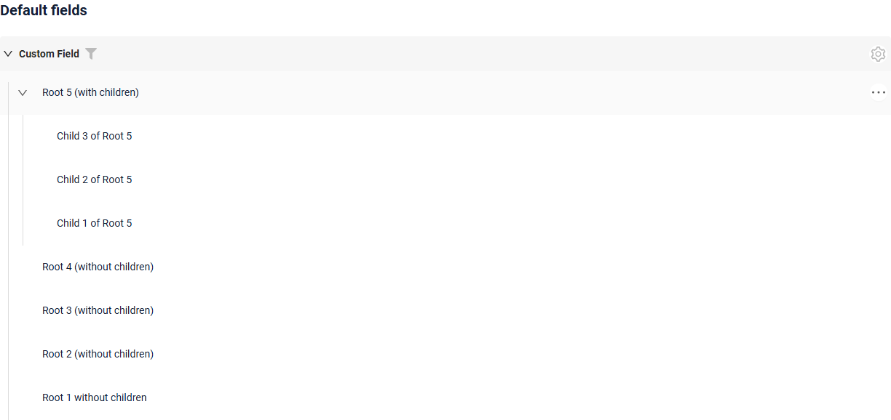

### How to add?
??? Example
    === "Default name fields"

        You have the option to utilized default  field names for standard properties such as parentId, isLeaf. When doing so, you'll not need to establish mappings for these fields to standard criteria

        **Step1** Create field `parentId`, `isLeaf` to corresponding **DataResponseDTO**.

        * `parentId` — identifies the parent record of the current record and defines the parent-child relationship in the tree. If the record is a root node, `parentId` must be empty.
        * `isLeaf` — indicates whether the record can be expanded. The value `true` means that the record cannot be expanded, while `false` means that the record can be expanded to display child records.

        ```java
        --8<--
        {{ external_links.github_raw_doc }}/widgets/tree/base/defaultfields/MyExample3281DTO.java
        --8<--
        ```
     
        **Step2** Create file **_.widget.json_** with type = **"Tree"**
    
        Add existing field to a tree widget. see more [Fields](#fields)
    
        For the tree to work correctly, the widget must contain the `parentId` and `isLeaf` fields. These fields should be configured as **hidden**.

        ```json
        --8<--
        {{ external_links.github_raw_doc }}/widgets/tree/base/defaultfields/widget/MyExample3281Tree.widget.json
        --8<--
        ```
        [:material-play-circle: Live Sample]({{ external_links.code_samples }}/ui/#/screen/myexample3261/view/myexample3281tree){:target="_blank"} ·
        [:fontawesome-brands-github: GitHub]({{ external_links.github_ui }}/{{ external_links.github_branch }}/src/main/java/org/demo/documentation/widgets/tree/base/defaultfields){:target="_blank"}

    === "Custom name fields"

        You have the option to utilize custom field names for standard properties. When doing so, you'll need to establish mappings for these fields to standard criteria

        **Step1** Create field `customParentId`, `customIsLeaf` to corresponding **DataResponseDTO**.

        * `customParentId` — identifies the parent record of the current record and defines the parent-child relationship in the tree. If the record is a root node, `parentId` must be empty.
        * `customIsLeaf` — indicates whether the record can be expanded. The value `true` means that the record cannot be expanded, while `false` means that the record can be expanded to display child records.

        ```java
        --8<--
        {{ external_links.github_raw_doc }}/widgets/tree/base/customfields/MyExample3278DTO.java
        --8<--
        ```
     
        **Step2** Create file **_.widget.json_** with type = **"Tree"**
    
        Add existing field to a tree widget. see more [Fields](#fields)
    
        For the tree to work correctly, the widget must contain the `customParentId` and `customIsLeaf` fields. These fields should be configured as **hidden**.

        ```json
        --8<--
        {{ external_links.github_raw_doc }}/widgets/tree/base/customfields/widget/MyExample3278Tree.widget.json
        --8<--
        ```
        [:material-play-circle: Live Sample]({{ external_links.code_samples }}/ui/#/screen/myexample3261/view/myexample3278tree){:target="_blank"} ·
        [:fontawesome-brands-github: GitHub]({{ external_links.github_ui }}/{{ external_links.github_branch }}/src/main/java/org/demo/documentation/widgets/tree/base/customfields){:target="_blank"}

## Title
[:material-play-circle: Live Sample]({{ external_links.code_samples }}/ui/#/screen/myexample3271){:target="_blank"} ·
[:fontawesome-brands-github: GitHub]({{ external_links.github_ui }}/{{ external_links.github_branch }}/src/main/java/org/demo/documentation/widgets/tree/title){:target="_blank"}

### Title Basic
`Title` for widget (optional)

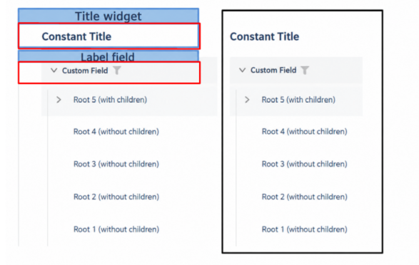    

There are types of:

* `constant title`: shows constant text.
* `constant title empty`: if you want to visually connect widgets by  them to be placed one under another
 
#### How does it look?
=== "Constant title"
    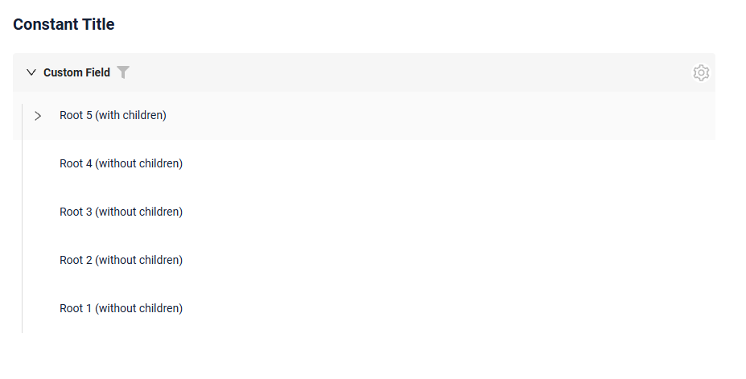
=== "Constant title empty"
    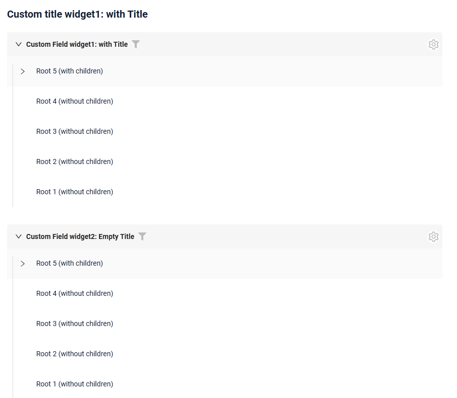
 
#### How to add?
??? Example
    === "Constant title"
        **Step1** Add name for **title** to **_.widget.json_**.
        ```json
        --8<--
        {{ external_links.github_raw_doc }}/widgets/tree/title/widget/MyExample3271Tree.widget.json
        --8<--
        ```
        [:material-play-circle: Live Sample]({{ external_links.code_samples }}/ui/#/screen/myexample3271){:target="_blank"} ·
        [:fontawesome-brands-github: GitHub]({{ external_links.github_ui }}/{{ external_links.github_branch }}/src/main/java/org/demo/documentation/widgets/tree/title){:target="_blank"}


    === "Constant title empty"

        **Step1** Delete parameter **title** to **_.widget.json_**.
        ```json
        --8<--
        {{ external_links.github_raw_doc }}/widgets/tree/title/widget/MyExample3271EmptyTitle.widget.json
        --8<--
        ```

        [:material-play-circle: Live Sample]({{ external_links.code_samples }}/ui/#/screen/myexample3271/view/myexample3271emtytitle){:target="_blank"} ·
        [:fontawesome-brands-github: GitHub]({{ external_links.github_ui }}/{{ external_links.github_branch }}/src/main/java/org/demo/documentation/widgets/tree/title){:target="_blank"}


### Title Color
`Title Color` allows you to specify a color for a title. It can be constant or calculated.

**Constant color**

[:material-play-circle: Live Sample]({{ external_links.code_samples }}/ui/#/screen/myexample3267/view/myexample3267listcolorconst){:target="_blank"} ·
[:fontawesome-brands-github: GitHub]({{ external_links.github_ui }}/{{ external_links.github_branch }}/src/main/java/org/demo/documentation/widgets/tree/colortitle){:target="_blank"}

*Constant color* is a fixed color that doesn't change. It remains the same regardless of any factors in the application.

**Calculated color**

[:material-play-circle: Live Sample]({{ external_links.code_samples }}/ui/#/screen/myexample3267/view/myexample3267tree){:target="_blank"} ·
[:fontawesome-brands-github: GitHub]({{ external_links.github_ui }}/{{ external_links.github_branch }}/src/main/java/org/demo/documentation/widgets/tree/colortitle){:target="_blank"}

*Calculated color* can be used to change a title color dynamically. It changes depending on business logic or data in the application.

!!! info
    Title colorization is **applicable** to the following [fields](/widget/fields/fieldtypes/): date, dateTime, dateTimeWithSeconds, number, money, percent, time, input, text, dictionary, radio, checkbox, multivalue, multivalueHover.

##### How does it look?
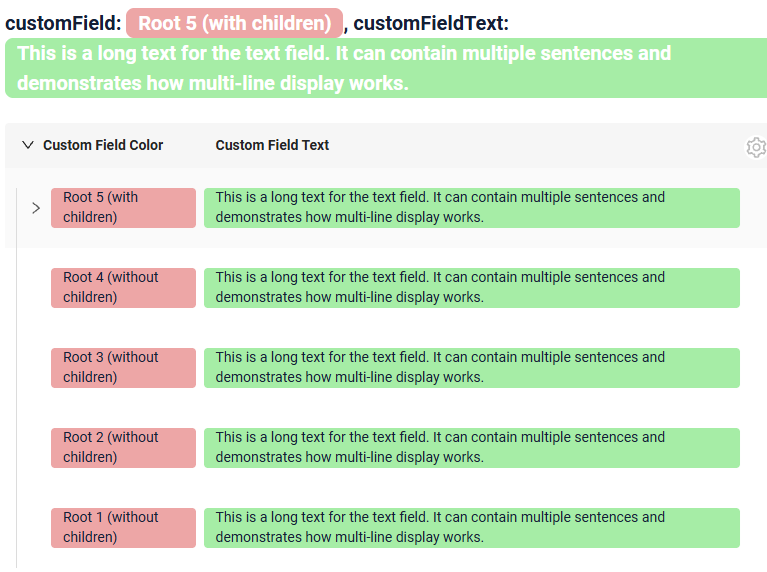

##### How to add?
??? Example
    === "Calculated color"

        **Step 1**   Add `custom field for color` to corresponding **DataResponseDTO**. The field can contain a HEX color or be null.
        ```java
        --8<--
        {{ external_links.github_raw_doc }}/widgets/tree/colortitle/MyExample3267DTO.java:colorDTO
        --8<--
        ```  
 
        **Step 2** Add **"bgColorKey"** :  `custom field for color` and  to .widget.json.

        Add in `title` field with `${customField}` 

        ```json
        --8<--
        {{ external_links.github_raw_doc }}/widgets/tree/colortitle/widget/MyExample3267.widget.json
        --8<--
        ``` 

        [:material-play-circle: Live Sample]({{ external_links.code_samples }}/ui/#/screen/myexample3267/view/myexample3267tree){:target="_blank"} ·
        [:fontawesome-brands-github: GitHub]({{ external_links.github_ui }}/{{ external_links.github_branch }}/src/main/java/org/demo/documentation/widgets/tree/colortitle){:target="_blank"}

    === "Constant color"
 
        Add **"bgColor"** :  `HEX color`  to .widget.json.

        Add in `title` field with `${customField}` 

        ```json
        --8<--
        {{ external_links.github_raw_doc }}/widgets/tree/colortitle/widget/MyExample3267ColorConst.widget.json
        --8<--
        ```

        [:material-play-circle: Live Sample]({{ external_links.code_samples }}/ui/#/screen/myexample3267/view/myexample3267listcolorconst){:target="_blank"} ·
        [:fontawesome-brands-github: GitHub]({{ external_links.github_ui }}/{{ external_links.github_branch }}/src/main/java/org/demo/documentation/widgets/tree/colortitle){:target="_blank"}

## <a id="bc">Business component</a>
This specifies the business component (BC) to which this form belongs.
A business component represents a specific part of a system that handles a particular business logic or data.

see more  [Business component](/environment/businesscomponent/businesscomponent/)

## <a id="Showcondition">Show condition</a>

[:material-play-circle: Live Sample]({{ external_links.code_samples }}/ui/#/screen/myexample3261){:target="_blank"} ·
[:fontawesome-brands-github: GitHub]({{ external_links.github_ui }}/{{ external_links.github_branch }}/src/main/java/org/demo/documentation/widgets/tree/base){:target="_blank"}

* `no show condition - recommended`: widget always visible

  [:material-play-circle: Live Sample]({{ external_links.code_samples }}/ui/#/screen/myexample3269){:target="_blank"} ·
  [:fontawesome-brands-github: GitHub]({{ external_links.github_ui }}/{{ external_links.github_branch }}/src/main/java/org/demo/documentation/widgets/tree/showcondition/bycurrententity){:target="_blank"}

* `show condition by current entity`: condition can include boolean expression depending on current entity fields. Field updates will trigger condition recalculation only on save or if field is force active

<!--
  [:material-play-circle: Live Sample]({{ external_links.code_samples }}/ui/#/screen/myexample3269/view/myexample3276showcond){:target="_blank"} ·
  [:fontawesome-brands-github: GitHub]({{ external_links.github_ui }}/{{ external_links.github_branch }}/src/main/java/org/demo/documentation/widgets/tree/showcondition/byparententity){:target="_blank"}
 
* `show condition by parent entity`: condition can include boolean expression depending on parent entity. Parent field updates will trigger condition recalculation only on save or if field is force active shown on same view
-->
!!! tips
    It is recommended not to use `Show condition` when possible, because wide usage of this feature makes application hard to support.

#### <a id="howdoesitlook">How does it look?</a>
=== "no show condition"
    
=== "show condition by current entity"
    <video controls width="800">
    <source src="/widget/type/tree/show_cond_current.mp4" type="video/mp4">
    </video>

<!--
=== "show condition by parent entity"
    
-->

#### <a id="howtoadd">How to add?</a>
??? Example

    === "no show condition"
        see [Basic](#Howtoaddbacis)

    === "show condition by current entity"
        **Step1** Add **showCondition** to **_.widget.json_**. see more [showCondition](/widget/type/property/showcondition/showcondition)
        ```json
        --8<--
        {{ external_links.github_raw_doc }}/widgets/tree/showcondition/bycurrententity/MyExample32692.widget.json
        --8<--
        ```
<!--
    === "show condition by parent entity"
        **Step1** Add **showCondition** to **_.widget.json_**. see more [showCondition](/widget/type/property/showcondition/showcondition)
        ```json
        --8<--
        {{ external_links.github_raw_doc }}/widgets/tree/showcondition/byparententity/MyExample3277child.widget.json
        --8<--
        ```
-->

## <a id="fields">Fields</a>
Fields Configuration. The fields array defines the individual fields present within the form.

```json
{
    "title": "Custom Field",
    "key": "customField",
    "type": "input"
}
```

* **"title"**

  Description:  Field Title.
  
  Type: String(optional).
  
* **"key"**
  
    Description: Name field to corresponding DataResponseDTO.
  
    Type: String(required).
  
* **"type"**
  
  Description: [Field types](/widget/fields/fieldtypes/)
  
  Type: String(required).


### How to add?
??? Example

    === "With plugin(recommended)"
        **Step 1** Download plugin
            [download Intellij Plugin](https://document.cxbox.org/plugin/plugininstalling)
    
        **Step 2** Add existing field to an existing form widget
            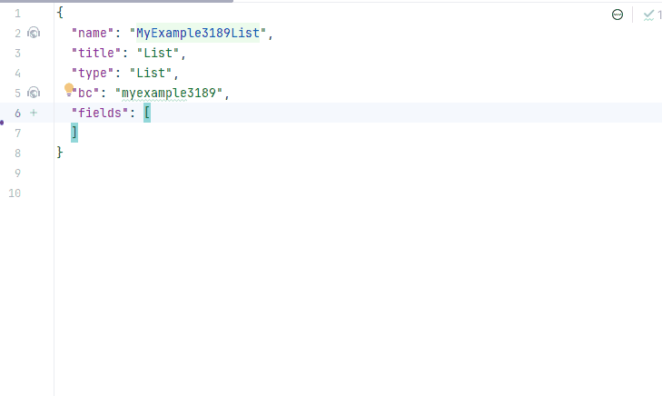
    === "Example of writing code"
        Add field to **_.widget.json_**.

          ```json
             --8<--
             {{ external_links.github_raw_doc }}/widgets/tree/title/widget/MyExample3271Tree.widget.json
             --8<--
          ```

## <a id="Fieldslayout">Options layout</a>
**options.layout** - no use in this type.


## <a id="actions">Actions</a>
`Actions` show available actions as separate buttons see more [Actions](/features/element/actions/actions).

As for Tree widget, there are several actions. They are configured exactly like the actions of a [List widget](/widget/type/list/list): the same `create`, `edit`, `save`, `cancel-create`, `delete` actions and the same three ways of creating and editing a record — inline, inline-form and with view.

#### Create 
`Create` button enables you to create a new value by clicking the `Add` button. This action can be performed in three different ways, feel free to choose any, depending on your logic of application:   

There are three methods to create a record:

* [Inline](#createinline): You can add a line directly.

!!! info
    Pagination won't function until the page is refreshed after adding records.

* [Inline-form](#withwidget): You can add data using a form widget without leaving your current view.

* [With view](#withview): You can create a record by navigating to a view.

##### <a id="createinline">Inline</a>
[:material-play-circle: Live Sample]({{ external_links.code_samples }}/ui/#/screen/myexample3265/view/myexample3265tree){:target="_blank"} ·
[:fontawesome-brands-github: GitHub]({{ external_links.github_ui }}/{{ external_links.github_branch }}/src/main/java/org/demo/documentation/widgets/tree/actions/create/basic){:target="_blank"}

With `Line Addition`, a new empty row is immediately added to the top of the tree widget when the "Add" button is clicked. This is a quick way to add rows without needing to input data beforehand.
###### How does it look?
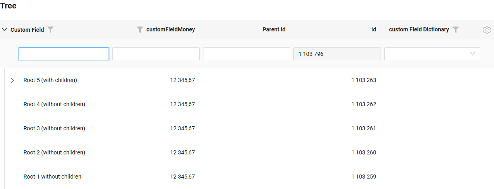

###### How to add?
??? Example
    
    **Step1** Add button `create` to corresponding **VersionAwareResponseService**. 
    ```java
    --8<--
    {{ external_links.github_raw_doc }}/widgets/tree/actions/create/basic/MyExample3265Service.java:getActions
    --8<--
    ```
     **Step2** Add button `create` to corresponding **.widget.json**. 
    ```json
    --8<--
    {{ external_links.github_raw_doc }}/widgets/tree/actions/create/basic/MyExample3265Tree.widget.json
    --8<--
    ```
     **Step3** Add **fields.setEnabled** to corresponding **FieldMetaBuilder**.
    ```java
    --8<--
    {{ external_links.github_raw_doc }}/widgets/tree/actions/create/basic/MyExample3265Meta.java:buildRowDependentMeta
    --8<--
    ```
    [:material-play-circle: Live Sample]({{ external_links.code_samples }}/ui/#/screen/myexample3265/view/myexample3265tree){:target="_blank"} ·
    [:fontawesome-brands-github: GitHub]({{ external_links.github_ui }}/{{ external_links.github_branch }}/src/main/java/org/demo/documentation/widgets/tree/actions/create/basic){:target="_blank"}

##### <a id="withwidget">Inline-form</a> 
[:material-play-circle: Live Sample]({{ external_links.code_samples }}/ui/#/screen/myexample3265/view/myexample3279tree){:target="_blank"} ·
[:fontawesome-brands-github: GitHub]({{ external_links.github_ui }}/{{ external_links.github_branch }}/src/main/java/org/demo/documentation/widgets/tree/actions/create/withwidget){:target="_blank"}

`Create with widget` opens an additional widget when the "Add" button is clicked. The form will appear on the same screen, allowing you to view both the tree of entities and the form for adding a new row. 
After filling the information in and clicking "Save", the new row is added to the Tree. 
###### How does it look?
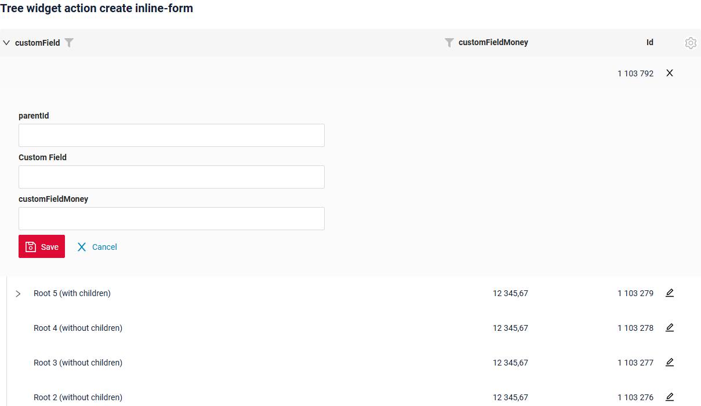

###### How to add?
??? Example

    **Step1** Add button `create` to corresponding **VersionAwareResponseService**. 
    ```java
    --8<--
    {{ external_links.github_raw_doc }}/widgets/tree/actions/create/withwidget/MyExample3279Service.java:getActions
    --8<--
    ```
    **Step2** Add **fields.setEnabled** to corresponding **FieldMetaBuilder**.
    ```java
    --8<--
    {{ external_links.github_raw_doc }}/widgets/tree/actions/create/withwidget/MyExample3279Meta.java:buildRowDependentMeta
    --8<--
    ```

     **Step3** Create widget.json with type `Form` that appears when you click a button
    ```json
    --8<--
    {{ external_links.github_raw_doc }}/widgets/tree/actions/create/withwidget/myEntity3279CreateForm.widget.json
    --8<--
    ```
 
     **Step4** Add widget.json with type `Form` to corresponding **.view.json**. 
    ```json
    --8<--
    {{ external_links.github_raw_doc }}/widgets/tree/actions/create/withwidget/myexample3279tree.view.json
    --8<--
    ```

     **Step5** Add button `create` and widget with type `Form` to corresponding **.widget.json**.
       
    `options`.`create`: Name widget that appears when you click a button
        
    ```json
    --8<--
    {{ external_links.github_raw_doc }}/widgets/tree/actions/create/withwidget/MyExample3279Tree.widget.json
    --8<--
    ```

    [:material-play-circle: Live Sample]({{ external_links.code_samples }}/ui/#/screen/myexample3265/view/myexample3279tree){:target="_blank"} ·
    [:fontawesome-brands-github: GitHub]({{ external_links.github_ui }}/{{ external_links.github_branch }}/src/main/java/org/demo/documentation/widgets/tree/actions/create/withwidget){:target="_blank"}

##### <a id="withview">With view</a>
[:material-play-circle: Live Sample]({{ external_links.code_samples }}/ui/#/screen/myexample3265/view/myexample3266tree){:target="_blank"} ·
[:fontawesome-brands-github: GitHub]({{ external_links.github_ui }}/{{ external_links.github_branch }}/src/main/java/org/demo/documentation/widgets/tree/actions/create/newview){:target="_blank"}

With `Create with view`, clicking the "Add" button opens a separate view that displays only the data entry form. After completing the form and saving, the system returns to the tree of entities with the new row added. 
###### How does it look? 
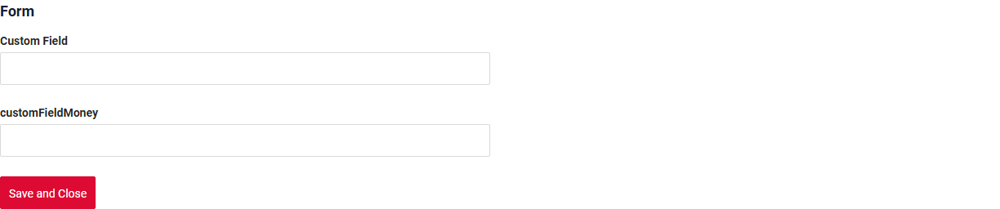

###### How to add?
??? Example

    **Step1** Add button `create` to corresponding **VersionAwareResponseService**. 
    ```java
    --8<--
    {{ external_links.github_raw_doc }}/widgets/tree/actions/create/newview/MyExample3266Service.java:getActions
    --8<--
    ```
     **Step2** Add **PostAction.drillDown** to method **doCreateEntity** to corresponding **VersionAwareResponseService**. 
    ```java
    --8<--
    {{ external_links.github_raw_doc }}/widgets/tree/actions/create/newview/MyExample3266Service.java:doCreateEntity
    --8<--
    ```
    **Step4** Add button `create` to corresponding **.widget.json**.
  
    ```json
    --8<--
    {{ external_links.github_raw_doc }}/widgets/tree/actions/create/newview/MyExample3266Tree.widget.json
    --8<--
    ```

    [:material-play-circle: Live Sample]({{ external_links.code_samples }}/ui/#/screen/myexample3265/view/myexample3266tree){:target="_blank"} ·
    [:fontawesome-brands-github: GitHub]({{ external_links.github_ui }}/{{ external_links.github_branch }}/src/main/java/org/demo/documentation/widgets/tree/actions/create/newview){:target="_blank"}


#### Edit 
`Edit` enables you to change the field value. Just like with `Create` button, there are three ways of implementing this Action. 

There are three methods to create a record:

* [Inline edit](#editline): You can edit a line directly.

* [Inline-form](#editwithwidget): You can edit data using a form widget without leaving your current view.

* [With view](#editwithview): You can edit a record by navigating to a view.

##### <a id="editline">Inline edit </a>
[:material-play-circle: Live Sample]({{ external_links.code_samples }}/ui/#/screen/myexample3265/view/myexample3273tree){:target="_blank"} ·
[:fontawesome-brands-github: GitHub]({{ external_links.github_ui }}/{{ external_links.github_branch }}/src/main/java/org/demo/documentation/widgets/tree/actions/edit/basic){:target="_blank"}


`Edit Inline` implies inline-edit. Click twice on the value you want to change.
###### How does it look?
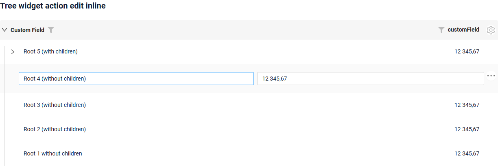

###### How to add?
??? Example

    **Step1** Add **fields.setEnabled** to corresponding **FieldMetaBuilder**.
    ```java
    --8<--
    {{ external_links.github_raw_doc }}/widgets/tree/actions/edit/basic/MyExample3273Meta.java:buildRowDependentMeta
    --8<--
    ```
 
    [:material-play-circle: Live Sample]({{ external_links.code_samples }}/ui/#/screen/myexample3265/view/myexample3273tree){:target="_blank"} ·
    [:fontawesome-brands-github: GitHub]({{ external_links.github_ui }}/{{ external_links.github_branch }}/src/main/java/org/demo/documentation/widgets/tree/actions/edit/basic){:target="_blank"}

##### <a id="editwithwidger">Inline-form</a>
[:material-play-circle: Live Sample]({{ external_links.code_samples }}/ui/#/screen/myexample3265/view/myexample3275tree){:target="_blank"} ·
[:fontawesome-brands-github: GitHub]({{ external_links.github_ui }}/{{ external_links.github_branch }}/src/main/java/org/demo/documentation/widgets/tree/actions/edit/withwidget){:target="_blank"}

`Edit with widget` opens an additional widget when clicking on the Edit option from a three-dot menu. 

###### How does it look?
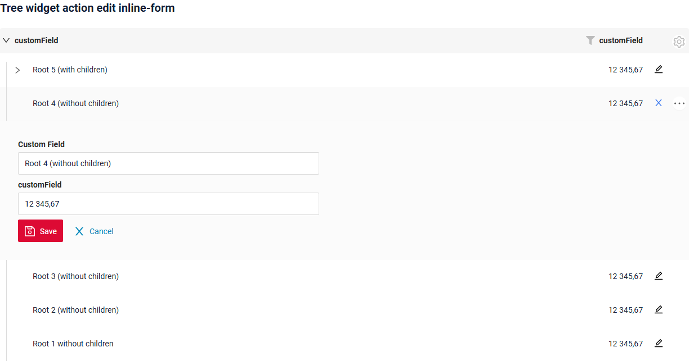

###### How to add?
??? Example

    **Step1** Add button `edit` to corresponding **VersionAwareResponseService**.
    ```java
    --8<--
    {{ external_links.github_raw_doc }}/widgets/tree/actions/edit/withwidget/MyExample3275Service.java:getActions
    --8<--
    ```

    **Step2** Add **fields.setEnabled** to corresponding **FieldMetaBuilder**.
    ```java
    --8<--
    {{ external_links.github_raw_doc }}/widgets/tree/actions/edit/withwidget/MyExample3275Meta.java:buildRowDependentMeta
    --8<--
    ```
 
    **Step2**  Create widget.json with type `Form` that appears when you click a button
    ```json
    --8<--
    {{ external_links.github_raw_doc }}/widgets/tree/actions/edit/withwidget/myEntity3275EditForm.widget.json
    --8<--
    ```
 
     **Step4** Add widget.json with type `Form` to corresponding **.view.json**. 
    ```json
    --8<--
    {{ external_links.github_raw_doc }}/widgets/tree/actions/edit/withwidget/myexample3275tree.view.json
    --8<--
    ```

     **Step5** Add button `edit` and widget with type `Form` to corresponding **.widget.json**.
       
    `options`.`edit`: Name widget that appears when you click a button
        
    ```json
    --8<--
    {{ external_links.github_raw_doc }}/widgets/tree/actions/edit/withwidget/MyExample3275Tree.widget.json
    --8<--
    ```

    [:material-play-circle: Live Sample]({{ external_links.code_samples }}/ui/#/screen/myexample3265/view/myexample3275tree){:target="_blank"} ·
    [:fontawesome-brands-github: GitHub]({{ external_links.github_ui }}/{{ external_links.github_branch }}/src/main/java/org/demo/documentation/widgets/tree/actions/edit/withwidget){:target="_blank"}

##### <a id="editwithview">With view</a>
[:material-play-circle: Live Sample]({{ external_links.code_samples }}/ui/#/screen/myexample3265/view/myexample3274tree){:target="_blank"} ·
[:fontawesome-brands-github: GitHub]({{ external_links.github_ui }}/{{ external_links.github_branch }}/src/main/java/org/demo/documentation/widgets/tree/actions/edit/newview){:target="_blank"}

With `Edit with view`, you can edit the entity from a separate view that displays only the data entry form. Click on the "Edit" option in the three-dot menu.  

###### How does it look? 
<!-- TODO screenshot -->

###### How to add?
??? Example

    **Step1** Add action *edit* to corresponding **VersionAwareResponseService**. 
    
    Add **PostAction.drillDown** to method *edit*

    ```java
    --8<--
    {{ external_links.github_raw_doc }}/widgets/tree/actions/edit/newview/MyExample3274Service.java:getActions
    --8<--
    ```
    **Step2** Add button ot group button to corresponding **.widget.json**.
   
    ```json
    --8<--
    {{ external_links.github_raw_doc }}/widgets/tree/actions/edit/newview/MyExample3274Tree.widget.json
    --8<--
    ```
    [:material-play-circle: Live Sample]({{ external_links.code_samples }}/ui/#/screen/myexample3265/view/myexample3274tree){:target="_blank"} ·
    [:fontawesome-brands-github: GitHub]({{ external_links.github_ui }}/{{ external_links.github_branch }}/src/main/java/org/demo/documentation/widgets/tree/actions/edit/newview){:target="_blank"}


### Additional properties

#### Customization of displayed columns
[:material-play-circle: Live Sample]({{ external_links.code_samples }}/ui/#/screen/myexample3268){:target="_blank"} ·
[:fontawesome-brands-github: GitHub]({{ external_links.github_ui }}/{{ external_links.github_branch }}/src/main/java/org/demo/documentation/widgets/tree/customizationcolumns){:target="_blank"}
 
To customize the columns displayed on a tree widget, you can perform two main actions:

* Hide columns
* Swap columns
 
!!! info
    Currently, table customization data is stored within internal tables, even when microservices are used.

###### Basic
When customizing columns, records are inserted into the ADDITIONAL_FIELDS table.
Table *ADDITIONAL_FIELDS* for store user-specific settings:

 * `user_id`:  The user ID for which the columns are being customized. 
 * `view`: The name of the view where the columns are customized.
 * `widget`: The name of the widget where the columns are customized.
 * `order_fields`: When configuring swap columns, the field sequence will be updated, and a new comma-separated sequence of fields will be saved.
 * `added_to_additional_fields`: User-hidden fields.
 * `removed_from_additional_fields`: Contains a list of fields that were initially hidden for the user but were later made visible.
   When the user opens a widget and chooses to display fields that were previously hidden, those fields are recorded in this column.

###### How does it look?
=== "Hide columns"
    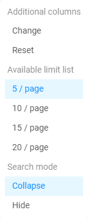
=== "Swap columns"
    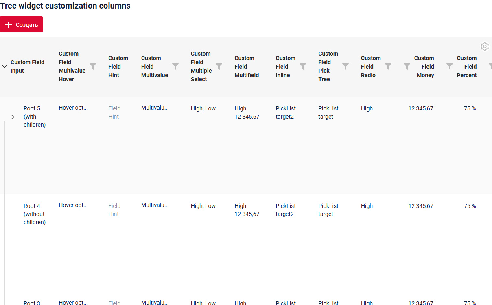
=== "Pre-hidden"
    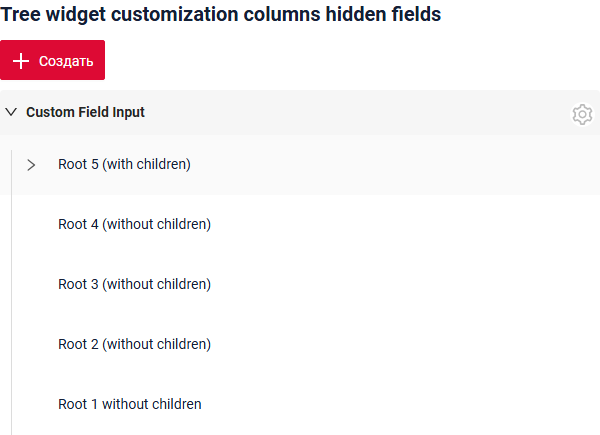

###### How to add?
??? Example
    === "Hide and Swap columns"
    
        Add in **options** parameter **additional** to corresponding **.widget.json**.
            
        ```
        "additional": {
          "enabled": true
        }
        ```
        
        ```json
        --8<--
        {{ external_links.github_raw_doc }}/widgets/tree/customizationcolumns/widget/MyExample3268Tree.widget.json
        --8<--
        ```
        
        [:material-play-circle: Live Sample]({{ external_links.code_samples }}/ui/#/screen/myexample3268){:target="_blank"} ·
        [:fontawesome-brands-github: GitHub]({{ external_links.github_ui }}/{{ external_links.github_branch }}/src/main/java/org/demo/documentation/widgets/tree/customizationcolumns){:target="_blank"}
        

    === "Pre-hidden columns"
        
        Сan also set columns to be pre-hidden, meaning they will be hidden when the widget opens.
        
        Add in **options** parameter **additional** to corresponding **.widget.json**.
        
        Add in **options** parameter **fields** with list of hidden fields  to corresponding **.widget.json**.
            
        ```
           "additional": {
              "fields": ["customFieldPercent", "customFieldRadio"],
              "enabled": true
            }
        ```
        
        ```json
        --8<--
        {{ external_links.github_raw_doc }}/widgets/tree/customizationcolumns/widget/MyExample3268TreeHiddenFields.widget.json
        --8<--
        ```
        
        [:material-play-circle: Live Sample]({{ external_links.code_samples }}/ui/#/screen/myexample3268/view/myexample3268listhidden){:target="_blank"} ·
        [:fontawesome-brands-github: GitHub]({{ external_links.github_ui }}/{{ external_links.github_branch }}/src/main/java/org/demo/documentation/widgets/tree/customizationcolumns){:target="_blank"}

###### Handling Old Records
`Delete fields with widget`

When fields stored in the additional settings table are deleted from the widget, the functionality will continue to work correctly by ignoring these old fields.
#### Filtration
##### Basic
see more  [Fields](/widget/type/property/filtration/filtration/)

Filtration of a Tree widget is a standard request. The rows that match the filter are returned by the backend without any hierarchy, and the widget decides how to display them, see [Search modes](#searchmodes).

The panel above the tree shows:

* `Clear N filter(s)` — the number of applied filters and the possibility to reset them;
* `Shown N` — how many found records are currently displayed;
* `More M` — how many found records are not displayed yet, where `M` is the number of found records minus the number of shown records.

!!! info
    With the pagination mode `nextAndPreviousWithCount` the `/count` request is **not** performed after filtration. Instead of the number of found records an `i` icon is displayed with the tooltip **"Load more and show count"**.

#### FullTextSearch
`FullTextSearch` - when the user types in the full text search input area, then widget filters the rows that match the search query.
see [FullTextSearch](/widget/type/property/filtration/filtration/#by-fulltextsearch)

The result of a full text search is displayed in the same way as the result of filtration, see [Search modes](#searchmodes).
##### Personal filter group
A user-filled filter can be saved for each individual user.
see [Personal filter group](/widget/type/property/filtration/filtration/#by-personal-filter-group)

[:material-play-circle: Live Sample]({{ external_links.code_samples }}/ui/#/screen/myexample3616/view/myexample3618tree){:target="_blank"} ·
[:fontawesome-brands-github: GitHub]({{ external_links.github_ui }}/{{ external_links.github_branch }}/src/main/java/org/demo/documentation/widgets/property/filtration/filtergroupsave){:target="_blank"}
##### Filter group
`Filter group` - predefined filters settings that users can use in an application. They allow users to quickly apply specific filtering criteria without having to manually input.
see [Filter group](/widget/type/property/filtration/filtration/#by-filter-group)

[:material-play-circle: Live Sample]({{ external_links.code_samples }}/ui/#/screen/myexample3616/view/myexample3616tree){:target="_blank"} ·
[:fontawesome-brands-github: GitHub]({{ external_links.github_ui }}/{{ external_links.github_branch }}/src/main/java/org/demo/documentation/widgets/property/filtration/filtergroup){:target="_blank"}
#### <a id="pagination">Pagination</a>
`Pagination` is the process of dividing content into separate, discrete pages, making it easier to navigate and consume large amounts of information.
see [Pagination](/widget/type/property/pagination/pagination)

Every node of the tree keeps **its own pagination state**, so the records of one node are loaded independently of the neighbouring nodes. How many records are loaded at once for a node is defined by the page limit, see [Page limit](/widget/type/property/defaultlimitpage/defaultlimitpage)
([:material-play-circle: Live Sample]({{ external_links.code_samples }}/ui/#/screen/myexample359/view/myexample359tree){:target="_blank"} ·
[:fontawesome-brands-github: GitHub]({{ external_links.github_ui }}/{{ external_links.github_branch }}/src/main/java/org/demo/documentation/widgets/property/defaultlimitpage){:target="_blank"}).

#### Export to Excel
`Export to Excel` enables users to download a .xlsx file containing the table's data.
see [Excel](/widget/type/property/export/excel/excel)

!!! info
    Export to Excel is **not available** for the `Tree` widget in this release, see `CXBOX-1369`.

#### Multi-upload files
We have implemented multi-file upload. You can use a dedicated drag-and-drop zone or a standard button to select your files.

see more [Multi-upload files](/widget/type/property/multiupload/multiupload)

#### <a id="optionstree">options.tree</a>
All tree specific settings are placed in **options**.**tree** of **_.widget.json_**.

| Property                 | Type                                            | Default                  | Description                                                                                                       |
|--------------------------|-------------------------------------------------|--------------------------|-------------------------------------------------------------------------------------------------------------------|
| `parentIdFieldKey`       | String                                          | `parentId`               | Name of the field that holds the identifier of the parent record.                                                   |
| `isLeafFieldKey`         | String                                          | `isLeaf`                 | Name of the field that holds the flag "the record has no child records".                                             |
| `searchModes`            | Array of `collapse`, `hide`                     | `["collapse", "hide"]`   | Modes of displaying the filtration result. The first item of the array is the active one. see [Search modes](#searchmodes) |
| `onFilterApplyNestLevel` | Number                                          | `0`                      | How many levels of the navigation path are shown above a found record in `collapse` mode. see [Search modes](#searchmodes) |
| `insertPosition`         | `start`, `end`                                  | —                        | Where a newly created row is inserted inside its node. see [Actions](#actions)                                       |
| `selection`              | `node`, `nodeAndLeaf`, `leaf`                   | —                        | What the user is allowed to select. Applicable to [AssocTreePopup](/widget/type/assoctreepopup/assoctreepopup) and [PickTreePopup](/widget/type/picktreepopup/picktreepopup). |
| `confirms`               | Array of `paginationUnselect`, `paginationSelect` | `["paginationUnselect"]` | Confirmation shown when the page is changed. Applicable to [AssocTreePopup](/widget/type/assoctreepopup/assoctreepopup/#selectionmodes). |


#### <a id="lazyload">Lazy load</a>
[:material-play-circle: Live Sample]({{ external_links.code_samples }}/ui/#/screen/myexample3261/view/myexample3281tree){:target="_blank"} ·
[:fontawesome-brands-github: GitHub]({{ external_links.github_ui }}/{{ external_links.github_branch }}/src/main/java/org/demo/documentation/widgets/tree/base/defaultfields){:target="_blank"}

The tree is always loaded **lazily** and always opens **collapsed**: only the root records are requested when the widget is opened, and the child records of a node are requested when the user expands it.

* **Root records** are requested with the filter by an empty parent:

    ```
    ?parentId.specified=false&_page=1&_limit=5
    ```

* **Child records** of a node are requested when the node is expanded:

    ```
    ?parentId.equals=<id>&_page=1&_limit=5
    ```

!!! info
    The operation `specified` is used **only** to select the records with an empty parent. For all the other requests the operation `equals` is used.

    This is why the field that holds the parent identifier must be filterable on the backend.

Every node keeps **its own pagination state**, so the records of one node are loaded page by page independently of the neighbouring nodes. see more [Pagination](#pagination)

###### How does it look?
=== "Collapsed"
    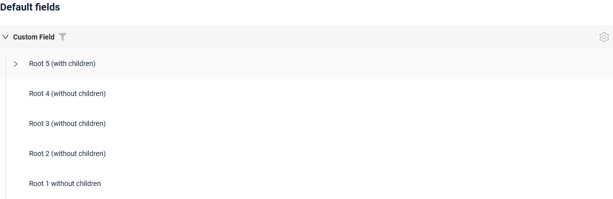
=== "Expanded"
    

###### How to add?
??? Example
    Lazy load is the standard behaviour of the widget and requires no additional settings, see [Basic](#Howtoaddbacis).

    The `isLeaf` flag defines whether the expand arrow is shown for a record. Calculate it in the corresponding **DataResponseDTO**.

    ```java
    --8<--
    {{ external_links.github_raw_doc }}/widgets/tree/base/defaultfields/MyExample3281DTO.java
    --8<--
    ```


##### <a id="more">More</a>
A Tree widget has no navigation arrows. Instead of the "next" arrow the last row of a node is the **`More`** button, which loads the next page of the node and appends it to the already loaded records. The limit selector (`availableLimitsList`) is moved to the gear menu of the widget.

The `More` button follows the same algorithm as the "next" arrow of the three pagination modes:

| Pagination mode              | When `More` is displayed                                                                      | Counter                                     |
|------------------------------|-----------------------------------------------------------------------------------------------|---------------------------------------------|
| `nextAndPreviousWithHasNext` | `hasNext` returned by the backend is `true`                                                     | not displayed                               |
| `nextAndPreviousWithCount`   | `count` is greater than the number of already loaded records                                    | how many records are left to load           |
| `nextAndPreviousSmart`       | the backend returned more records than the limit of the node                                    | not displayed                               |

see more [Pagination modes](/widget/type/property/pagination/pagination)

###### How does it look?
=== "nextAndPreviousWithHasNext"
    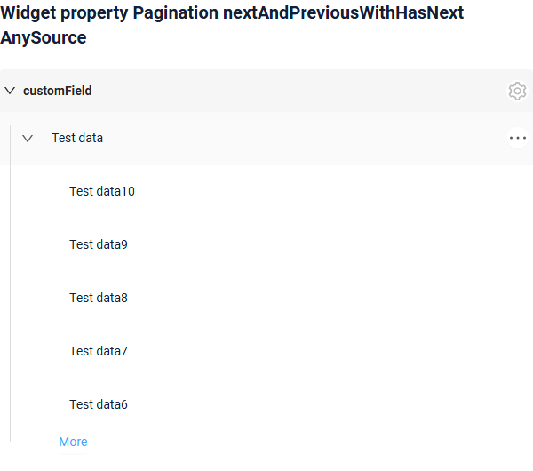
=== "nextAndPreviousWithCount"
    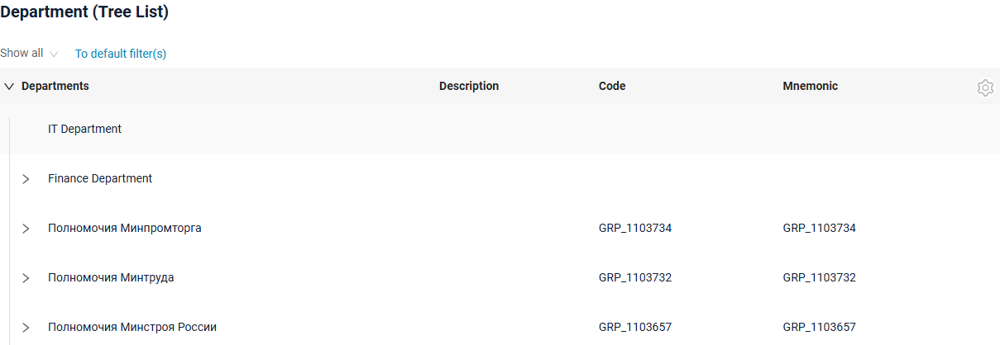
=== "nextAndPreviousSmart"
    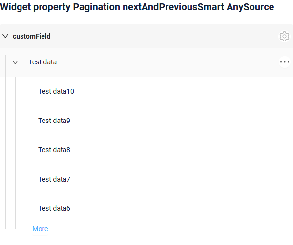

###### How to add?
??? Example
    === "nextAndPreviousWithHasNext"
        ```json
        --8<--
        {{ external_links.github_raw_doc }}/widgets/property/pagination/nextandpreviouswihhasnext/MyExample3860Tree.widget.json
        --8<--
        ```
        [:material-play-circle: Live Sample]({{ external_links.code_samples }}/ui/#/screen/myexample3861/view/myexample3860tree){:target="_blank"} ·
        [:fontawesome-brands-github: GitHub]({{ external_links.github_ui }}/{{ external_links.github_branch }}/src/main/java/org/demo/documentation/widgets/property/pagination/nextandpreviouswihhasnext){:target="_blank"}

    === "nextAndPreviousWithCount"
        ```json
        --8<--
        {{ external_links.github_raw_doc }}/widgets/property/pagination/nextandpreviouswithcount/MyExample3862Tree.widget.json
        --8<--
        ```
        [:material-play-circle: Live Sample]({{ external_links.code_samples }}/ui/#/screen/myexample3861/view/myexample3862tree){:target="_blank"} ·
        [:fontawesome-brands-github: GitHub]({{ external_links.github_ui }}/{{ external_links.github_branch }}/src/main/java/org/demo/documentation/widgets/property/pagination/nextandpreviouswithcount){:target="_blank"}

    === "nextAndPreviousSmart"
        ```json
        --8<--
        {{ external_links.github_raw_doc }}/widgets/property/pagination/nextandprevioussmart/MyExample3861Tree.widget.json
        --8<--
        ```
        [:material-play-circle: Live Sample]({{ external_links.code_samples }}/ui/#/screen/myexample3861/view/myexample3861tree){:target="_blank"} ·
        [:fontawesome-brands-github: GitHub]({{ external_links.github_ui }}/{{ external_links.github_branch }}/src/main/java/org/demo/documentation/widgets/property/pagination/nextandprevioussmart){:target="_blank"}

    === "availableLimitsList"
        The list of available limits is displayed in the gear menu of the widget.

        ```json
        --8<--
        {{ external_links.github_raw_doc }}/widgets/property/pagination/availablelimitselist/MyExample3867Tree.widget.json
        --8<--
        ```
        [:material-play-circle: Live Sample]({{ external_links.code_samples }}/ui/#/screen/myexample3861/view/myexample3867tree){:target="_blank"} ·
        [:fontawesome-brands-github: GitHub]({{ external_links.github_ui }}/{{ external_links.github_branch }}/src/main/java/org/demo/documentation/widgets/property/pagination/availablelimitselist){:target="_blank"}


##### Sorting
`Sorting` allows the user to sort the records by a column.
see [Sorting](/widget/type/property/sorting/sorting)

Sorting of a Tree widget works **inside a node**: the records are sorted among the children of the same parent, the hierarchy itself is not changed. In all other respects sorting is standard.

###### How does it look?
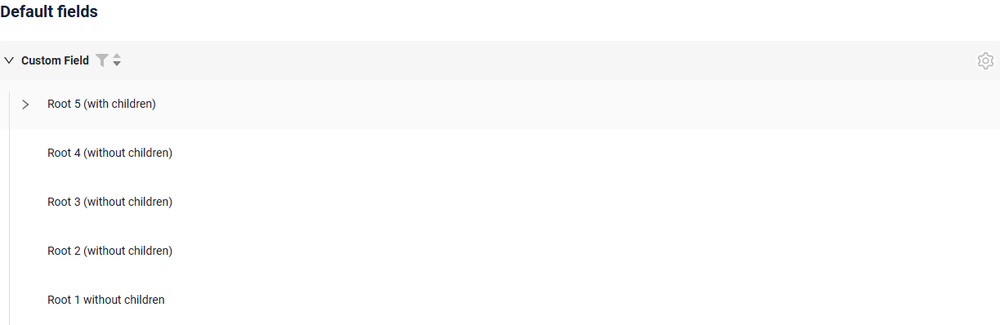


#### <a id="searchmodes">Search modes</a>
[:material-play-circle: Live Sample]({{ external_links.code_samples }}/ui/#/screen/myexample3616/view/myexample3614tree){:target="_blank"} ·
[:fontawesome-brands-github: GitHub]({{ external_links.github_ui }}/{{ external_links.github_branch }}/src/main/java/org/demo/documentation/widgets/property/filtration/fulltextsearch){:target="_blank"}

The way the result of filtration and full text search is displayed is defined by **options**.**tree**.**searchModes**.

There are two modes:

* `collapse` — **search results and tree**. The tree displays the found records together with the records that are required for navigation: the navigation path above every found record is restored `onFilterApplyNestLevel` levels up. The user can navigate through the tree, expand and collapse branches, see the neighbouring records and load additional records.
* `hide` — **search results only**. The tree displays only the found records, everything else is hidden. The user works with the search result only and cannot navigate through the other records of the tree.

Both modes can be available at the same time. The **first** item of the `searchModes` array is the mode that is active when the filter is applied; the user switches between the available modes in the widget.

**Restoring the path upwards**

In `collapse` mode the records whose parents have not been loaded yet are placed under a pseudo node. The `>...` button loads the missing parents with the request `?id.equals=<parentId>` and moves the records into the hierarchy. One click restores up to **2** levels of nesting, so for a deep hierarchy the button has to be pressed several times.

###### How does it look?
=== "Search results and tree (collapse)"
    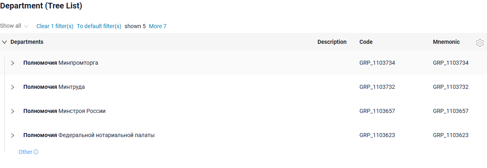
=== "Search results only (hide)"
    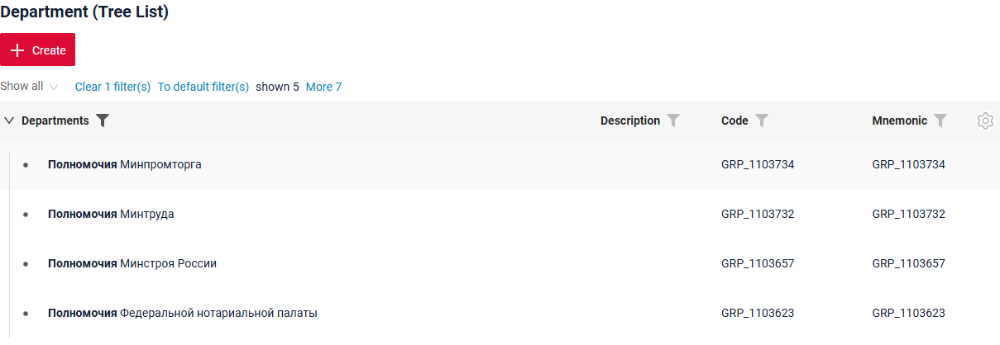
=== "Switching between modes"
    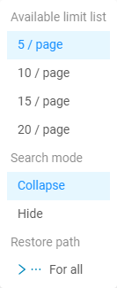

###### How to add?
??? Example
    **Step1** Add **options**.**tree**.**searchModes** to corresponding **_.widget.json_**.

    The first item of the array is the mode that is active when the filter is applied.

    ```
    "tree": {
      "searchModes": ["collapse", "hide"],
      "onFilterApplyNestLevel": 1
    }
    ```

    ```json
    --8<--
    {{ external_links.github_raw_doc }}/widgets/property/filtration/fulltextsearch/MyExample3614Tree.widget.json
    --8<--
    ```

    [:material-play-circle: Live Sample]({{ external_links.code_samples }}/ui/#/screen/myexample3616/view/myexample3614tree){:target="_blank"} ·
    [:fontawesome-brands-github: GitHub]({{ external_links.github_ui }}/{{ external_links.github_branch }}/src/main/java/org/demo/documentation/widgets/property/filtration/fulltextsearch){:target="_blank"}


#### <a id="noderefresh">Node refresh</a>
The difference from a [List widget](/widget/type/list/list) is **what is refreshed after an action**. A List widget refreshes the whole page, a Tree widget refreshes only the **node** the record belongs to:

* the row is updated from the response of the action or, if the response does not contain it, re-read with the request `?id.equals=<id>`;
* the row-meta of the row is requested again;
* if the record is not returned any more, the row is removed from the tree;
* the node is collapsed and its already loaded child records are forgotten, so they are loaded again on the next expand.

The position of a newly created row inside its node is defined by **options**.**tree**.**insertPosition**: `start` places it before the already loaded rows of the node, `end` places it after them. see [options.tree](#optionstree)

!!! info
    Sibling records and parent records are **not** refreshed automatically. If an action changes them, the backend must return **PostAction.refreshBC**. This is the **only** difference in the backend code between a List widget and a Tree widget.

    `refreshBC` collapses the whole tree, so the user starts from the root records again.


**Requests**
Because only the node is refreshed, a Tree widget performs fewer requests than a List widget.

| Action        | List widget                                                   | Tree widget                       |
|---------------|---------------------------------------------------------------|-----------------------------------|
| Delete        | `DELETE /data` + `GET /data` + `GET /row-meta` + `GET /count` | `DELETE /data` + `GET /row-meta`  |
| Save          | `PUT /data` + `GET /data` + `GET /row-meta` + `GET /count`    | `PUT /data` + `GET /row-meta`     |
| Cancel-create | `DELETE /data` + `GET /data` + `GET /row-meta` + `GET /count` | `DELETE /data` + `GET /row-meta`  |
