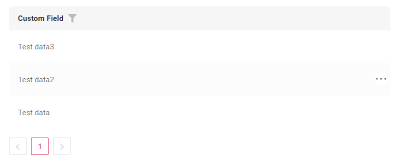
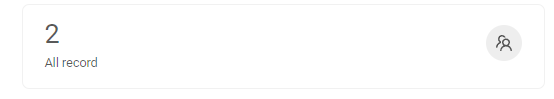

# Widgets
<!-- 
## Widget Type Family

AdditionalInfo
SuggestionPickList
DashboardList
 
LevelMenu
Steps 
-->


## Widget Types 
=== "AdditionalInfo"
    
=== "AdditionalList"
    
=== "AssocListPopup"
    
=== "EmptyWidget"
    
=== "FilePreview"
    
=== "Form"
    
=== "FormPopup"
    
=== "GroupingHierarchy"
    
=== "HeaderWidget"
    
=== "Info"
    
=== "List"
    
=== "PickListPopup"
    
=== "StatsBlock"
    

*   [AdditionalInfo widget](widget/type/additionalinfo/additionalinfo) is a component only for data viewing. Widget is always located **on the left**.
*   [AdditionalList widget](/widget/type/additionallist/additionallist) is list the general information for many records. Widget is always located **on the left**.
*   [AssocListPopup widget](/widget/type/assoclistpopup/assoclistpopup) is a popup component designed to the selection of multiple values.
*   [EmptyWidget widget](/widget/type/emptywidget/emptywidget) is a component for displaying text.
*   [FilePreview widget](/widget/type/filepreview/filepreview) is a component for file viewing. It always occupies 50% of the main screen area and stays fixed at the top while scrolling.
*   [Form widget](/widget/type/form/form) is a component for data viewing and editing.
*   [FormPopup widget](/widget/type/formpopup/formpopup) is a component for additional field checks in popup and the ability to add information inside the popup.
*   [GroupingHierarchy widget](/widget/type/groupinghierarchy/groupinghierarchy) presents shared information across multiple records, enabling rows to be grouped by one or more specified fields.
*   [HeaderWidget widget](/widget/type/headerwidget/headerwidget) is a component for displaying a header.
*   [Info widget](/widget/type/info/info) is a component only for data viewing.
*   [List widget](/widget/type/list/list) is list the general information for many records and present it in a way that is easily interpretable for users.
*   [PickListPopup widget](/widget/type/picklistpopup/picklistpopup) is a component that allows the user to select a value from a Popup list of entities.
*   [StatsBlock widget](/widget/type/statblocks/statblocks) is a tool designed to display aggregated data in a visually accessible format.

## Structure .widget.json

```json
{
  "name": "MyExampleForm",
  "title": "Title Form",
  "type": "Form",
  "bc": "myexample",
  "showCondition":{},
  "fields": [],
  "options": {}
}
```

* **"name"**

Description: This is a unique identifier for the show condition within the project.

Type: String(required).

Notes: This value must be unique across the project

* **"title"**

Description: Title for widget

Type: String(optional).

* **"type"**

The value for this widget is required to be "Form",

* **"bc"**

Description: [Business Component](/environment/businesscomponent/businesscomponent/)

Type: String(required).

*  **"showCondition"**

Description: Define the availability or visibility of the widget  dynamically. see more [showCondition](/widget/type/property/showcondition/showcondition)

Type: String(optional).

* **"fields"**

Description: Fields Configuration

Type: String(required).

* **"options"**

Description:  Defines the structure of the widget using rows and columns.

Type: String(required).
 